# Payment System - System Design Case Study

## 1. Problem Statement

Design a global payment processing system like Stripe, PayPal, or Square that can:
- Process millions of transactions per day with 99.99% success rate
- Handle multiple payment methods (cards, wallets, bank transfers)
- Ensure PCI compliance and data security
- Provide real-time fraud detection
- Support global currencies and regulations
- Maintain exactly-once payment semantics

### Real-World Context
- **Stripe**: Processes billions in payments for millions of businesses
- **PayPal**: 400M+ active accounts, $1.25 trillion payment volume
- **Square**: Powers payments for 4M+ sellers globally
- **Adyen**: Processes payments for enterprises like Uber, Spotify

## 2. Requirements Analysis

### Functional Requirements
1. **Payment Processing**
   - Credit/debit card payments
   - Digital wallets (Apple Pay, Google Pay)
   - Bank transfers (ACH, SEPA, wire)
   - Buy now, pay later options
   - Cryptocurrency payments

2. **Transaction Management**
   - Authorization and capture
   - Refunds and reversals
   - Recurring payments/subscriptions
   - Split payments and payouts
   - Multi-party payments

3. **Security & Compliance**
   - PCI DSS Level 1 compliance
   - 3D Secure authentication
   - Tokenization of sensitive data
   - End-to-end encryption
   - AML/KYC compliance

4. **Fraud Prevention**
   - Real-time risk scoring
   - Machine learning fraud detection
   - Velocity checks
   - Blacklist management
   - Manual review queues

5. **Merchant Services**
   - Onboarding and KYC
   - Dashboard and analytics
   - Webhook notifications
   - Settlement and payouts
   - Dispute management

### Non-Functional Requirements
- **Scale**: 100K+ transactions per second peak
- **Latency**: <200ms authorization response
- **Availability**: 99.99% uptime (52 minutes/year)
- **Consistency**: Zero payment loss or duplication
- **Security**: PCI DSS, SOC 2, ISO 27001 compliant
- **Global**: Multi-region, multi-currency support

### Axiom Mapping
- **Axiom 1 (Latency)**: Sub-200ms payment authorization
- **Axiom 2 (Capacity)**: Bounded queue sizes prevent overload
- **Axiom 3 (Failure)**: Graceful degradation on component failure
- **Axiom 4 (Concurrency)**: Distributed locking for payment idempotency
- **Axiom 5 (Coordination)**: Saga pattern for distributed transactions
- **Axiom 6 (Observability)**: Complete audit trail for every cent
- **Axiom 7 (Interface)**: Simple, secure merchant APIs
- **Axiom 8 (Economics)**: Optimize for transaction cost efficiency

## 3. Architecture Evolution

### Stage 1: Basic Payment Gateway (1K TPS)


### Stage 2: Distributed Payment Platform (10K TPS)


### Stage 3: Global Scale Architecture (100K+ TPS)


## 4. Detailed Component Design

### 4.1 Payment Orchestrator


**Payment Orchestration Flow**

| Stage | Component | Purpose | Timeout |
|-------|-----------|---------|----------|
| Idempotency Check | Cache | Prevent duplicate charges | 50ms |
| Risk Assessment | Risk Engine | Fraud prevention | 200ms |
| Provider Selection | Router | Optimal routing | 10ms |
| 3DS Authentication | Provider | Strong authentication | 30s |
| Authorization | Provider | Reserve funds | 5s |
| Ledger Update | Database | Record transaction | 100ms |

**Provider Routing Rules**

| Payment Method | Routing Logic | Provider Selection |
|----------------|---------------|--------------------|
| Visa Card | Brand-based | Stripe |
| Mastercard | Brand-based | Adyen |
| Apple Pay | Wallet type | Apple Pay provider |
| US Bank Transfer | Geographic | Plaid |
| EU Bank Transfer | Geographic | Mollie |
| International | Default | Wise |

**Retry Strategy Configuration**


### 4.2 Distributed Ledger System


**Ledger Entry Structure**

| Field | Type | Purpose | Example |
|-------|------|---------|----------|
| journal_id | UUID | Links related entries | 123e4567-e89b |
| account_id | String | Account identifier | merchant_12345 |
| debit | Decimal | Debit amount | 100.00 |
| credit | Decimal | Credit amount | 0.00 |
| currency | String | ISO currency code | USD |
| exchange_rate | Decimal | FX rate if applicable | 1.0 |
| metadata | JSON | Additional info | {"order_id": "xyz"} |

**Double-Entry Examples**

| Transaction Type | Account | Debit | Credit |
|------------------|---------|-------|--------|
| **Customer Payment** | | | |
| | Customer Liability | 100.00 | 0.00 |
| | Merchant Receivable | 0.00 | 97.00 |
| | Platform Fee Revenue | 0.00 | 3.00 |
| **Merchant Payout** | | | |
| | Merchant Receivable | 97.00 | 0.00 |
| | Bank Account | 0.00 | 97.00 |

**Reconciliation Process**


### 4.3 Real-time Fraud Detection


**Feature Categories & Weights**

| Feature Category | Examples | Weight | Update Frequency |
|------------------|----------|--------|------------------|
| **Transaction** | Amount, merchant type, time | 25% | Real-time |
| **Historical** | Avg spend, transaction count | 30% | Hourly batch |
| **Velocity** | Transactions/min, unique cards | 25% | Real-time |
| **Device/Location** | New device, distance traveled | 20% | Per request |

**ML Model Ensemble**


**Velocity Counter Implementation**

| Counter Type | Key Pattern | TTL | Purpose |
|--------------|-------------|-----|----------|
| Minute Counter | velocity:user:{id}:1m | 60s | Burst detection |
| Hour Counter | velocity:user:{id}:1h | 3600s | Rate limiting |
| Daily Amount | velocity:user:{id}:amount:1d | 86400s | Spending limits |
| Failed Attempts | velocity:user:{id}:failed:1h | 3600s | Attack detection |

**Risk Scoring Thresholds**


### 4.4 Payment Routing and Failover


**Provider Selection Criteria**

| Factor | Weight | Calculation | Example |
|--------|--------|-------------|----------|
| Success Rate | 50% | Successful/Total | 98.5% → 98.5 points |
| Latency | 30% | 100 - (ms/10) | 200ms → 80 points |
| Cost | 20% | 100 - (cost% × 10) | 2.9% → 71 points |
| **Total Score** | 100% | Weighted Sum | 88.8 points |

**Failover Decision Matrix**


**Health Monitoring Configuration**

| Metric | Threshold | Window | Action |
|--------|-----------|--------|--------|
| Error Rate | > 5% | 5 min | Mark degraded |
| Timeout Rate | > 10% | 5 min | Reduce traffic |
| Success Rate | < 95% | 15 min | Temporary exclude |
| Recovery | > 99% | 10 min | Restore traffic |

### 4.5 Settlement and Reconciliation


**Settlement Calculation**

| Component | Calculation | Example |
|-----------|-------------|----------|
| Gross Amount | Sum of transactions | $10,000 |
| Processing Fee | 2.9% + $0.30 per txn | $290 + $30 = $320 |
| Platform Fee | 0.5% of gross | $50 |
| Refunds/Chargebacks | Deductions | -$100 |
| **Net Settlement** | Gross - All Fees | $9,530 |

**Settlement States**


**Reconciliation Process**


**Reconciliation Report Structure**

| Section | Content | Action Required |
|---------|---------|------------------|
| **Summary** | Total settlements: 150<br/>Matched: 148<br/>Unmatched: 2 | Review unmatched |
| **Discrepancies** | Amount differences<br/>Timing differences | Investigate |
| **Unmatched Settlements** | Missing bank confirmation | Contact bank |
| **Unmatched Bank Txns** | Unknown deposits | Research source |

## 5. Advanced Features

### 5.1 Multi-Currency Support

```mermaid
graph LR
    subgraph "Currency Flow"
        C1[Customer<br/>EUR €100]
        FX[FX Engine]
        M1[Merchant<br/>USD $110]
    end
    
    subgraph "Rate Components"
        MR[Mid Rate: 1.12]
        PS[Payment Spread: 2%]
        PF[Platform Fee: 0.5%]
    end
    
    subgraph "Calculation"
        CALC[100 × 1.12 = $112<br/>- Spread: $2.24<br/>- Fee: $0.56<br/>= $109.20]
    end
    
    C1 --> FX
    MR & PS & PF --> FX
    FX --> CALC
    CALC --> M1
    
    style FX fill:#4ecdc4
    style CALC fill:#ffd93d
```



**Currency Conversion Configuration**

| Parameter | Value | Purpose |
|-----------|-------|---------|  
| Rate Cache TTL | 60s | Balance freshness vs API calls |
| Spread Types | Payment: 2%<br/>Payout: 2.5% | Different margins per flow |
| Hedging Threshold | $10,000 | Auto-hedge large exposures |
| Rate Sources | Primary: Reuters<br/>Backup: XE | Redundancy |

**FX Rate Management**


**Currency Exposure Dashboard**

| Currency Pair | Net Exposure | Hedged | Unhedged Risk |
|---------------|--------------|---------|---------------|
| EUR/USD | +$2.5M | $2.0M | $0.5M |
| GBP/USD | -$1.2M | $1.0M | $0.2M |
| JPY/USD | +$0.8M | $0.5M | $0.3M |
| **Total Risk** | | | **$1.0M** |

### 5.2 Subscription and Recurring Payments


**Subscription Configuration**

| Parameter | Options | Example |
|-----------|---------|----------|
| **Billing Interval** | Daily, Weekly, Monthly, Yearly | Monthly |
| **Trial Period** | 0-90 days | 14 days |
| **Retry Strategy** | Immediate, Daily, Smart | Smart (1, 3, 5, 7 days) |
| **Proration** | Enabled/Disabled | Enabled |
| **Auto-collection** | On/Off | On |

**Subscription Payment Flow**


**Retry Strategy Matrix**

| Attempt | Delay | Action | Customer Notice |
|---------|-------|--------|------------------|
| 1 | Immediate | Retry same card | None |
| 2 | 1 day | Retry + email | Payment failed email |
| 3 | 3 days | Retry + in-app | Update payment method |
| 4 | 5 days | Retry + SMS | Service interruption warning |
| 5 | 7 days | Final retry | Suspension notice |
| 6+ | - | Suspend service | Subscription suspended |

**Subscription Metrics Dashboard**


### 5.3 Complex Payment Flows

```mermaid
graph TB
    subgraph "Marketplace Payment Saga"
        S1[1. Authorize Buyer Payment]
        S2[2. Calculate Splits]
        S3[3. Hold Marketplace Fee]
        S4[4. Transfer to Sellers]
        S5[5. Capture Payment]
        S6[6. Update Ledger]
    end
    
    subgraph "Compensation Actions"
        C1[Void Authorization]
        C2[Release Hold]
        C3[Reverse Transfers]
        C4[Refund Payment]
    end
    
    S1 --> S2
    S2 --> S3
    S3 --> S4
    S4 --> S5
    S5 --> S6
    
    S1 -.->|On Failure| C1
    S3 -.->|On Failure| C2
    S4 -.->|On Failure| C3
    S5 -.->|On Failure| C4
    
    style S1 fill:#4ecdc4
    style C1 fill:#ff6b6b
```

**Marketplace Payment Flow Example**

| Step | Action | Amount | Status | Compensation |
|------|--------|--------|--------|---------------|
| 1 | Authorize buyer | $100 | ✅ Success | Void auth |
| 2 | Calculate splits | - | ✅ Success | None |
| 3 | Hold platform fee | $10 | ✅ Success | Release hold |
| 4a | Transfer to Seller A | $60 | ✅ Success | Reverse transfer |
| 4b | Transfer to Seller B | $30 | ❌ Failed | - |
| 5 | Compensation started | - | 🔄 Running | - |

**Saga State Machine**

```mermaid
stateDiagram-v2
    [*] --> Initiated: Start Saga
    Initiated --> Running: Begin Execution
    
    Running --> Running: Execute Steps
    Running --> Compensating: Step Failed
    Running --> Completed: All Steps Success
    
    Compensating --> Compensating: Undo Steps
    Compensating --> Compensated: All Undone
    Compensating --> PartiallyCompensated: Some Failed
    
    Completed --> [*]
    Compensated --> [*]
    PartiallyCompensated --> ManualIntervention
```

**Complex Flow Types**

```mermaid
graph LR
    subgraph "Split Payments"
        SP1[Customer $100]
        SP2[Platform $10]
        SP3[Seller A $60]
        SP4[Seller B $30]
    end
    
    subgraph "Escrow Payments"
        EP1[Hold Funds]
        EP2[Fulfill Conditions]
        EP3[Release Funds]
    end
    
    subgraph "Installments"
        IP1[Initial Payment]
        IP2[Monthly Charge]
        IP3[Final Payment]
    end
    
    SP1 --> SP2 & SP3 & SP4
    EP1 --> EP2 --> EP3
    IP1 --> IP2 --> IP3
    
    style SP1 fill:#4ecdc4
    style EP1 fill:#ffd93d
    style IP1 fill:#95e1d3
```

**Saga Monitoring Dashboard**

| Metric | Value | Threshold | Status |
|--------|-------|-----------|--------|
| Success Rate | 98.5% | > 95% | 🟢 Good |
| Avg Duration | 2.3s | < 5s | 🟢 Good |
| Compensation Rate | 0.8% | < 2% | 🟢 Good |
| Partial Failures | 12/day | < 50/day | 🟢 Good |
| Manual Interventions | 2/week | < 10/week | 🟢 Good |

## 6. Performance Optimizations

### 6.1 Connection Pooling and Circuit Breaking

```mermaid
graph TB
    subgraph "Connection Pool"
        CP[Connection Pool<br/>Max: 100 connections]
        C1[Active Connection 1]
        C2[Active Connection 2]
        CN[Active Connection N]
        CQ[Connection Queue]
    end
    
    subgraph "Circuit Breaker States"
        CLOSED[Closed<br/>Normal Operation]
        OPEN[Open<br/>Failing Fast]
        HALF[Half-Open<br/>Testing Recovery]
    end
    
    subgraph "Request Flow"
        REQ[Incoming Request]
        CB[Circuit Breaker Check]
        POOL[Get Connection]
        EXEC[Execute Request]
    end
    
    REQ --> CB
    CB -->|Closed| POOL
    CB -->|Open| FAIL[Immediate Failure]
    POOL --> EXEC
    
    CLOSED -->|Failures > 5| OPEN
    OPEN -->|After 60s| HALF
    HALF -->|Success| CLOSED
    HALF -->|Failure| OPEN
    
    style CLOSED fill:#4ecdc4
    style OPEN fill:#ff6b6b
    style HALF fill:#ffd93d
```

**Connection Pool Configuration**

| Provider | Max Connections | Per Host Limit | TTL | DNS Cache |
|----------|-----------------|----------------|-----|------------|
| Stripe | 100 | 50 | 300s | 300s |
| Adyen | 80 | 40 | 300s | 300s |
| PayPal | 120 | 60 | 300s | 300s |
| Default | 50 | 25 | 300s | 300s |

**Circuit Breaker Configuration**

```mermaid
sequenceDiagram
    participant C as Client
    participant CB as Circuit Breaker
    participant P as Provider
    
    Note over CB: State: CLOSED
    
    loop Normal Operation
        C->>CB: Request
        CB->>P: Forward Request
        P-->>CB: Success
        CB-->>C: Response
    end
    
    loop Failures Accumulate
        C->>CB: Request
        CB->>P: Forward Request
        P-->>CB: Error
        CB-->>C: Error
        Note over CB: Failures: 1, 2, 3, 4, 5
    end
    
    Note over CB: State: OPEN
    
    C->>CB: Request
    CB-->>C: Fail Fast (Circuit Open)
    
    Note over CB: Wait 60 seconds...
    Note over CB: State: HALF_OPEN
    
    C->>CB: Test Request
    CB->>P: Forward Request
    P-->>CB: Success
    CB-->>C: Response
    
    Note over CB: State: CLOSED
```

**Request Coalescing**

| Scenario | Behavior | Benefit |
|----------|----------|----------|
| Duplicate requests | Return same response | Prevent double charges |
| Concurrent identical | Share single request | Reduce provider load |
| Idempotent operations | Cache for duration | Improve performance |

### 6.2 Caching Strategy

```mermaid
graph TB
    subgraph "Cache Hierarchy"
        L1[L1: Local Cache<br/>10K entries<br/>~1μs]
        L2[L2: Redis Cache<br/>Distributed<br/>~1ms]
        L3[L3: Database<br/>Persistent<br/>~10ms]
    end
    
    subgraph "Cache Patterns"
        CA[Cache Aside<br/>Lazy Loading]
        WT[Write Through<br/>Sync Updates]
        WB[Write Behind<br/>Async Updates]
    end
    
    subgraph "Data Types"
        PM[Payment Methods<br/>TTL: 1 hour]
        MC[Merchant Config<br/>TTL: 5 min]
        FX[Exchange Rates<br/>TTL: 1 min]
        RS[Risk Scores<br/>TTL: 24 hours]
    end
    
    L1 --> L2 --> L3
    CA --> PM & MC
    WT --> FX
    WB --> RS
    
    style L1 fill:#4ecdc4
    style L2 fill:#ffd93d
    style L3 fill:#95e1d3
```

**Cache Configuration Matrix**

| Data Type | Local Cache | Redis TTL | Pattern | Hit Rate Target |
|-----------|-------------|-----------|---------|------------------|
| Payment Methods | 10K entries | 3600s | Cache Aside | > 95% |
| Merchant Config | 1K entries | 300s | Cache Aside | > 90% |
| Exchange Rates | 100 entries | 60s | Write Through | > 99% |
| Risk Scores | 50K entries | 86400s | Write Behind | > 80% |

**Cache Performance Metrics**

```mermaid
sequenceDiagram
    participant R as Request
    participant L1 as Local Cache
    participant L2 as Redis
    participant DB as Database
    
    R->>L1: Get Payment Method
    
    alt L1 Hit (95%)
        L1-->>R: Return (1μs)
    else L1 Miss
        L1->>L2: Check Redis
        
        alt L2 Hit (4%)
            L2-->>L1: Data
            L1->>L1: Update Local
            L1-->>R: Return (1ms)
        else L2 Miss (1%)
            L2->>DB: Query
            DB-->>L2: Data
            L2->>L2: Cache with TTL
            L2-->>L1: Data
            L1->>L1: Update Local
            L1-->>R: Return (10ms)
        end
    end
```

**Cache Invalidation Strategy**

| Event | Action | Scope |
|-------|--------|-------|
| Payment method updated | Invalidate L1+L2 | Specific key |
| Merchant config change | Broadcast invalidation | All nodes |
| FX rate update | Overwrite with new | All instances |
| Risk model retrain | Bulk invalidation | Pattern match |

## 7. Security Implementation

### 7.1 PCI Compliance and Tokenization

```mermaid
graph TB
    subgraph "PCI Scope Reduction"
        BROWSER[Customer Browser]
        IFRAME[Secure iFrame]
        VAULT[Token Vault]
        MERCHANT[Merchant Server]
    end
    
    subgraph "Tokenization Flow"
        CARD[Card Number:<br/>4111-1111-1111-1111]
        HSM[HSM Encryption]
        TOKEN[Token:<br/>tok_1234567890]
        STORE[Encrypted Storage]
    end
    
    subgraph "Security Layers"
        TLS[TLS 1.3]
        AES[AES-256-GCM]
        AUDIT[Audit Logging]
    end
    
    BROWSER -->|Never touches merchant| IFRAME
    IFRAME -->|Direct to vault| VAULT
    VAULT -->|Only token| MERCHANT
    
    CARD --> HSM
    HSM --> TOKEN
    TOKEN --> STORE
    
    style VAULT fill:#ff6b6b
    style HSM fill:#4ecdc4
    style MERCHANT fill:#95e1d3
```

**PCI Compliance Levels**

| Level | Transaction Volume | Requirements |
|-------|-------------------|---------------|
| Level 1 | > 6M transactions/year | Annual onsite audit |
| Level 2 | 1M - 6M transactions/year | Annual self-assessment |
| Level 3 | 20K - 1M transactions/year | Annual self-assessment |
| Level 4 | < 20K transactions/year | Annual self-assessment |

**Tokenization Architecture**

```mermaid
sequenceDiagram
    participant C as Customer
    participant SF as Secure Form
    participant TS as Token Service
    participant HSM as HSM
    participant TV as Token Vault
    participant M as Merchant
    
    C->>SF: Enter Card Details
    SF->>TS: Card Number (TLS)
    TS->>TS: Validate Card
    TS->>HSM: Generate Token
    HSM-->>TS: Unique Token
    TS->>HSM: Encrypt PAN
    HSM-->>TS: Encrypted PAN
    TS->>TV: Store Mapping
    TS-->>SF: Return Token
    SF-->>M: Token Only
    
    Note over M: Merchant never sees card number
```

**Token Format & Security**

| Component | Example | Purpose |
|-----------|---------|---------|  
| Prefix | tok_ | Identify token type |
| Version | 1 | Token format version |
| Random ID | 2FqH8Kxp9... | Unique identifier |
| Checksum | a7b3 | Validate token integrity |
| **Full Token** | tok_12FqH8Kxp9...a7b3 | Safe to store |

**Security Controls**

```mermaid
graph LR
    subgraph "Data Protection"
        E1[Encryption at Rest<br/>AES-256]
        E2[Encryption in Transit<br/>TLS 1.3]
        E3[Key Management<br/>HSM/KMS]
    end
    
    subgraph "Access Control"
        A1[Role-Based Access]
        A2[API Key Authentication]
        A3[IP Whitelisting]
    end
    
    subgraph "Monitoring"
        M1[Access Logs]
        M2[Anomaly Detection]
        M3[Compliance Reports]
    end
    
    E1 & E2 & E3 --> SECURE[PCI DSS Compliant]
    A1 & A2 & A3 --> SECURE
    M1 & M2 & M3 --> SECURE
    
    style SECURE fill:#66bb6a
```

### 7.2 End-to-End Encryption

```mermaid
sequenceDiagram
    participant S as Sender
    participant KE as Key Exchange
    participant E as Encryption
    participant N as Network
    participant D as Decryption
    participant R as Recipient
    
    S->>KE: Generate Ephemeral Keys
    KE->>KE: ECDH Key Agreement
    KE->>E: Derive Shared Secret
    
    S->>E: Payment Data
    E->>E: AES-256-GCM Encrypt
    E->>N: Encrypted Payload
    
    Note over N: Only encrypted data in transit
    
    N->>D: Encrypted Payload
    R->>D: Private Key
    D->>D: Derive Shared Secret
    D->>D: AES-256-GCM Decrypt
    D->>R: Payment Data
```

**E2E Encryption Components**

| Component | Algorithm | Purpose | Key Size |
|-----------|-----------|---------|----------|
| Key Exchange | ECDH (P-256) | Establish shared secret | 256 bits |
| Symmetric Encryption | AES-GCM | Encrypt payment data | 256 bits |
| Key Derivation | HKDF-SHA256 | Derive encryption key | 256 bits |
| Authentication | HMAC-SHA256 | Message integrity | 256 bits |

**Encryption Flow Diagram**

```mermaid
graph TB
    subgraph "Sender Side"
        PD[Payment Data]
        EPK[Ephemeral Key Pair]
        SS1[Shared Secret]
        EK1[Encryption Key]
        CT[Ciphertext]
    end
    
    subgraph "Transit"
        PACK[Encrypted Package:<br/>- Ephemeral Public Key<br/>- Ciphertext<br/>- Auth Tag]
    end
    
    subgraph "Recipient Side"
        RPK[Recipient Private Key]
        SS2[Shared Secret]
        EK2[Encryption Key]
        PT[Plaintext]
    end
    
    PD --> EK1
    EPK --> SS1
    SS1 --> EK1
    EK1 --> CT
    CT --> PACK
    
    PACK --> SS2
    RPK --> SS2
    SS2 --> EK2
    EK2 --> PT
    
    style PACK fill:#ff6b6b
    style CT fill:#4ecdc4
    style PT fill:#66bb6a
```

**Security Properties**

| Property | Description | Benefit |
|----------|-------------|----------|
| **Forward Secrecy** | New keys each session | Past data stays secure |
| **Non-repudiation** | Digital signatures | Proof of transaction |
| **Integrity** | AEAD encryption | Tamper detection |
| **Confidentiality** | Strong encryption | Data privacy |

## 7. Consistency Deep Dive for Payment Systems

### 7.1 ACID Guarantees in Distributed Payments
```python
class DistributedPaymentConsistency:
    """Ensures ACID properties across distributed payment operations"""
    
    def __init__(self):
        self.transaction_coordinator = TwoPhaseCommitCoordinator()
        self.saga_orchestrator = SagaOrchestrator()
        self.consistency_monitor = ConsistencyMonitor()
        
    async def execute_payment_transaction(self, payment: PaymentRequest) -> TransactionResult:
        """Execute payment with distributed ACID guarantees"""
        
        # Start distributed transaction
        tx_id = await self.transaction_coordinator.begin_transaction()
        
        try:
            # Phase 1: Prepare all participants
            prepare_results = await asyncio.gather(
                self._prepare_debit(tx_id, payment.source_account, payment.amount),
                self._prepare_credit(tx_id, payment.dest_account, payment.amount),
                self._prepare_ledger_entry(tx_id, payment),
                self._prepare_fraud_check(tx_id, payment)
            )
            
            # Check if all participants voted to commit
            if all(result.can_commit for result in prepare_results):
                # Phase 2: Commit
                await self.transaction_coordinator.commit(tx_id)
                return TransactionResult(success=True, tx_id=tx_id)
            else:
                # Abort transaction
                await self.transaction_coordinator.abort(tx_id)
                return TransactionResult(success=False, reason="Prepare phase failed")
                
        except Exception as e:
            # Ensure cleanup on any failure
            await self.transaction_coordinator.abort(tx_id)
            raise
    
    async def _prepare_debit(self, tx_id: str, account: str, amount: Decimal) -> PrepareResult:
        """Prepare debit with pessimistic locking"""
        
        async with self.get_account_lock(account):
            # Check balance
            balance = await self.get_balance(account)
            if balance < amount:
                return PrepareResult(can_commit=False, reason="Insufficient funds")
            
            # Reserve funds
            await self.reserve_funds(tx_id, account, amount)
            return PrepareResult(can_commit=True)
```

### 7.2 Saga Pattern for Long-Running Transactions
```python
class PaymentSaga:
    """Implements Saga pattern for complex payment workflows"""
    
    def __init__(self):
        self.steps = [
            SagaStep("validate_payment", self.validate_payment, self.cancel_validation),
            SagaStep("reserve_funds", self.reserve_funds, self.release_funds),
            SagaStep("process_payment", self.process_payment, self.refund_payment),
            SagaStep("update_ledger", self.update_ledger, self.reverse_ledger),
            SagaStep("notify_merchant", self.notify_merchant, self.cancel_notification)
        ]
        
    async def execute(self, payment: PaymentRequest) -> SagaResult:
        """Execute payment saga with automatic compensation"""
        
        completed_steps = []
        saga_context = SagaContext(payment_id=payment.id)
        
        try:
            # Forward execution
            for step in self.steps:
                result = await step.execute(saga_context, payment)
                
                if not result.success:
                    # Trigger compensation
                    await self._compensate(completed_steps, saga_context)
                    return SagaResult(
                        success=False,
                        failed_step=step.name,
                        compensation_completed=True
                    )
                    
                completed_steps.append(step)
                saga_context.add_result(step.name, result)
            
            return SagaResult(success=True, context=saga_context)
            
        except Exception as e:
            # Compensate on any error
            await self._compensate(completed_steps, saga_context)
            raise
    
    async def _compensate(self, completed_steps: List[SagaStep], context: SagaContext):
        """Execute compensation in reverse order"""
        
        for step in reversed(completed_steps):
            try:
                await step.compensate(context)
            except Exception as e:
                # Log compensation failure but continue
                logger.error(f"Compensation failed for {step.name}: {e}")
                # Might need manual intervention
                await self._alert_operations(step.name, context, e)
```

### 7.3 Eventual Consistency in Settlement
```python
class SettlementConsistencyManager:
    """Manages eventual consistency for payment settlements"""
    
    def __init__(self):
        self.settlement_queue = DistributedQueue()
        self.reconciliation_engine = ReconciliationEngine()
        self.consistency_checker = ConsistencyChecker()
        
    async def process_settlement_batch(self, batch_id: str):
        """Process settlements with eventual consistency"""
        
        # Get transactions for settlement
        transactions = await self.get_pending_transactions(batch_id)
        
        # Group by merchant for efficiency
        merchant_groups = self._group_by_merchant(transactions)
        
        # Process each merchant's settlements
        settlement_futures = []
        for merchant_id, txns in merchant_groups.items():
            future = self._settle_merchant_transactions(
                merchant_id, 
                txns,
                batch_id
            )
            settlement_futures.append(future)
        
        # Wait for all settlements (eventual consistency)
        results = await asyncio.gather(*settlement_futures, return_exceptions=True)
        
        # Handle any failures
        failed_settlements = [
            (merchant_id, result) 
            for merchant_id, result in zip(merchant_groups.keys(), results)
            if isinstance(result, Exception)
        ]
        
        if failed_settlements:
            # Queue for retry
            for merchant_id, error in failed_settlements:
                await self.settlement_queue.enqueue(
                    SettlementRetry(
                        merchant_id=merchant_id,
                        batch_id=batch_id,
                        attempt=1,
                        error=str(error)
                    )
                )
        
        # Start reconciliation process
        await self.reconciliation_engine.reconcile_batch(batch_id)
```

### 7.4 Strong Consistency for Critical Operations
```python
class CriticalPaymentOperations:
    """Implements strong consistency for critical payment operations"""
    
    def __init__(self, consensus_engine: RaftConsensus):
        self.consensus = consensus_engine
        self.state_machine = PaymentStateMachine()
        
    async def update_merchant_fee_structure(self, 
                                          merchant_id: str,
                                          new_fees: FeeStructure) -> bool:
        """Update fees with linearizable consistency"""
        
        # Create proposal for consensus
        proposal = FeeUpdateProposal(
            merchant_id=merchant_id,
            new_fees=new_fees,
            effective_date=datetime.utcnow(),
            version=await self._get_current_version(merchant_id) + 1
        )
        
        # Submit to consensus
        result = await self.consensus.propose(proposal)
        
        if result.committed:
            # Apply to state machine
            self.state_machine.apply_fee_update(proposal)
            
            # Ensure all replicas have the update
            await self._wait_for_replication(proposal)
            
            return True
        
        return False
    
    async def create_payment_account(self, account_details: AccountDetails) -> Account:
        """Create account with strong consistency across all nodes"""
        
        # Generate unique account ID
        account_id = await self._generate_unique_account_id()
        
        # Prepare account creation
        proposal = AccountCreationProposal(
            account_id=account_id,
            details=account_details,
            created_at=datetime.utcnow()
        )
        
        # Use consensus for creation
        result = await self.consensus.propose(proposal)
        
        if not result.committed:
            raise ConsistencyError("Failed to achieve consensus on account creation")
        
        # Wait for all nodes to acknowledge
        await self._wait_for_all_nodes(account_id)
        
        return Account(id=account_id, **account_details.dict())
```

### 7.5 Read-After-Write Consistency
```python
class PaymentReadConsistency:
    """Ensures users see their own payment operations immediately"""
    
    def __init__(self):
        self.write_cache = WriteCache(ttl=300)  # 5 minutes
        self.read_router = ReadRouter()
        
    async def process_payment_with_read_consistency(self, 
                                                   user_id: str,
                                                   payment: PaymentRequest) -> PaymentResult:
        """Process payment ensuring read-after-write consistency"""
        
        # Process payment
        result = await self._process_payment_internal(payment)
        
        if result.success:
            # Cache the write for immediate reads
            cache_entry = PaymentCacheEntry(
                payment_id=result.payment_id,
                user_id=user_id,
                status=result.status,
                amount=payment.amount,
                timestamp=datetime.utcnow()
            )
            
            await self.write_cache.set(
                key=f"payment:{result.payment_id}",
                value=cache_entry,
                user_context=user_id
            )
            
            # Also cache by user for listing
            await self.write_cache.append_to_list(
                key=f"user_payments:{user_id}",
                value=result.payment_id,
                user_context=user_id
            )
        
        return result
    
    async def get_payment_status(self, user_id: str, payment_id: str) -> PaymentStatus:
        """Get payment status with read-after-write guarantee"""
        
        # First check write cache
        cached = await self.write_cache.get(
            key=f"payment:{payment_id}",
            user_context=user_id
        )
        
        if cached:
            return cached.status
        
        # Route read to appropriate replica
        replica = self.read_router.get_replica_for_user(user_id)
        
        # Read with consistency token
        return await replica.get_payment_status(
            payment_id,
            consistency_token=self._get_user_consistency_token(user_id)
        )
```

### 7.6 Consistency Monitoring and Reconciliation
```python
class PaymentConsistencyMonitor:
    """Monitor and ensure consistency across payment systems"""
    
    def __init__(self):
        self.metrics = ConsistencyMetrics()
        self.reconciler = PaymentReconciler()
        self.alert_manager = AlertManager()
        
    async def continuous_consistency_check(self):
        """Continuously monitor payment consistency"""
        
        while True:
            try:
                # Check ledger consistency
                ledger_issues = await self._check_ledger_consistency()
                if ledger_issues:
                    await self._handle_ledger_inconsistencies(ledger_issues)
                
                # Check payment state consistency
                payment_issues = await self._check_payment_states()
                if payment_issues:
                    await self._handle_payment_inconsistencies(payment_issues)
                
                # Check settlement consistency
                settlement_issues = await self._check_settlement_consistency()
                if settlement_issues:
                    await self._handle_settlement_inconsistencies(settlement_issues)
                
                # Record metrics
                self.metrics.record_consistency_check(
                    ledger_issues=len(ledger_issues),
                    payment_issues=len(payment_issues),
                    settlement_issues=len(settlement_issues)
                )
                
            except Exception as e:
                logger.error(f"Consistency check failed: {e}")
                await self.alert_manager.send_critical_alert(
                    "Consistency monitoring failure",
                    details=str(e)
                )
            
            await asyncio.sleep(60)  # Check every minute
    
    async def _check_ledger_consistency(self) -> List[LedgerInconsistency]:
        """Verify double-entry bookkeeping consistency"""
        
        issues = []
        
        # Sample recent transactions
        transactions = await self.get_recent_transactions(minutes=5)
        
        for tx in transactions:
            # Verify debits equal credits
            debits = sum(entry.amount for entry in tx.entries if entry.type == 'debit')
            credits = sum(entry.amount for entry in tx.entries if entry.type == 'credit')
            
            if debits != credits:
                issues.append(LedgerInconsistency(
                    transaction_id=tx.id,
                    debit_total=debits,
                    credit_total=credits,
                    difference=abs(debits - credits)
                ))
        
        return issues
```

### 7.7 Consistency Trade-offs in Payment Systems

| Operation | Consistency Model | Rationale |
|-----------|------------------|-----------||
| **Payment Authorization** | Strong Consistency | Must prevent double-spending |
| **Balance Updates** | Linearizable | Critical for accurate balance |
| **Transaction History** | Read-After-Write | Users must see their own transactions |
| **Settlement Processing** | Eventual Consistency | Can tolerate delays for efficiency |
| **Merchant Analytics** | Eventual Consistency | Aggregate data can be slightly stale |
| **Fee Structure Updates** | Strong Consistency | Must be consistent across all nodes |
| **Fraud Scoring** | Bounded Staleness | Recent data is sufficient |
| **Notification Delivery** | At-Least-Once | Better to over-notify than miss |

## 8. Failure Scenarios

### 8.1 Network Partition Handling
```python
class PartitionTolerantPaymentService:
    """Handle network partitions gracefully"""
    
    async def process_with_partition_tolerance(self, 
                                             payment: PaymentRequest) -> PaymentResult:
        """Process payment with partition tolerance"""
        
        # Try primary region
        try:
            return await self.primary_region.process(payment)
        except NetworkPartitionError:
            logger.warning("Primary region unreachable, failing over")
        
        # Check if payment requires strong consistency
        if payment.requires_strong_consistency:
            # Cannot process during partition
            return PaymentResult(
                success=False,
                error="Payment requires strong consistency, unavailable during partition",
                retry_after=300  # 5 minutes
            )
        
        # Process in local region with eventual consistency
        local_result = await self.local_region.process_with_eventual_consistency(
            payment
        )
        
        # Queue for reconciliation
        await self.reconciliation_queue.enqueue({
            'payment_id': local_result.payment_id,
            'region': self.local_region.name,
            'timestamp': datetime.utcnow()
        })
        
        return local_result
```

### 8.2 Data Corruption Recovery
```python
class DataIntegrityManager:
    """Detect and recover from data corruption"""
    
    async def verify_transaction_integrity(self, 
                                         transaction_id: str) -> IntegrityResult:
        """Verify transaction data integrity"""
        
        # Fetch transaction from multiple sources
        primary_data = await self.primary_db.get_transaction(transaction_id)
        replica_data = await self.replica_db.get_transaction(transaction_id)
        audit_data = await self.audit_log.get_transaction(transaction_id)
        
        # Compare data
        if self._data_matches(primary_data, replica_data, audit_data):
            return IntegrityResult(valid=True)
        
        # Detect corruption source
        if primary_data != audit_data and replica_data == audit_data:
            # Primary is corrupted
            logger.error(f"Primary DB corruption detected for {transaction_id}")
            
            # Restore from audit log
            await self.primary_db.restore_transaction(
                transaction_id,
                audit_data
            )
            
            return IntegrityResult(
                valid=False,
                corruption_source="primary_db",
                recovered=True
            )
        
        # Multiple corruption - manual intervention needed
        await self._alert_operations_team(transaction_id)
        
        return IntegrityResult(
            valid=False,
            corruption_source="multiple",
            recovered=False
        )
```

## 9. Real-World Patterns and Lessons

### 9.1 The Double-Charge Incident (Stripe, 2019)
A race condition in the payment processing pipeline caused some customers to be charged twice for the same transaction.

**Root Cause**: Missing distributed lock on idempotency key check

**Lessons**:
- Always use distributed locking for critical operations
- Implement robust idempotency at multiple levels
- Monitor for duplicate transactions proactively

### 9.2 The Settlement Delay Crisis (PayPal, 2020)
A configuration error caused merchant settlements to be delayed by up to 72 hours, affecting thousands of businesses.

**Root Cause**: Incorrect cron expression in settlement scheduler

**Lessons**:
- Test configuration changes thoroughly
- Implement settlement SLAs with monitoring
- Have manual override capabilities

## 10. Alternative Architectures

### 10.1 Event Sourcing for Payments
```mermaid
graph TB
    subgraph "Event Sourced"
        A[Payment Events] --> B[Event Store]
        B --> C[Projections]
        C --> D[Read Models]
    end
    
    subgraph "Traditional"
        E[Transactions] --> F[RDBMS]
        F --> G[Queries]
    end
```

### 10.2 Blockchain-Based Payments
- **Advantages**: Immutability, transparency, no chargebacks
- **Disadvantages**: Scalability, latency, regulatory uncertainty
- **Hybrid Approach**: Traditional for fiat, blockchain for crypto

## 11. Exercise: Build a Payment System

### Minimal Payment Gateway
```python
# Exercise: Implement a basic payment gateway
class PaymentGateway:
    def __init__(self):
        self.transactions = {}
        self.idempotency_keys = {}
    
    async def process_payment(self, request: Dict) -> Dict:
        """TODO: Implement payment processing with:
        1. Idempotency
        2. Basic fraud check
        3. Mock provider integration
        4. Transaction storage
        """
        pass
    
    async def get_transaction(self, transaction_id: str) -> Dict:
        """TODO: Retrieve transaction details"""
        pass
    
    async def refund_transaction(self, transaction_id: str, amount: int) -> Dict:
        """TODO: Implement refund with validation"""
        pass

# Bonus challenges:
# 1. Add webhook notifications
# 2. Implement basic ledger
# 3. Add retry logic
# 4. Create settlement batch
```

## 12. References and Further Reading

1. **"Payments Systems in the U.S."** - Carol Coye Benson
2. **"Designing Data-Intensive Applications"** - Martin Kleppmann (Ch. 9)
3. **"The Anatomy of the Swipe"** - Ahmed Siddiqui
4. **Stripe Engineering Blog** - Real-world payment challenges
5. **"High Performance Browser Networking"** - Ilya Grigorik

## 13. Industry Insights

### Key Principles
1. **Money Never Sleeps**: 24/7 availability is non-negotiable
2. **Pennies Matter**: Every cent must be accounted for
3. **Trust is Everything**: One bad experience loses customers
4. **Regulations Rule**: Compliance is not optional
5. **Global is Local**: Respect local payment preferences

### Future Trends
- **Instant Payments**: Real-time settlement becoming standard
- **Embedded Finance**: Payments invisible in user journey
- **Crypto Integration**: Stablecoins for cross-border
- **AI Fraud Detection**: ML replacing rule-based systems
- **Biometric Authentication**: Replacing passwords/PINs

*"In payments, the only acceptable error rate is zero."* - Patrick Collison, Stripe CEO