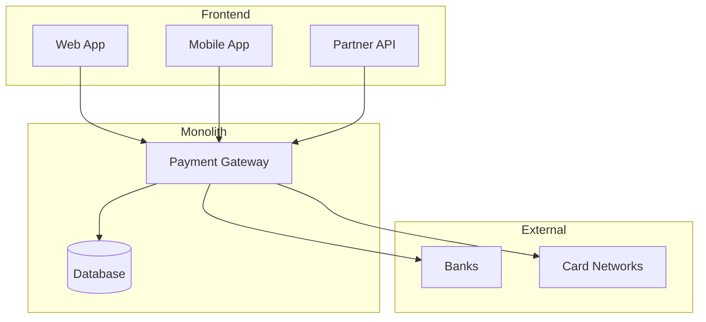
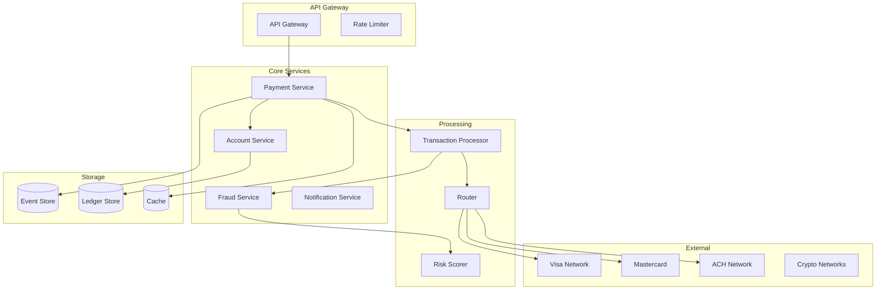
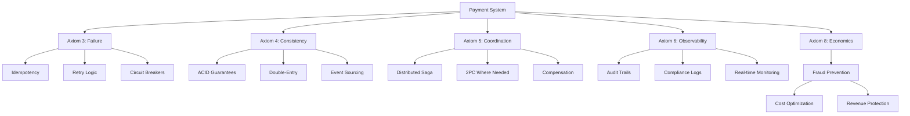
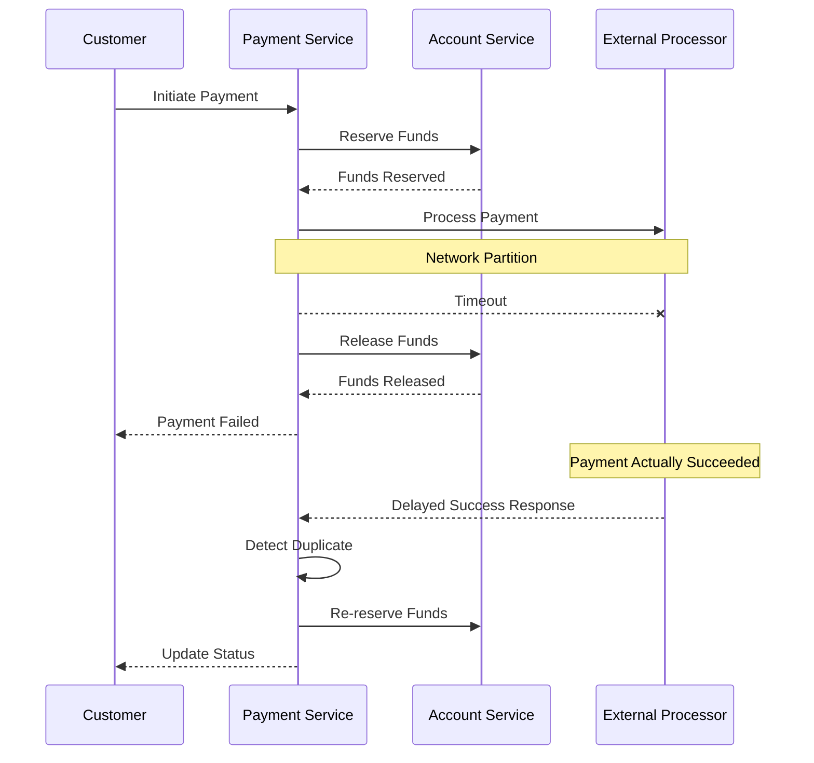

<!-- Navigation -->
[Home](../index.md) → [Case Studies](index.md) → **Payment System**

# Design a Payment System

!!! info "Case Study Overview"
    **System**: Global Payment Processing Platform  
    **Scale**: 65,000+ transactions/second, $5T+ annually  
    **Challenges**: Zero data loss, regulatory compliance, fraud prevention, global scale  
    **Key Patterns**: Event sourcing, saga pattern, double-entry bookkeeping

*Estimated reading time: 25 minutes*

## Introduction

Payment systems form the backbone of digital commerce, processing trillions of dollars annually. This case study explores building a system matching Visa's scale (65,000 TPS) while maintaining ACID guarantees, regulatory compliance, and protecting against fraud.

## Challenge Statement

Design a payment system that can:
- Process 65,000+ transactions per second at peak
- Guarantee zero data loss (every cent accounted for)
- Maintain ACID properties across distributed systems
- Detect and prevent fraud in real-time
- Support multiple payment methods and currencies
- Comply with global regulations (PCI-DSS, GDPR, etc.)
- Provide 99.999% availability
- Handle partial failures gracefully

## Architecture Evolution

### Phase 1: Monolithic Payment Gateway


**Limitations**:
- Single point of failure
- Scaling bottlenecks
- Hard to add new payment methods

### Phase 2: Microservices Architecture (Current)


## Concept Map



## Key Design Decisions

### 1. Transaction Processing Model

**Event Sourcing + CQRS**:
```python
class PaymentEvent:
    """Immutable event representing a state change"""
    def __init__(self, event_type, payment_id, amount, currency, timestamp, data):
        self.event_id = str(uuid.uuid4())
        self.event_type = event_type
        self.payment_id = payment_id
        self.amount = amount
        self.currency = currency
        self.timestamp = timestamp
        self.data = data
        self.signature = self._calculate_signature()
    
    def _calculate_signature(self):
        # Cryptographic signature for tamper detection
        payload = f"{self.event_id}:{self.payment_id}:{self.amount}:{self.timestamp}"
        return hmac.new(SECRET_KEY, payload.encode(), hashlib.sha256).hexdigest()

class PaymentAggregate:
    """Rebuilds payment state from events"""
    def __init__(self, payment_id):
        self.payment_id = payment_id
        self.state = "INITIATED"
        self.amount = Decimal("0")
        self.events = []
    
    def apply_event(self, event):
        if event.event_type == "PAYMENT_INITIATED":
            self.state = "INITIATED"
            self.amount = event.amount
        elif event.event_type == "PAYMENT_AUTHORIZED":
            self.state = "AUTHORIZED"
        elif event.event_type == "PAYMENT_CAPTURED":
            self.state = "CAPTURED"
        elif event.event_type == "PAYMENT_SETTLED":
            self.state = "SETTLED"
        elif event.event_type == "PAYMENT_REFUNDED":
            self.state = "REFUNDED"
            self.amount = Decimal("0")
        
        self.events.append(event)
    
    def get_current_state(self):
        return {
            "payment_id": self.payment_id,
            "state": self.state,
            "amount": self.amount,
            "event_count": len(self.events)
        }
```

### 2. Distributed Transaction Management

**Saga Pattern Implementation**:
```java
public class PaymentSaga {
    private final List<SagaStep> steps;
    private final CompensationManager compensationManager;
    
    public PaymentSaga() {
        this.steps = Arrays.asList(
            new ValidatePaymentStep(),
            new ReserveFundsStep(),
            new CalculateFraudScoreStep(),
            new AuthorizePaymentStep(),
            new CapturePaymentStep(),
            new SettlePaymentStep()
        );
    }
    
    public SagaResult execute(PaymentRequest request) {
        SagaContext context = new SagaContext(request);
        List<CompensationAction> compensations = new ArrayList<>();
        
        for (SagaStep step : steps) {
            try {
                StepResult result = step.execute(context);
                
                if (!result.isSuccess()) {
                    // Compensate all previous steps
                    compensate(compensations);
                    return SagaResult.failed(result.getError());
                }
                
                // Record compensation action
                compensations.add(0, result.getCompensation());
                context.addStepResult(step.getName(), result);
                
            } catch (Exception e) {
                compensate(compensations);
                return SagaResult.failed(e);
            }
        }
        
        return SagaResult.success(context);
    }
    
    private void compensate(List<CompensationAction> actions) {
        for (CompensationAction action : actions) {
            try {
                action.compensate();
            } catch (Exception e) {
                // Log but continue compensation
                log.error("Compensation failed", e);
            }
        }
    }
}
```

### 3. Idempotency and Exactly-Once Processing

```python
class IdempotentPaymentProcessor:
    def __init__(self):
        self.idempotency_store = RedisCluster()
        self.lock_manager = DistributedLockManager()
    
    def process_payment(self, request, idempotency_key):
        # Check if already processed
        cached_result = self.idempotency_store.get(idempotency_key)
        if cached_result:
            return json.loads(cached_result)
        
        # Acquire distributed lock
        lock_key = f"payment_lock:{idempotency_key}"
        with self.lock_manager.acquire(lock_key, timeout=30):
            # Double-check after acquiring lock
            cached_result = self.idempotency_store.get(idempotency_key)
            if cached_result:
                return json.loads(cached_result)
            
            # Process payment
            result = self._execute_payment(request)
            
            # Store result with TTL
            self.idempotency_store.setex(
                idempotency_key,
                86400,  # 24 hours
                json.dumps(result)
            )
            
            return result
    
    def _execute_payment(self, request):
        # Validate request
        validation_result = self.validate_request(request)
        if not validation_result.is_valid:
            return PaymentResult.invalid(validation_result.errors)
        
        # Create payment record
        payment_id = self.generate_payment_id()
        
        # Execute payment saga
        saga = PaymentSaga()
        saga_result = saga.execute(payment_id, request)
        
        if saga_result.is_success:
            return PaymentResult.success(payment_id, saga_result.data)
        else:
            return PaymentResult.failed(payment_id, saga_result.error)
```

### 4. Double-Entry Bookkeeping

```sql
-- Ledger schema for double-entry bookkeeping
CREATE TABLE ledger_entries (
    entry_id UUID PRIMARY KEY,
    transaction_id UUID NOT NULL,
    account_id VARCHAR(50) NOT NULL,
    entry_type ENUM('DEBIT', 'CREDIT') NOT NULL,
    amount DECIMAL(19, 4) NOT NULL,
    currency CHAR(3) NOT NULL,
    balance_after DECIMAL(19, 4) NOT NULL,
    created_at TIMESTAMP NOT NULL,
    metadata JSONB,
    INDEX idx_account_time (account_id, created_at),
    INDEX idx_transaction (transaction_id)
);

-- Every transaction must balance
CREATE OR REPLACE FUNCTION verify_transaction_balance()
RETURNS TRIGGER AS $$
BEGIN
    DECLARE
        debit_sum DECIMAL(19, 4);
        credit_sum DECIMAL(19, 4);
    BEGIN
        SELECT 
            SUM(CASE WHEN entry_type = 'DEBIT' THEN amount ELSE 0 END),
            SUM(CASE WHEN entry_type = 'CREDIT' THEN amount ELSE 0 END)
        INTO debit_sum, credit_sum
        FROM ledger_entries
        WHERE transaction_id = NEW.transaction_id;
        
        IF debit_sum != credit_sum THEN
            RAISE EXCEPTION 'Transaction does not balance: debit=%, credit=%', 
                            debit_sum, credit_sum;
        END IF;
        
        RETURN NEW;
    END;
END;
$$ LANGUAGE plpgsql;
```

## Technical Deep Dives

### Real-time Fraud Detection

```python
class FraudDetectionEngine:
    def __init__(self):
        self.ml_model = self.load_ml_model()
        self.rule_engine = RuleEngine()
        self.velocity_checker = VelocityChecker()
        
    def score_transaction(self, transaction):
        # Parallel fraud checks
        with ThreadPoolExecutor(max_workers=4) as executor:
            ml_future = executor.submit(self._ml_scoring, transaction)
            rule_future = executor.submit(self._rule_checking, transaction)
            velocity_future = executor.submit(self._velocity_checking, transaction)
            device_future = executor.submit(self._device_fingerprinting, transaction)
        
        # Combine scores
        ml_score = ml_future.result()
        rule_score = rule_future.result()
        velocity_score = velocity_future.result()
        device_score = device_future.result()
        
        # Weighted combination
        final_score = (
            ml_score * 0.4 +
            rule_score * 0.3 +
            velocity_score * 0.2 +
            device_score * 0.1
        )
        
        return FraudScore(
            score=final_score,
            components={
                'ml': ml_score,
                'rules': rule_score,
                'velocity': velocity_score,
                'device': device_score
            },
            action=self._determine_action(final_score)
        )
    
    def _ml_scoring(self, transaction):
        features = self._extract_features(transaction)
        # Real-time feature engineering
        features['hour_of_day'] = transaction.timestamp.hour
        features['day_of_week'] = transaction.timestamp.weekday()
        features['amount_zscore'] = self._calculate_amount_zscore(transaction)
        features['merchant_risk_score'] = self._get_merchant_risk(transaction.merchant_id)
        
        return self.ml_model.predict_proba(features)[0][1]
    
    def _velocity_checking(self, transaction):
        # Check transaction velocity
        checks = {
            'card_velocity_1min': self._check_velocity(
                transaction.card_id, 
                window_minutes=1, 
                max_count=3
            ),
            'card_velocity_1hour': self._check_velocity(
                transaction.card_id,
                window_minutes=60,
                max_count=20
            ),
            'ip_velocity_10min': self._check_velocity(
                transaction.ip_address,
                window_minutes=10,
                max_count=10
            ),
            'amount_velocity_1day': self._check_amount_velocity(
                transaction.card_id,
                window_hours=24,
                max_amount=10000
            )
        }
        
        violations = sum(1 for check in checks.values() if check)
        return min(violations * 0.25, 1.0)
```

### Multi-Currency Support

```java
public class CurrencyExchangeService {
    private final Map<String, ExchangeRateProvider> providers;
    private final Cache<CurrencyPair, BigDecimal> rateCache;
    
    public MoneyAmount convert(MoneyAmount amount, Currency targetCurrency) {
        if (amount.getCurrency().equals(targetCurrency)) {
            return amount;
        }
        
        CurrencyPair pair = new CurrencyPair(amount.getCurrency(), targetCurrency);
        BigDecimal rate = getExchangeRate(pair);
        
        // Use banker's rounding for financial calculations
        BigDecimal converted = amount.getValue()
            .multiply(rate)
            .setScale(targetCurrency.getDefaultFractionDigits(), RoundingMode.HALF_EVEN);
        
        return new MoneyAmount(converted, targetCurrency);
    }
    
    private BigDecimal getExchangeRate(CurrencyPair pair) {
        // Check cache first
        BigDecimal cachedRate = rateCache.get(pair);
        if (cachedRate != null) {
            return cachedRate;
        }
        
        // Get rates from multiple providers
        List<BigDecimal> rates = providers.values().parallelStream()
            .map(provider -> provider.getRate(pair))
            .filter(Objects::nonNull)
            .collect(Collectors.toList());
        
        // Use median rate for stability
        BigDecimal rate = calculateMedian(rates);
        
        // Cache for 1 minute
        rateCache.put(pair, rate, 60, TimeUnit.SECONDS);
        
        return rate;
    }
}
```

### Settlement and Reconciliation

```python
class SettlementEngine:
    def __init__(self):
        self.ledger = LedgerService()
        self.settlement_accounts = {}
        
    def daily_settlement(self, date):
        # Get all transactions for the day
        transactions = self.get_transactions_for_date(date)
        
        # Group by settlement entity
        grouped = self.group_by_settlement_entity(transactions)
        
        # Create settlement batches
        settlement_batches = []
        for entity, txns in grouped.items():
            batch = self.create_settlement_batch(entity, txns, date)
            settlement_batches.append(batch)
        
        # Execute settlements in parallel
        with ThreadPoolExecutor(max_workers=10) as executor:
            futures = []
            for batch in settlement_batches:
                future = executor.submit(self.execute_settlement, batch)
                futures.append(future)
            
            # Wait for all settlements
            results = [f.result() for f in futures]
        
        # Reconciliation
        self.reconcile_settlements(results, date)
        
        return SettlementReport(date, results)
    
    def execute_settlement(self, batch):
        try:
            # Calculate net amount
            net_amount = sum(t.amount for t in batch.transactions)
            
            # Create ledger entries
            entries = [
                LedgerEntry(
                    account=batch.merchant_account,
                    entry_type='CREDIT',
                    amount=net_amount,
                    reference=batch.batch_id
                ),
                LedgerEntry(
                    account=self.settlement_accounts[batch.entity],
                    entry_type='DEBIT',
                    amount=net_amount,
                    reference=batch.batch_id
                )
            ]
            
            # Post to ledger atomically
            self.ledger.post_entries(entries)
            
            # Initiate bank transfer
            transfer_id = self.initiate_bank_transfer(batch)
            
            return SettlementResult(
                batch_id=batch.batch_id,
                status='SUCCESS',
                transfer_id=transfer_id,
                amount=net_amount
            )
            
        except Exception as e:
            return SettlementResult(
                batch_id=batch.batch_id,
                status='FAILED',
                error=str(e)
            )
    
    def reconcile_settlements(self, results, date):
        # Compare ledger vs bank statements
        ledger_total = self.ledger.get_settlement_total(date)
        bank_total = self.get_bank_statement_total(date)
        
        if ledger_total != bank_total:
            discrepancy = ledger_total - bank_total
            self.raise_reconciliation_alert(date, discrepancy)
            
            # Automated investigation
            self.investigate_discrepancy(date, discrepancy)
```

### Payment Routing

```python
class IntelligentPaymentRouter:
    def __init__(self):
        self.routes = self.load_routing_rules()
        self.provider_health = ProviderHealthMonitor()
        self.cost_calculator = CostCalculator()
        
    def route_payment(self, payment_request):
        # Get available routes
        available_routes = self.get_available_routes(payment_request)
        
        # Score each route
        scored_routes = []
        for route in available_routes:
            score = self.score_route(route, payment_request)
            scored_routes.append((score, route))
        
        # Sort by score (higher is better)
        scored_routes.sort(reverse=True, key=lambda x: x[0])
        
        # Try routes in order until one succeeds
        for score, route in scored_routes:
            if self.provider_health.is_healthy(route.provider):
                return route
        
        raise NoAvailableRouteException()
    
    def score_route(self, route, request):
        # Multi-factor scoring
        scores = {
            'success_rate': self.get_success_rate(route) * 0.3,
            'cost': (1 - self.normalize_cost(route, request)) * 0.2,
            'latency': (1 - self.normalize_latency(route)) * 0.2,
            'features': self.feature_compatibility(route, request) * 0.15,
            'load': (1 - self.get_current_load(route)) * 0.15
        }
        
        return sum(scores.values())
    
    def get_success_rate(self, route):
        # Rolling window success rate
        window = datetime.now() - timedelta(hours=1)
        successes = self.get_successful_txns(route, window)
        total = self.get_total_txns(route, window)
        
        if total == 0:
            return route.baseline_success_rate
        
        return successes / total
```

## Performance Optimization

### Database Sharding Strategy

```sql
-- Shard by merchant_id for even distribution
CREATE OR REPLACE FUNCTION get_shard_id(merchant_id VARCHAR)
RETURNS INTEGER AS $$
BEGIN
    RETURN abs(hashtext(merchant_id)) % 64;  -- 64 shards
END;
$$ LANGUAGE plpgsql IMMUTABLE;

-- Partition transactions table
CREATE TABLE transactions_template (
    transaction_id UUID,
    merchant_id VARCHAR(50),
    amount DECIMAL(19, 4),
    currency CHAR(3),
    status VARCHAR(20),
    created_at TIMESTAMP,
    updated_at TIMESTAMP,
    metadata JSONB,
    PRIMARY KEY (transaction_id, merchant_id)
) PARTITION BY HASH (merchant_id);

-- Create 64 partitions
DO $$
BEGIN
    FOR i IN 0..63 LOOP
        EXECUTE format('
            CREATE TABLE transactions_shard_%s 
            PARTITION OF transactions_template 
            FOR VALUES WITH (modulus 64, remainder %s)',
            i, i
        );
    END LOOP;
END $$;
```

### Caching Strategy

```python
class PaymentCache:
    def __init__(self):
        self.redis_cluster = RedisCluster()
        self.local_cache = LRUCache(maxsize=10000)
        
    def cache_payment_state(self, payment_id, state, ttl=3600):
        # Two-tier caching
        cache_key = f"payment:{payment_id}"
        
        # Local cache for hot data
        self.local_cache[payment_id] = state
        
        # Redis for distributed cache
        self.redis_cluster.setex(
            cache_key,
            ttl,
            json.dumps(state)
        )
    
    def get_payment_state(self, payment_id):
        # Check local cache first
        if payment_id in self.local_cache:
            return self.local_cache[payment_id]
        
        # Check Redis
        cache_key = f"payment:{payment_id}"
        cached = self.redis_cluster.get(cache_key)
        
        if cached:
            state = json.loads(cached)
            # Populate local cache
            self.local_cache[payment_id] = state
            return state
        
        return None
    
    def invalidate(self, payment_id):
        # Remove from both caches
        self.local_cache.pop(payment_id, None)
        self.redis_cluster.delete(f"payment:{payment_id}")
```

## Failure Scenarios

### 1. Network Partition During Payment


### 2. Database Failure During Settlement
```python
def handle_settlement_db_failure(self, batch):
    try:
        # Attempt primary database
        return self.execute_settlement_primary(batch)
    except DatabaseException as e:
        log.error(f"Primary DB failed: {e}")
        
        # Failover to secondary
        try:
            result = self.execute_settlement_secondary(batch)
            
            # Queue for reconciliation
            self.reconciliation_queue.put({
                'batch_id': batch.batch_id,
                'reason': 'primary_db_failure',
                'timestamp': datetime.now()
            })
            
            return result
            
        except Exception as e2:
            # Both DBs failed - write to durable queue
            self.disaster_recovery_queue.put(batch)
            
            # Return provisional success
            return SettlementResult(
                batch_id=batch.batch_id,
                status='PROVISIONAL',
                note='Queued for recovery processing'
            )
```

## Compliance and Security

### PCI-DSS Compliance

```python
class PCICompliantCardHandler:
    def __init__(self):
        self.tokenizer = TokenizationService()
        self.hsm = HardwareSecurityModule()
        
    def handle_card_number(self, card_number):
        # Never log full card number
        masked = self.mask_card_number(card_number)
        log.info(f"Processing card: {masked}")
        
        # Tokenize immediately
        token = self.tokenizer.tokenize(card_number)
        
        # Delete from memory
        card_number = None
        
        return token
    
    def mask_card_number(self, card_number):
        # Show only last 4 digits
        if len(card_number) < 4:
            return "****"
        return "*" * (len(card_number) - 4) + card_number[-4:]
    
    def encrypt_sensitive_data(self, data):
        # Use HSM for encryption
        key_id = self.hsm.get_current_key_id()
        encrypted = self.hsm.encrypt(data, key_id)
        
        return {
            'ciphertext': encrypted,
            'key_id': key_id,
            'algorithm': 'AES-256-GCM',
            'timestamp': datetime.now().isoformat()
        }
```

### Audit Trail

```sql
-- Immutable audit log
CREATE TABLE audit_log (
    audit_id UUID DEFAULT gen_random_uuid(),
    event_type VARCHAR(50) NOT NULL,
    entity_type VARCHAR(50) NOT NULL,
    entity_id VARCHAR(100) NOT NULL,
    actor_id VARCHAR(100) NOT NULL,
    actor_type VARCHAR(50) NOT NULL,
    action VARCHAR(100) NOT NULL,
    old_value JSONB,
    new_value JSONB,
    metadata JSONB,
    created_at TIMESTAMP DEFAULT CURRENT_TIMESTAMP,
    PRIMARY KEY (audit_id, created_at)
) PARTITION BY RANGE (created_at);

-- Create monthly partitions
CREATE TABLE audit_log_2024_01 PARTITION OF audit_log
FOR VALUES FROM ('2024-01-01') TO ('2024-02-01');

-- Prevent updates and deletes
CREATE RULE audit_log_no_update AS 
ON UPDATE TO audit_log DO INSTEAD NOTHING;

CREATE RULE audit_log_no_delete AS 
ON DELETE TO audit_log DO INSTEAD NOTHING;
```

## Monitoring and Operations

### Key Metrics

```yaml
slos:
  - name: transaction_success_rate
    target: 99.95%
    query: |
      sum(rate(payment_success_total[5m])) / 
      sum(rate(payment_attempts_total[5m]))
      
  - name: p99_latency
    target: < 200ms
    query: |
      histogram_quantile(0.99, 
        payment_processing_duration_seconds_bucket
      )
      
  - name: fraud_detection_accuracy
    target: > 98%
    query: |
      (true_positives + true_negatives) / 
      (true_positives + true_negatives + false_positives + false_negatives)
      
  - name: settlement_accuracy
    target: 100%
    query: |
      1 - (sum(settlement_discrepancies_total) / 
           sum(settlement_transactions_total))

alerts:
  - name: HighFailureRate
    expr: payment_success_rate < 0.95
    for: 5m
    severity: critical
    
  - name: SettlementDiscrepancy
    expr: settlement_discrepancies_total > 0
    for: 1m
    severity: critical
    
  - name: FraudSpikeDetected
    expr: rate(fraud_detected_total[5m]) > 10 * rate(fraud_detected_total[1h] offset 1d)
    for: 5m
    severity: warning
```

## Lessons Learned

### 1. Idempotency is Non-Negotiable
- Every API must be idempotent
- Store idempotency keys with results
- Handle duplicate requests gracefully

### 2. Event Sourcing Provides Perfect Audit Trail
- Never lose transaction history
- Can replay events for debugging
- Enables temporal queries

### 3. Distributed Transactions Need Compensation
- 2PC doesn't scale
- Saga pattern with compensation works
- Design for eventual consistency

### 4. Real-time Fraud Detection Saves Money
- ML models catch patterns humans miss
- Speed matters - block before authorization
- False positives hurt customer experience

### 5. Multiple Payment Routes Increase Reliability
- Single provider = single point of failure
- Intelligent routing improves success rates
- Cost optimization through competition

## Trade-offs and Decisions

| Decision | Trade-off | Why This Choice |
|----------|-----------|-----------------|
| Event sourcing | Complexity vs auditability | Perfect audit trail required |
| Saga pattern | Consistency vs availability | Need high availability |
| Multi-provider routing | Complexity vs reliability | Minimize payment failures |
| Real-time fraud scoring | Latency vs security | Fraud prevention critical |
| Sharded database | Complexity vs scale | Must handle high TPS |

## References

- [The Architecture of Open Source Applications: Stripe](http://aosabook.org/en/stripe.html)
- [Designing Data-Intensive Applications - Chapter 12: The Future of Data Systems](https://dataintensive.net/)
- [High Scalability: PayPal Architecture](http://highscalability.com/blog/2023/3/6/paypal-architecture.html)
- [Uber's Payment Platform](https://eng.uber.com/payments-platform/)