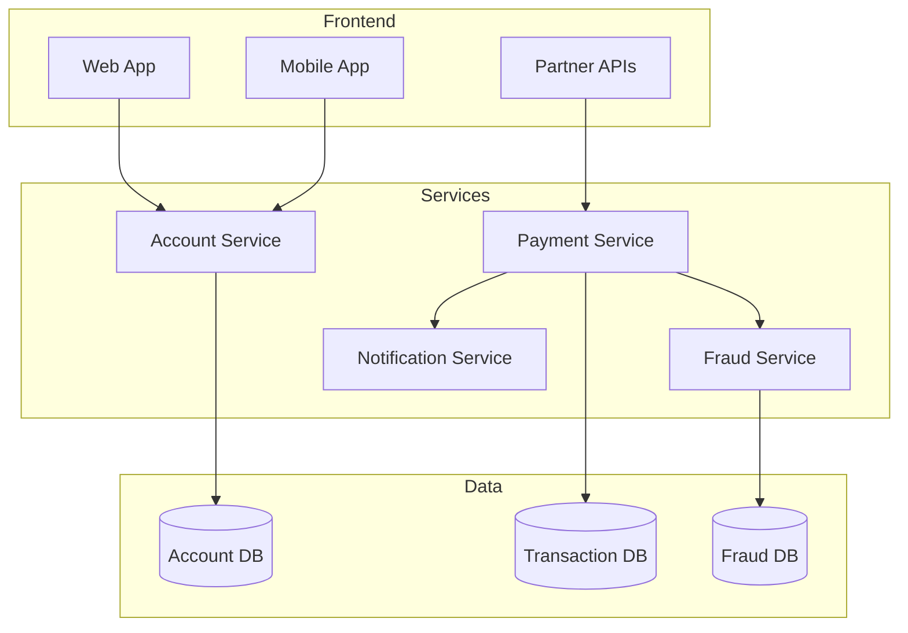
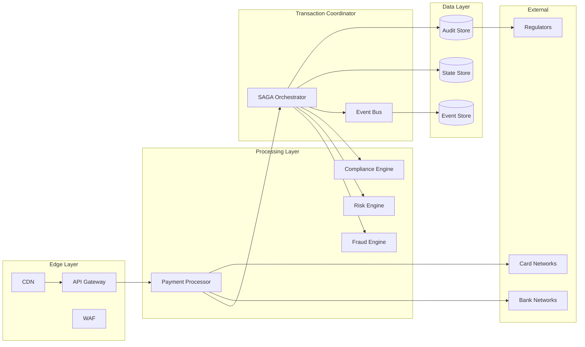

<!-- Navigation -->
[Home](/) → [Case Studies](/case-studies/) → **PayPal's Payment Processing System**

# 🏦 PayPal's Payment Processing System

**The Challenge**: Process billions in payments with zero data loss

## 🏗️ Architecture Evolution

### Phase 1: Monolithic System (1998-2005)

```text
Web App → Single Database → Batch Processing → Bank Networks
```

**Limitations:**
- Scaling bottlenecks
- 4-hour maintenance windows
- No real-time capabilities
- Single point of failure

### Phase 2: Service-Oriented Architecture (2005-2015)



**Improvements:**
- Service isolation
- Independent scaling
- Better fault tolerance
- API-first approach

### Phase 3: Distributed Transaction Processing (2015-Present)



## 🔬 Deep Dive: Distributed Transaction Processing

### SAGA Pattern Implementation

**Payment Processing SAGA:**

```python
class PaymentSaga:
    def __init__(self, saga_id):
        self.saga_id = saga_id
        self.state = "INITIATED"
        self.compensations = []

    async def execute_payment(self, payment_request):
        try:
            # Step 1: Validate and Lock Funds
            validation_result = await self.validate_and_lock(
                payment_request
            )
            self.compensations.append(
                lambda: self.unlock_funds(payment_request.sender)
            )

            # Step 2: Fraud Check
            fraud_result = await self.check_fraud(payment_request)
            if fraud_result.is_suspicious:
                await self.compensate()
                return PaymentResult.REJECTED

            # Step 3: Compliance Check
            compliance_result = await self.check_compliance(
                payment_request
            )
            if not compliance_result.is_compliant:
                await self.compensate()
                return PaymentResult.COMPLIANCE_FAILED

            # Step 4: Execute Transfer
            transfer_result = await self.execute_transfer(
                payment_request
            )
            self.compensations.append(
                lambda: self.reverse_transfer(transfer_result.id)
            )

            # Step 5: Update Balances
            await self.update_balances(payment_request)

            # Step 6: Send Notifications
            await self.send_notifications(payment_request)

            # Success - Clear compensations
            self.state = "COMPLETED"
            self.compensations.clear()

            return PaymentResult.SUCCESS

        except Exception as e:
            # Failure - Run compensations
            await self.compensate()
            self.state = "FAILED"
            raise

    async def compensate(self):
        """Run compensation actions in reverse order"""
        for compensation in reversed(self.compensations):
            try:
                await compensation()
            except Exception as e:
                # Log but continue compensating
                log.error(f"Compensation failed: {e}")
```

### Idempotency and Exactly-Once Processing

```python
class IdempotentPaymentProcessor:
    def __init__(self):
        self.processed_requests = {}  # In practice, distributed cache

    async def process_payment(self, request):
        # Generate idempotency key
        idempotency_key = self.generate_key(request)

        # Check if already processed
        if idempotency_key in self.processed_requests:
            return self.processed_requests[idempotency_key]

        # Acquire distributed lock
        lock = await self.acquire_lock(idempotency_key)
        if not lock:
            # Another instance is processing
            return await self.wait_for_result(idempotency_key)

        try:
            # Double-check after acquiring lock
            if idempotency_key in self.processed_requests:
                return self.processed_requests[idempotency_key]

            # Process payment
            result = await self.execute_payment(request)

            # Store result
            self.processed_requests[idempotency_key] = result
            await self.persist_result(idempotency_key, result)

            return result

        finally:
            await self.release_lock(idempotency_key)

    def generate_key(self, request):
        """Generate deterministic idempotency key"""
        return hashlib.sha256(
            f"{request.sender_id}:{request.receiver_id}:"
            f"{request.amount}:{request.timestamp}:"
            f"{request.request_id}".encode()
        ).hexdigest()
```

## 📊 Axiom Analysis

### Axiom 3: Truth Through Event Sourcing

**Every State Change is an Event:**

```python
@dataclass
class PaymentEvent:
    event_id: str
    saga_id: str
    timestamp: datetime
    event_type: str
    payload: dict

class EventStore:
    async def append_event(self, event: PaymentEvent):
        # Atomic append with ordering guarantee
        await self.storage.append(
            partition_key=event.saga_id,
            event=event,
            expected_version=self.get_version(event.saga_id)
        )

        # Publish to event bus
        await self.event_bus.publish(event)

    async def get_payment_history(self, payment_id: str):
        """Reconstruct payment state from events"""
        events = await self.storage.get_events(payment_id)

        state = PaymentState()
        for event in events:
            state = self.apply_event(state, event)

        return state
```

**Audit Trail Requirements:**
```yaml
Every transaction must maintain:
- Who initiated (user, system, API)
- What changed (amount, status, metadata)
- When it occurred (microsecond precision)
- Why it happened (business rule, user action)
- Where it originated (IP, device, location)
```

### Axiom 4: Control Through Orchestration

**Distributed Coordination:**

```python
class PaymentOrchestrator:
    def __init__(self):
        self.state_machine = PaymentStateMachine()
        self.timeout_manager = TimeoutManager()

    async def orchestrate_payment(self, payment_id: str):
        # Load current state
        state = await self.load_state(payment_id)

        # Determine next actions
        actions = self.state_machine.get_next_actions(state)

        # Execute actions in parallel where possible
        results = await asyncio.gather(*[
            self.execute_action(action) for action in actions
            if action.can_run_parallel
        ])

        # Execute sequential actions
        for action in actions:
            if not action.can_run_parallel:
                result = await self.execute_action(action)
                if not result.success:
                    await self.handle_failure(action, result)

        # Update state
        new_state = self.state_machine.transition(
            state,
            results
        )
        await self.save_state(payment_id, new_state)

        # Set timeout for next step
        if not new_state.is_terminal:
            await self.timeout_manager.set_timeout(
                payment_id,
                new_state.timeout_duration
            )
```

### Axiom 3: Failure Handling

**Multi-Level Failure Recovery:**

```python
class PaymentFailureHandler:
    def __init__(self):
        self.retry_policies = {
            'network_error': ExponentialBackoff(
                base_delay=100,
                max_retries=3
            ),
            'timeout': LinearBackoff(
                delay=1000,
                max_retries=2
            ),
            'rate_limit': ExponentialBackoff(
                base_delay=5000,
                max_retries=5
            )
        }

    async def handle_failure(self, error: Exception, context: dict):
        error_type = self.classify_error(error)

        if error_type == 'business_error':
            # No retry for business logic errors
            return FailureResult.ABORT

        if error_type == 'insufficient_funds':
            # Specific handling for common cases
            await self.notify_user_insufficient_funds(context)
            return FailureResult.USER_ACTION_REQUIRED

        # Get retry policy
        retry_policy = self.retry_policies.get(
            error_type,
            self.default_retry_policy
        )

        if retry_policy.should_retry(context['attempt']):
            delay = retry_policy.get_delay(context['attempt'])
            await asyncio.sleep(delay / 1000)  # Convert to seconds
            return FailureResult.RETRY

        # Max retries exceeded
        await self.escalate_to_manual_review(context)
        return FailureResult.MANUAL_REVIEW
```

## 💡 Key Design Decisions

### 1. Eventual Consistency with Compensations

**Decision**: Use SAGA pattern instead of distributed transactions

**Rationale**:
- 2PC would require locking across systems
- Network partitions would halt processing
- SAGAs allow progress with compensations

**Trade-offs**:
- ✅ Higher availability
- ✅ Better performance
- ❌ Complex compensation logic
- ❌ Temporary inconsistencies

### 2. Event Sourcing for Audit Trail

**Decision**: Store all state changes as events

**Benefits**:
- Complete audit trail for regulators
- Time-travel debugging
- Replay for disaster recovery
- Analytics on historical data

**Challenges**:
- Storage requirements (mitigated by tiered storage)
- Event schema evolution
- GDPR compliance for data deletion

### 3. Idempotency Everywhere

**Implementation Levels**:
1. **API Level**: Request IDs
2. **Service Level**: Operation tokens
3. **Database Level**: Unique constraints
4. **Network Level**: TCP sequence numbers

## 📈 Production Metrics

### System Performance (2023)
- **Transaction Volume**: $1.36T processed
- **Daily Peak**: 58M transactions
- **Success Rate**: 99.94%
- **Average Latency**: 234ms
- **P99 Latency**: 1.2s

### Reliability Metrics
- **Availability**: 99.999% (5.26 min/year)
- **Data Loss**: 0 transactions lost
- **Duplicate Payments**: <0.0001%
- **Failed Compensations**: <0.001%

### Compliance Metrics
- **Regulatory Audits**: 100% passed
- **PCI Compliance**: Level 1
- **Fraud Detection**: 99.89% accuracy
- **False Positive Rate**: 0.8%

## 🎓 Lessons Learned

### What Worked Well
1. **SAGA Pattern**: Excellent for distributed transactions
2. **Event Sourcing**: Perfect audit trail
3. **Idempotency**: Eliminated duplicate charges
4. **Cell Architecture**: Isolated failures

### What Didn't Work
1. **Synchronous Processing**: Created bottlenecks
2. **Shared Databases**: Scaling limitations
3. **Manual Reconciliation**: Error-prone and slow

### Key Takeaways
- **Design for failure**: Assume everything will fail
- **Audit everything**: Regulators will ask
- **Idempotency is mandatory**: Not optional for payments
- **Test disaster recovery**: Not just the happy path

## 🔗 References & Deep Dives

### Related Patterns
- [SAGA Pattern](../patterns/saga.md)
- [Event Sourcing](../patterns/event-sourcing.md)
- [Idempotent Receiver](../patterns/idempotent-receiver.md)
- [Circuit Breaker](../patterns/circuit-breaker.md)

### Technical Resources
- [Distributed Transactions at Scale](https://www.paypal-engineering.com/distributed-transactions)
- [Building Financial Systems](https://martinfowler.com/articles/patterns-of-distributed-systems/)
- [Payment Processing Best Practices](https://stripe.com/docs/payments/payment-intents)

### Similar Systems
- [Stripe's Payment Infrastructure](https://stripe.com/blog/payment-api-design)
- [Square's Transaction Processing](https://developer.squareup.com/blog/payment-reliability)
- [Adyen's Global Payment Platform](https://www.adyen.com/knowledge-hub/platform-architecture)

---

---

*"In payment processing, 'good enough' isn't good enough. Every penny matters, every transaction counts."*

---

**Previous**: [← Spotify Recommendations](spotify-recommendations.md)
