# Design a Proximity Service

!!! info "Case Study Overview"
    **System**: Location-based service for finding nearby points of interest  
    **Scale**: 100M+ locations, 1B+ queries/day, sub-second response  
    **Challenges**: Spatial indexing, real-time updates, global scale, accuracy  
    **Key Patterns**: Geohashing, quadtree, R-tree, sharding by geography

*Estimated reading time: 40 minutes*

## Introduction

Proximity services power everything from "restaurants near me" to ride-sharing pickups, requiring systems that can instantly query millions of geographic points to find the nearest matches. This involves solving fundamental challenges in spatial indexing, handling the irregularity of real-world geography, and maintaining sub-second query times at global scale. From Uber matching riders to drivers to Yelp showing nearby restaurants, these systems must balance mathematical precision with practical performance. Let's explore how geometry, physics, and distributed systems principles combine to answer the seemingly simple question: "What's near me?"

## Part 1: Concept Map - The Physics of Space and Time

### Axiom 1: Latency - The Speed of Location

Location queries must return results fast enough to feel instantaneous, typically under 200ms.

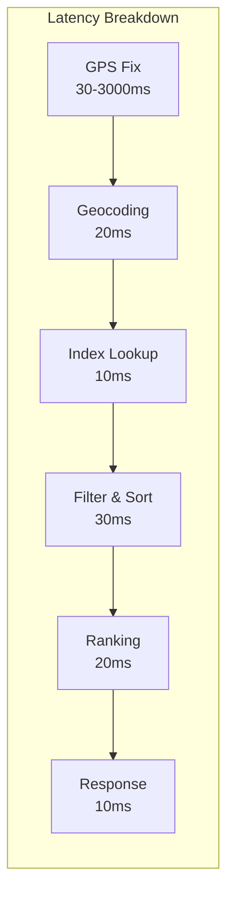

**Latency Optimization Strategies:**

| Component | Typical Latency | Optimization | Improved Latency |
|-----------|----------------|--------------|------------------|
| GPS Acquisition | 30-3000ms | Last known location cache | 0ms (cached) |
| Geocoding | 50-200ms | Local geocoding cache | 10-20ms |
| Spatial Query | 100-500ms | Geohash indexing | 10-50ms |
| Result Ranking | 50-100ms | Pre-computed scores | 10-20ms |
| Network RTT | 20-100ms | Edge servers | 5-20ms |

**Geographic Latency Considerations:**

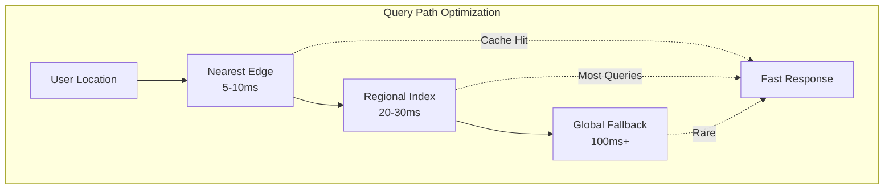

### Axiom 2: Capacity - The Curse of Dimensionality

Spatial data grows quadratically with coverage area and linearly with density.

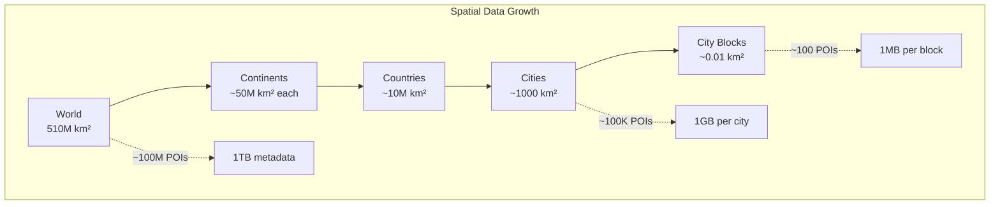

**Capacity Planning Model:**

| Data Type | Size per POI | 100M POIs | Growth Rate |
|-----------|--------------|-----------|-------------|
| Basic Metadata | 1 KB | 100 GB | +20% YoY |
| Rich Attributes | 10 KB | 1 TB | +30% YoY |
| Images | 1 MB | 100 TB | +50% YoY |
| Reviews/Ratings | 100 KB | 10 TB | +40% YoY |
| Spatial Indices | 100 B | 10 GB | +20% YoY |

**Spatial Indexing Structures:**

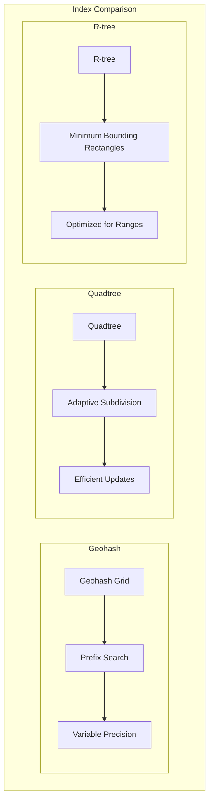

### Axiom 3: Failure - Location Service Availability

The system must handle failures gracefully without returning incorrect locations.

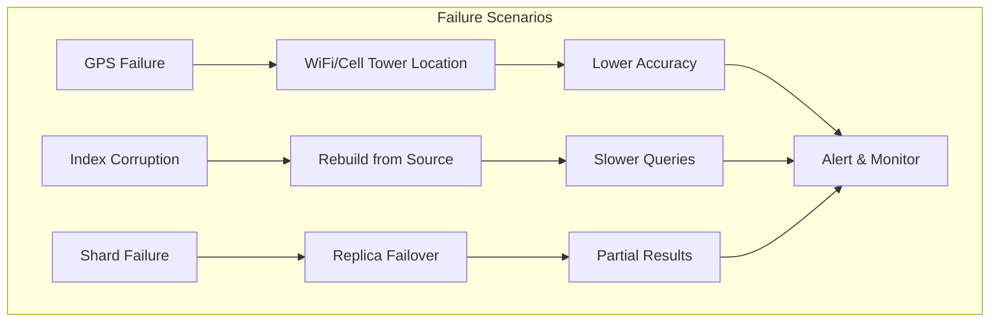

**Failure Recovery Strategies:**

| Failure Type | Detection Time | Recovery Strategy | Data Loss |
|--------------|---------------|-------------------|-----------|
| GPS Signal Lost | Immediate | Cell tower triangulation | None (degraded accuracy) |
| Index Node Crash | < 10s | Failover to replica | None |
| Data Corruption | Minutes | Rebuild from WAL | Minimal |
| Region Outage | < 30s | Cross-region failover | None |
| Split Brain | < 60s | Quorum resolution | Possible conflicts |

### Axiom 4: Concurrency - Parallel Spatial Queries

Handling millions of concurrent location queries requires sophisticated parallelization.

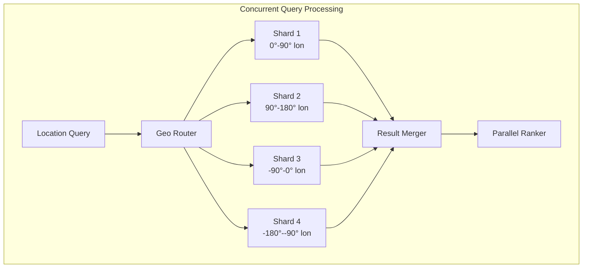

**Concurrency Patterns:**

| Pattern | Use Case | Throughput Impact |
|---------|----------|-------------------|
| Spatial Sharding | Distribute by geography | 10x improvement |
| Read Replicas | Scale read queries | 5x per replica |
| Caching Layer | Repeated queries | 100x for hits |
| Batch Processing | Bulk geocoding | 20x efficiency |
| Async Updates | Location updates | 10x write throughput |

### Axiom 5: Coordination - Global Consistency

Maintaining consistent location data across regions while handling updates.

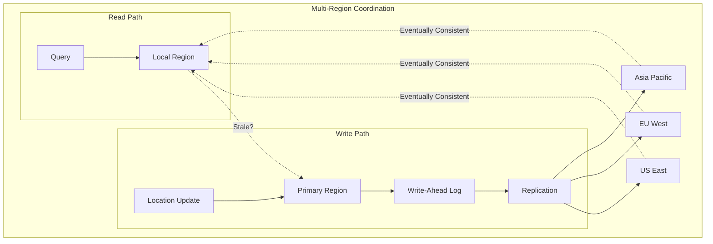

**Consistency Models by Use Case:**

| Use Case | Consistency Model | Max Staleness | Conflict Resolution |
|----------|------------------|---------------|-------------------|
| Restaurant Locations | Eventually Consistent | 5 minutes | Last Write Wins |
| Delivery Driver Location | Near Real-time | 5 seconds | Latest GPS Wins |
| Store Hours | Eventually Consistent | 1 hour | Manual Merge |
| Emergency Services | Strong Consistency | 0 seconds | Primary Region |
| User Location History | Causal Consistency | 1 minute | Vector Clocks |

### Axiom 6: Observability - Location Service Monitoring

Understanding system behavior through comprehensive monitoring.

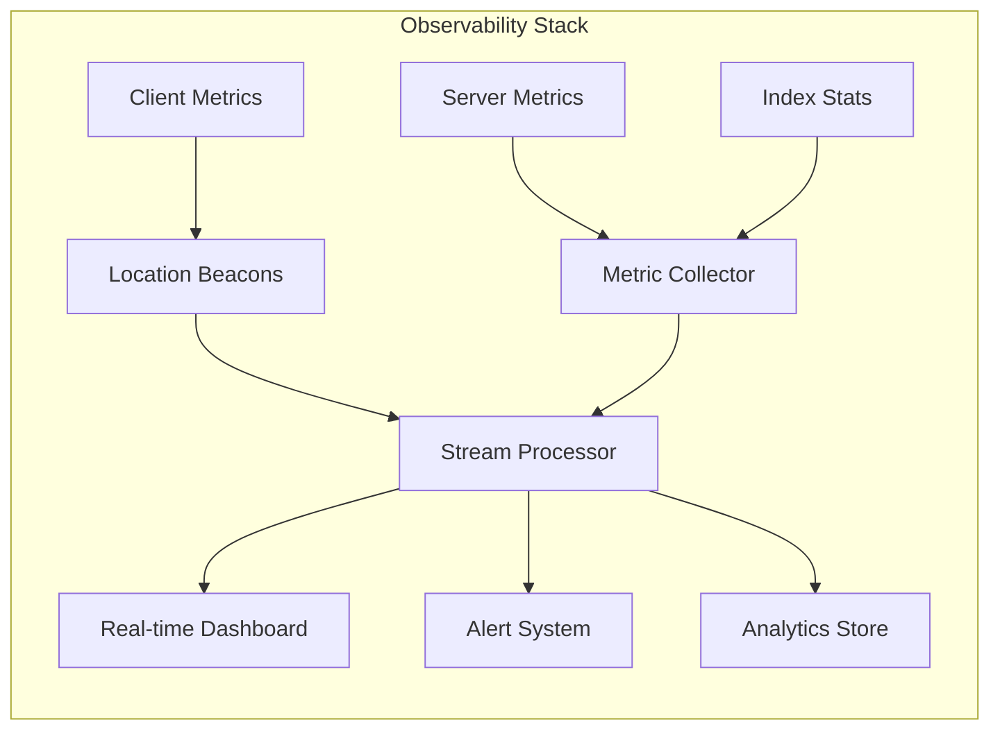

**Key Metrics:**

| Metric Category | Examples | Alert Thresholds |
|----------------|----------|------------------|
| Query Performance | Latency p50/p95/p99 | p99 > 200ms |
| Accuracy | GPS precision, Geocoding errors | Error rate > 1% |
| Availability | Uptime, Failed queries | < 99.9% |
| Data Quality | Missing POIs, Outdated info | Staleness > 7 days |
| Capacity | Index size, Query volume | > 80% capacity |

### Axiom 7: Human Interface - Intuitive Location UX

Making geographic queries feel natural and intuitive for users.

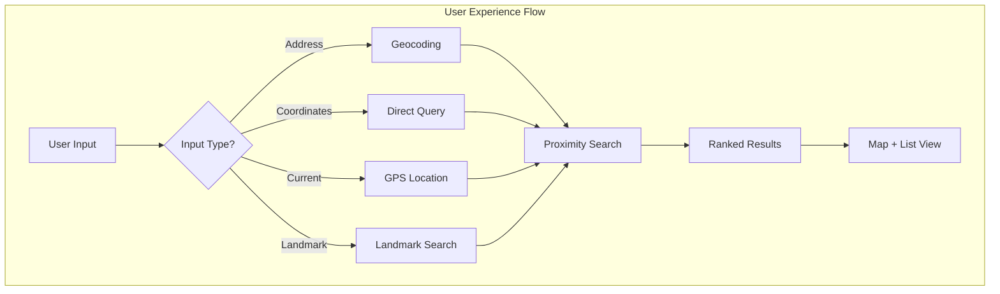

**UX Optimization Strategies:**

| Feature | Implementation | User Benefit |
|---------|---------------|--------------|
| Auto-complete | Prefix matching + ML | Faster input |
| Fuzzy Matching | Edit distance algorithms | Typo tolerance |
| Smart Defaults | "Near me" = current location | Less input needed |
| Visual Feedback | Loading indicators, animations | Perceived speed |
| Offline Mode | Cached nearby data | Works everywhere |

### Axiom 8: Economics - Balancing Cost and Coverage

Optimizing the trade-off between global coverage and operational costs.

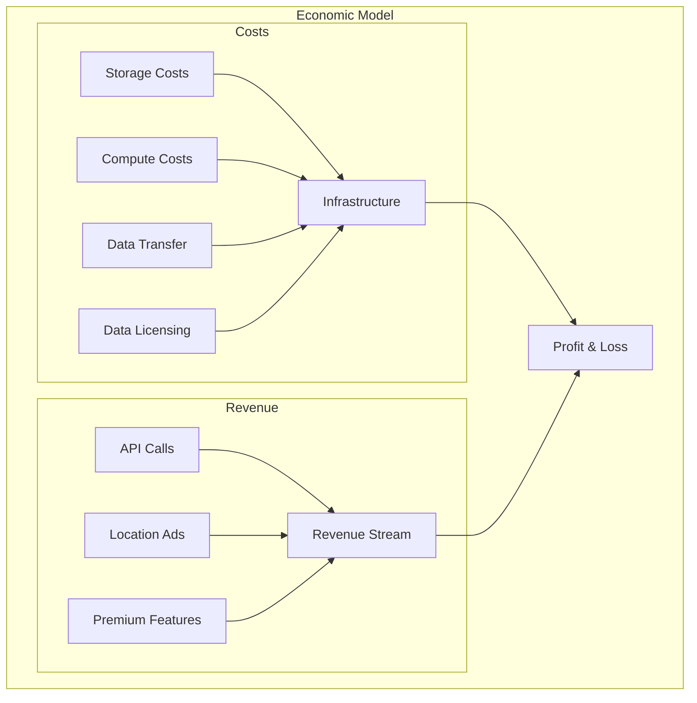

**Cost Optimization Strategies:**

| Strategy | Implementation | Cost Savings |
|----------|---------------|--------------|
| Data Compression | Geohash clustering | 60% storage |
| Tiered Storage | Hot/cold regions | 70% storage cost |
| Query Caching | Popular locations | 80% compute |
| Selective Loading | On-demand regions | 50% memory |
| CDN Distribution | Edge caching | 60% bandwidth |

## Part 2: Comprehensive Axiom Analysis Matrix

Understanding how each design decision maps to fundamental axioms helps reveal the true trade-offs in building proximity services.

### Axiom Mapping for Core Design Decisions

| Design Decision | Axiom 1: Latency | Axiom 2: Capacity | Axiom 3: Failure | Axiom 4: Concurrency | Axiom 5: Coordination | Axiom 6: Observability | Axiom 7: Human Interface | Axiom 8: Economics |
|----------------|------------------|-------------------|------------------|---------------------|---------------------|---------------------|------------------------|-------------------|
| **Geohash Indexing** | ✅ O(1) prefix lookup<br/>Fast range queries | ⚠️ Fixed grid size<br/>Boundary inefficiencies | ✅ Simple recovery<br/>Stateless design | ✅ Natural sharding<br/>No locks needed | ✅ Simple consistency<br/>Location-based partitions | ✅ Easy to monitor<br/>Clear performance metrics | ⚠️ Grid boundaries<br/>Non-intuitive for users | ✅ Low compute cost<br/>Efficient storage |
| **Edge Caching** | ✅ Sub-10ms response<br/>Local data access | ⚠️ Storage duplication<br/>Cache coherency | ✅ Graceful degradation<br/>Multiple fallbacks | ⚠️ Cache stampedes<br/>Update conflicts | ⚠️ Eventual consistency<br/>Stale data risk | ✅ Cache hit rates<br/>Clear metrics | ✅ Instant results<br/>Better UX | ⚠️ Higher infrastructure<br/>Multiple locations |
| **Read Replicas** | ✅ Distributed reads<br/>Lower latency | ⚠️ Storage multiplication<br/>Sync overhead | ✅ High availability<br/>Automatic failover | ✅ Read scaling<br/>No write conflicts | ⚠️ Replication lag<br/>Consistency challenges | ✅ Lag monitoring<br/>Health checks | ✅ Always available<br/>No downtime | ⚠️ Linear cost increase<br/>More instances |
| **Spatial Sharding** | ✅ Local queries fast<br/>Data locality | ✅ Even distribution<br/>Predictable growth | ✅ Independent failures<br/>Blast radius limited | ✅ Parallel queries<br/>No contention | ⚠️ Cross-shard queries<br/>Complex boundaries | ✅ Per-shard metrics<br/>Clear ownership | ✅ Regional results<br/>Intuitive model | ✅ Efficient scaling<br/>Pay per region |
| **ML Prefetching** | ✅ Predictive caching<br/>0ms for hits | ⚠️ Speculative storage<br/>Wasted predictions | ✅ Fallback to direct<br/>Non-critical path | ✅ Async training<br/>No query blocking | ✅ Model consistency<br/>Version control | ⚠️ Complex metrics<br/>Prediction accuracy | ✅ Feels instant<br/>Anticipates needs | ⚠️ Training costs<br/>GPU requirements |

### Detailed Axiom Impact Analysis

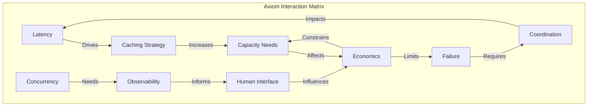

### Architecture Decision Framework

| Architecture Choice | Primary Axiom Driver | Secondary Impacts | Trade-off Analysis |
|-------------------|-------------------|------------------|-------------------|
| **Geohash vs R-tree** | Latency (simple lookups) | Capacity (storage efficiency) | Geohash wins for point queries but loses for complex polygons |
| **Sync vs Async Updates** | Concurrency (write throughput) | Consistency (data freshness) | Async enables scale but adds complexity |
| **Regional vs Global Index** | Latency (query locality) | Coordination (consistency) | Regional faster but cross-region queries suffer |
| **Hot vs Cold Tiering** | Economics (storage cost) | Latency (access time) | 80% cost savings worth 10x latency for cold data |

## Part 3: Architecture Alternatives - Exploring the Design Space

### Current Architecture: Geohash-Based System

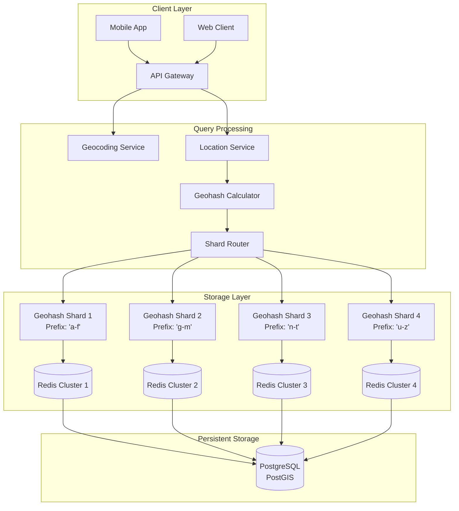

**Geohash Implementation Details:**

| Geohash Length | Cell Size | Use Case |
|---------------|-----------|----------|
| 1 | 5,000km × 5,000km | Continent |
| 3 | 156km × 156km | Large city |
| 5 | 4.9km × 4.9km | Neighborhood |
| 7 | 153m × 153m | City block |
| 9 | 4.8m × 4.8m | Building precision |

### Alternative Architecture 1: Quadtree-Based System

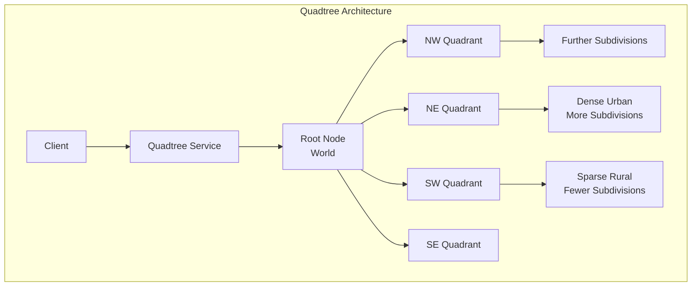

**Trade-offs:**

| Aspect | Benefit | Challenge |
|--------|---------|-----------|
| Adaptability | Handles density variation well | Complex tree management |
| Query Speed | O(log n) average | Worst case unbalanced |
| Updates | Efficient insertion | Rebalancing overhead |
| Memory | Efficient for sparse data | Pointer overhead |

### Alternative Architecture 2: R-tree Based System

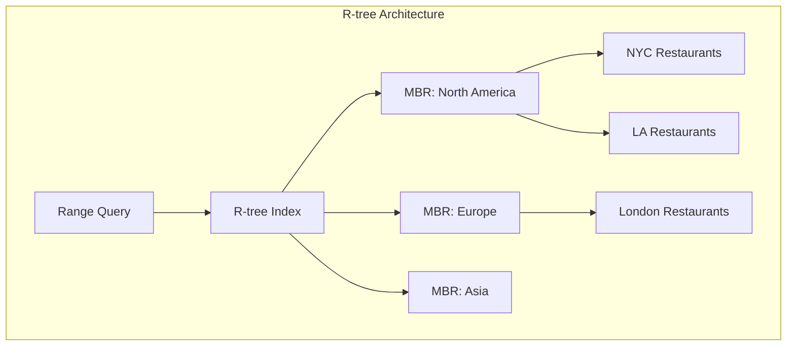

**Trade-offs:**

| Aspect | Benefit | Challenge |
|--------|---------|-----------|
| Range Queries | Extremely efficient | Complex insertions |
| Spatial Objects | Handles polygons | Higher memory usage |
| Overlap | Minimizes overlap | Periodic reorganization |
| Disk-based | Efficient I/O | Cache management |

### Alternative Architecture 3: Grid-Based System

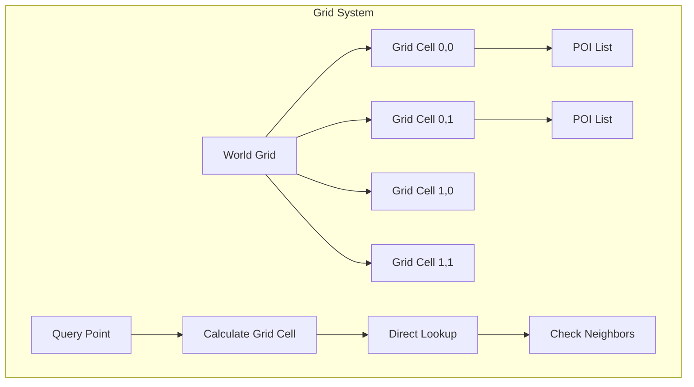

**Trade-offs:**

| Aspect | Benefit | Challenge |
|--------|---------|-----------|
| Simplicity | Very simple | Fixed granularity |
| Performance | O(1) cell lookup | Boundary queries |
| Memory | Predictable | Wasted space |
| Implementation | Easy to shard | Edge cases |

### Alternative Architecture 4: Hybrid ML-Enhanced System

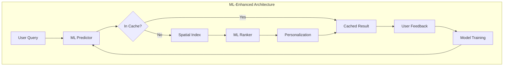

**Trade-offs:**

| Aspect | Benefit | Challenge |
|--------|---------|-----------|
| Relevance | Highly personalized | Training complexity |
| Cache Hit Rate | 90%+ for popular | Cold start problem |
| User Satisfaction | Better results | Privacy concerns |
| Adaptability | Learns patterns | Model drift |

### Recommended Architecture: Multi-Index Hybrid System

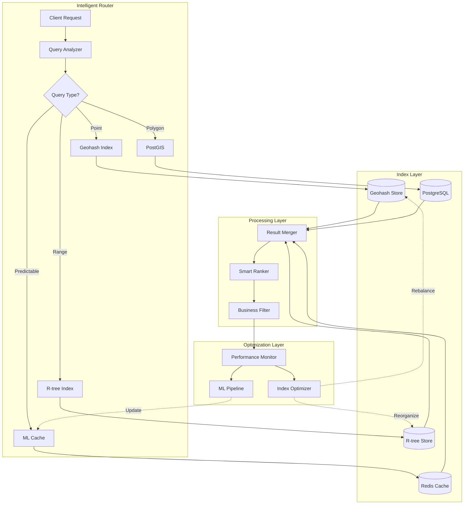

### Alternative Architecture 5: Hierarchical Grid System

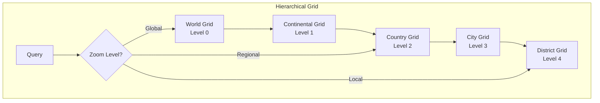

**Trade-offs:**

| Aspect | Benefit | Challenge |
|--------|---------|-----------|
| Multi-resolution | Natural zoom levels | Complex indexing |
| Query Performance | Fast at any scale | Multiple indices |
| Storage | Efficient for sparse areas | Redundant in dense areas |
| Updates | Hierarchical propagation | Consistency complexity |

## Part 4: Comprehensive Trade-off Comparison

### Performance Comparison Matrix

| Architecture | Point Query | Range Query | Update Speed | Memory Usage | Complexity |
|--------------|-------------|-------------|--------------|--------------|------------|
| **Geohash** | O(1) ✅✅✅ | O(k) ✅✅ | O(1) ✅✅✅ | Low ✅✅✅ | Simple ✅✅✅ |
| **Quadtree** | O(log n) ✅✅ | O(log n + k) ✅✅ | O(log n) ✅✅ | Medium ✅✅ | Medium ✅✅ |
| **R-tree** | O(log n) ✅✅ | O(log n + k) ✅✅✅ | O(log n) ✅ | High ✅ | Complex ✅ |
| **Grid** | O(1) ✅✅✅ | O(m) ✅ | O(1) ✅✅✅ | High ✅ | Simple ✅✅✅ |
| **ML-Enhanced** | O(1)* ✅✅✅ | O(1)* ✅✅✅ | O(n) ✅ | Very High ❌ | Very Complex ❌ |
| **Hierarchical** | O(h) ✅✅ | O(h + k) ✅✅ | O(h) ✅✅ | Medium ✅✅ | Complex ✅ |

*With cache hit, otherwise fallback to base method

### Axiom-Based Architecture Selection Guide

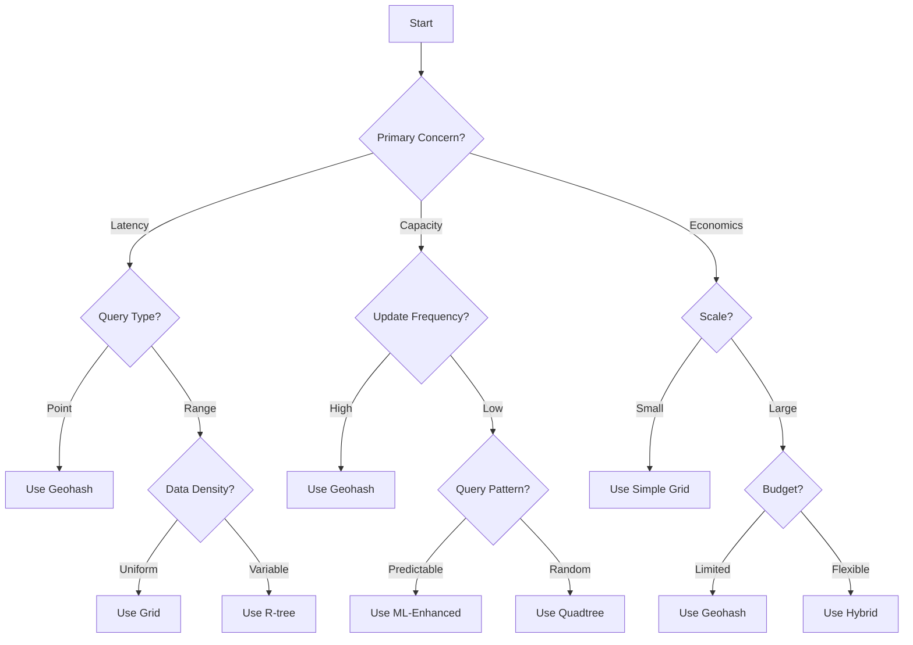

### Cost-Benefit Analysis by Scale

| User Scale | Best Architecture | Monthly Cost | Justification |
|------------|------------------|--------------|---------------|
| < 1M queries/month | Simple Grid | ~$500 | Simplicity trumps optimization |
| 1M-100M queries/month | Geohash | ~$5,000 | Good balance of features |
| 100M-1B queries/month | Quadtree/R-tree | ~$50,000 | Need efficient range queries |
| > 1B queries/month | Hybrid Multi-Index | ~$500,000 | Every optimization matters |

### Implementation Complexity vs Performance Gains

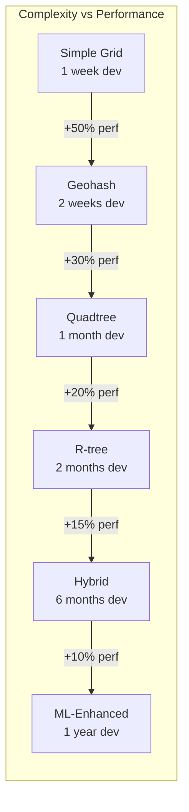

### Failure Mode Analysis

| Architecture | Single Node Failure | Region Failure | Split Brain | Data Corruption | Recovery Time |
|--------------|-------------------|----------------|-------------|-----------------|---------------|
| **Geohash** | Lose shard data | Lose region | Simple resolution | Re-index shard | < 5 minutes |
| **Quadtree** | Lose subtree | Complex recovery | Tree inconsistency | Rebuild tree | < 30 minutes |
| **R-tree** | Lose node + children | Very complex | MBR conflicts | Full rebuild | < 2 hours |
| **Grid** | Lose cell data | Lose region | No issue | Re-populate cell | < 1 minute |
| **ML-Enhanced** | Fallback to base | Model unavailable | Version conflicts | Retrain model | < 24 hours |

### Real-World Architecture Evolution Path

```mermaid
graph TB
    subgraph "Typical Evolution"
        PHASE1[Phase 1: MVP<br/>Simple Grid<br/>1-10M queries] --> PHASE2[Phase 2: Growth<br/>Geohash<br/>10-100M queries]
        PHASE2 --> PHASE3[Phase 3: Scale<br/>Quadtree/R-tree<br/>100M-1B queries]
        PHASE3 --> PHASE4[Phase 4: Optimize<br/>Hybrid System<br/>1B+ queries]
        PHASE4 --> PHASE5[Phase 5: Intelligence<br/>ML-Enhanced<br/>10B+ queries]
        
        PHASE1 -.->|6 months| PHASE2
        PHASE2 -.->|1 year| PHASE3
        PHASE3 -.->|2 years| PHASE4
        PHASE4 -.->|3 years| PHASE5
    end
```

### Decision Matrix for Architecture Selection

| Factor | Weight | Geohash | Quadtree | R-tree | Grid | ML-Enhanced | Hybrid |
|--------|--------|---------|----------|---------|------|-------------|--------|
| Implementation Speed | 25% | 5/5 | 3/5 | 2/5 | 5/5 | 1/5 | 2/5 |
| Query Performance | 20% | 4/5 | 4/5 | 5/5 | 3/5 | 5/5 | 5/5 |
| Scalability | 20% | 4/5 | 4/5 | 4/5 | 2/5 | 3/5 | 5/5 |
| Operational Complexity | 15% | 5/5 | 3/5 | 2/5 | 5/5 | 1/5 | 2/5 |
| Cost Efficiency | 10% | 5/5 | 4/5 | 3/5 | 4/5 | 2/5 | 3/5 |
| Flexibility | 10% | 3/5 | 4/5 | 5/5 | 2/5 | 5/5 | 5/5 |
| **Total Score** | 100% | **4.4** | **3.7** | **3.5** | **3.7** | **2.8** | **3.7** |

### Implementation Considerations

**1. Sharding Strategy:**
- Geographic sharding for data locality
- Consistent hashing for even distribution
- Cross-shard queries for boundaries
- Replica placement for availability

**2. Caching Architecture:**
- Multi-level caching (client, edge, service)
- Geohash prefix caching
- Popular location precomputation
- TTL based on update frequency

**3. Real-time Updates:**
- Write-through cache for consistency
- Event streaming for propagation
- Batch updates for efficiency
- Conflict resolution for concurrent updates

**4. Query Optimization:**
- Bounding box pre-filtering
- Distance calculation shortcuts
- Result size limits
- Progressive loading for large results

## Conclusion

Proximity services demonstrate how geometric algorithms and distributed systems principles combine to answer location-based queries at global scale. The hybrid architecture leverages geohashing for efficient point queries, R-trees for complex spatial operations, and machine learning for personalization, all while maintaining sub-200ms response times. The key insight is that different query patterns (point lookup vs. range search vs. polygon containment) benefit from different index structures, and a production system must intelligently route queries to the optimal index. Success comes from balancing mathematical precision with practical performance, ensuring that "What's near me?" always gets a fast, accurate answer regardless of where in the world the question is asked.