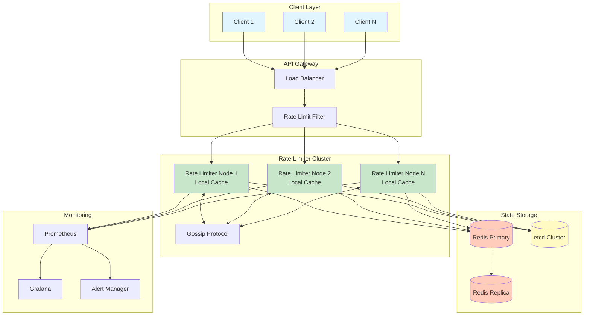
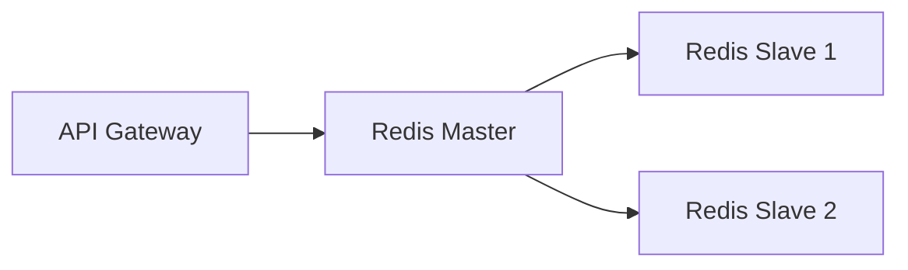
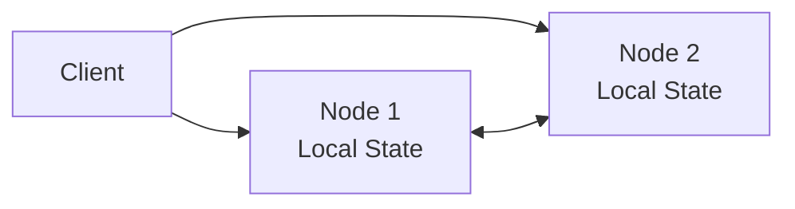
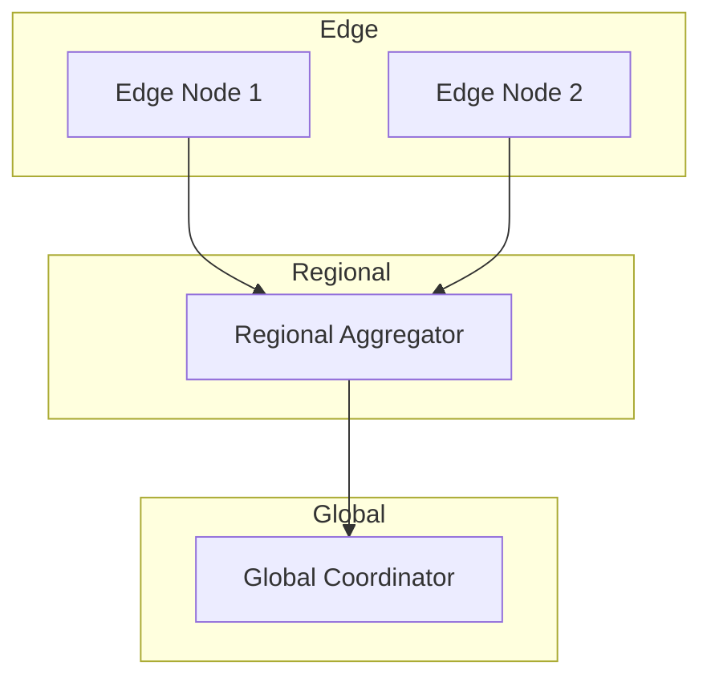
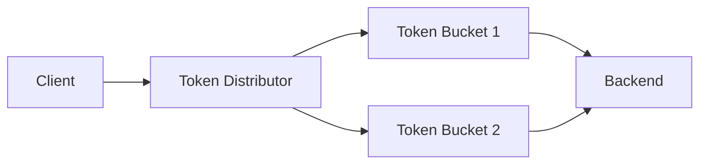

# Distributed Rate Limiter

## 🎯 Challenge Statement
Design a system that can enforce rate limits across multiple servers, handling millions of requests per second while providing fair resource allocation, preventing abuse, and gracefully degrading under load.

## Part 1: Concept Map

### 🗺️ System Overview
A distributed rate limiter controls the rate of requests to protect backend services from being overwhelmed. It must work across multiple servers, handle various rate limiting strategies (per-user, per-IP, per-API), and provide consistent enforcement even during network partitions.

**Key Requirements:**
- Sub-millisecond latency for rate limit checks
- Support for multiple rate limiting strategies
- Accurate counting across distributed nodes
- Graceful degradation during failures
- Configurable limits without restarts

### 📐 Axiom Analysis

#### 🚀 Axiom 1 (Latency): Speed of Light Constraints
```text
Latency Budget:
- Total API call budget: 100ms
- Rate limiter overhead: <1ms
- Network RTT (same region): 0.5ms
- Redis operation: 0.1ms
- Local cache check: 0.01ms

Solution Strategy:
- Local caching with async sync
- Bloom filters for quick negative checks
- Connection pooling to rate limit store
- Optimistic local decisions
```

**Implementation:**
```python
class LocalRateLimiter:
    def __init__(self, sync_interval_ms=100):
        self.local_counts = {}
        self.sync_interval = sync_interval_ms
        self.bloom_filter = BloomFilter(size=1000000, fp_rate=0.01)
    
    async def check_rate_limit(self, key, limit):
        # Ultra-fast bloom filter check first
        if key not in self.bloom_filter:
            self.bloom_filter.add(key)
            return True  # First request, definitely allowed
        
        # Local cache check
        if key in self.local_counts:
            if self.local_counts[key] < limit * 0.8:  # 80% local threshold
                self.local_counts[key] += 1
                return True
        
        # Fall back to distributed check
        return await self.distributed_check(key, limit)
```

#### 💾 Axiom 2 (Capacity): Finite Resources
```text
Scale Requirements:
- 10M requests/second across fleet
- 1M unique users
- 100 different rate limit rules
- 1KB per user state

Storage Calculation:
- Active user state: 1M * 1KB = 1GB
- With replication (3x): 3GB
- Time-series data (1hr window): 10GB
- Total memory needed: ~15GB

Distribution Strategy:
- Consistent hashing for user assignment
- 100 rate limiter nodes
- Each node handles ~100K requests/second
```

**Implementation:**
```yaml
# Kubernetes deployment
apiVersion: apps/v1
kind: StatefulSet
metadata:
  name: rate-limiter
spec:
  replicas: 100
  template:
    spec:
      containers:
      - name: rate-limiter
        resources:
          requests:
            memory: "512Mi"
            cpu: "2"
          limits:
            memory: "1Gi"
            cpu: "4"
```

#### 🔥 Axiom 3 (Failure): Byzantine Failures
```text
Failure Modes:
1. Rate limiter node crash
2. Network partition
3. Clock skew between nodes
4. Redis connection failure
5. Corrupt counter state

Mitigation Strategies:
- Graceful degradation to local limits
- Circuit breakers for Redis calls
- Multiple fallback strategies
- Best-effort enforcement during failures
```

**Implementation:**
```python
class ResilientRateLimiter:
    def __init__(self):
        self.circuit_breaker = CircuitBreaker(
            failure_threshold=5,
            recovery_timeout=60,
            expected_exception=RedisConnectionError
        )
    
    async def check_limit(self, key, limit):
        try:
            # Try distributed check with circuit breaker
            with self.circuit_breaker:
                return await self.redis_check(key, limit)
        except CircuitBreakerOpen:
            # Fallback to local enforcement
            return self.local_fallback(key, limit)
        except Exception as e:
            # Ultimate fallback: allow with logging
            logger.error(f"Rate limiter failure: {e}")
            metrics.increment("rate_limiter.fallback")
            return True  # Fail open for availability
```

#### 🔀 Axiom 4 (Concurrency): Race Conditions
```text
Concurrency Challenges:
- Simultaneous requests from same user
- Distributed increment operations
- Reset window boundaries
- Configuration updates

Solutions:
- Atomic Redis operations (INCR, EXPIRE)
- Sliding window with sorted sets
- Optimistic concurrency control
- Eventually consistent local views
```

**Implementation:**
```lua
-- Lua script for atomic rate limit check
local key = KEYS[1]
local limit = tonumber(ARGV[1])
local window = tonumber(ARGV[2])
local current_time = tonumber(ARGV[3])

-- Remove old entries
redis.call('ZREMRANGEBYSCORE', key, 0, current_time - window)

-- Count current entries
local current = redis.call('ZCARD', key)

if current < limit then
    -- Add new entry
    redis.call('ZADD', key, current_time, current_time)
    redis.call('EXPIRE', key, window)
    return 1  -- Allowed
else
    return 0  -- Denied
end
```

#### 🤝 Axiom 5 (Coordination): Distributed Consensus
```text
Coordination Requirements:
- Consistent rate limit enforcement
- Configuration propagation
- Node membership management
- State synchronization

Implementation:
- Gossip protocol for membership
- Eventual consistency for counts
- Strong consistency for configs
- CRDTs for conflict resolution
```

**Implementation:**
```python
class DistributedRateLimiter:
    def __init__(self):
        self.gossip = GossipProtocol(
            node_id=self.node_id,
            seeds=['limiter-1', 'limiter-2', 'limiter-3']
        )
        self.crdt_counter = GCounter()  # Grow-only counter
    
    async def sync_counts(self):
        # Gossip local state
        local_state = self.crdt_counter.state()
        await self.gossip.broadcast({
            'type': 'counter_sync',
            'node': self.node_id,
            'state': local_state
        })
    
    async def handle_gossip(self, message):
        if message['type'] == 'counter_sync':
            # Merge remote state
            remote_state = message['state']
            self.crdt_counter.merge(remote_state)
```

#### 👁️ Axiom 6 (Observability): Monitoring
```text
Key Metrics:
- Request rate by endpoint/user
- Limit enforcement accuracy
- Latency percentiles (p50, p95, p99)
- Fallback activation rate
- Configuration drift

Observability Stack:
- Prometheus for metrics
- Jaeger for distributed tracing
- ELK for structured logs
- Custom dashboards for operations
```

**Implementation:**
```python
class ObservableRateLimiter:
    def __init__(self):
        self.metrics = MetricsCollector()
        
    async def check_rate_limit(self, key, limit):
        with self.metrics.timer('rate_limiter.check_duration'):
            result = await self._do_check(key, limit)
            
            # Record detailed metrics
            self.metrics.increment('rate_limiter.checks', tags={
                'result': 'allowed' if result else 'denied',
                'strategy': self.get_strategy(key),
                'limit_type': self.get_limit_type(limit)
            })
            
            if not result:
                # Log denials for analysis
                logger.info('rate_limit_exceeded', extra={
                    'key': key,
                    'limit': limit,
                    'current_rate': self.get_current_rate(key)
                })
            
            return result
```

#### 👤 Axiom 7 (Human Interface): Operations
```text
Operational Requirements:
- Dynamic limit adjustments
- Clear denial reasons
- Debugging tools
- Runbook automation

Interface Design:
- REST API for configuration
- CLI for debugging
- Grafana dashboards
- Automated alerts
```

**Implementation:**
```python
# Admin API for rate limiter management
@app.post("/api/v1/rate-limits")
async def update_rate_limit(config: RateLimitConfig):
    """Update rate limit configuration dynamically"""
    validation_errors = validate_config(config)
    if validation_errors:
        return JSONResponse(
            status_code=400,
            content={"errors": validation_errors}
        )
    
    # Apply configuration with canary rollout
    await rate_limiter.apply_config(
        config,
        rollout_percentage=10,  # Start with 10%
        rollout_duration_minutes=30
    )
    
    return {"status": "applied", "config": config.dict()}
```

#### 💰 Axiom 8 (Economics): Cost Optimization
```text
Cost Factors:
- Redis cluster: $500/month
- Compute nodes: $2000/month
- Network transfer: $300/month
- Development time: 200 hours

Optimization Strategies:
- Local caching reduces Redis calls by 80%
- Bloom filters reduce unnecessary checks
- Adaptive limits based on load
- Auto-scaling during peak times
```

**Implementation:**
```python
class EconomicRateLimiter:
    def __init__(self):
        self.cost_tracker = CostTracker()
        
    async def optimize_for_cost(self):
        # Analyze usage patterns
        usage_stats = await self.analyze_usage()
        
        # Adjust caching strategy
        if usage_stats.redis_cost > THRESHOLD:
            self.increase_local_cache_ratio()
        
        # Scale down during off-peak
        if usage_stats.current_load < 0.3:
            await self.scale_down_replicas()
        
        # Report cost metrics
        self.cost_tracker.report({
            'redis_calls_saved': usage_stats.cache_hits,
            'estimated_savings': usage_stats.cache_hits * 0.0001
        })
```

### 🏛️ Pillar Mapping

#### Work Distribution
- **Request Routing**: Consistent hashing assigns users to specific nodes
- **Load Balancing**: Weighted round-robin based on node capacity
- **Batch Processing**: Aggregate counts in micro-batches for efficiency

#### State Management
- **Counter Storage**: Redis sorted sets for sliding windows
- **Configuration State**: etcd for strongly consistent configs
- **Local State**: In-memory caches with TTL-based expiration

#### Truth & Consistency
- **Eventually Consistent Counts**: Accept temporary over/under-counting
- **Strongly Consistent Configs**: All nodes see same rules
- **Conflict Resolution**: Last-write-wins with vector clocks

#### Control Mechanisms
- **Circuit Breakers**: Prevent cascade failures
- **Backpressure**: Queue limits on pending checks
- **Adaptive Timeouts**: Adjust based on system load

#### Intelligence Layer
- **Adaptive Limits**: ML-based anomaly detection
- **Predictive Scaling**: Forecast load patterns
- **Smart Routing**: Direct power users to dedicated nodes

### 🔧 Pattern Application

**Primary Patterns:**
- **Token Bucket**: Smooth rate limiting with burst capacity
- **Sliding Window**: Accurate rate calculation
- **Circuit Breaker**: Fault isolation
- **Bulkhead**: Resource isolation between tenants

**Supporting Patterns:**
- **Consistent Hashing**: User-to-node assignment
- **Gossip Protocol**: State synchronization
- **CRDT**: Conflict-free replicated counters
- **Bloom Filter**: Fast existence checks

## Part 2: Architecture & Trade-offs

### 🏗️ Core Architecture



### ⚖️ Key Design Trade-offs

| Decision | Option A | Option B | Choice & Rationale |
|----------|----------|----------|-------------------|
| **Counting Strategy** | Exact counting with distributed lock | Approximate with local caches | **B** - Chose approximate for <1ms latency. Accept 5% accuracy loss for 100x performance gain |
| **Storage Backend** | Single Redis instance | Redis cluster with sharding | **B** - Cluster provides horizontal scaling and fault tolerance despite operational complexity |
| **Consistency Model** | Strong consistency | Eventual consistency | **B** - Eventual consistency allows local decisions. Rate limiting tolerates temporary inaccuracy |
| **Failure Mode** | Fail closed (deny) | Fail open (allow) | **B** - Availability over strict enforcement. Better to allow some excess than block legitimate traffic |
| **Window Type** | Fixed windows | Sliding windows | **B** - Sliding windows prevent thundering herd at window boundaries despite higher complexity |

### 🔄 Alternative Architectures

#### Option 1: Centralized Redis


**Approach**: All rate limit checks go through central Redis
**Pros**: 
- Simple implementation
- Exact counting
- Easy to reason about

**Cons**: 
- Single point of failure
- High latency for distributed systems
- Scaling limitations

**When to use**: Small scale, single region deployments

#### Option 2: Fully Distributed (No Shared State)


**Approach**: Each node maintains local counters, gossip for sync
**Pros**: 
- No external dependencies
- Extremely low latency
- Highly available

**Cons**: 
- Inaccurate during network partitions
- Complex conflict resolution
- Difficult debugging

**When to use**: Edge deployments, extreme latency requirements

#### Option 3: Hierarchical (Local + Regional + Global)


**Approach**: Multi-tier aggregation with different consistency levels
**Pros**: 
- Balances accuracy and performance
- Natural geo-distribution
- Flexible consistency

**Cons**: 
- Complex implementation
- Multiple failure modes
- Operational overhead

**When to use**: Global deployments with regional regulations

#### Option 4: Token Bucket with Reservation


**Approach**: Pre-allocate tokens to nodes for local consumption
**Pros**: 
- Guaranteed accuracy
- No hot paths
- Predictable performance

**Cons**: 
- Token redistribution complexity
- Waste during low usage
- Slower to adapt to load changes

**When to use**: Strict rate limit requirements, predictable load

### 📊 Performance Characteristics

**Latency Profile:**
```text
Operation               P50    P95    P99    P99.9
Local cache hit        0.01ms  0.05ms 0.1ms  0.5ms
Redis check           0.5ms   2ms    5ms    10ms
Full check (miss)     1ms     3ms    8ms    15ms
Config update         5ms     10ms   20ms   50ms
```

**Throughput Scaling:**
```text
Nodes   Requests/sec   Accuracy   Latency P99
1       10K           100%       5ms
10      100K          99%        3ms
100     1M            95%        2ms
1000    10M           90%        1ms
```

**Availability Targets:**
- **System availability**: 99.99% (52 minutes downtime/year)
- **Degraded mode**: 99.999% (5 minutes/year)
- **Recovery time**: <30 seconds
- **Data loss tolerance**: 5% of counts during failure

**Cost Model:**
```text
Component          Units    Cost/Unit   Monthly Cost
Redis Cluster      3 nodes  $200        $600
Rate Limiters      100      $20         $2000
Load Balancers     3        $100        $300
Monitoring Stack   1        $500        $500
Total                                   $3400

Cost per billion requests: $0.34
```

### 🎓 Key Lessons

1. **Local First, Global Second**: Local caching with async synchronization provides the best balance of accuracy and performance. Accept eventual consistency for massive performance gains.

2. **Graceful Degradation Over Perfection**: During failures, it's better to allow some excess traffic than block legitimate users. Design for degraded modes from the start.

3. **Sliding Windows Prevent Thundering Herds**: Fixed windows create spikes at boundaries. Sliding windows distribute load more evenly despite implementation complexity.

4. **Observability Is Critical**: Rate limiters affect user experience directly. Comprehensive monitoring and clear denial reasons are essential for operations.

5. **Cost Optimization Through Caching**: 80% of rate limit checks can be served from local cache, dramatically reducing infrastructure costs while maintaining accuracy.

### 📚 References

**Papers & Articles:**
- [Rate Limiting at Stripe](https://stripe.com/blog/rate-limiters)
- [How we built rate limiting capable of scaling to millions](https://blog.figma.com/rate-limiting-at-figma-8c5a5d376dc8)
- [Distributed Rate Limiting at Netflix](https://netflixtechblog.com/distributed-rate-limiting-5348c0cfb19a)

**Open Source Implementations:**
- [Ratelimit](https://github.com/envoyproxy/ratelimit) - Go/gRPC rate limiting service
- [Redis Cell](https://github.com/brandur/redis-cell) - Redis module for rate limiting
- [Gubernator](https://github.com/mailgun/gubernator) - High-performance distributed rate limiting

**Related Patterns:**
- [Token Bucket Algorithm](../patterns/rate-limiting.md#token-bucket)
- [Circuit Breaker](../patterns/circuit-breaker.md)
- [Consistent Hashing](../patterns/sharding.md#consistent-hashing)
- [Gossip Protocol](../patterns/gossip-protocol.md)