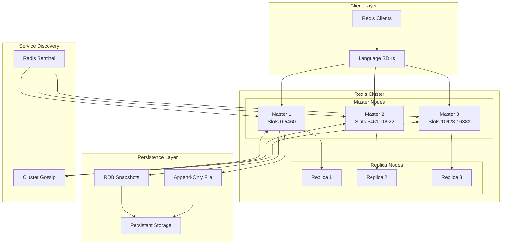

# Redis Architecture: Scale and Architecture Deep Dive

!!! abstract "Quick Facts"
| Metric | Value |
 |--------|-------|
 | **Scale** | 1M+ operations/second |
 | **Throughput** | 100k concurrent connections |
 | **Data Volume** | TB-scale datasets |
 | **Availability** | 99.9% with replication |
 | **Team Size** | 50+ core contributors |


## Executive Summary

Redis achieves extraordinary performance through radical architectural simplicity: a single-threaded event loop processing commands sequentially. This eliminates concurrency complexity while custom data structures optimize for both speed and memory efficiency. At scale, Redis Cluster provides transparent sharding across thousands of nodes, demonstrating how simple designs can handle massive workloads.

## System Overview

### Business Context

<div class="grid" markdown>
 <div class="card">
 <h3 class="card__title">Problem Space</h3>
 <p class="card__description">Provide ultra-low latency data structure operations for caching and real-time applications</p>
 </div>
 <div class="card">
 <h3 class="card__title">Constraints</h3>
 <p class="card__description">Memory limitations, single-thread performance, persistence durability requirements</p>
 </div>
 <div class="card">
 <h3 class="card__title">Success Metrics</h3>
 <p class="card__description">Sub-millisecond latency, 1M+ ops/sec throughput, 99.9% availability</p>
 </div>
</div>

### High-Level Architecture



## Mapping to Fundamental Laws

### Law Analysis

<table class="responsive-table">
<thead>
 <tr>
 <th>Law</th>
 <th>Challenge</th>
 <th>Solution</th>
 <th>Trade-off</th>
 </tr>
</thead>
<tbody>
 <tr>
 <td data-label="Law">Correlated Failure</td>
 <td data-label="Challenge">Master node failures losing all data</td>
 <td data-label="Solution">Master-replica replication, Redis Sentinel</td>
 <td data-label="Trade-off">2x storage cost, replication lag</td>
 </tr>
 <tr>
 <td data-label="Law">Asynchronous Reality</td>
 <td data-label="Challenge">Context switching overhead in multi-threading</td>
 <td data-label="Solution">Single-threaded event loop, non-blocking I/O</td>
 <td data-label="Trade-off">Cannot utilize multiple CPU cores</td>
 </tr>
 <tr>
 <td data-label="Law">Emergent Chaos</td>
 <td data-label="Challenge">Concurrent operations on shared data</td>
 <td data-label="Solution">Sequential command processing, atomic operations</td>
 <td data-label="Trade-off">Commands must be small and fast</td>
 </tr>
 <tr>
 <td data-label="Law">Multidimensional Optimization</td>
 <td data-label="Challenge">Balance memory usage, speed, and durability</td>
 <td data-label="Solution">Custom data structures, configurable persistence</td>
 <td data-label="Trade-off">Complex memory management and tuning</td>
 </tr>
 <tr>
 <td data-label="Law">Distributed Knowledge</td>
 <td data-label="Challenge">Monitoring thousands of Redis instances</td>
 <td data-label="Solution">Built-in INFO command, external monitoring tools</td>
 <td data-label="Trade-off">Limited built-in observability features</td>
 </tr>
 <tr>
 <td data-label="Law">Cognitive Load</td>
 <td data-label="Challenge">Complex distributed caching patterns</td>
 <td data-label="Solution">Simple data structure operations, clear APIs</td>
 <td data-label="Trade-off">Application must handle distribution logic</td>
 </tr>
 <tr>
 <td data-label="Law">Economic Reality</td>
 <td data-label="Challenge">Memory costs at scale</td>
 <td data-label="Solution">Memory-efficient data structures, compression</td>
 <td data-label="Trade-off">CPU overhead for compression/decompression</td>
 </tr>
</tbody>
</table>

## Design Deep Dive

### Data Architecture

!!! tip "Key Design Decisions"
 1. **Single-Threaded Event Loop**: Eliminates locking overhead, provides predictable performance
 2. **Custom Data Structures**: Optimized memory layouts for strings, lists, sets, hashes, sorted sets
 3. **Memory-First Design**: All data stored in RAM with optional persistence to disk
 4. **Consistent Hashing**: Redis Cluster uses hash slots for automatic sharding

### Scaling Strategy

=== "Single Instance"

 **Scale: Up to 100K ops/sec**

 ```mermaid
 graph TB
 CLIENT[Clients] --> REDIS[Redis Instance]
 REDIS --> MEM[In-Memory Data]
 ```

 **Characteristics:**
 - Simple setup and maintenance
 - No replication overhead
 - Limited by single server memory
 - No fault tolerance
 - Single-threaded performance limits

 **Configuration:**
 ```bash
 # Basic Redis configuration
 maxmemory 16gb
 maxmemory-policy allkeys-lru
 save 900 1 300 10 60 10000
 ```

 **Use Case:** Development, caching, session storage

=== "Master-Replica"

 **Scale: Up to 500K reads/sec**

 ```mermaid
 graph TB
 CLIENT[Clients] --> LB[Load Balancer]
 LB -->|Writes| MASTER[Master]
 LB -->|Reads| R1[Replica 1]
 LB -->|Reads| R2[Replica 2]
 MASTER -->|Async Replication| R1
 MASTER -->|Async Replication| R2
 ```

 **Characteristics:**
 - Read scaling through replicas
 - Automatic failover with Sentinel
 - Asynchronous replication lag
 - Master still bottleneck for writes

 **Configuration:**
 ```bash
 # Master configuration
 port 6379
 
 # Replica configuration
 replicaof master-host 6379
 replica-read-only yes
 ```

 **Use Case:** Read-heavy workloads, high availability

=== "Redis Cluster"

 **Scale: 1M+ ops/sec**

 ```mermaid
 graph TB
 subgraph "Hash Slot Distribution"
 CLIENT[Clients] --> SLOT[Hash Slot Router]
 SLOT -->|Slots 0-5460| M1[Master 1]
 SLOT -->|Slots 5461-10922| M2[Master 2]
 SLOT -->|Slots 10923-16383| M3[Master 3]
 M1 --> R1[Replica 1]
 M2 --> R2[Replica 2]
 M3 --> R3[Replica 3]
 end
 ```

 **Characteristics:**
 - Automatic sharding across nodes
 - Linear scaling for reads/writes
 - 16384 hash slots distribution
 - Complex cluster management
 - Cross-slot operations limitations

 **Configuration:**
 ```bash
 # Enable cluster mode
 cluster-enabled yes
 cluster-config-file nodes.conf
 cluster-node-timeout 5000
 ```

 **Use Case:** Large-scale caching, real-time analytics

=== "Durable Cluster"

 **Persistence Options:**

 ```mermaid
 graph TB
 subgraph "RDB Snapshots"
 MEM1[Memory] -->|Periodic| RDB[RDB File]
 RDB -->|On Restart| MEM1
 end
 
 subgraph "AOF Log"
 MEM2[Memory] -->|Every Write| AOF[AOF File]
 AOF -->|Replay| MEM2
 end
 
 subgraph "Hybrid"
 MEM3[Memory] -->|Mixed| BOTH[RDB + AOF]
 end
 ```

 **RDB Configuration:**
 ```bash
 save 900 1     # After 900 sec if at least 1 key changed
 save 300 10    # After 300 sec if at least 10 keys changed
 save 60 10000  # After 60 sec if at least 10000 keys changed
 ```

 **AOF Configuration:**
 ```bash
 appendonly yes
 appendfsync everysec  # Sync every second
 no-appendfsync-on-rewrite no
 ```

 **Use Case:** Persistent caching, reliable queues

=== "Global Scale"

 **Multi-Region Architecture:**

 ```mermaid
 graph TB
 subgraph "US Region"
 US_C[US Cluster]
 US_S[US Sentinel]
 end
 
 subgraph "EU Region"
 EU_C[EU Cluster]
 EU_S[EU Sentinel]
 end
 
 subgraph "APAC Region"
 APAC_C[APAC Cluster]
 APAC_S[APAC Sentinel]
 end
 
 US_C <-->|CRDT Replication| EU_C
 EU_C <-->|CRDT Replication| APAC_C
 APAC_C <-->|CRDT Replication| US_C
 ```

 **Characteristics:**
 - Active-active replication
 - Conflict-free replicated data types
 - Regional data locality
 - Complex consistency models
 - High infrastructure costs

 **Use Case:** Global platforms, multi-region applications

## Failure Scenarios & Lessons

!!! danger "Major Incident: Instagram Redis Memory Exhaustion 2015"
 **What Happened**: Redis instances ran out of memory during a traffic spike, causing widespread cache misses and database overload.

 **Root Cause**: 
 - Exponential growth in user activity without corresponding memory scaling
 - No automated eviction policies configured
 - Insufficient monitoring of memory usage patterns

 **Impact**: 
 - 2 hours of degraded performance
 - 300% increase in database load
 - Multiple service timeouts and user experience issues
 - Cache hit rate dropped from 95% to 30%

 **Lessons Learned**:
 1. **Memory management**: Implement LRU eviction policies and memory monitoring
 2. **Capacity planning**: Proactive scaling based on usage trends
 3. **Circuit breakers**: Protect downstream databases from cache miss storms

## Performance Characteristics

### Latency Breakdown

<div class="grid" markdown>
 <div class="card">
 <h3 class="card__title">GET Operation</h3>
 <div class="stat-number">0.1ms</div>
 </div>
 <div class="card">
 <h3 class="card__title">SET Operation</h3>
 <div class="stat-number">0.2ms</div>
 </div>
 <div class="card">
 <h3 class="card__title">Complex Operations</h3>
 <div class="stat-number">1-5ms</div>
 </div>
</div>

### Resource Utilization

| Resource | Usage | Efficiency |
|----------|-------|------------|
| CPU | 70-80% single core | High for I/O bound workloads |
| Memory | 80-90% | Extremely efficient data structures |
| Network | Variable | Limited by single-thread processing |
| Storage | Periodic writes | Configurable persistence trade-offs |


## Operational Excellence

### Monitoring & Observability

- **Metrics**: Built-in INFO command providing 200+ metrics on performance and health
- **Logging**: Configurable logging levels with slowlog for performance analysis
- **Tracing**: Command-level timing and execution statistics
- **Alerting**: Memory usage, replication lag, and connection count monitoring

### Deployment Strategy

=== "Replica Promotion"

 ```mermaid
 sequenceDiagram
 participant C as Clients
 participant S as Sentinel
 participant M as Master (Old)
 participant R as Replica (New)
 
 S->>M: Monitor health
 S->>R: Deploy new version
 S->>R: Verify replication lag
 S->>C: Redirect writes to R
 S->>R: Promote to Master
 S->>M: Demote to Replica
 ```

 **Process:**
 1. Deploy update to replica nodes
 2. Verify replication is current
 3. Promote replica to master
 4. Redirect client connections
 5. Update old master

 **Downtime:** < 1 second failover

=== "Blue-Green Deployment"

 ```mermaid
 graph LR
 subgraph "Blue (Current)"
 B_M[Blue Master]
 B_R[Blue Replicas]
 end
 
 subgraph "Green (New)"
 G_M[Green Master]
 G_R[Green Replicas]
 end
 
 CLIENT[Clients] --> PROXY[Proxy]
 PROXY --> B_M
 PROXY -.-> G_M
 
 B_M -->|Sync| G_M
 ```

 **Process:**
 1. Create identical Green environment
 2. Sync data from Blue to Green
 3. Test Green environment
 4. Switch proxy to Green
 5. Keep Blue for rollback

 **Downtime:** Zero with proxy switch

=== "Hot Configuration Reload"

 ```bash
 # Runtime configuration changes
 CONFIG SET maxmemory 32gb
 CONFIG SET maxmemory-policy allkeys-lru
 CONFIG SET save "900 1 300 10"
 
 # Persist configuration
 CONFIG REWRITE
 
 # Verify changes
 CONFIG GET maxmemory
 ```

 **Supported Hot Changes:**
 - Memory limits
 - Eviction policies
 - Persistence settings
 - Replication parameters
 - Client connection limits

 **Requires Restart:**
 - Port changes
 - Cluster mode toggle
 - Bind addresses

=== "Zero-Downtime Migration"

 ```mermaid
 stateDiagram-v2
 [*] --> Setup: Create target cluster
 Setup --> Sync: Start replication
 Sync --> Verify: Check data integrity
 Verify --> Switch: Update DNS/Proxy
 Switch --> Monitor: Watch metrics
 Monitor --> Cleanup: Remove source
 Cleanup --> [*]
 ```

 **Migration Steps:**
 ```bash
 # 1. Create target cluster
 redis-cli --cluster create target-nodes
 
 # 2. Start live migration
 redis-cli --cluster migrate source target
 
 # 3. Verify migration
 redis-cli --cluster check target
 
 # 4. Switch traffic
 # Update application config or proxy
 
 # 5. Cleanup source
 redis-cli --cluster remove-node source
 ```

## Key Innovations

1. **Single-Threaded Architecture**: Eliminated complexity while maximizing single-core performance
2. **Memory-Optimized Data Structures**: Custom implementations reducing memory usage by 50-90%
3. **Hybrid Persistence**: Combining RDB snapshots and AOF logs for durability and performance

## Applicable Patterns

<div class="grid" markdown>
 <a href="../../patterns/caching/" class="pattern-card">
 <h3 class="pattern-card__title">Caching</h3>
 <p class="pattern-card__description">In-memory data storage for fast access patterns</p>
 </a>
 <a href="../../patterns/leader-follower/" class="pattern-card">
 <h3 class="pattern-card__title">Master-Replica</h3>
 <p class="pattern-card__description">Asynchronous replication for high availability</p>
 </a>
 <a href="../../patterns/consistent-hashing/" class="pattern-card">
 <h3 class="pattern-card__title">Hash Slots</h3>
 <p class="pattern-card__description">Consistent hashing for automatic data distribution</p>
 </a>
 <a href="../../patterns/event-loop/" class="pattern-card">
 <h3 class="pattern-card__title">Event Loop</h3>
 <p class="pattern-card__description">Single-threaded non-blocking I/O processing</p>
 </a>
</div>

## Takeaways for Your System

!!! quote "Key Lessons"
 1. **When to apply**: Use for caching, session storage, real-time analytics, and pub-sub messaging
 2. **When to avoid**: Don't use as primary database for complex queries or when strong consistency is required
 3. **Cost considerations**: Memory is expensive but performance gains justify cost for hot data
 4. **Team requirements**: Need expertise in memory management, Redis operations, and caching strategies

## Further Reading

- [Redis Design and Implementation](https://redisbook.readthedocs.io/en/latest/)
- [Redis in Action](https://www.manning.com/books/redis-in-action)
- [Scaling Redis at Twitter](https://blog.twitter.com/engineering/en_us/topics/infrastructure/2014/scaling-redis-at-twitter)
- [Redis Official Documentation](https://redis.io/documentation)

## Discussion Questions

1. How does Redis's single-threaded architecture compare to multi-threaded databases in terms of scalability?
2. What are the trade-offs between Redis's different persistence options (RDB vs AOF)?
3. How would you design a caching strategy using Redis for a globally distributed application?
4. What are the implications of Redis's eventually consistent replication for application design?