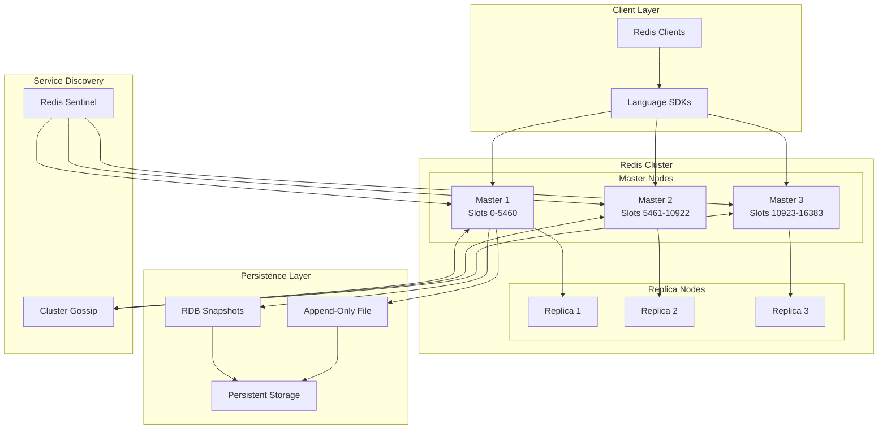
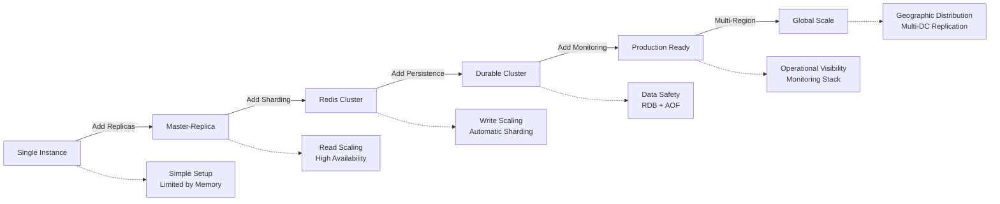

# Redis Architecture: Scale and Architecture Deep Dive

<h3>Quick Facts</h3>

| Metric | Value |
|--------|-------|
| **Scale** | 1M+ operations/second |
| **Throughput** | 100k concurrent connections |
| **Data Volume** | TB-scale datasets |
| **Availability** | 99.9% with replication |
| **Team Size** | 50+ core contributors |

## Executive Summary

Redis achieves extraordinary performance through radical architectural simplicity: a single-threaded event loop processing commands sequentially. This eliminates concurrency complexity while custom data structures optimize for both speed and memory efficiency. At scale, Redis Cluster provides transparent sharding across thousands of nodes, demonstrating how simple designs can handle massive workloads.

## System Overview

### Business Context

  

    <h3 class="card__title">Problem Space</h3>
    
Provide ultra-low latency data structure operations for caching and real-time applications

  

  

    <h3 class="card__title">Constraints</h3>
    
Memory limitations, single-thread performance, persistence durability requirements

  

  

    <h3 class="card__title">Success Metrics</h3>
    
Sub-millisecond latency, 1M+ ops/sec throughput, 99.9% availability

  

### High-Level Architecture

## Mapping to Fundamental Laws

### Law Analysis

<table class="responsive-table">
<thead>
  <tr>
    <th>Law</th>
    <th>Challenge</th>
    <th>Solution</th>
    <th>Trade-off</th>
  </tr>
</thead>
<tbody>
  <tr>
    <td data-label="Law">Correlated Failure</td>
    <td data-label="Challenge">Master node failures losing all data</td>
    <td data-label="Solution">Master-replica replication, Redis Sentinel</td>
    <td data-label="Trade-off">2x storage cost, replication lag</td>
  </tr>
  <tr>
    <td data-label="Law">Asynchronous Reality</td>
    <td data-label="Challenge">Context switching overhead in multi-threading</td>
    <td data-label="Solution">Single-threaded event loop, non-blocking I/O</td>
    <td data-label="Trade-off">Cannot utilize multiple CPU cores</td>
  </tr>
  <tr>
    <td data-label="Law">Emergent Chaos</td>
    <td data-label="Challenge">Concurrent operations on shared data</td>
    <td data-label="Solution">Sequential command processing, atomic operations</td>
    <td data-label="Trade-off">Commands must be small and fast</td>
  </tr>
  <tr>
    <td data-label="Law">Multidimensional Optimization</td>
    <td data-label="Challenge">Balance memory usage, speed, and durability</td>
    <td data-label="Solution">Custom data structures, configurable persistence</td>
    <td data-label="Trade-off">Complex memory management and tuning</td>
  </tr>
  <tr>
    <td data-label="Law">Distributed Knowledge</td>
    <td data-label="Challenge">Monitoring thousands of Redis instances</td>
    <td data-label="Solution">Built-in INFO command, external monitoring tools</td>
    <td data-label="Trade-off">Limited built-in observability features</td>
  </tr>
  <tr>
    <td data-label="Law">Cognitive Load</td>
    <td data-label="Challenge">Complex distributed caching patterns</td>
    <td data-label="Solution">Simple data structure operations, clear APIs</td>
    <td data-label="Trade-off">Application must handle distribution logic</td>
  </tr>
  <tr>
    <td data-label="Law">Economic Reality</td>
    <td data-label="Challenge">Memory costs at scale</td>
    <td data-label="Solution">Memory-efficient data structures, compression</td>
    <td data-label="Trade-off">CPU overhead for compression/decompression</td>
  </tr>
</tbody>
</table>

## Design Deep Dive

### Data Architecture

<h3>Key Design Decisions</h3>

1. **Single-Threaded Event Loop**: Eliminates locking overhead, provides predictable performance
2. **Custom Data Structures**: Optimized memory layouts for strings, lists, sets, hashes, sorted sets
3. **Memory-First Design**: All data stored in RAM with optional persistence to disk
4. **Consistent Hashing**: Redis Cluster uses hash slots for automatic sharding

### Scaling Strategy

## Failure Scenarios & Lessons

<h3>Major Incident: Instagram Redis Memory Exhaustion 2015</h3>

**What Happened**: Redis instances ran out of memory during a traffic spike, causing widespread cache misses and database overload.

**Root Cause**: 
- Exponential growth in user activity without corresponding memory scaling
- No automated eviction policies configured
- Insufficient monitoring of memory usage patterns

**Impact**: 
- 2 hours of degraded performance
- 300% increase in database load
- Multiple service timeouts and user experience issues
- Cache hit rate dropped from 95% to 30%

**Lessons Learned**:
1. **Memory management**: Implement LRU eviction policies and memory monitoring
2. **Capacity planning**: Proactive scaling based on usage trends
3. **Circuit breakers**: Protect downstream databases from cache miss storms

## Performance Characteristics

### Latency Breakdown

  

    <h3 class="card__title">GET Operation</h3>
    
0.1ms

  

  

    <h3 class="card__title">SET Operation</h3>
    
0.2ms

  

  

    <h3 class="card__title">Complex Operations</h3>
    
1-5ms

  

### Resource Utilization

| Resource | Usage | Efficiency |
|----------|-------|------------|
| CPU | 70-80% single core | High for I/O bound workloads |
| Memory | 80-90% | Extremely efficient data structures |
| Network | Variable | Limited by single-thread processing |
| Storage | Periodic writes | Configurable persistence trade-offs |

## Operational Excellence

### Monitoring & Observability

- **Metrics**: Built-in INFO command providing 200+ metrics on performance and health
- **Logging**: Configurable logging levels with slowlog for performance analysis
- **Tracing**: Command-level timing and execution statistics
- **Alerting**: Memory usage, replication lag, and connection count monitoring

### Deployment Strategy

**Deployment Frequency**: Rolling updates with replica promotion
**Rollout Strategy**: Blue-green deployment with traffic shifting
**Rollback Time**: < 2 minutes with automated failover
**Configuration Management**: Redis configuration files with hot reloading

## Key Innovations

1. **Single-Threaded Architecture**: Eliminated complexity while maximizing single-core performance
2. **Memory-Optimized Data Structures**: Custom implementations reducing memory usage by 50-90%
3. **Hybrid Persistence**: Combining RDB snapshots and AOF logs for durability and performance

## Applicable Patterns

  <a href="../../patterns/caching/" class="pattern-card">
    <h3 class="pattern-card__title">Caching</h3>
    
In-memory data storage for fast access patterns

  </a>
  <a href="../../patterns/leader-follower/" class="pattern-card">
    <h3 class="pattern-card__title">Master-Replica</h3>
    
Asynchronous replication for high availability

  </a>
  <a href="../../patterns/consistent-hashing/" class="pattern-card">
    <h3 class="pattern-card__title">Hash Slots</h3>
    
Consistent hashing for automatic data distribution

  </a>
  <a href="../../patterns/event-loop/" class="pattern-card">
    <h3 class="pattern-card__title">Event Loop</h3>
    
Single-threaded non-blocking I/O processing

  </a>

## Takeaways for Your System

<h3>Key Lessons</h3>

1. **When to apply**: Use for caching, session storage, real-time analytics, and pub-sub messaging
2. **When to avoid**: Don't use as primary database for complex queries or when strong consistency is required
3. **Cost considerations**: Memory is expensive but performance gains justify cost for hot data
4. **Team requirements**: Need expertise in memory management, Redis operations, and caching strategies

## Further Reading

- [Redis Design and Implementation](https://redisbook.readthedocs.io/en/latest/)
- [Redis in Action](https://www.manning.com/books/redis-in-action)
- [Scaling Redis at Twitter](https://blog.twitter.com/engineering/en_us/topics/infrastructure/2014/scaling-redis-at-twitter)
- [Redis Official Documentation](https://redis.io/documentation)

## Discussion Questions

1. How does Redis's single-threaded architecture compare to multi-threaded databases in terms of scalability?
2. What are the trade-offs between Redis's different persistence options (RDB vs AOF)?
3. How would you design a caching strategy using Redis for a globally distributed application?
4. What are the implications of Redis's eventually consistent replication for application design?