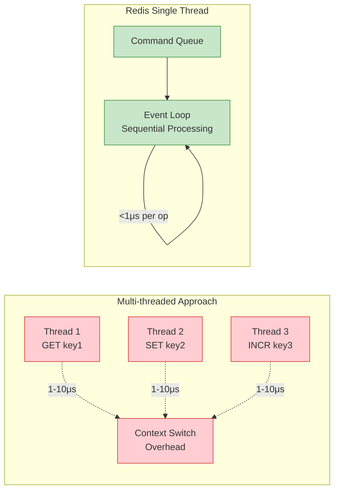
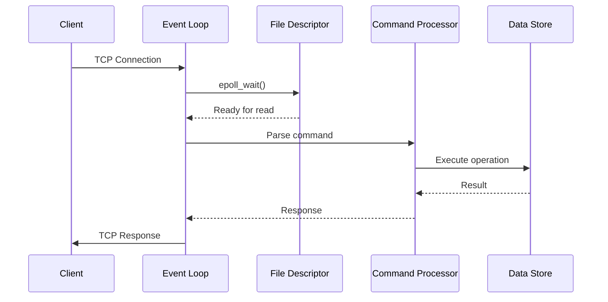
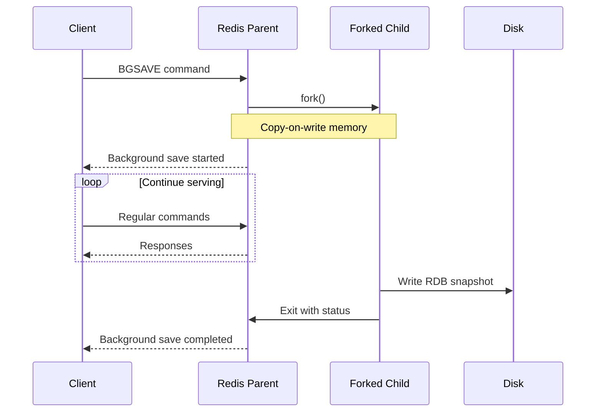
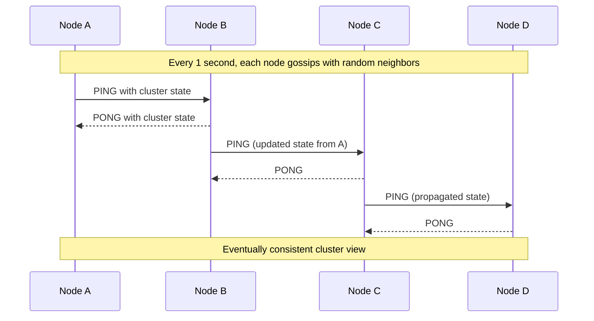
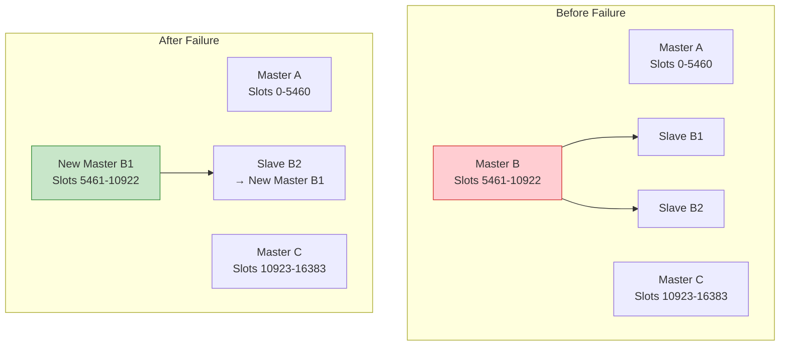
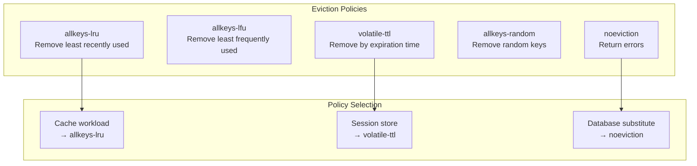
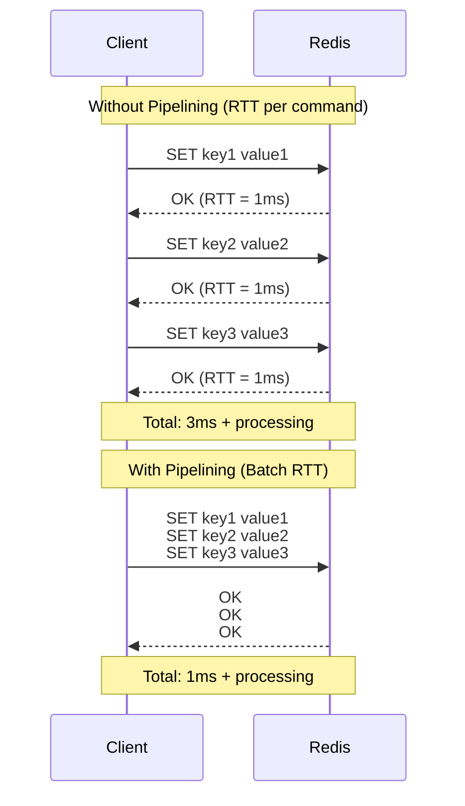
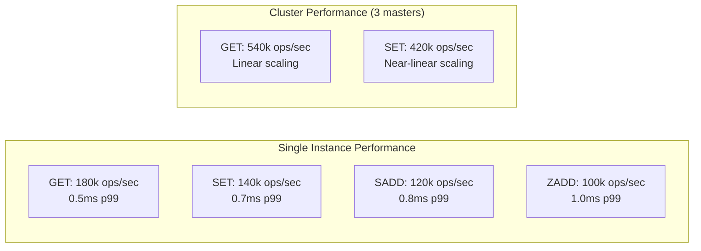
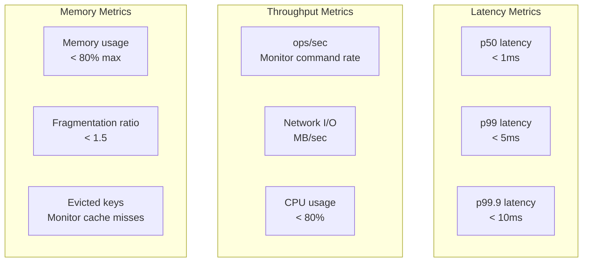
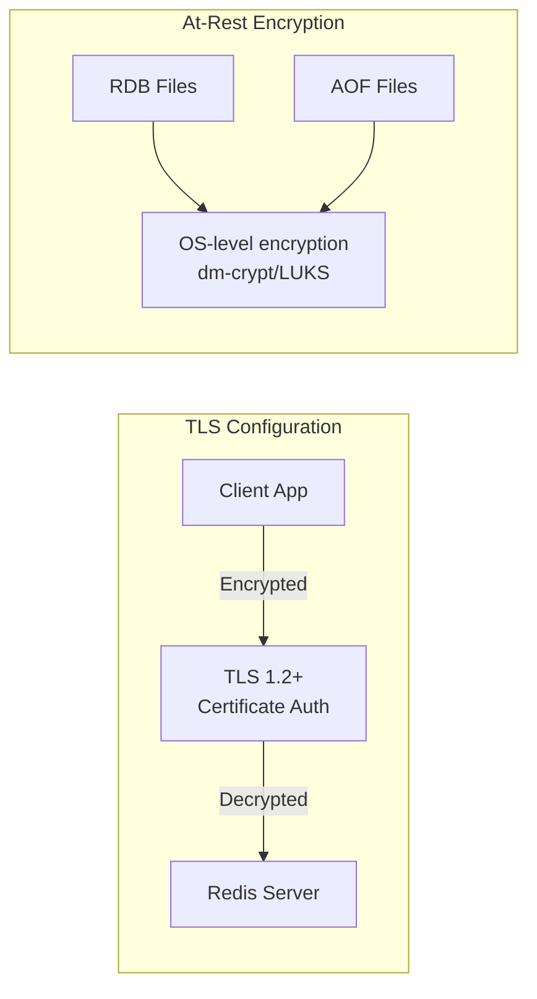

<!-- Navigation -->
[Home](../introduction/index.md) → [Case Studies](index.md) → **Redis Architecture Deep Dive**

# 🗃️ Redis Architecture Deep Dive

**The Challenge**: Build an in-memory data structure server capable of 1M+ operations per second with millisecond latencies

!!! info "Case Study Overview"
    **System**: High-performance in-memory data structure server  
    **Scale**: 1M+ ops/sec, TB-scale datasets, 100k+ concurrent connections  
    **Challenges**: Memory optimization, persistence durability, cluster scaling  
    **Key Patterns**: Single-threaded event loop, custom data structures, consistent hashing  
    **Sources**: Redis Documentation¹, Redis Code², Redis Design & Implementation³, Salvatore's Blog⁴

## Introduction

Redis achieves extraordinary performance through radical simplicity: a single-threaded event loop processing commands sequentially. This eliminates concurrency complexity while custom data structures optimize for both speed and memory efficiency. At scale, Redis Cluster provides transparent sharding across thousands of nodes.

## Part 1: The Physics of Single-Threaded Performance

### Axiom 1: Latency - The Cost of Context Switching

<div class="axiom-box">
<h4>🕰️ Latency Axiom in Action</h4>
<p><strong>Context switches cost 1-10 microseconds</strong> - Redis eliminates this by processing all operations on a single thread, achieving sub-microsecond command processing.</p>
</div>



**Performance Comparison:**

| Architecture | Latency per Operation | Throughput | Memory Overhead |
|-------------|---------------------|------------|----------------|
| Multi-threaded | 10-50μs | 50k-200k ops/sec | High (locks, stacks) |
| Redis Single-threaded | 0.1-1μs | 100k-1M ops/sec | Minimal |

### Axiom 2: Finite Capacity - Memory as the Limiting Factor

<div class="axiom-box">
<h4>💾 Capacity Axiom in Action</h4>
<p><strong>Memory is the scarcest resource</strong> - Redis uses custom data structures that can reduce memory usage by 50-90% compared to naive implementations.</p>
</div>

## Part 2: Core Architecture Components

### Event Loop Deep Dive



**Event Loop Implementation Details:**

```c
// Simplified Redis event loop core
while (!shutdown) {
    // Wait for I/O events (epoll on Linux, kqueue on BSD)
    numEvents = aeApiPoll(eventLoop, tvp);
    
    for (j = 0; j < numEvents; j++) {
        aeFileEvent *fe = &eventLoop->events[eventLoop->fired[j].fd];
        
        if (fe->mask & AE_READABLE) {
            fe->rfileProc(eventLoop, fd, fe->clientData, mask);
        }
        if (fe->mask & AE_WRITABLE) {
            fe->wfileProc(eventLoop, fd, fe->clientData, mask);
        }
    }
    
    // Process time events (expired keys, background saves)
    processTimeEvents(eventLoop);
}
```

**Key Design Principles:**

1. **Non-blocking I/O**: Uses epoll/kqueue for efficient I/O multiplexing
2. **Sequential Processing**: Commands processed one at a time, ensuring atomicity
3. **Time Events**: Periodic tasks like key expiration handled between client commands
4. **Zero Copy**: Direct buffer manipulation without memory copies

### Custom Data Structures

#### Simple Dynamic String (SDS)

```mermaid
graph TB
    subgraph "C String Problems"
        CS[char* str = "hello"]
        CP1[No length info<br/>O(n) strlen()]
        CP2[Buffer overflows<br/>unsafe]
        CP3[Reallocation expensive<br/>no growth strategy]
    end
    
    subgraph "SDS Solution"
        SDS[SDS Header + String Data]
        SP1[O(1) length<br/>stored in header]
        SP2[Bounds checking<br/>safe operations]
        SP3[Pre-allocated space<br/>efficient growth]
    end
    
    classDef problem fill:#ffcdd2,stroke:#d32f2f
    classDef solution fill:#c8e6c9,stroke:#388e3c
    
    class CS,CP1,CP2,CP3 problem
    class SDS,SP1,SP2,SP3 solution
```

**SDS Structure Layout:**

```c
struct sdshdr {
    int len;     // String length
    int free;    // Available space
    char buf[];  // String data + null terminator
};
```

**Memory Optimization Examples:**

| Operation | C String | SDS | Improvement |
|-----------|----------|-----|-------------|
| Length check | O(n) scan | O(1) lookup | 1000x faster |
| Concatenation | malloc + copy | Reuse buffer | 5-10x faster |
| Memory usage | String only | Header + optimized | 20-30% overhead |

#### ZipList - Memory-Efficient Lists

```mermaid
graph LR
    subgraph "Standard Linked List"
        SL[Node: 24 bytes<br/>prev=8, next=8, data=8]
        SL --> SL2[Node: 24 bytes]
        SL2 --> SL3[Node: 24 bytes]
    end
    
    subgraph "ZipList Compression"
        ZL[Encoded Array<br/>4-6 bytes per entry]
        ZLE1[len|data|len]
        ZLE2[len|data|len] 
        ZLE3[len|data|len]
        
        ZL --> ZLE1
        ZLE1 --> ZLE2
        ZLE2 --> ZLE3
    end
    
    classDef inefficient fill:#ffcdd2,stroke:#d32f2f
    classDef efficient fill:#c8e6c9,stroke:#388e3c
    
    class SL,SL2,SL3 inefficient
    class ZL,ZLE1,ZLE2,ZLE3 efficient
```

**ZipList Encoding Strategy:**

- **Small integers**: 1 byte (values 0-12)
- **Medium integers**: 2-5 bytes (variable length encoding)
- **Short strings**: Length prefix + data
- **Traversal**: Bidirectional with length encoding

**Memory Savings:**

| Data Type | Linked List | ZipList | Savings |
|-----------|-------------|---------|---------|
| 100 integers | 2,400 bytes | 400 bytes | 83% |
| 100 short strings | 3,000+ bytes | 800 bytes | 73% |

#### Skip List - Probabilistic Data Structure

```mermaid
graph TB
    subgraph "Skip List Structure"
        L4[Level 4: 1→∞]
        L3[Level 3: 1→6→∞]
        L2[Level 2: 1→3→6→9→∞]
        L1[Level 1: 1→2→3→4→5→6→7→8→9→∞]
        
        L4 --> L3
        L3 --> L2
        L2 --> L1
    end
    
    subgraph "Search Path for 7"
        SP[Start at top level<br/>1→6→7]
        SP1[Drop down levels<br/>when next > target]
        SP2[O(log n) expected<br/>performance]
    end
```

**Skip List Advantages:**

- **Probabilistic Balancing**: No complex rebalancing like AVL/Red-Black trees
- **Range Queries**: Efficient range operations for sorted sets
- **Concurrent-Friendly**: Easier to make lock-free than balanced trees
- **Memory Efficient**: No color bits or balance factors

**Implementation Details:**

```c
typedef struct zskiplistNode {
    sds ele;                           // Element data
    double score;                      // Sort score
    struct zskiplistNode *backward;    // Previous node
    struct zskiplistLevel {
        struct zskiplistNode *forward; // Next node at this level
        unsigned int span;             // Distance to next node
    } level[];                         // Flexible array of levels
} zskiplistNode;
```

## Part 3: Persistence Mechanisms

### RDB Snapshots

<div class="decision-box">
<h4>🎯 Design Decision: Fork-Based Snapshots</h4>
<p><strong>Problem</strong>: How to create consistent snapshots without blocking writes?<br/>
<strong>Solution</strong>: Fork process and let child write snapshot while parent continues serving</p>
</div>



**RDB Format Efficiency:**

| Data Type | Memory Format | RDB Format | Compression |
|-----------|---------------|------------|-------------|
| Integers | 8 bytes | 1-5 bytes | 90% savings |
| Strings | SDS overhead | Length + data | 20-30% |
| Hash tables | Pointers + overhead | Key-value pairs | 50-70% |

### AOF (Append Only File)

```mermaid
graph LR
    subgraph "Write Path"
        CMD[Client Command<br/>SET key value]
        EXEC[Execute Command]
        AOF[Append to AOF<br/>Buffer]
        FSYNC[fsync() to Disk]
        
        CMD --> EXEC
        EXEC --> AOF
        AOF --> FSYNC
    end
    
    subgraph "AOF Rewrite"
        SCAN[Scan current DB]
        GEN[Generate minimal<br/>command set]
        REPLACE[Atomically replace<br/>old AOF]
        
        SCAN --> GEN
        GEN --> REPLACE
    end
```

**AOF Fsync Policies:**

| Policy | Durability | Performance | Use Case |
|--------|------------|-------------|----------|
| `always` | No data loss | ~1k ops/sec | Critical data |
| `everysec` | ≤1 sec loss | ~100k ops/sec | Balanced |
| `no` | OS dependent | ~1M ops/sec | Performance critical |

## Part 4: Redis Cluster Architecture

### Hash Slot Distribution

<div class="truth-box">
<h4>💡 Insight: Consistent Hashing Simplification</h4>
<p>Redis uses fixed 16,384 slots instead of dynamic consistent hashing rings, simplifying resharding and avoiding hotspot issues from uneven hash distributions.</p>
</div>

```mermaid
graph TB
    subgraph "16,384 Hash Slots"
        S1[Slots 0-5460<br/>Master A]
        S2[Slots 5461-10922<br/>Master B] 
        S3[Slots 10923-16383<br/>Master C]
    end
    
    subgraph "Key Mapping"
        KEY[key: "user:123"]
        HASH[CRC16(key) % 16384<br/>= slot 12345]
        NODE[Route to Master C]
        
        KEY --> HASH
        HASH --> NODE
    end
    
    subgraph "Resharding"
        OLD[Old: A(0-5460), B(5461-10922), C(10923-16383)]
        NEW[New: A(0-4095), B(4096-8191), C(8192-12287), D(12288-16383)]
        MIGRATE[Migrate slots<br/>5461-8191 from B to D]
        
        OLD --> MIGRATE
        MIGRATE --> NEW
    end
```

**Cluster Configuration Algorithm:**

```python
def get_key_slot(key):
    """Calculate Redis key slot."""
    # Handle hashtags: {user}:profile, {user}:friends
    if '{' in key and '}' in key:
        start = key.index('{')
        end = key.index('}', start)
        if end > start + 1:
            key = key[start+1:end]
    
    return crc16(key) % 16384

def find_node(slot, cluster_nodes):
    """Find which node serves a slot."""
    for node in cluster_nodes:
        if slot in node.slot_ranges:
            return node
    return None
```

### Gossip Protocol



**Gossip Message Contents:**

- **Node information**: ID, IP, port, flags
- **Slot assignments**: Which node serves which slots
- **Node states**: MASTER, SLAVE, FAIL, PFAIL
- **Configuration epoch**: Version number for cluster config

### Automatic Failover

<div class="failure-vignette">
<h4>⚠️ Failure Scenario: Master Node Crash</h4>
<p><strong>Timeline</strong>: Master B crashes, serving slots 5461-10922<br/>
<strong>Detection</strong>: Slaves detect failure via gossip protocol<br/>
<strong>Election</strong>: Slave with most recent replication offset wins<br/>
<strong>Promotion</strong>: New master starts serving the slot range</p>
</div>



**Failover Algorithm:**

1. **Failure Detection**: Node marked PFAIL when unreachable
2. **Failure Confirmation**: PFAIL → FAIL when majority confirms
3. **Slave Election**: Slave with highest replication offset wins
4. **Promotion**: Winning slave becomes master
5. **Configuration Update**: New cluster configuration propagated

## Part 5: Performance Optimization Techniques

### Memory Optimization Strategies

#### Maxmemory Policies



#### Key Expiration Mechanisms

**Active Expiration (Lazy)**:
- Check expiration when key is accessed
- Zero CPU overhead for unused keys
- May accumulate expired keys

**Passive Expiration (Proactive)**:
- Background task samples keys every 100ms
- If >25% expired, continue sampling
- Prevents memory bloat from expired keys

### Pipelining and Batching



**Pipelining Performance Impact:**

| Scenario | Commands/sec | Latency | Network Efficiency |
|----------|-------------|---------|-------------------|
| No pipelining | 10,000 | 0.1ms + RTT | 50% utilization |
| 10 commands/pipeline | 100,000 | 0.1ms + RTT/10 | 95% utilization |
| 100 commands/pipeline | 500,000 | 0.1ms + RTT/100 | 99% utilization |

## Part 6: Real-World Performance Analysis

### Benchmarking Results

**Hardware**: AWS c5.4xlarge (16 vCPU, 32GB RAM)



**Memory Usage Patterns:**

| Workload | Data Structure | Memory Efficiency | Use Case |
|----------|----------------|------------------|----------|
| Cache | Strings + TTL | 90% of memcached | Web session cache |
| Leaderboard | Sorted Sets | 70% of SQL index | Gaming rankings |
| Social Graph | Sets + Hash | 80% of graph DB | Friend relationships |
| Time Series | Lists + compression | 60% of InfluxDB | IoT sensor data |

### Production Failure Analysis

<div class="failure-vignette">
<h4>💥 Case Study: Memory Fragmentation Crisis</h4>
<p><strong>Problem</strong>: Production Redis consuming 16GB but only 8GB of data<br/>
<strong>Root Cause</strong>: Frequent large value updates causing memory fragmentation<br/>
<strong>Solution</strong>: Implemented key compression and background defragmentation</p>
</div>

**Fragmentation Patterns:**

```python
# Memory fragmentation calculation
used_memory = 8_000_000_000  # 8GB logical data
used_memory_rss = 16_000_000_000  # 16GB physical memory
fragmentation_ratio = used_memory_rss / used_memory  # 2.0 (100% overhead)

# Defragmentation settings
CONFIG SET activedefrag yes
CONFIG SET active-defrag-ignore-bytes 100mb
CONFIG SET active-defrag-threshold-lower 10  # Start at 10% fragmentation
CONFIG SET active-defrag-threshold-upper 100 # Aggressive at 100%
```

## Part 7: Operational Excellence

### Monitoring Key Metrics

#### Performance Metrics



#### Health Check Script

```bash
#!/bin/bash
# Redis health monitoring script

# Check if Redis is responding
redis-cli ping > /dev/null
if [ $? -ne 0 ]; then
    echo "CRITICAL: Redis not responding"
    exit 2
fi

# Check memory usage
MEMORY_USAGE=$(redis-cli info memory | grep used_memory_human | cut -d: -f2 | tr -d '\r')
MAX_MEMORY=$(redis-cli config get maxmemory | tail -1)

# Check slow log
SLOW_QUERIES=$(redis-cli slowlog len)
if [ $SLOW_QUERIES -gt 10 ]; then
    echo "WARNING: $SLOW_QUERIES slow queries detected"
fi

# Check connected clients
CLIENTS=$(redis-cli info clients | grep connected_clients | cut -d: -f2 | tr -d '\r')
if [ $CLIENTS -gt 1000 ]; then
    echo "WARNING: High client connections: $CLIENTS"
fi

echo "OK: Redis healthy - Memory: $MEMORY_USAGE, Clients: $CLIENTS"
```

### Security Considerations

#### Network Security

```bash
# redis.conf security hardening
bind 127.0.0.1 10.0.1.100  # Bind to specific interfaces only
protected-mode yes          # Require authentication
requirepass strong_password # Set authentication password
rename-command FLUSHDB ""   # Disable dangerous commands
rename-command FLUSHALL ""  # Disable dangerous commands
rename-command EVAL ""      # Disable Lua scripting
```

#### Data Encryption



## Part 8: Key Takeaways and Design Principles

### Redis Design Philosophy

<div class="decision-box">
<h4>🎯 Core Design Principles</h4>
<ol>
<li><strong>Simplicity over complexity</strong>: Single-threaded model eliminates race conditions</li>
<li><strong>Memory is king</strong>: Custom data structures prioritize memory efficiency</li>
<li><strong>Predictable performance</strong>: O(1) operations for most commands</li>
<li><strong>Operational simplicity</strong>: Easy deployment, monitoring, and debugging</li>
</ol>
</div>

### When to Choose Redis

**Ideal Use Cases:**
- **High-performance cache**: Sub-millisecond latencies
- **Session store**: Built-in expiration and persistence
- **Real-time analytics**: Counters, leaderboards, time series
- **Message queuing**: Lists and Streams for pub/sub
- **Geospatial applications**: Built-in geo commands

**When NOT to Use Redis:**
- **Large datasets**: Memory limitations (cost prohibitive)
- **Complex queries**: No SQL-like query language
- **Strong consistency**: Eventual consistency in cluster mode
- **Long-term storage**: Memory-first design

### Performance Optimization Checklist

1. **Memory Management**
   - Monitor fragmentation ratio
   - Use appropriate data structures
   - Set maxmemory policies
   - Enable compression when beneficial

2. **Network Optimization**
   - Use pipelining for bulk operations
   - Implement connection pooling
   - Monitor bandwidth usage
   - Co-locate clients and Redis

3. **Persistence Tuning**
   - Choose RDB vs AOF based on requirements
   - Tune fsync policies for AOF
   - Monitor persistence impact on performance

4. **Cluster Operations**
   - Plan slot distribution carefully
   - Monitor cross-slot operations
   - Use hashtags for related keys
   - Plan for resharding operations

## Conclusion

Redis demonstrates that radical architectural simplicity can achieve extraordinary performance. By eliminating concurrency complexity and optimizing data structures for memory efficiency, Redis achieves latencies and throughput that approach the theoretical limits of modern hardware.

The single-threaded event loop, while counterintuitive in a multi-core world, eliminates the overhead of context switching and synchronization. Custom data structures like ziplist and skiplist provide the optimal balance of performance and memory efficiency for specific use cases.

Redis Cluster's fixed slot approach simplifies consistent hashing while providing linear scalability. The gossip protocol ensures eventual consistency of cluster state while automatic failover maintains high availability.

Understanding Redis architecture provides insights applicable to many distributed systems: the power of simplicity, the importance of memory optimization, and the effectiveness of purpose-built data structures.

## Related Case Studies
- [Key-Value Store](./key-value-store.md) - Foundational KV store patterns
- [Memcached vs Redis](./memcached.md) - Caching strategy comparison
- [Consistent Hashing](./consistent-hashing.md) - Distribution strategy used in Redis Cluster

## External Resources
- [Redis Internals Documentation](https://redis.io/docs/reference/internals/)¹
- [Redis Source Code](https://github.com/redis/redis)²
- [Redis Design and Implementation](http://redisbook.com/)³
- [Salvatore Sanfilippo's Blog](http://antirez.com/)⁴