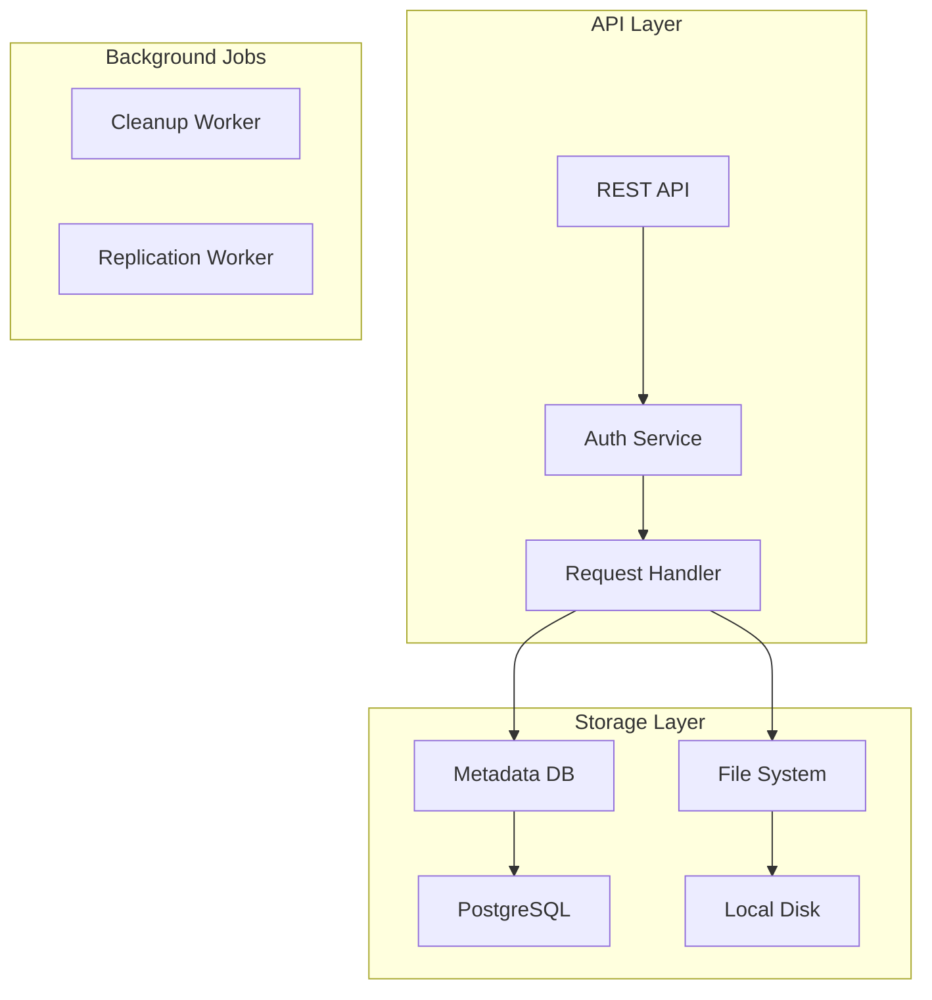
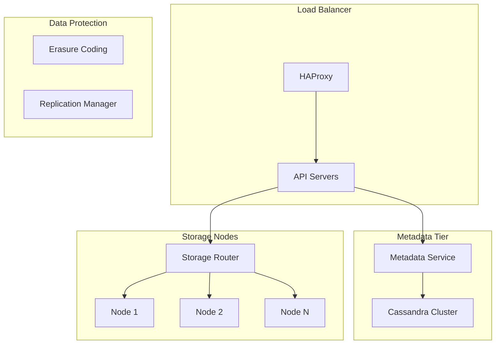
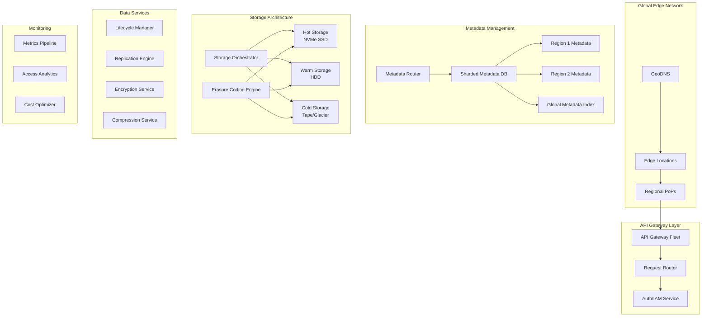
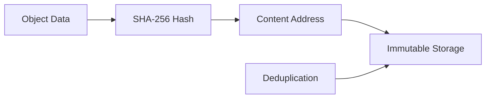

# S3-like Object Storage - System Design Case Study

## 1. Problem Statement

Design a distributed object storage system like Amazon S3, MinIO, or Azure Blob Storage that can:
- Store trillions of objects ranging from bytes to terabytes
- Provide 99.999999999% (11 nines) durability
- Handle millions of requests per second
- Support global distribution with low latency
- Offer strong consistency for operations
- Enable cost-effective storage at exabyte scale

### Real-World Context
- **Amazon S3**: Stores over 100 trillion objects, serves millions of requests/second
- **Azure Blob Storage**: Exabytes of data across global datacenters
- **Google Cloud Storage**: Powers YouTube, Gmail, and enterprise workloads
- **MinIO**: Open-source S3-compatible object storage

## 2. Requirements Analysis

### Functional Requirements
1. **Object Operations**
   - PUT: Upload objects up to 5TB
   - GET: Retrieve objects with byte-range support
   - DELETE: Remove objects
   - HEAD: Get object metadata
   - LIST: List objects with prefix/delimiter

2. **Storage Features**
   - Multipart upload for large objects
   - Object versioning
   - Object lifecycle policies
   - Cross-region replication
   - Server-side encryption

3. **Access Control**
   - Bucket and object-level permissions
   - IAM integration
   - Signed URLs for temporary access
   - CORS support
   - Access logging

4. **Data Management**
   - Storage classes (Standard, IA, Glacier)
   - Intelligent tiering
   - Object tagging
   - Metadata support
   - Event notifications

5. **Performance Features**
   - Transfer acceleration
   - Multipart upload
   - Byte-range requests
   - Request parallelization
   - CDN integration

### Non-Functional Requirements
- **Scale**: 100+ trillion objects, exabytes of storage
- **Throughput**: 10M+ requests/second globally
- **Latency**: <100ms for object operations
- **Durability**: 99.999999999% (11 nines)
- **Availability**: 99.99% uptime
- **Consistency**: Strong read-after-write consistency

### Law Mapping
- **Law 1 (Latency)**: Global edge locations for low latency
- **Law 2 (Capacity)**: Hierarchical storage with intelligent tiering
- **Law 3 (Failure)**: Erasure coding for durability
- **Law 4 (Concurrency)**: Parallel operations on objects
- **Law 5 (Coordination)**: Distributed metadata management
- **Law 6 (Observability)**: Comprehensive access logging
- **Law 7 (Interface)**: S3-compatible REST API
- **Law 8 (Economics)**: Storage class optimization

## 3. Architecture Evolution

### Stage 1: Basic Object Storage (1TB scale)


### Stage 2: Distributed Storage (PB scale)


### Stage 3: Global Scale Architecture (EB scale)


## 4. Detailed Component Design

### 4.1 Distributed Metadata Management
```python
import hashlib
from typing import Dict, List, Optional, Tuple
from dataclasses import dataclass
import asyncio
from datetime import datetime

@dataclass
class ObjectMetadata:
    bucket: str
    key: str
    version_id: str
    size: int
    etag: str
    content_type: str
    storage_class: str
    created_at: datetime
    modified_at: datetime
    metadata: Dict[str, str]
    encryption: Optional[Dict]
    storage_locations: List[str]
    
class DistributedMetadataService:
    """Manages object metadata across distributed system"""
    
    def __init__(self, metadata_clusters: Dict[str, MetadataCluster]):
        self.clusters = metadata_clusters
        self.consistent_hash = ConsistentHashRing(
            nodes=list(metadata_clusters.keys()),
            virtual_nodes=150
        )
        self.cache = MetadataCache()
        
    async def put_object_metadata(self, metadata: ObjectMetadata) -> bool:
        """Store object metadata with replication"""
        
        # Determine primary and replica nodes
        primary_node = self.consistent_hash.get_node(
            f"{metadata.bucket}/{metadata.key}"
        )
        replica_nodes = self.consistent_hash.get_replicas(
            f"{metadata.bucket}/{metadata.key}",
            num_replicas=2
        )
        
        # Store in primary with strong consistency
        primary_cluster = self.clusters[primary_node]
        success = await primary_cluster.put(
            key=self._get_metadata_key(metadata),
            value=metadata.to_dict(),
            consistency_level="QUORUM"
        )
        
        if not success:
            return False
        
        # Async replication to replicas
        replication_tasks = []
        for replica_node in replica_nodes:
            replica_cluster = self.clusters[replica_node]
            task = asyncio.create_task(
                replica_cluster.put(
                    key=self._get_metadata_key(metadata),
                    value=metadata.to_dict(),
                    consistency_level="ONE"
                )
            )
            replication_tasks.append(task)
        
        # Fire and forget replications
        asyncio.gather(*replication_tasks, return_exceptions=True)
        
        # Update cache
        await self.cache.set(
            self._get_cache_key(metadata),
            metadata,
            ttl=3600
        )
        
        return True
    
    async def get_object_metadata(self, bucket: str, 
                                 key: str,
                                 version_id: Optional[str] = None) -> Optional[ObjectMetadata]:
        """Retrieve object metadata with caching"""
        
        # Check cache first
        cache_key = f"{bucket}:{key}:{version_id or 'latest'}"
        cached = await self.cache.get(cache_key)
        if cached:
            return cached
        
        # Determine nodes to query
        primary_node = self.consistent_hash.get_node(f"{bucket}/{key}")
        
        # Try primary first
        primary_cluster = self.clusters[primary_node]
        metadata_dict = await primary_cluster.get(
            key=f"{bucket}:{key}:{version_id or 'latest'}",
            consistency_level="ONE"
        )
        
        if metadata_dict:
            metadata = ObjectMetadata(**metadata_dict)
            await self.cache.set(cache_key, metadata, ttl=3600)
            return metadata
        
        # Fallback to replicas if primary fails
        replica_nodes = self.consistent_hash.get_replicas(
            f"{bucket}/{key}",
            num_replicas=2
        )
        
        for replica_node in replica_nodes:
            try:
                replica_cluster = self.clusters[replica_node]
                metadata_dict = await replica_cluster.get(
                    key=f"{bucket}:{key}:{version_id or 'latest'}",
                    consistency_level="ONE"
                )
                
                if metadata_dict:
                    metadata = ObjectMetadata(**metadata_dict)
                    await self.cache.set(cache_key, metadata, ttl=3600)
                    return metadata
                    
            except Exception as e:
                logger.warning(f"Failed to query replica {replica_node}: {e}")
                continue
        
        return None
    
    async def list_objects(self, bucket: str, 
                          prefix: str = "",
                          delimiter: str = "",
                          max_keys: int = 1000,
                          continuation_token: Optional[str] = None) -> ListObjectsResult:
        """List objects with prefix and pagination"""
        
        # Determine which metadata partitions to query
        partitions = self._get_partitions_for_prefix(bucket, prefix)
        
        # Query partitions in parallel
        query_tasks = []
        for partition in partitions:
            cluster = self.clusters[partition]
            task = cluster.list_range(
                start_key=f"{bucket}:{prefix}",
                end_key=f"{bucket}:{prefix}\xff",
                max_items=max_keys,
                continuation_token=continuation_token
            )
            query_tasks.append(task)
        
        # Gather results
        results = await asyncio.gather(*query_tasks)
        
        # Merge and sort results
        all_objects = []
        for result in results:
            all_objects.extend(result.objects)
        
        # Sort by key
        all_objects.sort(key=lambda x: x.key)
        
        # Apply delimiter logic for common prefixes
        if delimiter:
            objects, common_prefixes = self._apply_delimiter(
                all_objects,
                prefix,
                delimiter
            )
        else:
            objects = all_objects
            common_prefixes = []
        
        # Pagination
        if len(objects) > max_keys:
            objects = objects[:max_keys]
            next_token = self._generate_continuation_token(
                objects[-1].key
            )
        else:
            next_token = None
        
        return ListObjectsResult(
            objects=objects,
            common_prefixes=common_prefixes,
            is_truncated=next_token is not None,
            next_continuation_token=next_token
        )
```

### 4.2 Erasure Coding Storage Engine
```python
import numpy as np
from typing import List, Tuple
import galois

class ErasureCodingEngine:
    """Implements Reed-Solomon erasure coding for durability"""
    
    def __init__(self, data_shards: int = 10, parity_shards: int = 4):
        self.data_shards = data_shards
        self.parity_shards = parity_shards
        self.total_shards = data_shards + parity_shards
        
        # Initialize Galois Field for RS coding
        self.gf = galois.GF(2**8)
        self.rs_matrix = self._create_encoding_matrix()
        
    def encode_object(self, data: bytes) -> List[DataShard]:
        """Encode object into erasure coded shards"""
        
        # Pad data to multiple of data_shards
        padded_data = self._pad_data(data)
        data_size = len(padded_data)
        shard_size = data_size // self.data_shards
        
        # Split into data shards
        data_shards = []
        for i in range(self.data_shards):
            start = i * shard_size
            end = start + shard_size
            shard_data = padded_data[start:end]
            data_shards.append(shard_data)
        
        # Generate parity shards
        parity_shards = self._generate_parity_shards(data_shards)
        
        # Create shard objects
        all_shards = []
        
        # Data shards
        for i, shard_data in enumerate(data_shards):
            shard = DataShard(
                shard_id=i,
                shard_type="data",
                data=shard_data,
                checksum=self._calculate_checksum(shard_data),
                total_shards=self.total_shards,
                data_shards=self.data_shards,
                original_size=len(data)
            )
            all_shards.append(shard)
        
        # Parity shards
        for i, shard_data in enumerate(parity_shards):
            shard = DataShard(
                shard_id=self.data_shards + i,
                shard_type="parity",
                data=shard_data,
                checksum=self._calculate_checksum(shard_data),
                total_shards=self.total_shards,
                data_shards=self.data_shards,
                original_size=len(data)
            )
            all_shards.append(shard)
        
        return all_shards
    
    def decode_object(self, available_shards: List[DataShard]) -> bytes:
        """Reconstruct object from available shards"""
        
        # Need at least data_shards to reconstruct
        if len(available_shards) < self.data_shards:
            raise InsufficientShardsError(
                f"Need {self.data_shards} shards, have {len(available_shards)}"
            )
        
        # Verify shard integrity
        for shard in available_shards:
            if not self._verify_shard_integrity(shard):
                raise CorruptedShardError(f"Shard {shard.shard_id} corrupted")
        
        # Sort shards by ID
        available_shards.sort(key=lambda x: x.shard_id)
        
        # Check if we have all data shards
        data_shard_ids = [s.shard_id for s in available_shards 
                         if s.shard_type == "data"]
        
        if len(data_shard_ids) == self.data_shards:
            # Simple case: all data shards available
            data_shards = [s for s in available_shards 
                          if s.shard_type == "data"]
            data_shards.sort(key=lambda x: x.shard_id)
            
            # Concatenate data shards
            reconstructed = b''.join(s.data for s in data_shards)
            
        else:
            # Need to reconstruct using parity
            reconstructed = self._reconstruct_with_parity(available_shards)
        
        # Remove padding
        original_size = available_shards[0].original_size
        return reconstructed[:original_size]
    
    def _generate_parity_shards(self, data_shards: List[bytes]) -> List[bytes]:
        """Generate parity shards using Reed-Solomon coding"""
        
        shard_size = len(data_shards[0])
        parity_shards = []
        
        # Process byte by byte across all shards
        for byte_idx in range(shard_size):
            # Get bytes at current position from all data shards
            data_bytes = [shard[byte_idx] for shard in data_shards]
            
            # Calculate parity bytes
            parity_bytes = self._rs_encode_position(data_bytes)
            
            # Add to parity shards
            for i, parity_byte in enumerate(parity_bytes):
                if byte_idx == 0:
                    parity_shards.append(bytearray())
                parity_shards[i].append(parity_byte)
        
        return [bytes(shard) for shard in parity_shards]
    
    def _rs_encode_position(self, data_bytes: List[int]) -> List[int]:
        """Reed-Solomon encode bytes at a specific position"""
        
        # Convert to Galois field
        data_vector = self.gf(data_bytes)
        
        # Generate parity using encoding matrix
        parity_rows = self.rs_matrix[self.data_shards:]
        parity_bytes = []
        
        for parity_row in parity_rows:
            # Dot product in Galois field
            parity_byte = self.gf(0)
            for i, coeff in enumerate(parity_row[:self.data_shards]):
                parity_byte += coeff * data_vector[i]
            parity_bytes.append(int(parity_byte))
        
        return parity_bytes
    
    def _create_encoding_matrix(self) -> np.ndarray:
        """Create Reed-Solomon encoding matrix"""
        
        # Vandermonde matrix for systematic RS coding
        matrix = np.zeros((self.total_shards, self.data_shards), dtype=int)
        
        # Identity matrix for data shards (systematic)
        for i in range(self.data_shards):
            matrix[i][i] = 1
        
        # Vandermonde for parity shards
        for i in range(self.data_shards, self.total_shards):
            for j in range(self.data_shards):
                matrix[i][j] = pow(i - self.data_shards + 1, j, 257)
        
        return self.gf(matrix)
```

### 4.3 Distributed Storage Node
```python
class StorageNode:
    """Individual storage node in the cluster"""
    
    def __init__(self, node_id: str, storage_path: str):
        self.node_id = node_id
        self.storage_path = storage_path
        self.disk_manager = DiskManager(storage_path)
        self.network_service = NetworkService()
        self.integrity_checker = IntegrityChecker()
        self.metrics = StorageMetrics()
        
    async def store_shard(self, shard: DataShard, 
                         object_id: str) -> StorageResult:
        """Store a data shard on this node"""
        
        # Calculate storage location
        shard_path = self._calculate_shard_path(object_id, shard.shard_id)
        
        try:
            # Write shard data
            bytes_written = await self.disk_manager.write_file(
                path=shard_path,
                data=shard.data,
                sync=True  # Ensure durability
            )
            
            # Write shard metadata
            metadata_path = f"{shard_path}.meta"
            await self.disk_manager.write_file(
                path=metadata_path,
                data=shard.to_metadata_json(),
                sync=True
            )
            
            # Update local index
            await self._update_shard_index(object_id, shard)
            
            # Record metrics
            self.metrics.record_write(
                bytes=bytes_written,
                latency=time.time() - start_time
            )
            
            return StorageResult(
                success=True,
                node_id=self.node_id,
                shard_id=shard.shard_id,
                bytes_stored=bytes_written,
                storage_path=shard_path
            )
            
        except DiskFullError:
            # Handle disk full gracefully
            logger.error(f"Disk full on node {self.node_id}")
            return StorageResult(
                success=False,
                error="DISK_FULL",
                node_id=self.node_id
            )
        except Exception as e:
            logger.error(f"Storage error on node {self.node_id}: {e}")
            return StorageResult(
                success=False,
                error=str(e),
                node_id=self.node_id
            )
    
    async def retrieve_shard(self, object_id: str, 
                           shard_id: int) -> Optional[DataShard]:
        """Retrieve a shard from storage"""
        
        shard_path = self._calculate_shard_path(object_id, shard_id)
        metadata_path = f"{shard_path}.meta"
        
        try:
            # Read shard metadata first
            metadata_data = await self.disk_manager.read_file(metadata_path)
            shard_metadata = json.loads(metadata_data)
            
            # Read shard data
            shard_data = await self.disk_manager.read_file(shard_path)
            
            # Verify integrity
            calculated_checksum = self._calculate_checksum(shard_data)
            if calculated_checksum != shard_metadata['checksum']:
                raise CorruptedShardError(
                    f"Checksum mismatch for shard {shard_id}"
                )
            
            # Reconstruct shard object
            shard = DataShard(
                shard_id=shard_metadata['shard_id'],
                shard_type=shard_metadata['shard_type'],
                data=shard_data,
                checksum=shard_metadata['checksum'],
                total_shards=shard_metadata['total_shards'],
                data_shards=shard_metadata['data_shards'],
                original_size=shard_metadata['original_size']
            )
            
            # Record metrics
            self.metrics.record_read(
                bytes=len(shard_data),
                latency=time.time() - start_time
            )
            
            return shard
            
        except FileNotFoundError:
            return None
        except CorruptedShardError:
            # Attempt repair from parity
            await self._initiate_shard_repair(object_id, shard_id)
            raise
    
    async def delete_shard(self, object_id: str, shard_id: int) -> bool:
        """Delete a shard from storage"""
        
        shard_path = self._calculate_shard_path(object_id, shard_id)
        metadata_path = f"{shard_path}.meta"
        
        try:
            # Delete data file
            await self.disk_manager.delete_file(shard_path)
            
            # Delete metadata
            await self.disk_manager.delete_file(metadata_path)
            
            # Update index
            await self._remove_from_shard_index(object_id, shard_id)
            
            return True
            
        except Exception as e:
            logger.error(f"Failed to delete shard: {e}")
            return False
    
    async def run_integrity_check(self):
        """Background task to verify shard integrity"""
        
        while True:
            try:
                # Get random sample of shards
                shard_samples = await self._get_random_shard_sample(1000)
                
                for shard_info in shard_samples:
                    # Read and verify
                    shard = await self.retrieve_shard(
                        shard_info['object_id'],
                        shard_info['shard_id']
                    )
                    
                    if shard is None:
                        logger.error(
                            f"Missing shard: {shard_info['object_id']}/"
                            f"{shard_info['shard_id']}"
                        )
                        await self._report_missing_shard(shard_info)
                        
            except Exception as e:
                logger.error(f"Integrity check error: {e}")
                
            await asyncio.sleep(3600)  # Run hourly
```

### 4.4 Multipart Upload Manager
```python
class MultipartUploadManager:
    """Handles large object uploads in parts"""
    
    def __init__(self, metadata_service: DistributedMetadataService,
                 storage_orchestrator: StorageOrchestrator):
        self.metadata_service = metadata_service
        self.storage = storage_orchestrator
        self.active_uploads = {}
        self.part_size_min = 5 * 1024 * 1024  # 5MB
        self.part_size_max = 5 * 1024 * 1024 * 1024  # 5GB
        
    async def initiate_multipart_upload(self, bucket: str, 
                                       key: str,
                                       metadata: Dict) -> str:
        """Initialize a new multipart upload"""
        
        upload_id = str(uuid.uuid4())
        
        # Create upload record
        upload_record = MultipartUpload(
            upload_id=upload_id,
            bucket=bucket,
            key=key,
            initiated_at=datetime.utcnow(),
            metadata=metadata,
            parts={}
        )
        
        # Store in metadata service
        await self.metadata_service.put_multipart_upload(upload_record)
        
        # Track active upload
        self.active_uploads[upload_id] = upload_record
        
        return upload_id
    
    async def upload_part(self, upload_id: str, 
                         part_number: int,
                         data: bytes) -> PartUploadResult:
        """Upload a single part of multipart upload"""
        
        # Validate upload
        upload = await self._get_upload(upload_id)
        if not upload:
            raise NoSuchUploadError(f"Upload {upload_id} not found")
        
        # Validate part size
        if len(data) < self.part_size_min and part_number < 10000:
            raise PartTooSmallError(
                f"Part size {len(data)} below minimum {self.part_size_min}"
            )
        
        # Calculate part ETag
        part_etag = hashlib.md5(data).hexdigest()
        
        # Store part with temporary key
        part_key = f"{upload.bucket}/.multipart/{upload_id}/{part_number}"
        
        # Apply erasure coding to part
        ec_engine = ErasureCodingEngine()
        shards = ec_engine.encode_object(data)
        
        # Distribute shards
        storage_results = await self.storage.store_shards(
            object_id=part_key,
            shards=shards
        )
        
        # Record part info
        part_info = PartInfo(
            part_number=part_number,
            etag=part_etag,
            size=len(data),
            uploaded_at=datetime.utcnow(),
            storage_locations=storage_results.shard_locations
        )
        
        # Update upload record
        upload.parts[part_number] = part_info
        await self.metadata_service.update_multipart_upload(upload)
        
        return PartUploadResult(
            part_number=part_number,
            etag=part_etag
        )
    
    async def complete_multipart_upload(self, upload_id: str,
                                       parts: List[Dict]) -> CompleteUploadResult:
        """Complete multipart upload by combining parts"""
        
        # Get upload record
        upload = await self._get_upload(upload_id)
        if not upload:
            raise NoSuchUploadError(f"Upload {upload_id} not found")
        
        # Validate all parts present
        for part in parts:
            part_num = part['part_number']
            expected_etag = part['etag']
            
            if part_num not in upload.parts:
                raise InvalidPartError(f"Part {part_num} not found")
                
            if upload.parts[part_num].etag != expected_etag:
                raise InvalidPartError(
                    f"Part {part_num} ETag mismatch"
                )
        
        # Sort parts by number
        parts.sort(key=lambda x: x['part_number'])
        
        # Calculate final object ETag
        part_etags = [p['etag'] for p in parts]
        final_etag = self._calculate_multipart_etag(part_etags)
        
        # Create final object metadata
        total_size = sum(upload.parts[p['part_number']].size for p in parts)
        
        object_metadata = ObjectMetadata(
            bucket=upload.bucket,
            key=upload.key,
            version_id=str(uuid.uuid4()),
            size=total_size,
            etag=final_etag,
            content_type=upload.metadata.get('content-type', 'binary/octet-stream'),
            storage_class="STANDARD",
            created_at=datetime.utcnow(),
            modified_at=datetime.utcnow(),
            metadata=upload.metadata,
            encryption=None,
            storage_locations=[]
        )
        
        # Move parts to final location
        await self._assemble_final_object(upload, parts, object_metadata)
        
        # Store final metadata
        await self.metadata_service.put_object_metadata(object_metadata)
        
        # Cleanup multipart upload
        await self._cleanup_multipart_upload(upload_id)
        
        return CompleteUploadResult(
            bucket=upload.bucket,
            key=upload.key,
            etag=final_etag,
            version_id=object_metadata.version_id
        )
    
    async def _assemble_final_object(self, upload: MultipartUpload,
                                    parts: List[Dict],
                                    metadata: ObjectMetadata):
        """Assemble parts into final object"""
        
        # For large objects, we don't physically concatenate
        # Instead, we create a manifest pointing to parts
        
        manifest = ObjectManifest(
            object_id=f"{metadata.bucket}/{metadata.key}",
            version_id=metadata.version_id,
            parts=[]
        )
        
        for part in parts:
            part_num = part['part_number']
            part_info = upload.parts[part_num]
            
            manifest.parts.append({
                'part_number': part_num,
                'size': part_info.size,
                'etag': part_info.etag,
                'storage_key': f"{upload.bucket}/.multipart/{upload.upload_id}/{part_num}",
                'storage_locations': part_info.storage_locations
            })
        
        # Store manifest
        await self.metadata_service.put_object_manifest(manifest)
        
        # Update metadata with manifest location
        metadata.storage_locations = [f"manifest:{manifest.object_id}"]
```

### 4.5 Storage Class Management
```python
class StorageClassManager:
    """Manages different storage classes and transitions"""
    
    def __init__(self):
        self.storage_classes = {
            'STANDARD': StandardStorage(),
            'STANDARD_IA': InfrequentAccessStorage(),
            'GLACIER': GlacierStorage(),
            'DEEP_ARCHIVE': DeepArchiveStorage()
        }
        self.transition_engine = TransitionEngine()
        
    async def transition_object(self, object_id: str,
                               from_class: str,
                               to_class: str) -> TransitionResult:
        """Transition object between storage classes"""
        
        # Get object metadata
        metadata = await self.metadata_service.get_object_metadata_by_id(object_id)
        if not metadata:
            raise ObjectNotFoundError(f"Object {object_id} not found")
        
        # Validate transition
        if not self._is_valid_transition(from_class, to_class):
            raise InvalidTransitionError(
                f"Cannot transition from {from_class} to {to_class}"
            )
        
        # Get storage handlers
        source_storage = self.storage_classes[from_class]
        target_storage = self.storage_classes[to_class]
        
        # Retrieve object from source
        logger.info(f"Retrieving object {object_id} from {from_class}")
        object_data = await source_storage.retrieve_object(object_id)
        
        # Store in target class
        logger.info(f"Storing object {object_id} in {to_class}")
        
        if to_class in ['GLACIER', 'DEEP_ARCHIVE']:
            # Archive storage requires special handling
            archive_result = await self._archive_object(
                object_data,
                metadata,
                to_class
            )
            new_locations = archive_result.archive_locations
        else:
            # Regular storage transition
            storage_result = await target_storage.store_object(
                object_id,
                object_data
            )
            new_locations = storage_result.storage_locations
        
        # Update metadata
        metadata.storage_class = to_class
        metadata.storage_locations = new_locations
        metadata.modified_at = datetime.utcnow()
        
        await self.metadata_service.update_object_metadata(metadata)
        
        # Delete from source (after successful transition)
        await source_storage.delete_object(object_id)
        
        # Record transition
        await self._record_transition(object_id, from_class, to_class)
        
        return TransitionResult(
            success=True,
            object_id=object_id,
            new_storage_class=to_class,
            transition_time=datetime.utcnow()
        )
    
    async def _archive_object(self, object_data: bytes,
                             metadata: ObjectMetadata,
                             archive_class: str) -> ArchiveResult:
        """Archive object to cold storage"""
        
        # Compress before archiving
        compressed_data = await self._compress_for_archive(object_data)
        compression_ratio = len(compressed_data) / len(object_data)
        
        # Split into archive chunks
        chunk_size = 1024 * 1024 * 1024  # 1GB chunks
        chunks = []
        
        for i in range(0, len(compressed_data), chunk_size):
            chunk = compressed_data[i:i + chunk_size]
            chunks.append(chunk)
        
        # Store chunks in archive
        archive_locations = []
        
        if archive_class == 'GLACIER':
            # Glacier storage (retrieval in minutes to hours)
            for i, chunk in enumerate(chunks):
                location = await self._store_in_glacier(
                    f"{metadata.bucket}/{metadata.key}/chunk_{i}",
                    chunk
                )
                archive_locations.append(location)
                
        elif archive_class == 'DEEP_ARCHIVE':
            # Deep archive (retrieval in hours to days)
            for i, chunk in enumerate(chunks):
                location = await self._store_in_deep_archive(
                    f"{metadata.bucket}/{metadata.key}/chunk_{i}",
                    chunk
                )
                archive_locations.append(location)
        
        # Create archive manifest
        manifest = ArchiveManifest(
            object_id=f"{metadata.bucket}/{metadata.key}",
            compression_type="zstd",
            compression_ratio=compression_ratio,
            chunk_count=len(chunks),
            chunk_locations=archive_locations,
            archived_at=datetime.utcnow()
        )
        
        await self.metadata_service.put_archive_manifest(manifest)
        
        return ArchiveResult(
            archive_locations=[f"archive:{manifest.object_id}"],
            compression_ratio=compression_ratio
        )
```

## 5. Advanced Features

### 5.1 Geo-Replication Engine
```python
class GeoReplicationEngine:
    """Handles cross-region replication"""
    
    def __init__(self, regions: List[Region]):
        self.regions = regions
        self.replication_queues = {}
        self.bandwidth_manager = BandwidthManager()
        
    async def replicate_object(self, object_metadata: ObjectMetadata,
                              source_region: str,
                              target_regions: List[str]):
        """Replicate object to multiple regions"""
        
        replication_id = str(uuid.uuid4())
        
        # Create replication tasks
        tasks = []
        for target_region in target_regions:
            task = ReplicationTask(
                replication_id=replication_id,
                object_id=f"{object_metadata.bucket}/{object_metadata.key}",
                source_region=source_region,
                target_region=target_region,
                priority=self._calculate_priority(object_metadata),
                created_at=datetime.utcnow()
            )
            tasks.append(task)
            
            # Queue for processing
            await self.replication_queues[target_region].put(task)
        
        # Process replications asynchronously
        asyncio.gather(*[
            self._process_replication_task(task) for task in tasks
        ])
        
        return replication_id
    
    async def _process_replication_task(self, task: ReplicationTask):
        """Process a single replication task"""
        
        try:
            # Get bandwidth allocation
            bandwidth = await self.bandwidth_manager.allocate(
                source=task.source_region,
                target=task.target_region,
                priority=task.priority
            )
            
            # Retrieve object shards from source
            shards = await self._retrieve_shards_from_region(
                task.object_id,
                task.source_region
            )
            
            # Transfer shards with bandwidth limiting
            transferred_shards = []
            for shard in shards:
                transferred = await self._transfer_shard(
                    shard,
                    task.target_region,
                    bandwidth
                )
                transferred_shards.append(transferred)
            
            # Update metadata in target region
            await self._update_target_metadata(
                task.object_id,
                task.target_region,
                transferred_shards
            )
            
            # Mark replication complete
            task.status = "completed"
            task.completed_at = datetime.utcnow()
            
        except Exception as e:
            logger.error(f"Replication failed: {e}")
            task.status = "failed"
            task.error = str(e)
            
            # Retry logic
            if task.retry_count < 3:
                task.retry_count += 1
                await self.replication_queues[task.target_region].put(task)
```

### 5.2 Intelligent Tiering
```python
class IntelligentTieringEngine:
    """Automatically moves objects between storage classes"""
    
    def __init__(self):
        self.access_tracker = AccessTracker()
        self.cost_calculator = CostCalculator()
        self.ml_predictor = AccessPatternPredictor()
        
    async def analyze_object_for_tiering(self, 
                                        object_id: str) -> TieringRecommendation:
        """Analyze object access patterns and recommend tiering"""
        
        # Get access history
        access_history = await self.access_tracker.get_history(
            object_id,
            days=90
        )
        
        # Get current storage info
        metadata = await self.metadata_service.get_object_metadata_by_id(object_id)
        current_class = metadata.storage_class
        object_size = metadata.size
        
        # Predict future access pattern
        predicted_accesses = self.ml_predictor.predict_access_pattern(
            access_history,
            horizon_days=30
        )
        
        # Calculate costs for each storage class
        costs = {}
        for storage_class in ['STANDARD', 'STANDARD_IA', 'GLACIER']:
            cost = self.cost_calculator.calculate_cost(
                storage_class=storage_class,
                object_size=object_size,
                access_count=predicted_accesses,
                retrieval_size=object_size * predicted_accesses * 0.1  # 10% retrieved
            )
            costs[storage_class] = cost
        
        # Find optimal storage class
        optimal_class = min(costs.items(), key=lambda x: x[1])[0]
        
        # Calculate savings
        current_cost = costs[current_class]
        optimal_cost = costs[optimal_class]
        savings = current_cost - optimal_cost
        
        return TieringRecommendation(
            object_id=object_id,
            current_class=current_class,
            recommended_class=optimal_class,
            monthly_savings=savings,
            confidence=self.ml_predictor.get_confidence(),
            reasoning=self._generate_reasoning(
                access_history,
                predicted_accesses,
                costs
            )
        )
    
    async def execute_tiering_recommendations(self):
        """Background job to execute tiering recommendations"""
        
        while True:
            try:
                # Get objects eligible for tiering
                eligible_objects = await self._get_eligible_objects(
                    min_age_days=30,
                    min_size_bytes=1024 * 1024  # 1MB
                )
                
                recommendations = []
                for object_id in eligible_objects:
                    rec = await self.analyze_object_for_tiering(object_id)
                    if rec.monthly_savings > 0.01:  # $0.01 threshold
                        recommendations.append(rec)
                
                # Sort by savings
                recommendations.sort(
                    key=lambda x: x.monthly_savings,
                    reverse=True
                )
                
                # Execute top recommendations
                for rec in recommendations[:1000]:  # Limit batch size
                    if rec.current_class != rec.recommended_class:
                        await self.storage_class_manager.transition_object(
                            rec.object_id,
                            rec.current_class,
                            rec.recommended_class
                        )
                        
                        logger.info(
                            f"Transitioned {rec.object_id} from "
                            f"{rec.current_class} to {rec.recommended_class}, "
                            f"saving ${rec.monthly_savings}/month"
                        )
                
            except Exception as e:
                logger.error(f"Tiering error: {e}")
                
            await asyncio.sleep(3600)  # Run hourly
```

### 5.3 Performance Optimization
```python
class S3PerformanceOptimizer:
    """Optimizes S3 performance for various workloads"""
    
    def __init__(self):
        self.request_router = RequestRouter()
        self.connection_pool = ConnectionPoolManager()
        self.prefetch_engine = PrefetchEngine()
        
    async def optimize_list_operation(self, bucket: str,
                                     prefix: str,
                                     expected_results: int):
        """Optimize LIST operations for large directories"""
        
        if expected_results > 10000:
            # Use parallel LIST for large results
            prefixes = self._generate_sharding_prefixes(prefix)
            
            # Query in parallel
            tasks = []
            for shard_prefix in prefixes:
                task = self.metadata_service.list_objects(
                    bucket=bucket,
                    prefix=shard_prefix,
                    max_keys=1000
                )
                tasks.append(task)
            
            results = await asyncio.gather(*tasks)
            
            # Merge results
            all_objects = []
            for result in results:
                all_objects.extend(result.objects)
                
            return sorted(all_objects, key=lambda x: x.key)
        else:
            # Regular LIST for small results
            return await self.metadata_service.list_objects(
                bucket=bucket,
                prefix=prefix,
                max_keys=expected_results
            )
    
    async def optimize_multipart_upload(self, object_size: int,
                                       network_bandwidth: int) -> MultipartStrategy:
        """Determine optimal multipart upload strategy"""
        
        # Calculate optimal part size
        if object_size < 100 * 1024 * 1024:  # <100MB
            # Single PUT is more efficient
            return MultipartStrategy(
                use_multipart=False
            )
        
        # For larger objects, calculate optimal part size
        # Target 10,000 parts max, 100 parts optimal
        optimal_part_count = min(100, max(10, object_size // (100 * 1024 * 1024)))
        part_size = object_size // optimal_part_count
        
        # Align to 1MB boundary
        part_size = (part_size // (1024 * 1024)) * (1024 * 1024)
        part_size = max(5 * 1024 * 1024, part_size)  # Min 5MB
        
        # Calculate parallelism based on bandwidth
        parallel_uploads = min(
            10,  # Max 10 parallel
            network_bandwidth // (part_size // 1024 // 1024)  # MB/s
        )
        
        return MultipartStrategy(
            use_multipart=True,
            part_size=part_size,
            parallel_uploads=parallel_uploads
        )
```

## 6. Monitoring and Analytics

### 6.1 Real-time Metrics Collection
```python
class S3MetricsCollector:
    """Collects and aggregates S3 metrics"""
    
    def __init__(self):
        self.metrics_pipeline = MetricsPipeline()
        self.request_logger = RequestLogger()
        self.cost_tracker = CostTracker()
        
    async def record_request(self, request: S3Request,
                           response: S3Response):
        """Record request metrics"""
        
        # Basic metrics
        await self.metrics_pipeline.increment(
            'requests.total',
            tags={
                'operation': request.operation,
                'bucket': request.bucket,
                'status': response.status_code,
                'region': request.region
            }
        )
        
        # Latency metrics
        await self.metrics_pipeline.histogram(
            'request.latency',
            response.latency_ms,
            tags={
                'operation': request.operation,
                'bucket': request.bucket
            }
        )
        
        # Bandwidth metrics
        if request.operation in ['PUT', 'GET']:
            await self.metrics_pipeline.counter(
                'bandwidth.bytes',
                request.size if request.operation == 'PUT' else response.size,
                tags={
                    'direction': 'upload' if request.operation == 'PUT' else 'download',
                    'bucket': request.bucket
                }
            )
        
        # Cost tracking
        cost = self.cost_tracker.calculate_request_cost(request, response)
        await self.metrics_pipeline.counter(
            'cost.usd',
            cost,
            tags={
                'operation': request.operation,
                'bucket': request.bucket,
                'storage_class': request.storage_class
            }
        )
        
        # Access logging
        await self.request_logger.log(request, response)
```

### 6.2 Storage Analytics
```python
class StorageAnalytics:
    """Analyzes storage usage patterns"""
    
    async def generate_bucket_analytics(self, bucket: str) -> BucketAnalytics:
        """Generate comprehensive analytics for a bucket"""
        
        analytics = BucketAnalytics(bucket=bucket)
        
        # Storage breakdown by class
        storage_stats = await self._get_storage_by_class(bucket)
        analytics.storage_by_class = storage_stats
        
        # Object count and size distribution
        size_distribution = await self._get_size_distribution(bucket)
        analytics.size_distribution = size_distribution
        
        # Access patterns
        access_patterns = await self._analyze_access_patterns(bucket)
        analytics.access_patterns = access_patterns
        
        # Cost analysis
        cost_breakdown = await self._calculate_cost_breakdown(bucket)
        analytics.cost_breakdown = cost_breakdown
        
        # Lifecycle recommendations
        lifecycle_recs = await self._generate_lifecycle_recommendations(bucket)
        analytics.lifecycle_recommendations = lifecycle_recs
        
        return analytics
```

## 7. Security Implementation

### 7.1 Encryption at Rest
```python
class S3EncryptionService:
    """Handles encryption for stored objects"""
    
    def __init__(self):
        self.kms_client = KMSClient()
        self.crypto_engine = CryptoEngine()
        
    async def encrypt_object(self, data: bytes,
                           encryption_config: EncryptionConfig) -> EncryptedObject:
        """Encrypt object data before storage"""
        
        if encryption_config.type == "SSE-S3":
            # S3-managed encryption
            key = await self.kms_client.get_s3_master_key()
            data_key = self.crypto_engine.generate_data_key()
            
            # Encrypt data key with master key
            encrypted_data_key = await self.kms_client.encrypt(
                data_key,
                key_id=key.id
            )
            
        elif encryption_config.type == "SSE-KMS":
            # KMS-managed encryption
            data_key_result = await self.kms_client.generate_data_key(
                key_id=encryption_config.kms_key_id
            )
            data_key = data_key_result.plaintext
            encrypted_data_key = data_key_result.ciphertext
            
        elif encryption_config.type == "SSE-C":
            # Customer-provided encryption
            data_key = encryption_config.customer_key
            encrypted_data_key = None  # Customer manages the key
        
        # Encrypt object data
        iv = os.urandom(16)
        encrypted_data = self.crypto_engine.encrypt_aes_gcm(
            plaintext=data,
            key=data_key,
            iv=iv
        )
        
        return EncryptedObject(
            encrypted_data=encrypted_data,
            encrypted_data_key=encrypted_data_key,
            iv=iv,
            encryption_type=encryption_config.type,
            key_id=encryption_config.kms_key_id
        )
```

### 7.2 Access Control
```python
class S3AccessControl:
    """Implements S3 access control policies"""
    
    def __init__(self):
        self.policy_engine = PolicyEngine()
        self.iam_service = IAMService()
        
    async def check_access(self, principal: Principal,
                          action: str,
                          resource: str) -> AccessDecision:
        """Check if principal has access to perform action on resource"""
        
        # Get all applicable policies
        policies = []
        
        # User/Role policies
        identity_policies = await self.iam_service.get_policies_for_principal(
            principal
        )
        policies.extend(identity_policies)
        
        # Bucket policies
        bucket = resource.split('/')[0]
        bucket_policy = await self._get_bucket_policy(bucket)
        if bucket_policy:
            policies.append(bucket_policy)
        
        # ACLs (legacy)
        acls = await self._get_resource_acls(resource)
        if acls:
            policies.extend(self._acls_to_policies(acls))
        
        # Evaluate policies
        decision = self.policy_engine.evaluate(
            principal=principal,
            action=action,
            resource=resource,
            policies=policies
        )
        
        return decision
```

## 8. Failure Scenarios and Recovery

### 8.1 Node Failure Recovery
```python
class NodeFailureHandler:
    """Handles storage node failures"""
    
    async def handle_node_failure(self, failed_node_id: str):
        """Coordinate recovery from node failure"""
        
        logger.critical(f"Node {failed_node_id} failed")
        
        # Get all shards on failed node
        affected_shards = await self._get_shards_on_node(failed_node_id)
        
        # Group by object
        objects_to_repair = {}
        for shard in affected_shards:
            if shard.object_id not in objects_to_repair:
                objects_to_repair[shard.object_id] = []
            objects_to_repair[shard.object_id].append(shard)
        
        # Initiate repairs
        repair_tasks = []
        for object_id, failed_shards in objects_to_repair.items():
            task = self._repair_object_shards(
                object_id,
                failed_shards,
                failed_node_id
            )
            repair_tasks.append(task)
        
        # Process repairs with concurrency limit
        semaphore = asyncio.Semaphore(100)
        
        async def bounded_repair(task):
            async with semaphore:
                return await task
        
        results = await asyncio.gather(*[
            bounded_repair(task) for task in repair_tasks
        ])
        
        # Report repair status
        successful = sum(1 for r in results if r.success)
        failed = len(results) - successful
        
        logger.info(
            f"Node recovery: {successful} successful, {failed} failed"
        )
```

### 8.2 Corrupted Object Recovery
```python
class CorruptionRecovery:
    """Handles corrupted object recovery"""
    
    async def recover_corrupted_object(self, object_id: str) -> RecoveryResult:
        """Attempt to recover corrupted object"""
        
        # Get object metadata
        metadata = await self.metadata_service.get_object_metadata_by_id(
            object_id
        )
        
        # Try to retrieve all shards
        shard_results = []
        for shard_id in range(metadata.total_shards):
            try:
                shard = await self.storage.retrieve_shard(
                    object_id,
                    shard_id
                )
                shard_results.append((shard_id, shard, None))
            except Exception as e:
                shard_results.append((shard_id, None, e))
        
        # Count available shards
        available_shards = [s[1] for s in shard_results if s[1] is not None]
        
        if len(available_shards) >= metadata.data_shards:
            # Enough shards to reconstruct
            try:
                reconstructed = self.erasure_coding.decode_object(
                    available_shards
                )
                
                # Re-encode and store
                new_shards = self.erasure_coding.encode_object(reconstructed)
                await self.storage.store_shards(object_id, new_shards)
                
                return RecoveryResult(
                    success=True,
                    object_id=object_id,
                    recovered_bytes=len(reconstructed)
                )
                
            except Exception as e:
                logger.error(f"Reconstruction failed: {e}")
                return RecoveryResult(
                    success=False,
                    object_id=object_id,
                    error=str(e)
                )
        else:
            # Not enough shards
            return RecoveryResult(
                success=False,
                object_id=object_id,
                error=f"Only {len(available_shards)} of {metadata.data_shards} shards available"
            )
```

## 9. Real-World Patterns and Lessons

### 9.1 Amazon S3's Request ID Pattern
S3 assigns unique request IDs to every API call, enabling:
- End-to-end request tracing
- Customer support troubleshooting
- Distributed debugging
- Audit trails

### 9.2 The S3 Outage of 2017
A typo in a command caused cascading failures:
- Intended to remove a few servers
- Accidentally removed critical subsystem
- Cascading failures across regions
- 4-hour outage affecting major websites

**Lessons**:
- Implement safeguards for destructive operations
- Test disaster recovery procedures
- Design for partial failures
- Improve error messages and debugging

## 10. Alternative Architectures

### 10.1 Content-Addressed Storage


**Advantages**: Perfect deduplication, integrity verification
**Disadvantages**: No updates, hash computation overhead

### 10.2 Log-Structured Storage
- Append-only writes
- Periodic compaction
- Better write performance
- Used by some S3 competitors

## 11. Industry Insights

### Key Design Principles
1. **Durability First**: Never lose customer data
2. **Simple API**: REST with minimal operations
3. **Eventual Consistency**: Trade-off for scale (now strong consistency)
4. **Pay for Use**: No minimum fees
5. **Infinite Scale**: No practical limits

### Future Trends
- **Edge Storage**: Process data where it's created
- **Intelligent Tiering**: ML-based storage optimization
- **Serverless Integration**: Direct Lambda processing
- **Multi-Cloud**: Seamless data mobility
- **Sustainability**: Carbon-aware storage placement

*"S3 was designed for failure. We assume everything will fail, and we design around that."* - Werner Vogels, Amazon CTO