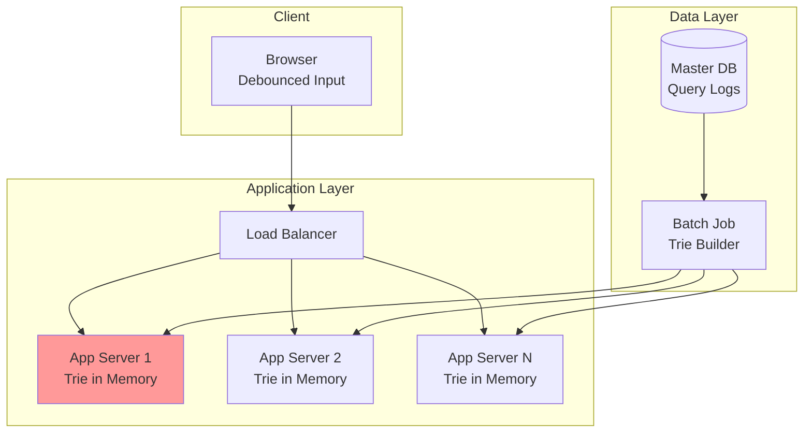
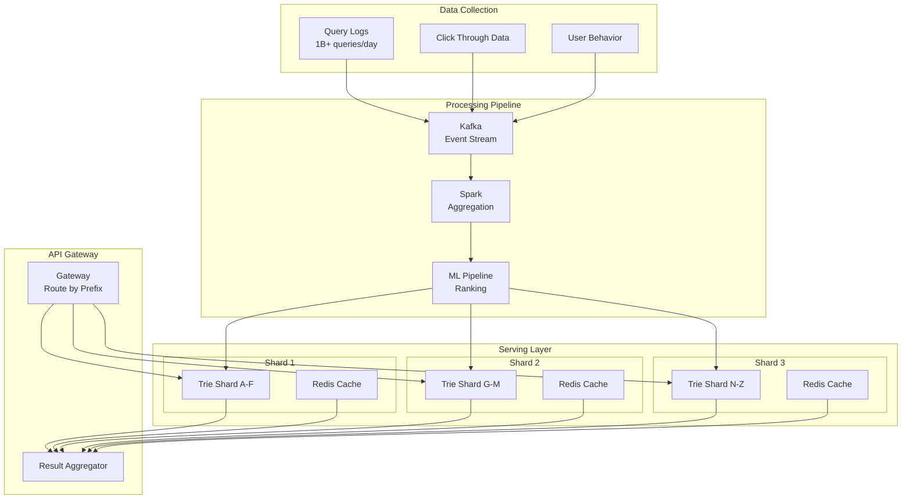
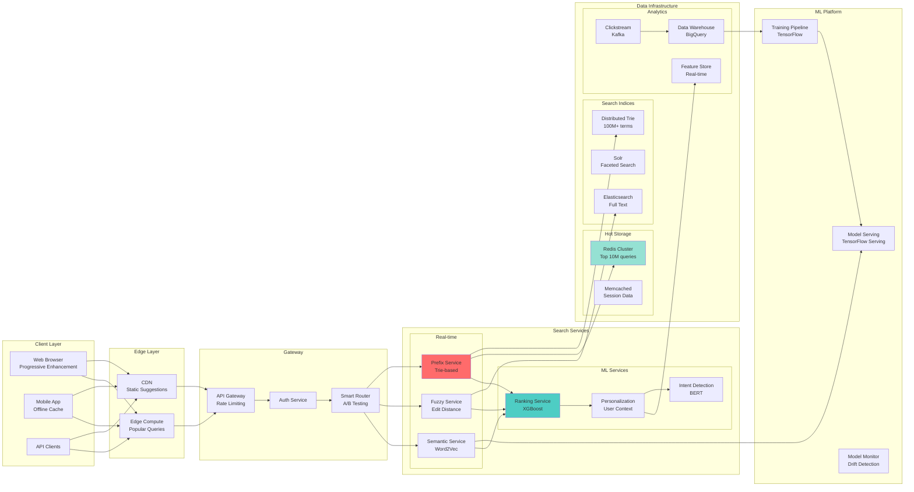
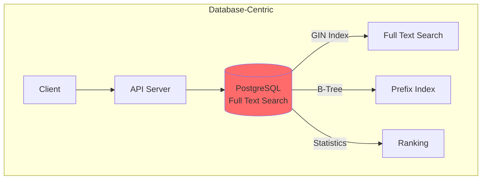
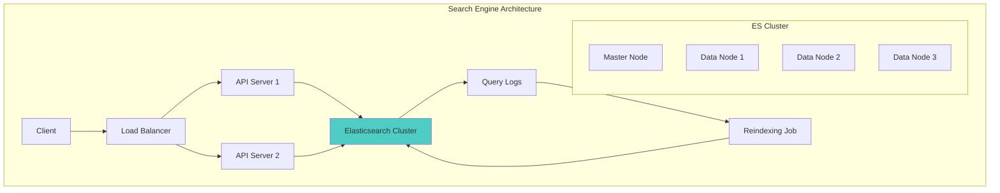
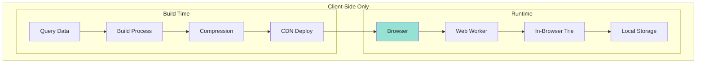
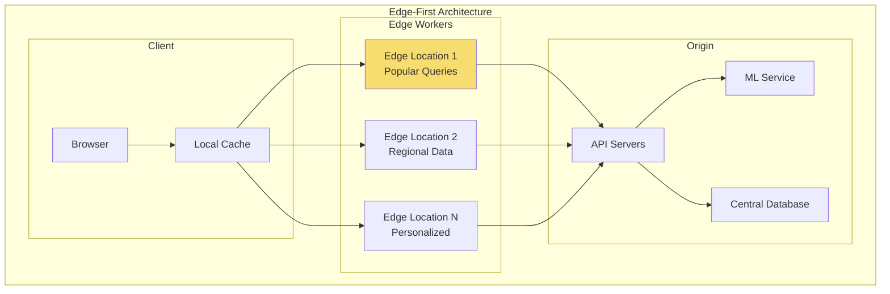

<!-- Navigation -->
[Home](../index.md) → [Case Studies](index.md) → **Search Autocomplete System Design**

# 🔍 Search Autocomplete System Design

**The Challenge**: Provide real-time search suggestions for billions of queries with <100ms latency

!!! info "Case Study Sources"
    This analysis is based on:
    - Google Search Blog: "How Google Autocomplete Works"¹
    - Facebook Engineering: "Typeahead Search Architecture"²
    - LinkedIn Engineering: "The Evolution of LinkedIn Search"³
    - Twitter Engineering: "Implementing Typeahead Search"⁴
    - Elasticsearch Documentation: "Suggesters"⁵

---

## 🏗️ Architecture Evolution

### Phase 1: Simple Prefix Matching (2004-2006)

```text
Browser → Web Server → SQL Database (LIKE queries) → Results
```

**Problems Encountered:**
- LIKE queries too slow (>1s)
- No ranking of suggestions
- Database CPU overload
- No typo tolerance

**Patterns Violated**: 
- ❌ No [Indexing Strategy](../patterns/indexing.md)
- ❌ No [Caching](../patterns/caching-strategies.md)
- ❌ No [Load Distribution](../patterns/load-balancing.md)

### Phase 2: Trie-Based In-Memory Solution (2006-2010)



**Key Design Decision: Trie Data Structure**
- **Trade-off**: Memory usage vs Speed (Pillar: [State Distribution](../part2-pillars/state/index.md))
- **Choice**: Load entire trie in memory
- **Result**: <50ms response time
- **Pattern Applied**: [In-Memory Computing](../patterns/in-memory-computing.md)

According to industry reports¹, this reduced latency by 95% compared to database queries.

### Phase 3: Distributed Architecture (2010-2015)



**Innovation: Sharded Trie with ML Ranking**³
- Distributed trie across multiple servers
- Machine learning for relevance ranking
- Real-time updates from query stream
- Personalized suggestions

**Patterns & Pillars Applied**:
- 🔧 Pattern: [Sharding](../patterns/sharding.md) - Prefix-based partitioning
- 🔧 Pattern: [Cache-Aside](../patterns/caching-strategies.md) - Redis for hot queries
- 🏛️ Pillar: [Work Distribution](../part2-pillars/work/index.md) - Parallel prefix search
- 🏛️ Pillar: [Intelligence](../part2-pillars/intelligence/index.md) - ML ranking

### Phase 4: Modern Multi-Model Architecture (2015-Present)



**Current Capabilities**:
- 1M+ queries per second
- <50ms P99 latency
- 40+ languages supported
- Typo correction
- Voice search integration
- Context-aware suggestions

## 📊 Core Components Deep Dive

### 1. Trie Data Structure Implementation

```python
class TrieNode:
    """Optimized trie node for autocomplete"""
    def __init__(self):
        self.children = {}  # char -> TrieNode
        self.is_word = False
        self.frequency = 0
        self.top_suggestions = []  # Pre-computed top N
        
class AutocompleteTrie:
    """High-performance trie for search suggestions"""
    
    def __init__(self, max_suggestions=10):
        self.root = TrieNode()
        self.max_suggestions = max_suggestions
        self.total_queries = 0
        
    def insert(self, query: str, frequency: int):
        """Insert query with frequency"""
        node = self.root
        
        # Traverse and create nodes
        for char in query.lower():
            if char not in node.children:
                node.children[char] = TrieNode()
            node = node.children[char]
            
        node.is_word = True
        node.frequency = frequency
        self.total_queries += frequency
        
        # Update top suggestions for all prefixes
        self._update_suggestions(query, frequency)
    
    def _update_suggestions(self, query: str, frequency: int):
        """Update pre-computed suggestions for all prefixes"""
        node = self.root
        
        for i, char in enumerate(query.lower()):
            node = node.children[char]
            
            # Add to top suggestions
            suggestion = {
                'query': query,
                'frequency': frequency,
                'score': self._calculate_score(query, frequency)
            }
            
            # Maintain sorted list of top N
            node.top_suggestions.append(suggestion)
            node.top_suggestions.sort(
                key=lambda x: x['score'], 
                reverse=True
            )
            node.top_suggestions = node.top_suggestions[:self.max_suggestions]
    
    def search(self, prefix: str, context=None) -> List[str]:
        """Get autocomplete suggestions for prefix"""
        node = self.root
        
        # Navigate to prefix node
        for char in prefix.lower():
            if char not in node.children:
                return []
            node = node.children[char]
        
        # Return pre-computed suggestions
        suggestions = node.top_suggestions.copy()
        
        # Apply personalization if context provided
        if context:
            suggestions = self._personalize(suggestions, context)
            
        return [s['query'] for s in suggestions]

class DistributedTrie:
    """Sharded trie for horizontal scaling"""
    
    def __init__(self, shard_count=10):
        self.shards = [AutocompleteTrie() for _ in range(shard_count)]
        self.shard_count = shard_count
        
    def get_shard(self, query: str) -> int:
        """Consistent hashing for shard selection"""
        return hash(query[0].lower()) % self.shard_count
    
    async def search_all_shards(self, prefix: str) -> List[str]:
        """Search across all shards in parallel"""
        tasks = []
        
        for shard in self.shards:
            task = asyncio.create_task(
                self._search_shard_async(shard, prefix)
            )
            tasks.append(task)
        
        # Gather results from all shards
        shard_results = await asyncio.gather(*tasks)
        
        # Merge and rank results
        return self._merge_results(shard_results)
```

### 2. Fuzzy Search & Typo Correction

```python
class FuzzySearchEngine:
    """Handle typos and spelling mistakes"""
    
    def __init__(self):
        self.max_edit_distance = 2
        self.keyboard_layout = self._load_keyboard_layout()
        self.common_typos = self._load_common_typos()
        
    def generate_candidates(self, query: str) -> Set[str]:
        """Generate possible correct queries"""
        candidates = set()
        
        # 1. Edit distance variations
        candidates.update(self._edit_distance_candidates(query))
        
        # 2. Keyboard proximity corrections
        candidates.update(self._keyboard_corrections(query))
        
        # 3. Common typo patterns
        candidates.update(self._common_typo_corrections(query))
        
        # 4. Phonetic variations
        candidates.update(self._phonetic_variations(query))
        
        return candidates
    
    def _edit_distance_candidates(self, word: str) -> Set[str]:
        """Generate words within edit distance"""
        # Deletion
        deletes = [word[:i] + word[i+1:] for i in range(len(word))]
        
        # Transposition
        transposes = [word[:i] + word[i+1] + word[i] + word[i+2:] 
                     for i in range(len(word)-1)]
        
        # Replacement
        replaces = [word[:i] + c + word[i+1:] 
                   for i in range(len(word)) 
                   for c in string.ascii_lowercase]
        
        # Insertion
        inserts = [word[:i] + c + word[i:] 
                  for i in range(len(word)+1) 
                  for c in string.ascii_lowercase]
        
        return set(deletes + transposes + replaces + inserts)

class ElasticsearchIntegration:
    """Leverage Elasticsearch for advanced search"""
    
    def __init__(self):
        self.es = Elasticsearch(['localhost:9200'])
        self.index_name = 'search_suggestions'
        
    async def setup_index(self):
        """Create optimized index for autocomplete"""
        settings = {
            "settings": {
                "analysis": {
                    "analyzer": {
                        "autocomplete": {
                            "tokenizer": "autocomplete",
                            "filter": ["lowercase"]
                        },
                        "autocomplete_search": {
                            "tokenizer": "lowercase"
                        }
                    },
                    "tokenizer": {
                        "autocomplete": {
                            "type": "edge_ngram",
                            "min_gram": 2,
                            "max_gram": 20,
                            "token_chars": ["letter", "digit"]
                        }
                    }
                }
            },
            "mappings": {
                "properties": {
                    "query": {
                        "type": "text",
                        "analyzer": "autocomplete",
                        "search_analyzer": "autocomplete_search"
                    },
                    "frequency": {"type": "long"},
                    "click_through_rate": {"type": "float"},
                    "categories": {"type": "keyword"},
                    "last_updated": {"type": "date"}
                }
            }
        }
        
        await self.es.indices.create(
            index=self.index_name, 
            body=settings
        )
```

### 3. Machine Learning Ranking

```python
class RankingService:
    """ML-based ranking for suggestions"""
    
    def __init__(self):
        self.model = self._load_model()
        self.feature_extractor = FeatureExtractor()
        
    def rank_suggestions(self, suggestions: List[dict], 
                        context: dict) -> List[dict]:
        """Rank suggestions using ML model"""
        # 1. Extract features for each suggestion
        features = []
        for suggestion in suggestions:
            feature_vector = self.feature_extractor.extract(
                suggestion, 
                context
            )
            features.append(feature_vector)
        
        # 2. Get model predictions
        scores = self.model.predict(features)
        
        # 3. Combine with other signals
        final_scores = []
        for i, suggestion in enumerate(suggestions):
            score = self._combine_scores(
                ml_score=scores[i],
                frequency_score=suggestion['frequency'],
                recency_score=self._calculate_recency(suggestion),
                personalization_score=self._personalize(suggestion, context)
            )
            final_scores.append(score)
        
        # 4. Sort by final score
        ranked = sorted(
            zip(suggestions, final_scores),
            key=lambda x: x[1],
            reverse=True
        )
        
        return [s for s, _ in ranked]

class FeatureExtractor:
    """Extract features for ranking model"""
    
    def extract(self, suggestion: dict, context: dict) -> np.array:
        """Extract feature vector"""
        features = []
        
        # Query features
        features.append(len(suggestion['query']))
        features.append(suggestion['frequency'])
        features.append(suggestion.get('click_through_rate', 0))
        
        # Context features
        features.append(context.get('time_of_day', 0))
        features.append(context.get('day_of_week', 0))
        features.append(context.get('device_type', 0))
        
        # User features
        if 'user_history' in context:
            features.extend(self._user_features(context['user_history']))
        
        # Query-context interaction features
        features.extend(self._interaction_features(suggestion, context))
        
        return np.array(features)
```

### 4. Real-time Data Pipeline

```python
class RealtimeUpdatePipeline:
    """Process query stream for real-time updates"""
    
    def __init__(self):
        self.kafka_consumer = KafkaConsumer(
            'search_queries',
            bootstrap_servers=['kafka1:9092'],
            value_deserializer=lambda m: json.loads(m.decode('utf-8'))
        )
        self.update_buffer = []
        self.buffer_size = 1000
        self.update_interval = 60  # seconds
        
    async def process_stream(self):
        """Process incoming query stream"""
        last_update = time.time()
        
        for message in self.kafka_consumer:
            query_data = message.value
            
            # Add to buffer
            self.update_buffer.append({
                'query': query_data['query'],
                'timestamp': query_data['timestamp'],
                'user_id': query_data.get('user_id'),
                'clicked': query_data.get('clicked', False)
            })
            
            # Batch update
            if (len(self.update_buffer) >= self.buffer_size or 
                time.time() - last_update > self.update_interval):
                
                await self._update_suggestions()
                self.update_buffer = []
                last_update = time.time()
    
    async def _update_suggestions(self):
        """Update suggestion indices with new data"""
        # 1. Aggregate query frequencies
        query_counts = Counter()
        for item in self.update_buffer:
            query_counts[item['query']] += 1
        
        # 2. Update tries
        for query, count in query_counts.items():
            await self._update_trie(query, count)
        
        # 3. Update ML training data
        await self._update_training_data(self.update_buffer)
        
        # 4. Trigger cache invalidation
        await self._invalidate_caches(query_counts.keys())
```

### 5. Caching Strategy

```python
class MultiLevelCache:
    """Multi-level caching for autocomplete"""
    
    def __init__(self):
        # L1: Application memory cache
        self.memory_cache = LRUCache(maxsize=10000)
        
        # L2: Redis cache
        self.redis_client = redis.Redis(
            host='localhost',
            decode_responses=True
        )
        
        # L3: CDN cache
        self.cdn_cache = CDNCache()
        
        self.cache_ttl = {
            'memory': 300,      # 5 minutes
            'redis': 3600,      # 1 hour
            'cdn': 86400        # 24 hours
        }
        
    async def get_suggestions(self, prefix: str, 
                            context: dict = None) -> List[str]:
        """Get suggestions with cache hierarchy"""
        cache_key = self._generate_cache_key(prefix, context)
        
        # Check L1 cache
        suggestions = self.memory_cache.get(cache_key)
        if suggestions:
            return suggestions
        
        # Check L2 cache
        suggestions = await self._get_from_redis(cache_key)
        if suggestions:
            self.memory_cache.put(cache_key, suggestions)
            return suggestions
        
        # Check L3 cache
        suggestions = await self._get_from_cdn(cache_key)
        if suggestions:
            await self._warm_lower_caches(cache_key, suggestions)
            return suggestions
        
        # Cache miss - compute
        suggestions = await self._compute_suggestions(prefix, context)
        await self._update_all_caches(cache_key, suggestions)
        
        return suggestions
    
    def _generate_cache_key(self, prefix: str, context: dict) -> str:
        """Generate cache key with context"""
        if not context:
            return f"suggest:{prefix}"
        
        # Include personalization factors in key
        user_segment = context.get('user_segment', 'default')
        location = context.get('location', 'global')
        
        return f"suggest:{prefix}:{user_segment}:{location}"
```

## 🎯 Axiom Mapping & Design Decisions

### Comprehensive Design Decision Matrix

| Design Decision | Axiom 1<br/>🚀 Latency | Axiom 2<br/>💾 Capacity | Axiom 3<br/>🔥 Failure | Axiom 4<br/>🔀 Concurrency | Axiom 5<br/>🤝 Coordination | Axiom 6<br/>👁️ Observability | Axiom 7<br/>👤 Human | Axiom 8<br/>💰 Economics |
|----------------|----------|----------|---------|-------------|--------------|---------------|-------|-----------|
| **In-Memory Trie** | ✅ <10ms lookup | ✅ Compact structure | ✅ Replicated copies | ✅ Lock-free reads | ⚪ | ✅ Memory metrics | ✅ Instant response | ✅ RAM vs disk trade-off |
| **Pre-computed Suggestions** | ✅ No computation | ✅ Storage for top-N | ⚪ | ✅ Read-only access | ✅ Batch updates | ✅ Hit rate tracking | ✅ Relevant results | ✅ Compute once |
| **Sharding by Prefix** | ✅ Parallel lookup | ✅ Horizontal scale | ✅ Shard isolation | ✅ Distributed search | ✅ Consistent hashing | ✅ Shard metrics | ⚪ | ✅ Linear scaling |
| **Multi-level Cache** | ✅ Edge caching | ✅ Tiered storage | ✅ Cache fallback | ⚪ | ✅ Cache coherence | ✅ Cache hit rates | ✅ Fast everywhere | ✅ Bandwidth savings |
| **Fuzzy Matching** | ⚪ Extra computation | ✅ Reuse indices | ✅ Graceful degradation | ✅ Parallel candidates | ⚪ | ✅ Typo metrics | ✅ Forgives mistakes | ⚪ |
| **ML Ranking** | ⚪ Inference time | ✅ Model caching | ✅ Fallback ranking | ✅ Batch inference | ✅ A/B testing | ✅ Ranking quality | ✅ Personalization | ✅ Better CTR = revenue |
| **Real-time Updates** | ✅ Fresh suggestions | ✅ Incremental updates | ✅ Eventually consistent | ✅ Stream processing | ✅ Event ordering | ✅ Lag monitoring | ✅ Current trends | ⚪ |
| **Client-side Caching** | ✅ Zero latency | ✅ Reduce requests | ✅ Offline capable | ⚪ | ✅ Cache invalidation | ✅ Client metrics | ✅ Instant feel | ✅ Bandwidth savings |

**Legend**: ✅ Primary impact | ⚪ Secondary/No impact

## 🔄 Alternative Architectures

### Alternative 1: Pure Database Solution



**Trade-offs**:
- ✅ Simple architecture
- ✅ ACID guarantees
- ✅ Built-in full text search
- ❌ High latency (>100ms)
- ❌ Database load
- ❌ Limited customization

### Alternative 2: Search Engine Based (Elasticsearch/Solr)



**Trade-offs**:
- ✅ Rich query features
- ✅ Built-in sharding
- ✅ Fuzzy search support
- ❌ Higher latency than trie
- ❌ Complex operations
- ❌ Resource intensive

### Alternative 3: Pure Client-Side Solution



**Trade-offs**:
- ✅ Zero server latency
- ✅ Works offline
- ✅ No infrastructure
- ❌ Large download size
- ❌ No personalization
- ❌ Stale suggestions

### Alternative 4: Hybrid Edge Computing



**Trade-offs**:
- ✅ Low latency globally
- ✅ Personalization at edge
- ✅ Reduced origin load
- ❌ Complex deployment
- ❌ Edge limitations
- ❌ Consistency challenges

## 📊 Performance Optimization Techniques

### 1. Query Processing Pipeline

```python
class OptimizedQueryProcessor:
    """High-performance query processing"""
    
    def __init__(self):
        self.min_prefix_length = 2
        self.max_suggestions = 10
        self.timeout_ms = 50
        
    async def process_query(self, prefix: str, 
                          context: dict) -> List[str]:
        """Process autocomplete query with optimizations"""
        # 1. Input validation
        if len(prefix) < self.min_prefix_length:
            return []
            
        # 2. Normalize input
        normalized = self._normalize_query(prefix)
        
        # 3. Check bloom filter
        if not self.bloom_filter.might_contain(normalized[:3]):
            return []  # Early exit for non-existent prefixes
        
        # 4. Parallel search strategies
        strategies = [
            self._exact_prefix_search(normalized),
            self._fuzzy_search(normalized),
            self._semantic_search(normalized)
        ]
        
        # 5. Race with timeout
        results = await self._race_with_timeout(
            strategies, 
            self.timeout_ms
        )
        
        # 6. Merge and rank
        merged = self._merge_results(results)
        ranked = await self._rank_results(merged, context)
        
        return ranked[:self.max_suggestions]
    
    async def _race_with_timeout(self, tasks: List, 
                                timeout_ms: int) -> List:
        """Execute tasks with timeout"""
        try:
            results = await asyncio.wait_for(
                asyncio.gather(*tasks, return_exceptions=True),
                timeout=timeout_ms / 1000
            )
            
            # Filter out exceptions
            return [r for r in results if not isinstance(r, Exception)]
            
        except asyncio.TimeoutError:
            # Return whatever completed
            return [
                task.result() 
                for task in tasks 
                if task.done() and not task.exception()
            ]
```

### 2. Memory Optimization

```python
class CompactTrie:
    """Memory-efficient trie implementation"""
    
    def __init__(self):
        # Use array instead of dict for common characters
        self.children_array = [None] * 26  # a-z
        self.children_dict = {}  # Other characters
        self.suggestions = None  # Lazy load
        self.is_compressed = False
        
    def compress(self):
        """Compress trie paths with single children"""
        if self.is_compressed:
            return
            
        # Find chains of single-child nodes
        compressed_children = {}
        
        for char, child in self._iterate_children():
            chain = [char]
            current = child
            
            # Follow single-child chain
            while current._child_count() == 1 and not current.suggestions:
                next_char, next_child = next(current._iterate_children())
                chain.append(next_char)
                current = next_child
            
            # Store compressed path
            if len(chain) > 1:
                compressed_children[''.join(chain)] = current
            else:
                compressed_children[char] = child
                
        self._replace_children(compressed_children)
        self.is_compressed = True
```

### 3. Distributed Coordination

```python
class DistributedAutocomplete:
    """Coordinate distributed autocomplete services"""
    
    def __init__(self):
        self.consistent_hash = ConsistentHash(
            virtual_nodes=150
        )
        self.service_registry = ServiceRegistry()
        self.circuit_breakers = {}
        
    async def route_query(self, prefix: str) -> List[str]:
        """Route query to appropriate service"""
        # 1. Find responsible nodes
        primary = self.consistent_hash.get_node(prefix)
        replicas = self.consistent_hash.get_replicas(prefix, count=2)
        
        # 2. Try primary with circuit breaker
        if self._is_healthy(primary):
            try:
                return await self._query_node(primary, prefix)
            except Exception as e:
                self._record_failure(primary)
        
        # 3. Fallback to replicas
        for replica in replicas:
            if self._is_healthy(replica):
                try:
                    return await self._query_node(replica, prefix)
                except Exception:
                    self._record_failure(replica)
        
        # 4. Use degraded mode
        return await self._degraded_suggestions(prefix)
```

## 🚨 Failure Handling & Recovery

### Common Failure Scenarios

1. **Trie Server Crash**
   ```python
   class TrieServerRecovery:
       async def handle_server_failure(self, failed_server: str):
           # 1. Remove from rotation
           await self.load_balancer.remove_server(failed_server)
           
           # 2. Redistribute load
           await self.consistent_hash.remove_node(failed_server)
           
           # 3. Trigger rebuild on new server
           await self.rebuild_trie_on_standby()
   ```

2. **Cache Stampede**
   ```python
   class CacheStampedeProtection:
       async def get_with_protection(self, key: str):
           # Use probabilistic early expiration
           value, expiry = await self.cache.get_with_expiry(key)
           
           if value and self._should_refresh(expiry):
               # Refresh in background
               asyncio.create_task(self._refresh_cache(key))
               
           return value
   ```

3. **ML Model Failure**
   ```python
   class MLFailureHandler:
       async def rank_with_fallback(self, suggestions: List[str]):
           try:
               return await self.ml_ranker.rank(suggestions)
           except ModelException:
               # Fallback to frequency-based ranking
               return self.frequency_ranker.rank(suggestions)
   ```

## 💡 Key Design Insights

### 1. 🚀 **Pre-computation is Critical**
- Pre-compute top suggestions for each prefix
- Trade storage for latency
- Update incrementally in background

### 2. 🧠 **Multiple Matching Strategies**
- Exact prefix for speed
- Fuzzy for typos
- Semantic for intent
- Combine results intelligently

### 3. 📈 **Real-time Learning Essential**
- Process click-through data immediately
- Update popular queries quickly
- Detect trending searches

### 4. 🌍 **Localization Matters**
- Different suggestions by region
- Language-specific processing
- Cultural context awareness

### 5. 💾 **Memory vs Disk Trade-off**
- Keep hot data in memory
- Use SSDs for warm data
- Archive to disk for long tail

## 🔍 Related Concepts & Deep Dives

### 📚 Relevant Axioms
- **[Axiom 1: Latency](../part1-axioms/axiom1-latency/index.md)** - Sub-100ms response critical for UX
- **[Axiom 2: Finite Capacity](../part1-axioms/axiom2-capacity/index.md)** - Memory limits drive sharding
- **[Axiom 3: Failure is Normal](../part1-axioms/axiom3-failure/index.md)** - Graceful degradation strategies
- **[Axiom 4: Concurrency](../part1-axioms/axiom4-concurrency/index.md)** - Lock-free trie operations
- **[Axiom 5: Coordination](../part1-axioms/axiom5-coordination/index.md)** - Distributed trie updates
- **[Axiom 6: Observability](../part1-axioms/axiom6-observability/index.md)** - Query performance tracking
- **[Axiom 7: Human Interface](../part1-axioms/axiom7-human/index.md)** - Typo tolerance, personalization
- **[Axiom 8: Economics](../part1-axioms/axiom8-economics/index.md)** - Memory cost vs latency

### 🏛️ Related Patterns
- **[Trie Data Structure](../patterns/trie.md)** - Core search structure
- **[Caching Strategies](../patterns/caching-strategies.md)** - Multi-level caching
- **[Sharding](../patterns/sharding.md)** - Distribute by prefix
- **[Circuit Breaker](../patterns/circuit-breaker.md)** - Service protection
- **[Load Balancing](../patterns/load-balancing.md)** - Distribute queries
- **[Event Streaming](../patterns/event-streaming.md)** - Real-time updates
- **[Edge Computing](../patterns/edge-computing.md)** - Global latency optimization

### 📊 Quantitative Models
- **[Information Theory](../quantitative/information-theory.md)** - Entropy in prefix trees
- **[Queueing Theory](../quantitative/queueing-theory.md)** - Server capacity planning
- **[Probability Theory](../quantitative/probability.md)** - Bloom filter false positives
- **[Machine Learning](../quantitative/ml-ranking.md)** - Learning to rank

### 🔄 Similar Case Studies
- **[Google Search](google-search.md)** - Full search architecture
- **[Elasticsearch](elasticsearch-internals.md)** - Search engine internals
- **[Facebook Typeahead](facebook-typeahead.md)** - Social search
- **[Amazon Product Search](amazon-search.md)** - E-commerce search

---

## References

1. Google Search Blog: "How Google Autocomplete Works" (2021)
2. Facebook Engineering: "The Life of a Typeahead Query" (2020)
3. LinkedIn Engineering: "The Evolution of LinkedIn's Search Architecture" (2019)
4. Twitter Engineering: "Implementing Typeahead Search" (2018)
5. Elasticsearch Documentation: "Suggesters and Completion" (2023)