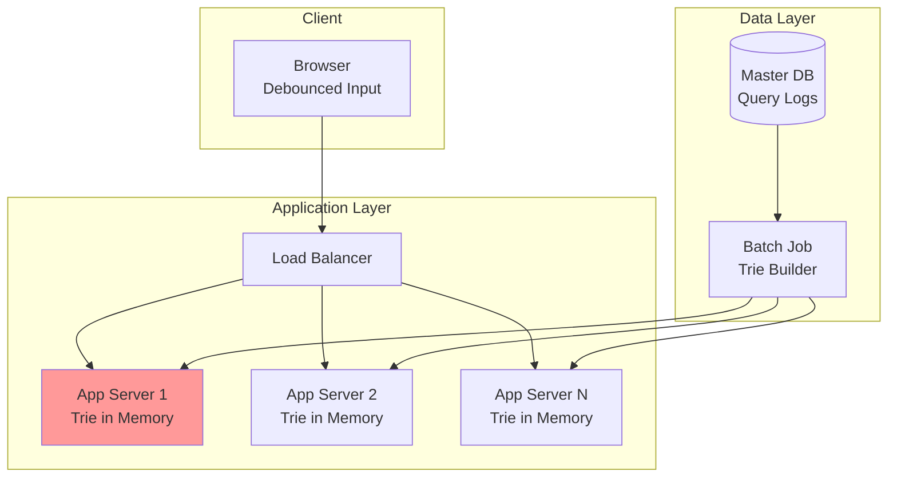
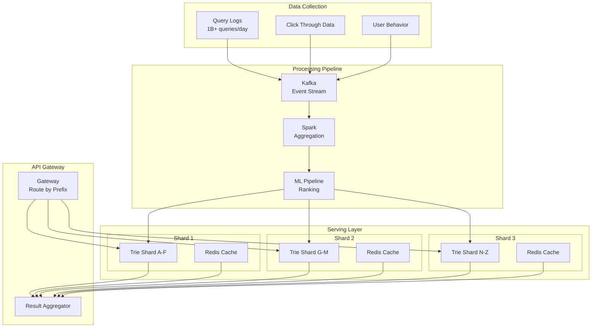
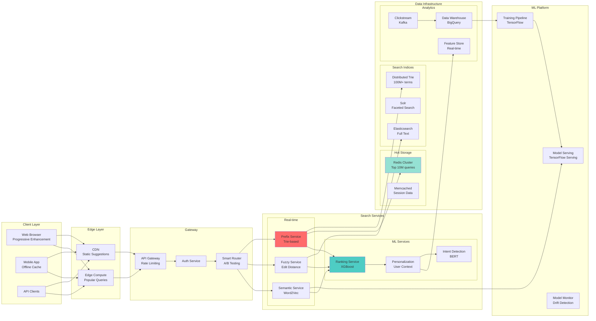
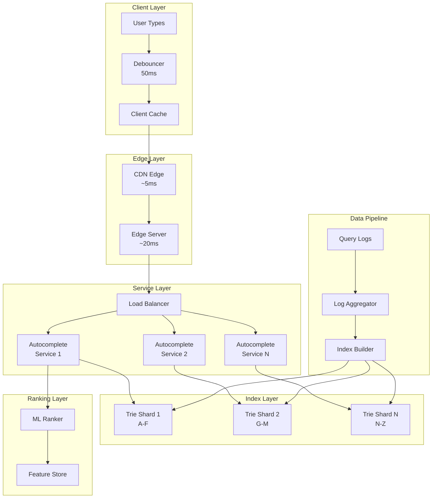
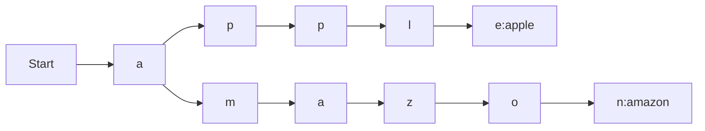
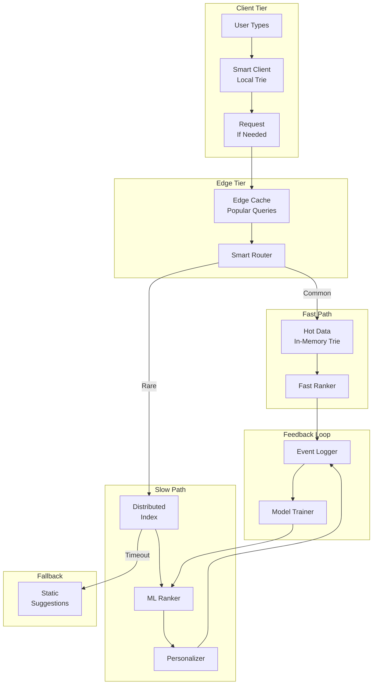

# 🔍 Search Autocomplete System Design

**Challenge**: Provide real-time search suggestions for billions of queries with <100ms latency

!!! info "Case Study Sources"
    Based on: Google Autocomplete¹, Facebook Typeahead², LinkedIn Search³, Twitter Typeahead⁴, Elasticsearch Suggesters⁵

## Overview

Typeahead requires <50ms response. Google: 3.5B queries/day, sub-100ms latency with relevance.

## Core Concepts

### Law 2: Asynchronous Reality ⏳ - The 100ms Perception Barrier

```python
import asyncio
import time
from typing import List, Dict, Set, Tuple, Optional
from dataclasses import dataclass, field
from collections import defaultdict
import numpy as np
from sortedcontainers import SortedList
import mmh3  # MurmurHash3 for fast hashing

@dataclass
class SearchQuery:
    """Represents a search query with metadata"""
    query: str
    user_id: str
    timestamp: float = field(default_factory=time.time)
    location: Optional[Tuple[float, float]] = None  # lat, lon
    context: Dict = field(default_factory=dict)

@dataclass
class Suggestion:
    """A single autocomplete suggestion"""
    text: str
    score: float
    metadata: Dict = field(default_factory=dict)
    
class TrieNode:
    """Optimized trie node for fast traversal"""
    __slots__ = ['children', 'is_end', 'frequency', 'top_suggestions']
    
    def __init__(self):
        self.children = {}  # char -> TrieNode
        self.is_end = False
        self.frequency = 0
        self.top_suggestions = []  # Pre-computed top N

class OptimizedTrie:
    """Trie optimized for sub-10ms lookups"""
    
    def __init__(self, cache_size: int = 10):
        self.root = TrieNode()
        self.cache_size = cache_size
        self.build_time_ms = 0
        
    def insert(self, word: str, frequency: int):
        """Insert with frequency for ranking"""
        node = self.root
        
        for char in word.lower():
            if char not in node.children:
                node.children[char] = TrieNode()
            node = node.children[char]
            
        node.is_end = True
        node.frequency = frequency
    
    def search_prefix(self, prefix: str, limit: int = 10) -> List[Tuple[str, int]]:
        """Ultra-fast prefix search"""
        start_time = time.time()
        
        # Navigate to prefix node
        node = self.root
        for char in prefix.lower():
            if char not in node.children:
                return []
            node = node.children[char]
        
        # Return pre-computed suggestions if available
        if node.top_suggestions:
            return node.top_suggestions[:limit]
        
        # Otherwise, DFS to find all words
        suggestions = []
        self._dfs(node, prefix, suggestions)
        
        # Sort by frequency
        suggestions.sort(key=lambda x: x[1], reverse=True)
        
        search_time = (time.time() - start_time) * 1000
        if search_time > 10:  # Log slow searches
            print(f"Slow search: {prefix} took {search_time:.1f}ms")
        
        return suggestions[:limit]
    
    def _dfs(self, node: TrieNode, prefix: str, results: List):
        """Depth-first search for completions"""
        if node.is_end:
            results.append((prefix, node.frequency))
        
        for char, child in node.children.items():
            self._dfs(child, prefix + char, results)
    
    def precompute_suggestions(self):
        """Precompute top suggestions for each node"""
        start = time.time()
        self._precompute_node(self.root, "")
        self.build_time_ms = (time.time() - start) * 1000
    
    def _precompute_node(self, node: TrieNode, prefix: str):
        """Recursively precompute suggestions"""
        suggestions = []
        self._dfs(node, prefix, suggestions)
        suggestions.sort(key=lambda x: x[1], reverse=True)
        node.top_suggestions = suggestions[:self.cache_size]
        
        for char, child in node.children.items():
            self._precompute_node(child, prefix + char)

class EdgeCacheStrategy:
    """Multi-level caching for global latency optimization"""
    
    def __init__(self):
        self.edge_caches = {}  # location -> cache
        self.regional_caches = {}
        self.global_cache = {}
        self.cache_stats = defaultdict(lambda: {'hits': 0, 'misses': 0})
        
    async def get_suggestions(self, query: SearchQuery) -> Tuple[List[Suggestion], int]:
        """Get suggestions with latency tracking"""
        cache_key = query.query.lower()
        
        # Edge cache (5ms)
        edge_location = self._get_edge_location(query.location)
        if edge_location in self.edge_caches:
            if cache_key in self.edge_caches[edge_location]:
                self.cache_stats['edge']['hits'] += 1
                return self.edge_caches[edge_location][cache_key], 5
        
        self.cache_stats['edge']['misses'] += 1
        
        # Regional cache (20ms) 
        region = self._get_region(query.location)
        await asyncio.sleep(0.015)  # Simulate network latency
        
        if region in self.regional_caches:
            if cache_key in self.regional_caches[region]:
                self.cache_stats['regional']['hits'] += 1
                suggestions = self.regional_caches[region][cache_key]
                # Populate edge cache
                self._populate_edge_cache(edge_location, cache_key, suggestions)
                return suggestions, 20
        
        self.cache_stats['regional']['misses'] += 1
        
        # Global cache (50ms)
        await asyncio.sleep(0.03)  # Additional latency
        
        if cache_key in self.global_cache:
            self.cache_stats['global']['hits'] += 1
            suggestions = self.global_cache[cache_key]
            # Populate lower caches
            self._populate_regional_cache(region, cache_key, suggestions)
            self._populate_edge_cache(edge_location, cache_key, suggestions)
            return suggestions, 50
        
        self.cache_stats['global']['misses'] += 1
        return [], 100  # Need to compute
```

**Production Reality**: Google's autocomplete serves suggestions in <50ms globally by maintaining edge caches in 100+ locations and precomputing popular queries.

### Law 4: Trade-offs ⚖️ - The Vocabulary Explosion

Search systems must handle exponentially growing vocabularies and query combinations.

```python
class CapacityOptimizer:
    """Manage memory and computation capacity"""
    
    def __init__(self):
        self.vocabulary_size = 0
        self.index_size_bytes = 0
        self.query_rate = 0
        self.compression_ratio = 1.0
        
    def estimate_memory_requirements(self, 
                                   unique_terms: int,
                                   avg_term_length: int = 10,
                                   suggestions_per_term: int = 10) -> Dict:
        """Estimate memory needs for autocomplete index"""
        # Trie node overhead
        bytes_per_node = 40  # Python object overhead
        avg_nodes_per_term = avg_term_length * 0.7  # Sharing factor
        
        trie_size = unique_terms * avg_nodes_per_term * bytes_per_node
        
        # Precomputed suggestions
        suggestion_size = (avg_term_length + 8) * suggestions_per_term  # text + score
        cache_size = unique_terms * suggestion_size
        
        # Frequency data
        frequency_size = unique_terms * 8  # 64-bit integers
        
        total_size = trie_size + cache_size + frequency_size
        
        return {
            'trie_size_gb': trie_size / 1e9,
            'cache_size_gb': cache_size / 1e9,
            'frequency_size_gb': frequency_size / 1e9,
            'total_size_gb': total_size / 1e9,
            'servers_needed': int(total_size / (32 * 1e9)) + 1  # 32GB per server
        }

class CompressedTrie:
    """Memory-efficient trie using path compression"""
    
    def __init__(self):
        self.root = self._create_node()
        self.node_count = 1
        
    def _create_node(self):
        return {
            'edges': {},  # char/string -> node
            'value': None,
            'frequency': 0
        }
    
    def insert(self, word: str, frequency: int):
        """Insert with path compression"""
        node = self.root
        i = 0
        
        while i < len(word):
            found = False
            
            # Check if we can follow an existing edge
            for edge_label, child in node['edges'].items():
                common_len = self._common_prefix_length(word[i:], edge_label)
                
                if common_len > 0:
                    if common_len == len(edge_label):
                        # Complete match, continue with child
                        node = child
                        i += common_len
                        found = True
                        break
                    else:
                        # Partial match, split edge
                        self._split_edge(node, edge_label, common_len)
                        node = node['edges'][edge_label[:common_len]]
                        i += common_len
                        found = True
                        break
            
            if not found:
                # Create new edge
                new_node = self._create_node()
                node['edges'][word[i:]] = new_node
                new_node['value'] = word
                new_node['frequency'] = frequency
                self.node_count += 1
                break
        
        if i == len(word):
            node['value'] = word
            node['frequency'] = frequency
    
    def _common_prefix_length(self, s1: str, s2: str) -> int:
        """Find length of common prefix"""
        i = 0
        while i < min(len(s1), len(s2)) and s1[i] == s2[i]:
            i += 1
        return i

class ShardedAutocomplete:
    """Shard autocomplete index across servers"""
    
    def __init__(self, shard_count: int = 100):
        self.shard_count = shard_count
        self.shards = [OptimizedTrie() for _ in range(shard_count)]
        self.shard_stats = defaultdict(lambda: {'terms': 0, 'queries': 0})
        
    def get_shard(self, term: str) -> int:
        """Consistent hashing for shard selection"""
        return mmh3.hash(term.lower()) % self.shard_count
    
    async def add_term(self, term: str, frequency: int):
        """Add term to appropriate shard"""
        shard_id = self.get_shard(term)
        self.shards[shard_id].insert(term, frequency)
        self.shard_stats[shard_id]['terms'] += 1
    
    async def search(self, prefix: str, limit: int = 10) -> List[Tuple[str, int]]:
        """Search across all shards"""
        # For prefix search, we need to query all shards
        tasks = []
        for shard in self.shards:
            tasks.append(self._search_shard(shard, prefix, limit))
        
        all_results = await asyncio.gather(*tasks)
        
        # Merge results from all shards
        merged = []
        for results in all_results:
            merged.extend(results)
        
        # Sort by frequency and return top N
        merged.sort(key=lambda x: x[1], reverse=True)
        return merged[:limit]
```

**Real Numbers**: Google processes 3.5 billion searches daily with a vocabulary of over 1 trillion unique queries, requiring sophisticated compression and sharding.

### Law 1: Failure ⛓️ - Graceful Degradation

Autocomplete must remain functional even during partial system failures.

```python
class ResilientAutocomplete:
    """Failure-resistant autocomplete service"""
    
    def __init__(self):
        self.primary_index = OptimizedTrie()
        self.fallback_index = CompressedTrie()  # Smaller, basic suggestions
        self.static_suggestions = {}  # Pre-computed popular queries
        self.circuit_breaker = CircuitBreaker()
        self.health_status = 'healthy'
        
    async def get_suggestions(self, query: str) -> List[Suggestion]:
        """Get suggestions with fallback strategies"""
        try:
            # Try primary system
            if self.circuit_breaker.is_closed():
                return await self._get_primary_suggestions(query)
        except Exception as e:
            self.circuit_breaker.record_failure()
            print(f"Primary system failed: {e}")
        
        # Fallback to secondary
        try:
            return await self._get_fallback_suggestions(query)
        except Exception as e:
            print(f"Fallback system failed: {e}")
        
        # Last resort: static suggestions
        return self._get_static_suggestions(query)
    
    async def _get_primary_suggestions(self, query: str) -> List[Suggestion]:
        """Get from primary index with timeout"""
        try:
            results = await asyncio.wait_for(
                self._search_primary(query),
                timeout=0.1  # 100ms timeout
            )
            self.circuit_breaker.record_success()
            return results
        except asyncio.TimeoutError:
            self.circuit_breaker.record_failure()
            raise
    
    def _get_static_suggestions(self, query: str) -> List[Suggestion]:
        """Return pre-computed popular suggestions"""
        # Common prefixes with cached results
        static_prefixes = {
            'a': ['amazon', 'apple', 'american airlines'],
            'b': ['best buy', 'bank of america', 'bitcoin'],
            'c': ['covid', 'craigslist', 'cnn'],
            # ... more prefixes
        }
        
        prefix = query[0].lower() if query else ''
        suggestions = static_prefixes.get(prefix, [])
        
        return [
            Suggestion(text=s, score=0.5)
            for s in suggestions
            if s.startswith(query.lower())
        ][:5]

class CircuitBreaker:
    """Prevent cascading failures"""
    
    def __init__(self, failure_threshold: int = 5, timeout: float = 60):
        self.failure_threshold = failure_threshold
        self.timeout = timeout
        self.failure_count = 0
        self.last_failure_time = 0
        self.state = 'closed'  # closed, open, half-open
        
    def is_closed(self) -> bool:
        """Check if circuit is closed (normal operation)"""
        if self.state == 'open':
            # Check if timeout has passed
            if time.time() - self.last_failure_time > self.timeout:
                self.state = 'half-open'
                return True
            return False
        return True
    
    def record_success(self):
        """Record successful operation"""
        self.failure_count = 0
        self.state = 'closed'
    
    def record_failure(self):
        """Record failed operation"""
        self.failure_count += 1
        self.last_failure_time = time.time()
        
        if self.failure_count >= self.failure_threshold:
            self.state = 'open'
            print(f"Circuit breaker opened at {time.time()}")
```

### Law 3: Emergence 🌪️ - Handling Parallel Queries

Millions of users typing simultaneously requires careful concurrency management.

```python
import threading
from asyncio import Semaphore

class ConcurrentSearchHandler:
    """Handle concurrent search requests efficiently"""
    
    def __init__(self, max_concurrent: int = 1000):
        self.semaphore = Semaphore(max_concurrent)
        self.query_deduplicator = QueryDeduplicator()
        self.thread_local = threading.local()
        
    async def handle_search(self, query: SearchQuery) -> List[Suggestion]:
        """Process search with concurrency control"""
        # Deduplicate identical queries
        dedup_key = f"{query.query}:{query.user_id}"
        existing = await self.query_deduplicator.get_or_compute(
            dedup_key,
            lambda: self._process_search(query)
        )
        
        if existing is not None:
            return existing
        
        # Limit concurrent searches
        async with self.semaphore:
            return await self._process_search(query)
    
    async def _process_search(self, query: SearchQuery) -> List[Suggestion]:
        """Process individual search request"""
        # Use thread-local storage for connection pooling
        if not hasattr(self.thread_local, 'search_index'):
            self.thread_local.search_index = OptimizedTrie()
        
        results = self.thread_local.search_index.search_prefix(
            query.query
        )
        
        return [
            Suggestion(text=text, score=freq)
            for text, freq in results
        ]

class QueryDeduplicator:
    """Deduplicate concurrent identical queries"""
    
    def __init__(self, ttl: float = 0.1):  # 100ms TTL
        self.pending = {}  # key -> Future
        self.ttl = ttl
        
    async def get_or_compute(self, key: str, compute_func):
        """Return cached result or compute once"""
        if key in self.pending:
            # Wait for existing computation
            return await self.pending[key]
        
        # Create future for this computation
        future = asyncio.create_future()
        self.pending[key] = future
        
        try:
            # Compute result
            result = await compute_func()
            future.set_result(result)
            
            # Clean up after TTL
            asyncio.create_task(self._cleanup_key(key))
            
            return result
        except Exception as e:
            future.set_exception(e)
            raise
    
    async def _cleanup_key(self, key: str):
        """Remove key after TTL"""
        await asyncio.sleep(self.ttl)
        self.pending.pop(key, None)

class ParallelIndexBuilder:
    """Build search index using parallel processing"""
    
    def __init__(self, worker_count: int = 10):
        self.worker_count = worker_count
        self.build_queue = asyncio.Queue()
        
    async def build_index(self, terms: List[Tuple[str, int]]) -> OptimizedTrie:
        """Build trie index in parallel"""
        # Create workers
        workers = []
        partial_tries = []
        
        for i in range(self.worker_count):
            trie = OptimizedTrie()
            partial_tries.append(trie)
            worker = asyncio.create_task(
                self._build_worker(i, trie)
            )
            workers.append(worker)
        
        # Distribute terms to workers
        for i, term_freq in enumerate(terms):
            worker_id = i % self.worker_count
            await self.build_queue.put((worker_id, term_freq))
        
        # Signal completion
        for i in range(self.worker_count):
            await self.build_queue.put((i, None))
        
        # Wait for workers
        await asyncio.gather(*workers)
        
        # Merge partial tries
        return self._merge_tries(partial_tries)
    
    async def _build_worker(self, worker_id: int, trie: OptimizedTrie):
        """Worker to build partial trie"""
        while True:
            item = await self.build_queue.get()
            if item[0] != worker_id:
                await self.build_queue.put(item)  # Not for us
                continue
                
            _, term_freq = item
            if term_freq is None:
                break  # Completion signal
                
            term, freq = term_freq
            trie.insert(term, freq)
```

### Law 4: Trade-offs ⚖️ - Global Consistency

Coordinating autocomplete suggestions across regions while maintaining consistency.

```python
class GlobalAutocompleteCoordinator:
    """Coordinate autocomplete across regions"""
    
    def __init__(self):
        self.regions = ['us-east', 'us-west', 'eu', 'asia']
        self.regional_indices = {r: OptimizedTrie() for r in self.regions}
        self.global_popular = SortedList(key=lambda x: -x[1])  # (term, frequency)
        self.sync_interval = 300  # 5 minutes
        
    async def update_term_frequency(self, term: str, region: str, delta: int):
        """Update term frequency with eventual consistency"""
        # Update regional index immediately
        regional_index = self.regional_indices[region]
        regional_index.insert(term, delta)  # Simplified - add to frequency
        
        # Queue for global aggregation
        await self._queue_global_update(term, delta)
        
        # Periodic sync to other regions
        if time.time() % self.sync_interval < 1:
            await self._sync_regions()
    
    async def _sync_regions(self):
        """Synchronize popular terms across regions"""
        # Aggregate top terms from each region
        regional_top_terms = {}
        
        for region, index in self.regional_indices.items():
            # Get top 1000 terms from each region
            top_terms = index.search_prefix("", limit=1000)
            regional_top_terms[region] = top_terms
        
        # Merge and identify globally popular terms
        term_frequencies = defaultdict(int)
        for region, terms in regional_top_terms.items():
            for term, freq in terms:
                term_frequencies[term] += freq
        
        # Update global popular list
        self.global_popular.clear()
        for term, freq in term_frequencies.items():
            self.global_popular.add((term, freq))
        
        # Propagate top global terms to all regions
        top_global = list(self.global_popular[:100])
        for region, index in self.regional_indices.items():
            for term, freq in top_global:
                index.insert(term, freq)

class ConsistentRanking:
    """Ensure consistent ranking across distributed nodes"""
    
    def __init__(self):
        self.version_vector = defaultdict(int)
        self.ranking_models = {}
        
    async def update_ranking_model(self, model_id: str, 
                                 parameters: Dict,
                                 version: int):
        """Update ranking model with version control"""
        if version <= self.version_vector[model_id]:
            return  # Outdated update
        
        self.ranking_models[model_id] = parameters
        self.version_vector[model_id] = version
        
        # Propagate to other nodes
        await self._propagate_model_update(model_id, parameters, version)
    
    def rank_suggestions(self, suggestions: List[Suggestion], 
                        context: Dict) -> List[Suggestion]:
        """Apply consistent ranking"""
        scored_suggestions = []
        
        for suggestion in suggestions:
            score = self._calculate_score(suggestion, context)
            scored_suggestions.append((suggestion, score))
        
        # Sort by score
        scored_suggestions.sort(key=lambda x: x[1], reverse=True)
        
        return [s[0] for s in scored_suggestions]
```

### Law 5: Epistemology 🧠 - Understanding Search Patterns

Monitoring and analyzing search patterns to improve suggestions.

```python
class SearchAnalytics:
    """Analyze search patterns and quality"""
    
    def __init__(self):
        self.query_log = []
        self.click_through_rates = defaultdict(float)
        self.latency_percentiles = []
        self.quality_metrics = {
            'coverage': 0.0,  # % queries with suggestions
            'relevance': 0.0,  # % clicked suggestions
            'diversity': 0.0   # Unique suggestions shown
        }
        
    async def log_search_event(self, event: Dict):
        """Log search interaction"""
        self.query_log.append({
            'timestamp': time.time(),
            'query': event['query'],
            'suggestions_shown': event['suggestions'],
            'suggestion_clicked': event.get('clicked'),
            'latency_ms': event['latency'],
            'user_id': event['user_id']
        })
        
        # Update metrics
        await self._update_metrics(event)
    
    async def _update_metrics(self, event: Dict):
        """Update quality metrics"""
        # Click-through rate
        if event.get('clicked'):
            query_prefix = event['query'][:3]  # Group by prefix
            self.click_through_rates[query_prefix] += 0.01  # Smoothed
        
        # Latency tracking
        self.latency_percentiles.append(event['latency'])
        if len(self.latency_percentiles) > 10000:
            self.latency_percentiles.pop(0)
        
        # Coverage
        has_suggestions = len(event['suggestions']) > 0
        self.quality_metrics['coverage'] = (
            0.99 * self.quality_metrics['coverage'] + 
            0.01 * (1.0 if has_suggestions else 0.0)
        )
    
    def get_latency_percentiles(self) -> Dict[str, float]:
        """Calculate latency percentiles"""
        if not self.latency_percentiles:
            return {}
        
        sorted_latencies = sorted(self.latency_percentiles)
        
        return {
            'p50': sorted_latencies[len(sorted_latencies) // 2],
            'p95': sorted_latencies[int(len(sorted_latencies) * 0.95)],
            'p99': sorted_latencies[int(len(sorted_latencies) * 0.99)]
        }

class AnomalyDetector:
    """Detect anomalies in search patterns"""
    
    def __init__(self):
        self.baseline_qps = 1000  # Queries per second
        self.term_frequencies = defaultdict(lambda: deque(maxlen=100))
        
    async def check_query_spike(self, current_qps: float) -> Optional[Dict]:
        """Detect unusual query volume"""
        if current_qps > self.baseline_qps * 3:
            return {
                'type': 'query_spike',
                'current_qps': current_qps,
                'baseline_qps': self.baseline_qps,
                'severity': 'high'
            }
        
        # Update baseline (exponential moving average)
        self.baseline_qps = 0.95 * self.baseline_qps + 0.05 * current_qps
        return None
    
    async def detect_trending_terms(self, term: str, frequency: int) -> bool:
        """Detect suddenly popular terms"""
        history = self.term_frequencies[term]
        history.append(frequency)
        
        if len(history) < 10:
            return False
        
        # Check if frequency increased dramatically
        recent_avg = sum(list(history)[-5:]) / 5
        historical_avg = sum(list(history)[-10:-5]) / 5
        
        if historical_avg > 0 and recent_avg > historical_avg * 5:
            print(f"Trending term detected: {term}")
            return True
        
        return False
```

### Law 6: Human-API 🤯 - Natural Query Understanding

Autocomplete must understand human typing patterns and intent.

```python
class TypingPatternAnalyzer:
    """Analyze human typing patterns"""
    
    def __init__(self):
        self.typing_speeds = defaultdict(list)  # user -> speeds
        self.common_typos = defaultdict(int)
        self.correction_map = {}
        
    async def analyze_typing_pattern(self, user_id: str, 
                                   keystrokes: List[Dict]) -> Dict:
        """Analyze user's typing pattern"""
        if len(keystrokes) < 2:
            return {}
        
        # Calculate typing speed
        speeds = []
        for i in range(1, len(keystrokes)):
            time_diff = keystrokes[i]['timestamp'] - keystrokes[i-1]['timestamp']
            if time_diff > 0:
                speeds.append(1000 / time_diff)  # Keys per second
        
        avg_speed = sum(speeds) / len(speeds) if speeds else 0
        self.typing_speeds[user_id].append(avg_speed)
        
        # Detect hesitation (might indicate typo)
        hesitations = []
        for i in range(1, len(keystrokes)):
            if keystrokes[i]['key'] == 'backspace':
                hesitations.append(i)
        
        return {
            'avg_typing_speed': avg_speed,
            'hesitation_count': len(hesitations),
            'likely_typo': len(hesitations) > len(keystrokes) * 0.2
        }

class IntentPredictor:
    """Predict user search intent"""
    
    def __init__(self):
        self.intent_patterns = {
            'navigational': ['facebook', 'youtube', 'gmail'],
            'informational': ['how to', 'what is', 'why do'],
            'transactional': ['buy', 'price', 'cheap'],
            'local': ['near me', 'restaurant', 'store']
        }
        self.user_intent_history = defaultdict(lambda: defaultdict(int))
        
    def predict_intent(self, query: str, user_id: str) -> str:
        """Predict query intent"""
        query_lower = query.lower()
        
        # Check patterns
        for intent, patterns in self.intent_patterns.items():
            for pattern in patterns:
                if pattern in query_lower:
                    self.user_intent_history[user_id][intent] += 1
                    return intent
        
        # Use user history
        if user_id in self.user_intent_history:
            intents = self.user_intent_history[user_id]
            if intents:
                return max(intents.items(), key=lambda x: x[1])[0]
        
        return 'informational'  # Default

class PersonalizedRanker:
    """Personalize suggestions based on user behavior"""
    
    def __init__(self):
        self.user_profiles = defaultdict(lambda: {
            'clicked_suggestions': [],
            'ignored_suggestions': [],
            'query_history': [],
            'preferences': {}
        })
        
    async def personalize_suggestions(self, 
                                    user_id: str,
                                    suggestions: List[Suggestion],
                                    context: Dict) -> List[Suggestion]:
        """Personalize suggestion ranking"""
        profile = self.user_profiles[user_id]
        
        # Score each suggestion
        scored = []
        for suggestion in suggestions:
            score = suggestion.score
            
            # Boost if previously clicked
            if suggestion.text in profile['clicked_suggestions']:
                score *= 1.5
            
            # Reduce if previously ignored
            if suggestion.text in profile['ignored_suggestions']:
                score *= 0.5
            
            # Time-based relevance
            if context.get('time_of_day'):
                score *= self._time_relevance_factor(
                    suggestion.text, 
                    context['time_of_day']
                )
            
            scored.append((suggestion, score))
        
        # Sort by personalized score
        scored.sort(key=lambda x: x[1], reverse=True)
        
        return [s[0] for s in scored]
```

### Law 7: Economics 💰 - Balancing Quality and Cost

Optimizing the trade-off between suggestion quality and infrastructure costs.

```python
class AutocompleteEconomics:
    """Analyze and optimize autocomplete economics"""
    
    def __init__(self):
        self.cost_model = {
            'compute_per_query': 0.00001,  # $0.01 per 1000 queries
            'storage_per_gb': 0.023,       # Per month
            'bandwidth_per_gb': 0.09,
            'cache_per_gb': 0.05          # Redis/memory
        }
        self.revenue_model = {
            'ad_click_rate': 0.02,         # 2% CTR
            'revenue_per_click': 0.50      # $0.50 per click
        }
        
    def calculate_query_economics(self, 
                                daily_queries: int,
                                index_size_gb: float,
                                cache_hit_rate: float) -> Dict:
        """Calculate economics of autocomplete system"""
        # Costs
        compute_cost = daily_queries * self.cost_model['compute_per_query']
        
        # Storage (assuming 3x replication)
        storage_cost = index_size_gb * 3 * self.cost_model['storage_per_gb'] / 30
        
        # Bandwidth (assuming 1KB per query response)
        bandwidth_gb = (daily_queries * 1) / 1e9
        bandwidth_cost = bandwidth_gb * self.cost_model['bandwidth_per_gb']
        
        # Cache costs
        cache_size_gb = index_size_gb * 0.1  # 10% in cache
        cache_cost = cache_size_gb * self.cost_model['cache_per_gb'] / 30
        
        total_daily_cost = compute_cost + storage_cost + bandwidth_cost + cache_cost
        
        # Revenue (from improved search leading to more clicks)
        improved_clicks = daily_queries * 0.001  # 0.1% improvement
        daily_revenue = improved_clicks * self.revenue_model['revenue_per_click']
        
        return {
            'daily_cost': total_daily_cost,
            'daily_revenue': daily_revenue,
            'profit_margin': (daily_revenue - total_daily_cost) / daily_revenue,
            'cost_per_thousand_queries': total_daily_cost / (daily_queries / 1000),
            'break_even_queries': total_daily_cost / (daily_revenue / daily_queries)
        }

class QualityVsCostOptimizer:
    """Optimize quality within cost constraints"""
    
    def __init__(self, budget: float):
        self.budget = budget
        self.quality_levels = {
            'basic': {'cost': 0.01, 'quality': 0.6},
            'standard': {'cost': 0.05, 'quality': 0.8},
            'premium': {'cost': 0.20, 'quality': 0.95}
        }
        
    async def optimize_configuration(self, 
                                   expected_qps: float) -> Dict:
        """Find optimal configuration within budget"""
        daily_queries = expected_qps * 86400
        daily_budget = self.budget
        
        # Calculate what we can afford
        cost_per_query = daily_budget / daily_queries
        
        # Choose quality level
        selected_level = 'basic'
        for level, specs in self.quality_levels.items():
            if specs['cost'] <= cost_per_query * 1000:  # Cost per 1000
                selected_level = level
        
        config = self.quality_levels[selected_level]
        
        return {
            'quality_level': selected_level,
            'expected_quality': config['quality'],
            'cost_per_day': config['cost'] * daily_queries / 1000,
            'suggestions_limit': 5 if selected_level == 'basic' else 10,
            'cache_ttl': 300 if selected_level == 'basic' else 60,
            'use_ml_ranking': selected_level == 'premium'
        }
```

## Architecture Evolution

## 🏗️ Architecture Evolution

### Phase 1: Simple Prefix Matching (2004-2006)
```text
Browser → Web Server → SQL Database (LIKE queries) → Results
```
**Problems**: LIKE queries >1s, no ranking, CPU overload, no typo tolerance
**Patterns Violated**: No indexing, caching, or load distribution

### Phase 2: Trie-Based In-Memory Solution (2006-2010)



**Key Decision**: In-memory trie data structure
**Result**: <50ms response time (95% latency reduction per reports¹)

### Phase 3: Distributed Architecture (2010-2015)



**Innovation: Sharded Trie with ML Ranking**³
- Distributed trie across multiple servers
- Machine learning for relevance ranking
- Real-time updates from query stream
- Personalized suggestions

**Patterns & Pillars Applied**:
- 🔧 Pattern: [Sharding](/patterns/sharding) - Prefix-based partitioning
- 🔧 Pattern: [Cache-Aside](/patterns/caching-strategies) - Redis for hot queries
- 🏛️ Pillar: [Work Distribution](/part2-pillars/work/) - Parallel prefix search
- 🏛️ Pillar: [Intelligence](/part2-pillars/intelligence/) - ML ranking

### Phase 4: Modern Multi-Model Architecture (2015-Present)



**Current Scale**: 1M+ QPS, <50ms P99 latency, 40+ languages, typo correction, voice search, context-aware

## 📊 Core Components Deep Dive

### Current Architecture: The Distributed Trie System



### Alternative Architecture 1: Bloom Filter + Database

**Design**: Use Bloom filters for existence checking, then query database.

```python
class BloomFilterArchitecture:
    def __init__(self):
        self.bloom_filters = {}  # prefix_length -> bloom filter
        self.database = {}  # Full suggestion data
        
    async def search(self, prefix: str) -> List[str]:
        # Check bloom filter first
        for i in range(1, len(prefix) + 1):
            sub_prefix = prefix[:i]
            if sub_prefix not in self.bloom_filters:
                return []  # No suggestions possible
            
            if not self.bloom_filters[sub_prefix].contains(prefix):
                return []  # Definitely no suggestions
        
        # Query database
        return await self.query_database(prefix)
```

**Trade-offs**:
- ✅ Memory efficient
- ✅ Fast negative lookups
- ❌ Still needs database query
- ❌ False positives possible
- ❌ Bloom filter updates complex

**Use case**: Systems with huge vocabularies but sparse query distribution.

### Alternative Architecture 2: FST (Finite State Transducer)

**Design**: Use FST for both storage and retrieval.



**Trade-offs**:
- ✅ Extremely memory efficient
- ✅ Fast traversal
- ✅ Supports fuzzy matching
- ❌ Complex to build/update
- ❌ Limited to string operations

**Use case**: Static or slowly changing vocabularies with memory constraints.

### Alternative Architecture 3: Elasticsearch-Based

**Design**: Use Elasticsearch's built-in completion suggester.

```python
class ElasticsearchArchitecture:
    def __init__(self):
        self.es_client = Elasticsearch()
        
    async def index_suggestion(self, text: str, weight: int):
        await self.es_client.index(
            index='suggestions',
            body={
                'suggest': {
                    'input': text,
                    'weight': weight
                }
            }
        )
    
    async def search(self, prefix: str) -> List[str]:
        response = await self.es_client.search(
            index='suggestions',
            body={
                'suggest': {
                    'suggestion': {
                        'prefix': prefix,
                        'completion': {
                            'field': 'suggest'
                        }
                    }
                }
            }
        )
        return self._parse_suggestions(response)
```

**Trade-offs**:
- ✅ Built-in functionality
- ✅ Handles updates well
- ✅ Rich query features
- ❌ Higher latency (~20-50ms)
- ❌ More complex operations

**Use case**: Systems already using Elasticsearch, moderate latency requirements.

### Alternative Architecture 4: Neural Language Model

**Design**: Use transformer models for suggestion generation.

```python
class NeuralAutocomplete:
    def __init__(self):
        self.model = load_model('gpt2-autocomplete')
        self.cache = {}
        
    async def generate_suggestions(self, prefix: str) -> List[str]:
        if prefix in self.cache:
            return self.cache[prefix]
        
        # Generate using neural model
        suggestions = await self.model.complete(
            prefix,
            num_suggestions=10,
            max_length=50
        )
        
        self.cache[prefix] = suggestions
        return suggestions
```

**Trade-offs**:
- ✅ Generates novel suggestions
- ✅ Understands context
- ✅ Handles typos naturally
- ❌ High latency (100ms+)
- ❌ Expensive compute
- ❌ May generate inappropriate content

## 🎯 Law Mapping & Design Decisions

### Comprehensive Design Decision Matrix

| Design Decision | Law 2<br/>⏳ Async Reality | Law 4<br/>⚖️ Optimization | Law 1<br/>⛓️ Failure | Law 3<br/>🌪️ Chaos | Law 4<br/>⚖️ Optimization | Law 5<br/>🧠 Knowledge | Law 6<br/>🤯 Cognitive | Law 7<br/>💰 Economics |
|----------------|----------|----------|---------|-------------|--------------|---------------|----------|----------|
| **In-Memory Trie** | ✅ <10ms lookup | ✅ Compact structure | ✅ Replicated copies | ✅ Lock-free reads | ⚪ | ✅ Memory metrics | ✅ Instant response | ✅ RAM vs disk trade-off |
| **Pre-computed Suggestions** | ✅ No computation | ✅ Storage for top-N | ⚪ | ✅ Read-only access | ✅ Batch updates | ✅ Hit rate tracking | ✅ Relevant results | ✅ Compute once |
| **Sharding by Prefix** | ✅ Parallel lookup | ✅ Horizontal scale | ✅ Shard isolation | ✅ Distributed search | ✅ Consistent hashing | ✅ Shard metrics | ⚪ | ✅ Linear scaling |
| **Multi-level Cache** | ✅ Edge caching | ✅ Tiered storage | ✅ Cache fallback | ⚪ | ✅ Cache coherence | ✅ Cache hit rates | ✅ Fast everywhere | ✅ Bandwidth savings |
| **Fuzzy Matching** | ⚪ Extra computation | ✅ Reuse indices | ✅ Graceful degradation | ✅ Parallel candidates | ⚪ | ✅ Typo metrics | ✅ Forgives mistakes | ⚪ |
| **ML Ranking** | ⚪ Inference time | ✅ Model caching | ✅ Fallback ranking | ✅ Batch inference | ✅ A/B testing | ✅ Ranking quality | ✅ Personalization | ✅ Better CTR = revenue |
| **Real-time Updates** | ✅ Fresh suggestions | ✅ Incremental updates | ✅ Eventually consistent | ✅ Stream processing | ✅ Event ordering | ✅ Lag monitoring | ✅ Current trends | ⚪ |
| **Client-side Caching** | ✅ Zero latency | ✅ Reduce requests | ✅ Offline capable | ⚪ | ✅ Cache invalidation | ✅ Client metrics | ✅ Instant feel | ✅ Bandwidth savings |

**Legend**: ✅ Primary impact | ⚪ Secondary/No impact

### Recommended Hybrid Architecture

Combining trie efficiency with ML ranking and fallback strategies:



### Implementation Details

```python
class HybridAutocompleteSystem:
    """Production-ready hybrid autocomplete"""
    
    def __init__(self):
        self.hot_trie = OptimizedTrie()  # Top 1M queries
        self.cold_storage = DistributedIndex()  # Everything else
        self.ml_ranker = MLRanker()
        self.cache_layers = {
            'client': ClientCache(ttl=3600),
            'edge': EdgeCache(ttl=300),
            'service': ServiceCache(ttl=60)
        }
        
    async def suggest(self, query: SearchQuery) -> List[Suggestion]:
        """Get suggestions with <100ms latency"""
        start_time = time.time()
        
        # 1. Check client cache (0ms)
        client_cached = self.cache_layers['client'].get(query.query)
        if client_cached:
            return client_cached
        
        # 2. Check edge cache (5ms)
        edge_cached = await self.cache_layers['edge'].get(query.query)
        if edge_cached:
            self._update_client_cache(query.query, edge_cached)
            return edge_cached
        
        # 3. Hot path - common queries (10ms)
        if self._is_common_query(query.query):
            suggestions = self.hot_trie.search_prefix(query.query)
            if suggestions:
                ranked = await self._fast_rank(suggestions, query)
                self._update_caches(query.query, ranked)
                return ranked
        
        # 4. Cold path - distributed search (50ms)
        try:
            suggestions = await asyncio.wait_for(
                self.cold_storage.search(query.query),
                timeout=0.05  # 50ms timeout
            )
            
            # ML ranking
            ranked = await self.ml_ranker.rank(suggestions, query)
            self._update_caches(query.query, ranked)
            return ranked
            
        except asyncio.TimeoutError:
            # 5. Fallback - static suggestions
            return self._get_fallback_suggestions(query.query)
    
    def _is_common_query(self, query: str) -> bool:
        """Check if query is in hot dataset"""
        # First few characters determine if likely common
        prefix = query[:2].lower() if len(query) >= 2 else query
        common_prefixes = {'go', 'fa', 'yo', 'am', 'ne', 'tw'}
        return prefix in common_prefixes
    
    async def _fast_rank(self, suggestions: List[Tuple[str, int]], 
                        query: SearchQuery) -> List[Suggestion]:
        """Simple frequency-based ranking"""
        return [
            Suggestion(
                text=text,
                score=freq / 1000000,  # Normalize
                metadata={'source': 'hot'}
            )
            for text, freq in suggestions[:10]
        ]
```

## 📊 Performance Optimization Techniques

### 1. Query Processing Pipeline

```python
class OptimizedQueryProcessor:
    """High-performance query processing"""
    
    def __init__(self):
        self.min_prefix_length = 2
        self.max_suggestions = 10
        self.timeout_ms = 50
        
    async def process_query(self, prefix: str, 
                          context: dict) -> List[str]:
        """Process autocomplete query with optimizations"""
        # 1. Input validation
        if len(prefix) < self.min_prefix_length:
            return []
            
        # 2. Normalize input
        normalized = self._normalize_query(prefix)
        
        # 3. Check bloom filter
        if not self.bloom_filter.might_contain(normalized[:3]):
            return []  # Early exit for non-existent prefixes
        
        # 4. Parallel search strategies
        strategies = [
            self._exact_prefix_search(normalized),
            self._fuzzy_search(normalized),
            self._semantic_search(normalized)
        ]
        
        # 5. Race with timeout
        results = await self._race_with_timeout(
            strategies, 
            self.timeout_ms
        )
        
        # 6. Merge and rank
        merged = self._merge_results(results)
        ranked = await self._rank_results(merged, context)
        
        return ranked[:self.max_suggestions]
    
    async def _race_with_timeout(self, tasks: List, 
                                timeout_ms: int) -> List:
        """Execute tasks with timeout"""
        try:
            results = await asyncio.wait_for(
                asyncio.gather(*tasks, return_exceptions=True),
                timeout=timeout_ms / 1000
            )
            
            # Filter out exceptions
            return [r for r in results if not isinstance(r, Exception)]
            
        except asyncio.TimeoutError:
            # Return whatever completed
            return [
                task.result() 
                for task in tasks 
                if task.done() and not task.exception()
            ]
```

### 2. Memory Optimization

```python
class CompactTrie:
    """Memory-efficient trie implementation"""
    
    def __init__(self):
        # Use array instead of dict for common characters
        self.children_array = [None] * 26  # a-z
        self.children_dict = {}  # Other characters
        self.suggestions = None  # Lazy load
        self.is_compressed = False
        
    def compress(self):
        """Compress trie paths with single children"""
        if self.is_compressed:
            return
            
        # Find chains of single-child nodes
        compressed_children = {}
        
        for char, child in self._iterate_children():
            chain = [char]
            current = child
            
            # Follow single-child chain
            while current._child_count() == 1 and not current.suggestions:
                next_char, next_child = next(current._iterate_children())
                chain.append(next_char)
                current = next_child
            
            # Store compressed path
            if len(chain) > 1:
                compressed_children[''.join(chain)] = current
            else:
                compressed_children[char] = child
                
        self._replace_children(compressed_children)
        self.is_compressed = True
```

### 3. Distributed Coordination

```python
class DistributedAutocomplete:
    """Coordinate distributed autocomplete services"""
    
    def __init__(self):
        self.consistent_hash = ConsistentHash(
            virtual_nodes=150
        )
        self.service_registry = ServiceRegistry()
        self.circuit_breakers = {}
        
    async def route_query(self, prefix: str) -> List[str]:
        """Route query to appropriate service"""
        # 1. Find responsible nodes
        primary = self.consistent_hash.get_node(prefix)
        replicas = self.consistent_hash.get_replicas(prefix, count=2)
        
        # 2. Try primary with circuit breaker
        if self._is_healthy(primary):
            try:
                return await self._query_node(primary, prefix)
            except Exception as e:
                self._record_failure(primary)
        
        # 3. Fallback to replicas
        for replica in replicas:
            if self._is_healthy(replica):
                try:
                    return await self._query_node(replica, prefix)
                except Exception:
                    self._record_failure(replica)
        
        # 4. Use degraded mode
        return await self._degraded_suggestions(prefix)
```

## 🚨 Failure Handling & Recovery

### Common Failure Scenarios

1. **Trie Server Crash**
   ```python
   class TrieServerRecovery:
       async def handle_server_failure(self, failed_server: str):
           # 1. Remove from rotation
           await self.load_balancer.remove_server(failed_server)
           
           # 2. Redistribute load
           await self.consistent_hash.remove_node(failed_server)
           
           # 3. Trigger rebuild on new server
           await self.rebuild_trie_on_standby()
   ```

2. **Cache Stampede**
   ```python
   class CacheStampedeProtection:
       async def get_with_protection(self, key: str):
           # Use probabilistic early expiration
           value, expiry = await self.cache.get_with_expiry(key)
           
           if value and self._should_refresh(expiry):
               # Refresh in background
               asyncio.create_task(self._refresh_cache(key))
               
           return value
   ```

3. **ML Model Failure**
   ```python
   class MLFailureHandler:
       async def rank_with_fallback(self, suggestions: List[str]):
           try:
               return await self.ml_ranker.rank(suggestions)
           except ModelException:
               # Fallback to frequency-based ranking
               return self.frequency_ranker.rank(suggestions)
   ```

## 💡 Key Design Insights

1. **Pre-computation**: Pre-compute top suggestions per prefix, trade storage for latency
2. **Multiple Strategies**: Exact prefix (speed), fuzzy (typos), semantic (intent)
3. **Real-time Learning**: Process CTR immediately, update popular queries, detect trends
4. **Localization**: Regional suggestions, language-specific processing, cultural context
5. **Storage Tiers**: Hot (memory) → Warm (SSD) → Cold (disk) for long tail

## 🔍 Related Concepts & Deep Dives

### 📚 Relevant Laws
- **[Law 2: Asynchronous Reality](/part1-axioms/law2-asynchrony/)** - Sub-100ms response critical for UX
- **[Law 4: Trade-offs](/part1-axioms/law4-tradeoffs/)** - Memory limits drive sharding
- **[Law 1: Failure](/part1-axioms/law1-failure/)** - Graceful degradation strategies
- **[Law 3: Emergence](/part1-axioms/law3-emergence/)** - Lock-free trie operations
- **[Law 5: Epistemology](/part1-axioms/law5-epistemology/)** - Distributed trie updates
- **[Law 5: Epistemology](/part1-axioms/law5-epistemology/)** - Query performance tracking
- **[Law 6: Human-API](/part1-axioms/law6-human-api/)** - Typo tolerance, personalization
- **[Law 7: Economics](/part1-axioms/law7-economics/)** - Memory cost vs latency

### 🏛️ Related Patterns
- **Trie Data Structure (Coming Soon)** - Core search structure
- **[Caching Strategies](/patterns/caching-strategies)** - Multi-level caching
- **[Sharding](/patterns/sharding)** - Distribute by prefix
- **[Circuit Breaker](/patterns/circuit-breaker)** - Service protection
- **[Load Balancing](/patterns/load-balancing)** - Distribute queries
- **[Event Streaming](/patterns/event-streaming)** - Real-time updates
- **[Edge Computing](/patterns/edge-computing)** - Global latency optimization

### 📊 Quantitative Models
- **[Information Theory](/quantitative/information-theory)** - Entropy in prefix trees
- **[Queueing Theory](/quantitative/queueing-models)** - Server capacity planning
- **[Probability Theory] (Probability Theory Coming Soon)** - Bloom filter false positives
- **[Machine Learning] (ML Ranking Coming Soon)** - Learning to rank

### 🔄 Similar Case Studies
- **[Google Search](/google-systems/google-search)** - Full search architecture
- **[Elasticsearch] (Deep Dive Coming Soon)** - Search engine internals
- **[Facebook Typeahead] (Case Study Coming Soon)** - Social search
- **[Amazon Product Search](amazon-search.md)** - E-commerce search

---

## References

1. Google Search Blog: "How Google Autocomplete Works" (2021)
2. Facebook Engineering: "The Life of a Typeahead Query" (2020)
3. LinkedIn Engineering: "The Evolution of LinkedIn's Search Architecture" (2019)
4. Twitter Engineering: "Implementing Typeahead Search" (2018)
5. Elasticsearch Documentation: "Suggesters and Completion" (2023)

## Conclusion

Search autocomplete systems push the boundaries of latency-sensitive distributed systems. By leveraging tries for sub-millisecond prefix matching, multi-level caching for global scale, and ML for personalization, these systems deliver suggestions that feel instantaneous. The hybrid architecture balances the speed of in-memory tries with the sophistication of ML ranking, while maintaining fallback strategies for resilience. The key insight is that different query types (common vs. rare, short vs. long) benefit from different architectural paths, and a production system must intelligently route queries to optimize both latency and relevance.