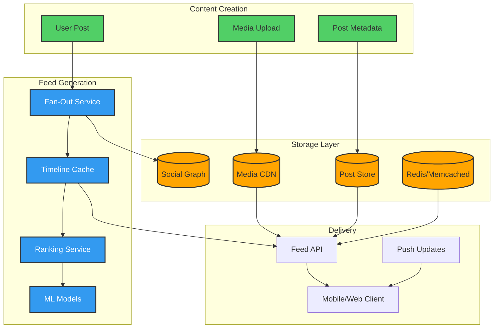

# Social Media Feed Architecture

> 🚧 This case study is planned for future development.

## Overview
This case study would examine how social media platforms like Facebook, Instagram, and LinkedIn build and deliver personalized feeds at scale. The challenge involves generating unique feeds for billions of users while balancing relevance, freshness, and system efficiency.

## Architecture Overview



## Feed Generation Strategies

### Pull Model (Read-Heavy)
```
User Request → Fetch Friends → Get Recent Posts → Rank → Return Feed
     │              │                │               │
     └──────────────┴────────────────┴───────────────┘
                    Computed on demand
```
**Pros**: Storage efficient, always fresh
**Cons**: High read latency, repeated computation

### Push Model (Write-Heavy)
```
New Post → Fan-out to Followers → Pre-compute Timelines → Cache
    │              │                        │                │
    └──────────────┴────────────────────────┴────────────────┘
                  Pre-computed at write time
```
**Pros**: Fast reads, pre-ranked
**Cons**: Storage intensive, celebrity problem

### Hybrid Model (Best of Both)
```
┌─────────────────────────────────────────┐
│  Push for Regular Users (< 10k friends) │
│  Pull for Celebrities (> 10k friends)    │
│  Async updates for inactive users        │
└─────────────────────────────────────────┘
```

## Key Technical Challenges

### 1. Scale Metrics
| Metric | Facebook | Instagram | LinkedIn |
|--------|----------|-----------|----------|
| Daily Active Users | 2B+ | 1B+ | 300M+ |
| Posts per day | 300M+ | 100M+ | 20M+ |
| Average friends/follows | 338 | 150 | 400 |
| Feed requests/sec | 10M+ | 5M+ | 1M+ |

### 2. Ranking Factors
```
Relevance Score = Σ(
    Affinity × Weight₁ +        // User interaction history
    Edge Weight × Weight₂ +      // Content type preference  
    Time Decay × Weight₃ +       // Freshness factor
    Creator Score × Weight₄ +    // Content quality
    Diversity × Weight₅          // Avoid echo chambers
)
```

### 3. Infrastructure Components
- **Timeline Service**: Maintains pre-computed feeds
- **Ranking Service**: ML-based content scoring
- **Fan-out Service**: Distributes posts to timelines
- **Edge Cache**: Geographic distribution
- **Notification Service**: Real-time updates

## Related Case Studies
- [Twitter Timeline](./twitter-timeline.md) - Twitter's approach to timeline generation
<!-- TODO: Add news feed case study -->
- [Notification System](./notification-system.md) - Real-time updates

## External Resources
- Facebook's News Feed ranking algorithm papers
- Instagram Engineering Blog
- LinkedIn's Feed Architecture