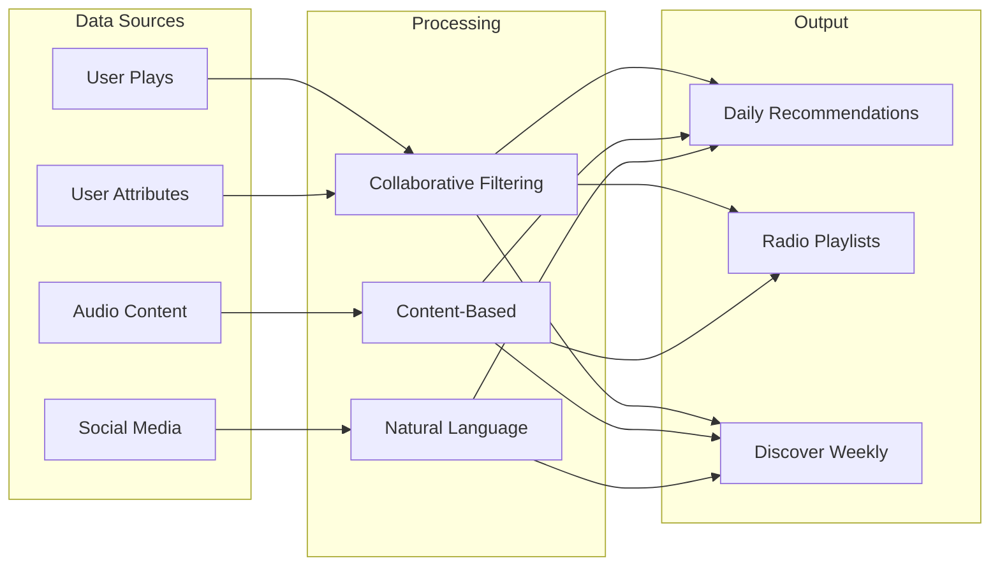
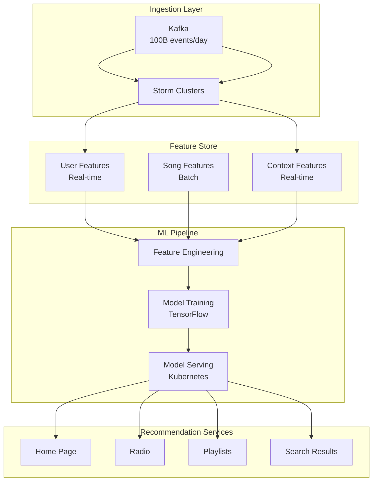
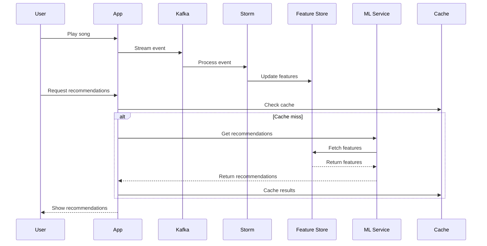

# 🎵 Spotify's Music Recommendation Engine

<div class="navigation-header">
<div class="breadcrumb">
[Home](/) → [Case Studies](/case-studies/) → **Spotify Recommendations**
</div>

<div class="case-study-nav">
**Previous**: [← Amazon DynamoDB](/case-studies/amazon-dynamo/) • **Next**: [PayPal Payments →](/case-studies/paypal-payments/) • [All Case Studies](/case-studies/)
</div>
</div>

**The Challenge**: Personalize music for 500M users with ML at scale

<div class="case-study">
<h3>📊 System Requirements</h3>

**Scale Constraints:**
- 500M+ monthly active users
- 100M+ songs in catalog
- 5B+ daily recommendations
- 30B+ monthly playlist starts
- <100ms recommendation latency

**Business Context:**
- User retention directly tied to personalization
- 40% of listening via algorithmic playlists
- Competition from Apple, Amazon, YouTube
- Artist discovery critical for ecosystem
</div>

## 🏗️ Architecture Evolution

### Phase 1: Collaborative Filtering (2008-2012)

```
User Plays → Daily Batch Job → Matrix Factorization → Static Recommendations
```

**Limitations:**
- 24-hour update cycle
- Cold start problem for new songs
- No context awareness (time, location, device)

### Phase 2: Hybrid Approach (2012-2016)



**Key Innovation: Discover Weekly**
- Combines multiple signals
- Refreshes every Monday
- 2.3B+ streams in first 2 years

### Phase 3: Real-Time ML Platform (2016-Present)



## 🔬 Technical Deep Dive

### Feature Engineering Architecture

**Three-Layer Feature System:**

1. **Raw Features** (10,000+)
   ```python
   user_features = {
       'play_count_1d': 45,
       'skip_rate_7d': 0.23,
       'genre_affinity_vector': [0.8, 0.2, ...],
       'listening_time_distribution': {...},
       'device_usage': {'mobile': 0.7, 'desktop': 0.3}
   }
   ```

2. **Derived Features** (1,000+)
   ```python
   derived_features = {
       'taste_diversity_score': 0.67,
       'discovery_propensity': 0.84,
       'session_intent': 'focus',
       'temporal_preference': 'morning_energetic'
   }
   ```

3. **Embedding Features** (100s)
   ```python
   embeddings = {
       'user_vector': np.array([...]),  # 256 dimensions
       'current_context': np.array([...]),  # 128 dimensions
       'session_embedding': np.array([...])  # 64 dimensions
   }
   ```

### ML Model Architecture

**Ensemble Approach:**

```python
class SpotifyRecommender:
    def __init__(self):
        self.models = {
            'collaborative': MatrixFactorizationModel(),
            'content': AudioDeepLearningModel(),
            'sequence': TransformerModel(),
            'contextual': GradientBoostingModel()
        }
        self.ensemble = WeightedEnsemble()
    
    def get_recommendations(self, user_id, context):
        # Get predictions from each model
        predictions = {}
        for name, model in self.models.items():
            predictions[name] = model.predict(user_id, context)
        
        # Ensemble with learned weights
        final_scores = self.ensemble.combine(predictions)
        
        # Apply business rules
        filtered = self.apply_business_rules(final_scores)
        
        # Diversity injection
        diversified = self.diversity_algorithm(filtered)
        
        return diversified[:100]  # Top 100 recommendations
```

### Real-Time Feature Pipeline



## 📊 Axiom Application

### Axiom 2: State Distribution
**Challenge**: User taste profiles across 500M users

**Solution**: Sharded feature store
```
Sharding Strategy:
- User features: Sharded by user_id % 1000
- Song features: Replicated (read-heavy)
- Collaborative data: Sharded by (user_id, item_id)

Storage:
- Hot features: Redis (30TB)
- Warm features: Cassandra (500TB)
- Cold features: HDFS (10PB)
```

### Axiom 5: Intelligence at Scale
**Challenge**: Train models on billions of interactions

**ML Infrastructure**:
```
Training Pipeline:
1. Data Lake (S3) → 30-day rolling window
2. Spark clusters → Feature extraction
3. TensorFlow → Distributed training
4. Model versioning → A/B testing
5. Gradual rollout → Monitor metrics

Scale:
- 100B training examples
- 10K model experiments/month
- 50 production models
- 1M predictions/second
```

### Axiom 1: Latency Constraints
**Challenge**: Real-time recommendations under 100ms

**Optimization Stack**:
```
Latency Budget (100ms):
- Network RTT: 20ms
- Feature fetch: 30ms
- Model inference: 40ms
- Business logic: 10ms

Optimizations:
1. Pre-computed embeddings
2. Model quantization (32-bit → 8-bit)
3. Edge caching (CloudFront)
4. Approximate algorithms
```

## 💡 Key Innovations

### 1. Audio Understanding at Scale

**Deep Learning Pipeline**:
```python
class AudioFeatureExtractor:
    def extract_features(self, audio_file):
        # Mel-spectrogram analysis
        spectrogram = self.compute_mel_spectrogram(audio_file)
        
        # CNN for audio features
        audio_embeddings = self.audio_cnn(spectrogram)
        
        # Extract high-level features
        features = {
            'tempo': self.tempo_estimator(spectrogram),
            'key': self.key_detector(audio_embeddings),
            'mood_vector': self.mood_classifier(audio_embeddings),
            'energy': self.energy_analyzer(spectrogram),
            'acousticness': self.acoustic_detector(audio_embeddings)
        }
        
        return features
```

### 2. Contextual Bandits for Exploration

**Balancing Exploration vs Exploitation**:
```python
class ContextualBandit:
    def select_recommendation(self, user, context, candidates):
        if random.random() < self.epsilon:
            # Exploration: try new content
            return self.explore_new_content(candidates)
        else:
            # Exploitation: use learned preferences
            return self.exploit_known_preferences(user, candidates)
    
    def update_policy(self, user, item, reward):
        # Thompson sampling update
        self.success_counts[user][item] += reward
        self.trial_counts[user][item] += 1
```

### 3. Session-Based Recommendations

**Understanding User Intent**:
```
Session Patterns:
- Morning Commute → Energetic, familiar
- Work Focus → Instrumental, consistent
- Evening Wind-down → Calm, discovery
- Party Mode → Popular, high-energy

Detection:
- Time of day
- Device type
- Skip behavior
- Playlist context
```

## 📈 Production Metrics

### System Performance (2023)
- **Recommendations Served**: 5B+ daily
- **Model Inference**: 1M+ per second
- **Feature Updates**: Real-time for 80% of signals
- **Cache Hit Rate**: 85% for popular content

### Business Impact
- **Stream Time**: +30% with personalization
- **Discovery**: 16B artist discoveries via algorithmic playlists
- **Retention**: 25% higher for users engaging with recommendations
- **Revenue**: 40% of streams from algorithmic playlists

### Infrastructure Scale
- **Compute**: 50,000+ cores for ML training
- **Storage**: 10PB+ in data lake
- **Models**: 50+ in production
- **Experiments**: 1,000+ A/B tests monthly

## 🎓 Lessons Learned

### What Worked Well
1. **Hybrid approach**: Combining collaborative + content + contextual
2. **Feature store**: Centralized feature management
3. **Experimentation platform**: Rapid A/B testing
4. **Real-time pipeline**: Fresh recommendations

### What Didn't Work
1. **Pure collaborative filtering**: Cold start problem
2. **Complex models everywhere**: Inference latency
3. **Ignoring context**: Poor morning recommendations
4. **Over-personalization**: Filter bubble effects

### Key Takeaways
- **Start simple**: Basic collaborative filtering goes far
- **Context matters**: Time, location, device are crucial
- **Diversity is key**: Prevent recommendation fatigue
- **Monitor user satisfaction**: Not just click-through rates

## 🔗 References & Deep Dives

### Technical Papers
- [Spotify's Discover Weekly: How machine learning finds your new music](https://engineering.atspotify.com/2015/11/discover-weekly/)
- [The Echo Nest: How Spotify Understands Music](http://static.echonest.com/enspex/)
- [Scaling ML at Spotify](https://engineering.atspotify.com/ml-at-spotify/)

### Related Patterns
- Feature Store Architecture (ML feature management)
- Real-time ML Pipeline (streaming inference)
- A/B Testing at Scale (experimentation framework)
- Recommendation Systems (collaborative filtering)

### Similar Systems
- [Netflix Recommendations](https://research.netflix.com/research-area/recommendations)
- [YouTube's Algorithm](https://research.google/pubs/pub45530/)
- [Amazon Personalization](https://aws.amazon.com/personalize/)

---

<div class="navigation-footer">
<div class="case-study-nav">
**Previous**: [← Amazon DynamoDB](/case-studies/amazon-dynamo/)
**Next**: [PayPal Payment Processing →](/case-studies/paypal-payments/)

**Return to**: [All Case Studies](/case-studies/) • [Home](/)
</div>
</div>

---

*"At Spotify's scale, every user is unique, but patterns in human behavior create the foundation for personalization."*