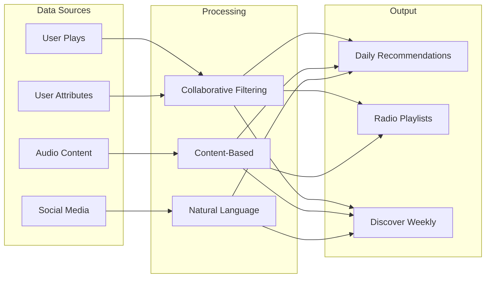
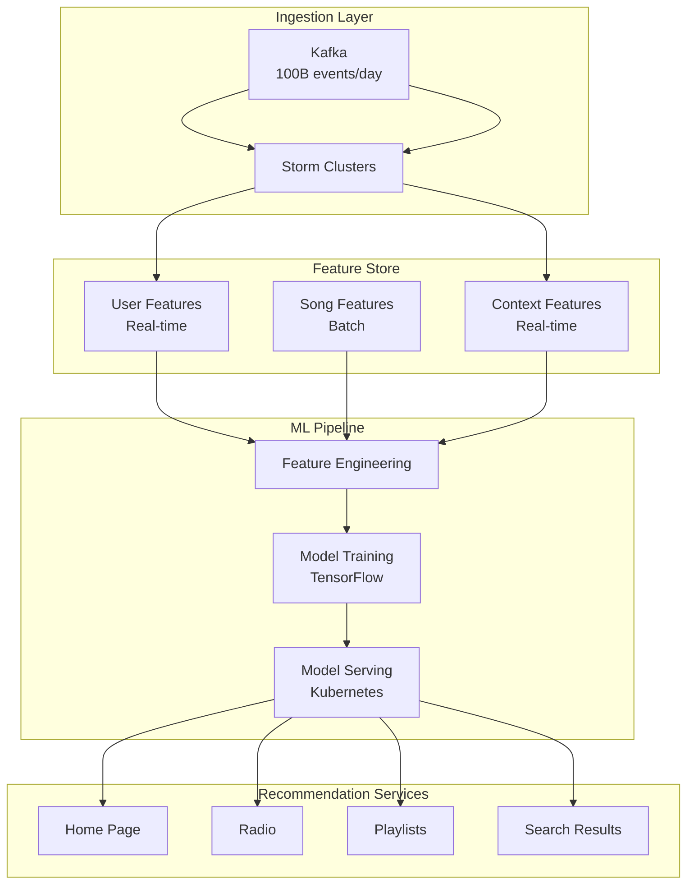
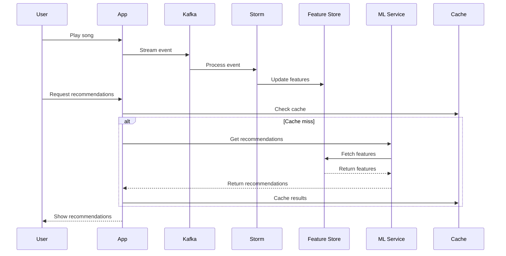
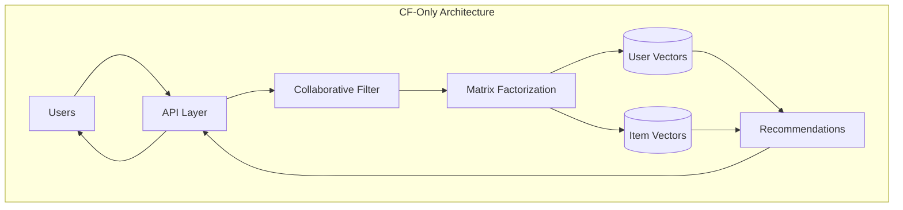
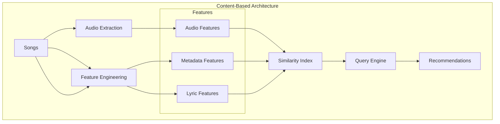
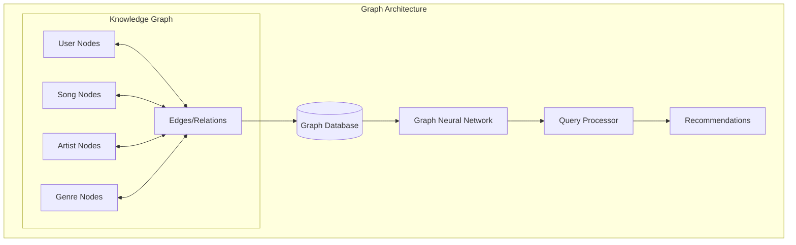
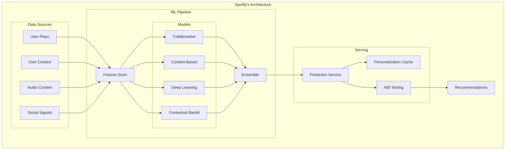

<!-- Navigation -->
[Home](../index.md) → [Case Studies](index.md) → **Spotify's Music Recommendation Engine**

# 🎵 Spotify's Music Recommendation Engine

**The Challenge**: Personalize music for 500M users with ML at scale

## 🏗️ Architecture Evolution

### Phase 1: Collaborative Filtering (2008-2012)

```text
User Plays → Daily Batch Job → Matrix Factorization → Static Recommendations
```

**Limitations:**
- 24-hour update cycle
- Cold start problem for new songs
- No context awareness (time, location, device)

### Phase 2: Hybrid Approach (2012-2016)



**Key Innovation: Discover Weekly**
- Combines multiple signals
- Refreshes every Monday
- 2.3B+ streams in first 2 years

### Phase 3: Real-Time ML Platform (2016-Present)



## 🔬 Technical Deep Dive

### Feature Engineering Architecture

**Three-Layer Feature System:**

1. **Raw Features** (10,000+)
   ```python
   user_features = {
       'play_count_1d': 45,
       'skip_rate_7d': 0.23,
       'genre_affinity_vector': [0.8, 0.2, ...],
       'listening_time_distribution': {...},
       'device_usage': {'mobile': 0.7, 'desktop': 0.3}
   }
   ```

2. **Derived Features** (1,000+)
   ```python
   derived_features = {
       'taste_diversity_score': 0.67,
       'discovery_propensity': 0.84,
       'session_intent': 'focus',
       'temporal_preference': 'morning_energetic'
   }
   ```

3. **Embedding Features** (100s)
   ```python
   embeddings = {
       'user_vector': np.array([...]),  # 256 dimensions
       'current_context': np.array([...]),  # 128 dimensions
       'session_embedding': np.array([...])  # 64 dimensions
   }
   ```

### ML Model Architecture

**Ensemble Approach:**

```python
class SpotifyRecommender:
    def __init__(self):
        self.models = {
            'collaborative': MatrixFactorizationModel(),
            'content': AudioDeepLearningModel(),
            'sequence': TransformerModel(),
            'contextual': GradientBoostingModel()
        }
        self.ensemble = WeightedEnsemble()

    def get_recommendations(self, user_id, context):
        # Get predictions from each model
        predictions = {}
        for name, model in self.models.items():
            predictions[name] = model.predict(user_id, context)

        # Ensemble with learned weights
        final_scores = self.ensemble.combine(predictions)

        # Apply business rules
        filtered = self.apply_business_rules(final_scores)

        # Diversity injection
        diversified = self.diversity_algorithm(filtered)

        return diversified[:100]  # Top 100 recommendations
```bash
### Real-Time Feature Pipeline



## 📊 Complete Axiom Analysis

### Comprehensive Axiom Mapping Table

| Design Decision | Axiom 1: Latency | Axiom 2: Capacity | Axiom 3: Failure | Axiom 4: Concurrency | Axiom 5: Coordination | Axiom 6: Observability | Axiom 7: Human Interface | Axiom 8: Economics |
|-----------------|------------------|-------------------|------------------|----------------------|----------------------|------------------------|--------------------------|-------------------|
| **Feature Store** | Pre-computed features <10ms | Distributed storage scales | Replicated for availability | Lock-free reads | Eventually consistent updates | Feature freshness metrics | Centralized feature catalog | Reusable features reduce compute |
| **Model Quantization** | 32-bit → 8-bit reduces inference 75% | 4x more models per server | Graceful accuracy degradation | Parallel model serving | No coordination for inference | Model performance tracking | Transparent to users | 75% less infrastructure |
| **Ensemble Learning** | Parallel model execution | Independent model scaling | Single model failure OK | Concurrent predictions | Weighted voting system | Per-model metrics | Explainable recommendations | Specialized models cheaper |
| **Edge Caching** | CDN serves <20ms globally | Cache scales with users | Cache miss doesn't fail | Read-through pattern | TTL-based consistency | Cache hit rate monitoring | Consistent experience | 80% backend reduction |
| **Session Context** | Real-time feature updates | Lightweight session state | Session recovery from events | Per-user isolation | No shared state | Session analytics | Context-aware UI | Efficient personalization |
| **Batch + Stream Hybrid** | Stream for real-time, batch for ML | Separate scaling strategies | Independent failure domains | Different consistency models | Coordinated through Kafka | Dual pipeline monitoring | Fresh + stable recommendations | Optimize per workload |
| **Contextual Bandits** | Fast exploration decisions | Scales with user base | Fails safe to exploitation | Per-user state | No global coordination | Exploration metrics | Discover new content | Balances revenue/discovery |
| **Microservices** | Service-level optimization | Independent scaling | Fault isolation | Service autonomy | API contracts only | Distributed tracing | Clean API boundaries | Per-service cost tracking |
| **A/B Testing Platform** | Minimal overhead | Scales to millions | Experiment isolation | Parallel experiments | Statistical significance | Experiment dashboards | Data-driven decisions | ROI measurement |

### Detailed Axiom Application

### Axiom 2: State Distribution
**Challenge**: User taste profiles across 500M users

**Solution**: Sharded feature store
```
Sharding Strategy:
- User features: Sharded by user_id % 1000
- Song features: Replicated (read-heavy)
- Collaborative data: Sharded by (user_id, item_id)

Storage:
- Hot features: Redis (30TB)
- Warm features: Cassandra (500TB)
- Cold features: HDFS (10PB)
```bash
### Axiom 5: Intelligence at Scale
**Challenge**: Train models on billions of interactions

**ML Infrastructure**:
```
Training Pipeline:
1. Data Lake (S3) → 30-day rolling window
2. Spark clusters → Feature extraction
3. TensorFlow → Distributed training
4. Model versioning → A/B testing
5. Gradual rollout → Monitor metrics

Scale:
- 100B training examples
- 10K model experiments/month
- 50 production models
- 1M predictions/second
```bash
### Axiom 1: Latency Constraints
**Challenge**: Real-time recommendations under 100ms

**Optimization Stack**:
```
Latency Budget (100ms):
- Network RTT: 20ms
- Feature fetch: 30ms
- Model inference: 40ms
- Business logic: 10ms

Optimizations:
1. Pre-computed embeddings
2. Model quantization (32-bit → 8-bit)
3. Edge caching (CloudFront)
4. Approximate algorithms
```bash
## 💡 Key Innovations

### 1. Audio Understanding at Scale

**Deep Learning Pipeline**:
```python
class AudioFeatureExtractor:
    def extract_features(self, audio_file):
        # Mel-spectrogram analysis
        spectrogram = self.compute_mel_spectrogram(audio_file)

        # CNN for audio features
        audio_embeddings = self.audio_cnn(spectrogram)

        # Extract high-level features
        features = {
            'tempo': self.tempo_estimator(spectrogram),
            'key': self.key_detector(audio_embeddings),
            'mood_vector': self.mood_classifier(audio_embeddings),
            'energy': self.energy_analyzer(spectrogram),
            'acousticness': self.acoustic_detector(audio_embeddings)
        }

        return features
```bash
### 2. Contextual Bandits for Exploration

**Balancing Exploration vs Exploitation**:
```python
class ContextualBandit:
    def select_recommendation(self, user, context, candidates):
        if random.random() < self.epsilon:
            # Exploration: try new content
            return self.explore_new_content(candidates)
        else:
            # Exploitation: use learned preferences
            return self.exploit_known_preferences(user, candidates)

    def update_policy(self, user, item, reward):
        # Thompson sampling update
        self.success_counts[user][item] += reward
        self.trial_counts[user][item] += 1
```bash
### 3. Session-Based Recommendations

**Understanding User Intent**:
```
Session Patterns:
- Morning Commute → Energetic, familiar
- Work Focus → Instrumental, consistent
- Evening Wind-down → Calm, discovery
- Party Mode → Popular, high-energy

Detection:
- Time of day
- Device type
- Skip behavior
- Playlist context
```

## 🏛️ Architecture Alternatives

### Alternative 1: Pure Collaborative Filtering



### Alternative 2: Content-Based System



### Alternative 3: Deep Learning Only

```mermaid
graph TB
    subgraph "DL-Only Architecture"
        U[User History]
        
        subgraph "Neural Network"
            E[Embedding Layer]
            T[Transformer Blocks]
            A[Attention Mechanism]
            O[Output Layer]
        end
        
        GPU[GPU Clusters]
        MS[Model Server]
        R[Recommendations]
    end
    
    U --> E --> T
    T --> A --> T
    T --> O
    O --> R
    
    Neural Network --> GPU
    GPU --> MS
    MS --> R
```

### Alternative 4: Graph-Based Recommendation



### Alternative 5: Spotify's Hybrid Architecture



## 📊 Architecture Trade-off Analysis

### Comprehensive Comparison Matrix

| Aspect | Pure CF | Content-Based | Deep Learning | Graph-Based | Spotify Hybrid |
|--------|---------|---------------|---------------|-------------|----------------|
| **Cold Start Problem** | ❌ Severe | ✅ None | ⚠️ Moderate | ⚠️ Moderate | ✅ Handled |
| **Recommendation Quality** | ⚠️ Good for popular | ⚠️ Limited discovery | ✅ Excellent | ✅ Very good | ✅ Best overall |
| **Scalability** | ✅ Matrix ops scale | ✅ Precompute features | ❌ GPU intensive | ❌ Graph queries | ✅ Distributed |
| **Real-time Updates** | ❌ Batch only | ⚠️ Feature lag | ❌ Training lag | ⚠️ Graph updates | ✅ Stream + batch |
| **Explainability** | ⚠️ "Users like you" | ✅ Feature-based | ❌ Black box | ✅ Path-based | ✅ Multiple signals |
| **Infrastructure Cost** | ✅ Low | ✅ Moderate | ❌ Very high | ❌ High | ⚠️ Moderate |
| **Development Complexity** | ✅ Simple | ✅ Simple | ❌ Complex | ❌ Complex | ❌ Very complex |
| **Personalization Depth** | ⚠️ Behavioral only | ❌ Content only | ✅ Learned features | ✅ Rich relations | ✅ All signals |

### Decision Factors by Use Case

| Use Case | Best Architecture | Rationale |
|----------|-------------------|-----------|
| **New Music Platform** | Content-Based | No user history available |
| **Niche Genre Service** | Graph-Based | Capture complex relationships |
| **Social Music App** | Pure CF | Leverage social signals |
| **Premium Personalization** | Deep Learning | Maximum accuracy |
| **Global Scale Platform** | Spotify Hybrid | Balance all trade-offs |
| **Podcast Recommendations** | Content + CF | Different content type |
| **Live Radio** | Contextual Bandits | Real-time adaptation |
| **Music Discovery** | Graph + DL | Exploration focus |

### Cost-Benefit Analysis

| Architecture | Initial Cost | Operational Cost | Recommendation Quality | Time to Market |
|--------------|--------------|------------------|----------------------|----------------|
| Pure CF | 💵 | 💵 | ⭐⭐⭐ | 1 month |
| Content-Based | 💵💵 | 💵 | ⭐⭐ | 2 months |
| Deep Learning | 💵💵💵💵 | 💵💵💵💵 | ⭐⭐⭐⭐⭐ | 6+ months |
| Graph-Based | 💵💵💵 | 💵💵💵 | ⭐⭐⭐⭐ | 4 months |
| Spotify Hybrid | 💵💵💵💵💵 | 💵💵💵 | ⭐⭐⭐⭐⭐ | 12+ months |

## 📈 Production Metrics

### System Performance (2023)
- **Recommendations Served**: 5B+ daily
- **Model Inference**: 1M+ per second
- **Feature Updates**: Real-time for 80% of signals
- **Cache Hit Rate**: 85% for popular content

### Business Impact
- **Stream Time**: +30% with personalization
- **Discovery**: 16B artist discoveries via algorithmic playlists
- **Retention**: 25% higher for users engaging with recommendations
- **Revenue**: 40% of streams from algorithmic playlists

### Infrastructure Scale
- **Compute**: 50,000+ cores for ML training
- **Storage**: 10PB+ in data lake
- **Models**: 50+ in production
- **Experiments**: 1,000+ A/B tests monthly

## 🎓 Lessons Learned

### What Worked Well
1. **Hybrid approach**: Combining collaborative + content + contextual
2. **Feature store**: Centralized feature management
3. **Experimentation platform**: Rapid A/B testing
4. **Real-time pipeline**: Fresh recommendations

### What Didn't Work
1. **Pure collaborative filtering**: Cold start problem
2. **Complex models everywhere**: Inference latency
3. **Ignoring context**: Poor morning recommendations
4. **Over-personalization**: Filter bubble effects

### Key Takeaways
- **Start simple**: Basic collaborative filtering goes far
- **Context matters**: Time, location, device are crucial
- **Diversity is key**: Prevent recommendation fatigue
- **Monitor user satisfaction**: Not just click-through rates

## 🔗 References & Deep Dives

### Technical Papers
- [Spotify's Discover Weekly: How machine learning finds your new music](https://engineering.atspotify.com/2015/11/discover-weekly/)
- [The Echo Nest: How Spotify Understands Music](http://static.echonest.com/enspex/)
- [Scaling ML at Spotify](https://engineering.atspotify.com/ml-at-spotify/)

### Related Patterns
- Feature Store Architecture (ML feature management)
- Real-time ML Pipeline (streaming inference)
- A/B Testing at Scale (experimentation framework)
- Recommendation Systems (collaborative filtering)

### Similar Systems
- [Netflix Recommendations](https://research.netflix.com/research-area/recommendations)
- [YouTube's Algorithm](https://research.google/pubs/pub45530/)
- [Amazon Personalization](https://aws.amazon.com/personalize/)

## 🔍 Related Concepts & Deep Dives

### 📚 Relevant Axioms (Part I)
- **[Axiom 1: Latency](../part1-axioms/axiom1-latency/index.md)** - 50ms budget for recommendation serving drives caching and pre-computation strategies
- **[Axiom 2: Finite Capacity](../part1-axioms/axiom2-capacity/index.md)** - GPU clusters for model training require careful resource scheduling
- **[Axiom 3: Failure is Normal](../part1-axioms/axiom3-failure/index.md)** - Fallback to popular playlists when recommendation service fails
- **[Axiom 4: Concurrency](../part1-axioms/axiom4-concurrency/index.md)** - Millions of concurrent users require lock-free serving infrastructure
- **[Axiom 5: Coordination](../part1-axioms/axiom5-coordination/index.md)** - Feature store synchronization across multiple data pipelines
- **[Axiom 6: Observability](../part1-axioms/axiom6-observability/index.md)** - A/B testing framework measures recommendation quality in real-time
- **[Axiom 7: Human Interface](../part1-axioms/axiom7-human/index.md)** - UI design balances algorithmic recommendations with user control
- **[Axiom 8: Economics](../part1-axioms/axiom8-economics/index.md)** - Recommendation quality directly impacts user retention and revenue

### 🏛️ Related Patterns (Part III)
- **[Event-Driven Architecture](../patterns/event-driven.md)** - User events (plays, skips, likes) flow through Kafka streams
- **[CQRS](../patterns/cqrs.md)** - Separate paths for collecting user signals vs serving recommendations
- **[Caching Strategies](../patterns/caching-strategies.md)** - Multi-level caches for popular recommendations and user preferences
- **[Circuit Breaker](../patterns/circuit-breaker.md)** - Graceful degradation when ML models fail
- **[Service Mesh](../patterns/service-mesh.md)** - Microservices architecture for different recommendation algorithms
- **[Load Balancing](../patterns/load-balancing.md)** - GPU load distribution for model inference
- **[Bulkhead](../patterns/bulkhead.md)** - Isolate experimental models from production traffic

### 📊 Quantitative Models
- **[Little's Law](../quantitative/littles-law.md)** - Model serving capacity: L = λW (concurrent requests = arrival rate × processing time)
- **[Amdahl's Law](../quantitative/amdahls-law.md)** - Parallelizing matrix operations for collaborative filtering
- **[Power Laws](../quantitative/power-laws.md)** - Long-tail content distribution affects recommendation strategy
- **[Information Theory](../quantitative/information-theory.md)** - Entropy measures for recommendation diversity

### 👥 Human Factors Considerations
- **[SRE Practices](../human-factors/sre-practices.md)** - ML model deployment requires specialized SRE workflows
- **[Observability Tools](../human-factors/observability-stacks.md)** - Real-time dashboards track recommendation performance metrics
- **[On-Call Culture](../human-factors/oncall-culture.md)** - Data scientists on-call for model quality issues
- **[Post-Mortem Culture](../human-factors/postmortem-culture.md)** - Learning from recommendation failures and filter bubbles

### 🔄 Similar Case Studies
- **[News Feed System](news-feed.md)** - Similar personalization challenges at scale
- **[YouTube's Video Platform](youtube.md)** - Video recommendations using similar hybrid approaches
- **[Rate Limiter Design](rate-limiter.md)** - API rate limiting for recommendation requests
- **[Amazon DynamoDB](amazon-dynamo.md)** - Storing user preferences and feature vectors at scale

---

---

*"At Spotify's scale, every user is unique, but patterns in human behavior create the foundation for personalization."*

---

**Previous**: [← Amazon DynamoDB](amazon-dynamo.md) | **Next**: [PayPal Payments →](paypal-payments.md)
