# Stock Exchange - System Design Case Study

## 1. Problem Statement

Design a high-frequency stock exchange system like NYSE, NASDAQ, or Binance that can:
- Process millions of orders per second with microsecond latency
- Maintain a fair and orderly market with price discovery
- Handle order matching, market data distribution, and settlement
- Ensure zero data loss and regulatory compliance
- Prevent market manipulation and ensure fairness
- Support multiple asset classes and order types

### Real-World Context
- **NYSE**: 2.4B+ average daily volume, handles 1M+ messages/second peak
- **NASDAQ**: Powers 90+ marketplaces in 50+ countries
- **CME Group**: 20M+ contracts traded daily, 99.99% uptime
- **Binance**: 1.2M+ orders/second capability, 90M+ users

## 2. Requirements Analysis

### Functional Requirements
1. **Order Management**
   - Limit orders, market orders, stop orders
   - Order modification and cancellation
   - Iceberg orders and hidden liquidity
   - Time-in-force options (IOC, FOK, GTC)
   - Order routing and smart order routing

2. **Matching Engine**
   - Price-time priority matching
   - Sub-microsecond latency
   - Multiple order books per symbol
   - Cross and auction matching
   - Self-trade prevention

3. **Market Data**
   - Real-time quotes and trades
   - Order book depth (Level 1, 2, 3)
   - Market statistics and indices
   - Historical data and replay
   - Multicast and unicast distribution

4. **Risk Management**
   - Pre-trade risk checks
   - Position limits
   - Circuit breakers
   - Kill switches
   - Margin calculations

5. **Settlement & Clearing**
   - T+2 settlement cycle
   - Netting and clearing
   - Corporate actions
   - Regulatory reporting
   - Member reconciliation

### Non-Functional Requirements
- **Throughput**: 10M+ orders/second
- **Latency**: <10 microseconds for order acknowledgment
- **Availability**: 99.999% uptime (5 minutes downtime/year)
- **Determinism**: Identical ordering of events
- **Fairness**: No unfair advantage to any participant
- **Compliance**: Full audit trail, regulatory reporting

### Axiom Mapping
- **Axiom 1 (Latency)**: Microsecond latency critical for fairness
- **Axiom 2 (Capacity)**: Finite order book depth and bandwidth
- **Axiom 3 (Failure)**: Zero tolerance for lost orders
- **Axiom 4 (Concurrency)**: Massive parallel order processing
- **Axiom 5 (Coordination)**: Deterministic event ordering
- **Axiom 6 (Observability)**: Complete audit trail required
- **Axiom 7 (Interface)**: FIX protocol and native APIs
- **Axiom 8 (Economics)**: Optimize for transaction costs

## 3. Architecture Evolution

### Stage 1: Basic Trading System (1K orders/sec)
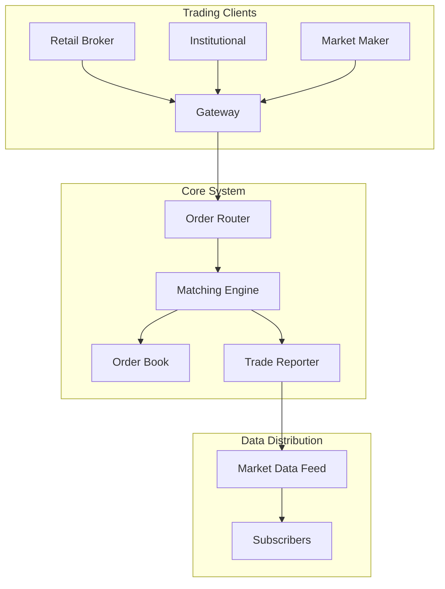

### Stage 2: Distributed Exchange (100K orders/sec)
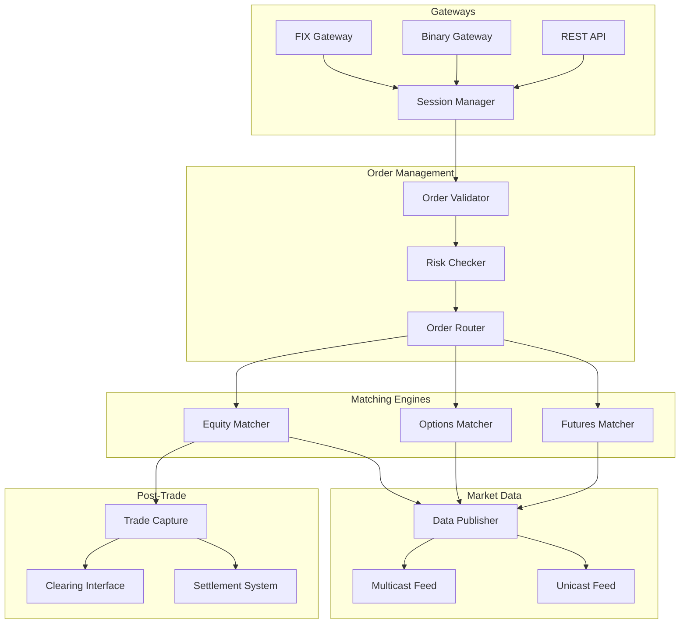

### Stage 3: Ultra-Low Latency Architecture (10M+ orders/sec)
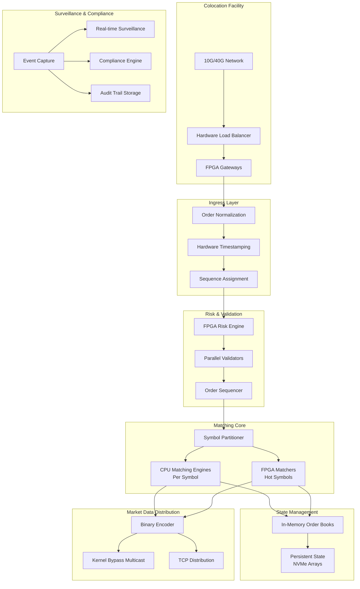

## 4. Detailed Component Design

### 4.1 Ultra-Low Latency Matching Engine
```cpp
#include <atomic>
#include <vector>
#include <deque>
#include <unordered_map>
#include <chrono>

class Order {
public:
    uint64_t orderId;
    uint64_t timestamp;
    char side;  // 'B' or 'S'
    uint32_t price;  // Price in cents
    uint32_t quantity;
    uint32_t remainingQuantity;
    uint32_t memberId;
    uint8_t orderType;  // LIMIT, MARKET, etc.
    uint8_t timeInForce;  // IOC, FOK, GTC, etc.
    
    Order() : remainingQuantity(quantity) {}
};

class OrderBook {
private:
    struct PriceLevel {
        uint32_t price;
        uint64_t totalVolume;
        std::deque<Order*> orders;
    };
    
    // Buy side - highest price first (max heap)
    std::vector<PriceLevel> buyLevels;
    // Sell side - lowest price first (min heap)
    std::vector<PriceLevel> sellLevels;
    
    // Order lookup for modifications/cancellations
    std::unordered_map<uint64_t, Order*> orderMap;
    
    // Lock-free queue for incoming orders
    alignas(64) std::atomic<uint64_t> sequenceNumber{0};
    
public:
    struct Trade {
        uint64_t buyOrderId;
        uint64_t sellOrderId;
        uint32_t price;
        uint32_t quantity;
        uint64_t timestamp;
    };
    
    // Process new order - returns trades
    std::vector<Trade> processOrder(Order* order) {
        std::vector<Trade> trades;
        
        // Assign sequence number atomically
        order->timestamp = sequenceNumber.fetch_add(1, std::memory_order_relaxed);
        
        if (order->orderType == OrderType::MARKET) {
            matchMarketOrder(order, trades);
        } else if (order->orderType == OrderType::LIMIT) {
            matchLimitOrder(order, trades);
        }
        
        return trades;
    }
    
private:
    void matchLimitOrder(Order* order, std::vector<Trade>& trades) {
        if (order->side == 'B') {
            // Match against sell orders
            auto it = sellLevels.begin();
            
            while (it != sellLevels.end() && 
                   order->remainingQuantity > 0 &&
                   order->price >= it->price) {
                
                matchOrdersAtLevel(order, it->orders, trades);
                
                if (it->orders.empty()) {
                    it = sellLevels.erase(it);
                } else {
                    ++it;
                }
            }
            
            // Add remaining to book
            if (order->remainingQuantity > 0) {
                insertBuyOrder(order);
            }
        } else {
            // Match against buy orders
            auto it = buyLevels.begin();
            
            while (it != buyLevels.end() && 
                   order->remainingQuantity > 0 &&
                   order->price <= it->price) {
                
                matchOrdersAtLevel(order, it->orders, trades);
                
                if (it->orders.empty()) {
                    it = buyLevels.erase(it);
                } else {
                    ++it;
                }
            }
            
            // Add remaining to book
            if (order->remainingQuantity > 0) {
                insertSellOrder(order);
            }
        }
    }
    
    void matchOrdersAtLevel(Order* aggressor, 
                           std::deque<Order*>& passiveOrders,
                           std::vector<Trade>& trades) {
        auto it = passiveOrders.begin();
        
        while (it != passiveOrders.end() && aggressor->remainingQuantity > 0) {
            Order* passive = *it;
            
            // Self-trade prevention
            if (aggressor->memberId == passive->memberId) {
                ++it;
                continue;
            }
            
            uint32_t tradeQty = std::min(aggressor->remainingQuantity, 
                                        passive->remainingQuantity);
            
            // Create trade
            Trade trade;
            trade.buyOrderId = (aggressor->side == 'B') ? 
                              aggressor->orderId : passive->orderId;
            trade.sellOrderId = (aggressor->side == 'S') ? 
                               aggressor->orderId : passive->orderId;
            trade.price = passive->price;  // Passive order price
            trade.quantity = tradeQty;
            trade.timestamp = getCurrentTimestamp();
            
            trades.push_back(trade);
            
            // Update quantities
            aggressor->remainingQuantity -= tradeQty;
            passive->remainingQuantity -= tradeQty;
            
            // Remove filled orders
            if (passive->remainingQuantity == 0) {
                orderMap.erase(passive->orderId);
                delete passive;
                it = passiveOrders.erase(it);
            } else {
                ++it;
            }
        }
    }
    
    // Use binary search for price level insertion
    void insertBuyOrder(Order* order) {
        auto it = std::lower_bound(
            buyLevels.begin(), 
            buyLevels.end(),
            order->price,
            [](const PriceLevel& level, uint32_t price) {
                return level.price > price;  // Descending order
            }
        );
        
        if (it != buyLevels.end() && it->price == order->price) {
            // Add to existing level
            it->orders.push_back(order);
            it->totalVolume += order->remainingQuantity;
        } else {
            // Create new level
            PriceLevel newLevel;
            newLevel.price = order->price;
            newLevel.totalVolume = order->remainingQuantity;
            newLevel.orders.push_back(order);
            buyLevels.insert(it, newLevel);
        }
        
        orderMap[order->orderId] = order;
    }
};
```

### 4.2 Market Data Distribution System
```python
import asyncio
import struct
from typing import List, Dict, Set
import socket
import mmap
from dataclasses import dataclass

@dataclass
class MarketDataUpdate:
    symbol: str
    update_type: str  # TRADE, QUOTE, IMBALANCE
    price: int
    quantity: int
    side: str
    timestamp: int
    sequence_number: int

class MarketDataPublisher:
    """High-performance market data distribution"""
    
    def __init__(self):
        self.multicast_socket = self._create_multicast_socket()
        self.tcp_subscribers: Dict[str, Set[socket.socket]] = {}
        self.sequence_number = 0
        self.conflation_buffer = ConflationBuffer()
        self.stats_calculator = MarketStatsCalculator()
        
    def _create_multicast_socket(self) -> socket.socket:
        """Create kernel-bypass multicast socket"""
        sock = socket.socket(socket.AF_INET, socket.SOCK_DGRAM, socket.IPPROTO_UDP)
        sock.setsockopt(socket.IPPROTO_IP, socket.IP_MULTICAST_TTL, 2)
        return sock
    
    async def publish_trade(self, symbol: str, price: int, 
                           quantity: int, buy_member: int, sell_member: int):
        """Publish trade to all feeds"""
        
        # Generate trade message
        trade_msg = self._encode_trade_message(
            symbol=symbol,
            price=price,
            quantity=quantity,
            buy_member=buy_member,
            sell_member=sell_member,
            timestamp=self._get_hardware_timestamp(),
            sequence=self._get_next_sequence()
        )
        
        # Publish to multicast (no lock, fire and forget)
        await self._publish_multicast(trade_msg)
        
        # Update statistics
        await self.stats_calculator.update_trade(symbol, price, quantity)
        
        # Publish to TCP subscribers (with conflation)
        await self._publish_tcp_with_conflation(symbol, trade_msg)
        
        # Update Level 1 quote
        await self._update_level1_quote(symbol, price)
    
    def _encode_trade_message(self, **kwargs) -> bytes:
        """Encode trade in binary format for speed"""
        # Message format:
        # [1 byte type][8 bytes timestamp][8 bytes sequence]
        # [8 bytes symbol][4 bytes price][4 bytes quantity]
        # [4 bytes buy_member][4 bytes sell_member]
        
        msg_type = 0x01  # TRADE
        
        # Pack into binary format
        return struct.pack(
            '!BQQ8sIIII',
            msg_type,
            kwargs['timestamp'],
            kwargs['sequence'],
            kwargs['symbol'].encode('ascii').ljust(8, b'\0'),
            kwargs['price'],
            kwargs['quantity'],
            kwargs['buy_member'],
            kwargs['sell_member']
        )
    
    async def publish_order_book_update(self, symbol: str, 
                                       side: str, 
                                       updates: List[Dict]):
        """Publish order book updates"""
        
        # Encode book update
        book_msg = self._encode_book_update(
            symbol=symbol,
            side=side,
            updates=updates,
            timestamp=self._get_hardware_timestamp(),
            sequence=self._get_next_sequence()
        )
        
        # Multicast immediately
        await self._publish_multicast(book_msg)
        
        # TCP with intelligent conflation
        if self.conflation_buffer.should_conflate(symbol):
            self.conflation_buffer.add_update(symbol, book_msg)
        else:
            await self._publish_tcp_immediate(symbol, book_msg)
    
    async def _publish_multicast(self, message: bytes):
        """Publish to multicast group with minimal latency"""
        
        # Add FEC (Forward Error Correction) header
        fec_message = self._add_fec_header(message)
        
        # Send to multicast group
        self.multicast_socket.sendto(
            fec_message,
            ('239.255.0.1', 30001)  # Market data multicast group
        )
    
    async def _publish_tcp_with_conflation(self, symbol: str, message: bytes):
        """Publish to TCP subscribers with conflation"""
        
        subscribers = self.tcp_subscribers.get(symbol, set())
        
        for subscriber in list(subscribers):
            try:
                # Check if subscriber is slow
                if self._is_slow_consumer(subscriber):
                    # Add to conflation buffer
                    self.conflation_buffer.add_for_subscriber(
                        subscriber,
                        symbol,
                        message
                    )
                else:
                    # Send immediately
                    subscriber.sendall(message)
                    
            except Exception as e:
                # Remove failed subscriber
                subscribers.discard(subscriber)
                logger.error(f"Removed failed subscriber: {e}")
```

### 4.3 Risk Management Engine
```python
class RiskManagementEngine:
    """Pre-trade and at-trade risk checks"""
    
    def __init__(self):
        self.position_tracker = PositionTracker()
        self.credit_manager = CreditManager()
        self.circuit_breaker = CircuitBreaker()
        self.rate_limiter = RateLimiter()
        
    async def check_pre_trade_risk(self, order: Order) -> RiskCheckResult:
        """Perform pre-trade risk checks"""
        
        # Check in parallel for speed
        checks = await asyncio.gather(
            self._check_credit_limit(order),
            self._check_position_limit(order),
            self._check_price_reasonability(order),
            self._check_rate_limit(order),
            self._check_restricted_list(order),
            return_exceptions=True
        )
        
        # Process results
        for check in checks:
            if isinstance(check, Exception):
                return RiskCheckResult(
                    passed=False,
                    reason=str(check),
                    check_time_us=self._get_elapsed_microseconds()
                )
            if not check.passed:
                return check
        
        return RiskCheckResult(
            passed=True,
            check_time_us=self._get_elapsed_microseconds()
        )
    
    async def _check_credit_limit(self, order: Order) -> RiskCheckResult:
        """Check member credit limits"""
        
        # Get current exposure
        current_exposure = await self.credit_manager.get_exposure(
            order.member_id
        )
        
        # Calculate order exposure
        order_exposure = self._calculate_order_exposure(order)
        
        # Get credit limit
        credit_limit = await self.credit_manager.get_limit(
            order.member_id
        )
        
        if current_exposure + order_exposure > credit_limit:
            return RiskCheckResult(
                passed=False,
                reason=f"Credit limit exceeded: {current_exposure + order_exposure} > {credit_limit}"
            )
        
        return RiskCheckResult(passed=True)
    
    async def _check_position_limit(self, order: Order) -> RiskCheckResult:
        """Check position concentration limits"""
        
        # Get current position
        current_position = await self.position_tracker.get_position(
            member_id=order.member_id,
            symbol=order.symbol
        )
        
        # Calculate new position
        position_change = order.quantity if order.side == 'B' else -order.quantity
        new_position = current_position + position_change
        
        # Check limits
        position_limit = self._get_position_limit(order.symbol, order.member_id)
        
        if abs(new_position) > position_limit:
            return RiskCheckResult(
                passed=False,
                reason=f"Position limit exceeded: {abs(new_position)} > {position_limit}"
            )
        
        # Check market-wide position limits
        market_impact = await self._check_market_impact(order)
        if market_impact > 0.05:  # 5% of market
            return RiskCheckResult(
                passed=False,
                reason=f"Market impact too high: {market_impact:.2%}"
            )
        
        return RiskCheckResult(passed=True)
    
    async def handle_circuit_breaker(self, symbol: str, 
                                    current_price: float,
                                    reference_price: float):
        """Handle circuit breaker logic"""
        
        price_change = abs(current_price - reference_price) / reference_price
        
        # Level 1: 7% - 15 minute halt
        if price_change >= 0.07 and price_change < 0.13:
            await self.circuit_breaker.trigger_halt(
                symbol=symbol,
                level=1,
                duration_minutes=15,
                reason=f"Level 1 circuit breaker: {price_change:.1%} move"
            )
            
        # Level 2: 13% - 15 minute halt
        elif price_change >= 0.13 and price_change < 0.20:
            await self.circuit_breaker.trigger_halt(
                symbol=symbol,
                level=2,
                duration_minutes=15,
                reason=f"Level 2 circuit breaker: {price_change:.1%} move"
            )
            
        # Level 3: 20% - close for day
        elif price_change >= 0.20:
            await self.circuit_breaker.trigger_halt(
                symbol=symbol,
                level=3,
                duration_minutes=None,  # Rest of day
                reason=f"Level 3 circuit breaker: {price_change:.1%} move"
            )
```

### 4.4 Settlement and Clearing System
```python
class SettlementEngine:
    """Handles trade settlement and clearing"""
    
    def __init__(self):
        self.clearing_house = ClearingHouseInterface()
        self.position_manager = PositionManager()
        self.margin_calculator = MarginCalculator()
        self.netting_engine = NettingEngine()
        
    async def process_end_of_day_settlement(self, trade_date: date):
        """Process T+2 settlement cycle"""
        
        # Get all trades for the day
        trades = await self._get_trades_for_date(trade_date)
        
        # Group by member and symbol
        member_positions = self._calculate_member_positions(trades)
        
        # Apply netting
        netted_positions = await self.netting_engine.apply_netting(
            member_positions
        )
        
        # Calculate settlement obligations
        obligations = []
        
        for member_id, positions in netted_positions.items():
            for symbol, position in positions.items():
                obligation = SettlementObligation(
                    member_id=member_id,
                    symbol=symbol,
                    quantity=position.net_quantity,
                    amount=position.net_amount,
                    settlement_date=trade_date + timedelta(days=2),
                    trade_date=trade_date
                )
                
                obligations.append(obligation)
        
        # Send to clearing house
        clearing_result = await self.clearing_house.submit_obligations(
            obligations
        )
        
        # Update member positions
        await self._update_member_positions(netted_positions)
        
        # Calculate margin requirements
        await self._calculate_margin_requirements(member_positions)
        
        return SettlementResult(
            trade_date=trade_date,
            total_trades=len(trades),
            obligations_count=len(obligations),
            clearing_reference=clearing_result.reference_id
        )
    
    async def _calculate_margin_requirements(self, positions: Dict):
        """Calculate margin for all members"""
        
        margin_calls = []
        
        for member_id, member_positions in positions.items():
            # Calculate portfolio margin
            portfolio_margin = await self.margin_calculator.calculate_portfolio_margin(
                positions=member_positions,
                market_data=await self._get_current_market_data()
            )
            
            # Get current margin
            current_margin = await self._get_member_margin(member_id)
            
            # Check if margin call needed
            if current_margin < portfolio_margin.required_margin:
                margin_call = MarginCall(
                    member_id=member_id,
                    current_margin=current_margin,
                    required_margin=portfolio_margin.required_margin,
                    call_amount=portfolio_margin.required_margin - current_margin,
                    due_time=datetime.utcnow() + timedelta(hours=1)
                )
                
                margin_calls.append(margin_call)
                
                # Send margin call
                await self._send_margin_call(margin_call)
        
        return margin_calls
    
    async def handle_corporate_action(self, action: CorporateAction):
        """Handle corporate actions like splits, dividends"""
        
        if action.type == 'STOCK_SPLIT':
            await self._process_stock_split(action)
        elif action.type == 'DIVIDEND':
            await self._process_dividend(action)
        elif action.type == 'MERGER':
            await self._process_merger(action)
            
    async def _process_stock_split(self, split: CorporateAction):
        """Process stock split adjustments"""
        
        # Get all positions for the symbol
        positions = await self.position_manager.get_positions_by_symbol(
            split.symbol
        )
        
        # Adjust positions
        for position in positions:
            new_quantity = position.quantity * split.ratio
            new_average_price = position.average_price / split.ratio
            
            await self.position_manager.update_position(
                member_id=position.member_id,
                symbol=position.symbol,
                quantity=new_quantity,
                average_price=new_average_price,
                adjustment_reason=f"Stock split {split.ratio}:1"
            )
        
        # Adjust open orders
        open_orders = await self._get_open_orders(split.symbol)
        
        for order in open_orders:
            new_quantity = order.quantity * split.ratio
            new_price = order.price / split.ratio
            
            await self._adjust_order(
                order_id=order.order_id,
                new_quantity=new_quantity,
                new_price=new_price,
                reason=f"Stock split adjustment"
            )
```

### 4.5 Market Surveillance System
```python
class MarketSurveillanceEngine:
    """Real-time market surveillance and compliance"""
    
    def __init__(self):
        self.pattern_detector = PatternDetector()
        self.alert_manager = AlertManager()
        self.ml_models = self._load_ml_models()
        self.compliance_rules = ComplianceRuleEngine()
        
    async def analyze_trading_activity(self, events: List[TradingEvent]):
        """Analyze trading for suspicious patterns"""
        
        # Real-time pattern detection
        patterns = await asyncio.gather(
            self._detect_layering(events),
            self._detect_spoofing(events),
            self._detect_wash_trading(events),
            self._detect_front_running(events),
            self._detect_insider_trading(events),
            self._detect_market_manipulation(events)
        )
        
        # Process detected patterns
        alerts = []
        for pattern_list in patterns:
            for pattern in pattern_list:
                if pattern.confidence > 0.8:
                    alert = await self._create_alert(pattern)
                    alerts.append(alert)
        
        # Send alerts
        for alert in alerts:
            await self.alert_manager.send_alert(alert)
        
        return alerts
    
    async def _detect_spoofing(self, events: List[TradingEvent]) -> List[Pattern]:
        """Detect spoofing behavior"""
        
        patterns = []
        
        # Group events by member
        member_events = self._group_by_member(events)
        
        for member_id, member_activity in member_events.items():
            # Look for large orders followed by cancellations
            order_sequences = self._extract_order_sequences(member_activity)
            
            for sequence in order_sequences:
                if self._is_spoofing_pattern(sequence):
                    pattern = Pattern(
                        type='SPOOFING',
                        member_id=member_id,
                        confidence=self._calculate_spoofing_confidence(sequence),
                        evidence=sequence,
                        timestamp=datetime.utcnow()
                    )
                    patterns.append(pattern)
        
        return patterns
    
    def _is_spoofing_pattern(self, sequence: List[TradingEvent]) -> bool:
        """Check if sequence matches spoofing pattern"""
        
        # Spoofing characteristics:
        # 1. Large order placed away from market
        # 2. Smaller order placed on opposite side
        # 3. Large order cancelled after small order fills
        
        large_orders = [e for e in sequence 
                       if e.type == 'ORDER_NEW' and e.quantity > 10000]
        
        if not large_orders:
            return False
        
        for large_order in large_orders:
            # Check if cancelled within short time
            cancellation = next(
                (e for e in sequence 
                 if e.type == 'ORDER_CANCEL' and 
                 e.order_id == large_order.order_id and
                 (e.timestamp - large_order.timestamp).total_seconds() < 5),
                None
            )
            
            if cancellation:
                # Check for opposite side activity
                opposite_trades = [
                    e for e in sequence
                    if e.type == 'TRADE' and
                    e.side != large_order.side and
                    large_order.timestamp < e.timestamp < cancellation.timestamp
                ]
                
                if opposite_trades:
                    return True
        
        return False
    
    async def _detect_wash_trading(self, events: List[TradingEvent]) -> List[Pattern]:
        """Detect wash trading (self-trading)"""
        
        patterns = []
        
        # Look for trades between related accounts
        trades = [e for e in events if e.type == 'TRADE']
        
        # Group by symbol and time window
        symbol_trades = self._group_by_symbol(trades)
        
        for symbol, trade_list in symbol_trades.items():
            # Use ML model to detect suspicious patterns
            features = self._extract_wash_trade_features(trade_list)
            
            if features is not None:
                prediction = self.ml_models['wash_trading'].predict_proba(
                    features.reshape(1, -1)
                )[0][1]
                
                if prediction > 0.7:
                    pattern = Pattern(
                        type='WASH_TRADING',
                        symbol=symbol,
                        confidence=prediction,
                        evidence=trade_list,
                        timestamp=datetime.utcnow()
                    )
                    patterns.append(pattern)
        
        return patterns
```

## 5. Advanced Features

### 5.1 Smart Order Routing
```python
class SmartOrderRouter:
    """Routes orders to optimal execution venues"""
    
    def __init__(self):
        self.venue_connectors = VenueConnectorManager()
        self.execution_analytics = ExecutionAnalytics()
        self.cost_model = TradingCostModel()
        
    async def route_order(self, order: Order) -> RoutingDecision:
        """Determine optimal routing for order"""
        
        # Get current market state across venues
        market_state = await self._get_consolidated_market_state(
            order.symbol
        )
        
        # Calculate optimal routing
        if order.size > self._get_block_threshold(order.symbol):
            # Large order - use algorithmic execution
            return await self._route_algorithmic_order(order, market_state)
        else:
            # Regular order - find best execution
            return await self._route_regular_order(order, market_state)
    
    async def _route_algorithmic_order(self, order: Order, 
                                      market_state: MarketState) -> RoutingDecision:
        """Route large order using algorithms"""
        
        # Select algorithm based on order characteristics
        if order.urgency == 'HIGH':
            algorithm = 'AGGRESSIVE_SWEEP'
        elif order.benchmark == 'VWAP':
            algorithm = 'VWAP'
        elif order.benchmark == 'IMPLEMENTATION_SHORTFALL':
            algorithm = 'IS'
        else:
            algorithm = 'ICEBERG'
        
        # Calculate child order parameters
        child_orders = await self._calculate_child_orders(
            parent_order=order,
            algorithm=algorithm,
            market_state=market_state
        )
        
        # Create routing plan
        routing_plan = []
        
        for child in child_orders:
            venue = self._select_venue_for_child(child, market_state)
            
            routing_plan.append({
                'venue': venue,
                'quantity': child.quantity,
                'limit_price': child.limit_price,
                'time_slice': child.time_slice,
                'urgency': child.urgency
            })
        
        return RoutingDecision(
            algorithm=algorithm,
            routing_plan=routing_plan,
            estimated_cost=self._estimate_execution_cost(routing_plan)
        )
    
    async def _select_venue_for_child(self, child_order: Order,
                                     market_state: MarketState) -> str:
        """Select best venue for child order"""
        
        venue_scores = []
        
        for venue_id, venue_state in market_state.venues.items():
            # Calculate execution probability
            fill_probability = self._calculate_fill_probability(
                child_order,
                venue_state
            )
            
            # Calculate expected cost
            expected_cost = self.cost_model.calculate_cost(
                order=child_order,
                venue=venue_id,
                market_state=venue_state
            )
            
            # Calculate expected price improvement
            price_improvement = self._estimate_price_improvement(
                child_order,
                venue_state
            )
            
            # Composite score
            score = (
                fill_probability * 0.4 +
                (1 - expected_cost / child_order.value) * 0.3 +
                price_improvement * 0.3
            )
            
            venue_scores.append((venue_id, score))
        
        # Select best venue
        venue_scores.sort(key=lambda x: x[1], reverse=True)
        return venue_scores[0][0]
```

### 5.2 Alternative Trading System (Dark Pool)
```python
class DarkPoolMatchingEngine:
    """Dark pool for large block trades"""
    
    def __init__(self):
        self.crossing_engine = CrossingEngine()
        self.indication_manager = IndicationOfInterestManager()
        self.minimum_block_size = 10000
        
    async def submit_dark_order(self, order: DarkOrder) -> DarkOrderResult:
        """Submit order to dark pool"""
        
        # Validate minimum size
        if order.quantity < self.minimum_block_size:
            raise OrderTooSmallError(
                f"Minimum size is {self.minimum_block_size}"
            )
        
        # Check for immediate cross
        cross_result = await self.crossing_engine.attempt_cross(order)
        
        if cross_result.matched:
            return DarkOrderResult(
                status='EXECUTED',
                matched_quantity=cross_result.quantity,
                price=cross_result.price,
                counterparty_id=None  # Anonymous
            )
        
        # No immediate match - store in book
        await self._store_dark_order(order)
        
        # Send IOIs if configured
        if order.send_ioi:
            await self.indication_manager.broadcast_ioi(
                symbol=order.symbol,
                side=order.side,
                size_range=self._get_size_range(order.quantity)
            )
        
        return DarkOrderResult(
            status='PENDING',
            order_id=order.order_id
        )
    
    async def run_crossing_session(self):
        """Run periodic crossing session"""
        
        # Get all pending orders
        pending_orders = await self._get_pending_orders()
        
        # Group by symbol
        symbol_groups = self._group_by_symbol(pending_orders)
        
        crosses = []
        
        for symbol, orders in symbol_groups.items():
            # Get reference price (midpoint)
            reference_price = await self._get_reference_price(symbol)
            
            # Run crossing algorithm
            symbol_crosses = self._run_crossing_algorithm(
                buy_orders=[o for o in orders if o.side == 'B'],
                sell_orders=[o for o in orders if o.side == 'S'],
                reference_price=reference_price
            )
            
            crosses.extend(symbol_crosses)
        
        # Execute crosses
        for cross in crosses:
            await self._execute_cross(cross)
        
        return len(crosses)
    
    def _run_crossing_algorithm(self, buy_orders: List[DarkOrder],
                               sell_orders: List[DarkOrder],
                               reference_price: float) -> List[Cross]:
        """Match orders at reference price"""
        
        # Sort by size descending (favor larger blocks)
        buy_orders.sort(key=lambda x: x.quantity, reverse=True)
        sell_orders.sort(key=lambda x: x.quantity, reverse=True)
        
        crosses = []
        used_buy_orders = set()
        used_sell_orders = set()
        
        # Greedy matching - largest orders first
        for buy_order in buy_orders:
            if buy_order.order_id in used_buy_orders:
                continue
                
            for sell_order in sell_orders:
                if sell_order.order_id in used_sell_orders:
                    continue
                
                # Check price constraints
                if (buy_order.limit_price >= reference_price and
                    sell_order.limit_price <= reference_price):
                    
                    # Calculate match quantity
                    match_qty = min(buy_order.remaining_quantity,
                                   sell_order.remaining_quantity)
                    
                    if match_qty >= self.minimum_block_size:
                        cross = Cross(
                            buy_order_id=buy_order.order_id,
                            sell_order_id=sell_order.order_id,
                            quantity=match_qty,
                            price=reference_price,
                            timestamp=datetime.utcnow()
                        )
                        
                        crosses.append(cross)
                        
                        # Update remaining quantities
                        buy_order.remaining_quantity -= match_qty
                        sell_order.remaining_quantity -= match_qty
                        
                        # Mark as used if fully filled
                        if buy_order.remaining_quantity == 0:
                            used_buy_orders.add(buy_order.order_id)
                            break
                        
                        if sell_order.remaining_quantity == 0:
                            used_sell_orders.add(sell_order.order_id)
        
        return crosses
```

### 5.3 Market Making System
```python
class MarketMakingEngine:
    """Automated market making system"""
    
    def __init__(self):
        self.pricing_model = OptionPricingModel()
        self.inventory_manager = InventoryManager()
        self.risk_manager = MarketMakerRiskManager()
        self.quote_engine = QuoteEngine()
        
    async def generate_quotes(self, symbol: str) -> QuoteSet:
        """Generate bid/ask quotes for symbol"""
        
        # Get current market state
        market_state = await self._get_market_state(symbol)
        
        # Get inventory position
        inventory = await self.inventory_manager.get_position(symbol)
        
        # Calculate theoretical value
        theo_value = await self.pricing_model.calculate_theoretical_value(
            symbol=symbol,
            market_data=market_state
        )
        
        # Calculate spreads based on risk
        risk_metrics = await self.risk_manager.calculate_risk_metrics(
            symbol=symbol,
            inventory=inventory,
            market_state=market_state
        )
        
        # Adjust for inventory
        inventory_adjustment = self._calculate_inventory_adjustment(
            inventory=inventory,
            max_position=risk_metrics.max_position
        )
        
        # Generate quotes
        bid_price = theo_value - risk_metrics.half_spread - inventory_adjustment
        ask_price = theo_value + risk_metrics.half_spread - inventory_adjustment
        
        # Size based on risk limits
        bid_size = min(
            risk_metrics.max_order_size,
            risk_metrics.max_position - inventory.net_position
        )
        ask_size = min(
            risk_metrics.max_order_size,
            risk_metrics.max_position + inventory.net_position
        )
        
        # Apply minimum spread requirements
        if ask_price - bid_price < market_state.tick_size:
            spread_adjustment = (market_state.tick_size - (ask_price - bid_price)) / 2
            bid_price -= spread_adjustment
            ask_price += spread_adjustment
        
        return QuoteSet(
            symbol=symbol,
            bid_price=self._round_to_tick(bid_price, market_state.tick_size),
            bid_size=bid_size,
            ask_price=self._round_to_tick(ask_price, market_state.tick_size),
            ask_size=ask_size,
            quote_id=str(uuid.uuid4()),
            timestamp=datetime.utcnow()
        )
    
    async def handle_fill(self, fill: Fill):
        """Handle fill and update quotes"""
        
        # Update inventory
        await self.inventory_manager.update_position(
            symbol=fill.symbol,
            quantity=fill.quantity if fill.side == 'B' else -fill.quantity,
            price=fill.price
        )
        
        # Calculate P&L
        pnl = await self._calculate_pnl(fill)
        
        # Check risk limits
        risk_check = await self.risk_manager.check_limits(fill.symbol)
        
        if risk_check.limits_breached:
            # Cancel all quotes
            await self.quote_engine.cancel_all_quotes(fill.symbol)
            
            # Send alert
            await self._send_risk_alert(fill.symbol, risk_check)
        else:
            # Update quotes
            new_quotes = await self.generate_quotes(fill.symbol)
            await self.quote_engine.update_quotes(new_quotes)
```

## 6. Performance Optimizations

### 6.1 Lock-Free Data Structures
```cpp
template<typename T>
class LockFreeQueue {
private:
    struct Node {
        std::atomic<T*> data;
        std::atomic<Node*> next;
        
        Node() : data(nullptr), next(nullptr) {}
    };
    
    std::atomic<Node*> head;
    std::atomic<Node*> tail;
    
public:
    LockFreeQueue() {
        Node* dummy = new Node;
        head.store(dummy);
        tail.store(dummy);
    }
    
    void enqueue(T item) {
        Node* newNode = new Node;
        T* data = new T(std::move(item));
        newNode->data.store(data);
        
        Node* prevTail = tail.exchange(newNode);
        prevTail->next.store(newNode);
    }
    
    bool dequeue(T& result) {
        Node* head_node = head.load();
        Node* next = head_node->next.load();
        
        if (next == nullptr) {
            return false;
        }
        
        T* data = next->data.load();
        if (data == nullptr) {
            return false;
        }
        
        result = std::move(*data);
        head.store(next);
        
        delete data;
        delete head_node;
        
        return true;
    }
};
```

### 6.2 Memory Pool Allocation
```cpp
class OrderMemoryPool {
private:
    static constexpr size_t POOL_SIZE = 1000000;  // 1M orders
    static constexpr size_t ORDER_SIZE = sizeof(Order);
    
    alignas(64) std::array<char, POOL_SIZE * ORDER_SIZE> memory;
    std::atomic<size_t> next_free{0};
    std::vector<Order*> free_list;
    std::mutex free_list_mutex;
    
public:
    Order* allocate() {
        // Try free list first
        {
            std::lock_guard<std::mutex> lock(free_list_mutex);
            if (!free_list.empty()) {
                Order* order = free_list.back();
                free_list.pop_back();
                return order;
            }
        }
        
        // Allocate from pool
        size_t index = next_free.fetch_add(1);
        if (index >= POOL_SIZE) {
            throw std::bad_alloc();
        }
        
        return reinterpret_cast<Order*>(&memory[index * ORDER_SIZE]);
    }
    
    void deallocate(Order* order) {
        order->~Order();  // Call destructor
        
        std::lock_guard<std::mutex> lock(free_list_mutex);
        free_list.push_back(order);
    }
};
```

### 6.3 NUMA-Aware Architecture
```cpp
class NUMAOptimizedExchange {
private:
    struct NUMANode {
        int node_id;
        std::vector<int> cpu_cores;
        std::unique_ptr<OrderBook> order_books[100];  // Per-symbol order books
        std::unique_ptr<OrderMemoryPool> memory_pool;
    };
    
    std::vector<NUMANode> numa_nodes;
    
public:
    void initialize() {
        int num_nodes = numa_max_node() + 1;
        numa_nodes.resize(num_nodes);
        
        for (int i = 0; i < num_nodes; ++i) {
            numa_nodes[i].node_id = i;
            
            // Get CPUs for this NUMA node
            cpu_set_t cpuset;
            CPU_ZERO(&cpuset);
            numa_node_to_cpus(i, &cpuset);
            
            for (int cpu = 0; cpu < CPU_SETSIZE; ++cpu) {
                if (CPU_ISSET(cpu, &cpuset)) {
                    numa_nodes[i].cpu_cores.push_back(cpu);
                }
            }
            
            // Allocate memory on specific NUMA node
            numa_set_membind(numa_parse_nodestring(std::to_string(i).c_str()));
            
            numa_nodes[i].memory_pool = std::make_unique<OrderMemoryPool>();
            
            // Initialize order books on NUMA node
            for (int j = 0; j < 100; ++j) {
                numa_nodes[i].order_books[j] = std::make_unique<OrderBook>();
            }
        }
    }
    
    void process_order_on_numa_node(Order* order, int numa_node) {
        // Pin thread to NUMA node
        cpu_set_t cpuset;
        CPU_ZERO(&cpuset);
        CPU_SET(numa_nodes[numa_node].cpu_cores[0], &cpuset);
        pthread_setaffinity_np(pthread_self(), sizeof(cpuset), &cpuset);
        
        // Process order using NUMA-local memory
        int symbol_index = hash(order->symbol) % 100;
        numa_nodes[numa_node].order_books[symbol_index]->processOrder(order);
    }
};
```

## 7. Monitoring and Analytics

### 7.1 Real-time Market Quality Metrics
```python
class MarketQualityMonitor:
    """Monitor market quality metrics in real-time"""
    
    def __init__(self):
        self.metrics_calculator = MetricsCalculator()
        self.alert_thresholds = self._load_alert_thresholds()
        
    async def calculate_market_quality_metrics(self, symbol: str) -> MarketQualityMetrics:
        """Calculate comprehensive market quality metrics"""
        
        # Get order book snapshot
        order_book = await self._get_order_book_snapshot(symbol)
        
        # Get recent trades
        recent_trades = await self._get_recent_trades(symbol, minutes=5)
        
        metrics = MarketQualityMetrics()
        
        # Spread metrics
        metrics.bid_ask_spread = order_book.best_ask - order_book.best_bid
        metrics.spread_percentage = (metrics.bid_ask_spread / 
                                   ((order_book.best_ask + order_book.best_bid) / 2)) * 100
        
        # Depth metrics
        metrics.bid_depth = sum(level.quantity for level in order_book.bids[:10])
        metrics.ask_depth = sum(level.quantity for level in order_book.asks[:10])
        metrics.depth_imbalance = (metrics.bid_depth - metrics.ask_depth) / \
                                 (metrics.bid_depth + metrics.ask_depth)
        
        # Liquidity metrics
        metrics.market_impact_10k = self._calculate_market_impact(
            order_book, 10000
        )
        metrics.market_impact_100k = self._calculate_market_impact(
            order_book, 100000
        )
        
        # Volatility metrics
        prices = [t.price for t in recent_trades]
        if len(prices) > 1:
            returns = np.diff(prices) / prices[:-1]
            metrics.realized_volatility = np.std(returns) * np.sqrt(252 * 390)  # Annualized
        
        # Efficiency metrics
        metrics.price_efficiency = self._calculate_price_efficiency(recent_trades)
        
        # Check for alerts
        await self._check_quality_alerts(symbol, metrics)
        
        return metrics
    
    def _calculate_market_impact(self, order_book: OrderBook, 
                                size: int) -> float:
        """Calculate market impact for given size"""
        
        # Walk the book to calculate average execution price
        remaining = size
        total_cost = 0
        
        for level in order_book.asks:
            if remaining <= 0:
                break
                
            fill_qty = min(remaining, level.quantity)
            total_cost += fill_qty * level.price
            remaining -= fill_qty
        
        if remaining > 0:
            # Not enough liquidity
            return float('inf')
        
        avg_price = total_cost / size
        market_impact = (avg_price - order_book.best_ask) / order_book.best_ask
        
        return market_impact * 10000  # Basis points
```

### 7.2 Latency Monitoring
```python
class LatencyMonitor:
    """Ultra-precise latency monitoring"""
    
    def __init__(self):
        self.latency_buckets = self._initialize_histograms()
        self.percentile_calculator = PercentileCalculator()
        
    def record_latency(self, component: str, latency_ns: int):
        """Record latency in nanoseconds"""
        
        # Update histogram
        self.latency_buckets[component].record(latency_ns)
        
        # Check for latency spikes
        if latency_ns > self._get_spike_threshold(component):
            self._handle_latency_spike(component, latency_ns)
    
    async def get_latency_report(self) -> LatencyReport:
        """Generate comprehensive latency report"""
        
        report = LatencyReport()
        
        for component, histogram in self.latency_buckets.items():
            stats = LatencyStats()
            
            stats.mean = histogram.mean()
            stats.median = histogram.value_at_percentile(50.0)
            stats.p99 = histogram.value_at_percentile(99.0)
            stats.p999 = histogram.value_at_percentile(99.9)
            stats.p9999 = histogram.value_at_percentile(99.99)
            stats.max = histogram.max()
            
            report.component_stats[component] = stats
        
        # Calculate end-to-end latency
        report.end_to_end_latency = self._calculate_end_to_end_latency()
        
        return report
```

## 8. Disaster Recovery and Business Continuity

### 8.1 Disaster Recovery System
```python
class DisasterRecoverySystem:
    """Handles disaster recovery and failover"""
    
    def __init__(self):
        self.dr_sites = ['dr-east', 'dr-west']
        self.replication_manager = ReplicationManager()
        self.failover_coordinator = FailoverCoordinator()
        
    async def initiate_failover(self, failed_site: str, 
                               target_site: str) -> FailoverResult:
        """Coordinate failover to DR site"""
        
        logger.critical(f"Initiating failover from {failed_site} to {target_site}")
        
        # Step 1: Halt trading at primary
        await self._halt_trading(failed_site)
        
        # Step 2: Ensure replication is caught up
        replication_lag = await self.replication_manager.get_lag(
            source=failed_site,
            target=target_site
        )
        
        if replication_lag > timedelta(seconds=1):
            await self._wait_for_replication_sync(target_site)
        
        # Step 3: Promote DR site
        await self._promote_dr_site(target_site)
        
        # Step 4: Redirect network traffic
        await self._update_network_routing(target_site)
        
        # Step 5: Validate system state
        validation = await self._validate_dr_state(target_site)
        
        if not validation.passed:
            raise FailoverValidationError(validation.errors)
        
        # Step 6: Resume trading
        await self._resume_trading(target_site)
        
        return FailoverResult(
            success=True,
            failover_time=datetime.utcnow(),
            data_loss=replication_lag,
            new_primary=target_site
        )
    
    async def test_dr_readiness(self) -> DRTestResult:
        """Test disaster recovery readiness"""
        
        test_results = []
        
        # Test replication lag
        for dr_site in self.dr_sites:
            lag = await self.replication_manager.get_lag('primary', dr_site)
            test_results.append({
                'test': 'replication_lag',
                'site': dr_site,
                'result': lag < timedelta(seconds=5),
                'details': f"Lag: {lag}"
            })
        
        # Test system state consistency
        for dr_site in self.dr_sites:
            consistency = await self._verify_state_consistency(dr_site)
            test_results.append({
                'test': 'state_consistency',
                'site': dr_site,
                'result': consistency.is_consistent,
                'details': consistency.differences
            })
        
        # Test failover procedures
        failover_test = await self._test_failover_procedures()
        test_results.extend(failover_test)
        
        return DRTestResult(
            test_time=datetime.utcnow(),
            all_passed=all(t['result'] for t in test_results),
            test_results=test_results
        )
```

## 8. Consistency Deep Dive for Stock Exchanges

### 8.1 The Critical Nature of Order Consistency

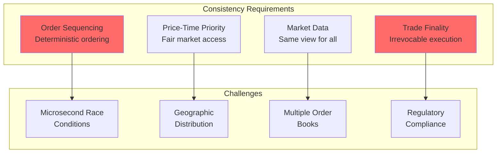

### 8.2 Total Order Broadcast for Fair Sequencing

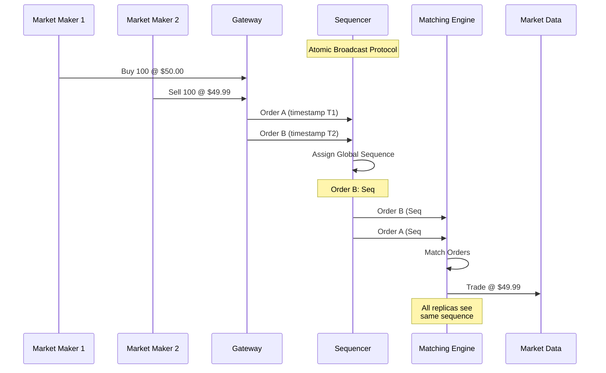

### 8.3 Consistency Models by Market Function

| Function | Consistency Model | Implementation | Latency Impact |
|----------|------------------|----------------|----------------|
| **Order Entry** | Linearizable | Total order broadcast | +5-10 μs |
| **Order Matching** | Sequential Consistency | Single-threaded ME | Deterministic |
| **Market Data** | Causal Consistency | Multicast + sequence numbers | <1 μs |
| **Trade Reporting** | Strong Consistency | Synchronous replication | +10-20 μs |
| **Risk Checks** | Bounded Staleness | Cached positions (100ms) | No impact |
| **Settlement** | Eventual Consistency | End-of-day reconciliation | Hours |
| **Audit Trail** | Immutable Append | Write-once storage | Async |

### 8.4 Matching Engine State Machine

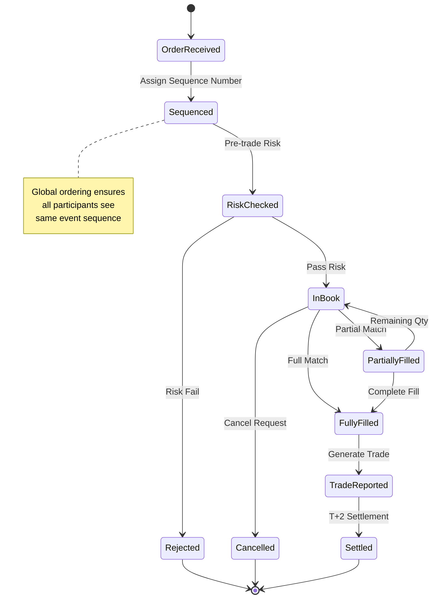

### 8.5 Multi-Region Exchange Architecture

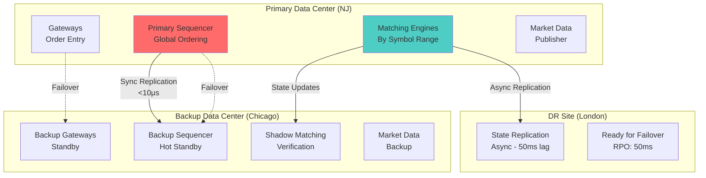

### 8.6 Order Book Consistency

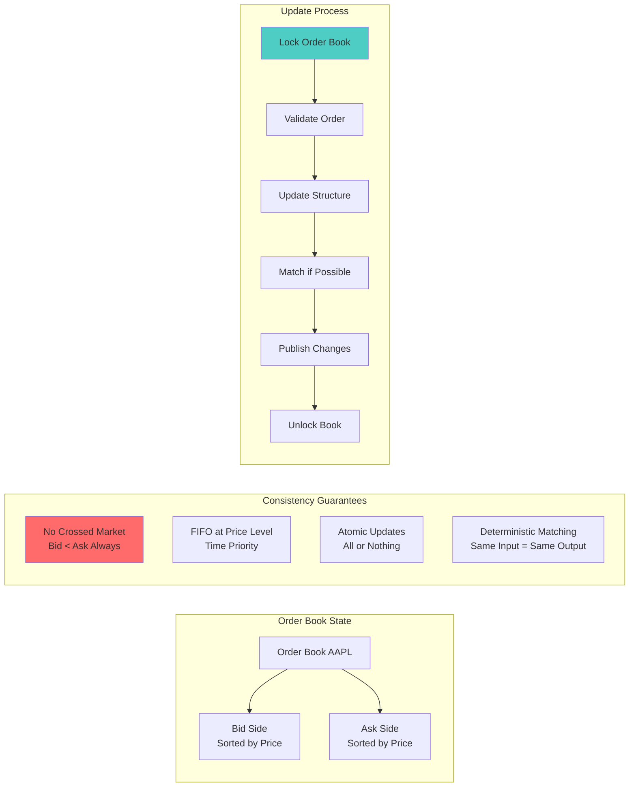

### 8.7 Market Data Consistency

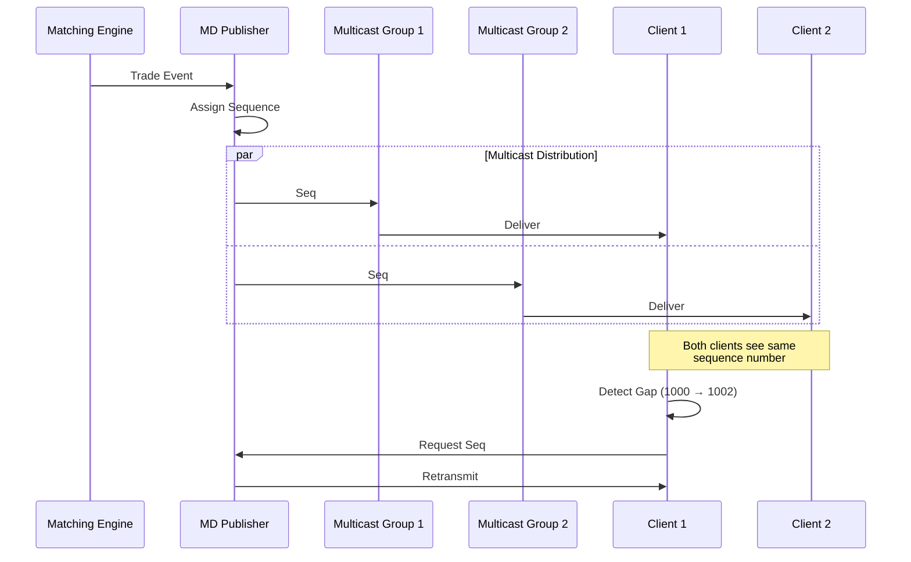

### 8.8 Settlement Consistency (T+2)

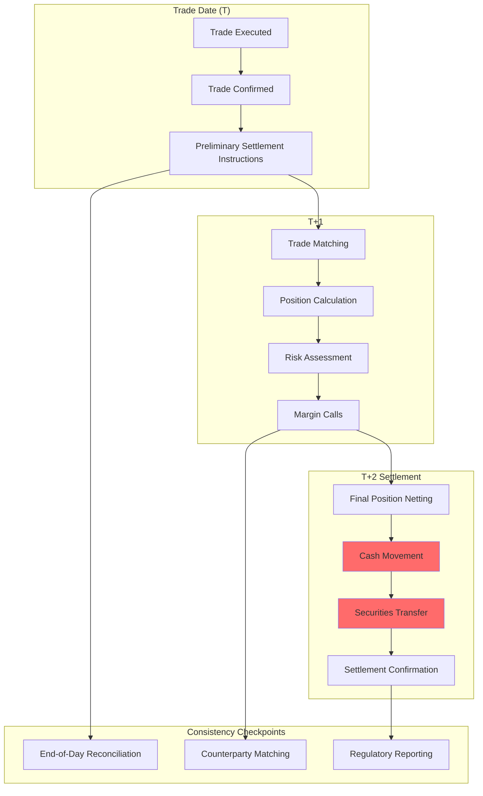

### 8.9 Handling Split-Brain in Exchange Systems

```mermaid
graph TB
    subgraph "Normal Operation"
        N_P[Primary Matching Engine]
        N_B[Backup ME]
        N_ARB[Arbiter]
        
        N_P <-->|Heartbeat| N_ARB
        N_B <-->|Heartbeat| N_ARB
        N_P -->|State Sync| N_B
    end
    
    subgraph "Network Partition"
        P_P[Primary ME]
        P_B[Backup ME]
        P_ARB[Arbiter]
        
        P_P -.X.-> P_ARB
        P_B <--> P_ARB
        P_P -.X.-> P_B
    end
    
    subgraph "Resolution"
        R1[Arbiter Declares Primary Failed]
        R2[Backup Promoted to Primary]
        R3[Old Primary Halted]
        R4[Clients Redirected]
        
        R1 --> R2 --> R3 --> R4
    end
    
    style P_P fill:#ff6b6b
    style R2 fill:#4ecdc4
```

### 8.10 Consistency Monitoring Metrics

```mermaid
graph TB
    subgraph "Order Flow Metrics"
        OF1[Order Sequence Gap Detection<br/>Current: 0 gaps]
        OF2[Order Acknowledgment Latency<br/>P50: 8μs | P99: 25μs]
        OF3[Duplicate Order Detection<br/>Caught: 1,234 today]
    end
    
    subgraph "Market Data Metrics"
        MD1[Multicast Packet Loss<br/>Current: 0.0001%]
        MD2[Sequence Gap Recovery<br/>Avg Time: 2.3ms]
        MD3[Feed Latency Differential<br/>Max: 15μs between feeds]
    end
    
    subgraph "State Consistency"
        SC1[Primary-Backup State Diff<br/>Status: Synchronized]
        SC2[Order Book Checksum<br/>Mismatches: 0]
        SC3[Position Reconciliation<br/>Discrepancies: 0]
    end
    
    subgraph "Alerts"
        A1[🔴 CRITICAL: Sequence Gap > 1000]
        A2[🟡 WARNING: Backup Lag > 100ms]
        A3[🟠 INFO: Maintenance Window 2AM]
    end
```

### 8.11 Best Practices for Exchange Consistency

| Practice | Description | Benefit | Implementation |
|----------|-------------|---------|----------------|
| **Total Order Broadcast** | Single sequencer for global ordering | Deterministic execution | Atomic broadcast protocol |
| **Synchronous Replication** | Wait for backup acknowledgment | Zero data loss | <10μs latency impact |
| **Logical Clocks** | Lamport timestamps for causality | Event ordering | Per-component counters |
| **State Machine Replication** | Deterministic state transitions | Identical replicas | Command pattern |
| **Gap Detection** | Sequence number tracking | Detect message loss | Bitmap or range tracking |
| **Checkpoint & Replay** | Periodic state snapshots | Fast recovery | Every 1M messages |
| **A/B State Verification** | Compare primary/backup state | Detect divergence | Continuous checksums |
| **Write-Ahead Logging** | Log before state change | Durability | NVMe/Optane storage |

## 9. Real-World Patterns and Lessons

### 9.1 Knight Capital Disaster (2012)
A software bug caused $440 million loss in 45 minutes:
- **Cause**: Faulty deployment left old code running
- **Impact**: Sent millions of unintended orders
- **Lessons**:
  - Always have kill switches
  - Test deployment procedures
  - Monitor for abnormal behavior
  - Have position limits

### 9.2 NASDAQ Facebook IPO (2012)
Technical glitches during Facebook's IPO:
- **Cause**: System overwhelmed by order modifications
- **Impact**: Delayed opening, confused traders
- **Lessons**:
  - Stress test for extreme scenarios
  - Have manual override procedures
  - Clear communication protocols
  - Separate IPO systems from regular trading

## 10. Alternative Architectures

### 10.1 Blockchain-Based Exchange
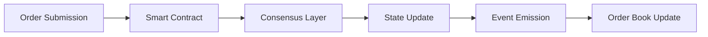

**Advantages**: Transparency, no central authority, immutable audit trail
**Disadvantages**: Latency, throughput limitations, MEV concerns

### 10.2 Hybrid Cloud Exchange
- **On-premise**: Matching engine, market data
- **Cloud**: Web services, analytics, reporting
- **Edge**: Market data distribution, order entry
- **Benefits**: Scalability + low latency

## 11. Future Technologies

### 11.1 Quantum-Safe Cryptography
```python
class QuantumSafeSecurity:
    """Post-quantum cryptography for exchange security"""
    
    def __init__(self):
        self.lattice_crypto = LatticeCryptography()
        self.hash_signatures = HashBasedSignatures()
        
    def generate_quantum_safe_keys(self) -> KeyPair:
        """Generate keys resistant to quantum attacks"""
        
        # Use CRYSTALS-Dilithium for signatures
        signing_key = self.lattice_crypto.generate_signing_key()
        
        # Use CRYSTALS-Kyber for encryption
        encryption_key = self.lattice_crypto.generate_encryption_key()
        
        return KeyPair(
            signing_key=signing_key,
            encryption_key=encryption_key,
            algorithm='CRYSTALS-Dilithium3'
        )
```

### 11.2 AI-Driven Market Making
```python
class AIMarketMaker:
    """Deep learning based market making"""
    
    def __init__(self):
        self.price_predictor = TransformerPriceModel()
        self.risk_model = DeepRiskModel()
        self.execution_optimizer = ReinforcementLearningAgent()
        
    async def generate_ai_quotes(self, symbol: str) -> AIQuotes:
        """Generate quotes using AI models"""
        
        # Get market features
        features = await self._extract_market_features(symbol)
        
        # Predict short-term price movement
        price_forecast = self.price_predictor.predict(
            features,
            horizon_seconds=10
        )
        
        # Assess risk
        risk_assessment = self.risk_model.assess(
            features,
            current_inventory=self.get_inventory(symbol)
        )
        
        # Optimize quote placement
        optimal_quotes = self.execution_optimizer.optimize(
            price_forecast=price_forecast,
            risk_constraints=risk_assessment,
            inventory_target=0
        )
        
        return optimal_quotes
```

## 12. Industry Insights

### Key Design Principles
1. **Determinism**: Same inputs always produce same outputs
2. **Fairness**: No participant has unfair advantage
3. **Transparency**: Clear rules and audit trails
4. **Resilience**: Continue operating despite failures
5. **Performance**: Microsecond latency at scale

### Technology Trends
- **Hardware Acceleration**: FPGAs and custom ASICs
- **5G Networks**: Ultra-low latency wireless trading
- **AI/ML Integration**: Smarter execution and surveillance
- **Quantum Computing**: Future risk calculations
- **DeFi Integration**: Traditional meets decentralized

*"The stock exchange is a zero-sum game where nanoseconds matter and fairness is everything."* - Brad Katsuyama, IEX CEO