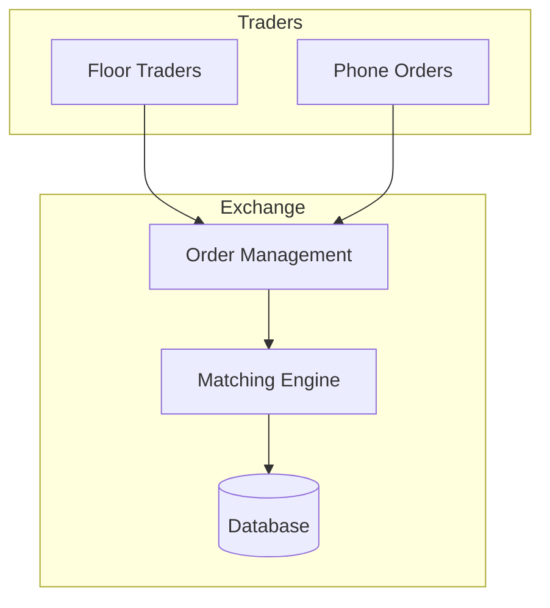
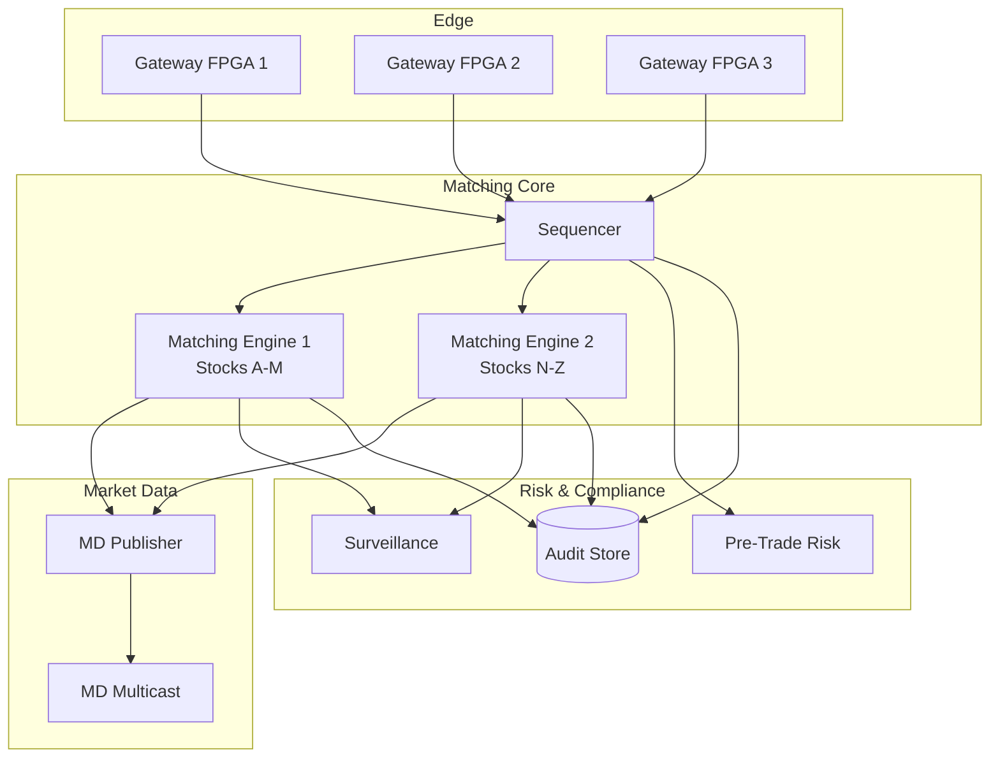
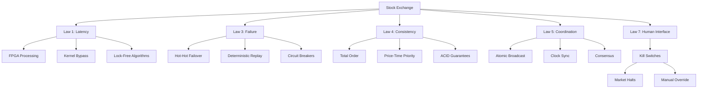
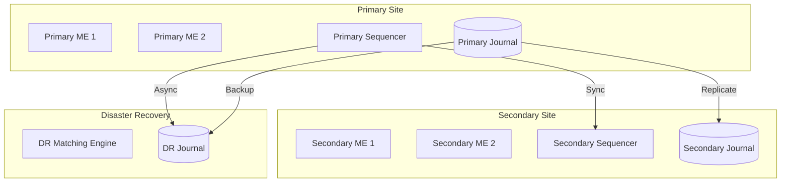
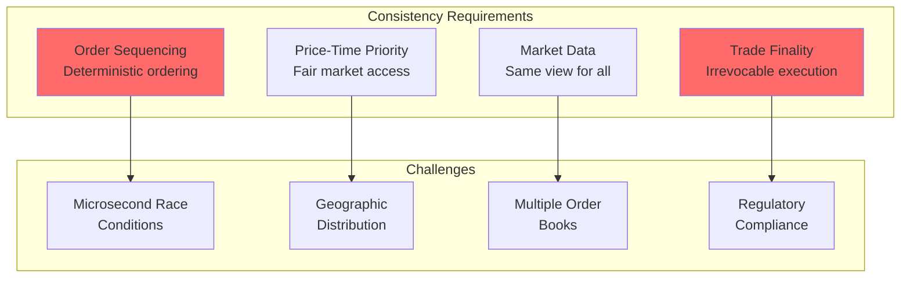
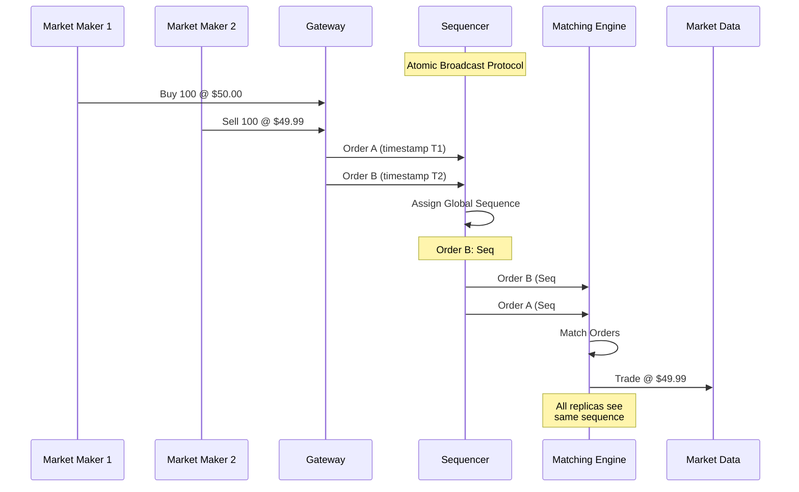
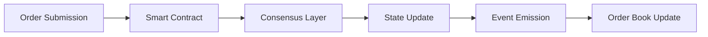

# Design a Stock Exchange

!!! info "Case Study Overview"
    **System**: High-Frequency Trading Exchange  
    **Scale**: 10M+ orders/second, sub-microsecond latency, $100B+ daily volume  
    **Challenges**: Ultra-low latency, fairness, market integrity, regulatory compliance  
    **Key Patterns**: Lock-free algorithms, FPGA acceleration, co-location, deterministic processing

*Estimated reading time: 28 minutes*

## 1. Problem Statement

Design a high-frequency stock exchange system like NYSE, NASDAQ, or Binance that can:
- Process millions of orders per second with microsecond latency
- Maintain a fair and orderly market with price discovery
- Handle order matching, market data distribution, and settlement
- Ensure zero data loss and regulatory compliance
- Prevent market manipulation and ensure fairness
- Support multiple asset classes and order types

### Real-World Context
- **NYSE**: 2.4B+ average daily volume, handles 1M+ messages/second peak
- **NASDAQ**: Powers 90+ marketplaces in 50+ countries
- **CME Group**: 20M+ contracts traded daily, 99.99% uptime
- **Binance**: 1.2M+ orders/second capability, 90M+ users

## Introduction

Modern stock exchanges process millions of orders per second with latencies measured in microseconds. This case study explores building an exchange matching NASDAQ's performance (10M+ messages/second) while ensuring fairness, preventing market manipulation, and maintaining regulatory compliance.

## 2. Requirements Analysis

### Functional Requirements
1. **Order Management**
   - Limit orders, market orders, stop orders
   - Order modification and cancellation
   - Iceberg orders and hidden liquidity
   - Time-in-force options (IOC, FOK, GTC)
   - Order routing and smart order routing

2. **Matching Engine**
   - Price-time priority matching
   - Sub-microsecond latency
   - Multiple order books per symbol
   - Cross and auction matching
   - Self-trade prevention

3. **Market Data**
   - Real-time quotes and trades
   - Order book depth (Level 1, 2, 3)
   - Market statistics and indices
   - Historical data and replay
   - Multicast and unicast distribution

4. **Risk Management**
   - Pre-trade risk checks
   - Position limits
   - Circuit breakers
   - Kill switches
   - Margin calculations

5. **Settlement & Clearing**
   - T+2 settlement cycle
   - Netting and clearing
   - Corporate actions
   - Regulatory reporting
   - Member reconciliation

### Non-Functional Requirements
- **Throughput**: 10M+ orders/second
- **Latency**: <10 microseconds for order acknowledgment
- **Availability**: 99.999% uptime (5 minutes downtime/year)
- **Determinism**: Identical ordering of events
- **Fairness**: No unfair advantage to any participant
- **Compliance**: Full audit trail, regulatory reporting

### Law Mapping
- **Law 1 (Latency)**: Microsecond latency critical for fairness
- **Law 2 (Capacity)**: Finite order book depth and bandwidth
- **Law 3 (Failure)**: Zero tolerance for lost orders
- **Law 4 (Concurrency)**: Massive parallel order processing
- **Law 5 (Coordination)**: Deterministic event ordering
- **Law 6 (Observability)**: Complete audit trail required
- **Law 7 (Interface)**: FIX protocol and native APIs
- **Law 8 (Economics)**: Optimize for transaction costs

## Architecture Evolution

### Phase 1: Traditional Exchange (1990s)


**Limitations**:
- Human-speed processing
- Limited throughput
- No algorithmic trading

### Phase 2: Modern HFT Exchange (Current)


## Concept Map



## Key Design Decisions

### 1. Ultra-Low Latency Architecture

**Hardware Acceleration**:
```c
// FPGA-based order validation
module order_validator (
    input wire clk,
    input wire [511:0] order_data,
    output reg valid,
    output reg [15:0] error_code
);

always @(posedge clk) begin
    // Parallel validation checks
    wire price_valid = (order_data[63:0] > 0) && 
                      (order_data[63:0] < MAX_PRICE);
    wire qty_valid = (order_data[127:64] > 0) && 
                    (order_data[127:64] <= MAX_QTY);
    wire symbol_valid = validate_symbol(order_data[191:128]);
    
    valid <= price_valid && qty_valid && symbol_valid;
    error_code <= {!price_valid, !qty_valid, !symbol_valid};
end
```

**Kernel Bypass Networking**:
```cpp
class DPDKNetworkHandler {
private:
    struct rte_mempool* mbuf_pool;
    struct rte_ring* rx_ring;
    struct rte_ring* tx_ring;
    
public:
    void process_packets() {
        struct rte_mbuf* pkts_burst[BURST_SIZE];
        
        while (true) {
            // Poll NIC directly (no kernel involvement)
            const uint16_t nb_rx = rte_eth_rx_burst(
                port_id, 0, pkts_burst, BURST_SIZE);
            
            for (int i = 0; i < nb_rx; i++) {
                // Process in userspace
                process_order_packet(pkts_burst[i]);
            }
            
            // Batch transmit responses
            transmit_responses();
        }
    }
    
    void process_order_packet(struct rte_mbuf* pkt) {
        // Zero-copy packet processing
        struct order_msg* order = rte_pktmbuf_mtod(
            pkt, struct order_msg*);
        
        // Validate and forward to matching engine
        if (validate_order(order)) {
            // Use lock-free queue
            while (!order_queue.push(order)) {
                _mm_pause();  // CPU pause instruction
            }
        }
    }
};
```

### 2. Matching Engine Design

**Lock-Free Order Book**:
```cpp
template<typename Price, typename Quantity>
class LockFreeOrderBook {
private:
    struct Order {
        std::atomic<uint64_t> id;
        Price price;
        Quantity quantity;
        std::atomic<Order*> next;
        bool is_buy;
    };
    
    // Price levels use atomic pointers
    std::atomic<Order*> buy_levels[MAX_PRICE_LEVELS];
    std::atomic<Order*> sell_levels[MAX_PRICE_LEVELS];
    
public:
    void add_order(Order* order) {
        size_t price_level = price_to_level(order->price);
        
        if (order->is_buy) {
            // Atomic insertion at price level
            Order* head = buy_levels[price_level].load();
            do {
                order->next = head;
            } while (!buy_levels[price_level].compare_exchange_weak(
                head, order));
        } else {
            // Similar for sell orders
        }
        
        // Try to match immediately
        try_match(order);
    }
    
    void try_match(Order* new_order) {
        if (new_order->is_buy) {
            // Find best ask
            for (size_t i = 0; i < MAX_PRICE_LEVELS; i++) {
                Order* ask = sell_levels[i].load();
                if (ask && ask->price <= new_order->price) {
                    execute_match(new_order, ask);
                    break;
                }
            }
        }
    }
};
```

**Deterministic Processing**:
```python
class DeterministicMatchingEngine:
    def __init__(self):
        self.sequence_number = 0
        self.order_books = {}
        self.random_seed = 12345  # Fixed seed for determinism
        
    def process_order(self, order):
# Assign deterministic sequence number
        order.sequence = self.sequence_number
        self.sequence_number += 1
        
# Record input for replay
        self.audit_log.record_input(order)
        
# Process based on order type
        if order.type == OrderType.LIMIT:
            return self.process_limit_order(order)
        elif order.type == OrderType.MARKET:
            return self.process_market_order(order)
        elif order.type == OrderType.ICEBERG:
            return self.process_iceberg_order(order)
    
    def process_limit_order(self, order):
        book = self.order_books[order.symbol]
        
# Try immediate match
        fills = []
        remaining_qty = order.quantity
        
        if order.side == Side.BUY:
# Match against asks
            while remaining_qty > 0 and book.has_asks():
                best_ask = book.best_ask()
                if best_ask.price <= order.price:
                    fill_qty = min(remaining_qty, best_ask.quantity)
                    fills.append(self.create_fill(
                        order, best_ask, fill_qty, best_ask.price))
                    remaining_qty -= fill_qty
                    book.reduce_order(best_ask, fill_qty)
                else:
                    break
        
# Add remainder to book
        if remaining_qty > 0:
            book.add_order(order, remaining_qty)
        
        return ExecutionReport(order, fills, remaining_qty)
```

### 3. Fair Access and Anti-Gaming

**Speed Bump Implementation**:
```python
class FairAccessManager:
    def __init__(self):
        self.speed_bump_us = 350  # 350 microsecond delay
        self.participant_queues = {}
        
    def handle_order(self, order, participant_id):
# Apply speed bump to prevent latency arbitrage
        arrival_time = self.get_hardware_timestamp()
        process_time = arrival_time + self.speed_bump_us
        
# Queue order with deterministic processing time
        self.participant_queues[participant_id].put(
            (process_time, order)
        )
    
    def process_queued_orders(self):
# Process orders in strict time order
        all_orders = []
        for queue in self.participant_queues.values():
            while not queue.empty():
                process_time, order = queue.get()
                if self.current_time() >= process_time:
                    all_orders.append((process_time, order))
                else:
                    queue.put((process_time, order))
                    break
        
# Sort by process time for fairness
        all_orders.sort(key=lambda x: x[0])
        
        for _, order in all_orders:
            self.matching_engine.process(order)
```

### 4. Market Data Distribution

**Multicast Feed Handler**:
```cpp
class MarketDataPublisher {
private:
    int multicast_socket;
    struct sockaddr_in multicast_addr;
    std::atomic<uint64_t> sequence_number{0};
    
public:
    void publish_trade(const Trade& trade) {
        // Create market data message
        MarketDataMessage msg;
        msg.type = MSG_TRADE;
        msg.sequence = sequence_number.fetch_add(1);
        msg.timestamp = get_exchange_timestamp();
        msg.symbol = trade.symbol;
        msg.price = trade.price;
        msg.quantity = trade.quantity;
        msg.trade_id = trade.id;
        
        // Multicast to all subscribers
        sendto(multicast_socket, &msg, sizeof(msg), 0,
               (struct sockaddr*)&multicast_addr, 
               sizeof(multicast_addr));
        
        // Also send to compliance feed
        compliance_recorder.record_trade(trade);
    }
    
    void publish_order_book_update(const OrderBookDelta& delta) {
        MarketDataMessage msg;
        msg.type = MSG_BOOK_UPDATE;
        msg.sequence = sequence_number.fetch_add(1);
        msg.timestamp = get_exchange_timestamp();
        
        // Include top 10 levels
        for (int i = 0; i < 10; i++) {
            msg.bids[i] = delta.bids[i];
            msg.asks[i] = delta.asks[i];
        }
        
        // Conflate updates if necessary
        if (should_conflate()) {
            conflation_buffer.add(msg);
        } else {
            send_immediately(msg);
        }
    }
};
```

## Technical Deep Dives

### High-Precision Time Synchronization

```cpp
class PrecisionTimeProtocol {
private:
    struct timespec last_sync;
    int64_t clock_offset_ns;
    
public:
    void sync_with_grandmaster() {
        // Hardware timestamping for nanosecond precision
        struct ptp_clock_time pct;
        ioctl(ptp_fd, PTP_SYS_OFFSET_PRECISE, &pct);
        
        // Calculate offset from grandmaster
        int64_t system_time = pct.sys_realtime.tv_sec * 1e9 + 
                             pct.sys_realtime.tv_nsec;
        int64_t ptp_time = pct.device.tv_sec * 1e9 + 
                          pct.device.tv_nsec;
        
        clock_offset_ns = ptp_time - system_time;
        
        // Adjust system clock gradually
        struct timex tx;
        tx.modes = ADJ_OFFSET | ADJ_FREQUENCY;
        tx.offset = clock_offset_ns / 1000;  // Convert to microseconds
        adjtimex(&tx);
    }
    
    uint64_t get_exchange_timestamp() {
        struct timespec ts;
        clock_gettime(CLOCK_REALTIME, &ts);
        
        // Apply offset for exchange-wide consistency
        return (ts.tv_sec * 1e9 + ts.tv_nsec + clock_offset_ns);
    }
};
```

### Risk Management System

```python
class PreTradeRiskChecker:
    def __init__(self):
        self.position_limits = {}
        self.order_rate_limits = {}
        self.capital_limits = {}
        self.banned_symbols = set()
        
    def check_order(self, order, participant):
# Parallel risk checks
        checks = [
            self.check_position_limits(order, participant),
            self.check_order_rate(order, participant),
            self.check_capital_usage(order, participant),
            self.check_fat_finger(order),
            self.check_market_impact(order),
            self.check_regulatory_restrictions(order, participant)
        ]
        
# All checks must pass
        for check_result in checks:
            if not check_result.passed:
                return RiskReject(order, check_result.reason)
        
        return RiskPass(order)
    
    def check_fat_finger(self, order):
# Detect potential erroneous orders
        if order.type == OrderType.MARKET:
            return CheckResult(False, "Market orders not allowed")
        
# Check if order is >5% away from last trade
        last_price = self.get_last_trade_price(order.symbol)
        price_diff = abs(order.price - last_price) / last_price
        
        if price_diff > 0.05:
            return CheckResult(False, f"Price {price_diff*100:.1f}% from market")
        
# Check order value
        order_value = order.price * order.quantity
        if order_value > self.get_max_order_value(order.symbol):
            return CheckResult(False, f"Order value ${order_value:,.0f} exceeds limit")
        
        return CheckResult(True)
    
    def check_market_impact(self, order):
# Estimate market impact
        adv = self.get_average_daily_volume(order.symbol)
        order_pct = (order.quantity / adv) * 100
        
        if order_pct > 10:  # >10% of ADV
            return CheckResult(False, f"Order is {order_pct:.1f}% of ADV")
        
        return CheckResult(True)
```

### Circuit Breakers and Halts

```python
class MarketProtectionSystem:
    def __init__(self):
        self.circuit_breaker_levels = [
            (0.07, 15 * 60),    # 7% -> 15 min halt
            (0.13, 15 * 60),    # 13% -> 15 min halt  
            (0.20, None)        # 20% -> close for day
        ]
        self.volatility_halts = {}
        self.news_halts = {}
        
    def check_circuit_breaker(self, symbol, current_price):
        open_price = self.get_opening_price(symbol)
        price_change = abs(current_price - open_price) / open_price
        
        for threshold, halt_duration in self.circuit_breaker_levels:
            if price_change >= threshold:
                self.trigger_market_wide_halt(halt_duration)
                return True
        
        return False
    
    def check_volatility_halt(self, symbol, trade):
# Check if price moved >10% in 5 minutes
        five_min_ago = self.current_time() - timedelta(minutes=5)
        price_5min = self.get_price_at(symbol, five_min_ago)
        
        if price_5min:
            change = abs(trade.price - price_5min) / price_5min
            if change > 0.10:
                self.trigger_volatility_halt(symbol, minutes=5)
                return True
        
        return False
    
    def trigger_volatility_halt(self, symbol, minutes):
        halt_until = self.current_time() + timedelta(minutes=minutes)
        self.volatility_halts[symbol] = halt_until
        
# Cancel all open orders
        self.matching_engine.cancel_all_orders(symbol)
        
# Notify market
        self.market_data.publish_halt(
            symbol=symbol,
            reason="VOLATILITY",
            halt_until=halt_until
        )
        
# Schedule auction for restart
        self.schedule_opening_auction(symbol, halt_until)
```

### Order Types and Algorithms

```cpp
class AdvancedOrderTypes {
public:
    // Iceberg order - only shows partial quantity
    struct IcebergOrder : public Order {
        Quantity display_quantity;
        Quantity total_quantity;
        Quantity hidden_quantity;
        
        void on_partial_fill(Quantity filled) override {
            hidden_quantity -= filled;
            if (display_quantity == 0 && hidden_quantity > 0) {
                // Refresh display quantity
                display_quantity = std::min(
                    original_display_qty, 
                    hidden_quantity
                );
                // Get new timestamp for queue position
                timestamp = get_current_timestamp();
            }
        }
    };
    
    // Pegged order - tracks best bid/ask
    struct PeggedOrder : public Order {
        enum PegType { MIDPOINT, PRIMARY, MARKET };
        PegType peg_type;
        Price offset;
        
        Price calculate_price(const OrderBook& book) {
            switch (peg_type) {
                case MIDPOINT:
                    return (book.best_bid() + book.best_ask()) / 2;
                case PRIMARY:
                    return is_buy ? 
                        book.best_bid() + offset : 
                        book.best_ask() - offset;
                case MARKET:
                    return is_buy ? 
                        book.best_ask() : 
                        book.best_bid();
            }
        }
    };
    
    // Stop order - triggers at price threshold
    struct StopOrder : public Order {
        Price stop_price;
        bool is_stop_limit;
        Price limit_price;
        
        bool should_trigger(Price last_trade) {
            if (is_buy) {
                return last_trade >= stop_price;
            } else {
                return last_trade <= stop_price;
            }
        }
    };
};
```

## Performance Optimization

### Memory Layout Optimization

```cpp
// Cache-line aligned structures
struct alignas(64) OrderBookLevel {
    std::atomic<Order*> head;
    std::atomic<uint32_t> order_count;
    std::atomic<Quantity> total_quantity;
    Price price;
    char padding[16];  // Avoid false sharing
};

// Hot/cold data separation
struct Order {
    // Hot data (frequently accessed)
    struct alignas(64) {
        uint64_t id;
        Price price;
        Quantity quantity;
        std::atomic<Order*> next;
    } hot;
    
    // Cold data (rarely accessed)
    struct {
        char trader_id[16];
        uint64_t entry_time;
        char client_order_id[32];
        uint32_t flags;
    } cold;
};
```

### Zero-Copy Message Processing

```cpp
class ZeroCopyProcessor {
private:
    // Pre-allocated ring buffer
    static constexpr size_t RING_SIZE = 1 << 20;  // 1M entries
    alignas(64) Order ring_buffer[RING_SIZE];
    alignas(64) std::atomic<uint64_t> write_pos{0};
    alignas(64) std::atomic<uint64_t> read_pos{0};
    
public:
    bool try_write(const OrderMessage* msg) {
        uint64_t write = write_pos.load(std::memory_order_relaxed);
        uint64_t next_write = (write + 1) & (RING_SIZE - 1);
        
        if (next_write == read_pos.load(std::memory_order_acquire)) {
            return false;  // Ring full
        }
        
        // Copy directly into ring buffer (no allocation)
        Order& order = ring_buffer[write];
        order.hot.id = msg->id;
        order.hot.price = msg->price;
        order.hot.quantity = msg->quantity;
        
        write_pos.store(next_write, std::memory_order_release);
        return true;
    }
};
```

## Disaster Recovery

### Fault Tolerance Architecture



### Deterministic Replay

```python
class DisasterRecoverySystem:
    def __init__(self):
        self.journal_writer = JournalWriter()
        self.replay_engine = ReplayEngine()
        
    def record_input(self, message):
# Record all inputs with nanosecond timestamp
        entry = JournalEntry(
            sequence=self.next_sequence(),
            timestamp=self.get_hardware_timestamp(),
            message_type=message.type,
            payload=message.serialize()
        )
        
# Write to multiple locations
        self.journal_writer.write_local(entry)
        self.journal_writer.write_remote(entry)
        self.journal_writer.write_backup(entry)
    
    def replay_from_checkpoint(self, checkpoint_time):
# Load system state at checkpoint
        state = self.load_checkpoint(checkpoint_time)
        
# Create new matching engine with checkpoint state
        engine = MatchingEngine()
        engine.restore_state(state)
        
# Replay all messages since checkpoint
        messages = self.journal_reader.read_since(checkpoint_time)
        
        for msg in messages:
# Replay in exact same order
            result = engine.process(msg)
            
# Verify determinism
            original_result = self.get_original_result(msg.sequence)
            assert result == original_result, "Non-deterministic behavior detected"
        
        return engine
```

## Regulatory Compliance

### Market Surveillance

```python
class MarketSurveillanceSystem:
    def __init__(self):
        self.patterns = self.load_manipulation_patterns()
        self.alerts = []
        
    def detect_manipulation(self, order_stream):
        detectors = [
            self.detect_spoofing,
            self.detect_layering,
            self.detect_wash_trading,
            self.detect_front_running,
            self.detect_marking_the_close,
            self.detect_quote_stuffing
        ]
        
        for order in order_stream:
            for detector in detectors:
                alert = detector(order)
                if alert:
                    self.handle_alert(alert)
    
    def detect_spoofing(self, order):
# Detect large orders that are quickly cancelled
        participant = order.participant_id
        symbol = order.symbol
        
# Get recent order history
        history = self.get_order_history(participant, symbol, minutes=5)
        
# Calculate cancellation rate
        cancel_rate = sum(1 for o in history if o.cancelled) / len(history)
        
# Check for pattern
        if cancel_rate > 0.9 and order.quantity > self.get_avg_order_size(symbol) * 10:
            return Alert(
                type="SPOOFING",
                participant=participant,
                symbol=symbol,
                severity="HIGH",
                evidence=history
            )
        
        return None
    
    def detect_wash_trading(self, trade):
# Detect trades between related accounts
        buyer = trade.buyer_id
        seller = trade.seller_id
        
# Check if accounts are related
        if self.are_accounts_related(buyer, seller):
            return Alert(
                type="WASH_TRADE",
                participants=[buyer, seller],
                trade_id=trade.id,
                severity="CRITICAL"
            )
        
# Check for suspicious pattern
        recent_trades = self.get_recent_trades(buyer, seller, hours=1)
        if len(recent_trades) > 10:
            return Alert(
                type="SUSPECTED_WASH_TRADE",
                participants=[buyer, seller],
                trade_count=len(recent_trades),
                severity="HIGH"
            )
        
        return None
```

### Audit Trail

```sql
-- Comprehensive audit schema
CREATE TABLE order_audit_trail (
    sequence_number BIGINT PRIMARY KEY,
    order_id UUID NOT NULL,
    participant_id VARCHAR(50) NOT NULL,
    action VARCHAR(20) NOT NULL,
    timestamp TIMESTAMP(9) NOT NULL,  -- Nanosecond precision
    -- Order details
    symbol VARCHAR(12),
    side CHAR(1),
    order_type VARCHAR(20),
    price DECIMAL(19,4),
    quantity BIGINT,
    -- Network details
    source_ip INET,
    gateway_id INTEGER,
    session_id UUID,
    -- Processing details
    latency_ns BIGINT,
    risk_check_result VARCHAR(20),
    -- Regulatory fields
    client_id VARCHAR(50),
    algo_id VARCHAR(50),
    regulatory_flags INTEGER,
    -- Immutable
    created_at TIMESTAMP DEFAULT CURRENT_TIMESTAMP
) PARTITION BY RANGE (timestamp);

-- Create daily partitions
CREATE TABLE order_audit_trail_20240115 
PARTITION OF order_audit_trail 
FOR VALUES FROM ('2024-01-15') TO ('2024-01-16');

-- Index for regulatory queries
CREATE INDEX idx_audit_participant_time 
ON order_audit_trail (participant_id, timestamp);

CREATE INDEX idx_audit_symbol_time 
ON order_audit_trail (symbol, timestamp) 
WHERE action IN ('NEW', 'TRADE');
```

## Monitoring and Operations

### Real-time Metrics

```yaml
critical_metrics:
  - name: matching_latency_ns
    target: < 500  # nanoseconds
    measurement: histogram
    
  - name: gateway_latency_us
    target: < 10   # microseconds
    measurement: histogram
    
  - name: order_rate
    target: < 15000000  # 15M/sec capacity
    measurement: counter
    
  - name: trade_rate
    target: ~ # No limit, just monitor
    measurement: counter
    
  - name: market_data_latency_us
    target: < 5    # microseconds
    measurement: histogram

operational_metrics:
  - name: memory_usage_gb
    warning: > 400
    critical: > 450
    
  - name: cpu_usage_percent
    warning: > 70
    critical: > 85
    
  - name: packet_loss_rate
    warning: > 0.0001  # 0.01%
    critical: > 0.001   # 0.1%
    
  - name: clock_drift_us
    warning: > 10
    critical: > 100
```

### Production Safeguards

```python
class ProductionSafeguards:
    def __init__(self):
        self.kill_switches = {}
        self.throttles = {}
        self.emergency_procedures = {}
        
    def register_kill_switch(self, name, action):
        self.kill_switches[name] = {
            'action': action,
            'enabled': True,
            'last_triggered': None,
            'trigger_count': 0
        }
    
    def emergency_market_close(self):
        """Big red button - shut down all trading"""
        logging.critical("EMERGENCY MARKET CLOSE INITIATED")
        
# 1. Reject all new orders
        self.matching_engine.set_mode(EngineMode.REJECT_ALL)
        
# 2. Cancel all open orders
        for symbol in self.get_all_symbols():
            self.matching_engine.cancel_all_orders(symbol)
        
# 3. Disable all sessions
        self.session_manager.disable_all_sessions()
        
# 4. Publish market close message
        self.market_data.publish_emergency_close()
        
# 5. Dump state for investigation
        self.dump_full_system_state()
        
# 6. Notify regulators
        self.notify_regulatory_emergency()
```

## 8. Consistency Deep Dive for Stock Exchanges

### 8.1 The Critical Nature of Order Consistency



### 8.2 Total Order Broadcast for Fair Sequencing



### 8.3 Consistency Models by Market Function

| Function | Consistency Model | Implementation | Latency Impact |
|----------|------------------|----------------|----------------|
| **Order Entry** | Linearizable | Total order broadcast | +5-10 μs |
| **Order Matching** | Sequential Consistency | Single-threaded ME | Deterministic |
| **Market Data** | Causal Consistency | Multicast + sequence numbers | <1 μs |
| **Trade Reporting** | Strong Consistency | Synchronous replication | +10-20 μs |
| **Risk Checks** | Bounded Staleness | Cached positions (100ms) | No impact |
| **Settlement** | Eventual Consistency | End-of-day reconciliation | Hours |
| **Audit Trail** | Immutable Append | Write-once storage | Async |


### 8.4 Best Practices for Exchange Consistency

| Practice | Description | Benefit | Implementation |
|----------|-------------|---------|----------------|
| **Total Order Broadcast** | Single sequencer for global ordering | Deterministic execution | Atomic broadcast protocol |
| **Synchronous Replication** | Wait for backup acknowledgment | Zero data loss | <10μs latency impact |
| **Logical Clocks** | Lamport timestamps for causality | Event ordering | Per-component counters |
| **State Machine Replication** | Deterministic state transitions | Identical replicas | Command pattern |
| **Gap Detection** | Sequence number tracking | Detect message loss | Bitmap or range tracking |
| **Checkpoint & Replay** | Periodic state snapshots | Fast recovery | Every 1M messages |
| **A/B State Verification** | Compare primary/backup state | Detect divergence | Continuous checksums |
| **Write-Ahead Logging** | Log before state change | Durability | NVMe/Optane storage |


## Lessons Learned

### 1. Determinism is Essential
- Every operation must be reproducible
- No threading non-determinism
- Fixed random seeds for algorithms
- Careful timestamp handling

### 2. Latency Budget Every Nanosecond
- Network: 1-2 μs (kernel bypass)
- Parsing: 50-100 ns (FPGA)
- Matching: 100-200 ns (lock-free)
- Logging: Async only
- Total: <5 μs wire-to-wire

### 3. Fairness Requires Active Measures
- Speed bumps prevent latency arbitrage
- Randomized queue processing
- Anti-gaming detection
- Regular fairness audits

### 4. Test Everything at Scale
- 10M orders/sec in testing
- Full market replay testing
- Chaos engineering for failures
- Regulatory scenario testing

### 5. Human Override Critical
- Kill switches at every level
- Clear escalation procedures
- Practice emergency procedures
- Post-mortem every incident

## Trade-offs and Decisions

| Decision | Trade-off | Why This Choice |
|----------|-----------|-----------------|
| FPGA for critical path | Complexity vs speed | Nanosecond latency requirements |
| Deterministic processing | Flexibility vs reproducibility | Regulatory requirement |
| Speed bumps | Liquidity vs fairness | Prevent predatory trading |
| Multiple matching engines | Complexity vs throughput | Scale to 10M+ orders/sec |
| Synchronous audit logging | Latency vs compliance | Regulatory requirement |


## 9. Real-World Patterns and Lessons

### 9.1 Knight Capital Disaster (2012)
A software bug caused $440 million loss in 45 minutes:
- **Cause**: Faulty deployment left old code running
- **Impact**: Sent millions of unintended orders
- **Lessons**:
  - Always have kill switches
  - Test deployment procedures
  - Monitor for abnormal behavior
  - Have position limits

### 9.2 NASDAQ Facebook IPO (2012)
Technical glitches during Facebook's IPO:
- **Cause**: System overwhelmed by order modifications
- **Impact**: Delayed opening, confused traders
- **Lessons**:
  - Stress test for extreme scenarios
  - Have manual override procedures
  - Clear communication protocols
  - Separate IPO systems from regular trading

## 10. Alternative Architectures

### 10.1 Blockchain-Based Exchange


**Advantages**: Transparency, no central authority, immutable audit trail
**Disadvantages**: Latency, throughput limitations, MEV concerns

### 10.2 Hybrid Cloud Exchange
- **On-premise**: Matching engine, market data
- **Cloud**: Web services, analytics, reporting
- **Edge**: Market data distribution, order entry
- **Benefits**: Scalability + low latency

## 11. Industry Insights

### Key Design Principles
1. **Determinism**: Same inputs always produce same outputs
2. **Fairness**: No participant has unfair advantage
3. **Transparency**: Clear rules and audit trails
4. **Resilience**: Continue operating despite failures
5. **Performance**: Microsecond latency at scale

### Technology Trends
- **Hardware Acceleration**: FPGAs and custom ASICs
- **5G Networks**: Ultra-low latency wireless trading
- **AI/ML Integration**: Smarter execution and surveillance
- **Quantum Computing**: Future risk calculations
- **DeFi Integration**: Traditional meets decentralized

*"The stock exchange is a zero-sum game where nanoseconds matter and fairness is everything."* - Brad Katsuyama, IEX CEO

## References

- [NASDAQ Technology Architecture](https://www.nasdaq.com/docs/2023/05/24/nasdaq-technology-overview.pdf)
- [High-Frequency Trading: A Practical Guide](https://www.wiley.com/en-us/High+Frequency+Trading%3A+A+Practical+Guide+to+Algorithmic+Strategies+and+Trading+Systems-p-9781118343500)
- [SEC Market Structure Papers](https://www.sec.gov/marketstructure)
- [FIX Protocol Specifications](https://www.fixtrading.org/standards/)
- [CME Group Matching Engine Architecture](https://www.cmegroup.com/confluence/display/EPICSANDBOX/CME+Globex+Architecture)