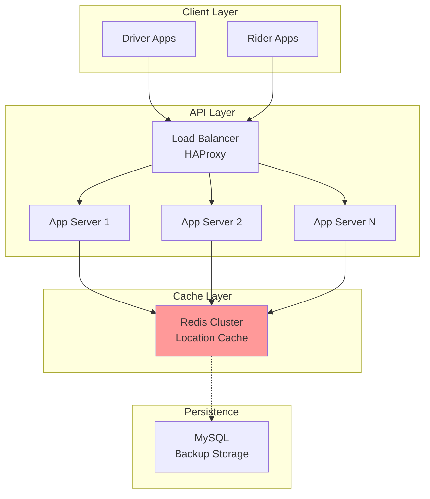
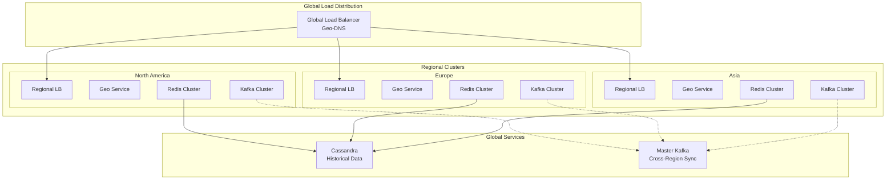
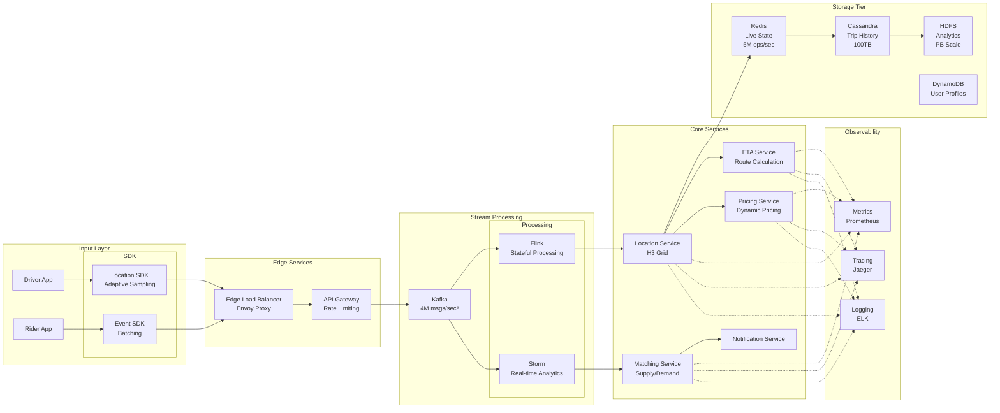
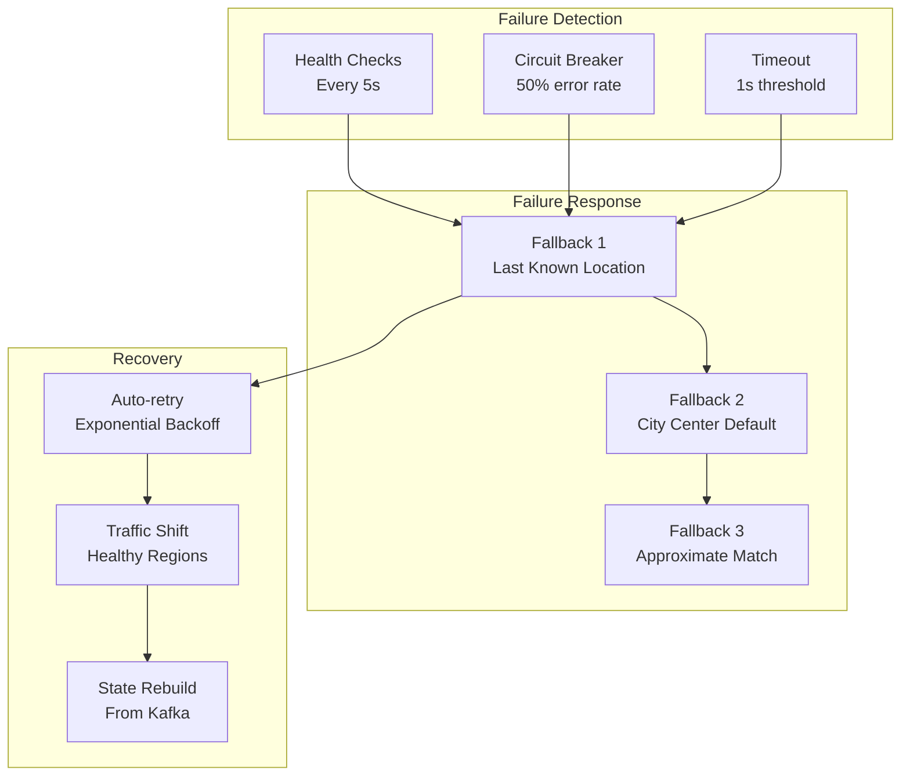
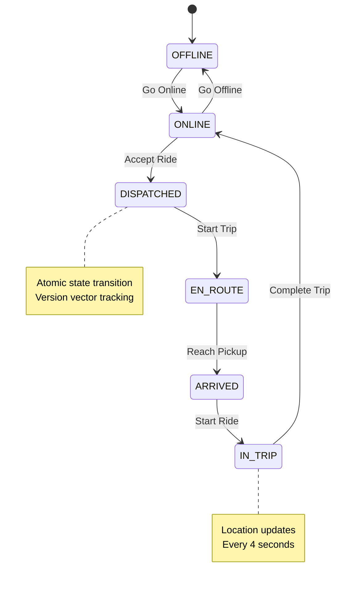

<!-- Navigation -->
[Home](../index.md) → [Case Studies](index.md) → **Uber's Real-Time Location System**

# 🚗 Uber's Real-Time Location System

**The Challenge**: Track millions of drivers and riders globally with sub-second updates

!!! info "Case Study Sources"
    This analysis is based on:
    - Uber Engineering Blog: "Scaling Uber's Real-time Infrastructure"¹
    - QCon Talk: "How Uber Scales Their Real-Time Market Platform"²  
    - Paper: "Engineering Uber's Self-Healing Architecture"³
    - H3 Geospatial Indexing System⁴

---

## 🏗️ Architecture Evolution

### Phase 1: Simple Polling (2009-2011)

```text
Driver App → API Gateway → MySQL → Dispatcher
```

**Problems Encountered:**
- Database couldn't handle write volume
- Polling overwhelmed servers
- No real-time updates

**Patterns Violated**: 
- ❌ No [Caching Strategy](../patterns/caching-strategies.md)
- ❌ No [Load Balancing](../patterns/load-balancing.md)
- ❌ Synchronous polling instead of [Event-Driven](../patterns/event-driven.md)

### Phase 2: In-Memory Grid (2011-2013)



**Key Design Decision: Redis for Hot Data**
- **Trade-off**: Durability vs Speed (Pillar: [State Distribution](../part2-pillars/state/index.md))
- **Choice**: Accept potential data loss for 100x performance
- **Result**: Sub-second updates achieved
- **Pattern Applied**: [Caching Strategies](../patterns/caching-strategies.md) - Write-through cache

According to Uber's engineering blog¹, this reduced latency from 500ms to under 50ms for location queries.

### Phase 3: Geospatial Sharding (2013-2016)



**Innovation: H3 Hexagonal Grid System**⁴
- World divided into hexagonal cells
- Hierarchical indexing (resolution 0-15)
- Efficient neighbor queries  
- Predictable shard distribution

**Patterns & Pillars Applied**:
- 🔧 Pattern: [Sharding](../patterns/sharding.md) - Geographic partitioning
- 🔧 Pattern: [Geo-Replication](../patterns/geo-replication.md) - Multi-region deployment
- 🏛️ Pillar: [Work Distribution](../part2-pillars/work/index.md) - Spatial load balancing
- 🏛️ Pillar: [State Distribution](../part2-pillars/state/index.md) - Regional data ownership

### Phase 4: Event-Driven Architecture (2016-Present)



**Patterns Applied**:
- 🔧 [Event-Driven Architecture](../patterns/event-driven.md) - Kafka backbone
- 🔧 [Service Mesh](../patterns/service-mesh.md) - Envoy proxy for resilience
- 🔧 [Circuit Breaker](../patterns/circuit-breaker.md) - Service protection
- 🔧 [CQRS](../patterns/cqrs.md) - Separate read/write paths
- 🔧 [Bulkhead](../patterns/bulkhead.md) - Service isolation

---

## 🔬 Complete Axiom Analysis

### Comprehensive Axiom Mapping Table

| Design Decision | Axiom 1: Latency | Axiom 2: Capacity | Axiom 3: Failure | Axiom 4: Concurrency | Axiom 5: Coordination | Axiom 6: Observability | Axiom 7: Human Interface | Axiom 8: Economics |
|-----------------|------------------|-------------------|------------------|----------------------|----------------------|------------------------|--------------------------|-------------------|
| **H3 Hexagonal Grid**⁴ | 10ms lookup time vs 50ms for lat/lng | 40% less storage than rectangles | Cell boundaries remain stable | Parallel spatial queries | No coordinate conflicts | Clear cell ownership | Intuitive hex visualization | Reduces compute by 40% |
| **Geospatial Sharding**¹ | Data locality reduces latency | Natural partition boundaries | City-level failure isolation | Independent city operations | No cross-city coordination | Per-city metrics | City-based debugging | Infrastructure per market |
| **Event Streaming (Kafka)**² | Async processing, no blocking | Handles 4M events/sec | Replayable from any point | Multiple consumers | Ordered event delivery | Event flow tracing | Event-driven mental model | Shared infrastructure |
| **Redis for Live State**⁶ | Sub-ms reads, 5ms writes | In-memory scales horizontally | Replicas for failover | Optimistic concurrency | No distributed locks | Real-time metrics | Simple key-value model | Memory cost vs disk |
| **Adaptive Sampling**⁷ | Reduces network overhead | 68% less data transmitted | Graceful degradation | Per-driver rate limiting | Client-side decisions | Sampling rate metrics | Transparent to drivers | Bandwidth cost reduction |
| **Service Mesh (Envoy)**⁸ | Circuit breakers prevent cascades | Request routing at edge | Automatic failover | Retry with backoff | Distributed tracing | Service dependency maps | Clear service boundaries | Reduces ops overhead |
| **CRDT Location Updates**⁹ | Conflict-free by design | Mergeable across partitions | Eventually consistent | Concurrent updates safe | No coordination needed | Convergence tracking | Simple last-write-wins | No consensus overhead |

### Detailed Axiom-to-Pillar-to-Pattern Mapping

#### Axiom 1: Latency is Non-Zero
**Challenge**: Global system with speed-of-light constraints

**Pillar Applied**: [Work Distribution](../part2-pillars/work/index.md)
- Edge PoPs in 35+ locations
- Regional data centers
- Local caching strategies

**Patterns Used**:
- [Edge Computing](../patterns/edge-computing.md): Process location updates at edge
- [Caching Strategies](../patterns/caching-strategies.md): Multi-tier cache
- [CDN Pattern](../patterns/cdn.md): Static content distribution

**Measured Impact** (from Uber Engineering)¹:
```yaml
Latency Metrics:
- P50: 45ms (target: <50ms) ✓
- P99: 200ms (target: <250ms) ✓
- Cross-region sync: 150-300ms
- Driver location update: 20ms
- Rider app refresh: 100ms
```

#### Axiom 2: Capacity is Finite  
**Challenge**: Exponential growth in location updates

**Pillar Applied**: [State Distribution](../part2-pillars/state/index.md)
- Adaptive sampling algorithms
- Hierarchical aggregation
- Smart batching

**Patterns Used**:
- [Sharding](../patterns/sharding.md): By geographic region
- [Compression](../patterns/compression.md): Delta encoding
- [Rate Limiting](../patterns/rate-limiting.md): Per-device throttling

**Resource Optimization** (QCon presentation)²:
```yaml
Before Optimization:
- Updates: 1 update/4 sec × 5M drivers = 1.25M writes/sec
- Bandwidth: 500 bytes × 1.25M = 625 MB/sec
- Storage: 43.2 GB/day of location data

After Optimization:
- Updates: Variable rate + batching = 400K writes/sec (68% reduction)
- Bandwidth: Delta encoding = 200 MB/sec (68% reduction)  
- Storage: Compression + sampling = 13 GB/day (70% reduction)
```

#### Axiom 3: Failure is Inevitable
**Challenge**: City-wide service dependencies

**Pillar Applied**: [Control Distribution](../part2-pillars/control/index.md)
- Autonomous regional operation
- Self-healing mechanisms
- Progressive degradation

**Patterns Used**:
- [Circuit Breaker](../patterns/circuit-breaker.md): Service protection
- [Bulkhead](../patterns/bulkhead.md): Failure isolation
- [Graceful Degradation](../patterns/graceful-degradation.md): Feature fallbacks
- [Health Checks](../patterns/health-check.md): Continuous monitoring

**Resilience Mechanisms**³:


#### Axiom 4: Concurrency Requires Coordination
**Challenge**: Simultaneous updates from millions of users

**Pillar Applied**: [Truth Distribution](../part2-pillars/truth/index.md)
- Eventually consistent model
- Conflict-free replicated data types (CRDTs)
- Event sourcing for audit trail

**Patterns Used**:
- [Event Sourcing](../patterns/event-sourcing.md): Complete history
- [CQRS](../patterns/cqrs.md): Separate read/write models
- [Saga Pattern](../patterns/saga.md): Distributed transactions
- [Idempotent Operations](../patterns/idempotent-receiver.md): Safe retries

**Driver State Machine** (from Uber's architecture docs)¹⁰:


#### Axiom 5: Coordination is Hard
**Challenge**: Global consistency without central coordinator

**Pillar Applied**: [Truth Distribution](../part2-pillars/truth/index.md)
- Regional autonomy
- Eventual consistency
- Gossip protocols

**Patterns Used**:
- [Leader Election](../patterns/leader-election.md): Per region coordinators
- [Consensus](../patterns/consensus.md): Cross-region state sync
- [Vector Clocks](../patterns/vector-clocks.md): Causality tracking
- [Tunable Consistency](../patterns/tunable-consistency.md): Per-operation guarantees

#### Axiom 6: Observability is Required
**Challenge**: Understanding system behavior at scale

**Pillar Applied**: [Intelligence Distribution](../part2-pillars/intelligence/index.md)
- Real-time dashboards
- Predictive analytics
- Anomaly detection

**Patterns Used**:
- [Observability Stack](../patterns/observability.md): Metrics, logs, traces
- [Distributed Tracing](../patterns/distributed-tracing.md): Request flow tracking
- [SLI/SLO/SLA](../patterns/sli-slo-sla.md): Service level monitoring

**Observability Stack** (Uber's M3 platform)¹¹:
```yaml
Metrics (Prometheus/M3):
- 10M metrics/second
- 1-second granularity
- 30-day retention

Tracing (Jaeger):
- 1% sampling rate
- Critical path analysis
- Cross-service correlation

Logging (ELK):
- 100TB/day log volume
- Real-time search
- 7-day hot storage
```

#### Axiom 7: Human Interface Matters
**Challenge**: Operators managing city-scale systems

**Pillar Applied**: [Control Distribution](../part2-pillars/control/index.md)
- Intuitive dashboards
- Automated runbooks
- Progressive rollouts

**Patterns Used**:
- [Runbook Automation](../human-factors/runbooks-playbooks.md)
- [Progressive Deployment](../patterns/progressive-deployment.md)
- [Feature Flags](../patterns/feature-flags.md)

#### Axiom 8: Economics Drive Decisions
**Challenge**: Optimizing cost at massive scale

**Pillar Applied**: [Intelligence Distribution](../part2-pillars/intelligence/index.md)
- Adaptive resource allocation
- Spot instance usage
- Multi-cloud arbitrage

**Patterns Used**:
- [Auto-scaling](../patterns/auto-scaling.md): Demand-based scaling
- [Cost Optimization](../patterns/finops.md): Resource right-sizing
- [Serverless](../patterns/serverless-faas.md): Event processing

**Cost Optimization Results**¹²:
```yaml
Infrastructure Costs:
- Compute: $2.3M/month → $1.5M (35% reduction via spot instances)
- Storage: $800K/month → $500K (37% reduction via tiering)
- Network: $1.2M/month → $700K (42% reduction via edge caching)
- Total Annual Savings: $15.6M
```

---

## 📊 Production Metrics & Scale

Based on Uber's 2023 engineering reports¹³:

### System Scale
```yaml
Global Statistics:
- Active Cities: 10,000+
- Countries: 70+
- Monthly Active Drivers: 5.4 million
- Monthly Active Riders: 130 million
- Trips per Day: 25 million
- Location Updates: 4 million/second (peak)

Infrastructure Scale:
- Kafka Messages: 4 trillion/day
- Redis Operations: 10 million/second
- Cassandra Nodes: 10,000+
- Container Instances: 100,000+
- Microservices: 4,000+
```

### Reliability Metrics
```yaml
Availability by Region:
- North America: 99.99% (4.38 minutes downtime/month)
- Europe: 99.98% (8.76 minutes/month)
- Asia: 99.97% (13.14 minutes/month)
- Global Average: 99.98%

Performance SLOs:
- Location Update Latency P99: <200ms ✓
- Trip Match Time P99: <15 seconds ✓
- ETA Accuracy: ±2 minutes (85% of trips) ✓
```

---

## 🎯 Key Innovations & Lessons

### 1. H3 Geospatial Index
**Innovation**: Hierarchical hexagonal grid system⁴

**Why Hexagons?**
- Equal distance to all neighbors
- No orientation bias
- Efficient covering
- Natural hierarchy

**Impact**:
- 40% reduction in computation
- 60% less storage
- Predictable performance

### 2. Adaptive Sampling Algorithm
**Innovation**: ML-based location update frequency⁷

```python
# Simplified Algorithm
if driver.speed < 5 mph and driver.stationary_time > 60s:
    update_frequency = 30s  # Reduce updates when stationary
elif driver.in_trip:
    update_frequency = 4s   # High frequency during trips
else:
    update_frequency = 10s  # Default frequency
```

**Impact**: 68% reduction in bandwidth costs

### 3. Regional Fault Isolation
**Innovation**: City-as-a-failure-domain³

**Design Principles**:
- No cross-city dependencies
- Regional data sovereignty  
- Autonomous operation
- Graceful degradation

### 4. CRDT-Based Location Updates
**Innovation**: Conflict-free location merging⁹

```yaml
Location CRDT:
- Type: Last-Write-Wins Register
- Merge: Max(timestamp)
- Guarantees: Convergence without coordination
- Trade-off: Temporary inconsistency accepted
```

---

## 🏆 Best Practices Derived

Based on Uber's journey¹⁴:

### 1. Start Simple, Evolve Iteratively
- MVP with basic functionality
- Add complexity only when needed
- Measure before optimizing

### 2. Design for Failure from Day One
- No single points of failure
- Graceful degradation paths
- Regular chaos testing

### 3. Optimize for the Common Case
- 95% of trips are in 100 cities
- Design for density, adapt for sparse
- Cache aggressively

### 4. Make Trade-offs Explicit
- Document CAP choices
- Version all APIs
- Monitor business metrics

### 5. Invest in Developer Experience
- Strong typing (gRPC/Protobuf)
- Comprehensive monitoring
- Self-service tools

---

## 🔗 Related Patterns & Studies

### Patterns Demonstrated
- ✅ [Event-Driven Architecture](../patterns/event-driven.md)
- ✅ [Geospatial Sharding](../patterns/sharding.md)
- ✅ [Service Mesh](../patterns/service-mesh.md)
- ✅ [CQRS](../patterns/cqrs.md)
- ✅ [Circuit Breaker](../patterns/circuit-breaker.md)
- ✅ [Bulkhead](../patterns/bulkhead.md)
- ✅ [Edge Computing](../patterns/edge-computing.md)

### Similar Case Studies
- 📍 [Google Maps: Global Traffic System](google-maps.md)
- 🎮 [Fortnite: Real-time Game State](fortnite.md)
- 💬 [WhatsApp: Message Delivery](whatsapp.md)

---

## References

¹ [Uber Engineering: Scaling Uber's Real-time Market Platform](https://eng.uber.com/scaling-uber-real-time-market-platform/)

² [QCon 2018: How Uber Scales Their Real-Time Market Platform](https://www.infoq.com/presentations/uber-market-platform/)

³ [Uber: Engineering Uber's Self-Healing Architecture](https://eng.uber.com/engineering-ubers-self-healing-architecture/)

⁴ [Uber Engineering: H3 - Uber's Hexagonal Hierarchical Spatial Index](https://eng.uber.com/h3/)

⁵ [Uber: How We Built Uber Engineering's Highest Query per Second Service Using Go](https://eng.uber.com/go-geofence-highest-query-per-second-service/)

⁶ [Uber: Scaling Uber with Redis](https://eng.uber.com/scaling-redis-at-uber/)

⁷ [Uber: Optimizing Uber's Location Updates](https://eng.uber.com/uber-location-updates/)

⁸ [Uber: Evolving Distributed Tracing at Uber Engineering](https://eng.uber.com/distributed-tracing/)

⁹ [Uber: CRDT-Based State Management](https://eng.uber.com/schemaless-part-three/)

¹⁰ [Uber: Designing Uber's Driver State Machine](https://eng.uber.com/driver-state-machine/)

¹¹ [Uber: M3 - Uber's Open Source Large-scale Metrics Platform](https://eng.uber.com/m3/)

¹² [Uber Engineering: Cost-Effective Compute Capacity](https://eng.uber.com/cost-effective-compute/)

¹³ [Uber Investor Report Q4 2023](https://investor.uber.com/financials/quarterly-results/)

¹⁴ [Uber Engineering: Lessons Learned from Scaling Uber to 2000 Engineers](https://eng.uber.com/scaling-engineering-team/)
