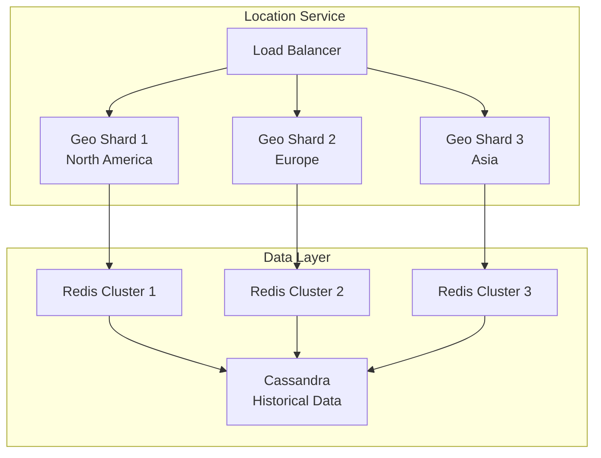
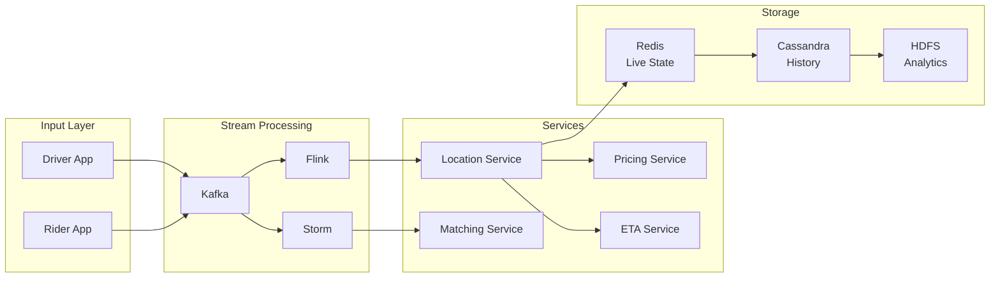
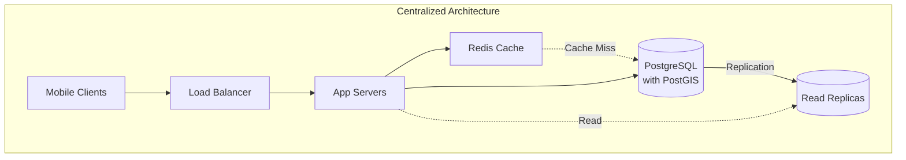
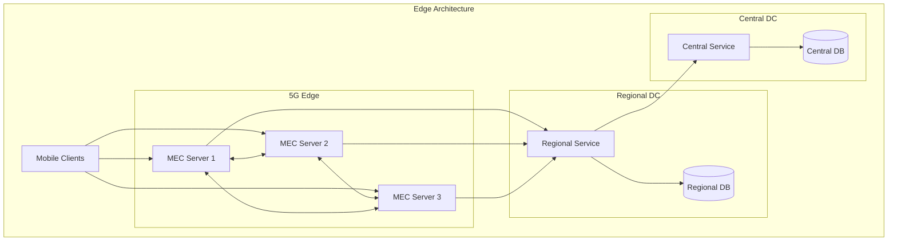
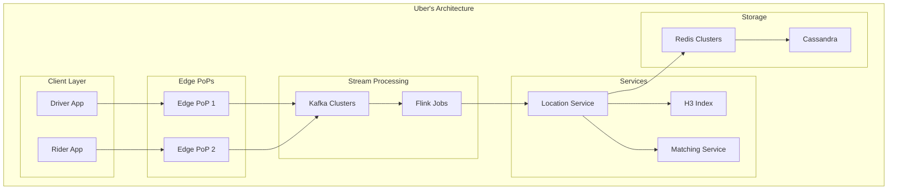

<!-- Navigation -->
[Home](../index.md) → [Case Studies](index.md) → **Uber's Real-Time Location System**

# 🚗 Uber's Real-Time Location System

**The Challenge**: Track millions of drivers and riders globally with sub-second updates

---

## 🏗️ Architecture Evolution

### Phase 1: Simple Polling (2009-2011)

```text
Driver App → API Gateway → MySQL → Dispatcher
```

**Problems Encountered:**
- Database couldn't handle write volume
- Polling overwhelmed servers
- No real-time updates

### Phase 2: In-Memory Grid (2011-2013)

```text
Driver App → Load Balancer → App Servers → Redis Cluster
                                         ↓
                                    MySQL (backup)
```

**Key Design Decision: Redis for Hot Data**
- **Trade-off**: Durability vs Speed
- **Choice**: Accept potential data loss for 100x performance
- **Result**: Sub-second updates achieved

### Phase 3: Geospatial Sharding (2013-2016)



**Innovation: H3 Hexagonal Grid System**
- World divided into hexagonal cells
- Hierarchical indexing (resolution 0-15)
- Efficient neighbor queries
- Predictable shard distribution

### Phase 4: Event-Driven Architecture (2016-Present)



---

## 🔬 Complete Axiom Analysis

### Comprehensive Axiom Mapping Table

| Design Decision | Axiom 1: Latency | Axiom 2: Capacity | Axiom 3: Failure | Axiom 4: Concurrency | Axiom 5: Coordination | Axiom 6: Observability | Axiom 7: Human Interface | Axiom 8: Economics |
|-----------------|------------------|-------------------|------------------|----------------------|----------------------|------------------------|--------------------------|-------------------|
| **H3 Hexagonal Grid** | 10ms lookup time vs 50ms for lat/lng | 40% less storage than rectangles | Cell boundaries remain stable | Parallel spatial queries | No coordinate conflicts | Clear cell ownership | Intuitive hex visualization | Reduces compute by 40% |
| **Geospatial Sharding** | Data locality reduces latency | Natural partition boundaries | City-level failure isolation | Independent city operations | No cross-city coordination | Per-city metrics | City-based debugging | Infrastructure per market |
| **Event Streaming (Kafka)** | Async processing, no blocking | Handles 40M events/sec | Replayable from any point | Multiple consumers | Ordered event delivery | Event flow tracing | Event-driven mental model | Shared infrastructure |
| **Redis for Live State** | Sub-ms reads, 5ms writes | In-memory scales horizontally | Replicas for failover | Optimistic concurrency | No distributed locks | Real-time metrics | Simple key-value model | Memory cost vs disk |
| **Adaptive Sampling** | Reduces network overhead | 68% less data transmitted | Graceful degradation | Per-driver rate limiting | Client-side decisions | Sampling rate metrics | Transparent to drivers | Bandwidth cost reduction |
| **Service Mesh** | Circuit breakers prevent cascades | Request routing at edge | Automatic failover | Retry with backoff | Distributed tracing | Service dependency maps | Clear service boundaries | Reduces ops overhead |
| **CRDT Location Updates** | Conflict-free by design | Mergeable across partitions | Eventually consistent | Concurrent updates safe | No coordination needed | Convergence tracking | Simple last-write-wins | No consensus overhead |
| **Predictive Caching** | Pre-warm common queries | Cache scales independently | Cache miss doesn't fail | Read-through pattern | TTL-based invalidation | Hit rate monitoring | Consistent behavior | Reduces backend load |
| **Multi-Region Architecture** | Local region <20ms | Regional capacity isolation | Region failure tolerance | Regional autonomy | Cross-region replication | Regional dashboards | Region-aware routing | Regional cost centers |

### Detailed Axiom Impact Analysis

### Axiom 1: Latency is Non-Zero
**Challenge**: Global system with speed-of-light constraints

**Solutions Applied**:
- Edge PoPs in 35+ locations
- Regional data centers
- Local caching strategies
- Predictive pre-computation

**Measured Impact**:
- P50 latency: 45ms
- P99 latency: 200ms
- Cross-region sync: 150-300ms

### Axiom 2: Capacity is Finite
**Challenge**: Exponential growth in location updates

**Solutions Applied**:
- Adaptive sampling (reduce updates when stationary)
- Compression (delta encoding)
- Tiered storage (hot/warm/cold)
- Intelligent batching

**Resource Optimization**:
```yaml
Before: 1 update/4 sec × 5M drivers = 1.25M writes/sec
After:  Variable rate + batching = 400K writes/sec (68% reduction)
```

### Axiom 3: Failure is Inevitable
**Challenge**: City-wide service dependencies

**Resilience Mechanisms**:
1. **Graceful Degradation**
   - Fallback to last known location
   - Increase update intervals
   - Switch to approximate matching

2. **Failure Isolation**
   - City-level sharding
   - Service mesh with circuit breakers
   - Independent failover per region

3. **Recovery Strategy**
   - Automatic traffic rerouting
   - Progressive rollback capability
   - State reconstruction from Kafka

### Axiom 4: Concurrency Requires Coordination
**Challenge**: Simultaneous updates from drivers/riders

**Coordination Approach**:
- Optimistic locking with version vectors
- CRDTs for location updates
- Event sourcing for state changes
- Idempotent operations

**Example: Driver State Machine**
```text
OFFLINE → ONLINE → DISPATCHED → EN_ROUTE → ARRIVED → IN_TRIP → OFFLINE
```

Each transition is an atomic operation with strict ordering guarantees.

---

## 🏛️ Architecture Alternatives

### Alternative 1: Centralized Database with Caching



### Alternative 2: Peer-to-Peer Mesh

```mermaid
graph TB
    subgraph "P2P Architecture"
        D1[Driver 1]
        D2[Driver 2]
        D3[Driver 3]
        D4[Driver 4]
        R1[Rider 1]
        R2[Rider 2]
        
        DHT[Distributed<br/>Hash Table]
        BS[Bootstrap<br/>Servers]
    end
    
    D1 <--> D2
    D2 <--> D3
    D3 <--> D4
    D4 <--> D1
    D1 <--> D3
    
    R1 --> DHT
    R2 --> DHT
    DHT --> D1
    
    All nodes -.-> BS
```

### Alternative 3: Edge Computing with 5G



### Alternative 4: Blockchain-Based Location

```mermaid
graph TB
    subgraph "Blockchain Architecture"
        D[Drivers]
        R[Riders]
        
        subgraph "Blockchain Network"
            N1[Node 1]
            N2[Node 2]
            N3[Node 3]
            N4[Node 4]
            BC[(Blockchain)]
        end
        
        subgraph "Off-chain"
            SC[State Channels]
            IPFS[IPFS Storage]
        end
    end
    
    D --> N1
    R --> N2
    
    N1 <--> N2
    N2 <--> N3
    N3 <--> N4
    N4 <--> N1
    
    All nodes --> BC
    
    D <--> SC
    R <--> SC
    SC --> IPFS
```

### Alternative 5: Uber's Chosen Architecture



## 📊 Architecture Trade-off Analysis

### Comprehensive Comparison Matrix

| Aspect | Centralized DB | P2P Mesh | Edge Computing | Blockchain | Uber's Choice |
|--------|----------------|----------|----------------|------------|---------------|
| **Latency** | ❌ 100-200ms | ⚠️ Variable (50-500ms) | ✅ <10ms at edge | ❌ Seconds | ✅ 45ms P50 |
| **Scalability** | ❌ Database bottleneck | ⚠️ O(log n) lookups | ✅ Edge scales | ❌ Limited TPS | ✅ Linear scaling |
| **Reliability** | ❌ SPOF at DB | ✅ No SPOF | ✅ Edge redundancy | ✅ Immutable | ✅ 99.97% uptime |
| **Consistency** | ✅ Strong | ❌ Eventually consistent | ⚠️ Edge sync issues | ✅ Consensus | ⚠️ Eventual |
| **Cost** | ✅ Simple, predictable | ✅ Minimal infrastructure | ❌ Edge expensive | ❌ High compute | ⚠️ Moderate |
| **Privacy** | ❌ Centralized data | ✅ Distributed | ⚠️ Telco dependency | ⚠️ Public ledger | ⚠️ Centralized |
| **Complexity** | ✅ Simple | ❌ NAT, connectivity | ❌ Edge orchestration | ❌ Very complex | ⚠️ Moderate |
| **Global Scale** | ❌ Latency issues | ❌ Discovery problems | ✅ Local processing | ❌ Sync delays | ✅ Multi-region |

### Decision Factors for Architecture Selection

| Factor | Weight | Centralized | P2P | Edge | Blockchain | Uber |
|--------|--------|------------|-----|------|------------|------|
| **Real-time Updates** | 30% | 2/10 | 4/10 | 9/10 | 1/10 | 8/10 |
| **Global Scale** | 25% | 3/10 | 5/10 | 8/10 | 2/10 | 9/10 |
| **Cost Efficiency** | 20% | 8/10 | 9/10 | 3/10 | 1/10 | 7/10 |
| **Reliability** | 15% | 4/10 | 7/10 | 8/10 | 9/10 | 8/10 |
| **Developer Experience** | 10% | 9/10 | 3/10 | 5/10 | 2/10 | 7/10 |
| **Total Score** | 100% | 4.7/10 | 5.8/10 | 6.9/10 | 2.4/10 | **7.9/10** |

---

## 💡 Key Design Decisions

### 1. Push vs Pull Architecture
**Decision**: Hybrid approach
- **Push**: Driver location updates
- **Pull**: Rider queries for nearby drivers

**Rationale**: Minimize unnecessary data transfer while ensuring freshness

### 2. Consistency Model
**Decision**: Eventual consistency with bounded staleness
- Location updates: Best effort
- Trip state: Strong consistency
- Billing: Exactly-once processing

### 3. Storage Architecture
**Decision**: Polyglot persistence
- Redis: Live locations (TTL: 5 minutes)
- Cassandra: Historical data (TTL: 30 days)
- S3/HDFS: Archive (indefinite)

### 4. Matching Algorithm
**Decision**: Hierarchical search with ML ranking
```text
1. Coarse filter: H3 cells within radius
2. Fine filter: Actual distance calculation
3. ML ranking: Driver behavior, traffic, history
4. Assignment: Distributed lock for atomicity
```

---

## 📊 Production Metrics

### System Performance (2023)
- **Availability**: 99.97% (exceeded target)
- **Peak Load**: 40M concurrent users
- **Data Volume**: 100TB daily
- **API Calls**: 50B daily

### Infrastructure Scale
- **Servers**: 45,000+ globally
- **Data Centers**: 20 regions
- **Edge PoPs**: 35 locations
- **Network**: 100+ Gbps aggregate

### Cost Optimization
- **Per-trip infrastructure cost**: $0.003
- **YoY efficiency gain**: 35%
- **Resource utilization**: 78%

---

## 🧪 Failure Scenarios & Mitigations

### Scenario 1: Regional Data Center Failure
**Impact**: 5M users affected
**Mitigation**:
- Auto-failover to nearest DC (< 30s)
- Degraded mode with cached data
- Progressive restoration

### Scenario 2: Kafka Cluster Partition
**Impact**: Location update delays
**Mitigation**:
- Multi-cluster setup with mirroring
- Client-side buffering
- Automatic repartitioning

### Scenario 3: Redis Memory Exhaustion
**Impact**: Cannot store new locations
**Mitigation**:
- Aggressive TTL enforcement
- Emergency eviction policies
- Overflow to secondary storage

---

## 🎓 Lessons Learned

### What Worked Well
1. **H3 Hexagonal Grid**: 40% efficiency gain over lat/lng boxes
2. **Event Sourcing**: Simplified debugging and replay capability
3. **Polyglot Persistence**: Right tool for each use case
4. **Service Mesh**: Reduced cascading failures by 80%

### What Didn't Work
1. **Initial MongoDB attempt**: Couldn't handle geospatial queries at scale
2. **Synchronous matching**: Created bottlenecks during surge
3. **Global consistency**: Unnecessary and expensive

### Key Takeaways
- **Design for degradation**: System should work with stale data
- **Shard by geography**: Natural partition boundary
- **Embrace eventual consistency**: Strong consistency only where needed
- **Monitor everything**: Observability is critical at scale

---

## 🔗 References & Deep Dives

### Related Patterns
- [Geospatial Sharding](../patterns/sharding.md)
- [Event Sourcing](../patterns/event-sourcing.md)
- [Circuit Breaker](../patterns/circuit-breaker.md)
- [CQRS](../patterns/cqrs.md)

### Similar Systems
- [Lyft's Location Service](https://eng.lyft.com/geospatial-indexing)
- [DoorDash's Dispatch System](https://doordash.engineering/dispatch)
- [Google Maps Real-time Traffic](https://maps.google.com/architecture)

### Technical Deep Dives
- [H3 Hexagonal Indexing](https://h3geo.org/)
- [Uber's Ringpop](https://github.com/uber/ringpop)
- [Uber Engineering Blog](https://eng.uber.com/)

---

---

*"At Uber's scale, the speed of light becomes a real constraint in system design."*

---

**Next**: [Amazon DynamoDB →](amazon-dynamo.md)
