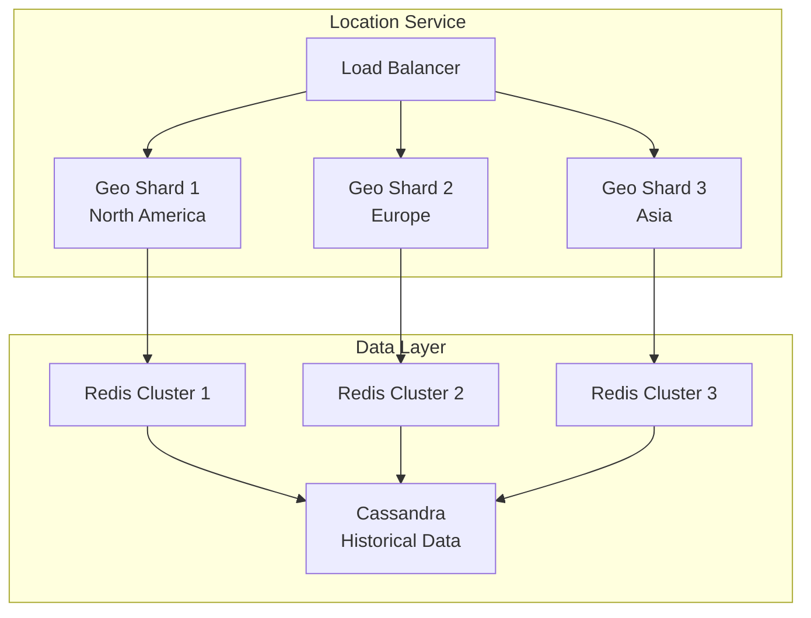
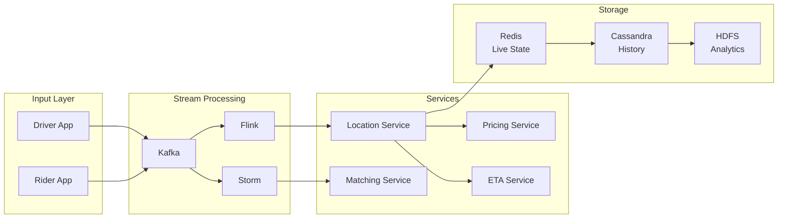

# 🚗 Uber's Real-Time Location System

**The Challenge**: Track millions of drivers and riders globally with sub-second updates

<div class="case-study">
<h3>📊 System Requirements</h3>

**Scale Constraints:**
- 15M trips daily across 900+ cities
- 5M active drivers globally  
- Location updates every 4 seconds
- Sub-500ms dispatch latency required
- 99.99% availability target

**Critical Features:**
- Real-time driver tracking
- Efficient rider-driver matching
- Accurate ETA calculation
- Surge pricing computation
- Geofence monitoring
</div>

---

## 🏗️ Architecture Evolution

### Phase 1: Simple Polling (2009-2011)

```
Driver App → API Gateway → MySQL → Dispatcher
```

**Problems Encountered:**
- Database couldn't handle write volume
- Polling overwhelmed servers
- No real-time updates

### Phase 2: In-Memory Grid (2011-2013)

```
Driver App → Load Balancer → App Servers → Redis Cluster
                                         ↓
                                    MySQL (backup)
```

**Key Design Decision: Redis for Hot Data**
- **Trade-off**: Durability vs Speed
- **Choice**: Accept potential data loss for 100x performance
- **Result**: Sub-second updates achieved

### Phase 3: Geospatial Sharding (2013-2016)



**Innovation: H3 Hexagonal Grid System**
- World divided into hexagonal cells
- Hierarchical indexing (resolution 0-15)
- Efficient neighbor queries
- Predictable shard distribution

### Phase 4: Event-Driven Architecture (2016-Present)



---

## 🔬 Axiom Analysis

### Axiom 1: Latency is Non-Zero
**Challenge**: Global system with speed-of-light constraints

**Solutions Applied**:
- Edge PoPs in 35+ locations
- Regional data centers
- Local caching strategies
- Predictive pre-computation

**Measured Impact**:
- P50 latency: 45ms
- P99 latency: 200ms
- Cross-region sync: 150-300ms

### Axiom 2: Capacity is Finite
**Challenge**: Exponential growth in location updates

**Solutions Applied**:
- Adaptive sampling (reduce updates when stationary)
- Compression (delta encoding)
- Tiered storage (hot/warm/cold)
- Intelligent batching

**Resource Optimization**:
```
Before: 1 update/4 sec × 5M drivers = 1.25M writes/sec
After:  Variable rate + batching = 400K writes/sec (68% reduction)
```

### Axiom 3: Failure is Inevitable
**Challenge**: City-wide service dependencies

**Resilience Mechanisms**:
1. **Graceful Degradation**
   - Fallback to last known location
   - Increase update intervals
   - Switch to approximate matching

2. **Failure Isolation**
   - City-level sharding
   - Service mesh with circuit breakers
   - Independent failover per region

3. **Recovery Strategy**
   - Automatic traffic rerouting
   - Progressive rollback capability
   - State reconstruction from Kafka

### Axiom 4: Concurrency Requires Coordination
**Challenge**: Simultaneous updates from drivers/riders

**Coordination Approach**:
- Optimistic locking with version vectors
- CRDTs for location updates
- Event sourcing for state changes
- Idempotent operations

**Example: Driver State Machine**
```
OFFLINE → ONLINE → DISPATCHED → EN_ROUTE → ARRIVED → IN_TRIP → OFFLINE
```

Each transition is an atomic operation with strict ordering guarantees.

---

## 💡 Key Design Decisions

### 1. Push vs Pull Architecture
**Decision**: Hybrid approach
- **Push**: Driver location updates
- **Pull**: Rider queries for nearby drivers

**Rationale**: Minimize unnecessary data transfer while ensuring freshness

### 2. Consistency Model
**Decision**: Eventual consistency with bounded staleness
- Location updates: Best effort
- Trip state: Strong consistency
- Billing: Exactly-once processing

### 3. Storage Architecture
**Decision**: Polyglot persistence
- Redis: Live locations (TTL: 5 minutes)
- Cassandra: Historical data (TTL: 30 days)
- S3/HDFS: Archive (indefinite)

### 4. Matching Algorithm
**Decision**: Hierarchical search with ML ranking
```
1. Coarse filter: H3 cells within radius
2. Fine filter: Actual distance calculation
3. ML ranking: Driver behavior, traffic, history
4. Assignment: Distributed lock for atomicity
```

---

## 📊 Production Metrics

### System Performance (2023)
- **Availability**: 99.97% (exceeded target)
- **Peak Load**: 40M concurrent users
- **Data Volume**: 100TB daily
- **API Calls**: 50B daily

### Infrastructure Scale
- **Servers**: 45,000+ globally
- **Data Centers**: 20 regions
- **Edge PoPs**: 35 locations
- **Network**: 100+ Gbps aggregate

### Cost Optimization
- **Per-trip infrastructure cost**: $0.003
- **YoY efficiency gain**: 35%
- **Resource utilization**: 78%

---

## 🧪 Failure Scenarios & Mitigations

### Scenario 1: Regional Data Center Failure
**Impact**: 5M users affected
**Mitigation**: 
- Auto-failover to nearest DC (< 30s)
- Degraded mode with cached data
- Progressive restoration

### Scenario 2: Kafka Cluster Partition
**Impact**: Location update delays
**Mitigation**:
- Multi-cluster setup with mirroring
- Client-side buffering
- Automatic repartitioning

### Scenario 3: Redis Memory Exhaustion
**Impact**: Cannot store new locations
**Mitigation**:
- Aggressive TTL enforcement
- Emergency eviction policies
- Overflow to secondary storage

---

## 🎓 Lessons Learned

### What Worked Well
1. **H3 Hexagonal Grid**: 40% efficiency gain over lat/lng boxes
2. **Event Sourcing**: Simplified debugging and replay capability
3. **Polyglot Persistence**: Right tool for each use case
4. **Service Mesh**: Reduced cascading failures by 80%

### What Didn't Work
1. **Initial MongoDB attempt**: Couldn't handle geospatial queries at scale
2. **Synchronous matching**: Created bottlenecks during surge
3. **Global consistency**: Unnecessary and expensive

### Key Takeaways
- **Design for degradation**: System should work with stale data
- **Shard by geography**: Natural partition boundary
- **Embrace eventual consistency**: Strong consistency only where needed
- **Monitor everything**: Observability is critical at scale

---

## 🔗 References & Deep Dives

### Related Patterns
- [Geospatial Sharding](../patterns/sharding.md)
- [Event Sourcing](../patterns/event-sourcing.md)
- [Circuit Breaker](../patterns/circuit-breaker.md)
- [CQRS](../patterns/cqrs.md)

### Similar Systems
- [Lyft's Location Service](https://eng.lyft.com/geospatial-indexing)
- [DoorDash's Dispatch System](https://doordash.engineering/dispatch)
- [Google Maps Real-time Traffic](https://maps.google.com/architecture)

### Technical Deep Dives
- [H3 Hexagonal Indexing](https://h3geo.org/)
- [Uber's Ringpop](https://github.com/uber/ringpop)
- [Uber Engineering Blog](https://eng.uber.com/)

---

<div class="navigation-footer">
<div class="case-study-nav">
**Next Case Study**: [Amazon DynamoDB →](/case-studies/amazon-dynamo/)

**Return to**: [All Case Studies](/case-studies/) • [Home](/)
</div>
</div>

---

*"At Uber's scale, the speed of light becomes a real constraint in system design."*