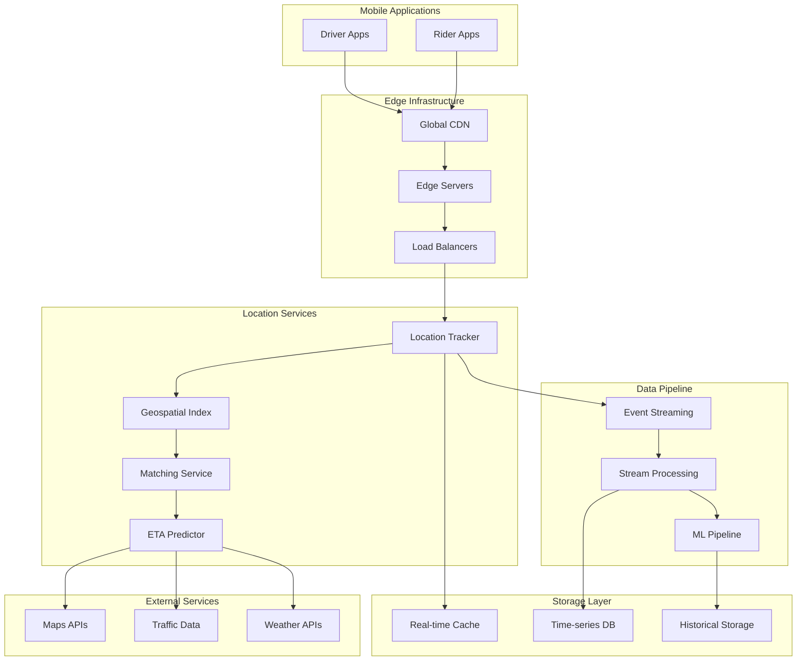
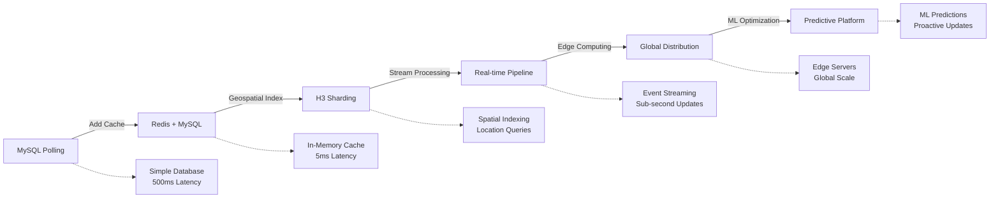

# Uber's Real-Time Location System: Scale and Architecture Deep Dive

!!! abstract "Quick Facts"
| Metric | Value |
 |--------|-------|
 | **Scale** | 15+ million active drivers |
 | **Throughput** | 100M+ location updates/day |
 | **Data Volume** | Petabytes of location data |
 | **Availability** | 99.99% uptime globally |
 | **Team Size** | 300+ engineers in maps/location |

## Executive Summary

Uber's real-time location system evolved from simple database polling to a sophisticated geospatial platform handling millions of location updates per second. The system demonstrates how to build location-aware services at planetary scale, using innovations in geospatial indexing (H3), stream processing, and edge computing. This architecture powers not just ride-sharing but also food delivery, freight logistics, and urban mobility solutions.

## System Overview

### Business Context

- :material-target:{ .lg .middle } **Problem Space**
    
    ---
    
    Track 40M+ concurrent users with 4-second location updates for optimal driver-rider matching (15M drivers, 25M riders)

- :material-alert:{ .lg .middle } **Constraints**
    
    ---
    
    Battery life optimization, network variability, regulatory compliance, privacy requirements

- :material-chart-line:{ .lg .middle } **Success Metrics**
    
    ---
    
    4-second location updates, 99.99% availability, <5% ETA error rate, <15s matching time

### High-Level Architecture

## Mapping to Fundamental Laws

### Law Analysis

<table class="responsive-table">
<thead>
 <tr>
 <th>Law</th>
 <th>Challenge</th>
 <th>Solution</th>
 <th>Trade-off</th>
 </tr>
</thead>
<tbody>
 <tr>
 <td data-label="Law">Correlated Failure</td>
 <td data-label="Challenge">Regional outages affecting entire cities</td>
 <td data-label="Solution">Multi-region deployment, data center failover</td>
 <td data-label="Trade-off">3x infrastructure cost, complex data sync</td>
 </tr>
 <tr>
 <td data-label="Law">Asynchronous Reality</td>
 <td data-label="Challenge">Mobile network latency affecting real-time updates</td>
 <td data-label="Solution">Edge servers, adaptive update rates, prediction</td>
 <td data-label="Trade-off">Increased complexity, edge infrastructure costs</td>
 </tr>
 <tr>
 <td data-label="Law">Emergent Chaos</td>
 <td data-label="Challenge">Millions of concurrent location updates</td>
 <td data-label="Solution">Event-driven architecture, H3 geospatial indexing</td>
 <td data-label="Trade-off">Eventually consistent location data</td>
 </tr>
 <tr>
 <td data-label="Law">Multidimensional Optimization</td>
 <td data-label="Challenge">Balance battery life, accuracy, and freshness</td>
 <td data-label="Solution">Adaptive location sampling, ML-based optimization</td>
 <td data-label="Trade-off">Complex algorithms, higher computational cost</td>
 </tr>
 <tr>
 <td data-label="Law">Distributed Knowledge</td>
 <td data-label="Challenge">Monitoring location accuracy across global fleet</td>
 <td data-label="Solution">Real-time dashboards, anomaly detection, location quality metrics</td>
 <td data-label="Trade-off">Significant monitoring infrastructure overhead</td>
 </tr>
 <tr>
 <td data-label="Law">Cognitive Load</td>
 <td data-label="Challenge">Complex geospatial operations and coordinate systems</td>
 <td data-label="Solution">H3 hexagonal indexing, standardized APIs</td>
 <td data-label="Trade-off">Learning curve for new coordinate system</td>
 </tr>
 <tr>
 <td data-label="Law">Economic Reality</td>
 <td data-label="Challenge">Mobile data costs and server infrastructure at scale</td>
 <td data-label="Solution">Efficient protocols, edge caching, predictive pre-loading</td>
 <td data-label="Trade-off">Complex optimization algorithms and edge infrastructure</td>
 </tr>
</tbody>
</table>

## Design Deep Dive

### Data Architecture

!!! tip "Key Design Decisions"
 1. **H3 Geospatial Indexing**: Hexagonal grid system for efficient location queries and spatial analysis
 2. **Multi-layered Caching**: Hot data in Redis, warm data in Cassandra, cold data in S3
 3. **Adaptive Location Updates**: Dynamic update frequency based on movement patterns and context
 4. **Event-Driven Processing**: Kafka-based streaming for real-time location pipeline

### Scaling Strategy

## Failure Scenarios & Lessons

!!! danger "Major Incident: New Year's Eve 2016 Location Overload"
 **What Happened**: Massive surge in ride requests during New Year's celebrations overwhelmed location tracking systems, causing driver locations to appear stale or incorrect.

 **Root Cause**: 
 - 10x normal traffic spike during peak celebration hours
 - Location update queues backed up due to insufficient capacity
 - Cache invalidation storms from rapid location changes
 - Network congestion in dense urban areas

 **Impact**: 
 - 3 hours of degraded location accuracy
 - 30% increase in wait times due to poor driver matching
 - Customer complaints about "phantom" nearby drivers
 - Revenue loss during peak demand period

 **Lessons Learned**:
 1. **Predictive scaling**: Implement automated scaling based on event calendars and historical patterns
 2. **Queue management**: Add backpressure and priority queuing for location updates
 3. **Graceful degradation**: Fall back to last-known-good locations when real-time fails

## Performance Characteristics

### Latency Breakdown

- :material-map-marker:{ .lg .middle } **Location Update**
    
    ---
    
    **200ms** average latency
    
    Processing 1M updates/second at peak

- :material-magnify:{ .lg .middle } **Driver Search**
    
    ---
    
    **50ms** p99 latency
    
    Searching within 5km radius across 15M drivers

- :material-clock-fast:{ .lg .middle } **ETA Calculation**
    
    ---
    
    **100ms** average time
    
    ML model with <5% error rate on actual arrival

### Resource Utilization

| Resource | Usage | Details |
|----------|-------|---------|
| Mobile Data | 1-2 MB/hour | 80% compression ratio using protobuf |
| Server CPU | 70-80% | Processing 1M QPS during peak (8-10PM) |
| Memory | 60-70% | 500GB Redis cluster for hot locations |
| Network | 10 Gbps peak | 90% reduction via edge caching |
| Storage | 50TB/day | Location history retained for 90 days |

## Operational Excellence

### Monitoring & Observability

- **Metrics**: Location accuracy, update frequency, driver density per geohash, matching success rates
- **Logging**: Structured logs with driver/trip correlation IDs for end-to-end tracing
- **Tracing**: Distributed tracing from mobile app to backend services
- **Alerting**: SLO-based alerts for location freshness, availability, and accuracy

### Deployment Strategy

!!! note
 **Deployment Frequency**: Multiple times per day with canary releases
 **Rollout Strategy**: Geographic rollout starting with low-traffic regions
 **Rollback Time**: < 5 minutes with automated traffic shifting
 **Feature Flags**: Extensive use for location algorithm experiments and A/B testing

## Key Innovations

1. **H3 Hexagonal Indexing**: Uber open-sourced this geospatial indexing system for efficient location operations
2. **Adaptive Location Sampling**: Dynamic update frequency based on movement patterns, battery, and network conditions
3. **Predictive ETAs**: Machine learning models using historical traffic, weather, and event data

## Pattern Excellence Analysis

### Gold Patterns Powering Real-Time Location

- :material-hexagon-multiple:{ .lg .middle } **[Geospatial Indexing](../../patterns/spatial-indexing)** 🥇
    
    ---
    
    **Uber Scale**: 15M+ drivers tracked across 10,000+ cities
    
    **H3 Implementation**: 13 resolution levels, from continents to street corners
    
    **Success Metric**: 50ms p99 spatial queries at any scale
    
    **Open Source**: [H3 Library](https://h3geo.org)

- :material-broadcast:{ .lg .middle } **[Event Streaming](../../patterns/event-streaming)** 🥇
    
    ---
    
    **Uber Scale**: 100M+ location events/day through Kafka
    
    **Implementation**: 500+ Kafka brokers, 5PB storage
    
    **Success Metric**: < 100ms end-to-end latency
    
    **Key Learning**: Partitioned by geohash for locality

- :material-layers-triple:{ .lg .middle } **[Multi-Level Cache](../../patterns/caching-strategies)** 🥇
    
    ---
    
    **Cache Hierarchy**:
    - L1: Local app cache (< 1ms)
    - L2: Redis cluster (< 5ms)
    - L3: Cassandra (< 50ms)
    - L4: S3 archive (< 500ms)
    
    **Success Metric**: 95% L1/L2 hit rate

- :material-cloud-outline:{ .lg .middle } **[Edge Computing](../../patterns/edge-computing)** 🥇
    
    ---
    
    **Uber Scale**: 200+ edge locations in 65 countries
    
    **Implementation**: Regional processing reduces core load 70%
    
    **Success Metric**: 50ms latency improvement globally

### Silver Patterns for Optimization

- :material-sine-wave:{ .lg .middle } **[Adaptive Sampling](../../patterns/adaptive-sampling)** 🥈
    
    ---
    
    **Dynamic Updates**: 1Hz when moving, 0.1Hz when stationary
    
    **Battery Saved**: 60% reduction in power usage
    
    **Trade-off**: Slight accuracy loss when accelerating

- :material-crystal-ball:{ .lg .middle } **[Predictive Caching](../../patterns/predictive-caching)** 🥈
    
    ---
    
    **ML Model**: Predicts next location with 85% accuracy
    
    **Cache Warming**: Pre-loads map tiles and driver data
    
    **Trade-off**: 20% more cache storage needed

- :material-puzzle:{ .lg .middle } **[Data Partitioning](../../patterns/data-partitioning)** 🥈
    
    ---
    
    **Geospatial Shards**: 1024 shards by H3 level 4
    
    **Load Distribution**: Even distribution across regions
    
    **Trade-off**: Cross-shard queries for long trips

### Bronze Pattern Evolution

<h4>🔄 From Polling to Streaming</h4>

Uber's location system evolution (2009-2015):

1. **2009**: PHP + MySQL with 30-second polling
2. **2011**: Redis cache layer added, 5-second updates
3. **2013**: Kafka streaming introduced
4. **2015**: Full event-driven architecture

**Key Insight**: The polling approach worked until ~1M daily rides, then hit scaling limits.

**Migration Steps**:
- Dual-write to both systems
- Gradual traffic migration by city
- Complete cutover after 6 months

[View Streaming Migration Guide →](../../excellence/migrations/polling-to-streaming)

## Related Topics

### Related Laws & Axioms
- [Law 1: Correlated Failure](../part1-axioms/law1-failure/index.md) - Multi-region prevents city-wide outages
- [Law 2: Asynchronous Reality](../part1-axioms/law2-asynchrony/index.md) - Edge servers handle network latency
- [Law 3: Emergent Chaos](../part1-axioms/law3-emergence/index.md) - Event-driven handles 1M updates/sec
- [Law 4: Multidimensional Optimization](../part1-axioms/law4-tradeoffs/index.md) - Battery vs accuracy trade-offs

### Related Patterns
- [Geospatial Indexing](../patterns/spatial-indexing.md) - H3 hexagonal grid system
- [Event Streaming](../patterns/event-streaming.md) - Kafka processing 100M events/day
- [Edge Computing](../patterns/edge-computing.md) - 200+ edge locations globally
- [Time-Series Storage](../patterns/time-series-ids.md) - Cassandra for location history

### Related Pillars
- [Pillar 1: Work](../part2-pillars/work/index.md) - Geospatial sharding across regions
- [Pillar 2: State](../part2-pillars/state/index.md) - Multi-layer location caching
- [Pillar 5: Intelligence](../part2-pillars/intelligence/index.md) - ML-based ETA prediction

### Case Studies
- [Google Maps](google-maps.md) - Similar scale location challenges
- [Uber Maps](uber-maps.md) - Mapping infrastructure for location services
- [Nearby Friends](nearby-friends.md) - Location-based proximity service

## Takeaways for Your System

!!! quote "Key Lessons"
 1. **When to apply**: Use for any application requiring real-time location tracking, geospatial queries, or location-based services
 2. **When to avoid**: Don't use this complexity for applications with simple location needs or low update frequencies
 3. **Cost considerations**: Expect significant infrastructure costs for real-time geospatial processing at scale
 4. **Team requirements**: Need expertise in geospatial algorithms, mobile optimization, and stream processing

## Cross-References to Fundamental Laws

### Related Laws (Part I)
- **[Law 1: Correlated Failure](../part1-axioms/law1-failure/index.md)** - Multi-region deployment prevents city-wide service outages during infrastructure failures
- **[Law 2: Asynchronous Reality](../part1-axioms/law2-asynchrony/index.md)** - Edge servers and predictive updates compensate for mobile network latency
- **[Law 3: Emergent Chaos](../part1-axioms/law3-emergence/index.md)** - Event-driven architecture handles millions of concurrent location updates
- **[Law 4: Multidimensional Optimization](../part1-axioms/law4-tradeoffs/index.md)** - Balance battery life, accuracy, and real-time requirements through adaptive algorithms
- **[Law 5: Distributed Knowledge](../part1-axioms/law5-epistemology/index.md)** - Comprehensive monitoring of location quality and system health across global infrastructure
- **[Law 6: Cognitive Load](../part1-axioms/law6-human-api/index.md)** - H3 indexing simplifies complex geospatial operations for developers
- **[Law 7: Economic Reality](../part1-axioms/law7-economics/index.md)** - Edge computing and compression optimize mobile data costs

### Related Pillars (Part II)
- **[Work Distribution](../part2-pillars/work/index.md)** - Geospatial sharding distributes location processing across regions
- **[State Distribution](../part2-pillars/state/index.md)** - Multi-layered caching strategy for location data at different time scales
- **[Intelligence Distribution](../part2-pillars/intelligence/index.md)** - ML-based prediction algorithms deployed at edge locations

### Related Patterns (Part III)
- **[Geospatial Indexing](../patterns/spatial-indexing.md)** - H3 hexagonal grid system for efficient spatial queries
- **[Event Streaming](../patterns/event-streaming)** - Kafka-based real-time location update pipeline
- **[Multi-Level Caching](../patterns/caching-strategies)** - Hot/warm/cold storage architecture for location data

## Excellence Resources

### Implementation Guides
- [Real-Time Systems Guide](../../excellence/implementation-guides/real-time-systems) - Building sub-second latency systems
- [Geo-Distributed Systems](../../excellence/implementation-guides/geo-distributed-systems) - Managing global location data
- [Mobile Optimization Playbook](../../excellence/implementation-guides/mobile-optimization) - Battery and bandwidth optimization

### Related Case Studies
- [Google Maps: Planet-Scale Mapping](google-maps.md) - Compare geospatial approaches
- [Lyft: Competitive Location Platform](proximity-service.md) - Similar scale, different architecture
- [Life360: Family Location Sharing](life360.md) - Consumer-scale location tracking
- [Strava: Athletic Performance Tracking](strava-heatmaps.md) - High-frequency location updates

### Pattern Comparisons
- [H3 vs S2 vs Geohash](../../excellence/comparisons/geospatial-indexing) - Choosing the right spatial index
- [Streaming vs Polling Trade-offs](../../excellence/comparisons/streaming-vs-polling) - When to migrate
- [Edge vs Central Processing](../../excellence/comparisons/edge-vs-central) - Location processing strategies

## Further Reading

- [H3: Uber's Hexagonal Hierarchical Spatial Index](https://eng.uber.com/h3/)
- [Real-time Location Platform at Uber](https://eng.uber.com/realtime-location-platform/)
- [Scaling Uber's Real-time Market Platform](https://eng.uber.com/real-time-market-platform/)
- [Geospatial Indexing at Uber](https://eng.uber.com/geospatial-indexing-at-uber/)

## Discussion Questions

1. How does Uber's H3 geospatial indexing system compare to traditional geographic coordinate systems?
2. What are the trade-offs between location update frequency and mobile battery life?
3. How would you design a location system that maintains privacy while enabling efficient matching?
4. What are the implications of eventual consistency in location data for ride-matching algorithms?