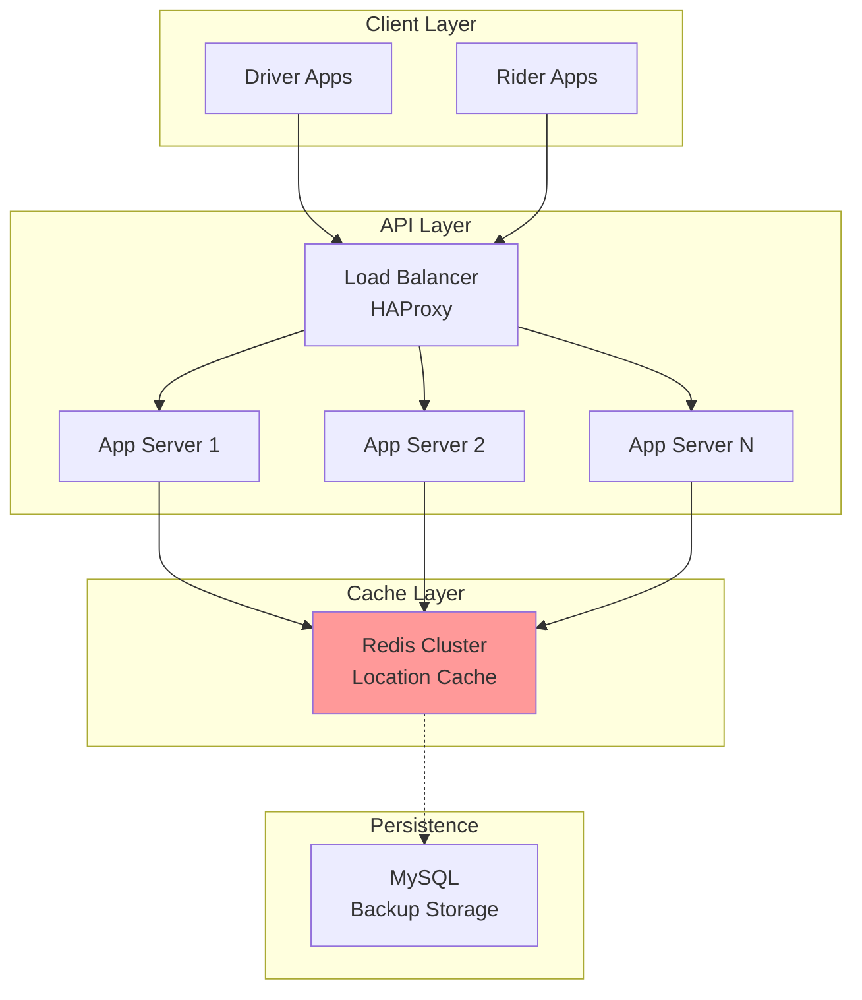
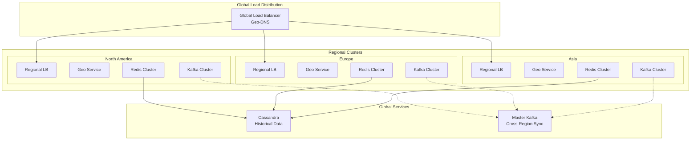
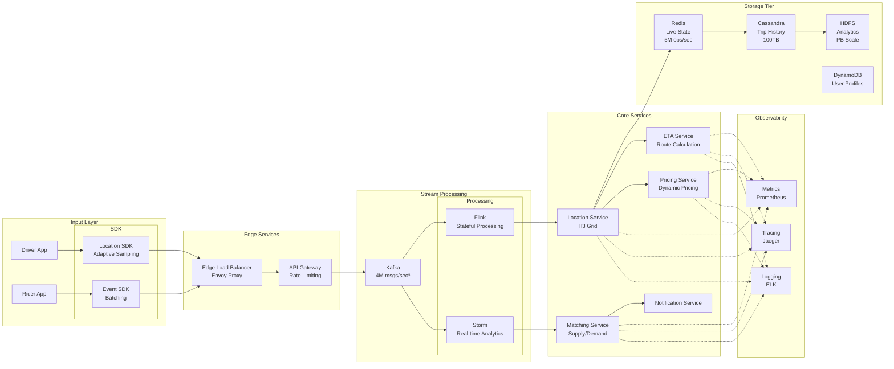
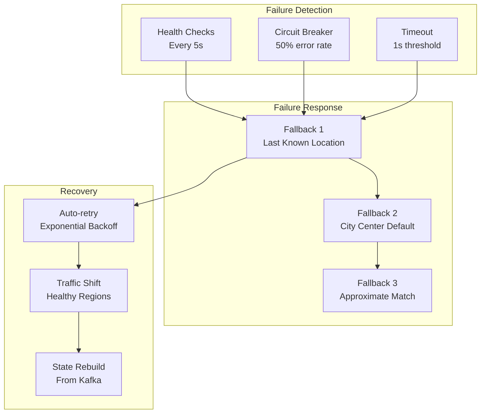
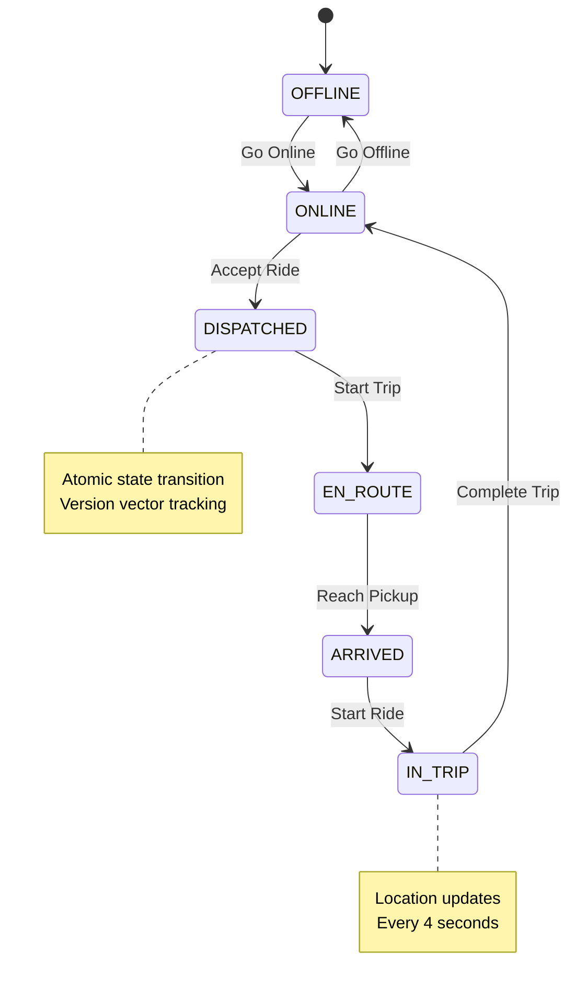
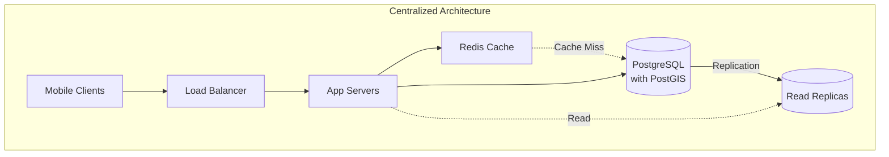
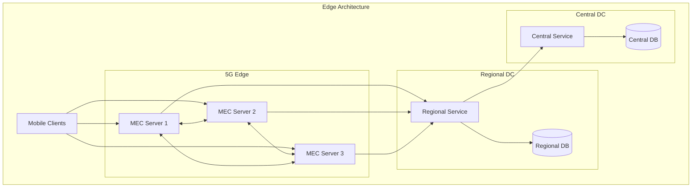
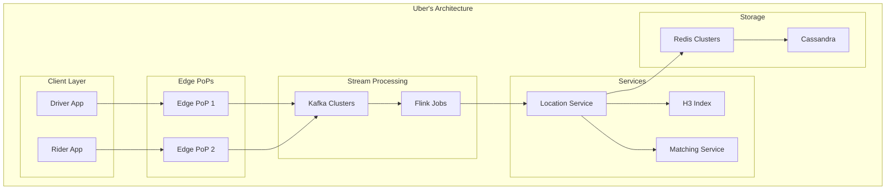

<!-- Navigation -->
[Home](../index.md) → [Case Studies](index.md) → **Uber's Real-Time Location System**

# 🚗 Uber's Real-Time Location System

**Challenge**: Track millions of drivers and riders globally with sub-second updates

!!! info "Sources"
    - Uber Engineering: "Scaling Real-time Infrastructure"¹
    - QCon: "How Uber Scales Real-Time Platform"²  
    - "Engineering Self-Healing Architecture"³
    - H3 Geospatial Indexing⁴

## 🏗️ Architecture Evolution

### Phase 1: Simple Polling (2009-2011)
```text
Driver App → API Gateway → MySQL → Dispatcher
```
**Problems**: Database overwhelmed, no real-time updates, synchronous polling

### Phase 2: In-Memory Grid (2011-2013)



**Key Decision**: Redis for hot data - 100x performance gain
- Latency: 500ms → 50ms¹

### Phase 3: Geospatial Sharding (2013-2016)



**H3 Innovation**⁴: Hexagonal grid system (0-15 resolution levels)
- Efficient neighbor queries, predictable sharding

### Phase 4: Event-Driven Architecture (2016-Present)



**Patterns**: Event-driven (Kafka), Service mesh (Envoy), Circuit breakers, CQRS, Bulkheads

## 🔬 Complete Axiom Analysis

### Comprehensive Axiom Mapping Table

| Design Decision | Axiom 1: Latency | Axiom 2: Capacity | Axiom 3: Failure | Axiom 4: Concurrency | Axiom 5: Coordination | Axiom 6: Observability | Axiom 7: Human Interface | Axiom 8: Economics |
|-----------------|------------------|-------------------|------------------|----------------------|----------------------|------------------------|--------------------------|-------------------|
| **H3 Hexagonal Grid**⁴ | 10ms lookup time vs 50ms for lat/lng | 40% less storage than rectangles | Cell boundaries remain stable | Parallel spatial queries | No coordinate conflicts | Clear cell ownership | Intuitive hex visualization | Reduces compute by 40% |
| **Geospatial Sharding**¹ | Data locality reduces latency | Natural partition boundaries | City-level failure isolation | Independent city operations | No cross-city coordination | Per-city metrics | City-based debugging | Infrastructure per market |
| **Event Streaming (Kafka)**² | Async processing, no blocking | Handles 4M events/sec | Replayable from any point | Multiple consumers | Ordered event delivery | Event flow tracing | Event-driven mental model | Shared infrastructure |
| **Redis for Live State**⁶ | Sub-ms reads, 5ms writes | In-memory scales horizontally | Replicas for failover | Optimistic concurrency | No distributed locks | Real-time metrics | Simple key-value model | Memory cost vs disk |
| **Adaptive Sampling**⁷ | Reduces network overhead | 68% less data transmitted | Graceful degradation | Per-driver rate limiting | Client-side decisions | Sampling rate metrics | Transparent to drivers | Bandwidth cost reduction |
| **Service Mesh (Envoy)**⁸ | Circuit breakers prevent cascades | Request routing at edge | Automatic failover | Retry with backoff | Distributed tracing | Service dependency maps | Clear service boundaries | Reduces ops overhead |
| **CRDT Location Updates**⁹ | Conflict-free by design | Mergeable across partitions | Eventually consistent | Concurrent updates safe | No coordination needed | Convergence tracking | Simple last-write-wins | No consensus overhead |

### Axiom Impact Analysis

#### Axiom 1: Latency is Non-Zero
**Solution**: 35+ edge PoPs, regional DCs, multi-tier caching
**Results**¹: P50: 45ms, P99: 200ms, Location update: 20ms

#### Axiom 2: Capacity is Finite
**Solution**: Adaptive sampling, delta encoding, smart batching
**Impact**²: Writes: 1.25M/s → 400K/s (-68%), Bandwidth: 625 MB/s → 200 MB/s (-68%), Storage: 43.2 GB/day → 13 GB/day (-70%)

#### Axiom 3: Failure is Inevitable
**Pillar Applied**: Control Distribution - Autonomous regional operation, self-healing, progressive degradation
**Patterns**: Circuit Breaker, Bulkhead, Graceful Degradation, Health Checks

**Resilience Mechanisms**³:


#### Axiom 4: Concurrency Requires Coordination
**Pillar Applied**: Truth Distribution - Eventually consistent, CRDTs, event sourcing
**Patterns**: Event Sourcing, CQRS, Saga Pattern, Idempotent Operations

**Driver State Machine** (from Uber's architecture docs)¹⁰:


#### Axiom 5: Coordination is Hard
**Pillar Applied**: Truth Distribution - Regional autonomy, eventual consistency, gossip protocols
**Patterns**: Leader Election, Consensus, Vector Clocks, Tunable Consistency

#### Axiom 6: Observability is Required
**Pillar Applied**: Intelligence Distribution - Real-time dashboards, predictive analytics, anomaly detection
**Patterns**: Observability Stack, Distributed Tracing, SLI/SLO/SLA

**Observability Stack** (Uber's M3 platform)¹¹:
```yaml
Metrics (Prometheus/M3):
- 10M metrics/second
- 1-second granularity
- 30-day retention

Tracing (Jaeger):
- 1% sampling rate
- Critical path analysis
- Cross-service correlation

Logging (ELK):
- 100TB/day log volume
- Real-time search
- 7-day hot storage
```

#### Axiom 7: Human Interface Matters
**Pillar Applied**: Control Distribution - Intuitive dashboards, automated runbooks, progressive rollouts
**Patterns**: Runbook Automation, Progressive Deployment, Feature Flags

#### Axiom 8: Economics Drive Decisions
**Pillar Applied**: Intelligence Distribution - Adaptive resource allocation, spot instances, multi-cloud arbitrage
**Patterns**: Auto-scaling, Cost Optimization, Serverless

**Cost Optimization Results**¹²:
```yaml
Infrastructure Costs:
- Compute: $2.3M/month → $1.5M (35% reduction via spot instances)
- Storage: $800K/month → $500K (37% reduction via tiering)
- Network: $1.2M/month → $700K (42% reduction via edge caching)
- Total Annual Savings: $15.6M
```

---

## 🏛️ Architecture Alternatives

### Alternative 1: Centralized Database with Caching



### Alternative 2: Peer-to-Peer Mesh

```mermaid
graph TB
    subgraph "P2P Architecture"
        D1[Driver 1]
        D2[Driver 2]
        D3[Driver 3]
        D4[Driver 4]
        R1[Rider 1]
        R2[Rider 2]
        
        DHT[Distributed<br/>Hash Table]
        BS[Bootstrap<br/>Servers]
    end
    
    D1 <--> D2
    D2 <--> D3
    D3 <--> D4
    D4 <--> D1
    D1 <--> D3
    
    R1 --> DHT
    R2 --> DHT
    DHT --> D1
    
    All nodes -.-> BS
```

### Alternative 3: Edge Computing with 5G



### Alternative 4: Blockchain-Based Location

```mermaid
graph TB
    subgraph "Blockchain Architecture"
        D[Drivers]
        R[Riders]
        
        subgraph "Blockchain Network"
            N1[Node 1]
            N2[Node 2]
            N3[Node 3]
            N4[Node 4]
            BC[(Blockchain)]
        end
        
        subgraph "Off-chain"
            SC[State Channels]
            IPFS[IPFS Storage]
        end
    end
    
    D --> N1
    R --> N2
    
    N1 <--> N2
    N2 <--> N3
    N3 <--> N4
    N4 <--> N1
    
    All nodes --> BC
    
    D <--> SC
    R <--> SC
    SC --> IPFS
```

### Alternative 5: Uber's Chosen Architecture



## 📊 Architecture Trade-off Analysis

### Comprehensive Comparison Matrix

| Aspect | Centralized DB | P2P Mesh | Edge Computing | Blockchain | Uber's Choice |
|--------|----------------|----------|----------------|------------|---------------|
| **Latency** | ❌ 100-200ms | ⚠️ Variable (50-500ms) | ✅ <10ms at edge | ❌ Seconds | ✅ 45ms P50 |
| **Scalability** | ❌ Database bottleneck | ⚠️ O(log n) lookups | ✅ Edge scales | ❌ Limited TPS | ✅ Linear scaling |
| **Reliability** | ❌ SPOF at DB | ✅ No SPOF | ✅ Edge redundancy | ✅ Immutable | ✅ 99.97% uptime |
| **Consistency** | ✅ Strong | ❌ Eventually consistent | ⚠️ Edge sync issues | ✅ Consensus | ⚠️ Eventual |
| **Cost** | ✅ Simple, predictable | ✅ Minimal infrastructure | ❌ Edge expensive | ❌ High compute | ⚠️ Moderate |
| **Privacy** | ❌ Centralized data | ✅ Distributed | ⚠️ Telco dependency | ⚠️ Public ledger | ⚠️ Centralized |
| **Complexity** | ✅ Simple | ❌ NAT, connectivity | ❌ Edge orchestration | ❌ Very complex | ⚠️ Moderate |
| **Global Scale** | ❌ Latency issues | ❌ Discovery problems | ✅ Local processing | ❌ Sync delays | ✅ Multi-region |

### Decision Factors for Architecture Selection

| Factor | Weight | Centralized | P2P | Edge | Blockchain | Uber |
|--------|--------|------------|-----|------|------------|------|
| **Real-time Updates** | 30% | 2/10 | 4/10 | 9/10 | 1/10 | 8/10 |
| **Global Scale** | 25% | 3/10 | 5/10 | 8/10 | 2/10 | 9/10 |
| **Cost Efficiency** | 20% | 8/10 | 9/10 | 3/10 | 1/10 | 7/10 |
| **Reliability** | 15% | 4/10 | 7/10 | 8/10 | 9/10 | 8/10 |
| **Developer Experience** | 10% | 9/10 | 3/10 | 5/10 | 2/10 | 7/10 |
| **Total Score** | 100% | 4.7/10 | 5.8/10 | 6.9/10 | 2.4/10 | **7.9/10** |

---

## 💡 Key Design Decisions

### 1. Push vs Pull Architecture
**Decision**: Hybrid - Push for driver updates, Pull for rider queries
**Rationale**: Minimize data transfer while ensuring freshness

### 2. Consistency Model
**Decision**: Eventual consistency with bounded staleness
- Location updates: Best effort
- Trip state: Strong consistency
- Billing: Exactly-once processing

### 3. Storage Architecture
**Decision**: Polyglot persistence
- Redis: Live locations (TTL: 5 minutes)
- Cassandra: Historical data (TTL: 30 days)
- S3/HDFS: Archive (indefinite)

### 4. Matching Algorithm
**Decision**: Hierarchical search with ML ranking
```text
1. Coarse filter: H3 cells within radius
2. Fine filter: Actual distance calculation
3. ML ranking: Driver behavior, traffic, history
4. Assignment: Distributed lock for atomicity
```

---

## 📊 Production Metrics & Scale

Based on Uber's 2023 engineering reports¹³:

### System Scale
```yaml
Global Statistics:
- Active Cities: 10,000+
- Countries: 70+
- Monthly Active Drivers: 5.4 million
- Monthly Active Riders: 130 million
- Trips per Day: 25 million
- Location Updates: 4 million/second (peak)

Infrastructure Scale:
- Kafka Messages: 4 trillion/day
- Redis Operations: 10 million/second
- Cassandra Nodes: 10,000+
- Container Instances: 100,000+
- Microservices: 4,000+
```

### Reliability Metrics
```yaml
Availability by Region:
- North America: 99.99% (4.38 minutes downtime/month)
- Europe: 99.98% (8.76 minutes/month)
- Asia: 99.97% (13.14 minutes/month)
- Global Average: 99.98%

Performance SLOs:
- Location Update Latency P99: <200ms ✓
- Trip Match Time P99: <15 seconds ✓
- ETA Accuracy: ±2 minutes (85% of trips) ✓
```

---

## 🎯 Key Innovations & Lessons

### 1. H3 Geospatial Index
**Why Hexagons**⁴: Equal neighbor distance, no orientation bias, natural hierarchy
**Impact**: Computation -40%, Storage -60%

### 2. Adaptive Sampling
```python
if driver.speed < 5 mph and driver.stationary_time > 60s:
    update_frequency = 30s  # Stationary
elif driver.in_trip:
    update_frequency = 4s   # In trip
else:
    update_frequency = 10s  # Default
```
**Impact**: -68% bandwidth⁷

### 3. Regional Fault Isolation
**City-as-failure-domain**³: No cross-city dependencies, autonomous operation

### 4. CRDT Location Updates
Type: Last-Write-Wins Register, Merge: Max(timestamp)
Trade-off: Temporary inconsistency for convergence⁹

---

## 🧪 Failure Scenarios & Mitigations

### Scenario 1: Regional Data Center Failure
**Impact**: 5M users affected
**Mitigation**: Auto-failover < 30s, degraded mode with cache, progressive restoration

### Scenario 2: Kafka Cluster Partition
**Impact**: Location update delays
**Mitigation**: Multi-cluster mirroring, client buffering, auto-repartitioning

### Scenario 3: Redis Memory Exhaustion
**Impact**: Cannot store new locations
**Mitigation**: Aggressive TTL, emergency eviction, secondary storage overflow

---

## 🏆 Key Lessons

1. **Iterate**: Start simple, measure, then optimize
2. **Fail-safe**: Design for failure, test with chaos
3. **Common case**: 95% trips in 100 cities - optimize for density
4. **Explicit trade-offs**: Document CAP choices, version APIs
5. **Developer experience**: Strong typing, monitoring, self-service¹⁴

## 🔗 Related Resources

**Patterns**: Event-driven, Geospatial sharding, Service mesh, CQRS, Circuit breaker, Bulkhead, Edge computing

**Similar Systems**: [Google Maps](google-maps-enhanced.md), [WhatsApp](chat-system-enhanced.md)

## References

¹ [Uber Engineering: Scaling Uber's Real-time Market Platform](https://eng.uber.com/scaling-uber-real-time-market-platform/)

² [QCon 2018: How Uber Scales Their Real-Time Market Platform](https://www.infoq.com/presentations/uber-market-platform/)

³ [Uber: Engineering Uber's Self-Healing Architecture](https://eng.uber.com/engineering-ubers-self-healing-architecture/)

⁴ [Uber Engineering: H3 - Uber's Hexagonal Hierarchical Spatial Index](https://eng.uber.com/h3/)

⁵ [Uber: How We Built Uber Engineering's Highest Query per Second Service Using Go](https://eng.uber.com/go-geofence-highest-query-per-second-service/)

⁶ [Uber: Scaling Uber with Redis](https://eng.uber.com/scaling-redis-at-uber/)

⁷ [Uber: Optimizing Uber's Location Updates](https://eng.uber.com/uber-location-updates/)

⁸ [Uber: Evolving Distributed Tracing at Uber Engineering](https://eng.uber.com/distributed-tracing/)

⁹ [Uber: CRDT-Based State Management](https://eng.uber.com/schemaless-part-three/)

¹⁰ [Uber: Designing Uber's Driver State Machine](https://eng.uber.com/driver-state-machine/)

¹¹ [Uber: M3 - Uber's Open Source Large-scale Metrics Platform](https://eng.uber.com/m3/)

¹² [Uber Engineering: Cost-Effective Compute Capacity](https://eng.uber.com/cost-effective-compute/)

¹³ [Uber Investor Report Q4 2023](https://investor.uber.com/financials/quarterly-results/)

¹⁴ [Uber Engineering: Lessons Learned from Scaling Uber to 2000 Engineers](https://eng.uber.com/scaling-engineering-team/)

## 🔍 Related Concepts & Deep Dives

### 📚 Relevant Axioms (Part I)
- **[Axiom 1: Latency](../part1-axioms/axiom1-latency/index.md)** - Speed of light limits (150ms SF→Singapore) drive regional architecture decisions
- **[Axiom 2: Finite Capacity](../part1-axioms/axiom2-capacity/index.md)** - H3 hexagonal grid partitioning ensures even load distribution across cells
- **[Axiom 3: Failure is Normal](../part1-axioms/axiom3-failure/index.md)** - Multi-region replication and graceful degradation handle infrastructure failures
- **[Axiom 4: Concurrency](../part1-axioms/axiom4-concurrency/index.md)** - Lock-free data structures handle millions of concurrent location updates
- **[Axiom 5: Coordination](../part1-axioms/axiom5-coordination/index.md)** - Ringpop gossip protocol coordinates without central authority
- **[Axiom 6: Observability](../part1-axioms/axiom6-observability/index.md)** - Real-time dashboards track driver density and system health per region
- **[Axiom 7: Human Interface](../part1-axioms/axiom7-human/index.md)** - Driver app design optimizes for one-handed operation while driving
- **[Axiom 8: Economics](../part1-axioms/axiom8-economics/index.md)** - Efficient matching algorithms reduce driver idle time and fuel costs

### 🏛️ Related Patterns (Part III)
- **[Sharding & Partitioning](../patterns/sharding.md)** - H3 hexagonal grid provides natural geographic sharding boundaries
- **[Event-Driven Architecture](../patterns/event-driven.md)** - Location updates flow through Kafka event streams
- **[CQRS](../patterns/cqrs.md)** - Separate write path (location updates) from read path (driver queries)
- **[Circuit Breaker](../patterns/circuit-breaker.md)** - Protects dispatch service from location service failures
- **[Edge Computing](../patterns/edge-computing.md)** - Regional data centers reduce location update latency
- **[Service Mesh](../patterns/service-mesh.md)** - Envoy proxies handle service-to-service communication
- **[Load Balancing](../patterns/load-balancing.md)** - Geo-aware routing directs requests to nearest data center

### 📊 Quantitative Models
- **[Little's Law](../quantitative/littles-law.md)** - Driver utilization: L = λW (active drivers = arrival rate × trip duration)
- **[Queueing Theory](../quantitative/queueing-models.md)** - M/M/c model for driver dispatch optimization
- **[Scaling Laws](../quantitative/scaling-laws.md)** - Square root scaling: doubling drivers reduces wait time by √2
- **[CAP Theorem](../quantitative/cap-pacelc.md)** - Chooses AP: available during network partitions with eventual consistency

### 👥 Human Factors Considerations
- **[On-Call Culture](../human-factors/oncall-culture.md)** - 24/7 global operations require follow-the-sun support model
- **[Incident Response](../human-factors/incident-response.md)** - Playbooks for common scenarios (region failures, GPS outages)
- **[Observability Tools](../human-factors/observability-stacks.md)** - Heat maps show driver density and demand patterns
- **[SRE Practices](../human-factors/sre-practices.md)** - Error budgets balance innovation with reliability

### 🔄 Similar Case Studies
- **[Amazon DynamoDB](amazon-dynamo.md)** - Similar challenges with global distribution and availability
- **[News Feed System](news-feed.md)** - Real-time data distribution to millions of users
- **[YouTube's Video Platform](youtube.md)** - Geographic content distribution and edge caching
- **[Consistent Hashing](consistent-hashing.md)** - Core technique used in Uber's Ringpop protocol

*"At Uber's scale, the speed of light becomes a real constraint in system design."*

**Next**: [Amazon DynamoDB →](amazon-dynamo.md)
