<!-- Navigation -->
[Home](../introduction/index.md) → [Case Studies](index.md) → **Uber's Real-Time Location System**

# 🚗 Uber's Real-Time Location System

**Challenge**: Track millions of drivers and riders globally with sub-second updates

!!! note "Metrics Disclaimer"
    All metrics, costs, and specific technical details in this case study are based on public engineering blogs, conference presentations, and industry estimates. Actual proprietary data is not disclosed. Numbers should be considered illustrative of scale rather than exact figures.

!!! info "Sources"
    - Uber Engineering: "Scaling Real-time Infrastructure"¹
    - QCon: "How Uber Scales Real-Time Platform"²  
    - "Engineering Self-Healing Architecture"³
    - H3 Geospatial Indexing⁴

## 🏗️ Architecture Evolution

### Phase 1: Simple Polling (2009-2011)

```mermaid
flowchart LR
    subgraph "Initial Architecture"
        DA[Driver App] -->|Poll every 5s| AG[API Gateway]
        AG -->|Query| DB[(MySQL<br/>Single DB)]
        DB -->|Return locations| AG
        AG -->|Dispatch logic| DISP[Dispatcher]
        
        style DB fill:#ff5252,stroke:#d32f2f,stroke-width:3px
    end
    
    subgraph "Problems at Scale"
        P1[" 💥 Database Overwhelmed<br/>1000 drivers = 200 QPS"]
        P2["⏱️ No Real-time Updates<br/>5 second delays"]
        P3["🔄 Synchronous Polling<br/>Wasted bandwidth"]
        
        style P1 fill:#ffcdd2
        style P2 fill:#ffcdd2  
        style P3 fill:#ffcdd2
    end
```



### Phase 2: In-Memory Grid (2011-2013)


**Key Improvements**:


- **Latency**: 500ms → 5ms (100x improvement)
- **Throughput**: 100 QPS → 10,000 QPS
- **Architecture**: Hot data in memory, cold in MySQL

### Phase 3: Geospatial Sharding (2013-2016)


**H3 Hexagonal Grid Innovation**⁴:

```mermaid
graph TB
    subgraph "Traditional Lat/Long Grid"
        TG[Rectangular Grid]
        TP1[Problem: Variable cell sizes<br/>at different latitudes]
        TP2[Problem: 8 neighbors<br/>but unequal distances]
        TP3[Problem: Complex<br/>proximity queries]
        
        TG --> TP1 & TP2 & TP3
        style TP1 fill:#ffcdd2
        style TP2 fill:#ffcdd2
        style TP3 fill:#ffcdd2
    end
    
    subgraph "H3 Hexagonal Grid"
        HG[Hexagonal Grid]
        HS1[Equal area cells<br/>at all locations]
        HS2[6 equidistant<br/>neighbors]
        HS3[15 resolution levels<br/>122m to 0.9m²]
        HS4[Natural sharding<br/>boundaries]
        
        HG --> HS1 & HS2 & HS3 & HS4
        style HS1 fill:#c8e6c9
        style HS2 fill:#c8e6c9
        style HS3 fill:#c8e6c9
        style HS4 fill:#c8e6c9
    end
```



**Benefits**:
- Efficient neighbor queries (O(1) vs O(n))
- Predictable sharding across regions
- 40% less storage than lat/long grids

### Phase 4: Event-Driven Architecture (2016-Present)


**Patterns**: Event-driven (Kafka), Service mesh (Envoy), Circuit breakers, CQRS, Bulkheads

## 🔬 Complete Law Analysis

### Comprehensive Law Mapping Table

| Design Decision | Law 1: Failure ⛓️ | Law 2: Asynchronous Reality ⏳ | Law 3: Emergence 🌪️ | Law 4: Trade-offs ⚖️ | Law 5: Epistemology 🧠 | Law 6: Human-API 🤯 | Law 7: Economics 💰 |
|-----------------|------------------|-------------------|----------------------|-------------------|------------------------|--------------------------|-------------------|
| **H3 Hexagonal Grid**⁴ | Cell boundaries remain stable | 10ms lookup time vs 50ms for lat/lng | Parallel spatial queries | 40% less storage, no coordinate conflicts | Clear cell ownership | Intuitive hex visualization | Reduces compute by 40% |
| **Geospatial Sharding**¹ | City-level failure isolation | Data locality reduces latency | Independent city operations | Natural partition boundaries, no cross-city coordination | Per-city metrics | City-based debugging | Infrastructure per market |
| **Event Streaming (Kafka)**² | Replayable from any point | Async processing, no blocking | Multiple consumers | Handles 4M events/sec, ordered delivery | Event flow tracing | Event-driven mental model | Shared infrastructure |
| **Redis for Live State**⁶ | Replicas for failover | Sub-ms reads, 5ms writes | Optimistic concurrency | In-memory scales horizontally, no distributed locks | Real-time metrics | Simple key-value model | Memory cost vs disk |
| **Adaptive Sampling**⁷ | Graceful degradation | Reduces network overhead | Per-driver rate limiting | 68% less data transmitted, client-side decisions | Sampling rate metrics | Transparent to drivers | Bandwidth cost reduction |
| **Service Mesh (Envoy)**⁸ | Automatic failover | Circuit breakers prevent cascades | Retry with backoff | Request routing at edge, distributed tracing | Service dependency maps | Clear service boundaries | Reduces ops overhead |
| **CRDT Location Updates**⁹ | Eventually consistent | Conflict-free by design | Concurrent updates safe | Mergeable across partitions, no coordination needed | Convergence tracking | Simple last-write-wins | No consensus overhead |

### Law Impact Analysis

#### Law 2: Asynchronous Reality ⏳


#### Law 4: Trade-offs ⚖️ (Capacity)


#### Law 1: Failure ⛓️
**Pillar Applied**: Control Distribution - Autonomous regional operation, self-healing, progressive degradation
**Patterns**: Circuit Breaker, Bulkhead, Graceful Degradation, Health Checks

**Resilience Mechanisms**³:


#### Law 3: Emergence 🌪️
**Pillar Applied**: Truth Distribution - Eventually consistent, CRDTs, event sourcing
**Patterns**: Event Sourcing, CQRS, Saga Pattern, Idempotent Operations

**Driver State Machine** (from Uber's architecture docs)¹⁰:


#### Law 4: Trade-offs ⚖️ (Coordination)
**Pillar Applied**: Truth Distribution - Regional autonomy, eventual consistency, gossip protocols
**Patterns**: Leader Election, Consensus, Vector Clocks, Tunable Consistency

#### Law 5: Epistemology 🧠
**Pillar Applied**: Intelligence Distribution - Real-time dashboards, predictive analytics, anomaly detection
**Patterns**: Observability Stack, Distributed Tracing, SLI/SLO/SLA

**Observability Stack** (Uber's M3 platform)¹¹:
```yaml
Metrics (Prometheus/M3):
- 10M metrics/second
- 1-second granularity
- 30-day retention

Tracing (Jaeger):
- 1% sampling rate
- Critical path analysis
- Cross-service correlation

Logging (ELK):
- 100TB/day log volume
- Real-time search
- 7-day hot storage
```

#### Law 6: Human-API 🤯
**Pillar Applied**: Control Distribution - Intuitive dashboards, automated runbooks, progressive rollouts
**Patterns**: Runbook Automation, Progressive Deployment, Feature Flags

#### Law 7: Economics 💰
**Pillar Applied**: Intelligence Distribution - Adaptive resource allocation, spot instances, multi-cloud arbitrage
**Patterns**: Auto-scaling, Cost Optimization, Serverless

**Cost Optimization Strategies**:
```yaml
Infrastructure Optimization:
- Compute: Significant reduction through spot instances and auto-scaling
- Storage: Cost savings via intelligent data tiering
- Network: Reduced bandwidth costs through edge caching
- Overall: Continuous infrastructure optimization
```

*Note: Specific cost figures are proprietary and not publicly disclosed*

---

## 🏛️ Architecture Alternatives

### Alternative 1: Centralized Database with Caching


### Alternative 2: Peer-to-Peer Mesh

```mermaid
graph TB
    subgraph "P2P Architecture"
        D1[Driver 1]
        D2[Driver 2]
        D3[Driver 3]
        D4[Driver 4]
        R1[Rider 1]
        R2[Rider 2]
        
        DHT[Distributed<br/>Hash Table]
        BS[Bootstrap<br/>Servers]
    end
    
    D1 <--> D2
    D2 <--> D3
    D3 <--> D4
    D4 <--> D1
    D1 <--> D3
    
    R1 --> DHT
    R2 --> DHT
    DHT --> D1
    
    All nodes -.-> BS
```

### Alternative 3: Edge Computing with 5G


### Alternative 4: Blockchain-Based Location

```mermaid
graph TB
    subgraph "Blockchain Architecture"
        D[Drivers]
        R[Riders]
        
        subgraph "Blockchain Network"
            N1[Node 1]
            N2[Node 2]
            N3[Node 3]
            N4[Node 4]
            BC[(Blockchain)]
        end
        
        subgraph "Off-chain"
            SC[State Channels]
            IPFS[IPFS Storage]
        end
    end
    
    D --> N1
    R --> N2
    
    N1 <--> N2
    N2 <--> N3
    N3 <--> N4
    N4 <--> N1
    
    All nodes --> BC
    
    D <--> SC
    R <--> SC
    SC --> IPFS
```

### Alternative 5: Uber's Chosen Architecture


## 📊 Architecture Trade-off Analysis

### Comprehensive Comparison Matrix

| Aspect | Centralized DB | P2P Mesh | Edge Computing | Blockchain | Uber's Choice |
|--------|----------------|----------|----------------|------------|---------------|
| **Latency** | ❌ 100-200ms | ⚠️ Variable (50-500ms) | ✅ <10ms at edge | ❌ Seconds | ✅ 45ms P50 |
| **Scalability** | ❌ Database bottleneck | ⚠️ O(log n) lookups | ✅ Edge scales | ❌ Limited TPS | ✅ Linear scaling |
| **Reliability** | ❌ SPOF at DB | ✅ No SPOF | ✅ Edge redundancy | ✅ Immutable | ✅ 99.97% uptime |
| **Consistency** | ✅ Strong | ❌ Eventually consistent | ⚠️ Edge sync issues | ✅ Consensus | ⚠️ Eventual |
| **Cost** | ✅ Simple, predictable | ✅ Minimal infrastructure | ❌ Edge expensive | ❌ High compute | ⚠️ Moderate |
| **Privacy** | ❌ Centralized data | ✅ Distributed | ⚠️ Telco dependency | ⚠️ Public ledger | ⚠️ Centralized |
| **Complexity** | ✅ Simple | ❌ NAT, connectivity | ❌ Edge orchestration | ❌ Very complex | ⚠️ Moderate |
| **Global Scale** | ❌ Latency issues | ❌ Discovery problems | ✅ Local processing | ❌ Sync delays | ✅ Multi-region |

### Decision Factors for Architecture Selection

| Factor | Weight | Centralized | P2P | Edge | Blockchain | Uber |
|--------|--------|------------|-----|------|------------|------|
| **Real-time Updates** | 30% | 2/10 | 4/10 | 9/10 | 1/10 | 8/10 |
| **Global Scale** | 25% | 3/10 | 5/10 | 8/10 | 2/10 | 9/10 |
| **Cost Efficiency** | 20% | 8/10 | 9/10 | 3/10 | 1/10 | 7/10 |
| **Reliability** | 15% | 4/10 | 7/10 | 8/10 | 9/10 | 8/10 |
| **Developer Experience** | 10% | 9/10 | 3/10 | 5/10 | 2/10 | 7/10 |
| **Total Score** | 100% | 4.7/10 | 5.8/10 | 6.9/10 | 2.4/10 | **7.9/10** |

---

## 💡 Key Design Decisions

### 1. Push vs Pull Architecture
**Decision**: Hybrid - Push for driver updates, Pull for rider queries
**Rationale**: Minimize data transfer while ensuring freshness

### 2. Consistency Model
**Decision**: Eventual consistency with bounded staleness
- Location updates: Best effort
- Trip state: Strong consistency
- Billing: Exactly-once processing

### 3. Storage Architecture
**Decision**: Polyglot persistence
- Redis: Live locations (TTL: 5 minutes)
- Cassandra: Historical data (TTL: 30 days)
- S3/HDFS: Archive (indefinite)

### 4. Matching Algorithm
**Decision**: Hierarchical search with ML ranking


---

## 📊 Production Metrics & Scale

Based on Uber's 2023 engineering reports¹³:

### System Scale
```yaml
Global Statistics:
- Active Cities: Thousands globally
- Countries: Operates in dozens of countries
- Monthly Active Drivers: Millions
- Monthly Active Riders: Over 100 million
- Trips per Day: Tens of millions
- Location Updates: Millions per second at peak

Infrastructure Scale:
- Kafka Messages: Trillions per day
- Redis Operations: Millions per second
- Cassandra Nodes: Thousands
- Container Instances: Tens of thousands
- Microservices: Thousands
```

*Note: Exact figures vary and are based on public reports and industry estimates*

### Reliability Metrics
```yaml
Availability by Region:
- North America: 99.99% (4.38 minutes downtime/month)
- Europe: 99.98% (8.76 minutes/month)
- Asia: 99.97% (13.14 minutes/month)
- Global Average: 99.98%

Performance SLOs:
- Location Update Latency P99: <200ms ✓
- Trip Match Time P99: <15 seconds ✓
- ETA Accuracy: ±2 minutes (85% of trips) ✓
```

---

## 🎯 Key Innovations & Lessons

### 1. H3 Geospatial Index
**Why Hexagons**⁴: Equal neighbor distance, no orientation bias, natural hierarchy
**Impact**: Computation -40%, Storage -60%

### 2. Adaptive Sampling


```python
if driver.speed < 5 mph and driver.stationary_time > 60s:
    update_frequency = 30s  # Stationary
elif driver.in_trip:
    update_frequency = 4s   # In trip
else:
    update_frequency = 10s  # Default
```
**Impact**: -68% bandwidth⁷

### 3. Regional Fault Isolation
**City-as-failure-domain**³: No cross-city dependencies, autonomous operation

### 4. CRDT Location Updates
Type: Last-Write-Wins Register, Merge: Max(timestamp)
Trade-off: Temporary inconsistency for convergence⁹

---

## 🧪 Failure Scenarios & Mitigations

### Scenario 1: Regional Data Center Failure


**Timeline**:
- T+0s: DC failure
- T+5s: Detection
- T+30s: Full failover
- T+5min: Normal operations

### Scenario 2: Kafka Cluster Partition
**Impact**: Location update delays
**Mitigation**: Multi-cluster mirroring, client buffering, auto-repartitioning

### Scenario 3: Redis Memory Exhaustion
**Impact**: Cannot store new locations
**Mitigation**: Aggressive TTL, emergency eviction, secondary storage overflow

---

## 🏆 Key Lessons

1. **Iterate**: Start simple, measure, then optimize
2. **Fail-safe**: Design for failure, test with chaos
3. **Common case**: 95% trips in 100 cities - optimize for density
4. **Explicit trade-offs**: Document CAP choices, version APIs
5. **Developer experience**: Strong typing, monitoring, self-service¹⁴

## 🔗 Related Resources

**Patterns**: Event-driven, Geospatial sharding, Service mesh, CQRS, Circuit breaker, Bulkhead, Edge computing

**Similar Systems**: Google Maps, WhatsApp

## References

¹ [Uber Engineering: Scaling Uber's Real-time Market Platform](https://eng.uber.com/scaling-uber-real-time-market-platform/)

² [QCon 2018: How Uber Scales Their Real-Time Market Platform](https://www.infoq.com/presentations/uber-market-platform/)

³ [Uber: Engineering Uber's Self-Healing Architecture](https://eng.uber.com/engineering-ubers-self-healing-architecture/)

⁴ [Uber Engineering: H3 - Uber's Hexagonal Hierarchical Spatial Index](https://eng.uber.com/h3/)

⁵ [Uber: How We Built Uber Engineering's Highest Query per Second Service Using Go](https://eng.uber.com/go-geofence-highest-query-per-second-service/)

⁶ [Uber: Scaling Uber with Redis](https://eng.uber.com/scaling-redis-at-uber/)

⁷ [Uber: Optimizing Uber's Location Updates](https://eng.uber.com/uber-location-updates/)

⁸ [Uber: Evolving Distributed Tracing at Uber Engineering](https://eng.uber.com/distributed-tracing/)

⁹ [Uber: CRDT-Based State Management](https://eng.uber.com/schemaless-part-three/)

¹⁰ [Uber: Designing Uber's Driver State Machine](https://eng.uber.com/driver-state-machine/)

¹¹ [Uber: M3 - Uber's Open Source Large-scale Metrics Platform](https://eng.uber.com/m3/)

¹² [Uber Engineering: Cost-Effective Compute Capacity](https://eng.uber.com/cost-effective-compute/)

¹³ [Uber Investor Report Q4 2023](https://investor.uber.com/financials/quarterly-results/)

¹⁴ [Uber Engineering: Lessons Learned from Scaling Uber to 2000 Engineers](https://eng.uber.com/scaling-engineering-team/)

## 🔍 Related Concepts & Deep Dives

### 📚 Relevant Laws (Part I)
- **[Law 1: Failure ⛓️](../part1-axioms/law1-failure/index.md)** - Multi-region replication and graceful degradation handle infrastructure failures
- **[Law 2: Asynchronous Reality ⏳](../part1-axioms/law2-asynchrony/index.md)** - Speed of light limits (150ms SF→Singapore) drive regional architecture decisions
- **[Law 3: Emergence 🌪️](../part1-axioms/law3-emergence/index.md)** - Lock-free data structures handle millions of concurrent location updates
- **[Law 4: Trade-offs ⚖️](../part1-axioms/law4-tradeoffs/index.md)** - H3 hexagonal grid partitioning and Ringpop gossip protocol balance multiple trade-offs
- **[Law 5: Epistemology 🧠](../part1-axioms/law5-epistemology/index.md)** - Real-time dashboards track driver density and system health per region
- **[Law 6: Human-API 🤯](../part1-axioms/law6-human-api/index.md)** - Driver app design optimizes for one-handed operation while driving
- **[Law 7: Economics 💰](../part1-axioms/law7-economics/index.md)** - Efficient matching algorithms reduce driver idle time and fuel costs

### 🏛️ Related Patterns (Part III)
- **[Sharding & Partitioning](../patterns/sharding.md)** - H3 hexagonal grid provides natural geographic sharding boundaries
- **[Event-Driven Architecture](../patterns/event-driven.md)** - Location updates flow through Kafka event streams
- **[CQRS](../patterns/cqrs.md)** - Separate write path (location updates) from read path (driver queries)
- **[Circuit Breaker](../patterns/circuit-breaker.md)** - Protects dispatch service from location service failures
- **[Edge Computing](../patterns/edge-computing.md)** - Regional data centers reduce location update latency
- **[Service Mesh](../patterns/service-mesh.md)** - Envoy proxies handle service-to-service communication
- **[Load Balancing](../patterns/load-balancing.md)** - Geo-aware routing directs requests to nearest data center

### 📊 Quantitative Models
- **[Little's Law](../quantitative/littles-law.md)** - Driver utilization: L = λW (active drivers = arrival rate × trip duration)
- **[Queueing Theory](../quantitative/queueing-models.md)** - M/M/c model for driver dispatch optimization
- **[Scaling Laws](../quantitative/scaling-laws.md)** - Square root scaling: doubling drivers reduces wait time by √2
- **[CAP Theorem](../patterns/cap-theorem.md)** - Chooses AP: available during network partitions with eventual consistency

### 👥 Human Factors Considerations
- **[On-Call Culture](../human-factors/oncall-culture.md)** - 24/7 global operations require follow-the-sun support model
- **[Incident Response](../human-factors/incident-response.md)** - Playbooks for common scenarios (region failures, GPS outages)
- **[Observability Tools](../human-factors/observability-stacks.md)** - Heat maps show driver density and demand patterns
- **[SRE Practices](../human-factors/sre-practices.md)** - Error budgets balance innovation with reliability

### 🔄 Similar Case Studies
- **[Amazon DynamoDB](amazon-dynamo.md)** - Similar challenges with global distribution and availability
- **[News Feed System](news-feed.md)** - Real-time data distribution to millions of users
- **[YouTube's Video Platform](youtube.md)** - Geographic content distribution and edge caching
- **[Consistent Hashing](consistent-hashing.md)** - Core technique used in Uber's Ringpop protocol

*"At Uber's scale, the speed of light becomes a real constraint in system design."*

**Next**: [Amazon DynamoDB →](amazon-dynamo.md)
