# Distributed Unique ID Generator

## Challenge Statement
Design a system to generate millions of unique IDs per second across datacenters with optional ordering, minimal coordination, and clock skew protection.

## Part 1: Concept Map

### 🗺 System Overview
Distributed ID generator for database keys, tracing IDs, and transactions. Must maintain uniqueness without central coordination while meeting format, size, and ordering constraints.

**Key Requirements:**
- Generate 100M+ unique IDs per second globally
- IDs fit in 64 bits (or 128 bits for some use cases)
- No ID collisions across all nodes and time
- Optional: Roughly time-ordered
- Optional: Lexicographically sortable
- Tolerate clock skew and node failures

### Law Analysis

#### Law 2: Asynchronous Reality : Generation Speed
```text
Latency Requirements:
- ID generation: <1μs (in-process)
- No network calls in critical path
- No disk I/O for generation
- Minimal CPU cycles

Performance Targets:
- Single thread: 10M IDs/second
- Single node: 100M IDs/second
- Global system: 1B+ IDs/second

Optimization Techniques:
- Pre-allocation of ID ranges
- Lock-free algorithms
- CPU cache optimization
- Batch generation
```

**Architecture Overview:**


**Key Design Decisions:**

<div class="responsive-table" markdown>

| Component | Design Choice | Rationale |
|-----------|--------------|------------|
| ID Size | 64-bit | Fits in standard integer types, efficient storage |
| Time Precision | Millisecond (41 bits) | 69-year lifespan, 4096 IDs/ms capacity |
| Machine Bits | 10 bits total (5+5) | Supports 1024 unique generators |
| Sequence | 12 bits | 4096 IDs per millisecond per machine |
| Pre-allocation | 1000 IDs batch | Reduces lock contention, improves throughput |
| Epoch | Custom (2020-01-01) | Maximizes ID lifespan for modern systems |

</div>


**Performance Characteristics:**

```mermaid
graph LR
    subgraph "Latency Breakdown"
        L1[Pre-allocated: 0.1μs]
        L2[Lock Acquisition: 1μs]
        L3[ID Generation: 0.5μs]
        L4[Total: ~1μs typical]
    end
    
    L1 --> L4
    L2 --> L3 --> L4
```



#### 💾 Law 4: Trade-offs : ID Space Management
```text
ID Space Analysis (64-bit):
- Total IDs: 2^63 ≈ 9.2 × 10^18
- With 41-bit timestamp: 69 years from epoch
- Per millisecond: 2^22 = 4,194,304 IDs
- Per machine: 2^12 = 4,096 IDs/ms

ID Exhaustion Scenarios:
- Timestamp overflow: Year 2089 (with 2020 epoch)
- Sequence overflow: 4096 IDs/ms/machine
- Machine ID overflow: 1024 machines total
- Total throughput: 4B IDs/second globally

Extension Strategies:
- 128-bit IDs for longer lifespan
- Dynamic bit allocation
- ID recycling for short-lived objects
- Hierarchical ID schemes
```

**Extended ID Schemes:**

```mermaid
graph TB
    subgraph "128-bit ID Layout"
        E1[Nanosecond Timestamp<br/>64 bits]
        E2[Node ID<br/>48 bits]
        E3[Sequence<br/>16 bits]
    end
    
    E1 --> E2 --> E3
    
    subgraph "Sharded Architecture"
        S1[Shard Router]
        S2[Shard 0<br/>IDs: 0-999]
        S3[Shard 1<br/>IDs: 1000-1999]
        SN[Shard N<br/>IDs: N000-N999]
    end
    
    S1 -->|Hash(key)| S2
    S1 -->|Hash(key)| S3
    S1 -->|Hash(key)| SN
```

**Capacity Analysis Table:**

<div class="responsive-table" markdown>

| ID Scheme | Total IDs | IDs/Second | Lifespan | Use Case |
|-----------|-----------|------------|----------|----------|
| 64-bit Snowflake | 2^63 | 4M/machine | 69 years | General purpose |
| 128-bit Extended | 2^127 | 65B/machine | 5B years | Future-proof |
| Sharded (1K shards) | 2^63 × 1K | 4B total | 69 years | Massive scale |
| UUID v4 | 2^122 | Unlimited | Unlimited | No coordination |

</div>


**Capacity Planning Calculator:**


#### Law 1: Failure : Clock and Node Failures
```text
Failure Modes:
1. Clock skew between nodes
2. Clock jumping backwards (NTP adjustment)
3. Node crash losing sequence state
4. Network partition during ID allocation
5. Datacenter ID conflicts

Mitigation Strategies:
- Monotonic clock guarantees
- Clock skew detection and compensation
- Persistent sequence checkpoints
- Unique node ID assignment
- Graceful degradation
```

**Failure Handling Architecture:**


**Clock Safety Mechanisms:**

<div class="responsive-table" markdown>

| Issue | Detection | Response | Recovery |
|-------|-----------|----------|----------|
| Clock Regression | timestamp < last_timestamp | Wait (small) or Offset (large) | Automatic |
| Clock Skew | abs(time - wall_clock) > 5s | Gradual adjustment (10% rate) | Automatic |
| NTP Drift | NTP offset > 100ms | Alert + metric | Manual review |
| State Loss | Missing checkpoint file | Use defaults if > 24h old | Start fresh |

</div>


**Persistence Strategy:**


#### 🔀 Law 3: Emergence : Lock-Free Generation
```text
Concurrency Challenges:
- Multiple threads generating IDs
- Sequence counter contention
- Cache line bouncing
- Memory ordering issues

Optimization Strategies:
- Lock-free algorithms
- Thread-local generators
- CPU affinity
- Memory barriers
- Atomic operations
```

**Concurrency Optimization Strategies:**


**Concurrency Performance Comparison:**

<div class="responsive-table" markdown>

| Strategy | Throughput | Latency | CPU Efficiency | Complexity |
|----------|------------|---------|----------------|------------|
| Single Lock | 1M IDs/s | 1μs | Low (contention) | Simple |
| Lock-Free | 10M IDs/s | 0.1μs | High | Medium |
| Thread Pool | 50M IDs/s | 0.5μs | Very High | Complex |
| CPU Affinity | 100M IDs/s | 0.1μs | Maximum | Complex |

</div>


**Batch Generation Flow:**


#### 🤝 Law 4: Trade-offs : Distributed Agreement
```text
Coordination Requirements:
- Node ID assignment
- Epoch agreement
- Sequence synchronization
- Configuration updates
- Failover handling

Coordination Strategies:
- Static configuration (simple)
- Dynamic with Zookeeper
- Gossip protocol
- Database-backed
- Kubernetes operators
```

**Distributed Coordination Architecture:**


**Coordination Strategies Comparison:**

<div class="responsive-table" markdown>

| Strategy | Consistency | Availability | Partition Tolerance | Complexity |
|----------|-------------|--------------|-------------------|------------|
| Static Config | Strong | High | High | Very Low |
| Zookeeper | Strong | Medium | Medium | High |
| Database Lease | Strong | Low | Low | Medium |
| Gossip Protocol | Eventual | High | High | High |
| Kubernetes | Strong | High | Medium | Low |

</div>


**Node ID Assignment Flow:**


**Configuration Change Protocol:**


#### 👁 Law 5: Epistemology : ID Analytics
```text
Monitoring Requirements:
- Generation rate per node
- Sequence overflow frequency  
- Clock skew detection
- ID space utilization
- Collision detection
- Pattern analysis

Debugging Capabilities:
- ID parsing and inspection
- Timeline reconstruction
- Node ID tracking
- Anomaly detection
```

**Observability Architecture:**


**Key Observability Metrics:**

<div class="responsive-table" markdown>

| Metric | Type | Purpose | Alert Threshold |
|--------|------|---------|----------------|
| generation_rate | Gauge | Current IDs/sec | < 1000 or > 10M |
| latency_p99 | Histogram | Generation time | > 10μs |
| clock_skew_ms | Histogram | Time sync health | > 1000ms |
| sequence_overflows | Counter | Capacity issues | > 100/min |
| collision_detected | Counter | Uniqueness failures | > 0 |
| id_space_used | Gauge | Capacity planning | > 80% |

</div>


**Pattern Detection Examples:**


**Diagnostic Dashboard Layout:**

```mermaid
graph TB
    subgraph "System Health"
        H1[Generator Status: ✓]
        H2[Clock Sync: ✓]
        H3[Capacity: 42%]
    end
    
    subgraph "Performance"
        P1[Rate: 125K/s]
        P2[Latency: 0.8μs]
        P3[Errors: 0.001%]
    end
    
    subgraph "ID Analysis"
        I1[Recent IDs Table]
        I2[Bit Usage Chart]
        I3[Time Series Graph]
    end
```



#### 👤 Law 6: Human-API : Developer Experience
```text
Developer Needs:
- Simple API
- Clear error messages
- ID inspection tools
- Migration utilities
- Testing helpers

Operational Needs:
- Health checks
- Performance tuning
- Capacity planning
- Debugging tools
```

**Developer Experience Design:**

```mermaid
graph TB
    subgraph "API Surface"
        A1[generate()<br/>Simple single ID]
        A2[generate_batch()<br/>Efficient bulk]
        A3[inspect()<br/>Debug tool]
        A4[validate_config()<br/>Setup helper]
    end
    
    subgraph "Error Handling"
        E1[ClockSkewError<br/>With NTP hints]
        E2[SequenceOverflowError<br/>With solutions]
        E3[ConfigError<br/>With examples]
    end
    
    subgraph "Developer Tools"
        T1[ID Inspector<br/>Visual breakdown]
        T2[Test Generator<br/>Deterministic]
        T3[Migration Planner<br/>Step-by-step]
    end
```

**Common Operations Guide:**

<div class="responsive-table" markdown>

| Task | Code Example | Notes |
|------|--------------|-------|
| Generate ID | `id = gen.generate()` | Thread-safe, ~1μs |
| Batch Generate | `ids = gen.generate_batch(1000)` | Pre-allocated, faster |
| Debug ID | `info = gen.inspect(id)` | Shows all components |
| Test Setup | `test_gen = gen.create_test_generator()` | Deterministic for tests |
| Validate Config | `errors = gen.validate_config(cfg)` | Pre-deployment check |

</div>


**ID Inspector Output Example:**

```mermaid
graph LR
    subgraph "ID: 431963606540398592"
        I1[Timestamp<br/>2021-10-28 00:00:00]
        I2[Datacenter<br/>1]
        I3[Machine<br/>5]
        I4[Sequence<br/>0]
    end
    
    subgraph "Binary View"
        B1[0 | 41 bits timestamp | 5 DC | 5 Machine | 12 Seq]
    end
```

**Migration Planning Matrix:**

<div class="responsive-table" markdown>

| From → To | Complexity | Downtime | Risk | Duration |
|-----------|------------|----------|------|----------|
| UUID → Snowflake | High | Zero | Low | 2-4 weeks |
| Sequential → Snowflake | Medium | Zero | Low | 1-2 weeks |
| Snowflake → UUID | Low | Zero | Low | 1 week |
| Database → Snowflake | High | Minutes | Medium | 2-3 weeks |

</div>


**Migration Steps Visualization:**


#### Law 7: Economics : Cost Optimization
```text
Cost Factors:
- Infrastructure (ID service servers)
- Network calls (if centralized)
- Storage (ID mapping tables)
- Development complexity
- Operational overhead

Optimization Strategies:
- Client-side generation
- Efficient bit packing
- Batch generation
- Caching ID ranges
```

**Cost Optimization Strategies:**


**Total Cost of Ownership Calculator:**

<div class="responsive-table" markdown>

| Parameter | Value | Monthly Cost | Optimization |
|-----------|-------|--------------|-------------|
| QPS | 1M | - | - |
| Architecture | Centralized | $2,592 | Switch to distributed |
| ID Size | 128-bit | $200 | Use 64-bit if possible |
| Storage | 1 year retention | $360 | Compress or archive |
| Development | Custom (200h) | $1,667 | Use standard Snowflake |
| **Total** | - | **$4,819** | **Potential: $500** |

</div>


**Cost Optimization Decision Tree:**


**Batch Allocation Architecture:**


### Law Mapping Summary

<div class="responsive-table" markdown>

| Design Decision | Key Impact | Trade-offs |
|-----------------|------------|------------|
| **Snowflake Algorithm** | <1μs generation, no network calls, 2^63 IDs | Clock dependent, needs NTP sync |
| **64-bit vs 128-bit** | 64-bit: Faster, native CPU ops, 50% storage savings | 64-bit: 69-year lifespan limit |
| **Client-side Generation** | Zero network latency, infinite scale | Harder to track all generators |
| **Static Node IDs** | No lookup overhead, simple config | Manual updates for new nodes |
| **Pre-allocation** | Higher throughput, batch efficiency | Range coordination complexity |

</div>


### 🏛 Pillar Mapping

#### Work Distribution
- **Generation Load**: Distributed across nodes/threads
- **Batch Allocation**: Pre-allocate ranges for efficiency
- **Client-Side Generation**: Eliminate server bottleneck
- **Load Balancing**: Round-robin or hash-based assignment

#### State Management
- **Sequence State**: Per-node counters
- **Clock State**: Last timestamp tracking
- **Configuration State**: Bit allocations and epoch
- **Allocation State**: Reserved ID ranges

#### Truth & Consistency
- **Global Uniqueness**: Primary requirement
- **Time Ordering**: Best-effort based on clock sync
- **Configuration Consensus**: All nodes use same scheme
- **Epoch Agreement**: Consistent starting point

#### Control Mechanisms
- **Clock Skew Handling**: Detection and compensation
- **Sequence Overflow**: Wait or use fallback
- **Node Assignment**: Static or dynamic
- **Migration Control**: Scheme transitions

#### Intelligence Layer
- **Predictive Allocation**: Anticipate burst traffic
- **Anomaly Detection**: Unusual generation patterns
- **Capacity Planning**: ID space exhaustion prediction
- **Performance Optimization**: Adaptive strategies

### Pattern Application

**Primary Patterns:**
- **Snowflake Algorithm**: Time + Node + Sequence
- **UUID Generation**: Various versions (1, 4, 6)
- **Ticket Server**: Pre-allocated ranges
- **Lamport Timestamps**: Logical ordering

**Supporting Patterns:**
- **Leader Election**: For centralized schemes
- **Gossip Protocol**: Clock sync monitoring
- **Circuit Breaker**: Fallback mechanisms
- **Caching**: ID range caching

### Architecture Alternatives

#### Alternative 1: Centralized Ticket Server
```mermaid
graph TB
    subgraph "Applications"
        A1[App Instance 1]
        A2[App Instance 2]
        A3[App Instance N]
    end
    
    subgraph "Ticket Servers"
        TS1[Ticket Server 1<br/>Ranges: 1-1M]
        TS2[Ticket Server 2<br/>Ranges: 1M-2M]
    end
    
    subgraph "Backend"
        DB[(Range Database)]
        LB[Load Balancer]
    end
    
    A1 & A2 & A3 --> LB
    LB --> TS1 & TS2
    TS1 & TS2 --> DB
    
    style TS1 fill:#ff9999
    style TS2 fill:#ff9999
```

**Characteristics:**
- Centralized range allocation
- Simple client implementation
- Network dependency for ID generation
- Potential bottleneck at scale

#### Alternative 2: Embedded Snowflake Libraries
```mermaid
graph LR
    subgraph "Service A"
        LA[ID Generator<br/>Node: 1-10]
        SA[Service Logic]
    end
    
    subgraph "Service B"
        LB[ID Generator<br/>Node: 11-20]
        SB[Service Logic]
    end
    
    subgraph "Service C"
        LC[ID Generator<br/>Node: 21-30]
        SC[Service Logic]
    end
    
    subgraph "Config Service"
        CS[Node Registry]
    end
    
    LA & LB & LC -.->|One-time| CS
    
    style LA fill:#e3f2fd
    style LB fill:#e3f2fd
    style LC fill:#e3f2fd
```

**Characteristics:**
- Zero-latency generation
- No runtime dependencies
- Requires node ID management
- Excellent scalability

#### Alternative 3: Database-Backed Sequences
```mermaid
graph TB
    subgraph "Applications"
        A1[Application 1]
        A2[Application 2]
    end
    
    subgraph "Database Cluster"
        M[Primary DB]
        S1[Replica 1]
        S2[Replica 2]
    end
    
    subgraph "ID Logic"
        SEQ[Sequence Table]
        TRIG[ID Trigger]
    end
    
    A1 & A2 --> M
    M --> SEQ & TRIG
    M -.->|Replication| S1 & S2
    
    style M fill:#90EE90
```

**Characteristics:**
- Guaranteed uniqueness
- Simple implementation
- Database becomes bottleneck
- Limited by DB performance

#### Alternative 4: Hybrid Sharded Approach
```mermaid
graph TB
    subgraph "Shard 1"
        G1[Generator 1<br/>IDs: 1,3,5...]
        DB1[(Shard DB 1)]
    end
    
    subgraph "Shard 2"
        G2[Generator 2<br/>IDs: 2,4,6...]
        DB2[(Shard DB 2)]
    end
    
    subgraph "Router"
        R[Shard Router<br/>Consistent Hash]
    end
    
    C[Clients] --> R
    R --> G1 & G2
    G1 --> DB1
    G2 --> DB2
```

**Characteristics:**
- Combines sharding with generation
- Good for existing sharded systems
- More complex deployment
- Tied to data locality

#### Alternative 5: Lamport Timestamp Based
```mermaid
graph LR
    subgraph "Node A"
        LA[Logical Clock: 42]
        PA[Process A]
    end
    
    subgraph "Node B"
        LB[Logical Clock: 38]
        PB[Process B]
    end
    
    subgraph "Node C"
        LC[Logical Clock: 45]
        PC[Process C]
    end
    
    PA -.->|msg(42)| PB
    PB -.->|msg(43)| PC
    PC -.->|msg(46)| PA
    
    LA -->|Update: max(42,46)+1| LA
```

**Characteristics:**
- Provides causal ordering
- No wall clock dependency
- Not globally unique without node ID
- Good for distributed tracing

### Architecture Trade-offs

<div class="responsive-table" markdown>

| Architecture | Uniqueness | Ordering | Latency | Scalability | Complexity | Clock Dependency | Failure Handling |
|--------------|------------|----------|---------|-------------|------------|------------------|------------------|
| **Ticket Server** | Perfect | None | 10-100ms | Limited | Simple | None | SPOF risk |
| **Embedded Snowflake** | With node IDs | Time-based | <1μs | Excellent | Medium | NTP needed | Resilient |
| **Database Sequence** | Perfect | Sequential | 1-10ms | Poor | Simple | None | DB failure |
| **Hybrid Sharded** | Per shard | Partial | 1-5ms | Good | Complex | Optional | Shard-level |
| **Lamport Timestamp** | With node ID | Causal | <1μs | Excellent | Medium | None | Resilient |

</div>


### Performance Comparison

```mermaid
graph LR
    subgraph "Latency Comparison"
        A[Embedded: 0.1μs]
        B[Database: 1-10ms]
        C[Ticket Server: 10-100ms]
        D[HTTP API: 50-200ms]
    end
    
    A -->|100x| B
    B -->|10x| C
    C -->|2x| D
```

```mermaid
graph TB
    subgraph "Throughput (IDs/sec)"
        T1[Embedded<br/>10M per node]
        T2[Database<br/>10K total]
        T3[Ticket Server<br/>100K per server]
        T4[HTTP Service<br/>50K total]
    end
    
    T1 -->|1000x| T2
    T1 -->|100x| T3
    T1 -->|200x| T4
```

### Migration Strategies

#### Migrating from UUID to Snowflake
```mermaid
graph TB
    subgraph "Phase 1: Dual Writing"
        U1[Generate UUID]
        S1[Generate Snowflake]
        DB1[(Store Both)]
        U1 & S1 --> DB1
    end
    
    subgraph "Phase 2: Backfill"
        BF[Backfill Process]
        OLD[(Old Records)]
        NEW[(With Snowflake)]
        OLD --> BF --> NEW
    end
    
    subgraph "Phase 3: Cutover"
        S3[Snowflake Only]
        DB3[(Single ID Column)]
        S3 --> DB3
    end
    
    Phase1 --> Phase2 --> Phase3
```

#### Migrating from Database Sequence
```mermaid
graph LR
    subgraph "Current State"
        DB[Database<br/>Sequence]
        APP[Application]
    end
    
    subgraph "Transition"
        PRE[Pre-allocate<br/>Ranges]
        EMB[Embed<br/>Generator]
    end
    
    subgraph "Target State"
        LIB[ID Library]
        APP2[Application]
    end
    
    APP --> DB
    DB --> PRE
    PRE --> EMB
    EMB --> LIB
    LIB --> APP2
```

## Part 2: Architecture & Trade-offs

### Core Architecture

```mermaid
graph TB
    subgraph "Applications"
        A1[Service A]
        A2[Service B]
        A3[Service C]
    end
    
    subgraph "ID Generation Layer"
        subgraph "Distributed Generators"
            G1[Generator Node 1<br/>Machine ID: 1]
            G2[Generator Node 2<br/>Machine ID: 2]
            GN[Generator Node N<br/>Machine ID: N]
        end
        
        subgraph "Coordination"
            ZK[Zookeeper<br/>Node Registry]
            NTP[NTP Pool<br/>Time Sync]
        end
    end
    
    subgraph "Monitoring"
        M[Metrics Collector]
        AD[Anomaly Detector]
    end
    
    A1 & A2 & A3 -.->|Embedded| G1 & G2 & GN
    
    G1 & G2 & GN -->|Register| ZK
    G1 & G2 & GN -->|Sync| NTP
    
    G1 & G2 & GN -->|Telemetry| M
    M --> AD
    
    style G1 fill:#e3f2fd
    style G2 fill:#e3f2fd
    style GN fill:#e3f2fd
    style ZK fill:#fff9c4
```

### Key Design Trade-offs

<div class="responsive-table" markdown>

| Decision | Option A | Option B | Choice & Rationale |
|----------|----------|----------|-------------------|
| **Bit Size** | 64-bit IDs | 128-bit IDs | **64-bit** - Sufficient for most use cases, better performance, fits in standard integers |
| **Time Precision** | Second | Millisecond | **Millisecond** - Good balance of precision and timestamp bit usage |
| **Coordination** | Centralized (Zookeeper) | Static config | **Static for simple, ZK for dynamic** - Start simple, add coordination as needed |
| **Clock Source** | System time | Monotonic clock | **Monotonic + system time** - Monotonic for ordering, system for human readability |
| **Generation** | Server-side service | Client-side library | **Client-side** - Eliminates network latency, scales infinitely |
| **Algorithm** | Snowflake | UUID v4 | **Snowflake** - Time ordering useful, smaller than UUID, deterministic debugging |

</div>


### Alternative Architectures

#### Option 1: Twitter Snowflake (Original)
```mermaid
graph LR
    subgraph "Snowflake ID (64 bits)"
        B1[Sign<br/>1 bit]
        B2[Timestamp<br/>41 bits]
        B3[Machine ID<br/>10 bits]
        B4[Sequence<br/>12 bits]
    end
    
    B1 --> B2 --> B3 --> B4
```

**Approach**: Timestamp + Machine ID + Sequence
**Pros**: 
- Time-ordered IDs
- No coordination needed
- High performance
- Fits in 64 bits

**Cons**: 
- Requires unique machine IDs
- Clock skew sensitivity
- Limited to 1024 machines
- 69-year lifespan

**When to use**: Most distributed systems, microservices

#### Option 2: UUID (Various Versions)
```python
# UUID v1: MAC address + timestamp
uuid.uuid1()  # f47ac10b-58cc-4372-a567-0e02b2c3d479

# UUID v4: Random
uuid.uuid4()  # 6ba7b810-9dad-11d1-80b4-00c04fd430c8

# UUID v6: Reordered v1 for database indexing
uuid.uuid6()  # 1ea58cc4-7ac1-6f47-b567-0e02b2c3d479
```

**Approach**: Various strategies (MAC, random, time)
**Pros**: 
- No coordination at all
- Extremely low collision probability
- Wide language support
- No configuration needed

**Cons**: 
- 128 bits (larger storage)
- Not time-ordered (v4)
- Poor index performance
- No readable information

**When to use**: Simplicity critical, no ordering needs

#### Option 3: Database Sequences
```sql
-- PostgreSQL
CREATE SEQUENCE user_id_seq;
SELECT nextval('user_id_seq');

-- MySQL
AUTO_INCREMENT = 1000000;

-- Oracle
CREATE SEQUENCE user_id_seq START WITH 1 INCREMENT BY 1;
```

**Approach**: Centralized atomic counter
**Pros**: 
- Guaranteed uniqueness
- Simple implementation
- Perfect ordering
- Compact IDs

**Cons**: 
- Database bottleneck
- Single point of failure
- Network latency
- Doesn't scale horizontally

**When to use**: Single database, low scale

#### Option 4: Ticket Server (Flickr-style)
```mermaid
graph TB
    subgraph "Clients"
        C1[Client 1]
        C2[Client 2]
    end
    
    subgraph "Ticket Servers"
        T1[Ticket Server 1<br/>Odd IDs]
        T2[Ticket Server 2<br/>Even IDs]
    end
    
    C1 & C2 -->|Request batch| T1 & T2
    T1 -.->|Returns: 1,3,5,7...| C1
    T2 -.->|Returns: 2,4,6,8...| C2
```

**Approach**: Dedicated servers distributing ID ranges
**Pros**: 
- Simple clients
- Batch allocation efficient
- Can scale ticket servers
- Centralized management

**Cons**: 
- Network dependency
- Ticket server availability
- Not time-ordered
- Operational complexity

**When to use**: Moderate scale, batch operations

#### Option 5: Hybrid (Instagram's Approach)
```python
# 64-bit ID:
# - 41 bits: timestamp (ms)
# - 13 bits: shard ID
# - 10 bits: auto-increment

def generate_instagram_id(shard_id, timestamp_ms):
# Time component
    epoch = 1314220021721  # Instagram epoch
    time_bits = timestamp_ms - epoch
    
# Get next sequence for this millisecond
    sequence = get_next_sequence(shard_id, timestamp_ms)
    
# Compose ID
    id_value = (time_bits << 23) | (shard_id << 10) | sequence
    return id_value
```

**Approach**: Database shards with embedded timestamps
**Pros**: 
- Database-backed reliability
- Time ordering
- Shard locality
- Proven at scale

**Cons**: 
- Requires sharded database
- Complex implementation
- Shard management overhead
- Database dependency

**When to use**: Sharded database architecture

### Performance Characteristics

**Generation Performance:**
```text
Algorithm         Latency    Throughput/Node   Coordination
Snowflake         0.1μs      10M/sec          None
UUID v4           0.5μs      2M/sec           None
Database Seq      100μs      10K/sec          Always
Ticket Server     10μs       100K/sec         Batch
Hybrid            50μs       20K/sec          Per shard
```

**ID Properties Comparison:**
```text
Property        Snowflake   UUID-v4   UUID-v1   Database   Ticket
Size            64-bit      128-bit   128-bit   32-64bit   64-bit
Ordered         Yes         No        Partial   Yes        No
Unique          Yes*        Yes†      Yes       Yes        Yes
Readable        Yes         No        Partial   No         No
Collision       10^-15      10^-37    10^-37    0          0

* With unique machine IDs
† Probabilistic
```

**Scalability Limits:**
```text
Snowflake:
- Machines: 1,024 (10 bits)
- IDs/ms/machine: 4,096 (12 bits)
- Global: 4.2M IDs/ms
- Years: 69 (from epoch)

UUID:
- Machines: Unlimited
- IDs/sec: Limited by randomness
- Global: Practically unlimited
- Years: Unlimited

Database:
- Machines: 1 (or shards)
- IDs/sec: ~10K-100K
- Global: Database limit
- Years: Until integer overflow
```

### 🎓 Key Lessons

1. **Client-Side Generation Wins**: Eliminating network calls provides better performance and scalability than any centralized approach.

2. **Time-Ordering is Valuable**: Snowflake-style IDs enable efficient range queries and debugging. The ordering property is worth the complexity.

3. **Clock Skew is Manageable**: With proper NTP configuration and defensive coding, clock issues are rare. Monitor but don't over-engineer.

4. **Bit Allocation Matters**: Choose bit allocation based on actual requirements. Don't waste bits on unnecessary precision or ranges.

5. **Plan for Migration**: ID schemes are hard to change. Build migration capabilities from the start and choose schemes that can evolve.

### 🔗 Related Concepts & Deep Dives

**Prerequisite Understanding:**
- [Law 4: Trade-offs](/part1-axioms/law5-epistemology/) - Node ID assignment and consensus
- [Law 6: Human-API](/part1-axioms/law6-human-api/) - Developer experience considerations
- [Clock Synchronization](/patterns/clock-sync) - NTP and time coordination
- [Logical Clocks](/patterns/logical-clocks) - Alternative to wall-clock time

**Advanced Topics:**
- [Jepsen Analysis of ID Generators] (Jepsen Analysis Coming Soon) - Correctness testing
- [ID Generation at Scale](/patterns/id-generation-scale) - Billion+ IDs/second
- [Time-Series IDs](/patterns/time-series-ids) - Optimized for time-series data
- [Collision Probability Math](/quantitative/collision-probability) - Birthday paradox applied

**Related Case Studies:**
- [URL Shortener](./url-shortener.md) - Uses ID generation for short codes
<!-- TODO: Add distributed tracing case study -->
- [Event Sourcing](/patterns/event-sourcing) - Event ID generation patterns

**Implementation Patterns:**
- Client Library Design (Coming Soon) - SDK best practices
- [Service Discovery](/patterns/service-discovery) - For ticket server architectures
- [Graceful Degradation](/patterns/graceful-degradation) - Fallback strategies

### 📚 References

**Original Systems:**
- [Snowflake: Twitter's ID generation](https://github.com/twitter-archive/snowflake)
- [Instagram's ID architecture](https://instagram-engineering.com/sharding-ids-at-instagram-1cf5a71e5a5c)
- [Flickr's Ticket Servers](https://code.flickr.net/2010/02/08/ticket-servers-distributed-unique-primary-keys-on-the-cheap/)
- [UUID Specification (RFC 4122)](https://tools.ietf.org/html/rfc4122)

**Modern Implementations:**
- [Sony's Sonyflake](https://github.com/sony/sonyflake)
- [Baidu's UidGenerator](https://github.com/baidu/uid-generator)
- [Leaf: Meituan's ID Generator](https://github.com/Meituan-Dianping/Leaf)
- [Discord's Snowflake](https://discord.com/developers/docs/reference#snowflakes)

**Related Patterns:**
- [Lamport Timestamps](/patterns/logical-clocks)
- [Vector Clocks](/patterns/vector-clocks)
- [Consistent Hashing](/case-studies/consistent-hashing)
- [Leader Election](/patterns/leader-election)