# Distributed Unique ID Generator

## 🎯 Challenge Statement
Design a system capable of generating unique identifiers across multiple datacenters at a rate of millions per second, with optional ordering guarantees, minimal coordination overhead, and protection against various failure modes including clock skew.

## Part 1: Concept Map

### 🗺️ System Overview
A distributed ID generator creates unique identifiers that can be used as primary keys in databases, correlation IDs in distributed tracing, or transaction IDs in financial systems. The challenge is maintaining uniqueness without centralized coordination while meeting various constraints on ID format, size, and ordering.

**Key Requirements:**
- Generate 100M+ unique IDs per second globally
- IDs fit in 64 bits (or 128 bits for some use cases)
- No ID collisions across all nodes and time
- Optional: Roughly time-ordered
- Optional: Lexicographically sortable
- Tolerate clock skew and node failures

### 📐 Axiom Analysis

#### 🚀 Axiom 1 (Latency): Generation Speed
```text
Latency Requirements:
- ID generation: <1μs (in-process)
- No network calls in critical path
- No disk I/O for generation
- Minimal CPU cycles

Performance Targets:
- Single thread: 10M IDs/second
- Single node: 100M IDs/second
- Global system: 1B+ IDs/second

Optimization Techniques:
- Pre-allocation of ID ranges
- Lock-free algorithms
- CPU cache optimization
- Batch generation
```

**Implementation:**
```python
import time
import threading
from typing import Optional, List
import struct

class SnowflakeIDGenerator:
    """
    64-bit ID Layout:
    - 1 bit: Always 0 (reserved for signed integers)
    - 41 bits: Timestamp (milliseconds since epoch)
    - 10 bits: Machine ID
    - 12 bits: Sequence number
    """
    
    def __init__(self, machine_id: int, datacenter_id: int = 0):
        # Bit allocation
        self.TIMESTAMP_BITS = 41
        self.DATACENTER_BITS = 5
        self.MACHINE_BITS = 5
        self.SEQUENCE_BITS = 12
        
        # Max values
        self.MAX_DATACENTER_ID = (1 << self.DATACENTER_BITS) - 1
        self.MAX_MACHINE_ID = (1 << self.MACHINE_BITS) - 1
        self.MAX_SEQUENCE = (1 << self.SEQUENCE_BITS) - 1
        
        # Bit shifts
        self.TIMESTAMP_SHIFT = self.DATACENTER_BITS + self.MACHINE_BITS + self.SEQUENCE_BITS
        self.DATACENTER_SHIFT = self.MACHINE_BITS + self.SEQUENCE_BITS
        self.MACHINE_SHIFT = self.SEQUENCE_BITS
        
        # Validation
        if datacenter_id > self.MAX_DATACENTER_ID:
            raise ValueError(f"Datacenter ID > {self.MAX_DATACENTER_ID}")
        if machine_id > self.MAX_MACHINE_ID:
            raise ValueError(f"Machine ID > {self.MAX_MACHINE_ID}")
        
        # Instance state
        self.datacenter_id = datacenter_id
        self.machine_id = machine_id
        self.sequence = 0
        self.last_timestamp = -1
        
        # Custom epoch (e.g., 2020-01-01)
        self.EPOCH = 1577836800000
        
        # Thread safety
        self.lock = threading.Lock()
        
        # Performance optimization
        self._preallocated_ids = []
        self._prealloc_size = 1000
    
    def generate(self) -> int:
        """Generate a unique ID with ~1μs latency"""
        # Try pre-allocated first (no lock needed)
        if self._preallocated_ids:
            return self._preallocated_ids.pop()
        
        with self.lock:
            timestamp = self._current_millis()
            
            # Clock moved backwards
            if timestamp < self.last_timestamp:
                raise Exception(f"Clock moved backwards! Refusing to generate ID for {self.last_timestamp - timestamp} milliseconds")
            
            # Same millisecond
            if timestamp == self.last_timestamp:
                self.sequence = (self.sequence + 1) & self.MAX_SEQUENCE
                
                # Sequence overflow - wait for next millisecond
                if self.sequence == 0:
                    timestamp = self._wait_next_millis(self.last_timestamp)
            else:
                self.sequence = 0
            
            self.last_timestamp = timestamp
            
            # Generate ID
            id_value = ((timestamp - self.EPOCH) << self.TIMESTAMP_SHIFT) | \
                      (self.datacenter_id << self.DATACENTER_SHIFT) | \
                      (self.machine_id << self.MACHINE_SHIFT) | \
                      self.sequence
            
            # Pre-allocate next batch if sequence is low
            if self.sequence < 100:
                self._preallocate_batch()
            
            return id_value
    
    def _preallocate_batch(self):
        """Pre-generate IDs for better performance"""
        batch = []
        current_seq = self.sequence
        current_ts = self.last_timestamp
        
        for i in range(self._prealloc_size):
            current_seq += 1
            if current_seq > self.MAX_SEQUENCE:
                current_seq = 0
                current_ts += 1
            
            id_value = ((current_ts - self.EPOCH) << self.TIMESTAMP_SHIFT) | \
                      (self.datacenter_id << self.DATACENTER_SHIFT) | \
                      (self.machine_id << self.MACHINE_SHIFT) | \
                      current_seq
            
            batch.append(id_value)
        
        self._preallocated_ids = batch
    
    def _current_millis(self) -> int:
        """Get current time in milliseconds"""
        return int(time.time() * 1000)
    
    def _wait_next_millis(self, last_timestamp: int) -> int:
        """Spin-wait for next millisecond"""
        timestamp = self._current_millis()
        while timestamp <= last_timestamp:
            timestamp = self._current_millis()
        return timestamp
    
    def parse_id(self, id_value: int) -> dict:
        """Extract components from ID for debugging"""
        timestamp = ((id_value >> self.TIMESTAMP_SHIFT) & ((1 << self.TIMESTAMP_BITS) - 1)) + self.EPOCH
        datacenter = (id_value >> self.DATACENTER_SHIFT) & ((1 << self.DATACENTER_BITS) - 1)
        machine = (id_value >> self.MACHINE_SHIFT) & ((1 << self.MACHINE_BITS) - 1)
        sequence = id_value & ((1 << self.SEQUENCE_BITS) - 1)
        
        return {
            'timestamp': timestamp,
            'timestamp_readable': time.strftime('%Y-%m-%d %H:%M:%S', time.localtime(timestamp/1000)),
            'datacenter_id': datacenter,
            'machine_id': machine,
            'sequence': sequence
        }
```

#### 💾 Axiom 2 (Capacity): ID Space Management
```text
ID Space Analysis (64-bit):
- Total IDs: 2^63 ≈ 9.2 × 10^18
- With 41-bit timestamp: 69 years from epoch
- Per millisecond: 2^22 = 4,194,304 IDs
- Per machine: 2^12 = 4,096 IDs/ms

ID Exhaustion Scenarios:
- Timestamp overflow: Year 2089 (with 2020 epoch)
- Sequence overflow: 4096 IDs/ms/machine
- Machine ID overflow: 1024 machines total
- Total throughput: 4B IDs/second globally

Extension Strategies:
- 128-bit IDs for longer lifespan
- Dynamic bit allocation
- ID recycling for short-lived objects
- Hierarchical ID schemes
```

**Implementation:**
```python
class ExtendedIDGenerator:
    """128-bit ID generator for extended capacity"""
    
    def __init__(self, node_id: bytes):
        # 128-bit layout:
        # - 64 bits: Nanosecond timestamp
        # - 48 bits: Node ID (MAC address style)
        # - 16 bits: Sequence counter
        
        self.node_id = node_id[:6]  # 48 bits
        self.sequence = 0
        self.last_nanos = 0
        self.lock = threading.Lock()
        
        # Performance counters
        self.ids_generated = 0
        self.sequence_overflows = 0
        
    def generate_128bit(self) -> bytes:
        """Generate 128-bit unique ID"""
        with self.lock:
            nanos = time.time_ns()
            
            if nanos == self.last_nanos:
                self.sequence += 1
                if self.sequence > 0xFFFF:
                    # Sequence overflow - wait
                    self.sequence_overflows += 1
                    while time.time_ns() == nanos:
                        pass
                    nanos = time.time_ns()
                    self.sequence = 0
            else:
                self.sequence = 0
            
            self.last_nanos = nanos
            self.ids_generated += 1
            
            # Pack into 128 bits
            return struct.pack('>QHH', nanos, int.from_bytes(self.node_id, 'big'), self.sequence)
    
    def analyze_capacity(self, target_qps: int) -> dict:
        """Analyze ID generation capacity"""
        # Current utilization
        current_rate = self.ids_generated / (time.time() - self.start_time)
        
        # Capacity analysis
        max_ids_per_nano = 65536  # 16-bit sequence
        max_ids_per_second = max_ids_per_nano * 1_000_000_000
        
        # Timestamp capacity (64-bit nanoseconds)
        nanos_until_overflow = 2**64 - time.time_ns()
        years_until_overflow = nanos_until_overflow / (365.25 * 24 * 3600 * 1_000_000_000)
        
        return {
            'current_rate': current_rate,
            'max_rate': max_ids_per_second,
            'utilization': current_rate / max_ids_per_second,
            'years_until_overflow': years_until_overflow,
            'sequence_overflow_rate': self.sequence_overflows / (time.time() - self.start_time),
            'can_support_target_qps': target_qps <= max_ids_per_second
        }

class ShardedIDGenerator:
    """Shard ID space across multiple generators"""
    
    def __init__(self, shard_bits: int = 16):
        self.shard_bits = shard_bits
        self.num_shards = 1 << shard_bits
        self.generators = []
        
        # Create generator per shard
        for shard_id in range(self.num_shards):
            gen = SnowflakeIDGenerator(
                machine_id=shard_id & 0x1F,  # 5 bits
                datacenter_id=(shard_id >> 5) & 0x1F  # 5 bits
            )
            self.generators.append(gen)
    
    def generate_sharded(self, shard_key: str) -> int:
        """Generate ID using consistent sharding"""
        shard_id = hash(shard_key) % self.num_shards
        return self.generators[shard_id].generate()
```

#### 🔥 Axiom 3 (Failure): Clock and Node Failures
```text
Failure Modes:
1. Clock skew between nodes
2. Clock jumping backwards (NTP adjustment)
3. Node crash losing sequence state
4. Network partition during ID allocation
5. Datacenter ID conflicts

Mitigation Strategies:
- Monotonic clock guarantees
- Clock skew detection and compensation
- Persistent sequence checkpoints
- Unique node ID assignment
- Graceful degradation
```

**Implementation:**
```python
import os
import pickle
from datetime import datetime, timedelta

class ResilientIDGenerator:
    def __init__(self, node_id: int, state_file: str = None):
        self.node_id = node_id
        self.state_file = state_file or f"/var/lib/idgen/node_{node_id}.state"
        
        # Clock management
        self.max_clock_skew_ms = 5000  # 5 seconds
        self.last_timestamp = 0
        self.clock_offset = 0  # Adjustment for clock skew
        
        # Persistence
        self.checkpoint_interval = 10000  # IDs
        self.ids_since_checkpoint = 0
        
        # Load persisted state
        self._load_state()
        
        # NTP monitoring
        self.ntp_monitor = NTPMonitor()
        self.ntp_monitor.start()
    
    def generate_safe(self) -> int:
        """Generate ID with safety checks"""
        timestamp = self._get_adjusted_timestamp()
        
        # Detect clock regression
        if timestamp < self.last_timestamp:
            self._handle_clock_regression(timestamp)
        
        # Check for excessive clock skew
        if abs(timestamp - self._wall_clock_millis()) > self.max_clock_skew_ms:
            self._handle_clock_skew(timestamp)
        
        # Normal generation
        id_value = self._generate_with_timestamp(timestamp)
        
        # Periodic checkpoint
        self.ids_since_checkpoint += 1
        if self.ids_since_checkpoint >= self.checkpoint_interval:
            self._save_checkpoint()
        
        return id_value
    
    def _handle_clock_regression(self, current_timestamp: int):
        """Handle clock moving backwards"""
        regression_ms = self.last_timestamp - current_timestamp
        
        logger.error(f"Clock regression detected: {regression_ms}ms")
        metrics.increment('idgen.clock_regression', regression_ms)
        
        if regression_ms < 1000:  # Small regression - wait it out
            time.sleep(regression_ms / 1000.0)
        else:  # Large regression - use offset
            self.clock_offset = regression_ms
            logger.warning(f"Applied clock offset: {self.clock_offset}ms")
    
    def _handle_clock_skew(self, timestamp: int):
        """Handle excessive clock skew"""
        wall_clock = self._wall_clock_millis()
        skew = timestamp - wall_clock
        
        logger.warning(f"Clock skew detected: {skew}ms")
        
        # Gradual adjustment to avoid ID collisions
        adjustment_rate = 0.1  # 10% per iteration
        self.clock_offset += int(skew * adjustment_rate)
        
        # Alert operations team
        if abs(skew) > 30000:  # 30 seconds
            alerts.send("Critical clock skew detected", {
                'node_id': self.node_id,
                'skew_ms': skew,
                'action': 'Manual intervention required'
            })
    
    def _save_checkpoint(self):
        """Persist generator state"""
        state = {
            'node_id': self.node_id,
            'last_timestamp': self.last_timestamp,
            'sequence': self.sequence,
            'clock_offset': self.clock_offset,
            'checkpoint_time': datetime.utcnow()
        }
        
        # Atomic write
        temp_file = f"{self.state_file}.tmp"
        with open(temp_file, 'wb') as f:
            pickle.dump(state, f)
        os.rename(temp_file, self.state_file)
        
        self.ids_since_checkpoint = 0
    
    def _load_state(self):
        """Restore from checkpoint"""
        try:
            if os.path.exists(self.state_file):
                with open(self.state_file, 'rb') as f:
                    state = pickle.load(f)
                
                # Validate checkpoint age
                age = datetime.utcnow() - state['checkpoint_time']
                if age < timedelta(hours=24):
                    self.last_timestamp = state['last_timestamp']
                    self.sequence = state.get('sequence', 0)
                    self.clock_offset = state.get('clock_offset', 0)
                    logger.info(f"Restored ID generator state from {age} ago")
                else:
                    logger.warning(f"Checkpoint too old ({age}), starting fresh")
        except Exception as e:
            logger.error(f"Failed to load state: {e}")

class NTPMonitor:
    """Monitor NTP synchronization status"""
    
    def __init__(self):
        self.last_sync_time = None
        self.max_drift_ms = 100
        
    def check_sync_status(self) -> dict:
        """Check NTP synchronization health"""
        try:
            # Query NTP status
            output = subprocess.check_output(['ntpq', '-p'], text=True)
            
            # Parse synchronization status
            sync_peer = None
            max_offset = 0
            
            for line in output.split('\n'):
                if line.startswith('*'):  # Synchronized peer
                    parts = line.split()
                    sync_peer = parts[0][1:]  # Remove *
                    offset = float(parts[8])
                    max_offset = max(max_offset, abs(offset))
            
            return {
                'synchronized': sync_peer is not None,
                'sync_peer': sync_peer,
                'max_offset_ms': max_offset,
                'healthy': max_offset < self.max_drift_ms
            }
        except Exception as e:
            return {
                'synchronized': False,
                'error': str(e),
                'healthy': False
            }
```

#### 🔀 Axiom 4 (Concurrency): Lock-Free Generation
```text
Concurrency Challenges:
- Multiple threads generating IDs
- Sequence counter contention
- Cache line bouncing
- Memory ordering issues

Optimization Strategies:
- Lock-free algorithms
- Thread-local generators
- CPU affinity
- Memory barriers
- Atomic operations
```

**Implementation:**
```python
import multiprocessing
from concurrent.futures import ThreadPoolExecutor
import ctypes

class LockFreeIDGenerator:
    """Lock-free ID generator using atomics"""
    
    def __init__(self, machine_id: int):
        self.machine_id = machine_id
        
        # Atomic counter using ctypes
        self.counter = multiprocessing.Value(ctypes.c_uint64, 0)
        
        # Thread-local state
        self.thread_local = threading.local()
        
        # CPU affinity for reduced contention
        self.cpu_count = multiprocessing.cpu_count()
        
    def generate_lockfree(self) -> int:
        """Generate ID without locks"""
        # Get thread-local generator
        if not hasattr(self.thread_local, 'sequence'):
            self.thread_local.sequence = 0
            self.thread_local.last_timestamp = 0
            # Assign CPU core based on thread ID
            self.thread_local.cpu_id = threading.get_ident() % self.cpu_count
        
        timestamp = self._current_millis()
        
        # Fast path - same millisecond
        if timestamp == self.thread_local.last_timestamp:
            self.thread_local.sequence += 1
            if self.thread_local.sequence > 0xFFF:
                # Overflow - use atomic counter
                return self._generate_with_atomic(timestamp)
        else:
            self.thread_local.sequence = 0
            self.thread_local.last_timestamp = timestamp
        
        # Compose ID
        return (timestamp << 22) | (self.machine_id << 12) | self.thread_local.sequence
    
    def _generate_with_atomic(self, timestamp: int) -> int:
        """Fall back to atomic counter on sequence overflow"""
        # Atomic increment
        with self.counter.get_lock():
            global_sequence = self.counter.value
            self.counter.value = (global_sequence + 1) & 0xFFF
        
        return (timestamp << 22) | (self.machine_id << 12) | global_sequence

class ThreadPoolIDGenerator:
    """Dedicated thread pools for ID generation"""
    
    def __init__(self, num_workers: int = None):
        self.num_workers = num_workers or multiprocessing.cpu_count()
        self.executors = []
        
        # Create dedicated generator per worker
        for i in range(self.num_workers):
            executor = ThreadPoolExecutor(max_workers=1, thread_name_prefix=f"idgen-{i}")
            generator = SnowflakeIDGenerator(machine_id=i, datacenter_id=0)
            
            self.executors.append({
                'executor': executor,
                'generator': generator,
                'generated_count': 0
            })
    
    async def generate_batch_async(self, count: int) -> List[int]:
        """Generate batch of IDs in parallel"""
        # Distribute across workers
        per_worker = count // self.num_workers
        remainder = count % self.num_workers
        
        futures = []
        for i, worker in enumerate(self.executors):
            worker_count = per_worker + (1 if i < remainder else 0)
            if worker_count > 0:
                future = worker['executor'].submit(
                    self._generate_worker_batch,
                    worker['generator'],
                    worker_count
                )
                futures.append(future)
        
        # Collect results
        all_ids = []
        for future in futures:
            ids = await asyncio.wrap_future(future)
            all_ids.extend(ids)
        
        return all_ids
    
    def _generate_worker_batch(self, generator: SnowflakeIDGenerator, count: int) -> List[int]:
        """Worker function to generate IDs"""
        # Pin to CPU core for cache locality
        cpu_id = int(threading.current_thread().name.split('-')[-1])
        os.sched_setaffinity(0, {cpu_id})
        
        ids = []
        for _ in range(count):
            ids.append(generator.generate())
        
        return ids
```

#### 🤝 Axiom 5 (Coordination): Distributed Agreement
```text
Coordination Requirements:
- Node ID assignment
- Epoch agreement
- Sequence synchronization
- Configuration updates
- Failover handling

Coordination Strategies:
- Static configuration (simple)
- Dynamic with Zookeeper
- Gossip protocol
- Database-backed
- Kubernetes operators
```

**Implementation:**
```python
import asyncio
import aioredis
from kazoo.client import KazooClient

class CoordinatedIDGenerator:
    """ID generator with distributed coordination"""
    
    def __init__(self, zk_hosts: str):
        self.zk = KazooClient(hosts=zk_hosts)
        self.zk.start()
        
        self.node_id = None
        self.generator = None
        self.config_version = 0
        
        # Paths in Zookeeper
        self.ZK_ROOT = "/idgen"
        self.ZK_CONFIG = f"{self.ZK_ROOT}/config"
        self.ZK_NODES = f"{self.ZK_ROOT}/nodes"
        self.ZK_EPOCH = f"{self.ZK_ROOT}/epoch"
        
        # Initialize
        self._ensure_paths()
        self._acquire_node_id()
        self._watch_config()
    
    def _acquire_node_id(self):
        """Acquire unique node ID via Zookeeper"""
        # Create ephemeral sequential node
        node_path = self.zk.create(
            f"{self.ZK_NODES}/node-",
            ephemeral=True,
            sequence=True,
            makepath=True
        )
        
        # Extract assigned ID
        self.node_id = int(node_path.split('-')[-1])
        
        # Validate uniqueness
        all_nodes = self.zk.get_children(self.ZK_NODES)
        if len(all_nodes) != len(set(all_nodes)):
            raise Exception("Node ID collision detected!")
        
        # Initialize generator with unique ID
        datacenter_id = self._get_datacenter_id()
        self.generator = SnowflakeIDGenerator(
            machine_id=self.node_id % 32,
            datacenter_id=datacenter_id
        )
        
        logger.info(f"Acquired node ID: {self.node_id}")
    
    def _watch_config(self):
        """Watch for configuration changes"""
        @self.zk.DataWatch(self.ZK_CONFIG)
        def config_changed(data, stat):
            if data:
                config = json.loads(data.decode())
                self._apply_config(config)
    
    def _apply_config(self, config: dict):
        """Apply dynamic configuration"""
        # Check version
        new_version = config.get('version', 0)
        if new_version <= self.config_version:
            return
        
        self.config_version = new_version
        
        # Apply changes
        if 'epoch' in config:
            self.generator.EPOCH = config['epoch']
            
        if 'max_clock_skew_ms' in config:
            self.generator.max_clock_skew_ms = config['max_clock_skew_ms']
        
        if 'bits_allocation' in config:
            # Dangerous - requires careful migration
            self._migrate_bit_allocation(config['bits_allocation'])
        
        logger.info(f"Applied configuration version {new_version}")
    
    async def coordinate_epoch_change(self, new_epoch: int):
        """Coordinate epoch change across all nodes"""
        # Phase 1: Propose change
        proposal = {
            'new_epoch': new_epoch,
            'proposed_by': self.node_id,
            'timestamp': time.time()
        }
        
        self.zk.create(
            f"{self.ZK_ROOT}/proposals/epoch-",
            json.dumps(proposal).encode(),
            sequence=True
        )
        
        # Phase 2: Gather votes
        nodes = self.zk.get_children(self.ZK_NODES)
        votes_needed = len(nodes) // 2 + 1
        votes_received = 1  # Self vote
        
        # Wait for votes
        vote_timeout = 30  # seconds
        start_time = time.time()
        
        while votes_received < votes_needed:
            if time.time() - start_time > vote_timeout:
                raise Exception("Epoch change timeout")
            
            votes = self.zk.get_children(f"{self.ZK_ROOT}/votes/epoch-{new_epoch}")
            votes_received = len(votes)
            await asyncio.sleep(0.1)
        
        # Phase 3: Commit change
        self.zk.set(self.ZK_EPOCH, str(new_epoch).encode())
        
        # Phase 4: Apply locally
        self.generator.EPOCH = new_epoch
        
        logger.info(f"Epoch changed to {new_epoch}")

class DatabaseBackedIDGenerator:
    """Use database for coordination (simpler but less scalable)"""
    
    def __init__(self, db_url: str):
        self.db = DatabaseConnection(db_url)
        self.node_id = None
        self.lease_duration = 60  # seconds
        self.lease_renewer = None
        
        # Acquire node ID
        self._acquire_node_lease()
    
    def _acquire_node_lease(self):
        """Acquire node ID via database lease"""
        while self.node_id is None:
            try:
                # Try to acquire unused node ID
                result = self.db.execute("""
                    UPDATE node_registry 
                    SET lease_holder = %s, 
                        lease_expiry = NOW() + INTERVAL %s SECOND
                    WHERE lease_expiry < NOW()
                    ORDER BY node_id
                    LIMIT 1
                    RETURNING node_id
                """, [socket.gethostname(), self.lease_duration])
                
                if result:
                    self.node_id = result[0]['node_id']
                    self._start_lease_renewal()
                else:
                    # All nodes taken - wait and retry
                    time.sleep(1)
                    
            except Exception as e:
                logger.error(f"Failed to acquire node lease: {e}")
                time.sleep(5)
    
    def _start_lease_renewal(self):
        """Renew lease periodically"""
        def renew_lease():
            while True:
                try:
                    self.db.execute("""
                        UPDATE node_registry
                        SET lease_expiry = NOW() + INTERVAL %s SECOND
                        WHERE node_id = %s AND lease_holder = %s
                    """, [self.lease_duration, self.node_id, socket.gethostname()])
                    
                    time.sleep(self.lease_duration / 2)
                except Exception as e:
                    logger.error(f"Lease renewal failed: {e}")
                    # Lost lease - need to re-acquire
                    self.node_id = None
                    self._acquire_node_lease()
                    break
        
        self.lease_renewer = threading.Thread(target=renew_lease, daemon=True)
        self.lease_renewer.start()
```

#### 👁️ Axiom 6 (Observability): ID Analytics
```text
Monitoring Requirements:
- Generation rate per node
- Sequence overflow frequency  
- Clock skew detection
- ID space utilization
- Collision detection
- Pattern analysis

Debugging Capabilities:
- ID parsing and inspection
- Timeline reconstruction
- Node ID tracking
- Anomaly detection
```

**Implementation:**
```python
class ObservableIDGenerator:
    def __init__(self):
        self.generator = SnowflakeIDGenerator(machine_id=1)
        
        # Metrics
        self.metrics = {
            'generated_total': Counter('idgen_generated_total'),
            'generation_rate': Gauge('idgen_generation_rate'),
            'sequence_overflows': Counter('idgen_sequence_overflows'),
            'clock_skew_ms': Histogram('idgen_clock_skew_ms'),
            'id_space_used': Gauge('idgen_space_used_ratio')
        }
        
        # Analytics
        self.id_analyzer = IDAnalyzer()
        self.collision_detector = CollisionDetector()
        
        # Start background monitoring
        self._start_monitoring()
    
    def generate_with_telemetry(self) -> int:
        """Generate ID with full telemetry"""
        start_time = time.perf_counter()
        
        # Check clock health
        clock_skew = self._measure_clock_skew()
        self.metrics['clock_skew_ms'].observe(clock_skew)
        
        # Generate ID
        id_value = self.generator.generate()
        
        # Record metrics
        self.metrics['generated_total'].inc()
        generation_time = (time.perf_counter() - start_time) * 1000000  # microseconds
        
        # Analyze ID
        self.id_analyzer.analyze(id_value)
        
        # Check for collisions (sampling)
        if random.random() < 0.001:  # 0.1% sampling
            if self.collision_detector.check(id_value):
                logger.error(f"COLLISION DETECTED: {id_value}")
                self.metrics['collisions_detected'].inc()
        
        return id_value
    
    def get_diagnostics(self) -> dict:
        """Comprehensive diagnostic information"""
        parsed_recent = []
        for id_val in self.id_analyzer.recent_ids[-10:]:
            parsed_recent.append(self.generator.parse_id(id_val))
        
        return {
            'generator_info': {
                'machine_id': self.generator.machine_id,
                'datacenter_id': self.generator.datacenter_id,
                'epoch': self.generator.EPOCH,
                'uptime_seconds': time.time() - self.start_time
            },
            'performance': {
                'total_generated': self.metrics['generated_total']._value.get(),
                'generation_rate': self._calculate_rate(),
                'avg_latency_us': self.id_analyzer.avg_latency,
                'sequence_overflows': self.metrics['sequence_overflows']._value.get()
            },
            'id_space': {
                'bits_used': {
                    'timestamp': 41,
                    'datacenter': 5,
                    'machine': 5,
                    'sequence': 12
                },
                'timestamp_exhaustion': self._calculate_exhaustion_date(),
                'current_utilization': self._calculate_space_utilization()
            },
            'clock_health': {
                'current_skew_ms': self._measure_clock_skew(),
                'max_skew_seen_ms': max(self.clock_skew_history),
                'ntp_status': self._get_ntp_status()
            },
            'recent_ids': parsed_recent,
            'patterns': self.id_analyzer.detect_patterns()
        }

class IDAnalyzer:
    """Analyze ID generation patterns"""
    
    def __init__(self, window_size: int = 10000):
        self.window_size = window_size
        self.recent_ids = deque(maxlen=window_size)
        self.timestamp_gaps = []
        self.sequence_distributions = defaultdict(int)
        
    def analyze(self, id_value: int):
        """Analyze generated ID"""
        self.recent_ids.append(id_value)
        
        if len(self.recent_ids) > 1:
            # Extract components
            prev_id = self.recent_ids[-2]
            curr_ts = (id_value >> 22) & 0x1FFFFFFFFFF
            prev_ts = (prev_id >> 22) & 0x1FFFFFFFFFF
            
            # Timestamp analysis
            ts_gap = curr_ts - prev_ts
            if ts_gap > 0:
                self.timestamp_gaps.append(ts_gap)
            
            # Sequence analysis
            curr_seq = id_value & 0xFFF
            self.sequence_distributions[curr_seq] += 1
    
    def detect_patterns(self) -> dict:
        """Detect anomalous patterns"""
        patterns = {
            'timestamp_anomalies': [],
            'sequence_anomalies': [],
            'generation_bursts': []
        }
        
        # Detect timestamp jumps
        if self.timestamp_gaps:
            avg_gap = sum(self.timestamp_gaps) / len(self.timestamp_gaps)
            for i, gap in enumerate(self.timestamp_gaps):
                if gap > avg_gap * 10:  # 10x average
                    patterns['timestamp_anomalies'].append({
                        'position': i,
                        'gap_ms': gap,
                        'expected_ms': avg_gap
                    })
        
        # Detect sequence distribution anomalies
        total_sequences = sum(self.sequence_distributions.values())
        expected_per_seq = total_sequences / 4096  # Even distribution
        
        for seq, count in self.sequence_distributions.items():
            if count > expected_per_seq * 5:  # 5x expected
                patterns['sequence_anomalies'].append({
                    'sequence': seq,
                    'count': count,
                    'expected': expected_per_seq
                })
        
        return patterns

class CollisionDetector:
    """Probabilistic collision detection using Bloom filter"""
    
    def __init__(self, expected_ids: int = 1_000_000_000):
        self.bloom_filter = ScalableBloomFilter(
            initial_capacity=expected_ids,
            error_rate=0.001,
            growth_factor=2
        )
        self.exact_check_sample = set()  # Small sample for exact checking
        self.sample_size = 10000
        
    def check(self, id_value: int) -> bool:
        """Check for potential collision"""
        # Bloom filter check (fast, probabilistic)
        if id_value in self.bloom_filter:
            # Possible collision - do exact check on sample
            if id_value in self.exact_check_sample:
                return True  # Definite collision!
        
        # Add to structures
        self.bloom_filter.add(id_value)
        
        # Maintain exact sample
        if len(self.exact_check_sample) < self.sample_size:
            self.exact_check_sample.add(id_value)
        elif random.random() < 0.01:  # 1% replacement rate
            # Reservoir sampling
            self.exact_check_sample.pop()
            self.exact_check_sample.add(id_value)
        
        return False
```

#### 👤 Axiom 7 (Human Interface): Developer Experience
```text
Developer Needs:
- Simple API
- Clear error messages
- ID inspection tools
- Migration utilities
- Testing helpers

Operational Needs:
- Health checks
- Performance tuning
- Capacity planning
- Debugging tools
```

**Implementation:**
```python
class DeveloperFriendlyIDGenerator:
    """ID generator with excellent developer experience"""
    
    def __init__(self, config: Optional[dict] = None):
        self.config = config or self._load_default_config()
        self.generator = self._create_generator()
        
        # Developer tools
        self.inspector = IDInspector()
        self.migrator = IDMigrator()
        self.tester = IDTester()
    
    def generate(self) -> int:
        """Generate a unique ID
        
        Returns:
            int: 64-bit unique identifier
            
        Raises:
            ClockSkewError: If system clock is unreliable
            SequenceOverflowError: If generating too fast
            
        Example:
            >>> gen = DeveloperFriendlyIDGenerator()
            >>> id1 = gen.generate()
            >>> id2 = gen.generate()
            >>> assert id2 > id1  # IDs are time-ordered
        """
        try:
            return self.generator.generate()
        except Exception as e:
            # Provide helpful error messages
            if "Clock moved backwards" in str(e):
                raise ClockSkewError(
                    "System clock moved backwards. "
                    "Check NTP configuration: sudo ntpq -p"
                ) from e
            elif "Sequence overflow" in str(e):
                raise SequenceOverflowError(
                    "Generating IDs too quickly. "
                    "Consider using batch generation or multiple generators."
                ) from e
            else:
                raise
    
    def generate_batch(self, count: int) -> List[int]:
        """Generate multiple IDs efficiently
        
        Args:
            count: Number of IDs to generate
            
        Returns:
            List of unique IDs
            
        Example:
            >>> ids = gen.generate_batch(1000)
            >>> assert len(ids) == len(set(ids))  # All unique
        """
        if count <= 0:
            raise ValueError("Count must be positive")
        
        if count > 1_000_000:
            logger.warning(f"Generating {count:,} IDs may take time")
        
        ids = []
        for _ in range(count):
            ids.append(self.generate())
        
        return ids
    
    def inspect(self, id_value: int) -> dict:
        """Inspect ID components for debugging
        
        Args:
            id_value: ID to inspect
            
        Returns:
            Dictionary with parsed components
            
        Example:
            >>> info = gen.inspect(431963606540398592)
            >>> print(info)
            {
                'timestamp': 1635360000000,
                'datetime': '2021-10-28 00:00:00 UTC',
                'datacenter_id': 1,
                'machine_id': 5,
                'sequence': 0,
                'binary': '0101111110110010...'
            }
        """
        return self.inspector.inspect_id(id_value)
    
    def validate_config(self, config: dict) -> List[str]:
        """Validate configuration with helpful messages"""
        errors = []
        
        # Check machine ID
        machine_id = config.get('machine_id')
        if machine_id is None:
            errors.append(
                "machine_id is required. "
                "Use a unique ID per instance (0-1023)"
            )
        elif not 0 <= machine_id <= 1023:
            errors.append(
                f"machine_id {machine_id} out of range. "
                "Must be between 0 and 1023"
            )
        
        # Check epoch
        epoch = config.get('epoch')
        if epoch and epoch > time.time() * 1000:
            errors.append(
                f"epoch {epoch} is in the future. "
                "Use a past timestamp like 1609459200000 (2021-01-01)"
            )
        
        return errors
    
    def create_test_generator(self) -> 'MockIDGenerator':
        """Create generator for testing
        
        Example:
            >>> test_gen = gen.create_test_generator()
            >>> test_gen.set_time(1635360000000)
            >>> id1 = test_gen.generate()
            >>> test_gen.advance_time(1000)  # +1 second
            >>> id2 = test_gen.generate()
        """
        return MockIDGenerator(self.config)

class IDInspector:
    """Interactive ID inspector"""
    
    def inspect_id(self, id_value: int) -> dict:
        """Detailed ID inspection"""
        # Binary representation
        binary = format(id_value, '064b')
        
        # Parse components (assuming Snowflake layout)
        timestamp = ((id_value >> 22) & 0x1FFFFFFFFFF) + EPOCH
        datacenter = (id_value >> 17) & 0x1F
        machine = (id_value >> 12) & 0x1F
        sequence = id_value & 0xFFF
        
        # Human-readable format
        dt = datetime.fromtimestamp(timestamp / 1000, tz=timezone.utc)
        
        return {
            'id': id_value,
            'id_hex': hex(id_value),
            'binary': binary,
            'binary_formatted': f"{binary[:1]} {binary[1:42]} {binary[42:47]} {binary[47:52]} {binary[52:]}",
            'components': {
                'timestamp': timestamp,
                'datetime': dt.strftime('%Y-%m-%d %H:%M:%S.%f')[:-3] + ' UTC',
                'datacenter_id': datacenter,
                'machine_id': machine,
                'sequence': sequence
            },
            'bit_allocation': {
                'sign_bit': binary[:1],
                'timestamp_bits': binary[1:42],
                'datacenter_bits': binary[42:47],
                'machine_bits': binary[47:52],
                'sequence_bits': binary[52:]
            }
        }
    
    def compare_ids(self, id1: int, id2: int) -> dict:
        """Compare two IDs"""
        info1 = self.inspect_id(id1)
        info2 = self.inspect_id(id2)
        
        time_diff = info2['components']['timestamp'] - info1['components']['timestamp']
        
        return {
            'id1': info1,
            'id2': info2,
            'comparison': {
                'time_difference_ms': time_diff,
                'same_machine': info1['components']['machine_id'] == info2['components']['machine_id'],
                'same_datacenter': info1['components']['datacenter_id'] == info2['components']['datacenter_id'],
                'sequence_diff': info2['components']['sequence'] - info1['components']['sequence']
            }
        }

class IDMigrator:
    """Tools for ID scheme migration"""
    
    def plan_migration(self, from_scheme: str, to_scheme: str) -> dict:
        """Plan migration between ID schemes"""
        plans = {
            ('uuid', 'snowflake'): self._uuid_to_snowflake,
            ('sequential', 'snowflake'): self._sequential_to_snowflake,
            ('snowflake', 'uuid'): self._snowflake_to_uuid
        }
        
        if (from_scheme, to_scheme) not in plans:
            raise ValueError(f"No migration path from {from_scheme} to {to_scheme}")
        
        return plans[(from_scheme, to_scheme)]()
    
    def _uuid_to_snowflake(self) -> dict:
        return {
            'steps': [
                "1. Deploy Snowflake generators alongside UUID",
                "2. Start dual-writing: save both UUID and Snowflake ID",
                "3. Backfill Snowflake IDs for existing records",
                "4. Update queries to use Snowflake IDs",
                "5. Stop writing UUIDs",
                "6. Drop UUID columns"
            ],
            'considerations': [
                "- UUIDs are 128-bit, Snowflake IDs are 64-bit",
                "- Snowflake IDs are time-ordered, UUIDs are not",
                "- Need unique machine IDs for each generator"
            ],
            'rollback_plan': [
                "Keep UUID columns for 30 days",
                "Can revert by switching queries back to UUID"
            ]
        }
```

#### 💰 Axiom 8 (Economics): Cost Optimization
```text
Cost Factors:
- Infrastructure (ID service servers)
- Network calls (if centralized)
- Storage (ID mapping tables)
- Development complexity
- Operational overhead

Optimization Strategies:
- Client-side generation
- Efficient bit packing
- Batch generation
- Caching ID ranges
```

**Implementation:**
```python
class EconomicalIDGenerator:
    """Cost-optimized ID generation"""
    
    def __init__(self):
        self.cost_model = {
            'server_hour': 0.10,  # $/hour
            'network_request': 0.0001,  # $/request
            'storage_gb_month': 0.10,  # $/GB/month
            'developer_hour': 100  # $/hour
        }
        
        # Optimization strategies
        self.batch_size = 1000
        self.cache_size = 10000
        self.compression_enabled = True
    
    def calculate_tco(self, config: dict) -> dict:
        """Calculate Total Cost of Ownership"""
        qps = config['expected_qps']
        retention_days = config.get('id_retention_days', 365)
        
        # Infrastructure cost
        servers_needed = max(1, qps // 1_000_000)  # 1M QPS per server
        infra_cost_month = servers_needed * self.cost_model['server_hour'] * 24 * 30
        
        # Network cost (if centralized)
        if config.get('architecture') == 'centralized':
            network_cost_month = qps * 86400 * 30 * self.cost_model['network_request']
        else:
            network_cost_month = 0
        
        # Storage cost
        ids_per_month = qps * 86400 * 30
        bytes_per_id = 8 if config.get('id_size') == 64 else 16
        storage_gb = (ids_per_month * bytes_per_id * retention_days / 30) / 1e9
        storage_cost_month = storage_gb * self.cost_model['storage_gb_month']
        
        # Development cost (amortized over 1 year)
        complexity_hours = {
            'uuid': 10,
            'database_sequence': 20,
            'snowflake': 100,
            'custom': 200
        }
        dev_hours = complexity_hours.get(config.get('algorithm', 'custom'), 200)
        dev_cost_month = (dev_hours * self.cost_model['developer_hour']) / 12
        
        total_cost_month = infra_cost_month + network_cost_month + storage_cost_month + dev_cost_month
        
        return {
            'infrastructure_cost': infra_cost_month,
            'network_cost': network_cost_month,
            'storage_cost': storage_cost_month,
            'development_cost': dev_cost_month,
            'total_monthly_cost': total_cost_month,
            'cost_per_million_ids': total_cost_month / (qps * 86400 * 30 / 1e6),
            'recommendations': self._cost_recommendations(config, total_cost_month)
        }
    
    def _cost_recommendations(self, config: dict, monthly_cost: float) -> List[str]:
        """Generate cost optimization recommendations"""
        recommendations = []
        
        if config.get('architecture') == 'centralized' and monthly_cost > 1000:
            recommendations.append(
                "Consider distributed generation to eliminate network costs"
            )
        
        if config.get('id_size') == 128 and config.get('expected_years') < 50:
            recommendations.append(
                "64-bit IDs sufficient for your timeline, could halve storage"
            )
        
        if config.get('qps') > 1_000_000:
            recommendations.append(
                "Implement client-side ID caching to reduce server load"
            )
        
        return recommendations

class BatchOptimizedGenerator:
    """Optimize for batch generation scenarios"""
    
    def __init__(self, base_generator):
        self.base_generator = base_generator
        self.pre_allocated_ranges = []
        self.range_size = 10000
        
    async def allocate_range(self) -> Tuple[int, int]:
        """Pre-allocate ID range for batch generation"""
        # Reserve range atomically
        start_id = await self._reserve_range_start()
        end_id = start_id + self.range_size
        
        self.pre_allocated_ranges.append({
            'start': start_id,
            'end': end_id,
            'current': start_id,
            'allocated_at': time.time()
        })
        
        return start_id, end_id
    
    def generate_from_range(self) -> Optional[int]:
        """Generate from pre-allocated range (no coordination needed)"""
        for range_info in self.pre_allocated_ranges:
            if range_info['current'] < range_info['end']:
                id_value = range_info['current']
                range_info['current'] += 1
                return id_value
        
        # No available range
        return None
    
    async def _reserve_range_start(self) -> int:
        """Reserve starting ID for range"""
        # Use atomic operation to reserve
        # This is the only coordination point
        timestamp = int(time.time() * 1000)
        
        # Ensure we get a unique starting point
        async with aioredis.create_redis_pool('redis://localhost') as redis:
            # Atomic increment by range size
            sequence = await redis.incrby(
                f"idgen:range:{timestamp}", 
                self.range_size
            )
            
            # Construct base ID
            base_id = (timestamp << 22) | (self.base_generator.machine_id << 12)
            
            # Starting ID is base + reserved sequence
            return base_id + (sequence - self.range_size)
```

### 🔍 Comprehensive Axiom Mapping

| Design Decision | Axiom 1<br>(Latency) | Axiom 2<br>(Capacity) | Axiom 3<br>(Failure) | Axiom 4<br>(Concurrency) | Axiom 5<br>(Coordination) | Axiom 6<br>(Observability) | Axiom 7<br>(Human Interface) | Axiom 8<br>(Economics) |
|-----------------|---------------------|---------------------|---------------------|------------------------|------------------------|--------------------------|---------------------------|------------------------|
| **Snowflake Algorithm** | ✅ <1μs generation<br>No network calls | ✅ 2^63 IDs total<br>4K IDs/ms/node | ⚠️ Clock dependent<br>Needs NTP sync | ✅ Lock-free possible<br>Thread-local state | 🔄 Node ID assignment<br>via ZK or static | ✅ ID components<br>easily parseable | ✅ Simple API<br>Clear bit layout | ✅ No infra needed<br>Client-side gen |
| **64-bit vs 128-bit** | ✅ 64-bit faster<br>CPU native ops | ⚖️ 64-bit: 69 years<br>128-bit: centuries | ✅ Both resilient<br>to failures | ✅ 64-bit atomic ops<br>simpler | ➖ Size independent<br>of coordination | 📊 Both parseable<br>128 more verbose | ⚠️ 64-bit familiar<br>128-bit complex | ✅ 64-bit: 50%<br>storage savings |
| **Millisecond Precision** | ✅ Good enough<br>4K IDs/ms | ✅ 41 bits = 69yr<br>Reasonable lifespan | ✅ Less sensitive<br>to clock jitter | ⚖️ May hit sequence<br>limit in bursts | ➖ Precision doesn't<br>affect coordination | 📊 Ms granularity<br>for analytics | ✅ Human readable<br>timestamps | ✅ Balanced bit<br>allocation |
| **Client-side Generation** | ✅ Zero network<br>latency | ✅ Infinite scale<br>No bottleneck | ✅ No SPOF<br>Fully distributed | ✅ No contention<br>across services | 🔄 Only for initial<br>node ID | ⚠️ Harder to track<br>all generators | ✅ Library/SDK<br>integration | ✅ No ID service<br>infrastructure |
| **Static Node IDs** | ✅ No lookup<br>overhead | ✅ Simple config<br>management | ✅ No dependency<br>on coordinator | ✅ No runtime<br>coordination | ✅ Manual process<br>but reliable | ✅ Known mapping<br>ID→node | ⚠️ Manual updates<br>for new nodes | ✅ Zero runtime<br>coord cost |
| **Sequence Counter** | ✅ Fast increment<br>CPU cache local | ✅ 12 bits = 4096<br>IDs per ms | ✅ Resets each ms<br>Self-healing | ⚠️ Must handle<br>overflow carefully | ➖ Per-node counter<br>No sharing | 📊 Burst detection<br>via sequence | ✅ Simple counter<br>logic | ✅ No memory<br>allocation |
| **Clock Skew Handling** | ⚖️ Adds checks<br>Slight overhead | ✅ Prevents ID<br>exhaustion | ✅ Detects/corrects<br>time regressions | ✅ Thread-safe<br>mechanisms | 🔄 NTP monitoring<br>recommended | ✅ Skew metrics<br>and alerts | ⚠️ Error messages<br>need clarity | ⚖️ NTP sync<br>operational cost |
| **Pre-allocation** | ✅ Batch generation<br>amortizes cost | ✅ Efficient use<br>of ID space | ✅ Survives brief<br>failures | ✅ Reduces lock<br>contention | ⚖️ Range coordination<br>for batches | 📊 Allocation metrics<br>and waste | ✅ Transparent<br>to users | ✅ Higher throughput<br>same resources |
| **Monotonic + Wall Clock** | ⚖️ Two clocks<br>slight overhead | ✅ Prevents backward<br>movement | ✅ Handles clock<br>adjustments | ✅ Safe concurrent<br>access | ➖ Local decision<br>No coordination | ✅ Both times<br>observable | ✅ Best of both<br>clock types | ✅ Prevents costly<br>ID collisions |
| **Machine ID Registry** | ⚖️ Initial lookup<br>then cached | ✅ Prevents ID<br>conflicts | ✅ Lease-based<br>auto-recovery | ✅ One-time<br>registration | ✅ Zookeeper/DB<br>for registry | ✅ Central view<br>of all nodes | ⚖️ More complex<br>deployment | ⚖️ Registry service<br>overhead |

### 🏛️ Pillar Mapping

#### Work Distribution
- **Generation Load**: Distributed across nodes/threads
- **Batch Allocation**: Pre-allocate ranges for efficiency
- **Client-Side Generation**: Eliminate server bottleneck
- **Load Balancing**: Round-robin or hash-based assignment

#### State Management
- **Sequence State**: Per-node counters
- **Clock State**: Last timestamp tracking
- **Configuration State**: Bit allocations and epoch
- **Allocation State**: Reserved ID ranges

#### Truth & Consistency
- **Global Uniqueness**: Primary requirement
- **Time Ordering**: Best-effort based on clock sync
- **Configuration Consensus**: All nodes use same scheme
- **Epoch Agreement**: Consistent starting point

#### Control Mechanisms
- **Clock Skew Handling**: Detection and compensation
- **Sequence Overflow**: Wait or use fallback
- **Node Assignment**: Static or dynamic
- **Migration Control**: Scheme transitions

#### Intelligence Layer
- **Predictive Allocation**: Anticipate burst traffic
- **Anomaly Detection**: Unusual generation patterns
- **Capacity Planning**: ID space exhaustion prediction
- **Performance Optimization**: Adaptive strategies

### 🔧 Pattern Application

**Primary Patterns:**
- **Snowflake Algorithm**: Time + Node + Sequence
- **UUID Generation**: Various versions (1, 4, 6)
- **Ticket Server**: Pre-allocated ranges
- **Lamport Timestamps**: Logical ordering

**Supporting Patterns:**
- **Leader Election**: For centralized schemes
- **Gossip Protocol**: Clock sync monitoring
- **Circuit Breaker**: Fallback mechanisms
- **Caching**: ID range caching

### 🏗️ Architecture Alternatives

#### Alternative 1: Centralized Ticket Server


**Characteristics:**
- Centralized range allocation
- Simple client implementation
- Network dependency for ID generation
- Potential bottleneck at scale

#### Alternative 2: Embedded Snowflake Libraries


**Characteristics:**
- Zero-latency generation
- No runtime dependencies
- Requires node ID management
- Excellent scalability

#### Alternative 3: Database-Backed Sequences


**Characteristics:**
- Guaranteed uniqueness
- Simple implementation
- Database becomes bottleneck
- Limited by DB performance

#### Alternative 4: Hybrid Sharded Approach


**Characteristics:**
- Combines sharding with generation
- Good for existing sharded systems
- More complex deployment
- Tied to data locality

#### Alternative 5: Lamport Timestamp Based
```mermaid
graph LR
    subgraph "Node A"
        LA[Logical Clock: 42]
        PA[Process A]
    end
    
    subgraph "Node B"
        LB[Logical Clock: 38]
        PB[Process B]
    end
    
    subgraph "Node C"
        LC[Logical Clock: 45]
        PC[Process C]
    end
    
    PA -.->|msg(42)| PB
    PB -.->|msg(43)| PC
    PC -.->|msg(46)| PA
    
    LA -->|Update: max(42,46)+1| LA
```

**Characteristics:**
- Provides causal ordering
- No wall clock dependency
- Not globally unique without node ID
- Good for distributed tracing

### ⚖️ Trade-off Analysis Matrix

| Architecture | Uniqueness | Ordering | Latency | Scalability | Complexity | Clock Dependency | Failure Handling |
|--------------|------------|----------|---------|-------------|------------|------------------|------------------|
| **Ticket Server** | ✅ Perfect | ❌ None | 🔶 10-100ms | 🔶 Limited | ✅ Simple | ❌ None | 🔶 SPOF risk |
| **Embedded Snowflake** | ✅ With node IDs | ✅ Time-based | ✅ <1μs | ✅ Excellent | 🔶 Medium | ⚠️ NTP needed | ✅ Resilient |
| **Database Sequence** | ✅ Perfect | ✅ Sequential | 🔶 1-10ms | ❌ Poor | ✅ Simple | ❌ None | ❌ DB failure |
| **Hybrid Sharded** | ✅ Per shard | 🔶 Partial | 🔶 1-5ms | ✅ Good | ❌ Complex | 🔶 Optional | 🔶 Shard-level |
| **Lamport Timestamp** | 🔶 With node ID | ✅ Causal | ✅ <1μs | ✅ Excellent | 🔶 Medium | ❌ None | ✅ Resilient |

### 📊 Performance Comparison

```mermaid
graph LR
    subgraph "Latency Comparison"
        A[Embedded: 0.1μs]
        B[Database: 1-10ms]
        C[Ticket Server: 10-100ms]
        D[HTTP API: 50-200ms]
    end
    
    A -->|100x| B
    B -->|10x| C
    C -->|2x| D
```




### 🔄 Migration Strategies

#### Migrating from UUID to Snowflake


#### Migrating from Database Sequence


## Part 2: Architecture & Trade-offs

### 🏗️ Core Architecture


### ⚖️ Key Design Trade-offs

| Decision | Option A | Option B | Choice & Rationale |
|----------|----------|----------|-------------------|
| **Bit Size** | 64-bit IDs | 128-bit IDs | **64-bit** - Sufficient for most use cases, better performance, fits in standard integers |
| **Time Precision** | Second | Millisecond | **Millisecond** - Good balance of precision and timestamp bit usage |
| **Coordination** | Centralized (Zookeeper) | Static config | **Static for simple, ZK for dynamic** - Start simple, add coordination as needed |
| **Clock Source** | System time | Monotonic clock | **Monotonic + system time** - Monotonic for ordering, system for human readability |
| **Generation** | Server-side service | Client-side library | **Client-side** - Eliminates network latency, scales infinitely |
| **Algorithm** | Snowflake | UUID v4 | **Snowflake** - Time ordering useful, smaller than UUID, deterministic debugging |

### 🔄 Alternative Architectures

#### Option 1: Twitter Snowflake (Original)


**Approach**: Timestamp + Machine ID + Sequence
**Pros**: 
- Time-ordered IDs
- No coordination needed
- High performance
- Fits in 64 bits

**Cons**: 
- Requires unique machine IDs
- Clock skew sensitivity
- Limited to 1024 machines
- 69-year lifespan

**When to use**: Most distributed systems, microservices

#### Option 2: UUID (Various Versions)
```python
# UUID v1: MAC address + timestamp
uuid.uuid1()  # f47ac10b-58cc-4372-a567-0e02b2c3d479

# UUID v4: Random
uuid.uuid4()  # 6ba7b810-9dad-11d1-80b4-00c04fd430c8

# UUID v6: Reordered v1 for database indexing
uuid.uuid6()  # 1ea58cc4-7ac1-6f47-b567-0e02b2c3d479
```

**Approach**: Various strategies (MAC, random, time)
**Pros**: 
- No coordination at all
- Extremely low collision probability
- Wide language support
- No configuration needed

**Cons**: 
- 128 bits (larger storage)
- Not time-ordered (v4)
- Poor index performance
- No readable information

**When to use**: Simplicity critical, no ordering needs

#### Option 3: Database Sequences
```sql
-- PostgreSQL
CREATE SEQUENCE user_id_seq;
SELECT nextval('user_id_seq');

-- MySQL
AUTO_INCREMENT = 1000000;

-- Oracle
CREATE SEQUENCE user_id_seq START WITH 1 INCREMENT BY 1;
```

**Approach**: Centralized atomic counter
**Pros**: 
- Guaranteed uniqueness
- Simple implementation
- Perfect ordering
- Compact IDs

**Cons**: 
- Database bottleneck
- Single point of failure
- Network latency
- Doesn't scale horizontally

**When to use**: Single database, low scale

#### Option 4: Ticket Server (Flickr-style)


**Approach**: Dedicated servers distributing ID ranges
**Pros**: 
- Simple clients
- Batch allocation efficient
- Can scale ticket servers
- Centralized management

**Cons**: 
- Network dependency
- Ticket server availability
- Not time-ordered
- Operational complexity

**When to use**: Moderate scale, batch operations

#### Option 5: Hybrid (Instagram's Approach)
```python
# 64-bit ID:
# - 41 bits: timestamp (ms)
# - 13 bits: shard ID  
# - 10 bits: auto-increment

def generate_instagram_id(shard_id, timestamp_ms):
    # Time component
    epoch = 1314220021721  # Instagram epoch
    time_bits = timestamp_ms - epoch
    
    # Get next sequence for this millisecond
    sequence = get_next_sequence(shard_id, timestamp_ms)
    
    # Compose ID
    id_value = (time_bits << 23) | (shard_id << 10) | sequence
    return id_value
```

**Approach**: Database shards with embedded timestamps
**Pros**: 
- Database-backed reliability
- Time ordering
- Shard locality
- Proven at scale

**Cons**: 
- Requires sharded database
- Complex implementation
- Shard management overhead
- Database dependency

**When to use**: Sharded database architecture

### 📊 Performance Characteristics

**Generation Performance:**
```text
Algorithm         Latency    Throughput/Node   Coordination
Snowflake         0.1μs      10M/sec          None
UUID v4           0.5μs      2M/sec           None
Database Seq      100μs      10K/sec          Always
Ticket Server     10μs       100K/sec         Batch
Hybrid            50μs       20K/sec          Per shard
```

**ID Properties Comparison:**
```text
Property        Snowflake   UUID-v4   UUID-v1   Database   Ticket
Size            64-bit      128-bit   128-bit   32-64bit   64-bit
Ordered         Yes         No        Partial   Yes        No
Unique          Yes*        Yes†      Yes       Yes        Yes
Readable        Yes         No        Partial   No         No
Collision       10^-15      10^-37    10^-37    0          0

* With unique machine IDs
† Probabilistic
```

**Scalability Limits:**
```text
Snowflake:
- Machines: 1,024 (10 bits)
- IDs/ms/machine: 4,096 (12 bits)
- Global: 4.2M IDs/ms
- Years: 69 (from epoch)

UUID:
- Machines: Unlimited
- IDs/sec: Limited by randomness
- Global: Practically unlimited
- Years: Unlimited

Database:
- Machines: 1 (or shards)
- IDs/sec: ~10K-100K
- Global: Database limit
- Years: Until integer overflow
```

### 🎓 Key Lessons

1. **Client-Side Generation Wins**: Eliminating network calls provides better performance and scalability than any centralized approach.

2. **Time-Ordering is Valuable**: Snowflake-style IDs enable efficient range queries and debugging. The ordering property is worth the complexity.

3. **Clock Skew is Manageable**: With proper NTP configuration and defensive coding, clock issues are rare. Monitor but don't over-engineer.

4. **Bit Allocation Matters**: Choose bit allocation based on actual requirements. Don't waste bits on unnecessary precision or ranges.

5. **Plan for Migration**: ID schemes are hard to change. Build migration capabilities from the start and choose schemes that can evolve.

### 🔗 Related Concepts & Deep Dives

**Prerequisite Understanding:**
- [Axiom 5: Coordination](../part1-axioms/axiom5-coordination/index.md) - Node ID assignment and consensus
- [Axiom 7: Human Interface](../part1-axioms/axiom7-human/index.md) - Developer experience considerations
- [Clock Synchronization](../patterns/clock-sync.md) - NTP and time coordination
- [Logical Clocks](../patterns/logical-clocks.md) - Alternative to wall-clock time

**Advanced Topics:**
- [Jepsen Analysis of ID Generators](../reference/jepsen-id-generators.md) - Correctness testing
- [ID Generation at Scale](../patterns/id-generation-scale.md) - Billion+ IDs/second
- [Time-Series IDs](../patterns/time-series-ids.md) - Optimized for time-series data
- [Collision Probability Math](../quantitative/collision-probability.md) - Birthday paradox applied

**Related Case Studies:**
- [URL Shortener](./url-shortener.md) - Uses ID generation for short codes
- [Distributed Tracing](./distributed-tracing.md) - Trace ID generation requirements
- [Event Sourcing](./event-sourcing.md) - Event ID generation patterns

**Implementation Patterns:**
- [Client Library Design](../patterns/client-library-design.md) - SDK best practices
- [Service Discovery](../patterns/service-discovery.md) - For ticket server architectures
- [Graceful Degradation](../patterns/graceful-degradation.md) - Fallback strategies

### 📚 References

**Original Systems:**
- [Snowflake: Twitter's ID generation](https://github.com/twitter-archive/snowflake)
- [Instagram's ID architecture](https://instagram-engineering.com/sharding-ids-at-instagram-1cf5a71e5a5c)
- [Flickr's Ticket Servers](https://code.flickr.net/2010/02/08/ticket-servers-distributed-unique-primary-keys-on-the-cheap/)
- [UUID Specification (RFC 4122)](https://tools.ietf.org/html/rfc4122)

**Modern Implementations:**
- [Sony's Sonyflake](https://github.com/sony/sonyflake)
- [Baidu's UidGenerator](https://github.com/baidu/uid-generator)
- [Leaf: Meituan's ID Generator](https://github.com/Meituan-Dianping/Leaf)
- [Discord's Snowflake](https://discord.com/developers/docs/reference#snowflakes)

**Related Patterns:**
- [Lamport Timestamps](../patterns/logical-clocks.md)
- [Vector Clocks](../patterns/vector-clocks.md)
- [Consistent Hashing](../patterns/consistent-hashing.md)
- [Leader Election](../patterns/leader-election.md)