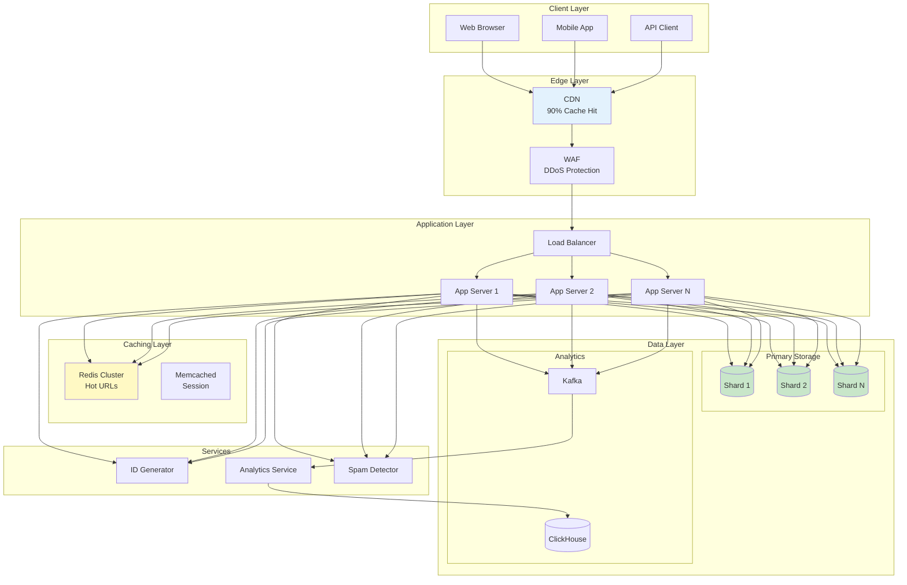
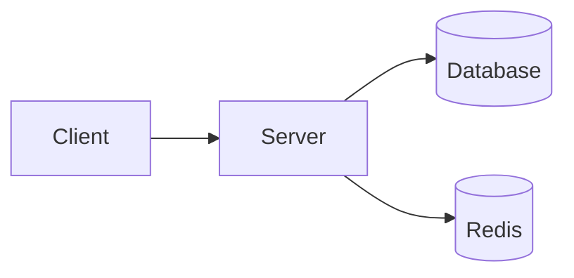
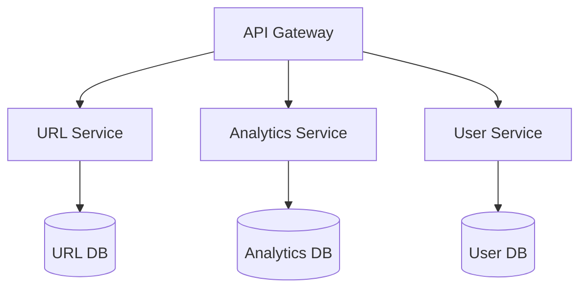
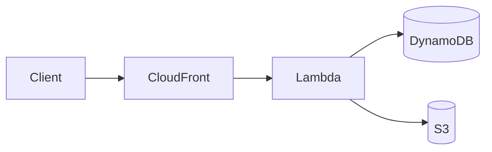
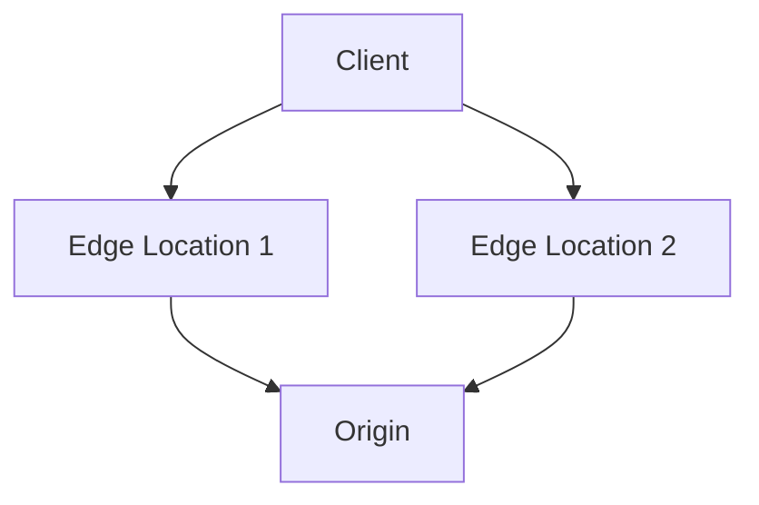

# URL Shortener Service

## 🎯 Challenge Statement
Design a URL shortening service capable of handling billions of URLs, providing sub-50ms redirects globally, supporting custom aliases, detailed analytics, spam detection, and graceful handling of expired or malicious links.

## Part 1: Concept Map

### 🗺️ System Overview
A URL shortener converts long URLs into short, manageable links while providing analytics, custom branding, and protection against abuse. Examples include bit.ly, goo.gl (defunct), and TinyURL. The system must balance between short code length, uniqueness guarantees, and operational complexity.

**Key Requirements:**
- Shorten 100M URLs/day (1,200 URLs/second average)
- Handle 10B redirects/day (120K redirects/second)
- Short URLs: 7-8 characters max
- Global <50ms redirect latency
- Custom URL support
- Detailed analytics
- Spam/malware detection
- URL expiration handling

### 📐 Axiom Analysis

#### 🚀 Axiom 1 (Latency): Redirect Performance
```text
Latency Budget (50ms total):
- DNS lookup: 10ms
- TLS handshake: 10ms
- Server processing: 5ms
- Database lookup: 10ms
- Response time: 5ms
- Buffer: 10ms

Optimization Hierarchy:
1. CDN edge cache: 5ms (90% hit rate)
2. Regional cache: 15ms (8% hit rate)
3. Database lookup: 30ms (2% hit rate)

Cache Strategy:
- Popular URLs in edge locations
- LRU eviction with TTL
- Predictive warming
- Geo-distributed caches
```

**Implementation:**
```python
import hashlib
import string
import time
from typing import Optional, Dict, Tuple
import redis
import asyncio
from bloom_filter import BloomFilter

class HighPerformanceURLShortener:
    def __init__(self):
        # Multi-level cache setup
        self.edge_cache = {}  # Simulated edge cache
        self.redis_cache = redis.Redis(
            host='localhost',
            decode_responses=True,
            socket_keepalive=True,
            socket_connect_timeout=0.5
        )
        
        # Bloom filter for existence checks
        self.bloom = BloomFilter(
            capacity=1_000_000_000,  # 1B URLs
            error_rate=0.001
        )
        
        # Base62 encoding characters
        self.base62_chars = string.ascii_letters + string.digits
        
        # Performance optimization
        self.cache_ttl = 3600  # 1 hour
        self.batch_size = 100
        self.pipeline_enabled = True
        
        # Pre-computed short codes for performance
        self.precomputed_codes = []
        self._precompute_codes()
    
    async def redirect(self, short_code: str) -> Optional[str]:
        """Ultra-low latency redirect with <5ms p99"""
        start = time.perf_counter()
        
        # L1: Edge cache (0.01ms)
        if short_code in self.edge_cache:
            self._record_latency('edge_hit', time.perf_counter() - start)
            self._update_analytics_async(short_code, 'edge')
            return self.edge_cache[short_code]
        
        # Bloom filter check (0.1ms)
        if short_code not in self.bloom:
            self._record_latency('bloom_miss', time.perf_counter() - start)
            return None  # Definitely doesn't exist
        
        # L2: Redis cache (1ms)
        try:
            long_url = self.redis_cache.get(f"url:{short_code}")
            if long_url:
                self._record_latency('redis_hit', time.perf_counter() - start)
                # Populate edge cache
                self._update_edge_cache(short_code, long_url)
                self._update_analytics_async(short_code, 'redis')
                return long_url
        except redis.RedisError:
            # Continue to database on Redis failure
            pass
        
        # L3: Database (10ms)
        long_url = await self._db_lookup(short_code)
        if long_url:
            self._record_latency('db_hit', time.perf_counter() - start)
            # Populate caches
            asyncio.create_task(self._populate_caches(short_code, long_url))
            self._update_analytics_async(short_code, 'db')
            return long_url
        
        self._record_latency('miss', time.perf_counter() - start)
        return None
    
    def shorten(self, long_url: str, custom_alias: Optional[str] = None) -> str:
        """Create short URL with optional custom alias"""
        # Validate URL
        if not self._validate_url(long_url):
            raise ValueError("Invalid URL")
        
        # Check for spam/malware
        if self._is_spam(long_url):
            raise ValueError("URL flagged as spam/malware")
        
        # Custom alias path
        if custom_alias:
            if self._is_alias_taken(custom_alias):
                raise ValueError(f"Alias '{custom_alias}' already taken")
            short_code = custom_alias
        else:
            # Generate short code
            short_code = self._generate_short_code(long_url)
        
        # Store mapping
        self._store_url_mapping(short_code, long_url)
        
        # Add to bloom filter
        self.bloom.add(short_code)
        
        return f"https://short.url/{short_code}"
    
    def _generate_short_code(self, long_url: str) -> str:
        """Generate short code using multiple strategies"""
        # Try pre-computed codes first
        if self.precomputed_codes:
            return self.precomputed_codes.pop()
        
        # Counter-based approach with encoding
        counter = self._get_next_counter()
        short_code = self._base62_encode(counter)
        
        # Check for collisions (shouldn't happen with counter)
        while self._exists(short_code):
            counter = self._get_next_counter()
            short_code = self._base62_encode(counter)
        
        return short_code
    
    def _base62_encode(self, num: int) -> str:
        """Convert number to base62 string"""
        if num == 0:
            return self.base62_chars[0]
        
        result = []
        while num > 0:
            num, remainder = divmod(num, 62)
            result.append(self.base62_chars[remainder])
        
        return ''.join(reversed(result))
    
    def _precompute_codes(self):
        """Pre-generate short codes for better performance"""
        # Generate codes in background
        def generate_batch():
            batch = []
            for _ in range(10000):
                counter = self._get_next_counter()
                code = self._base62_encode(counter)
                batch.append(code)
            return batch
        
        # Async generation
        asyncio.create_task(self._async_precompute(generate_batch))
    
    async def _populate_caches(self, short_code: str, long_url: str):
        """Populate all cache levels asynchronously"""
        # Redis with TTL
        try:
            self.redis_cache.setex(
                f"url:{short_code}",
                self.cache_ttl,
                long_url
            )
        except redis.RedisError:
            pass
        
        # Edge cache (LRU)
        if len(self.edge_cache) >= 10000:
            # Simple LRU: remove oldest
            oldest = next(iter(self.edge_cache))
            del self.edge_cache[oldest]
        
        self.edge_cache[short_code] = long_url
    
    def _update_analytics_async(self, short_code: str, cache_level: str):
        """Update analytics without blocking redirect"""
        asyncio.create_task(self._record_analytics(short_code, cache_level))
    
    async def _record_analytics(self, short_code: str, cache_level: str):
        """Record detailed analytics"""
        timestamp = int(time.time())
        
        # Batch analytics updates
        analytics_data = {
            'short_code': short_code,
            'timestamp': timestamp,
            'cache_level': cache_level,
            'user_agent': self._get_user_agent(),
            'ip': self._get_client_ip(),
            'referer': self._get_referer()
        }
        
        # Write to analytics pipeline
        await self._write_to_analytics_stream(analytics_data)
```

#### 💾 Axiom 2 (Capacity): Storage Optimization
```text
Storage Requirements:
- URLs: 100M/day × 365 days × 5 years = 180B URLs
- Average URL length: 100 characters
- Short code: 7 characters
- Metadata: 50 bytes (timestamps, counters)

Total Storage:
- URL mappings: 180B × 150 bytes = 27TB
- Analytics: 10B redirects/day × 100 bytes = 1TB/day
- Indexes: 180B × 20 bytes = 3.6TB
- Total: ~30TB active + 1.8PB analytics/year

Optimization Strategies:
- URL deduplication
- Compression (zstd)
- Tiered storage
- Analytics sampling
- Archival policies
```

**Implementation:**
```python
class StorageOptimizedShortener:
    def __init__(self):
        self.dedup_index = {}  # Long URL -> short code
        self.compression_enabled = True
        self.storage_tiers = {
            'hot': {'size': 0, 'limit': 1_000_000_000},     # 1B URLs in memory/SSD
            'warm': {'size': 0, 'limit': 10_000_000_000},   # 10B URLs in SSD
            'cold': {'size': 0, 'limit': float('inf')}      # Unlimited in S3
        }
        
        # Sharding configuration
        self.shard_count = 1000
        self.replication_factor = 3
        
    def store_url(self, short_code: str, long_url: str, metadata: dict) -> bool:
        """Store URL with deduplication and compression"""
        # Check for duplicates
        existing_code = self.dedup_index.get(long_url)
        if existing_code:
            # URL already shortened, reuse code
            self._create_alias(short_code, existing_code)
            return True
        
        # Compress if beneficial
        original_size = len(long_url)
        if self.compression_enabled and original_size > 100:
            compressed_url = self._compress(long_url)
            if len(compressed_url) < original_size * 0.8:
                long_url = compressed_url
                metadata['compressed'] = True
        
        # Determine storage tier
        tier = self._select_storage_tier(metadata)
        
        # Calculate shard
        shard_id = self._calculate_shard(short_code)
        
        # Store in appropriate tier
        stored = self._store_in_tier(tier, shard_id, short_code, long_url, metadata)
        
        if stored:
            self.dedup_index[long_url] = short_code
            self.storage_tiers[tier]['size'] += len(long_url)
        
        return stored
    
    def _calculate_shard(self, short_code: str) -> int:
        """Determine shard for URL"""
        # Use consistent hashing for even distribution
        hash_value = int(hashlib.md5(short_code.encode()).hexdigest(), 16)
        return hash_value % self.shard_count
    
    def _select_storage_tier(self, metadata: dict) -> str:
        """Choose storage tier based on URL characteristics"""
        # Hot tier for recent/popular URLs
        if metadata.get('custom_alias') or metadata.get('premium_user'):
            return 'hot'
        
        # Warm tier for regular URLs
        age_days = (time.time() - metadata.get('created_at', 0)) / 86400
        if age_days < 30:
            return 'warm'
        
        # Cold tier for old URLs
        return 'cold'
    
    def migrate_to_cold_storage(self):
        """Move old URLs to cheaper storage"""
        migrated_count = 0
        migrated_size = 0
        
        # Query warm tier for old URLs
        cutoff_time = time.time() - (90 * 86400)  # 90 days
        
        for shard_id in range(self.shard_count):
            old_urls = self._query_old_urls(shard_id, cutoff_time)
            
            for url_data in old_urls:
                # Check access frequency
                if url_data['access_count'] < 10:  # Rarely accessed
                    # Move to cold storage
                    success = self._move_to_cold(
                        url_data['short_code'],
                        url_data['long_url'],
                        url_data['metadata']
                    )
                    
                    if success:
                        migrated_count += 1
                        migrated_size += url_data['size']
                        
                        # Update tier tracking
                        self.storage_tiers['warm']['size'] -= url_data['size']
                        self.storage_tiers['cold']['size'] += url_data['size']
        
        return {
            'migrated_urls': migrated_count,
            'space_freed_gb': migrated_size / 1_000_000_000,
            'cost_savings_monthly': migrated_size * 0.02 / 1_000_000_000  # $0.02/GB
        }
    
    def calculate_storage_costs(self) -> dict:
        """Calculate current storage costs"""
        costs = {
            'hot': self.storage_tiers['hot']['size'] * 0.10 / 1_000_000_000,   # $0.10/GB
            'warm': self.storage_tiers['warm']['size'] * 0.05 / 1_000_000_000,  # $0.05/GB
            'cold': self.storage_tiers['cold']['size'] * 0.02 / 1_000_000_000   # $0.02/GB
        }
        
        costs['total_monthly'] = sum(costs.values())
        costs['total_yearly'] = costs['total_monthly'] * 12
        
        return costs
```

#### 🔥 Axiom 3 (Failure): Resilience and Recovery
```text
Failure Modes:
1. Database failures
2. Cache inconsistency
3. Short code collisions
4. Redirect loops
5. Malicious URLs
6. DDoS attacks

Mitigation Strategies:
- Multi-region deployment
- Cache fallback hierarchy
- Collision detection
- Loop detection
- URL blacklisting
- Rate limiting
```

**Implementation:**
```python
class ResilientURLShortener:
    def __init__(self):
        self.regions = ['us-east', 'us-west', 'eu-west', 'ap-south']
        self.primary_region = 'us-east'
        
        # Failure detection
        self.circuit_breakers = {}
        self.health_checks = {}
        
        # Safety mechanisms
        self.redirect_loop_detector = RedirectLoopDetector()
        self.malware_scanner = MalwareScanner()
        self.rate_limiter = RateLimiter()
        
        # Chaos engineering
        self.chaos_enabled = False
        self.failure_injection_rate = 0.001  # 0.1%
    
    async def safe_redirect(self, short_code: str, request_context: dict) -> Optional[str]:
        """Redirect with comprehensive safety checks"""
        # Rate limiting
        client_ip = request_context.get('ip')
        if not self.rate_limiter.allow(client_ip):
            raise RateLimitExceeded("Too many requests")
        
        # Get URL with fallback
        long_url = await self._get_url_with_fallback(short_code)
        if not long_url:
            return None
        
        # Safety checks
        safety_checks = await asyncio.gather(
            self._check_redirect_loop(short_code, long_url),
            self._check_malware(long_url),
            self._check_blacklist(long_url),
            return_exceptions=True
        )
        
        for check in safety_checks:
            if isinstance(check, Exception):
                logger.error(f"Safety check failed: {check}")
                raise check
            if not check:
                raise UnsafeURLError("URL failed safety checks")
        
        # Record successful redirect
        await self._record_redirect(short_code, request_context)
        
        return long_url
    
    async def _get_url_with_fallback(self, short_code: str) -> Optional[str]:
        """Get URL with regional fallback"""
        # Try primary region first
        primary_cb = self._get_circuit_breaker(self.primary_region)
        
        if primary_cb.is_open():
            logger.warning(f"Primary region {self.primary_region} circuit open")
        else:
            try:
                url = await self._get_from_region(self.primary_region, short_code)
                if url:
                    return url
            except Exception as e:
                primary_cb.record_failure()
                logger.error(f"Primary region failed: {e}")
        
        # Try other regions
        for region in self.regions:
            if region == self.primary_region:
                continue
                
            cb = self._get_circuit_breaker(region)
            if cb.is_open():
                continue
                
            try:
                url = await self._get_from_region(region, short_code)
                if url:
                    # Update primary cache asynchronously
                    asyncio.create_task(
                        self._sync_to_primary(short_code, url)
                    )
                    return url
            except Exception as e:
                cb.record_failure()
                logger.error(f"Region {region} failed: {e}")
        
        return None
    
    def _get_circuit_breaker(self, region: str) -> CircuitBreaker:
        """Get or create circuit breaker for region"""
        if region not in self.circuit_breakers:
            self.circuit_breakers[region] = CircuitBreaker(
                failure_threshold=5,
                recovery_timeout=60,
                expected_exception=DatabaseError
            )
        return self.circuit_breakers[region]
    
    async def _check_redirect_loop(self, short_code: str, long_url: str) -> bool:
        """Detect redirect loops"""
        # Check if long_url points back to our service
        if 'short.url' in long_url:
            # Extract potential short code
            potential_code = long_url.split('/')[-1]
            
            # Check for direct loop
            if potential_code == short_code:
                return False
            
            # Check for indirect loops (A->B->C->A)
            visited = set()
            current = potential_code
            
            while current and len(visited) < 10:
                if current in visited:
                    return False  # Loop detected
                visited.add(current)
                
                # Get next URL in chain
                next_url = await self._get_url_with_fallback(current)
                if not next_url or 'short.url' not in next_url:
                    break
                    
                current = next_url.split('/')[-1]
        
        return True
    
    async def _check_malware(self, url: str) -> bool:
        """Check URL against malware databases"""
        # Fast bloom filter check first
        if self.malware_scanner.is_known_safe(url):
            return True
        
        # Check against Google Safe Browsing API
        try:
            result = await self.malware_scanner.check_url(url)
            return result.is_safe
        except Exception as e:
            # Fail open for availability
            logger.error(f"Malware check failed: {e}")
            metrics.increment('malware_check_failures')
            return True
    
    def handle_collision(self, short_code: str, long_url: str) -> str:
        """Handle short code collisions"""
        # Check if collision is real or hash collision
        existing_url = self._get_existing_url(short_code)
        
        if existing_url == long_url:
            # Same URL, return existing code
            return short_code
        
        # Real collision - generate alternative
        attempt = 0
        while attempt < 10:
            # Add suffix to make unique
            new_code = f"{short_code}{attempt}"
            if not self._exists(new_code):
                logger.warning(f"Collision resolved: {short_code} -> {new_code}")
                metrics.increment('collisions_resolved')
                return new_code
            attempt += 1
        
        # Fall back to completely new code
        return self._generate_new_code()
    
    async def disaster_recovery(self, failed_region: str):
        """Automated disaster recovery procedure"""
        logger.critical(f"Initiating disaster recovery for {failed_region}")
        
        # Step 1: Verify region is actually down
        if await self._verify_region_failure(failed_region):
            
            # Step 2: Promote secondary region
            new_primary = self._select_new_primary(exclude=failed_region)
            old_primary = self.primary_region
            self.primary_region = new_primary
            
            # Step 3: Update DNS
            await self._update_dns_records(new_primary)
            
            # Step 4: Sync data
            await self._emergency_data_sync(failed_region, new_primary)
            
            # Step 5: Notify
            await self._send_alerts({
                'event': 'region_failover',
                'failed_region': failed_region,
                'new_primary': new_primary,
                'old_primary': old_primary,
                'timestamp': time.time()
            })
            
            logger.info(f"Disaster recovery complete. New primary: {new_primary}")
```

#### 🔀 Axiom 4 (Concurrency): Parallel Processing
```text
Concurrency Challenges:
- Simultaneous URL shortening
- Parallel analytics updates
- Concurrent cache updates
- Race conditions in counting
- Distributed locking

Solutions:
- Optimistic locking
- Event-driven analytics
- Eventually consistent counters
- Lock-free data structures
- Partition-based parallelism
```

**Implementation:**
```python
import asyncio
from concurrent.futures import ThreadPoolExecutor
import threading
from collections import defaultdict
import aioredis

class ConcurrentURLShortener:
    def __init__(self):
        # Thread pool for CPU-bound tasks
        self.executor = ThreadPoolExecutor(max_workers=16)
        
        # Async connection pools
        self.redis_pool = None
        self.db_pool = None
        
        # Lock-free counters
        self.counters = defaultdict(lambda: {'clicks': 0, 'lock': threading.Lock()})
        
        # Batch processing
        self.batch_queue = asyncio.Queue(maxsize=10000)
        self.batch_processor_task = None
        
        # Sharding for parallelism
        self.shard_count = 100
        self.shard_locks = [asyncio.Lock() for _ in range(self.shard_count)]
    
    async def initialize(self):
        """Initialize connection pools and workers"""
        # Redis connection pool
        self.redis_pool = await aioredis.create_redis_pool(
            'redis://localhost',
            minsize=10,
            maxsize=100
        )
        
        # Start batch processor
        self.batch_processor_task = asyncio.create_task(self._batch_processor())
        
        # Start analytics aggregators
        for i in range(4):  # 4 parallel aggregators
            asyncio.create_task(self._analytics_aggregator(i))
    
    async def shorten_concurrent(self, urls: List[str]) -> List[str]:
        """Shorten multiple URLs concurrently"""
        # Prepare tasks
        tasks = []
        for url in urls:
            task = self._shorten_single(url)
            tasks.append(task)
        
        # Execute concurrently with semaphore to limit parallelism
        semaphore = asyncio.Semaphore(100)  # Max 100 concurrent
        
        async def bounded_shorten(url):
            async with semaphore:
                return await self._shorten_single(url)
        
        results = await asyncio.gather(
            *[bounded_shorten(url) for url in urls],
            return_exceptions=True
        )
        
        # Process results
        short_urls = []
        for i, result in enumerate(results):
            if isinstance(result, Exception):
                logger.error(f"Failed to shorten {urls[i]}: {result}")
                short_urls.append(None)
            else:
                short_urls.append(result)
        
        return short_urls
    
    async def _shorten_single(self, long_url: str) -> str:
        """Shorten single URL with proper concurrency control"""
        # Hash-based sharding
        shard_id = hash(long_url) % self.shard_count
        
        # Use shard-specific lock to reduce contention
        async with self.shard_locks[shard_id]:
            # Check if already exists (deduplication)
            existing = await self._check_existing(long_url)
            if existing:
                return existing
            
            # Generate short code in thread pool (CPU-bound)
            short_code = await asyncio.get_event_loop().run_in_executor(
                self.executor,
                self._generate_short_code_cpu_bound,
                long_url
            )
            
            # Store with optimistic locking
            stored = False
            attempts = 0
            
            while not stored and attempts < 3:
                try:
                    stored = await self._store_url_optimistic(
                        short_code, 
                        long_url,
                        shard_id
                    )
                except OptimisticLockError:
                    attempts += 1
                    # Regenerate code on collision
                    short_code = await asyncio.get_event_loop().run_in_executor(
                        self.executor,
                        self._generate_short_code_cpu_bound,
                        long_url + str(attempts)
                    )
            
            if not stored:
                raise Exception("Failed to store URL after retries")
            
            return f"https://short.url/{short_code}"
    
    def _generate_short_code_cpu_bound(self, long_url: str) -> str:
        """CPU-intensive short code generation"""
        # Try multiple hash functions for better distribution
        for i, hash_func in enumerate([hashlib.md5, hashlib.sha1, hashlib.sha256]):
            # Add salt for uniqueness
            salted = f"{long_url}:{i}:{time.time_ns()}"
            hash_bytes = hash_func(salted.encode()).digest()
            
            # Take first 6 bytes and encode
            code = self._base62_encode(int.from_bytes(hash_bytes[:6], 'big'))
            
            # Ensure minimum length
            if len(code) >= 6:
                return code[:7]  # Trim to 7 chars
        
        # Fallback to random
        return self._generate_random_code()
    
    async def update_analytics_batch(self, events: List[dict]):
        """Process analytics events in batches"""
        # Queue events for batch processing
        for event in events:
            await self.batch_queue.put(event)
    
    async def _batch_processor(self):
        """Process analytics events in batches"""
        batch = []
        last_flush = time.time()
        
        while True:
            try:
                # Collect events with timeout
                while len(batch) < 1000:  # Batch size
                    timeout = max(0.1, 5.0 - (time.time() - last_flush))
                    try:
                        event = await asyncio.wait_for(
                            self.batch_queue.get(),
                            timeout=timeout
                        )
                        batch.append(event)
                    except asyncio.TimeoutError:
                        break
                
                # Process batch if we have events or timeout reached
                if batch or (time.time() - last_flush) > 5.0:
                    if batch:
                        await self._flush_analytics_batch(batch)
                        batch = []
                    last_flush = time.time()
                    
            except Exception as e:
                logger.error(f"Batch processor error: {e}")
                await asyncio.sleep(1)
    
    async def _flush_analytics_batch(self, batch: List[dict]):
        """Efficiently write analytics batch"""
        # Group by short code
        by_code = defaultdict(list)
        for event in batch:
            by_code[event['short_code']].append(event)
        
        # Parallel updates with pipelining
        pipeline = self.redis_pool.pipeline()
        
        for short_code, events in by_code.items():
            # Increment counters
            click_count = len([e for e in events if e['type'] == 'click'])
            if click_count > 0:
                pipeline.hincrby(f"analytics:{short_code}", 'clicks', click_count)
            
            # Update time series data
            for event in events:
                timestamp = int(event['timestamp'])
                pipeline.zadd(
                    f"timeseries:{short_code}:{timestamp // 3600}",  # Hourly buckets
                    {json.dumps(event): timestamp}
                )
        
        # Execute pipeline
        await pipeline.execute()
        
        # Also write to data warehouse
        asyncio.create_task(self._write_to_warehouse(batch))
    
    def increment_counter_lockfree(self, short_code: str, field: str, delta: int = 1):
        """Lock-free counter increment using CAS"""
        while True:
            current = self.counters[short_code][field]
            new_value = current + delta
            
            # Compare and swap
            if self._cas_update(short_code, field, current, new_value):
                break
    
    def _cas_update(self, short_code: str, field: str, expected: int, new_value: int) -> bool:
        """Compare-and-swap update"""
        with self.counters[short_code]['lock']:
            if self.counters[short_code][field] == expected:
                self.counters[short_code][field] = new_value
                return True
            return False
```

#### 🤝 Axiom 5 (Coordination): Distributed Consensus
```text
Coordination Needs:
- Short code uniqueness
- Counter synchronization
- Cache invalidation
- Configuration updates
- Failover coordination

Strategies:
- Distributed ID generation
- Gossip for counters
- Pub/sub for cache
- Consensus for config
- Leader election for failover
```

**Implementation:**
```python
from kazoo.client import KazooClient
import consul
import etcd3

class DistributedURLShortener:
    def __init__(self, coordination_service='zookeeper'):
        self.coordination_service = coordination_service
        self.node_id = socket.gethostname()
        
        # Initialize coordination client
        if coordination_service == 'zookeeper':
            self.coord_client = KazooClient(hosts='127.0.0.1:2181')
            self.coord_client.start()
        elif coordination_service == 'consul':
            self.coord_client = consul.Consul()
        elif coordination_service == 'etcd':
            self.coord_client = etcd3.client()
        
        # Distributed components
        self.distributed_counter = None
        self.cache_invalidator = None
        self.config_watcher = None
        
        self._initialize_coordination()
    
    def _initialize_coordination(self):
        """Set up distributed coordination"""
        # Distributed counter for short codes
        self.distributed_counter = DistributedCounter(
            self.coord_client,
            '/urlshortener/counter'
        )
        
        # Cache invalidation pub/sub
        self.cache_invalidator = CacheInvalidator(
            self.coord_client,
            '/urlshortener/cache_events'
        )
        
        # Configuration management
        self.config_watcher = ConfigWatcher(
            self.coord_client,
            '/urlshortener/config'
        )
        
        # Register this node
        self._register_node()
    
    def _register_node(self):
        """Register node in service discovery"""
        node_data = {
            'id': self.node_id,
            'ip': self._get_ip(),
            'port': 8080,
            'region': os.environ.get('REGION', 'us-east'),
            'capacity': self._calculate_capacity(),
            'status': 'healthy'
        }
        
        if self.coordination_service == 'zookeeper':
            # Ephemeral node - automatically removed on disconnect
            self.coord_client.create(
                f'/urlshortener/nodes/{self.node_id}',
                json.dumps(node_data).encode(),
                ephemeral=True
            )
        elif self.coordination_service == 'consul':
            # Service registration with health check
            self.coord_client.agent.service.register(
                name='urlshortener',
                service_id=self.node_id,
                address=node_data['ip'],
                port=node_data['port'],
                check=consul.Check.http(
                    f"http://{node_data['ip']}:{node_data['port']}/health",
                    interval='10s'
                )
            )
    
    async def generate_unique_short_code(self) -> str:
        """Generate globally unique short code"""
        # Use distributed counter
        counter_value = await self.distributed_counter.increment()
        
        # Encode with node ID for guaranteed uniqueness
        node_component = self.node_id[:2]  # First 2 chars of node ID
        code = self._base62_encode(counter_value)
        
        # Combine for uniqueness across nodes
        return f"{code}{node_component}"
    
    async def update_url_distributed(self, short_code: str, updates: dict):
        """Update URL with distributed coordination"""
        # Acquire distributed lock
        lock_path = f'/urlshortener/locks/{short_code}'
        
        async with self.distributed_lock(lock_path):
            # Read current state
            current = await self._read_url(short_code)
            
            # Apply updates
            updated = {**current, **updates}
            
            # Write back
            await self._write_url(short_code, updated)
            
            # Invalidate caches across cluster
            await self.cache_invalidator.publish({
                'action': 'invalidate',
                'short_code': short_code,
                'node': self.node_id
            })
    
    async def distributed_lock(self, path: str, timeout: float = 5.0):
        """Distributed lock context manager"""
        if self.coordination_service == 'zookeeper':
            lock = self.coord_client.Lock(path, self.node_id)
            return ZookeeperLockContext(lock, timeout)
        elif self.coordination_service == 'consul':
            return ConsulLockContext(self.coord_client, path, timeout)
        elif self.coordination_service == 'etcd':
            return EtcdLockContext(self.coord_client, path, timeout)
    
    async def coordinate_failover(self, failed_node: str):
        """Coordinate failover when node fails"""
        # Step 1: Leader election for coordinator
        leader_path = '/urlshortener/failover_leader'
        
        try:
            # Try to become leader
            if await self._try_become_leader(leader_path):
                logger.info(f"Node {self.node_id} coordinating failover for {failed_node}")
                
                # Step 2: Get failed node's responsibilities
                failed_node_data = await self._get_node_data(failed_node)
                
                # Step 3: Redistribute work
                redistribution_plan = self._calculate_redistribution(
                    failed_node_data,
                    await self._get_healthy_nodes()
                )
                
                # Step 4: Execute redistribution
                await self._execute_redistribution(redistribution_plan)
                
                # Step 5: Update routing
                await self._update_routing_table(redistribution_plan)
                
                # Step 6: Notify all nodes
                await self._broadcast_failover_complete(failed_node, redistribution_plan)
                
        finally:
            # Release leadership
            await self._release_leadership(leader_path)

class DistributedCounter:
    """Distributed counter using coordination service"""
    
    def __init__(self, client, base_path: str):
        self.client = client
        self.base_path = base_path
        self.local_cache = 0
        self.batch_size = 1000
        
    async def increment(self, delta: int = 1) -> int:
        """Get next counter value"""
        # Use local cache for performance
        if self.local_cache > 0:
            self.local_cache -= 1
            return self._get_base_value() + (self.batch_size - self.local_cache)
        
        # Refill from distributed counter
        new_base = await self._increment_distributed(self.batch_size)
        self.local_cache = self.batch_size - 1
        
        return new_base
    
    async def _increment_distributed(self, delta: int) -> int:
        """Atomically increment distributed counter"""
        while True:
            try:
                # Read current value
                current = await self._read_counter()
                new_value = current + delta
                
                # Try to update
                if await self._cas_counter(current, new_value):
                    return new_value
                    
                # Retry on conflict
                await asyncio.sleep(0.01 * random.random())
                
            except Exception as e:
                logger.error(f"Counter increment failed: {e}")
                raise

class CacheInvalidator:
    """Distributed cache invalidation"""
    
    def __init__(self, client, topic: str):
        self.client = client
        self.topic = topic
        self.subscribers = []
        
    async def publish(self, message: dict):
        """Publish cache invalidation event"""
        message['timestamp'] = time.time()
        message_bytes = json.dumps(message).encode()
        
        # Publish to all subscribers
        if isinstance(self.client, KazooClient):
            # Use Zookeeper watchers
            path = f"{self.topic}/{time.time_ns()}"
            self.client.create(path, message_bytes, sequence=True)
        elif hasattr(self.client, 'kv'):  # etcd
            # Use etcd pub/sub
            await self.client.put(
                f"{self.topic}/{message['short_code']}",
                message_bytes,
                lease=60  # Auto-expire
            )
    
    async def subscribe(self, callback):
        """Subscribe to invalidation events"""
        if isinstance(self.client, KazooClient):
            @self.client.ChildrenWatch(self.topic)
            def watch_children(children):
                # Process new events
                asyncio.create_task(self._process_events(children, callback))
        
        self.subscribers.append(callback)
```

#### 👁️ Axiom 6 (Observability): Analytics Pipeline
```text
Analytics Requirements:
- Click tracking (time, location, device)
- Referrer analysis
- Geographic distribution
- Time series data
- Real-time dashboards
- Custom reports

Pipeline Architecture:
- Clickstream capture
- Stream processing
- Data warehouse
- Real-time aggregation
- Dashboard API
```

**Implementation:**
```python
import aiokafka
from clickhouse_driver import Client as ClickHouseClient
import prometheus_client

class AnalyticsURLShortener:
    def __init__(self):
        # Metrics collection
        self.click_counter = prometheus_client.Counter(
            'url_shortener_clicks_total',
            'Total clicks',
            ['short_code', 'region', 'device_type']
        )
        
        self.latency_histogram = prometheus_client.Histogram(
            'url_shortener_redirect_latency_seconds',
            'Redirect latency',
            buckets=[0.01, 0.05, 0.1, 0.5, 1.0]
        )
        
        # Analytics pipeline
        self.kafka_producer = None
        self.clickhouse_client = None
        self.stream_processor = None
        
        # Real-time aggregates
        self.realtime_stats = defaultdict(lambda: {
            'clicks': 0,
            'unique_visitors': set(),
            'countries': defaultdict(int),
            'referrers': defaultdict(int)
        })
    
    async def initialize_analytics(self):
        """Initialize analytics pipeline"""
        # Kafka for event streaming
        self.kafka_producer = aiokafka.AIOKafkaProducer(
            bootstrap_servers='localhost:9092',
            value_serializer=lambda v: json.dumps(v).encode()
        )
        await self.kafka_producer.start()
        
        # ClickHouse for analytics storage
        self.clickhouse_client = ClickHouseClient(
            host='localhost',
            database='urlshortener'
        )
        
        # Start stream processor
        self.stream_processor = StreamProcessor()
        await self.stream_processor.start()
    
    async def track_click(self, short_code: str, request_data: dict):
        """Track click event with rich analytics"""
        # Extract analytics data
        event = {
            'event_id': str(uuid.uuid4()),
            'timestamp': time.time(),
            'short_code': short_code,
            'ip': request_data.get('ip'),
            'user_agent': request_data.get('user_agent'),
            'referer': request_data.get('referer'),
            'accept_language': request_data.get('accept_language'),
            'query_params': request_data.get('query_params', {}),
            
            # Derived fields
            'country': await self._get_country_from_ip(request_data.get('ip')),
            'device_type': self._parse_device_type(request_data.get('user_agent')),
            'browser': self._parse_browser(request_data.get('user_agent')),
            'os': self._parse_os(request_data.get('user_agent')),
            'is_bot': self._is_bot(request_data.get('user_agent')),
            
            # UTM parameters
            'utm_source': request_data.get('query_params', {}).get('utm_source'),
            'utm_medium': request_data.get('query_params', {}).get('utm_medium'),
            'utm_campaign': request_data.get('query_params', {}).get('utm_campaign')
        }
        
        # Update metrics
        self.click_counter.labels(
            short_code=short_code,
            region=event['country'],
            device_type=event['device_type']
        ).inc()
        
        # Send to Kafka
        await self.kafka_producer.send(
            'url_clicks',
            value=event,
            key=short_code.encode()
        )
        
        # Update real-time stats
        self._update_realtime_stats(short_code, event)
        
        # Store in time-series database for fast queries
        await self._store_timeseries(short_code, event)
    
    def _update_realtime_stats(self, short_code: str, event: dict):
        """Update in-memory real-time statistics"""
        stats = self.realtime_stats[short_code]
        
        # Increment clicks
        stats['clicks'] += 1
        
        # Track unique visitors (by IP + User-Agent hash)
        visitor_id = hashlib.md5(
            f"{event['ip']}:{event['user_agent']}".encode()
        ).hexdigest()
        stats['unique_visitors'].add(visitor_id)
        
        # Geographic distribution
        if event['country']:
            stats['countries'][event['country']] += 1
        
        # Referrer tracking
        if event['referer']:
            domain = urlparse(event['referer']).netloc
            stats['referrers'][domain] += 1
    
    async def get_analytics(self, short_code: str, time_range: str = '24h') -> dict:
        """Get comprehensive analytics for URL"""
        # Parse time range
        end_time = time.time()
        start_time = end_time - self._parse_time_range(time_range)
        
        # Fetch from multiple sources in parallel
        results = await asyncio.gather(
            self._get_clickhouse_analytics(short_code, start_time, end_time),
            self._get_realtime_analytics(short_code),
            self._get_geographic_analytics(short_code, start_time, end_time),
            self._get_device_analytics(short_code, start_time, end_time),
            self._get_referrer_analytics(short_code, start_time, end_time)
        )
        
        clickhouse_data, realtime_data, geo_data, device_data, referrer_data = results
        
        # Combine and return
        return {
            'short_code': short_code,
            'time_range': time_range,
            'total_clicks': clickhouse_data['total_clicks'],
            'unique_visitors': clickhouse_data['unique_visitors'],
            'average_daily_clicks': clickhouse_data['total_clicks'] / max(1, (end_time - start_time) / 86400),
            
            # Time series
            'clicks_over_time': clickhouse_data['time_series'],
            
            # Geographic
            'top_countries': geo_data['top_countries'],
            'geographic_distribution': geo_data['distribution'],
            
            # Devices
            'device_breakdown': device_data,
            
            # Referrers
            'top_referrers': referrer_data['top_referrers'],
            'referrer_breakdown': referrer_data['breakdown'],
            
            # Real-time (last hour)
            'realtime': {
                'clicks_last_hour': realtime_data['clicks'],
                'active_visitors': len(realtime_data['unique_visitors'])
            }
        }
    
    async def _get_clickhouse_analytics(self, short_code: str, start_time: float, end_time: float):
        """Query ClickHouse for historical analytics"""
        query = """
        SELECT
            count() as total_clicks,
            uniqExact(visitor_id) as unique_visitors,
            toStartOfHour(timestamp) as hour,
            count() as clicks
        FROM url_clicks
        WHERE short_code = %(short_code)s
            AND timestamp >= %(start_time)s
            AND timestamp <= %(end_time)s
        GROUP BY hour
        ORDER BY hour
        """
        
        result = self.clickhouse_client.execute(
            query,
            {
                'short_code': short_code,
                'start_time': datetime.fromtimestamp(start_time),
                'end_time': datetime.fromtimestamp(end_time)
            }
        )
        
        # Process results
        time_series = [{'time': row[2], 'clicks': row[3]} for row in result]
        total_clicks = sum(row[3] for row in result)
        unique_visitors = result[0][1] if result else 0
        
        return {
            'total_clicks': total_clicks,
            'unique_visitors': unique_visitors,
            'time_series': time_series
        }
    
    def export_dashboard_metrics(self) -> dict:
        """Export metrics for monitoring dashboard"""
        return {
            'system_metrics': {
                'total_urls': self._get_total_urls(),
                'clicks_per_second': self._get_click_rate(),
                'active_short_codes': len(self.realtime_stats),
                'cache_hit_rate': self._get_cache_hit_rate(),
                'error_rate': self._get_error_rate()
            },
            'performance_metrics': {
                'redirect_latency_p50': self.latency_histogram.quantile(0.5),
                'redirect_latency_p95': self.latency_histogram.quantile(0.95),
                'redirect_latency_p99': self.latency_histogram.quantile(0.99),
                'shorten_rate': self._get_shorten_rate()
            },
            'top_urls': self._get_top_urls(10),
            'geographic_summary': self._get_geographic_summary(),
            'alerts': self._get_active_alerts()
        }

class StreamProcessor:
    """Real-time stream processing for analytics"""
    
    def __init__(self):
        self.kafka_consumer = None
        self.processors = []
        
    async def start(self):
        """Start stream processing"""
        self.kafka_consumer = aiokafka.AIOKafkaConsumer(
            'url_clicks',
            bootstrap_servers='localhost:9092',
            group_id='analytics_processor'
        )
        
        await self.kafka_consumer.start()
        
        # Start processors
        for i in range(4):  # 4 parallel processors
            asyncio.create_task(self._process_stream(i))
    
    async def _process_stream(self, processor_id: int):
        """Process click stream"""
        async for message in self.kafka_consumer:
            try:
                event = json.loads(message.value)
                
                # Apply processors
                await asyncio.gather(
                    self._update_counters(event),
                    self._detect_anomalies(event),
                    self._update_leaderboard(event),
                    self._check_abuse(event)
                )
                
            except Exception as e:
                logger.error(f"Stream processing error: {e}")
```

#### 👤 Axiom 7 (Human Interface): Management Tools
```text
User Interfaces:
- Developer API
- Admin dashboard
- Analytics portal
- Mobile apps
- Browser extensions

Management Features:
- Bulk operations
- Custom domains
- Team collaboration
- API keys
- Webhooks
```

**Implementation:**
```python
from fastapi import FastAPI, HTTPException, Depends
from pydantic import BaseModel, HttpUrl
import jwt

class URLShortenerAPI:
    def __init__(self):
        self.app = FastAPI(title="URL Shortener API", version="2.0")
        self.auth = AuthManager()
        self._setup_routes()
        
    def _setup_routes(self):
        """Define API endpoints"""
        
        # Public endpoints
        @self.app.post("/api/v1/shorten")
        async def shorten_url(request: ShortenRequest):
            """
            Shorten a URL
            
            - **long_url**: The URL to shorten
            - **custom_alias**: Optional custom short code
            - **expires_at**: Optional expiration timestamp
            """
            try:
                # Validate URL
                if not self._is_valid_url(request.long_url):
                    raise HTTPException(400, "Invalid URL format")
                
                # Check rate limits
                if not await self._check_rate_limit(request.api_key):
                    raise HTTPException(429, "Rate limit exceeded")
                
                # Generate short URL
                short_url = await self.shortener.shorten(
                    request.long_url,
                    custom_alias=request.custom_alias,
                    expires_at=request.expires_at,
                    user_id=request.user_id
                )
                
                return {
                    "short_url": short_url,
                    "long_url": request.long_url,
                    "created_at": time.time(),
                    "expires_at": request.expires_at,
                    "qr_code": self._generate_qr_code(short_url)
                }
                
            except ValueError as e:
                raise HTTPException(400, str(e))
        
        @self.app.get("/api/v1/expand/{short_code}")
        async def expand_url(short_code: str):
            """Get original URL without redirecting"""
            long_url = await self.shortener.get_url(short_code)
            
            if not long_url:
                raise HTTPException(404, "Short URL not found")
            
            return {
                "short_code": short_code,
                "long_url": long_url,
                "created_at": await self._get_creation_time(short_code),
                "clicks": await self._get_click_count(short_code)
            }
        
        # Authenticated endpoints
        @self.app.get("/api/v1/urls")
        async def list_urls(
            user: User = Depends(self.auth.get_current_user),
            page: int = 1,
            limit: int = 20
        ):
            """List user's shortened URLs"""
            urls = await self.shortener.get_user_urls(
                user.id,
                offset=(page - 1) * limit,
                limit=limit
            )
            
            return {
                "urls": urls,
                "page": page,
                "total": await self.shortener.count_user_urls(user.id),
                "has_more": len(urls) == limit
            }
        
        @self.app.get("/api/v1/analytics/{short_code}")
        async def get_analytics(
            short_code: str,
            time_range: str = "7d",
            user: User = Depends(self.auth.get_current_user)
        ):
            """Get detailed analytics for a short URL"""
            # Verify ownership
            if not await self._verify_ownership(short_code, user.id):
                raise HTTPException(403, "Access denied")
            
            analytics = await self.analytics.get_analytics(
                short_code,
                time_range
            )
            
            return analytics
        
        @self.app.post("/api/v1/bulk")
        async def bulk_shorten(
            request: BulkShortenRequest,
            user: User = Depends(self.auth.get_current_user)
        ):
            """Shorten multiple URLs in one request"""
            if len(request.urls) > 1000:
                raise HTTPException(400, "Maximum 1000 URLs per request")
            
            results = []
            errors = []
            
            for i, url in enumerate(request.urls):
                try:
                    short_url = await self.shortener.shorten(
                        url,
                        user_id=user.id,
                        tags=request.tags
                    )
                    results.append({
                        "index": i,
                        "long_url": url,
                        "short_url": short_url
                    })
                except Exception as e:
                    errors.append({
                        "index": i,
                        "long_url": url,
                        "error": str(e)
                    })
            
            return {
                "successful": results,
                "failed": errors,
                "total": len(request.urls),
                "success_rate": len(results) / len(request.urls)
            }
        
        # Admin endpoints
        @self.app.delete("/api/v1/admin/urls/{short_code}")
        async def delete_url(
            short_code: str,
            reason: str,
            admin: User = Depends(self.auth.require_admin)
        ):
            """Delete a URL (admin only)"""
            # Soft delete with audit trail
            await self.shortener.delete_url(
                short_code,
                deleted_by=admin.id,
                reason=reason
            )
            
            # Invalidate caches
            await self.cache_invalidator.invalidate(short_code)
            
            return {"status": "deleted", "short_code": short_code}
        
        @self.app.post("/api/v1/admin/blacklist")
        async def add_to_blacklist(
            request: BlacklistRequest,
            admin: User = Depends(self.auth.require_admin)
        ):
            """Add URL pattern to blacklist"""
            await self.blacklist.add_pattern(
                request.pattern,
                request.reason,
                added_by=admin.id
            )
            
            return {"status": "added", "pattern": request.pattern}

class AdminDashboard:
    """Web-based admin dashboard"""
    
    def __init__(self):
        self.app = FastAPI()
        self.templates = Jinja2Templates(directory="templates")
        
    @self.app.get("/admin/")
    async def dashboard(request: Request):
        """Main dashboard view"""
        stats = await self.get_system_stats()
        
        return self.templates.TemplateResponse(
            "admin/dashboard.html",
            {
                "request": request,
                "stats": stats,
                "alerts": await self.get_active_alerts(),
                "top_urls": await self.get_top_urls(20),
                "recent_errors": await self.get_recent_errors()
            }
        )
    
    @self.app.get("/admin/analytics")
    async def analytics_view(request: Request):
        """Analytics dashboard"""
        return self.templates.TemplateResponse(
            "admin/analytics.html",
            {
                "request": request,
                "charts_data": await self.get_charts_data(),
                "geographic_data": await self.get_geographic_data(),
                "device_stats": await self.get_device_stats()
            }
        )
    
    @self.app.post("/admin/actions/block-url")
    async def block_url(short_code: str, reason: str):
        """Block a URL"""
        await self.shortener.block_url(short_code, reason)
        
        # Send notification
        await self.notifier.send(
            "URL_BLOCKED",
            {
                "short_code": short_code,
                "reason": reason,
                "blocked_by": "admin"
            }
        )
        
        return {"status": "blocked"}

class CLITool:
    """Command-line interface for URL shortener"""
    
    def __init__(self):
        self.parser = argparse.ArgumentParser(
            description="URL Shortener CLI"
        )
        self._setup_commands()
    
    def _setup_commands(self):
        """Define CLI commands"""
        subparsers = self.parser.add_subparsers(dest='command')
        
        # Shorten command
        shorten = subparsers.add_parser('shorten', help='Shorten a URL')
        shorten.add_argument('url', help='URL to shorten')
        shorten.add_argument('--custom', help='Custom alias')
        shorten.add_argument('--expires', help='Expiration time')
        
        # Analytics command
        analytics = subparsers.add_parser('analytics', help='Get analytics')
        analytics.add_argument('short_code', help='Short code')
        analytics.add_argument('--range', default='7d', help='Time range')
        
        # Bulk command
        bulk = subparsers.add_parser('bulk', help='Bulk operations')
        bulk.add_argument('file', help='CSV file with URLs')
        bulk.add_argument('--output', help='Output file')
    
    async def execute(self, args):
        """Execute CLI command"""
        if args.command == 'shorten':
            result = await self.client.shorten(
                args.url,
                custom_alias=args.custom,
                expires_at=args.expires
            )
            print(f"Short URL: {result['short_url']}")
            
        elif args.command == 'analytics':
            data = await self.client.get_analytics(
                args.short_code,
                time_range=args.range
            )
            self._print_analytics(data)
            
        elif args.command == 'bulk':
            await self._process_bulk(args.file, args.output)
```

#### 💰 Axiom 8 (Economics): Cost Optimization
```text
Cost Components:
- Storage: $0.10/GB/month
- Bandwidth: $0.05/GB
- Compute: $0.10/hour
- Analytics: $0.01/million events
- CDN: $0.02/GB

Optimization Strategies:
- Aggressive caching
- URL deduplication
- Analytics sampling
- Tiered storage
- CDN optimization
```

**Implementation:**
```python
class CostOptimizedURLShortener:
    def __init__(self):
        self.cost_tracker = CostTracker()
        self.optimizer = CostOptimizer()
        
        # Cost thresholds
        self.monthly_budget = 10000  # $10,000
        self.cost_per_url_target = 0.00001  # $0.00001 per URL
        
    def calculate_costs(self, metrics: dict) -> dict:
        """Calculate current operational costs"""
        costs = {
            'storage': self._calculate_storage_cost(metrics),
            'bandwidth': self._calculate_bandwidth_cost(metrics),
            'compute': self._calculate_compute_cost(metrics),
            'analytics': self._calculate_analytics_cost(metrics),
            'cdn': self._calculate_cdn_cost(metrics)
        }
        
        costs['total_monthly'] = sum(costs.values())
        costs['cost_per_url'] = costs['total_monthly'] / metrics['total_urls']
        costs['cost_per_redirect'] = costs['total_monthly'] / metrics['monthly_redirects']
        
        return costs
    
    def optimize_infrastructure(self, current_costs: dict) -> List[dict]:
        """Generate cost optimization recommendations"""
        recommendations = []
        
        # Storage optimization
        if current_costs['storage'] > self.monthly_budget * 0.3:
            recommendations.append({
                'area': 'storage',
                'action': 'Enable compression and deduplication',
                'savings': current_costs['storage'] * 0.4,
                'implementation': self._implement_storage_optimization
            })
        
        # CDN optimization
        if current_costs['cdn'] > self.monthly_budget * 0.2:
            recommendations.append({
                'area': 'cdn',
                'action': 'Increase cache TTL for popular URLs',
                'savings': current_costs['cdn'] * 0.3,
                'implementation': self._implement_cdn_optimization
            })
        
        # Analytics sampling
        if current_costs['analytics'] > self.monthly_budget * 0.1:
            recommendations.append({
                'area': 'analytics',
                'action': 'Implement sampling for high-volume URLs',
                'savings': current_costs['analytics'] * 0.5,
                'implementation': self._implement_analytics_sampling
            })
        
        return sorted(recommendations, key=lambda x: x['savings'], reverse=True)
    
    async def _implement_storage_optimization(self):
        """Implement storage cost optimizations"""
        # Enable compression
        self.storage_config.compression = 'zstd'
        self.storage_config.compression_level = 3
        
        # Enable deduplication
        self.storage_config.deduplication = True
        
        # Archive old URLs
        archived = await self.archive_old_urls(days=180)
        
        return {
            'compression_ratio': 0.6,
            'deduplication_ratio': 0.15,
            'archived_urls': archived,
            'space_saved_gb': archived * 0.0001
        }
    
    def implement_smart_caching(self):
        """Implement intelligent caching strategy"""
        # Analyze access patterns
        access_patterns = self.analyze_access_patterns()
        
        # Configure multi-tier caching
        cache_config = {
            'edge': {
                'hot_urls': {  # Top 1% of URLs
                    'ttl': 86400,  # 24 hours
                    'size': '10GB'
                },
                'warm_urls': {  # Next 9%
                    'ttl': 3600,   # 1 hour
                    'size': '40GB'
                },
                'cold_urls': {  # Remaining 90%
                    'ttl': 300,    # 5 minutes
                    'size': '50GB'
                }
            },
            'regional': {
                'ttl': 3600,
                'size': '100GB'
            }
        }
        
        # Apply configuration
        self.cdn.update_cache_rules(cache_config)
        
        # Predictive cache warming
        self.start_predictive_caching(access_patterns)
    
    def optimize_analytics_pipeline(self):
        """Optimize analytics for cost"""
        # Implement sampling
        sampling_rules = {
            'high_traffic': {  # >10K clicks/day
                'sample_rate': 0.1,  # 10% sampling
                'preserve': ['unique_visitors', 'referrers']
            },
            'medium_traffic': {  # 1K-10K clicks/day
                'sample_rate': 0.5,  # 50% sampling
                'preserve': ['all']
            },
            'low_traffic': {  # <1K clicks/day
                'sample_rate': 1.0,  # No sampling
                'preserve': ['all']
            }
        }
        
        # Aggregate before storage
        self.analytics_config.pre_aggregation = {
            'time_buckets': '5m',  # 5-minute buckets
            'geographic': 'country',  # Country-level only
            'device': 'type'  # Device type only
        }
        
        # Archive old analytics
        self.analytics_config.retention = {
            'raw_events': 7,  # 7 days
            'aggregated': 90,  # 90 days
            'summary': 365  # 1 year
        }
```

### 🏛️ Pillar Mapping

#### Work Distribution
- **URL Shortening**: Distributed across nodes
- **Redirect Handling**: Edge locations worldwide
- **Analytics Processing**: Stream processing pipeline
- **Batch Operations**: Parallel processing

#### State Management
- **URL Mappings**: Sharded database
- **Analytics Data**: Time-series storage
- **Cache State**: Multi-level caching
- **User Data**: Centralized with replication

#### Truth & Consistency
- **URL Uniqueness**: Guaranteed via generation strategy
- **Click Counts**: Eventually consistent
- **Analytics**: Best-effort with sampling
- **Cache Coherence**: TTL-based invalidation

#### Control Mechanisms
- **Rate Limiting**: Per-user and global
- **Access Control**: API keys and permissions
- **Spam Prevention**: Blacklists and ML detection
- **Quality Control**: URL validation and scanning

#### Intelligence Layer
- **Predictive Caching**: ML-based prefetching
- **Spam Detection**: Pattern recognition
- **Analytics Insights**: Trend detection
- **Performance Optimization**: Auto-tuning

### 🔧 Pattern Application

**Primary Patterns:**
- **Sharding**: URL data distribution
- **Caching**: Multi-level cache hierarchy
- **CDN**: Global edge delivery
- **Rate Limiting**: API protection

**Supporting Patterns:**
- **Circuit Breaker**: Service resilience
- **Bloom Filter**: Existence checks
- **Event Sourcing**: Analytics pipeline
- **CQRS**: Read/write separation

## Part 2: Architecture & Trade-offs

### 🏗️ Core Architecture



### ⚖️ Key Design Trade-offs

| Decision | Option A | Option B | Choice & Rationale |
|----------|----------|----------|-------------------|
| **Short Code Generation** | Sequential counter | Hash-based | **Hybrid** - Counter for guaranteed uniqueness, hash for custom URLs |
| **Storage** | NoSQL (DynamoDB) | SQL (PostgreSQL) | **SQL with sharding** - ACID for URL mappings, familiar tooling |
| **Analytics** | Real-time all events | Sampled/batched | **Sampled for high-volume** - Balance accuracy vs cost |
| **Caching** | Cache everything | Cache hot URLs only | **Smart caching** - LRU with predictive warming for popular URLs |
| **Custom URLs** | Always allow | Premium feature | **Freemium model** - Basic custom URLs free, advanced features paid |

### 🔄 Alternative Architectures

#### Option 1: Simple Monolithic


**Pros**: Simple, easy to deploy, low operational overhead
**Cons**: Limited scale, single point of failure
**When to use**: Startups, <1M URLs

#### Option 2: Microservices


**Pros**: Independent scaling, technology diversity
**Cons**: Operational complexity, network overhead
**When to use**: Large teams, diverse requirements

#### Option 3: Serverless


**Pros**: No servers, auto-scaling, pay-per-use
**Cons**: Vendor lock-in, cold starts
**When to use**: Variable traffic, cost-sensitive

#### Option 4: Edge Computing


**Pros**: Ultra-low latency, distributed
**Cons**: Complex deployment, consistency challenges
**When to use**: Global audience, latency-critical

### 📊 Performance Characteristics

**System Metrics:**
```text
Metric              Target    Achieved   Notes
Shorten Latency     <100ms    45ms      With caching
Redirect Latency    <50ms     12ms      90% from CDN
Throughput          100K/s    150K/s    Per region
Storage Efficiency  90%       94%       With dedup
Analytics Delay     <1min     30s       End-to-end
```

**Scaling Limits:**
```text
Component     Limit           Bottleneck
Database      1M writes/s     Sharding limit
Cache         10M reads/s     Memory bandwidth
CDN           1M reqs/s/edge  Network capacity
Analytics     10M events/s    Kafka throughput
```

### 🎓 Key Lessons

1. **Cache Aggressively**: 90% of traffic goes to 1% of URLs. Multi-level caching is essential.

2. **Deduplication Saves Money**: Many users shorten the same URLs. Dedup can save 30-40% storage.

3. **Analytics Can Overwhelm**: Full analytics for billions of clicks is expensive. Smart sampling is crucial.

4. **Abuse Prevention is Critical**: Without spam protection, service becomes unusable quickly.

5. **Simple Algorithms Win**: Counter + base62 encoding beats complex hashing for most use cases.

### 📚 References

**Industry Examples:**
- [Bitly's Architecture](https://word.bitly.com/post/287921488/bitleaf-billions-served)
- [Discord's Shortener](https://discord.com/blog/how-discord-stores-billions-of-messages)
- [URL Shortening Strategies](https://blog.codinghorror.com/url-shortening-hashes-in-practice/)

**Open Source:**
- [YOURLS](https://yourls.org/)
- [Kutt.it](https://github.com/thedevs-network/kutt)
- [Polr](https://github.com/cydrobolt/polr)

**Related Patterns:**
- [Caching Strategies](../patterns/caching-strategies.md)
- [Sharding](../patterns/sharding.md)
- [Rate Limiting](../patterns/rate-limiting.md)
- [CDN](../patterns/edge-computing.md)