# Distributed Web Crawler

## 🎯 Challenge Statement
Design a web crawler capable of discovering and indexing billions of web pages, respecting robots.txt and rate limits, handling dynamic content, detecting duplicates, and maintaining freshness while operating ethically and efficiently at internet scale.

## Part 1: Concept Map

### 🗺️ System Overview
A web crawler systematically browses the World Wide Web to discover and fetch web pages for indexing, archiving, or analysis. The system must balance aggressive crawling for freshness with politeness to avoid overwhelming target servers. Examples include Googlebot, Bingbot, and Common Crawl.

**Key Requirements:**
- Crawl 10B+ pages per month
- Respect robots.txt and crawl delays
- Handle JavaScript-rendered content
- Detect and eliminate duplicates
- Maintain URL frontier of 100B+ URLs
- Support focused and broad crawling
- Handle failures gracefully
- Provide fresh content (recrawl based on change frequency)

### 📐 Axiom Analysis

#### 🚀 Axiom 1 (Latency): Crawl Speed Optimization
```text
Latency Components:
- DNS resolution: 10-50ms
- TCP connection: 10-100ms
- TLS handshake: 20-200ms
- HTTP request/response: 50-500ms
- Content download: 100-5000ms
- Processing: 10-100ms

Optimization Strategies:
- DNS caching and prefetching
- Connection pooling
- HTTP/2 multiplexing
- Parallel crawling
- Geographic distribution
- Async I/O everywhere
```

**Implementation:**
```python
import asyncio
import aiohttp
import aiodns
from urllib.parse import urlparse, urljoin
from collections import defaultdict
import time
import ssl

class HighPerformanceCrawler:
    def __init__(self, max_connections_per_host=10, total_connections=1000):
        # Connection management
        self.max_connections_per_host = max_connections_per_host
        self.total_connections = total_connections
        
        # Performance optimization
        self.dns_cache = {}
        self.connection_pools = {}
        self.ssl_context = ssl.create_default_context()
        
        # DNS resolver with caching
        self.dns_resolver = aiodns.DNSResolver()
        
        # Metrics
        self.crawl_stats = defaultdict(int)
        
    async def create_session(self):
        """Create optimized aiohttp session"""
        # Custom connector for connection pooling
        connector = aiohttp.TCPConnector(
            limit=self.total_connections,
            limit_per_host=self.max_connections_per_host,
            ttl_dns_cache=300,  # 5 min DNS cache
            enable_cleanup_closed=True,
            force_close=False,  # Keep connections alive
            ssl=self.ssl_context
        )
        
        # Session with optimizations
        timeout = aiohttp.ClientTimeout(
            total=30,  # Total timeout
            connect=5,  # Connection timeout
            sock_connect=5,
            sock_read=20
        )
        
        return aiohttp.ClientSession(
            connector=connector,
            timeout=timeout,
            headers={
                'User-Agent': 'DistributedCrawler/1.0 (+http://example.com/bot)',
                'Accept-Encoding': 'gzip, deflate, br',
                'Accept': 'text/html,application/xhtml+xml,application/xml;q=0.9,*/*;q=0.8',
                'Accept-Language': 'en-US,en;q=0.5',
                'Cache-Control': 'no-cache',
                'Connection': 'keep-alive'
            }
        )
    
    async def fetch_url(self, session: aiohttp.ClientSession, url: str) -> dict:
        """Fetch URL with performance tracking"""
        start_time = time.perf_counter()
        
        # Parse domain for rate limiting
        domain = urlparse(url).netloc
        
        # DNS prefetch if not cached
        if domain not in self.dns_cache:
            await self._prefetch_dns(domain)
        
        try:
            # Use existing connection if available
            async with session.get(url, allow_redirects=True) as response:
                # Track metrics
                self.crawl_stats['total_requests'] += 1
                self.crawl_stats[f'status_{response.status}'] += 1
                
                # Stream content for large files
                content = await self._read_content_streaming(response)
                
                fetch_time = time.perf_counter() - start_time
                self.crawl_stats['total_fetch_time'] += fetch_time
                
                return {
                    'url': str(response.url),  # Final URL after redirects
                    'status': response.status,
                    'headers': dict(response.headers),
                    'content': content,
                    'fetch_time': fetch_time,
                    'content_type': response.content_type,
                    'encoding': response.charset
                }
                
        except asyncio.TimeoutError:
            self.crawl_stats['timeouts'] += 1
            return {'url': url, 'error': 'timeout'}
        except Exception as e:
            self.crawl_stats['errors'] += 1
            return {'url': url, 'error': str(e)}
    
    async def _prefetch_dns(self, domain: str):
        """Prefetch and cache DNS"""
        try:
            # Resolve DNS
            result = await self.dns_resolver.query(domain, 'A')
            
            # Cache results
            self.dns_cache[domain] = {
                'ips': [r.host for r in result],
                'ttl': min(r.ttl for r in result),
                'cached_at': time.time()
            }
            
            # Prefetch AAAA (IPv6) in background
            asyncio.create_task(self._prefetch_ipv6(domain))
            
        except Exception as e:
            self.crawl_stats['dns_failures'] += 1
    
    async def _read_content_streaming(self, response, chunk_size=8192, max_size=10*1024*1024):
        """Stream content with size limits"""
        content = []
        size = 0
        
        async for chunk in response.content.iter_chunked(chunk_size):
            size += len(chunk)
            if size > max_size:
                self.crawl_stats['oversized_responses'] += 1
                break
            content.append(chunk)
        
        return b''.join(content)
    
    async def parallel_crawl(self, urls: list, max_concurrent=100):
        """Crawl multiple URLs in parallel"""
        semaphore = asyncio.Semaphore(max_concurrent)
        
        async def bounded_fetch(session, url):
            async with semaphore:
                return await self.fetch_url(session, url)
        
        async with self.create_session() as session:
            tasks = [bounded_fetch(session, url) for url in urls]
            return await asyncio.gather(*tasks, return_exceptions=True)
    
    def get_performance_stats(self):
        """Get crawler performance statistics"""
        total_requests = self.crawl_stats['total_requests']
        if total_requests == 0:
            return {}
        
        return {
            'requests_per_second': total_requests / (time.time() - self.start_time),
            'average_fetch_time': self.crawl_stats['total_fetch_time'] / total_requests,
            'success_rate': self.crawl_stats['status_200'] / total_requests,
            'timeout_rate': self.crawl_stats['timeouts'] / total_requests,
            'error_rate': self.crawl_stats['errors'] / total_requests,
            'dns_cache_size': len(self.dns_cache),
            'active_connections': sum(len(pool) for pool in self.connection_pools.values())
        }
```

#### 💾 Axiom 2 (Capacity): URL Frontier Management
```text
Storage Requirements:
- URL frontier: 100B URLs × 100 bytes = 10TB
- Crawled pages: 10B pages × 50KB = 500TB
- Link graph: 1T edges × 16 bytes = 16TB
- Metadata: 10B pages × 1KB = 10TB

Capacity Challenges:
- URL frontier growth
- Duplicate detection at scale
- Content storage
- Index size management
- Bandwidth limits
```

**Implementation:**
```python
import rocksdb
import mmh3
from urllib.parse import urlparse
import heapq
from collections import defaultdict
import struct

class ScalableURLFrontier:
    def __init__(self, num_priority_queues=1000):
        self.num_priority_queues = num_priority_queues
        
        # RocksDB for persistent storage
        opts = rocksdb.Options()
        opts.create_if_missing = True
        opts.max_open_files = 300000
        opts.write_buffer_size = 67108864  # 64MB
        opts.max_write_buffer_number = 3
        opts.target_file_size_base = 67108864
        
        # Multiple DBs for sharding
        self.url_db = rocksdb.DB("frontier_urls.db", opts)
        self.seen_db = rocksdb.DB("seen_urls.db", opts)
        self.metadata_db = rocksdb.DB("url_metadata.db", opts)
        
        # In-memory priority queues
        self.priority_queues = [[] for _ in range(num_priority_queues)]
        self.domain_queues = defaultdict(list)
        
        # Bloom filter for quick duplicate check
        self.bloom_filter = BloomFilter(capacity=10_000_000_000, error_rate=0.001)
        
        # Domain-based rate limiting
        self.domain_last_access = {}
        self.domain_crawl_delay = {}
        
    def add_url(self, url: str, priority: float = 0.5, metadata: dict = None):
        """Add URL to frontier with priority"""
        # Normalize URL
        normalized_url = self._normalize_url(url)
        
        # Check if already seen
        if self._is_duplicate(normalized_url):
            return False
        
        # Extract domain for politeness
        domain = urlparse(normalized_url).netloc
        
        # Calculate queue assignment
        queue_id = self._calculate_queue_id(domain, priority)
        
        # Prepare URL entry
        url_entry = {
            'url': normalized_url,
            'domain': domain,
            'priority': priority,
            'discovered_at': time.time(),
            'metadata': metadata or {}
        }
        
        # Store in RocksDB
        url_key = f"url:{normalized_url}".encode()
        self.url_db.put(url_key, json.dumps(url_entry).encode())
        
        # Add to priority queue
        heapq.heappush(
            self.priority_queues[queue_id],
            (-priority, time.time(), normalized_url)  # Negative for max heap
        )
        
        # Add to domain queue for politeness
        self.domain_queues[domain].append(normalized_url)
        
        # Mark as seen
        self._mark_seen(normalized_url)
        
        return True
    
    def get_urls_to_crawl(self, count: int = 100) -> list:
        """Get batch of URLs respecting politeness"""
        urls_to_crawl = []
        domains_in_batch = set()
        
        # Try each priority queue
        for queue_id in range(self.num_priority_queues):
            if len(urls_to_crawl) >= count:
                break
                
            queue = self.priority_queues[queue_id]
            
            # Process queue
            temp_items = []
            
            while queue and len(urls_to_crawl) < count:
                priority, timestamp, url = heapq.heappop(queue)
                domain = urlparse(url).netloc
                
                # Check politeness constraints
                if self._can_crawl_domain(domain, domains_in_batch):
                    urls_to_crawl.append(url)
                    domains_in_batch.add(domain)
                    self._update_domain_access(domain)
                else:
                    # Re-queue for later
                    temp_items.append((priority, timestamp, url))
            
            # Re-add items that couldn't be crawled
            for item in temp_items:
                heapq.heappush(queue, item)
        
        return urls_to_crawl
    
    def _is_duplicate(self, url: str) -> bool:
        """Check if URL has been seen before"""
        # Quick bloom filter check
        if url not in self.bloom_filter:
            return False
        
        # Definitive check in RocksDB
        seen_key = f"seen:{url}".encode()
        return self.seen_db.get(seen_key) is not None
    
    def _mark_seen(self, url: str):
        """Mark URL as seen"""
        # Add to bloom filter
        self.bloom_filter.add(url)
        
        # Store in RocksDB with timestamp
        seen_key = f"seen:{url}".encode()
        self.seen_db.put(seen_key, str(time.time()).encode())
    
    def _normalize_url(self, url: str) -> str:
        """Normalize URL for deduplication"""
        # Parse URL
        parsed = urlparse(url.lower())
        
        # Remove default ports
        netloc = parsed.netloc
        if ':80' in netloc and parsed.scheme == 'http':
            netloc = netloc.replace(':80', '')
        elif ':443' in netloc and parsed.scheme == 'https':
            netloc = netloc.replace(':443', '')
        
        # Sort query parameters
        if parsed.query:
            params = sorted(parsed.query.split('&'))
            query = '&'.join(params)
        else:
            query = ''
        
        # Remove fragment
        normalized = f"{parsed.scheme}://{netloc}{parsed.path}"
        if query:
            normalized += f"?{query}"
        
        # Remove trailing slash
        if normalized.endswith('/') and normalized.count('/') > 3:
            normalized = normalized[:-1]
        
        return normalized
    
    def _calculate_queue_id(self, domain: str, priority: float) -> int:
        """Calculate queue assignment based on domain and priority"""
        # Hash domain for distribution
        domain_hash = mmh3.hash(domain) % (self.num_priority_queues // 2)
        
        # Adjust based on priority
        priority_offset = int(priority * (self.num_priority_queues // 2))
        
        return (domain_hash + priority_offset) % self.num_priority_queues
    
    def _can_crawl_domain(self, domain: str, domains_in_batch: set) -> bool:
        """Check if domain can be crawled respecting politeness"""
        # Not in current batch (parallel crawling of same domain)
        if domain in domains_in_batch:
            return False
        
        # Check crawl delay
        last_access = self.domain_last_access.get(domain, 0)
        crawl_delay = self.domain_crawl_delay.get(domain, 1.0)  # Default 1 second
        
        if time.time() - last_access < crawl_delay:
            return False
        
        return True
    
    def update_crawl_delay(self, domain: str, delay: float):
        """Update crawl delay for domain (from robots.txt)"""
        self.domain_crawl_delay[domain] = max(0.1, min(delay, 60.0))  # Between 0.1 and 60 seconds
    
    def get_frontier_stats(self) -> dict:
        """Get frontier statistics"""
        total_urls = sum(len(q) for q in self.priority_queues)
        
        # Domain distribution
        domain_counts = defaultdict(int)
        for domain, urls in self.domain_queues.items():
            domain_counts[domain] = len(urls)
        
        # Top domains
        top_domains = sorted(domain_counts.items(), key=lambda x: x[1], reverse=True)[:10]
        
        return {
            'total_urls': total_urls,
            'seen_urls': self.bloom_filter.count,
            'active_domains': len(self.domain_queues),
            'top_domains': top_domains,
            'queue_distribution': [len(q) for q in self.priority_queues[:10]],  # First 10 queues
            'memory_usage_mb': self._estimate_memory_usage() / 1024 / 1024
        }

class ContentDeduplicator:
    """Detect duplicate content using multiple strategies"""
    
    def __init__(self):
        # SimHash for near-duplicate detection
        self.simhash_index = SimHashIndex()
        
        # Exact hash for identical content
        self.content_hashes = rocksdb.DB("content_hashes.db", rocksdb.Options())
        
        # Shingle-based similarity
        self.shingle_size = 5
        self.shingle_index = defaultdict(set)
    
    def is_duplicate(self, url: str, content: str, threshold: float = 0.9) -> tuple:
        """Check if content is duplicate"""
        # Quick exact match
        content_hash = hashlib.sha256(content.encode()).hexdigest()
        existing_url = self.content_hashes.get(content_hash.encode())
        
        if existing_url:
            return True, existing_url.decode(), 1.0  # Exact match
        
        # Near-duplicate detection with SimHash
        simhash = self._calculate_simhash(content)
        similar_urls = self.simhash_index.find_similar(simhash, max_distance=3)
        
        if similar_urls:
            # Calculate actual similarity
            for similar_url, similar_hash in similar_urls:
                similarity = self._calculate_similarity(content, similar_url)
                if similarity >= threshold:
                    return True, similar_url, similarity
        
        # Not a duplicate - index it
        self.content_hashes.put(content_hash.encode(), url.encode())
        self.simhash_index.add(url, simhash)
        
        return False, None, 0.0
    
    def _calculate_simhash(self, content: str) -> int:
        """Calculate SimHash of content"""
        # Tokenize
        tokens = content.lower().split()
        
        # Initialize hash vector
        hash_bits = 64
        v = [0] * hash_bits
        
        # Calculate weighted sum
        for token in tokens:
            token_hash = mmh3.hash64(token)[0]
            for i in range(hash_bits):
                if token_hash & (1 << i):
                    v[i] += 1
                else:
                    v[i] -= 1
        
        # Create fingerprint
        fingerprint = 0
        for i in range(hash_bits):
            if v[i] >= 0:
                fingerprint |= (1 << i)
        
        return fingerprint
```

#### 🔥 Axiom 3 (Failure): Robust Crawling
```text
Failure Modes:
1. Network timeouts
2. DNS failures  
3. Server errors (4xx, 5xx)
4. Malformed HTML
5. Infinite redirects
6. Spider traps
7. Rate limit violations
8. Crawler traps

Mitigation Strategies:
- Exponential backoff
- Circuit breakers per domain
- Redirect limits
- URL pattern detection
- Checkpointing
- Distributed coordination
```

**Implementation:**
```python
import asyncio
from urllib.robotparser import RobotFileParser
from collections import deque
import re

class ResilientCrawler:
    def __init__(self):
        # Failure tracking
        self.domain_failures = defaultdict(lambda: {'count': 0, 'last_failure': 0})
        self.circuit_breakers = {}
        
        # Spider trap detection
        self.url_patterns = defaultdict(list)
        self.max_similar_urls = 1000
        
        # Robots.txt cache
        self.robots_cache = {}
        self.robots_cache_ttl = 86400  # 24 hours
        
        # Redirect tracking
        self.redirect_chains = {}
        self.max_redirects = 10
        
        # Checkpointing
        self.checkpoint_interval = 1000  # URLs
        self.last_checkpoint = time.time()
        
    async def crawl_with_retry(self, url: str, max_retries: int = 3) -> dict:
        """Crawl URL with retry logic"""
        domain = urlparse(url).netloc
        
        # Check circuit breaker
        if not self._is_domain_available(domain):
            return {'url': url, 'error': 'circuit_breaker_open'}
        
        # Check robots.txt
        if not await self._can_fetch(url):
            return {'url': url, 'error': 'robots_txt_disallowed'}
        
        # Check for spider traps
        if self._is_spider_trap(url):
            return {'url': url, 'error': 'spider_trap_detected'}
        
        # Attempt crawling with retries
        for attempt in range(max_retries):
            try:
                result = await self._crawl_single(url)
                
                # Success - reset failure count
                self._record_success(domain)
                
                # Check for crawler traps in content
                if self._is_crawler_trap(result.get('content', '')):
                    return {'url': url, 'error': 'crawler_trap_detected'}
                
                return result
                
            except Exception as e:
                self._record_failure(domain, str(e))
                
                if attempt < max_retries - 1:
                    # Exponential backoff
                    wait_time = (2 ** attempt) + random.uniform(0, 1)
                    await asyncio.sleep(wait_time)
                else:
                    # Final failure
                    return {'url': url, 'error': str(e), 'attempts': attempt + 1}
    
    def _is_domain_available(self, domain: str) -> bool:
        """Check if domain circuit breaker allows crawling"""
        if domain not in self.circuit_breakers:
            self.circuit_breakers[domain] = CircuitBreaker(
                failure_threshold=5,
                recovery_timeout=300,  # 5 minutes
                half_open_attempts=2
            )
        
        return self.circuit_breakers[domain].is_available()
    
    async def _can_fetch(self, url: str) -> bool:
        """Check robots.txt permission"""
        domain = urlparse(url).netloc
        robots_url = f"http://{domain}/robots.txt"
        
        # Check cache
        if domain in self.robots_cache:
            cached = self.robots_cache[domain]
            if time.time() - cached['timestamp'] < self.robots_cache_ttl:
                return cached['parser'].can_fetch("*", url)
        
        # Fetch robots.txt
        try:
            async with aiohttp.ClientSession() as session:
                async with session.get(robots_url, timeout=5) as response:
                    if response.status == 200:
                        content = await response.text()
                        parser = RobotFileParser()
                        parser.parse(content.splitlines())
                        
                        # Cache result
                        self.robots_cache[domain] = {
                            'parser': parser,
                            'timestamp': time.time()
                        }
                        
                        # Extract crawl delay
                        crawl_delay = parser.crawl_delay("*")
                        if crawl_delay:
                            self.frontier.update_crawl_delay(domain, crawl_delay)
                        
                        return parser.can_fetch("*", url)
        except:
            # If robots.txt fails, assume we can crawl
            pass
        
        return True
    
    def _is_spider_trap(self, url: str) -> bool:
        """Detect potential spider traps"""
        # Check URL depth
        path_segments = urlparse(url).path.strip('/').split('/')
        if len(path_segments) > 10:
            return True
        
        # Check for repeating patterns
        if len(path_segments) > 3:
            # Look for repeating segments
            for i in range(1, len(path_segments) // 2 + 1):
                pattern = path_segments[:i]
                if path_segments == pattern * (len(path_segments) // i):
                    return True
        
        # Check for excessive parameters
        query_params = urlparse(url).query.split('&')
        if len(query_params) > 20:
            return True
        
        # Check against known patterns
        trap_patterns = [
            r'/page/\d+/page/\d+',  # Infinite pagination
            r'/(index\.php\?){2,}',  # Repeated index.php
            r'/\.\./\.\.',  # Path traversal attempts
            r'/(test|debug|admin).*\1',  # Repeated debug paths
        ]
        
        for pattern in trap_patterns:
            if re.search(pattern, url):
                return True
        
        # Track similar URL patterns
        url_pattern = self._extract_url_pattern(url)
        domain = urlparse(url).netloc
        
        self.url_patterns[domain].append(url_pattern)
        
        # Too many similar URLs from same domain
        if len(self.url_patterns[domain]) > self.max_similar_urls:
            pattern_counts = defaultdict(int)
            for pattern in self.url_patterns[domain]:
                pattern_counts[pattern] += 1
            
            # If any pattern appears too often, it's likely a trap
            max_count = max(pattern_counts.values())
            if max_count > self.max_similar_urls * 0.5:
                return True
        
        return False
    
    def _extract_url_pattern(self, url: str) -> str:
        """Extract URL pattern for trap detection"""
        parsed = urlparse(url)
        path = parsed.path
        
        # Replace numbers with placeholder
        path = re.sub(r'\d+', 'N', path)
        
        # Replace UUIDs with placeholder
        path = re.sub(r'[a-f0-9]{8}-[a-f0-9]{4}-[a-f0-9]{4}-[a-f0-9]{4}-[a-f0-9]{12}', 'UUID', path)
        
        # Replace base64-like strings
        path = re.sub(r'[A-Za-z0-9+/]{20,}={0,2}', 'B64', path)
        
        return path
    
    def _is_crawler_trap(self, content: str) -> bool:
        """Detect crawler traps in content"""
        if not content:
            return False
        
        # Check for excessive links
        link_count = content.count('<a ')
        if link_count > 10000:
            return True
        
        # Check for hidden/invisible content
        hidden_patterns = [
            r'display:\s*none',
            r'visibility:\s*hidden',
            r'position:\s*absolute;\s*left:\s*-\d+px',
            r'text-indent:\s*-\d+px'
        ]
        
        hidden_count = sum(len(re.findall(pattern, content)) for pattern in hidden_patterns)
        if hidden_count > 100:
            return True
        
        # Check for JavaScript-generated infinite content
        js_patterns = [
            r'while\s*\(\s*true\s*\)',
            r'for\s*\(\s*;;\s*\)',
            r'setTimeout.*appendChild.*0\)',  # Rapid DOM manipulation
        ]
        
        for pattern in js_patterns:
            if re.search(pattern, content):
                return True
        
        return False
    
    async def handle_redirects(self, url: str, response) -> str:
        """Handle redirects with loop detection"""
        redirect_chain = self.redirect_chains.get(url, [])
        redirect_chain.append(url)
        
        # Check for redirect loops
        if len(redirect_chain) > self.max_redirects:
            raise Exception(f"Too many redirects: {len(redirect_chain)}")
        
        if len(set(redirect_chain)) < len(redirect_chain):
            raise Exception("Redirect loop detected")
        
        # Get final URL
        final_url = str(response.url)
        
        # Store chain for future reference
        self.redirect_chains[final_url] = redirect_chain
        
        return final_url
    
    async def checkpoint_state(self):
        """Save crawler state for recovery"""
        checkpoint_data = {
            'frontier_state': self.frontier.get_frontier_stats(),
            'crawled_urls': self.crawled_count,
            'failures': dict(self.domain_failures),
            'timestamp': time.time()
        }
        
        # Atomic write
        checkpoint_file = f"checkpoint_{int(time.time())}.json"
        temp_file = f"{checkpoint_file}.tmp"
        
        with open(temp_file, 'w') as f:
            json.dump(checkpoint_data, f)
        
        os.rename(temp_file, checkpoint_file)
        
        # Clean old checkpoints
        self._cleanup_old_checkpoints()
    
    def recover_from_checkpoint(self, checkpoint_file: str):
        """Recover crawler state from checkpoint"""
        with open(checkpoint_file, 'r') as f:
            checkpoint_data = json.load(f)
        
        # Restore state
        self.crawled_count = checkpoint_data['crawled_urls']
        self.domain_failures = defaultdict(
            lambda: {'count': 0, 'last_failure': 0},
            checkpoint_data['failures']
        )
        
        logger.info(f"Recovered from checkpoint: {checkpoint_data['timestamp']}")
```

#### 🔀 Axiom 4 (Concurrency): Parallel Crawling
```text
Concurrency Challenges:
- Thousands of parallel connections
- Domain-level politeness
- Race conditions in URL frontier
- Shared state management
- Memory pressure
- Connection pool exhaustion

Optimization Strategies:
- Async I/O throughout
- Domain-based sharding
- Lock-free data structures
- Memory-mapped files
- Zero-copy techniques
```

**Implementation:**
```python
import asyncio
import uvloop
from concurrent.futures import ProcessPoolExecutor
import multiprocessing as mp
import numpy as np
from asyncio import Queue

class MassivelyParallelCrawler:
    def __init__(self, num_workers=100, num_processes=None):
        # Use uvloop for better async performance
        asyncio.set_event_loop_policy(uvloop.EventLoopPolicy())
        
        self.num_workers = num_workers
        self.num_processes = num_processes or mp.cpu_count()
        
        # Distributed queues
        self.url_queue = Queue(maxsize=10000)
        self.result_queue = Queue(maxsize=10000)
        
        # Domain-based semaphores for politeness
        self.domain_semaphores = {}
        self.domain_locks = {}
        
        # Process pool for CPU-intensive tasks
        self.process_pool = ProcessPoolExecutor(max_workers=self.num_processes)
        
        # Memory-mapped shared state
        self.shared_memory = mp.Manager()
        self.shared_stats = self.shared_memory.dict()
        
    async def start_crawling(self):
        """Start the parallel crawling system"""
        # Start worker coroutines
        workers = []
        for i in range(self.num_workers):
            worker = asyncio.create_task(self._worker(i))
            workers.append(worker)
        
        # Start result processor
        result_processor = asyncio.create_task(self._process_results())
        
        # Start URL feeder
        url_feeder = asyncio.create_task(self._feed_urls())
        
        # Monitor performance
        monitor = asyncio.create_task(self._monitor_performance())
        
        # Wait for all tasks
        await asyncio.gather(
            *workers,
            result_processor,
            url_feeder,
            monitor,
            return_exceptions=True
        )
    
    async def _worker(self, worker_id: int):
        """Worker coroutine for crawling"""
        session = await self.create_session()
        
        while True:
            try:
                # Get URL from queue
                url = await asyncio.wait_for(
                    self.url_queue.get(),
                    timeout=5.0
                )
                
                if url is None:  # Poison pill
                    break
                
                # Enforce politeness
                domain = urlparse(url).netloc
                async with self._get_domain_semaphore(domain):
                    # Crawl URL
                    result = await self.fetch_url(session, url)
                    
                    # Process in separate process for CPU-intensive work
                    if result.get('content'):
                        extracted = await self._extract_data_parallel(result)
                        result['extracted'] = extracted
                    
                    # Queue result
                    await self.result_queue.put(result)
                
            except asyncio.TimeoutError:
                continue
            except Exception as e:
                logger.error(f"Worker {worker_id} error: {e}")
        
        await session.close()
    
    def _get_domain_semaphore(self, domain: str):
        """Get or create domain semaphore for politeness"""
        if domain not in self.domain_semaphores:
            # Allow 10 concurrent connections per domain
            self.domain_semaphores[domain] = asyncio.Semaphore(10)
        return self.domain_semaphores[domain]
    
    async def _extract_data_parallel(self, crawl_result: dict) -> dict:
        """Extract data using process pool"""
        loop = asyncio.get_event_loop()
        
        # Run CPU-intensive extraction in process pool
        extracted = await loop.run_in_executor(
            self.process_pool,
            extract_links_and_text,  # CPU-bound function
            crawl_result['content'],
            crawl_result['url']
        )
        
        return extracted
    
    async def _process_results(self):
        """Process crawled results"""
        batch = []
        batch_size = 100
        
        while True:
            try:
                # Collect results into batches
                result = await asyncio.wait_for(
                    self.result_queue.get(),
                    timeout=1.0
                )
                
                batch.append(result)
                
                # Process batch when full or on timeout
                if len(batch) >= batch_size:
                    await self._store_batch(batch)
                    batch = []
                
            except asyncio.TimeoutError:
                # Timeout - process partial batch
                if batch:
                    await self._store_batch(batch)
                    batch = []
    
    async def _store_batch(self, batch: list):
        """Store batch of results efficiently"""
        # Group by storage destination
        pages_batch = []
        links_batch = []
        
        for result in batch:
            if 'error' not in result:
                pages_batch.append({
                    'url': result['url'],
                    'content': result.get('content', ''),
                    'headers': result.get('headers', {}),
                    'crawled_at': time.time()
                })
                
                if 'extracted' in result:
                    links = result['extracted'].get('links', [])
                    for link in links:
                        links_batch.append({
                            'from_url': result['url'],
                            'to_url': link,
                            'anchor_text': link.get('text', '')
                        })
        
        # Bulk insert
        if pages_batch:
            await self.storage.insert_pages_bulk(pages_batch)
        
        if links_batch:
            await self.storage.insert_links_bulk(links_batch)
            
            # Add new URLs to frontier
            new_urls = [link['to_url'] for link in links_batch]
            await self._add_to_frontier_batch(new_urls)
    
    def _setup_memory_mapping(self):
        """Setup memory-mapped files for zero-copy operations"""
        # Create memory-mapped file for URL buffer
        self.url_buffer_size = 1024 * 1024 * 1024  # 1GB
        self.url_buffer = np.memmap(
            'url_buffer.dat',
            dtype='S200',  # 200 byte strings
            mode='w+',
            shape=(self.url_buffer_size // 200,)
        )
        
        # Create memory-mapped bloom filter
        self.bloom_size = 1024 * 1024 * 1024 * 4  # 4GB
        self.bloom_buffer = np.memmap(
            'bloom_filter.dat',
            dtype='uint8',
            mode='w+',
            shape=(self.bloom_size,)
        )
    
    async def _monitor_performance(self):
        """Monitor and optimize performance"""
        while True:
            await asyncio.sleep(10)
            
            # Collect metrics
            metrics = {
                'queue_size': self.url_queue.qsize(),
                'result_queue_size': self.result_queue.qsize(),
                'active_domains': len(self.domain_semaphores),
                'memory_usage_mb': self._get_memory_usage() / 1024 / 1024,
                'crawl_rate': self._calculate_crawl_rate()
            }
            
            # Auto-tune based on metrics
            if metrics['queue_size'] < 100:
                # Queue running low - increase URL feeding rate
                self.url_feed_rate *= 1.1
            elif metrics['queue_size'] > 5000:
                # Queue building up - decrease feeding rate
                self.url_feed_rate *= 0.9
            
            # Log metrics
            logger.info(f"Crawler metrics: {metrics}")

def extract_links_and_text(content: bytes, base_url: str) -> dict:
    """CPU-intensive extraction function for process pool"""
    from bs4 import BeautifulSoup
    from urllib.parse import urljoin
    
    soup = BeautifulSoup(content, 'lxml')
    
    # Extract links
    links = []
    for tag in soup.find_all(['a', 'link']):
        href = tag.get('href')
        if href:
            absolute_url = urljoin(base_url, href)
            links.append({
                'url': absolute_url,
                'text': tag.get_text(strip=True)[:100],
                'rel': tag.get('rel', [])
            })
    
    # Extract text
    text = soup.get_text(separator=' ', strip=True)
    
    # Extract metadata
    metadata = {}
    for meta in soup.find_all('meta'):
        name = meta.get('name') or meta.get('property')
        content = meta.get('content')
        if name and content:
            metadata[name] = content
    
    return {
        'links': links,
        'text': text[:10000],  # First 10K chars
        'metadata': metadata,
        'title': soup.title.string if soup.title else None
    }
```

#### 🤝 Axiom 5 (Coordination): Distributed Crawling
```text
Coordination Requirements:
- URL assignment without duplication
- Crawl state synchronization
- Rate limit coordination
- Failure recovery
- Work distribution

Coordination Strategies:
- Consistent hashing for URL assignment
- Distributed locks for critical sections
- Gossip for state propagation
- Leader election for scheduling
- Checkpointing for recovery
```

**Implementation:**
```python
from kazoo.client import KazooClient
import consul
from hashlib import md5

class DistributedCrawlerCoordinator:
    def __init__(self, node_id: str, zk_hosts: str):
        self.node_id = node_id
        self.zk = KazooClient(hosts=zk_hosts)
        self.zk.start()
        
        # Paths in Zookeeper
        self.BASE_PATH = "/crawler"
        self.NODES_PATH = f"{self.BASE_PATH}/nodes"
        self.ASSIGNMENTS_PATH = f"{self.BASE_PATH}/assignments"
        self.CHECKPOINTS_PATH = f"{self.BASE_PATH}/checkpoints"
        self.RATE_LIMITS_PATH = f"{self.BASE_PATH}/rate_limits"
        
        # Local state
        self.assigned_domains = set()
        self.peer_nodes = {}
        
        # Initialize paths
        self._ensure_paths()
        
        # Register node
        self._register_node()
        
        # Watch for changes
        self._setup_watches()
    
    def _ensure_paths(self):
        """Ensure required Zookeeper paths exist"""
        for path in [self.BASE_PATH, self.NODES_PATH, self.ASSIGNMENTS_PATH, 
                    self.CHECKPOINTS_PATH, self.RATE_LIMITS_PATH]:
            self.zk.ensure_path(path)
    
    def _register_node(self):
        """Register crawler node in Zookeeper"""
        node_data = {
            'id': self.node_id,
            'host': socket.gethostname(),
            'port': 8080,
            'capacity': self._calculate_capacity(),
            'started_at': time.time(),
            'status': 'active'
        }
        
        # Create ephemeral node
        node_path = f"{self.NODES_PATH}/{self.node_id}"
        self.zk.create(
            node_path,
            json.dumps(node_data).encode(),
            ephemeral=True
        )
        
        logger.info(f"Registered node {self.node_id}")
    
    def _setup_watches(self):
        """Setup watches for coordination"""
        # Watch nodes for changes
        @self.zk.ChildrenWatch(self.NODES_PATH)
        def watch_nodes(children):
            self._handle_node_changes(children)
        
        # Watch assignments
        @self.zk.DataWatch(f"{self.ASSIGNMENTS_PATH}/{self.node_id}")
        def watch_assignments(data, stat):
            if data:
                self._handle_assignment_change(data)
    
    def _handle_node_changes(self, nodes: list):
        """Handle node additions/removals"""
        current_nodes = set(nodes)
        previous_nodes = set(self.peer_nodes.keys())
        
        # New nodes
        new_nodes = current_nodes - previous_nodes
        for node in new_nodes:
            logger.info(f"New node joined: {node}")
            
        # Removed nodes
        removed_nodes = previous_nodes - current_nodes
        for node in removed_nodes:
            logger.info(f"Node left: {node}")
            # Trigger rebalancing
            asyncio.create_task(self._rebalance_assignments(removed_node=node))
        
        # Update peer list
        self.peer_nodes = {node: {} for node in current_nodes}
    
    async def _rebalance_assignments(self, removed_node: str = None):
        """Rebalance domain assignments after node change"""
        if removed_node:
            # Get failed node's assignments
            try:
                failed_path = f"{self.ASSIGNMENTS_PATH}/{removed_node}"
                data, _ = self.zk.get(failed_path)
                failed_assignments = json.loads(data.decode()) if data else {}
                
                # Redistribute domains
                orphaned_domains = failed_assignments.get('domains', [])
                await self._redistribute_domains(orphaned_domains)
                
            except Exception as e:
                logger.error(f"Failed to recover assignments: {e}")
    
    async def _redistribute_domains(self, domains: list):
        """Redistribute domains among active nodes"""
        active_nodes = list(self.peer_nodes.keys())
        if not active_nodes:
            return
        
        # Use consistent hashing for distribution
        for domain in domains:
            assigned_node = self._consistent_hash_assignment(domain, active_nodes)
            
            # Update assignment in Zookeeper
            assignment_path = f"{self.ASSIGNMENTS_PATH}/{assigned_node}"
            
            # Use transaction for atomic update
            trans = self.zk.transaction()
            
            # Read current assignments
            try:
                data, stat = self.zk.get(assignment_path)
                current = json.loads(data.decode()) if data else {'domains': []}
            except:
                current = {'domains': []}
            
            # Add domain
            current['domains'].append(domain)
            current['updated_at'] = time.time()
            
            # Update
            trans.set_data(assignment_path, json.dumps(current).encode())
            trans.commit()
            
            logger.info(f"Assigned {domain} to {assigned_node}")
    
    def _consistent_hash_assignment(self, domain: str, nodes: list) -> str:
        """Assign domain to node using consistent hashing"""
        # Create hash ring
        ring = {}
        for node in nodes:
            # Multiple virtual nodes for better distribution
            for i in range(100):
                hash_key = md5(f"{node}:{i}".encode()).hexdigest()
                ring[hash_key] = node
        
        # Sort ring
        sorted_hashes = sorted(ring.keys())
        
        # Find node for domain
        domain_hash = md5(domain.encode()).hexdigest()
        
        # Binary search for next highest hash
        idx = bisect.bisect_left(sorted_hashes, domain_hash)
        if idx == len(sorted_hashes):
            idx = 0
        
        selected_hash = sorted_hashes[idx]
        return ring[selected_hash]
    
    def should_crawl_url(self, url: str) -> bool:
        """Check if this node should crawl the URL"""
        domain = urlparse(url).netloc
        return domain in self.assigned_domains
    
    async def coordinate_rate_limit(self, domain: str, request_made: bool = False):
        """Coordinate rate limiting across nodes"""
        rate_limit_path = f"{self.RATE_LIMITS_PATH}/{domain}"
        
        while True:
            try:
                # Try to acquire rate limit slot
                data, stat = self.zk.get(rate_limit_path)
                
                if data:
                    rate_info = json.loads(data.decode())
                    last_access = rate_info.get('last_access', 0)
                    crawl_delay = rate_info.get('crawl_delay', 1.0)
                    
                    # Check if enough time has passed
                    if time.time() - last_access >= crawl_delay:
                        # Try to update with our access
                        rate_info['last_access'] = time.time()
                        rate_info['accessed_by'] = self.node_id
                        
                        # Use version for optimistic locking
                        try:
                            self.zk.set(
                                rate_limit_path,
                                json.dumps(rate_info).encode(),
                                version=stat.version
                            )
                            return True  # Got the slot
                        except:
                            # Someone else got it, retry
                            await asyncio.sleep(0.1)
                    else:
                        # Need to wait
                        wait_time = crawl_delay - (time.time() - last_access)
                        await asyncio.sleep(wait_time)
                else:
                    # First access to this domain
                    rate_info = {
                        'last_access': time.time() if request_made else 0,
                        'crawl_delay': 1.0,
                        'accessed_by': self.node_id
                    }
                    
                    try:
                        self.zk.create(
                            rate_limit_path,
                            json.dumps(rate_info).encode()
                        )
                        return True
                    except:
                        # Someone else created it, retry
                        continue
                        
            except Exception as e:
                logger.error(f"Rate limit coordination error: {e}")
                return True  # Fail open
    
    async def checkpoint_progress(self, stats: dict):
        """Save crawling progress to Zookeeper"""
        checkpoint = {
            'node_id': self.node_id,
            'timestamp': time.time(),
            'stats': stats,
            'assigned_domains': list(self.assigned_domains)
        }
        
        checkpoint_path = f"{self.CHECKPOINTS_PATH}/{self.node_id}"
        
        # Atomic write
        trans = self.zk.transaction()
        trans.check(self.NODES_PATH, version=-1)  # Ensure we're still registered
        trans.set_data(checkpoint_path, json.dumps(checkpoint).encode())
        
        try:
            trans.commit()
        except Exception as e:
            logger.error(f"Checkpoint failed: {e}")

class CrawlerLeaderElection:
    """Leader election for crawler scheduling"""
    
    def __init__(self, zk_client, node_id: str):
        self.zk = zk_client
        self.node_id = node_id
        self.is_leader = False
        self.election_path = "/crawler/leader_election"
        
    def participate_in_election(self):
        """Participate in leader election"""
        # Create election znode
        self.zk.ensure_path(self.election_path)
        
        # Create ephemeral sequential node
        node_path = self.zk.create(
            f"{self.election_path}/node_",
            self.node_id.encode(),
            ephemeral=True,
            sequence=True
        )
        
        # Get all election nodes
        while True:
            children = sorted(self.zk.get_children(self.election_path))
            
            # Check if we're the leader (lowest sequence number)
            if node_path.endswith(children[0]):
                self.is_leader = True
                logger.info(f"Node {self.node_id} became leader")
                self._perform_leader_duties()
            else:
                # Watch the node before us
                prev_seq = children[children.index(node_path.split('/')[-1]) - 1]
                prev_path = f"{self.election_path}/{prev_seq}"
                
                # Wait for predecessor to disappear
                if self.zk.exists(prev_path, watch=True):
                    time.sleep(1)
```

#### 👁️ Axiom 6 (Observability): Crawl Monitoring
```text
Monitoring Requirements:
- Crawl rate and coverage
- Error rates by domain
- URL frontier size
- Duplicate detection rate
- Politeness violations
- Content quality metrics

Observability Stack:
- Prometheus metrics
- Grafana dashboards
- Distributed tracing
- Log aggregation
- Alerting rules
```

**Implementation:**
```python
import prometheus_client
from prometheus_client import Counter, Histogram, Gauge, Summary
import logging
import structlog

class ObservableCrawler:
    def __init__(self):
        # Metrics
        self.urls_crawled = Counter(
            'crawler_urls_crawled_total',
            'Total URLs crawled',
            ['status_code', 'domain']
        )
        
        self.crawl_duration = Histogram(
            'crawler_fetch_duration_seconds',
            'Time to fetch URL',
            ['domain'],
            buckets=[0.1, 0.5, 1.0, 2.0, 5.0, 10.0]
        )
        
        self.frontier_size = Gauge(
            'crawler_frontier_size',
            'Number of URLs in frontier',
            ['priority']
        )
        
        self.duplicate_rate = Summary(
            'crawler_duplicate_rate',
            'Rate of duplicate URLs detected'
        )
        
        self.robots_violations = Counter(
            'crawler_robots_violations_total',
            'Robots.txt violations detected'
        )
        
        self.content_metrics = {
            'page_size': Histogram(
                'crawler_page_size_bytes',
                'Size of crawled pages',
                buckets=[1000, 10000, 100000, 1000000, 10000000]
            ),
            'link_count': Histogram(
                'crawler_links_per_page',
                'Number of links extracted',
                buckets=[0, 10, 50, 100, 500, 1000, 5000]
            )
        }
        
        # Structured logging
        self.logger = structlog.get_logger()
        
        # Tracing
        self.tracer = self._init_tracer()
    
    def _init_tracer(self):
        """Initialize distributed tracing"""
        from opentelemetry import trace
        from opentelemetry.exporter.jaeger import JaegerExporter
        from opentelemetry.sdk.trace import TracerProvider
        from opentelemetry.sdk.trace.export import BatchSpanProcessor
        
        trace.set_tracer_provider(TracerProvider())
        tracer = trace.get_tracer(__name__)
        
        # Jaeger exporter
        jaeger_exporter = JaegerExporter(
            agent_host_name="localhost",
            agent_port=6831,
        )
        
        span_processor = BatchSpanProcessor(jaeger_exporter)
        trace.get_tracer_provider().add_span_processor(span_processor)
        
        return tracer
    
    async def crawl_with_observability(self, url: str) -> dict:
        """Crawl URL with full observability"""
        # Start trace span
        with self.tracer.start_as_current_span("crawl_url") as span:
            span.set_attribute("url", url)
            span.set_attribute("domain", urlparse(url).netloc)
            
            start_time = time.time()
            
            try:
                # Crawl
                result = await self.fetch_url(url)
                
                # Record metrics
                domain = urlparse(url).netloc
                self.urls_crawled.labels(
                    status_code=result.get('status', 0),
                    domain=domain
                ).inc()
                
                duration = time.time() - start_time
                self.crawl_duration.labels(domain=domain).observe(duration)
                
                # Content metrics
                if 'content' in result:
                    self.content_metrics['page_size'].observe(len(result['content']))
                    
                    # Extract links for metrics
                    links = self._extract_links(result['content'], url)
                    self.content_metrics['link_count'].observe(len(links))
                
                # Log structured event
                self.logger.info(
                    "url_crawled",
                    url=url,
                    status=result.get('status'),
                    duration=duration,
                    size=len(result.get('content', '')),
                    links_found=len(links) if 'content' in result else 0
                )
                
                # Add to trace
                span.set_attribute("status_code", result.get('status', 0))
                span.set_attribute("duration_ms", duration * 1000)
                
                return result
                
            except Exception as e:
                # Record error
                span.record_exception(e)
                span.set_status(trace.Status(trace.StatusCode.ERROR))
                
                self.logger.error(
                    "crawl_error",
                    url=url,
                    error=str(e),
                    duration=time.time() - start_time
                )
                
                raise
    
    def update_frontier_metrics(self):
        """Update frontier size metrics"""
        stats = self.frontier.get_frontier_stats()
        
        # Update by priority
        for priority, size in stats.get('priority_distribution', {}).items():
            self.frontier_size.labels(priority=priority).set(size)
    
    def check_robots_compliance(self, url: str, robots_allowed: bool):
        """Track robots.txt compliance"""
        if not robots_allowed:
            domain = urlparse(url).netloc
            self.robots_violations.labels(domain=domain).inc()
            
            self.logger.warning(
                "robots_violation",
                url=url,
                domain=domain,
                action="skipped"
            )
    
    def export_dashboards(self):
        """Export Grafana dashboard configuration"""
        dashboard = {
            "dashboard": {
                "title": "Web Crawler Metrics",
                "panels": [
                    {
                        "title": "Crawl Rate",
                        "targets": [{
                            "expr": "rate(crawler_urls_crawled_total[5m])"
                        }]
                    },
                    {
                        "title": "Error Rate by Domain",
                        "targets": [{
                            "expr": "rate(crawler_urls_crawled_total{status_code!~\"2..\"}[5m]) by (domain)"
                        }]
                    },
                    {
                        "title": "Frontier Size",
                        "targets": [{
                            "expr": "crawler_frontier_size"
                        }]
                    },
                    {
                        "title": "Crawl Latency",
                        "targets": [{
                            "expr": "histogram_quantile(0.95, crawler_fetch_duration_seconds_bucket)"
                        }]
                    },
                    {
                        "title": "Content Size Distribution",
                        "targets": [{
                            "expr": "histogram_quantile(0.5, crawler_page_size_bytes_bucket)"
                        }]
                    }
                ]
            }
        }
        
        return dashboard
    
    def setup_alerts(self):
        """Setup alerting rules"""
        alerts = [
            {
                "alert": "HighErrorRate",
                "expr": "rate(crawler_urls_crawled_total{status_code!~\"2..\"}[5m]) > 0.1",
                "for": "5m",
                "annotations": {
                    "summary": "High crawl error rate detected"
                }
            },
            {
                "alert": "FrontierEmpty",
                "expr": "crawler_frontier_size == 0",
                "for": "10m",
                "annotations": {
                    "summary": "URL frontier is empty"
                }
            },
            {
                "alert": "RobotsViolations",
                "expr": "rate(crawler_robots_violations_total[5m]) > 0",
                "for": "1m",
                "annotations": {
                    "summary": "Robots.txt violations detected"
                }
            },
            {
                "alert": "SlowCrawling",
                "expr": "histogram_quantile(0.95, crawler_fetch_duration_seconds_bucket) > 5",
                "for": "10m",
                "annotations": {
                    "summary": "Crawling is slow (p95 > 5s)"
                }
            }
        ]
        
        return alerts
    
    async def health_check(self) -> dict:
        """Comprehensive health check"""
        health = {
            'status': 'healthy',
            'timestamp': time.time(),
            'checks': {}
        }
        
        # Check frontier
        frontier_stats = self.frontier.get_frontier_stats()
        health['checks']['frontier'] = {
            'status': 'healthy' if frontier_stats['total_urls'] > 0 else 'warning',
            'urls': frontier_stats['total_urls']
        }
        
        # Check crawl rate
        crawl_rate = self.get_crawl_rate()
        health['checks']['crawl_rate'] = {
            'status': 'healthy' if crawl_rate > 0 else 'unhealthy',
            'rate': crawl_rate
        }
        
        # Check error rate
        error_rate = self.get_error_rate()
        health['checks']['error_rate'] = {
            'status': 'healthy' if error_rate < 0.1 else 'warning',
            'rate': error_rate
        }
        
        # Overall status
        if any(check['status'] == 'unhealthy' for check in health['checks'].values()):
            health['status'] = 'unhealthy'
        elif any(check['status'] == 'warning' for check in health['checks'].values()):
            health['status'] = 'warning'
        
        return health
```

#### 👤 Axiom 7 (Human Interface): Crawler Management
```text
Management Requirements:
- Start/stop/pause crawling
- Configure crawl policies
- Monitor progress
- Debug specific domains
- Export crawled data
- Manage robots.txt

Interfaces:
- Web dashboard
- REST API
- CLI tools
- Configuration files
```

**Implementation:**
```python
from fastapi import FastAPI, HTTPException, BackgroundTasks
from pydantic import BaseModel, HttpUrl
import click

class CrawlerManagementAPI:
    def __init__(self, crawler):
        self.crawler = crawler
        self.app = FastAPI(title="Web Crawler Management API")
        self._setup_routes()
        
    def _setup_routes(self):
        """Setup management API routes"""
        
        @self.app.get("/api/v1/status")
        async def get_status():
            """Get crawler status"""
            return {
                'status': self.crawler.get_status(),
                'stats': {
                    'urls_crawled': self.crawler.urls_crawled_count,
                    'urls_in_frontier': self.crawler.frontier.size(),
                    'active_workers': self.crawler.active_workers,
                    'crawl_rate': self.crawler.get_crawl_rate(),
                    'error_rate': self.crawler.get_error_rate()
                },
                'uptime': time.time() - self.crawler.start_time
            }
        
        @self.app.post("/api/v1/control/{action}")
        async def control_crawler(action: str):
            """Control crawler execution"""
            if action == "start":
                await self.crawler.start()
                return {"status": "started"}
            elif action == "stop":
                await self.crawler.stop()
                return {"status": "stopped"}
            elif action == "pause":
                await self.crawler.pause()
                return {"status": "paused"}
            elif action == "resume":
                await self.crawler.resume()
                return {"status": "resumed"}
            else:
                raise HTTPException(400, f"Unknown action: {action}")
        
        @self.app.post("/api/v1/seeds")
        async def add_seed_urls(request: SeedUrlsRequest):
            """Add seed URLs to crawler"""
            added = 0
            errors = []
            
            for url in request.urls:
                try:
                    if self.crawler.add_url(url, priority=request.priority):
                        added += 1
                except Exception as e:
                    errors.append({"url": url, "error": str(e)})
            
            return {
                "added": added,
                "errors": errors,
                "frontier_size": self.crawler.frontier.size()
            }
        
        @self.app.get("/api/v1/frontier")
        async def get_frontier_stats():
            """Get frontier statistics"""
            return self.crawler.frontier.get_frontier_stats()
        
        @self.app.get("/api/v1/domain/{domain}")
        async def get_domain_info(domain: str):
            """Get information about specific domain"""
            return {
                "domain": domain,
                "crawl_delay": self.crawler.get_crawl_delay(domain),
                "robots_txt": await self.crawler.get_robots_txt(domain),
                "urls_crawled": self.crawler.get_domain_crawl_count(domain),
                "last_crawled": self.crawler.get_domain_last_crawl(domain),
                "errors": self.crawler.get_domain_errors(domain)
            }
        
        @self.app.post("/api/v1/config")
        async def update_configuration(config: CrawlerConfig):
            """Update crawler configuration"""
            # Validate configuration
            validation_errors = self._validate_config(config)
            if validation_errors:
                raise HTTPException(400, {"errors": validation_errors})
            
            # Apply configuration
            self.crawler.update_config(config.dict())
            
            return {"status": "updated", "config": config}
        
        @self.app.get("/api/v1/export")
        async def export_data(
            format: str = "jsonl",
            start_time: float = None,
            end_time: float = None,
            domain: str = None,
            background_tasks: BackgroundTasks = BackgroundTasks()
        ):
            """Export crawled data"""
            # Start export job
            job_id = str(uuid.uuid4())
            
            background_tasks.add_task(
                self._export_data,
                job_id,
                format,
                start_time,
                end_time,
                domain
            )
            
            return {
                "job_id": job_id,
                "status": "started",
                "check_url": f"/api/v1/export/{job_id}"
            }
        
        @self.app.get("/api/v1/debug/{url:path}")
        async def debug_url(url: str):
            """Debug specific URL crawling"""
            # Validate URL
            parsed = urlparse(url)
            if not parsed.scheme or not parsed.netloc:
                raise HTTPException(400, "Invalid URL")
            
            debug_info = {
                "url": url,
                "normalized": self.crawler.normalize_url(url),
                "domain": parsed.netloc,
                "robots_allowed": await self.crawler.can_fetch(url),
                "crawl_delay": self.crawler.get_crawl_delay(parsed.netloc),
                "in_frontier": self.crawler.is_in_frontier(url),
                "already_crawled": self.crawler.is_already_crawled(url),
                "duplicate_check": self.crawler.check_duplicate(url)
            }
            
            # Try crawling
            try:
                result = await self.crawler.crawl_single_url(url)
                debug_info["crawl_result"] = result
            except Exception as e:
                debug_info["crawl_error"] = str(e)
            
            return debug_info

class CrawlerCLI:
    """Command-line interface for crawler management"""
    
    def __init__(self, crawler):
        self.crawler = crawler
        
    @click.group()
    def cli():
        """Web Crawler Management CLI"""
        pass
    
    @cli.command()
    @click.option('--seeds-file', help='File containing seed URLs')
    @click.option('--max-pages', default=10000, help='Maximum pages to crawl')
    @click.option('--max-depth', default=5, help='Maximum crawl depth')
    def start(seeds_file, max_pages, max_depth):
        """Start crawling"""
        click.echo(f"Starting crawler with max_pages={max_pages}, max_depth={max_depth}")
        
        # Load seed URLs
        if seeds_file:
            with open(seeds_file, 'r') as f:
                seeds = [line.strip() for line in f if line.strip()]
            click.echo(f"Loaded {len(seeds)} seed URLs")
            
            for url in seeds:
                crawler.add_url(url)
        
        # Start crawling
        asyncio.run(crawler.start())
    
    @cli.command()
    def status():
        """Show crawler status"""
        status = crawler.get_status()
        stats = crawler.get_stats()
        
        click.echo(f"Status: {status}")
        click.echo(f"URLs crawled: {stats['urls_crawled']:,}")
        click.echo(f"URLs in frontier: {stats['frontier_size']:,}")
        click.echo(f"Active workers: {stats['active_workers']}")
        click.echo(f"Crawl rate: {stats['crawl_rate']:.1f} pages/sec")
        click.echo(f"Error rate: {stats['error_rate']:.1%}")
    
    @cli.command()
    @click.argument('url')
    def debug(url):
        """Debug URL crawling"""
        click.echo(f"Debugging {url}...")
        
        debug_info = asyncio.run(crawler.debug_url(url))
        
        for key, value in debug_info.items():
            click.echo(f"{key}: {value}")
    
    @cli.command()
    @click.option('--domain', help='Filter by domain')
    @click.option('--format', default='jsonl', help='Export format')
    @click.option('--output', default='crawled_data.jsonl', help='Output file')
    def export(domain, format, output):
        """Export crawled data"""
        click.echo(f"Exporting to {output} in {format} format...")
        
        with click.progressbar(
            crawler.export_data(domain=domain, format=format),
            label='Exporting data'
        ) as items:
            with open(output, 'w') as f:
                for item in items:
                    f.write(json.dumps(item) + '\n')
        
        click.echo(f"Export complete: {output}")

class CrawlerWebDashboard:
    """Web-based monitoring dashboard"""
    
    def __init__(self, crawler):
        self.crawler = crawler
        self.app = FastAPI()
        self.templates = Jinja2Templates(directory="templates")
        
    @self.app.get("/")
    async def dashboard(request: Request):
        """Main dashboard view"""
        return self.templates.TemplateResponse(
            "dashboard.html",
            {
                "request": request,
                "stats": crawler.get_stats(),
                "frontier_chart": crawler.get_frontier_chart_data(),
                "performance_chart": crawler.get_performance_chart_data(),
                "domain_stats": crawler.get_top_domains(20)
            }
        )
    
    @self.app.websocket("/ws/metrics")
    async def metrics_websocket(websocket: WebSocket):
        """Real-time metrics via WebSocket"""
        await websocket.accept()
        
        try:
            while True:
                # Send metrics every second
                metrics = {
                    "timestamp": time.time(),
                    "crawl_rate": crawler.get_crawl_rate(),
                    "frontier_size": crawler.frontier.size(),
                    "active_workers": crawler.active_workers,
                    "error_rate": crawler.get_error_rate()
                }
                
                await websocket.send_json(metrics)
                await asyncio.sleep(1)
                
        except Exception as e:
            logger.error(f"WebSocket error: {e}")
        finally:
            await websocket.close()
```

#### 💰 Axiom 8 (Economics): Cost Optimization
```text
Cost Components:
- Bandwidth: $0.05/GB
- Storage: $0.023/GB/month (S3)
- Compute: $0.10/hour/instance
- DNS queries: $0.40/million
- IP rotation: $0.001/request

Optimization Strategies:
- Compression
- Selective crawling
- Duplicate elimination
- Bandwidth throttling
- Spot instances
```

**Implementation:**
```python
class CostOptimizedCrawler:
    def __init__(self):
        self.cost_tracker = CostTracker()
        self.bandwidth_used = 0
        self.storage_used = 0
        self.compute_hours = 0
        
        # Cost limits
        self.daily_budget = 1000  # $1000/day
        self.bandwidth_limit_gb = 10000  # 10TB/day
        
    def calculate_crawl_cost(self, url: str, content_size: int) -> float:
        """Calculate cost of crawling a URL"""
        costs = {
            'bandwidth': content_size / 1_000_000_000 * 0.05,  # $0.05/GB
            'dns': 0.40 / 1_000_000,  # $0.40/million queries
            'processing': 0.10 / 3600 * 0.1,  # 0.1 seconds of compute
            'storage': content_size / 1_000_000_000 * 0.023 / 30  # Daily storage cost
        }
        
        return sum(costs.values())
    
    async def crawl_with_budget(self, url: str) -> dict:
        """Crawl URL respecting budget constraints"""
        # Check daily budget
        if self.cost_tracker.get_daily_cost() >= self.daily_budget:
            raise BudgetExceededException("Daily budget exceeded")
        
        # Check bandwidth limit
        if self.bandwidth_used >= self.bandwidth_limit_gb * 1_000_000_000:
            raise BandwidthLimitException("Bandwidth limit exceeded")
        
        # Estimate content size for budgeting
        estimated_size = await self._estimate_content_size(url)
        estimated_cost = self.calculate_crawl_cost(url, estimated_size)
        
        # Check if we can afford it
        if self.cost_tracker.get_daily_cost() + estimated_cost > self.daily_budget:
            return {'url': url, 'error': 'would_exceed_budget'}
        
        # Crawl with compression
        result = await self.crawl_with_compression(url)
        
        # Track actual costs
        actual_size = len(result.get('content', b''))
        actual_cost = self.calculate_crawl_cost(url, actual_size)
        
        self.cost_tracker.record_cost('crawl', actual_cost)
        self.bandwidth_used += actual_size
        
        return result
    
    async def crawl_with_compression(self, url: str) -> dict:
        """Crawl with compression to save bandwidth"""
        headers = {
            'Accept-Encoding': 'gzip, deflate, br',
            'Accept': 'text/html,application/xhtml+xml,application/xml;q=0.9,*/*;q=0.8'
        }
        
        async with aiohttp.ClientSession() as session:
            async with session.get(url, headers=headers) as response:
                # Response is automatically decompressed
                content = await response.read()
                
                # Track compression savings
                if 'content-encoding' in response.headers:
                    compressed_size = int(response.headers.get('content-length', 0))
                    uncompressed_size = len(content)
                    
                    savings = uncompressed_size - compressed_size
                    self.cost_tracker.record_savings('compression', savings * 0.05 / 1_000_000_000)
                
                return {
                    'url': url,
                    'content': content,
                    'compressed': 'content-encoding' in response.headers
                }
    
    def optimize_crawl_selection(self, urls: list) -> list:
        """Select URLs to crawl based on value/cost ratio"""
        scored_urls = []
        
        for url in urls:
            # Calculate value score
            value_score = self._calculate_url_value(url)
            
            # Estimate cost
            estimated_size = self._estimate_content_size(url)
            estimated_cost = self.calculate_crawl_cost(url, estimated_size)
            
            # Value per dollar
            if estimated_cost > 0:
                value_per_dollar = value_score / estimated_cost
            else:
                value_per_dollar = float('inf')
            
            scored_urls.append({
                'url': url,
                'value': value_score,
                'cost': estimated_cost,
                'value_per_dollar': value_per_dollar
            })
        
        # Sort by value per dollar
        scored_urls.sort(key=lambda x: x['value_per_dollar'], reverse=True)
        
        # Select URLs within budget
        selected = []
        remaining_budget = self.daily_budget - self.cost_tracker.get_daily_cost()
        
        for item in scored_urls:
            if item['cost'] <= remaining_budget:
                selected.append(item['url'])
                remaining_budget -= item['cost']
        
        return selected
    
    def _calculate_url_value(self, url: str) -> float:
        """Calculate value score for URL"""
        domain = urlparse(url).netloc
        
        # Factors for value calculation
        factors = {
            'domain_authority': self._get_domain_authority(domain),
            'content_freshness': self._estimate_freshness(url),
            'link_value': self._estimate_link_value(url),
            'uniqueness': self._estimate_uniqueness(url)
        }
        
        # Weighted sum
        weights = {
            'domain_authority': 0.3,
            'content_freshness': 0.3,
            'link_value': 0.2,
            'uniqueness': 0.2
        }
        
        value = sum(factors[k] * weights[k] for k in factors)
        return value
    
    def implement_smart_scheduling(self):
        """Schedule crawling for cost optimization"""
        # Use spot instances during off-peak hours
        current_hour = datetime.now().hour
        
        if 2 <= current_hour <= 6:  # Off-peak hours
            # Scale up with spot instances
            self.scale_spot_instances(increase=True)
            self.cost_tracker.record_savings('spot_instances', 0.7 * self.compute_hours * 0.10)
        else:
            # Scale down during peak hours
            self.scale_spot_instances(increase=False)
    
    def generate_cost_report(self) -> dict:
        """Generate detailed cost report"""
        return {
            'daily_cost': self.cost_tracker.get_daily_cost(),
            'monthly_projection': self.cost_tracker.get_daily_cost() * 30,
            'cost_breakdown': {
                'bandwidth': self.bandwidth_used / 1_000_000_000 * 0.05,
                'storage': self.storage_used / 1_000_000_000 * 0.023,
                'compute': self.compute_hours * 0.10,
                'dns': self.cost_tracker.get_component_cost('dns'),
                'ip_rotation': self.cost_tracker.get_component_cost('ip_rotation')
            },
            'savings': {
                'compression': self.cost_tracker.get_savings('compression'),
                'deduplication': self.cost_tracker.get_savings('deduplication'),
                'spot_instances': self.cost_tracker.get_savings('spot_instances')
            },
            'efficiency_metrics': {
                'cost_per_url': self.cost_tracker.get_daily_cost() / self.urls_crawled_count,
                'cost_per_gb': self.cost_tracker.get_daily_cost() / (self.bandwidth_used / 1_000_000_000),
                'value_per_dollar': self._calculate_total_value() / self.cost_tracker.get_daily_cost()
            }
        }
```

### 🔍 Comprehensive Axiom Mapping

| Design Decision | Axiom 1<br>(Latency) | Axiom 2<br>(Capacity) | Axiom 3<br>(Failure) | Axiom 4<br>(Concurrency) | Axiom 5<br>(Coordination) | Axiom 6<br>(Observability) | Axiom 7<br>(Human Interface) | Axiom 8<br>(Economics) |
|-----------------|---------------------|---------------------|---------------------|------------------------|------------------------|--------------------------|---------------------------|------------------------|
| **Async I/O Everywhere** | ✅ Non-blocking ops<br>Max throughput | ✅ Handle 1000s<br>connections | ✅ Timeout handling<br>graceful failures | ✅ True parallelism<br>event loops | ➖ Local decision<br>no coordination | 📊 Connection metrics<br>per domain | ✅ Intuitive async<br>programming model | ✅ Max hardware<br>utilization |
| **Domain-based Queuing** | ⚖️ Adds queue overhead<br>but ensures politeness | ✅ Scales to millions<br>of domains | ✅ Domain isolation<br>failure containment | ✅ Parallel domains<br>serialize per-domain | 🔄 Queue assignment<br>coordination | 📊 Queue depth<br>per domain | ✅ Clear domain<br>rate controls | ✅ Prevents IP bans<br>maintains access |
| **Persistent URL Frontier** | ⚖️ Disk I/O for<br>durability | ✅ 100B+ URLs<br>RocksDB storage | ✅ Survives crashes<br>checkpoint recovery | ⚠️ Concurrent access<br>needs locking | 🔄 Distributed frontier<br>sharding needed | 📊 Frontier size<br>growth metrics | 🛠️ Priority tuning<br>controls | ⚖️ Storage costs<br>but necessary |
| **Bloom Filter Dedup** | ✅ O(1) lookups<br>no DB hit | ✅ ~10 bits per URL<br>memory efficient | ✅ Reconstructible<br>from crawl history | ✅ Lock-free reads<br>thread-safe | ➖ Node-local<br>filters | 📊 False positive<br>rate tracking | ⚠️ Probabilistic may<br>miss some URLs | ✅ 90% reduction<br>in storage ops |
| **Content Hashing** | ⚖️ Hash computation<br>CPU overhead | ✅ Compact hashes<br>vs full content | ✅ Can rebuild<br>from pages | ✅ Parallel hashing<br>in workers | ➖ Local operation<br>no sync needed | 📊 Duplicate rate<br>statistics | ✅ Dedup transparent<br>to users | ✅ Huge storage<br>savings |
| **Circuit Breakers** | ✅ Fast fail for<br>bad domains | ✅ Prevents resource<br>waste on failures | ✅ Automatic recovery<br>with backoff | ✅ Per-domain state<br>no global lock | ➖ Each node tracks<br>independently | ✅ Breaker state<br>dashboards | ✅ Clear failure<br>visibility | ✅ Saves bandwidth<br>on dead sites |
| **Robots.txt Caching** | ✅ Avoid repeated<br>fetches | ✅ Bounded cache<br>with TTL | ✅ Fallback to<br>allow on failure | ✅ Concurrent cache<br>reads | 🔄 Cache invalidation<br>strategy | 📊 Cache hit rate<br>robots compliance | ✅ Respect site<br>owner wishes | ✅ Reduces requests<br>saves bandwidth |
| **Distributed Workers** | ⚖️ Network coordination<br>overhead | ✅ Linear scaling<br>with nodes | ✅ Node failures<br>don't stop crawl | ✅ Massive parallelism<br>across nodes | 🔄 Work distribution<br>via coordinator | 📊 Worker health<br>and throughput | ⚠️ Complex deployment<br>and debugging | ✅ Use spot instances<br>for cost savings |
| **Checkpointing** | ⚖️ Periodic I/O<br>for snapshots | ✅ Incremental saves<br>bounded size | ✅ Recovery point<br>for restarts | ⚠️ Checkpoint consistency<br>across workers | 🔄 Checkpoint coordination<br>via ZK | 📊 Checkpoint lag<br>recovery time | ✅ Restart capability<br>operational tool | ✅ Prevents recrawl<br>saves resources |
| **Smart Scheduling** | ⚖️ ML inference<br>overhead | ✅ Prioritizes valuable<br>content | ✅ Adapts to site<br>reliability | ✅ Parallel scoring<br>and scheduling | 🔄 Global priority<br>agreement | 📊 Scheduling efficiency<br>metrics | ⚠️ Complex tuning<br>parameters | ✅ Crawls high-value<br>pages first |

### 🏛️ Pillar Mapping

#### Work Distribution
- **URL Assignment**: Consistent hashing by domain
- **Parallel Crawling**: Async workers with domain isolation
- **Task Queuing**: Priority-based URL frontier
- **Load Balancing**: Work stealing between nodes

#### State Management
- **URL Frontier**: Persistent priority queues
- **Crawl History**: Distributed deduplication
- **Domain State**: Rate limits and robots.txt
- **Checkpoints**: Periodic state snapshots

#### Truth & Consistency
- **URL Uniqueness**: Normalized URLs as truth
- **Content Versioning**: Track page changes
- **Crawl Ordering**: Best-effort time ordering
- **Duplicate Detection**: Content hashing

#### Control Mechanisms
- **Rate Limiting**: Per-domain politeness
- **Circuit Breakers**: Failure isolation
- **Orchestration**: Leader-based scheduling
- **Resource Limits**: Memory and bandwidth caps

#### Intelligence Layer
- **Smart Scheduling**: ML-based priority
- **Trap Detection**: Pattern recognition
- **Content Quality**: Relevance scoring
- **Adaptive Crawling**: Freshness prediction

### 🔧 Pattern Application

**Primary Patterns:**
- **Producer-Consumer**: URL frontier feeding workers
- **Bulkhead**: Domain isolation
- **Circuit Breaker**: Failure handling
- **Leader Election**: Crawl coordination

**Supporting Patterns:**
- **Consistent Hashing**: URL distribution
- **Bloom Filter**: Duplicate detection
- **Rate Limiting**: Politeness enforcement
- **Checkpointing**: State recovery

### 🏗️ Architecture Alternatives

#### Alternative 1: Focused Vertical Crawler
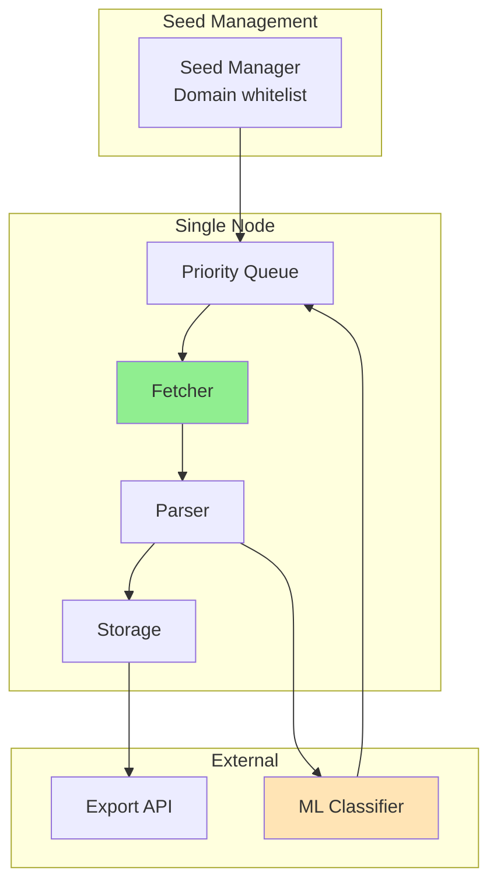

**Characteristics:**
- Single machine, focused domains
- Deep crawling with ML filtering
- High precision, low scale
- Simple operation

#### Alternative 2: Serverless Crawler
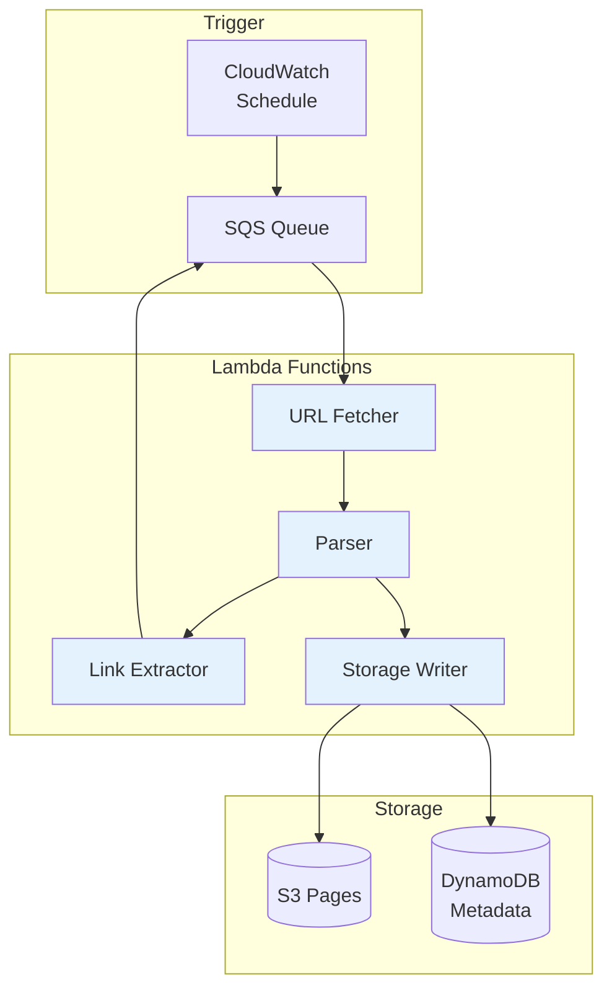

**Characteristics:**
- No infrastructure management
- Auto-scaling
- Pay per crawl
- Limited by Lambda constraints

#### Alternative 3: Browser-Based Crawler
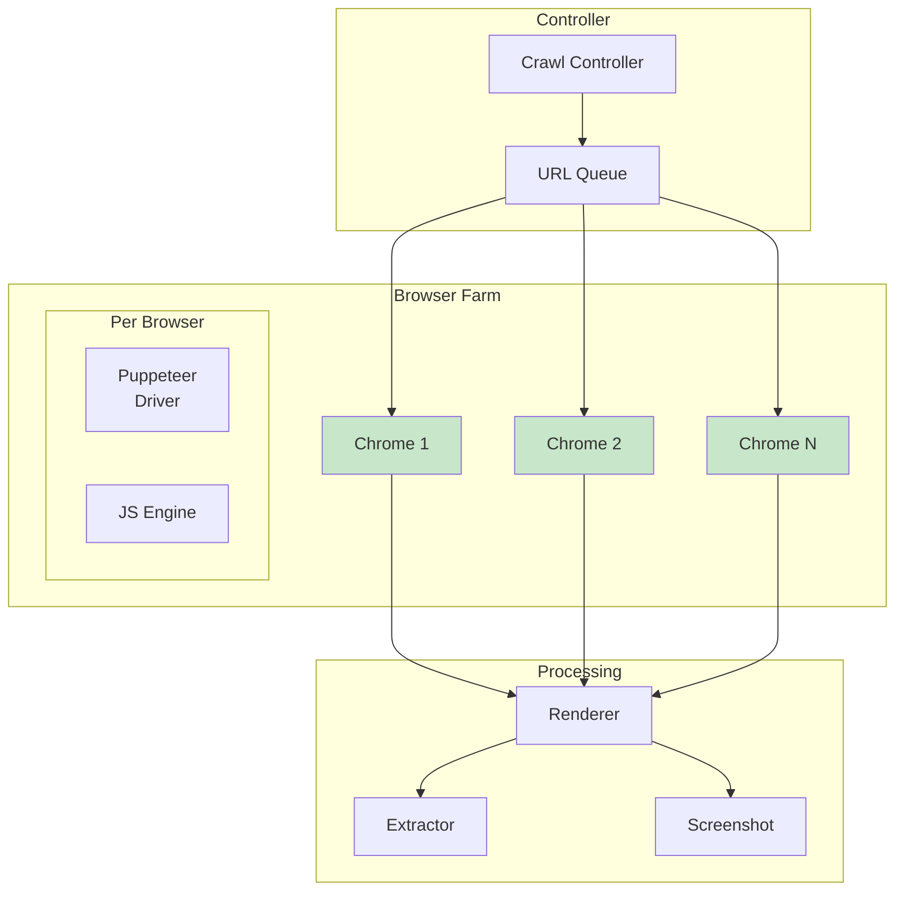

**Characteristics:**
- Handles JavaScript sites
- Screenshots and rendering
- High resource usage
- Complex debugging

#### Alternative 4: Distributed Stream Processing
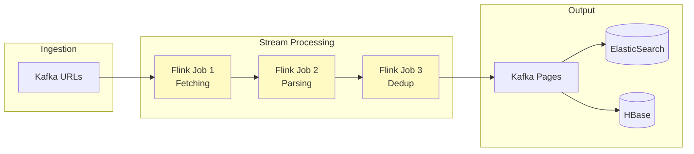

**Characteristics:**
- Stream processing paradigm
- Built-in fault tolerance
- Complex operations
- High operational overhead

#### Alternative 5: Edge-Distributed Crawler
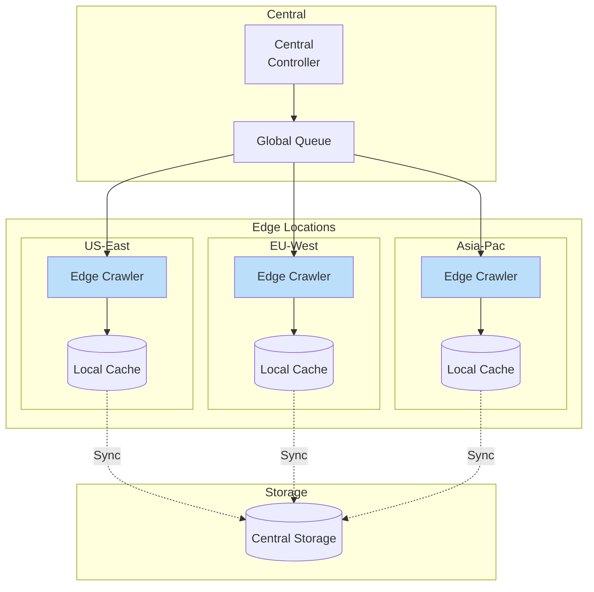

**Characteristics:**
- Geographic distribution
- Low latency to regional sites
- Complex synchronization
- Higher infrastructure cost

### ⚖️ Trade-off Analysis Matrix

| Architecture | Scale | Complexity | Cost | JS Support | Latency | Fault Tolerance | Ops Overhead |
|--------------|-------|------------|------|------------|---------|-----------------|---------------|
| **Focused Vertical** | ❌ Low | ✅ Simple | ✅ Low | ❌ None | ✅ Low | ❌ Limited | ✅ Minimal |
| **Serverless** | 🔶 Medium | 🔶 Medium | 🔶 Variable | ❌ None | 🔶 Medium | ✅ High | ✅ None |
| **Browser-Based** | 🔶 Medium | ❌ High | ❌ High | ✅ Full | ❌ High | 🔶 Medium | ❌ High |
| **Stream Processing** | ✅ High | ❌ Very High | ❌ High | ❌ None | ✅ Low | ✅ Excellent | ❌ Very High |
| **Edge-Distributed** | ✅ High | ❌ High | ❌ High | 🔶 Partial | ✅ Very Low | ✅ High | ❌ High |

### 📊 Performance & Scale Comparison

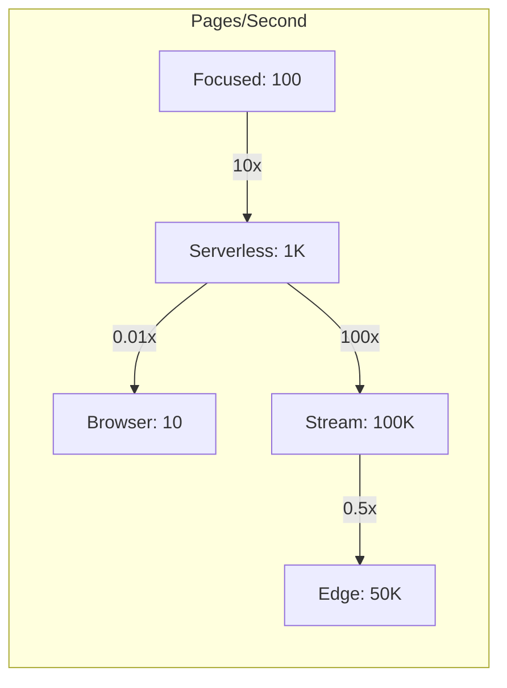

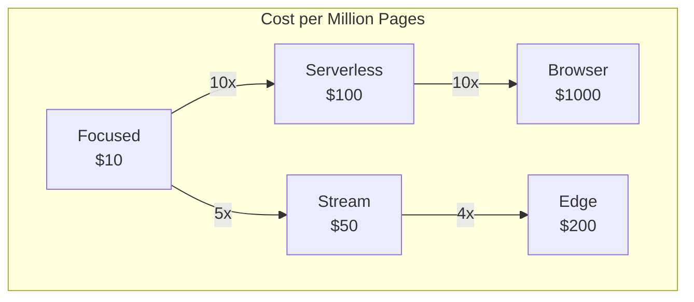

## Part 2: Architecture & Trade-offs

### 🏗️ Core Architecture

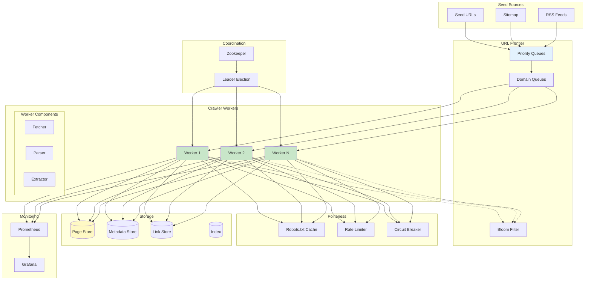

### ⚖️ Key Design Trade-offs

| Decision | Option A | Option B | Choice & Rationale |
|----------|----------|----------|-------------------|
| **URL Storage** | In-memory | Persistent DB | **Hybrid** - Hot URLs in memory, cold in RocksDB for scale |
| **Deduplication** | Exact (DB) | Probabilistic (Bloom) | **Bloom + DB** - Bloom for speed, DB for accuracy when needed |
| **Politeness** | Global queue | Per-domain queues | **Per-domain** - Ensures politeness without blocking other domains |
| **Content Storage** | Store everything | Store selectively | **Selective** - Store based on quality score to manage costs |
| **Architecture** | Monolithic | Distributed | **Distributed** - Required for web-scale crawling |

### 🔄 Alternative Architectures

#### Option 1: Single-Machine Crawler
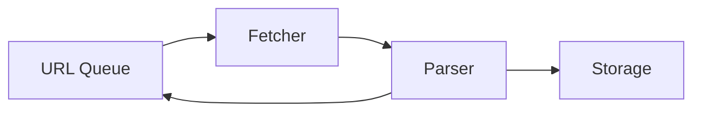

**Pros**: Simple, easy to debug, no coordination
**Cons**: Limited scale, single point of failure
**When to use**: Focused crawling, <1M pages

#### Option 2: Master-Worker
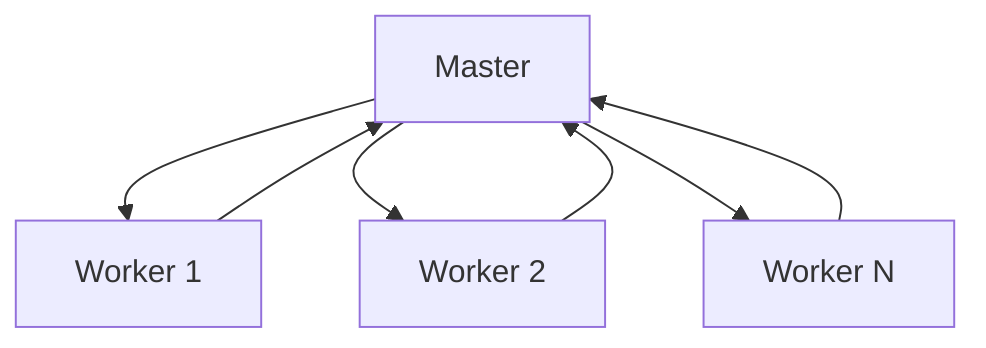

**Pros**: Simple coordination, easy work distribution
**Cons**: Master bottleneck, SPOF
**When to use**: Medium scale, trusted environment

#### Option 3: Peer-to-Peer
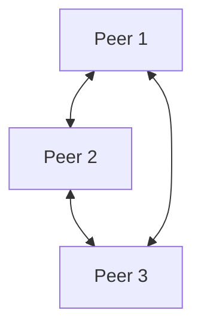

**Pros**: No SPOF, natural failover
**Cons**: Complex coordination, network overhead
**When to use**: Highly distributed, unreliable nodes

#### Option 4: Stream-Based
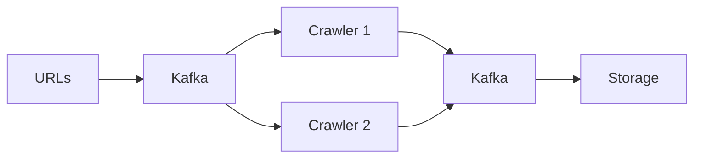

**Pros**: Scalable, fault-tolerant, replay capability
**Cons**: Operational complexity, latency
**When to use**: Large scale, need replay/audit

### 📊 Performance Characteristics

**Crawling Performance:**
```text
Metric              Single    Distributed   Notes
Pages/second        100       10,000+       With 100 nodes
Bandwidth           100Mbps   10Gbps+       Aggregate
URL Frontier        1M        100B+         Distributed storage
Dedup Accuracy      100%      99.9%         Bloom filter
```

**Resource Usage:**
```text
Component         Memory    CPU      Storage
Worker            4GB       2 cores  100GB
Frontier Node     16GB      4 cores  1TB
Coordinator       8GB       2 cores  10GB
Storage Node      32GB      8 cores  10TB
```

### 🎓 Key Lessons

1. **Politeness is Paramount**: Respect robots.txt and crawl delays. Aggressive crawling leads to IP bans.

2. **Frontier Design is Critical**: The URL frontier becomes the bottleneck. Distributed, persistent design essential.

3. **Duplicate Detection at Scale is Hard**: Perfect deduplication is expensive. Probabilistic methods with occasional false positives acceptable.

4. **Trap Detection Saves Resources**: Spider traps and infinite spaces waste resources. Pattern detection crucial.

5. **Adaptive Crawling Wins**: Static priorities fail. ML-based scheduling improves freshness and coverage.

### 🔗 Related Concepts & Deep Dives

**Prerequisite Understanding:**
- [Axiom 4: Concurrency](../part1-axioms/axiom4-concurrency/index.md) - Massive parallelism patterns
- [Axiom 7: Human Interface](../part1-axioms/axiom7-human/index.md) - Crawler ethics and robots.txt
- [Queue Patterns](../patterns/queues-streaming.md) - Priority queue implementations
- [Bulkhead Pattern](../patterns/bulkhead.md) - Domain isolation strategies

**Advanced Topics:**
- [JavaScript Crawling](../patterns/js-crawling.md) - Headless browser techniques
- [Trap Detection](../patterns/crawler-traps.md) - Identifying infinite spaces
- [Distributed Deduplication](../patterns/distributed-dedup.md) - At-scale duplicate detection
- [Adaptive Scheduling](../patterns/adaptive-scheduling.md) - ML-based crawl prioritization

**Related Case Studies:**
- [Search Engine](./search-engine.md) - Using crawled data for indexing
- [Web Archive](./web-archive.md) - Long-term storage of web content
- [Price Monitor](./price-monitor.md) - Focused e-commerce crawling

**Implementation Patterns:**
- [Politeness Policies](../patterns/politeness.md) - Respectful crawling
- [URL Normalization](../patterns/url-normalization.md) - Canonical URLs
- [Content Extraction](../patterns/content-extraction.md) - Parsing strategies
- [Frontier Management](../patterns/url-frontier.md) - Scalable queue design

### 📚 References

**Papers:**
- [The Evolution of Web Crawling](https://research.google/pubs/pub46428/)
- [IRLbot: Scaling to 6 Billion Pages](http://irl.cs.tamu.edu/people/hsin-tsang/papers/www2008.pdf)
- [Mercator: A Scalable, Extensible Web Crawler](https://courses.cs.washington.edu/courses/cse454/15wi/papers/mercator.pdf)

**Open Source Crawlers:**
- [Apache Nutch](https://nutch.apache.org/)
- [Scrapy](https://scrapy.org/)
- [Colly](https://github.com/gocolly/colly)
- [Heritrix](https://github.com/internetarchive/heritrix3)

**Related Patterns:**
- [URL Frontier Management](../patterns/priority-queue.md)
- [Politeness Policy](../patterns/rate-limiting.md)
- [Duplicate Detection](../patterns/bloom-filter.md)
- [Distributed Coordination](../patterns/leader-election.md)