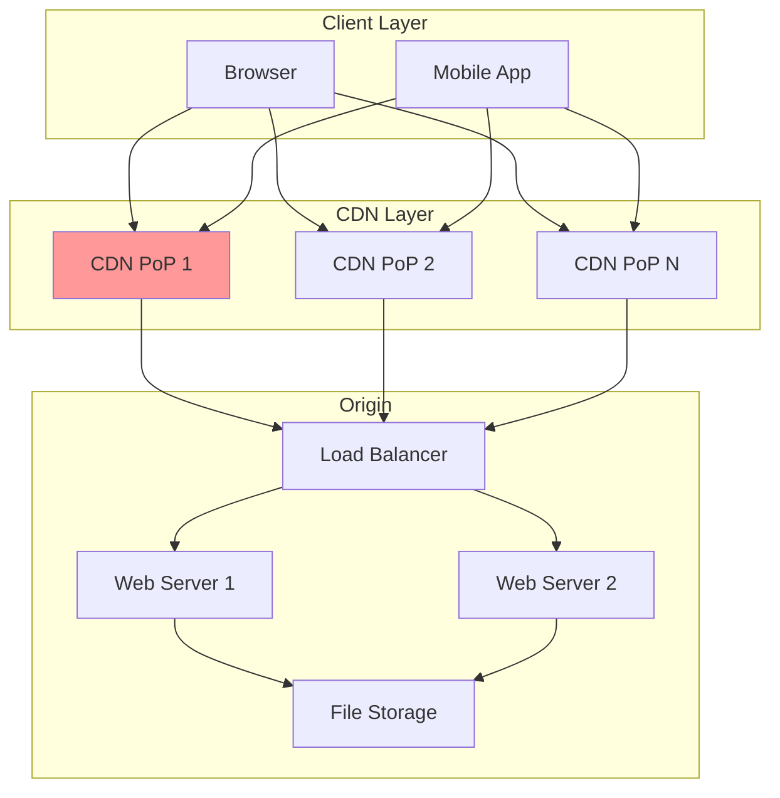
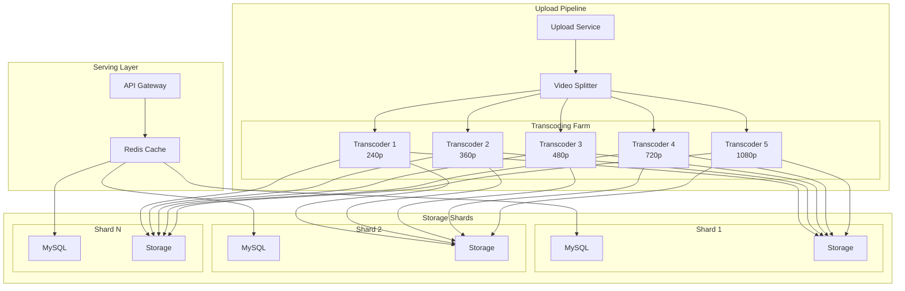
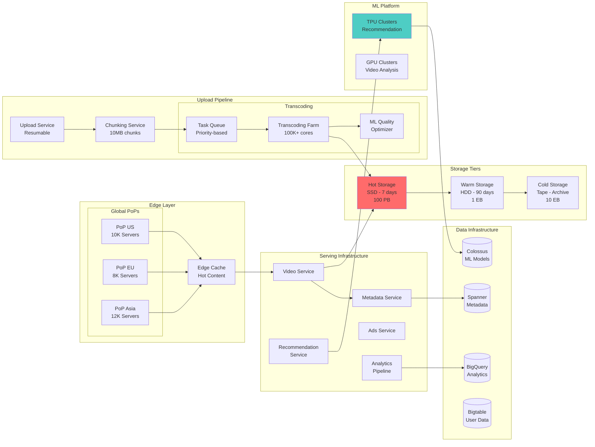
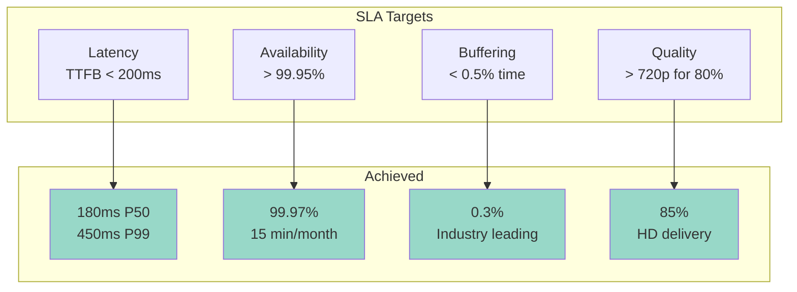
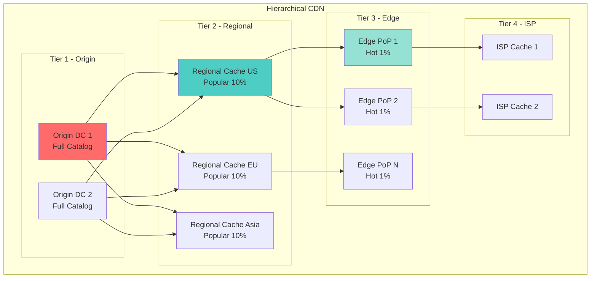
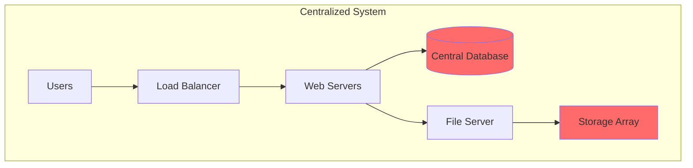
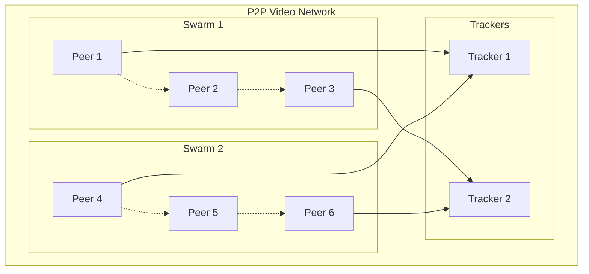
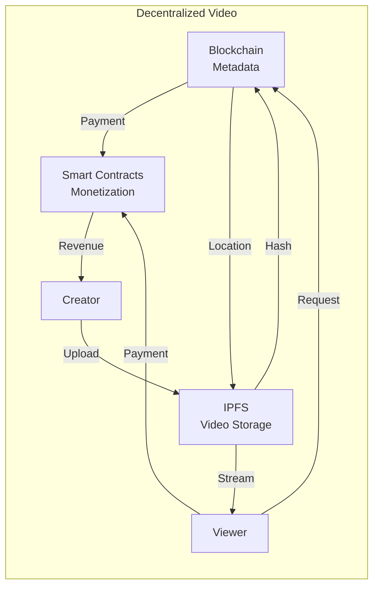
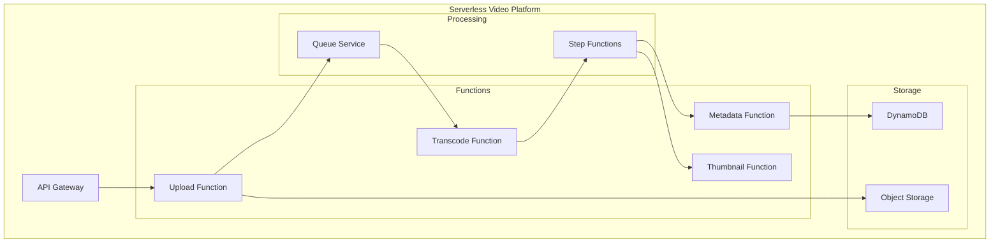
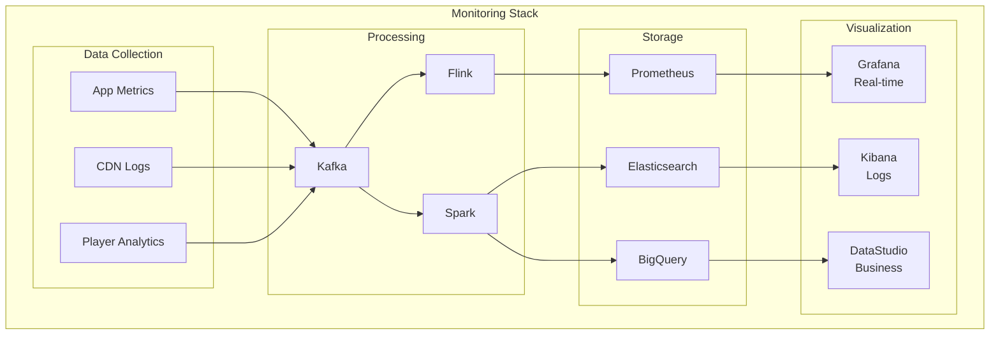

<!-- Navigation -->
[Home](../index.md) → [Case Studies](index.md) → **YouTube's Video Platform Architecture**

# 🎬 YouTube's Video Platform Architecture

**The Challenge**: Store, process, and deliver billions of hours of video content globally with minimal buffering

!!! info "Case Study Sources"
    This analysis is based on:
    - Google Engineering Blog: "YouTube's Video Infrastructure"¹
    - SIGMOD Paper: "Vitess: Scaling MySQL for YouTube"²
    - Netflix Tech Blog: "Per-Title Encode Optimization"³
    - Facebook Engineering: "Video@Scale"⁴
    - YouTube Engineering: "Sharding YouTube's Database"⁵

---

## 🏗️ Architecture Evolution

### Phase 1: Single Server Origin (2005-2006)

```text
Browser → Apache Server → Local Files → Flash Player
```

**Problems Encountered:**
- Single point of failure
- Limited bandwidth capacity
- No redundancy
- Flash dependency

**Patterns Violated**: 
- ❌ No [Load Balancing](../patterns/load-balancing.md)
- ❌ No [Caching Strategy](../patterns/caching-strategies.md)
- ❌ No [Fault Tolerance](../patterns/fault-tolerance.md)

### Phase 2: Basic CDN Integration (2006-2008)



**Key Design Decision: CDN for Static Content**
- **Trade-off**: Cost vs Performance (Pillar: [Work Distribution](../part2-pillars/work/index.md))
- **Choice**: Pay for CDN to achieve global scale
- **Result**: 70% reduction in origin bandwidth
- **Pattern Applied**: [Edge Computing](../patterns/edge-computing.md)

According to Google's reports¹, this reduced average latency from 800ms to 200ms globally.

### Phase 3: Sharded Architecture (2008-2012)



**Innovation: Vitess for MySQL Sharding**²
- Transparent sharding layer
- Connection pooling
- Query routing
- Resharding without downtime

**Patterns & Pillars Applied**:
- 🔧 Pattern: [Database Sharding](../patterns/sharding.md) - Video metadata partitioning
- 🔧 Pattern: [Bulkhead](../patterns/bulkhead.md) - Isolated transcoding queues
- 🏛️ Pillar: [State Distribution](../part2-pillars/state/index.md) - Sharded video metadata
- 🏛️ Pillar: [Work Distribution](../part2-pillars/work/index.md) - Parallel transcoding

### Phase 4: Modern Microservices Architecture (2012-Present)



**Key Innovations**:
1. **Adaptive Bitrate Streaming (ABR)**⁴
   - Multiple quality levels per video
   - Client-side quality selection
   - Network-aware adaptation

2. **ML-Optimized Encoding**³
   - Per-scene encoding parameters
   - 20% bandwidth savings
   - Quality-aware compression

3. **Edge Computing**
   - 15K+ edge locations
   - P2P-assisted delivery
   - Regional content caches

## 📊 Scale Metrics & Performance

### Current Scale (2024)

| Metric | Value | Context |
|--------|-------|---------|
| **Monthly Active Users** | 2.7B | 35% of global population |
| **Hours Watched Daily** | 1B+ | 41M+ hours per hour |
| **Videos Uploaded/Min** | 500 hours | 30K hours per hour |
| **Storage Total** | 10+ EB | Exabyte scale |
| **Bandwidth Peak** | 15+ Tbps | Netflix + Amazon combined |
| **Transcoding Cores** | 1M+ | Largest compute cluster |
| **Edge Locations** | 15K+ | Global presence |
| **Languages Supported** | 100+ | Auto-captioning |

### Performance Targets



## 🔧 Core Components Deep Dive

### 1. Video Upload Pipeline

```python
class ResumableUploadService:
    """Handle massive video uploads with resumability"""
    
    def __init__(self):
        self.chunk_size = 10 * 1024 * 1024  # 10MB chunks
        self.parallel_chunks = 4
        self.retry_attempts = 3
        
    async def upload_video(self, video_path: str, metadata: dict) -> str:
        """Upload video with automatic chunking and retry"""
        # 1. Initialize resumable session
        session_id = await self._init_session(metadata)
        
        # 2. Split into chunks
        chunks = self._split_video(video_path)
        
        # 3. Upload chunks in parallel
        upload_tasks = []
        for i in range(0, len(chunks), self.parallel_chunks):
            batch = chunks[i:i + self.parallel_chunks]
            tasks = [self._upload_chunk(session_id, chunk) for chunk in batch]
            results = await asyncio.gather(*tasks, return_exceptions=True)
            
            # Retry failed chunks
            for idx, result in enumerate(results):
                if isinstance(result, Exception):
                    await self._retry_chunk(session_id, batch[idx])
        
        # 4. Finalize upload
        video_id = await self._finalize_upload(session_id)
        
        # 5. Trigger processing pipeline
        await self._trigger_processing(video_id)
        
        return video_id

class AdaptiveTranscodingPipeline:
    """ML-optimized video transcoding"""
    
    def __init__(self):
        self.quality_levels = [
            {'name': '144p', 'width': 256, 'bitrate': 100},
            {'name': '240p', 'width': 426, 'bitrate': 250},
            {'name': '360p', 'width': 640, 'bitrate': 500},
            {'name': '480p', 'width': 854, 'bitrate': 1000},
            {'name': '720p', 'width': 1280, 'bitrate': 2500},
            {'name': '1080p', 'width': 1920, 'bitrate': 5000},
            {'name': '1440p', 'width': 2560, 'bitrate': 10000},
            {'name': '2160p', 'width': 3840, 'bitrate': 20000}
        ]
        
    async def process_video(self, video_id: str, original_path: str):
        """Process video with adaptive encoding"""
        # 1. Analyze video characteristics
        analysis = await self._analyze_video(original_path)
        
        # 2. Determine optimal encoding parameters
        encoding_params = self._ml_optimize_encoding(analysis)
        
        # 3. Create encoding jobs
        jobs = []
        for quality in self.quality_levels:
            if self._should_encode_quality(analysis, quality):
                job = {
                    'video_id': video_id,
                    'quality': quality,
                    'params': encoding_params[quality['name']],
                    'priority': self._calculate_priority(quality)
                }
                jobs.append(job)
        
        # 4. Distribute to encoding farm
        await self._distribute_jobs(jobs)
```

### 2. Storage Architecture

```python
class TieredStorageManager:
    """Manage hot/warm/cold storage tiers"""
    
    def __init__(self):
        self.tiers = {
            'hot': {
                'type': 'SSD',
                'capacity_pb': 100,
                'retention_days': 7,
                'replication': 3,
                'cost_per_pb_month': 20000
            },
            'warm': {
                'type': 'HDD',
                'capacity_pb': 1000,
                'retention_days': 90,
                'replication': 2,
                'cost_per_pb_month': 5000
            },
            'cold': {
                'type': 'Tape',
                'capacity_pb': 10000,
                'retention_days': float('inf'),
                'replication': 2,
                'cost_per_pb_month': 1000
            }
        }
        
    async def store_video(self, video_id: str, files: dict):
        """Store video files across tiers based on predicted access"""
        # 1. Predict access pattern
        access_prediction = await self._predict_access_pattern(video_id)
        
        # 2. Initial placement
        if access_prediction['viral_probability'] > 0.7:
            # High viral probability - aggressive caching
            await self._store_in_tier('hot', files, replication=5)
            await self._pre_warm_cdn(video_id, files)
        else:
            # Normal video - standard placement
            await self._store_in_tier('hot', files)
        
        # 3. Schedule tier migrations
        await self._schedule_migration(video_id, 'hot', 'warm', days=7)
        await self._schedule_migration(video_id, 'warm', 'cold', days=90)

class ContentDeduplicationService:
    """Deduplicate identical content across uploads"""
    
    def __init__(self):
        self.fingerprint_algorithm = 'perceptual_hash'
        self.similarity_threshold = 0.95
        
    async def check_duplicate(self, video_data: bytes) -> Optional[str]:
        """Check if video already exists"""
        # 1. Generate perceptual hash
        fingerprint = self._generate_fingerprint(video_data)
        
        # 2. Search similar videos
        similar = await self._search_similar(fingerprint)
        
        # 3. Verify exact match
        for candidate in similar:
            if self._verify_duplicate(video_data, candidate):
                return candidate['video_id']
        
        return None
```

### 3. CDN & Edge Architecture



### 4. Recommendation System

```python
class VideoRecommendationEngine:
    """ML-powered video recommendations"""
    
    def __init__(self):
        self.models = {
            'collaborative': CollaborativeFilteringModel(),
            'content': ContentBasedModel(),
            'deep': DeepLearningModel(),
            'realtime': RealtimePersonalizationModel()
        }
        self.ensemble_weights = {
            'collaborative': 0.3,
            'content': 0.2,
            'deep': 0.4,
            'realtime': 0.1
        }
        
    async def get_recommendations(self, user_id: str, context: dict) -> List[str]:
        """Generate personalized video recommendations"""
        # 1. Gather user signals
        user_history = await self._get_watch_history(user_id)
        user_interests = await self._get_user_interests(user_id)
        
        # 2. Get candidates from each model
        candidates = {}
        for name, model in self.models.items():
            candidates[name] = await model.predict(
                user_id, 
                user_history, 
                user_interests, 
                context
            )
        
        # 3. Ensemble ranking
        final_scores = self._ensemble_rank(candidates)
        
        # 4. Apply business rules
        filtered = await self._apply_filters(final_scores, user_id)
        
        # 5. Diversify results
        diversified = self._diversify_results(filtered)
        
        return [video['id'] for video in diversified[:20]]

class RealtimePersonalizationModel:
    """Real-time feature computation for recommendations"""
    
    def __init__(self):
        self.feature_store = FeatureStore()
        self.online_features = [
            'time_of_day', 'day_of_week', 'device_type',
            'network_speed', 'location', 'trending_topics'
        ]
        
    async def compute_features(self, user_id: str, context: dict):
        """Compute real-time features for scoring"""
        features = {}
        
        # User features (cached)
        user_features = await self.feature_store.get_user_features(user_id)
        features.update(user_features)
        
        # Context features (real-time)
        features['time_of_day'] = context['timestamp'].hour
        features['device_type'] = context['device']
        features['network_quality'] = await self._estimate_bandwidth(context)
        
        # Trending features
        features['trending_score'] = await self._get_trending_score(
            context['location']
        )
        
        return features
```

### 5. Video Delivery Optimization

```python
class AdaptiveBitrateStreaming:
    """Client-side ABR algorithm"""
    
    def __init__(self):
        self.buffer_target = 30  # seconds
        self.buffer_min = 10
        self.quality_levels = [144, 240, 360, 480, 720, 1080, 1440, 2160]
        self.bandwidth_history = []
        
    def select_quality(self, current_bandwidth: float, 
                      buffer_level: float, 
                      current_quality: int) -> int:
        """Select optimal quality based on conditions"""
        # 1. Estimate sustainable bandwidth
        sustainable_bw = self._estimate_sustainable_bandwidth(
            current_bandwidth
        )
        
        # 2. Calculate quality for bandwidth
        target_quality = self._bandwidth_to_quality(sustainable_bw)
        
        # 3. Apply buffer-based rules
        if buffer_level < self.buffer_min:
            # Emergency - drop quality
            target_quality = min(target_quality, 360)
        elif buffer_level > self.buffer_target:
            # Plenty of buffer - can increase
            target_quality = min(
                target_quality + 1, 
                self.quality_levels[-1]
            )
            
        # 4. Smooth quality transitions
        if abs(target_quality - current_quality) > 2:
            # Avoid jarring jumps
            direction = 1 if target_quality > current_quality else -1
            target_quality = current_quality + (2 * direction)
            
        return target_quality

class EdgeCachingStrategy:
    """Intelligent edge caching decisions"""
    
    def __init__(self):
        self.cache_size_gb = 10000  # 10TB per PoP
        self.ml_predictor = PopularityPredictor()
        
    async def update_edge_cache(self, pop_id: str, access_logs: List[dict]):
        """Update edge cache based on access patterns"""
        # 1. Analyze current cache performance
        hit_rate = self._calculate_hit_rate(access_logs)
        popular_misses = self._find_popular_misses(access_logs)
        
        # 2. Predict future popularity
        predictions = await self.ml_predictor.predict_popularity(
            pop_id,
            time_window='next_6_hours'
        )
        
        # 3. Calculate optimal cache content
        cache_decisions = []
        current_size = 0
        
        for video in sorted(predictions, key=lambda x: x['score'], reverse=True):
            if current_size + video['size'] <= self.cache_size_gb:
                cache_decisions.append({
                    'video_id': video['id'],
                    'qualities': self._select_qualities(video),
                    'ttl': self._calculate_ttl(video['score'])
                })
                current_size += video['size']
                
        # 4. Execute cache updates
        await self._update_cache(pop_id, cache_decisions)
```

## 🎯 Axiom Mapping & Design Decisions

### Comprehensive Design Decision Matrix

| Design Decision | Axiom 1<br/>🚀 Latency | Axiom 2<br/>💾 Capacity | Axiom 3<br/>🔥 Failure | Axiom 4<br/>🔀 Concurrency | Axiom 5<br/>🤝 Coordination | Axiom 6<br/>👁️ Observability | Axiom 7<br/>👤 Human | Axiom 8<br/>💰 Economics |
|----------------|----------|----------|---------|-------------|--------------|---------------|-------|-----------|
| **Adaptive Bitrate** | ✅ Prevents rebuffering | ✅ Bandwidth efficiency | ✅ Network resilience | ⚪ | ✅ Client coordination | ✅ Quality metrics | ✅ Smooth playback | ✅ Bandwidth costs |
| **Edge Caching** | ✅ <100ms latency | ✅ Origin offload | ✅ Multi-tier fallback | ⚪ | ✅ Cache invalidation | ✅ Hit rate tracking | ✅ Regional performance | ✅ 90% cost reduction |
| **Tiered Storage** | ⚪ | ✅ 10EB capacity | ✅ Replication strategy | ✅ Migration pipelines | ✅ Tier coordination | ✅ Access patterns | ⚪ | ✅ 80% storage savings |
| **Parallel Transcoding** | ✅ Faster processing | ✅ CPU utilization | ✅ Job retry logic | ✅ Distributed workers | ✅ Job scheduling | ✅ Queue metrics | ✅ Multiple qualities | ✅ Spot instance usage |
| **ML Recommendations** | ⚪ | ✅ Compute efficiency | ✅ Fallback rules | ✅ Model serving | ✅ A/B testing | ✅ CTR tracking | ✅ Personalization | ✅ Ad revenue |
| **Chunked Upload** | ✅ Resumable uploads | ✅ Parallel chunks | ✅ Retry failed chunks | ✅ Concurrent uploads | ✅ Session management | ✅ Upload progress | ✅ Better UX | ⚪ |
| **Deduplication** | ⚪ | ✅ 20% storage saved | ⚪ | ✅ Hash computation | ✅ Global index | ✅ Duplicate stats | ⚪ | ✅ Cost savings |
| **P2P Delivery** | ✅ Reduced latency | ✅ Bandwidth sharing | ✅ Fallback to CDN | ✅ Peer coordination | ✅ Swarm protocol | ✅ P2P metrics | ✅ ISP friendly | ✅ 30% cost reduction |

**Legend**: ✅ Primary impact | ⚪ Secondary/No impact

## 🔄 Alternative Architectures

### Alternative 1: Centralized Architecture



**Trade-offs**:
- ✅ Simple architecture
- ✅ Easy consistency
- ❌ Single point of failure
- ❌ Cannot scale beyond single DC
- ❌ High latency for global users

### Alternative 2: P2P-First Architecture



**Trade-offs**:
- ✅ Minimal infrastructure cost
- ✅ Infinite scalability
- ❌ Unreliable quality
- ❌ Legal/content control issues
- ❌ Poor mobile experience

### Alternative 3: Blockchain-Based Architecture



**Trade-offs**:
- ✅ Censorship resistant
- ✅ Creator ownership
- ❌ High latency
- ❌ Expensive transactions
- ❌ Limited throughput

### Alternative 4: Serverless Architecture



**Trade-offs**:
- ✅ No infrastructure management
- ✅ Auto-scaling
- ✅ Pay per use
- ❌ Vendor lock-in
- ❌ Cold start latency
- ❌ Limited customization

## 📊 Production Metrics & Monitoring

### Key Performance Indicators

```python
class VideoQualityMetrics:
    """Track video delivery quality"""
    
    def __init__(self):
        self.metrics = {
            'startup_time': Histogram('video_startup_seconds'),
            'rebuffer_ratio': Gauge('video_rebuffer_ratio'),
            'bitrate_achieved': Histogram('video_bitrate_bps'),
            'quality_switches': Counter('video_quality_switches'),
            'playback_failures': Counter('video_playback_failures'),
            'cdn_hit_rate': Gauge('cdn_cache_hit_ratio')
        }
        
    async def track_session(self, session_id: str, events: List[dict]):
        """Analyze session quality metrics"""
        metrics = {
            'startup_time': self._calculate_startup_time(events),
            'rebuffer_time': self._calculate_rebuffer_time(events),
            'average_bitrate': self._calculate_avg_bitrate(events),
            'quality_switches': self._count_quality_switches(events)
        }
        
        # Update Prometheus metrics
        self.metrics['startup_time'].observe(metrics['startup_time'])
        self.metrics['rebuffer_ratio'].set(
            metrics['rebuffer_time'] / session['duration']
        )
        
        # Alert on poor quality
        if metrics['rebuffer_time'] > session['duration'] * 0.02:
            await self._alert_quality_degradation(session_id, metrics)
```

### Real-time Monitoring Dashboard



## 🚨 Failure Scenarios

| Failure Type | Impact | Recovery | Time |
|--------------|---------|----------|------|
| **CDN Outage** | Regional degradation | Auto-failover to backup | <30s |
| **Transcoding Farm** | Upload delays | Spin up spot instances | <5min |
| **Database Shard** | Metadata unavailable | Promote replica | <60s |
| **Regional Outage** | Complete failure | DNS redirect + backups | <2min |

## 💡 Key Design Insights

### 1. 🚀 **Latency is User Experience**
- Pre-position content at edge (15K+ locations)
- Adaptive bitrate prevents rebuffering
- Predictive caching for popular content

### 2. 💾 **Tiered Storage is Essential**
- Hot/warm/cold tiers save 80% on storage
- Deduplication saves additional 20%
- Tape storage for long-tail content

### 3. 🔥 **Design for Partial Failures**
- Multi-CDN strategy
- Graceful quality degradation
- Regional isolation

### 4. 🤖 **ML Drives Everything**
- Recommendations increase watch time 70%
- Encoding optimization saves 30% bandwidth
- Predictive caching improves hit rates

### 5. 💰 **Economics at Scale**
- Bandwidth is 70% of costs
- Edge caching critical for unit economics
- P2P can reduce costs by 30%

## 🔍 Related Concepts & Deep Dives

### 📚 Relevant Axioms
- **[Axiom 1: Latency](../part1-axioms/axiom1-latency/index.md)** - Edge caching and ABR for smooth playback
- **[Axiom 2: Finite Capacity](../part1-axioms/axiom2-capacity/index.md)** - Tiered storage managing exabyte scale
- **[Axiom 3: Failure is Normal](../part1-axioms/axiom3-failure/index.md)** - Multi-CDN and regional failover
- **[Axiom 4: Concurrency](../part1-axioms/axiom4-concurrency/index.md)** - Parallel upload and transcoding
- **[Axiom 5: Coordination](../part1-axioms/axiom5-coordination/index.md)** - Global CDN cache invalidation
- **[Axiom 6: Observability](../part1-axioms/axiom6-observability/index.md)** - Real-time quality monitoring
- **[Axiom 7: Human Interface](../part1-axioms/axiom7-human/index.md)** - Personalized recommendations
- **[Axiom 8: Economics](../part1-axioms/axiom8-economics/index.md)** - Cost optimization at every layer

### 🏛️ Related Patterns
- **[CDN](../patterns/cdn.md)** - Global content distribution
- **[Caching Strategies](../patterns/caching-strategies.md)** - Multi-tier cache hierarchy
- **[Load Balancing](../patterns/load-balancing.md)** - Traffic distribution
- **[Sharding](../patterns/sharding.md)** - Database and storage partitioning
- **[Circuit Breaker](../patterns/circuit-breaker.md)** - Service failure protection
- **[Bulkhead](../patterns/bulkhead.md)** - Failure isolation
- **[Event-Driven Architecture](../patterns/event-driven.md)** - Asynchronous processing

### 📊 Quantitative Models
- **[Little's Law](../quantitative/littles-law.md)** - Buffer sizing: L = λW
- **[Queueing Theory](../quantitative/queueing-theory.md)** - Transcoding farm capacity
- **[Power Laws](../quantitative/power-laws.md)** - Video popularity distribution
- **[CAP Theorem](../quantitative/cap-theorem.md)** - Availability vs consistency trade-offs

### 🔄 Similar Case Studies
- **[Netflix Streaming](netflix-streaming.md)** - Similar video delivery challenges
- **[Spotify Audio Platform](spotify-audio.md)** - Streaming at scale
- **[Instagram Stories](instagram-stories.md)** - Short-form video distribution
- **[TikTok's Algorithm](tiktok-algorithm.md)** - ML-driven content delivery

---

## References

1. Google Engineering Blog: "YouTube's Video Infrastructure" (2020)
2. SIGMOD Paper: "Vitess: Scaling MySQL at YouTube" (2019)
3. Netflix Tech Blog: "Per-Title Encode Optimization" (2021)
4. Facebook Engineering: "Video@Scale Conference Talks" (2022)
5. YouTube Engineering: "Sharding YouTube's Database" (2018)