# Design YouTube

!!! info "Case Study Overview"
    **System**: Video sharing platform serving billions of users  
    **Scale**: 2B+ MAU, 500 hours uploaded/minute, 1B hours watched/day  
    **Challenges**: Video storage, global CDN, real-time transcoding, personalization  
    **Key Patterns**: Adaptive bitrate, tiered storage, edge caching, ML recommendation

*Estimated reading time: 45 minutes*

## Introduction

YouTube processes over 1 billion hours of video watched daily, uploads 500 hours of video per minute, and serves content to 2 billion monthly users across the globe. This massive scale requires solving fundamental distributed systems challenges: storing exabytes of data, transcoding millions of videos concurrently, delivering content with minimal buffering, and recommending from a catalog of billions of videos. Let's explore how physics, mathematics, and distributed systems principles shape the architecture of the world's largest video platform.

## Part 1: Concept Map - The Physics of Video at Scale

### Axiom 1: Latency - The Buffering Boundary

Video streaming requires maintaining continuous data flow to prevent buffering, making latency management critical.

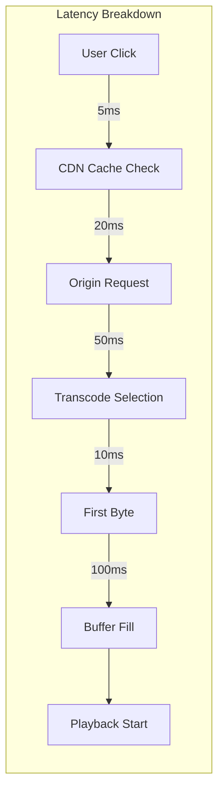

**Key Latency Metrics:**
- Time to First Byte (TTFB): < 200ms
- Start-up Time: < 2 seconds
- Rebuffer Rate: < 0.5%
- Seek Latency: < 1 second

**Latency Optimization Strategies:**

| Strategy | Impact | Trade-off |
|----------|--------|-----------|
| Edge Caching | -80% latency | Storage cost |
| Adaptive Bitrate | -60% rebuffering | Quality variation |
| Predictive Buffering | -40% startup time | Bandwidth waste |
| HTTP/3 QUIC | -25% packet loss impact | CPU overhead |

### Axiom 2: Capacity - The Exabyte Challenge

YouTube's capacity requirements grow exponentially with both users and video quality improvements.

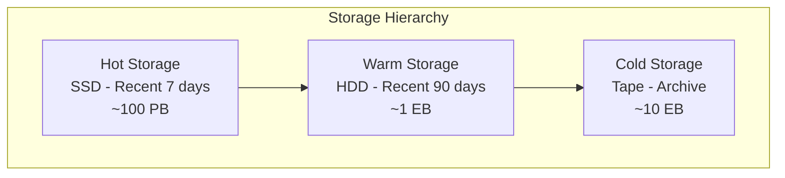

**Capacity Planning Model:**

| Metric | Value | Growth Rate |
|--------|-------|-------------|
| Daily Uploads | 720,000 hours | +20% YoY |
| Storage per Hour | 5 GB (multi-quality) | Increasing with 4K/8K |
| Total Storage | 10+ Exabytes | Doubling every 2 years |
| Bandwidth | 10+ Tbps peak | +35% YoY |
| Transcoding Compute | 1M+ cores | +25% YoY |

**Storage Optimization:**
1. **Deduplication**: 15-20% savings via content fingerprinting
2. **Compression**: H.265/AV1 provides 30-50% better compression
3. **Tiered Storage**: 80% cost reduction using cold storage
4. **Regional Replication**: Store popular content closer to users

### Axiom 3: Failure - Resilience at Every Layer

With millions of servers, failures are constant and must be handled transparently.

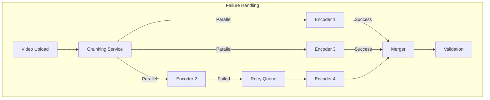

**Failure Scenarios and Mitigation:**

| Failure Type | Frequency | Mitigation Strategy |
|--------------|-----------|-------------------|
| Server Failure | 100/day | Automatic job migration |
| Datacenter Outage | 1/year | Multi-region failover |
| Network Partition | 10/day | Eventual consistency |
| Corrupted Upload | 1000/day | Checksum validation |
| CDN Node Failure | 50/day | Dynamic rerouting |

### Axiom 4: Concurrency - Parallel Everything

Handling millions of concurrent uploads, transcodes, and streams requires massive parallelization.

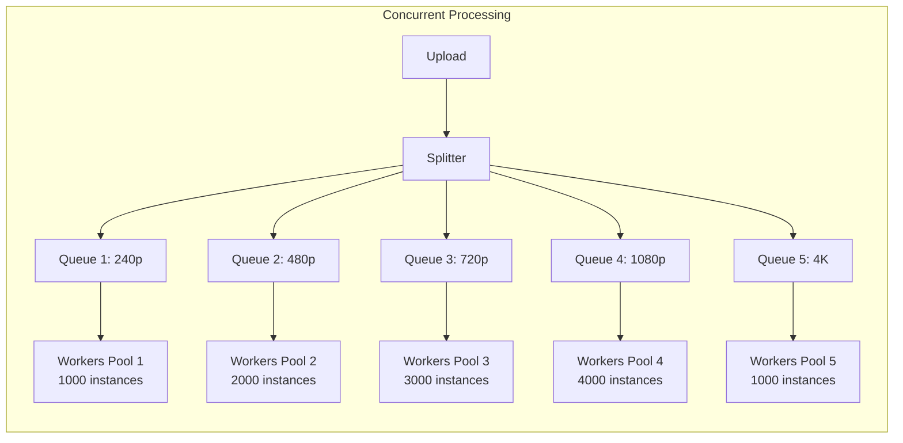

**Concurrency Patterns:**

| Component | Concurrency Model | Scale |
|-----------|------------------|-------|
| Upload | Chunked parallel upload | 10K concurrent |
| Transcode | Work queue + worker pools | 100K concurrent |
| Streaming | Multi-CDN parallel delivery | 10M concurrent |
| Comments | Sharded by video ID | 1M writes/sec |
| Analytics | Stream processing | 100M events/sec |

### Axiom 5: Coordination - Global Consistency

Coordinating video metadata, views, and user state across regions while maintaining consistency.

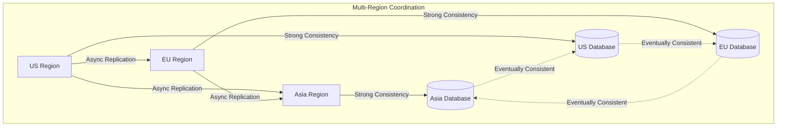

**Consistency Requirements:**

| Data Type | Consistency Model | Sync Latency |
|-----------|------------------|--------------|
| Video Metadata | Eventually Consistent | < 1 minute |
| View Count | Eventually Consistent | < 5 minutes |
| User Subscriptions | Strong Consistency | Immediate |
| Comments | Causal Consistency | < 10 seconds |
| Monetization | Strong Consistency | Immediate |

### Axiom 6: Observability - Understanding the Platform

Monitoring billions of video streams requires sophisticated observability.

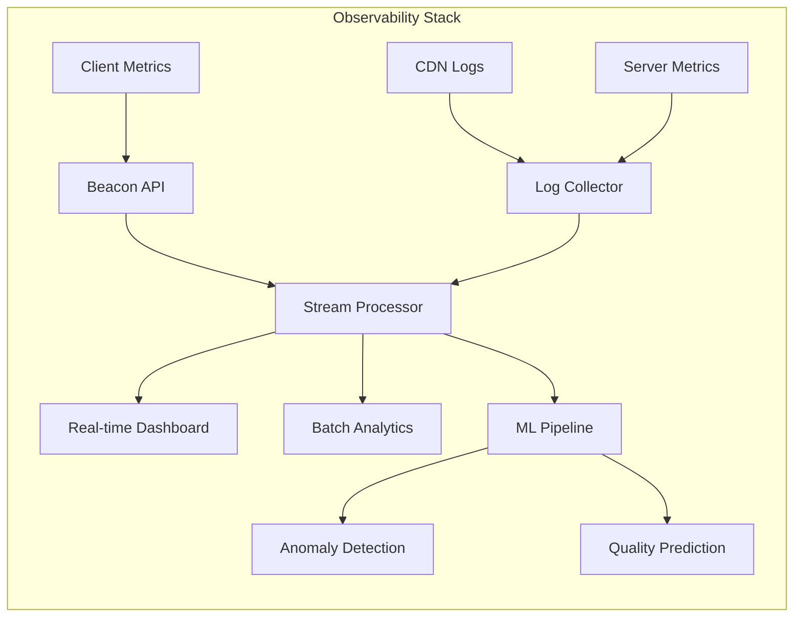

**Key Metrics Tracked:**

| Metric Category | Examples | Update Frequency |
|----------------|----------|------------------|
| Quality of Experience | Buffering ratio, Start time | Real-time |
| Infrastructure | CPU, Memory, Network | 10 second |
| Business | Watch time, Ad revenue | 5 minute |
| Content | Upload rate, Transcode queue | 1 minute |
| Security | Abuse detection, Copyright | Real-time |

### Axiom 7: Human Interface - Creator and Viewer Experience

Optimizing for both content creators and viewers with different needs and expectations.

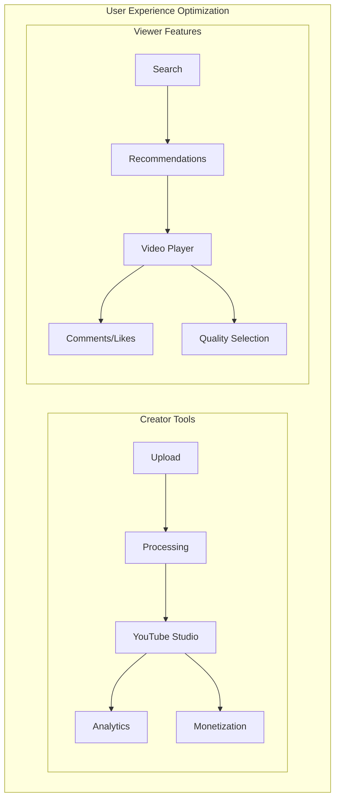

**Experience Optimization:**

| User Type | Key Metrics | Optimization Focus |
|-----------|-------------|-------------------|
| Creators | Upload success rate, Processing time | Fast feedback, Rich analytics |
| Viewers | Start-up time, Video quality | Instant playback, Personalization |
| Mobile Users | Data usage, Battery life | Efficient codec, Offline support |
| Smart TV | 4K availability, UI responsiveness | High quality, Simple navigation |

### Axiom 8: Economics - Balancing Cost and Quality

YouTube must balance infrastructure costs with user experience and creator monetization.

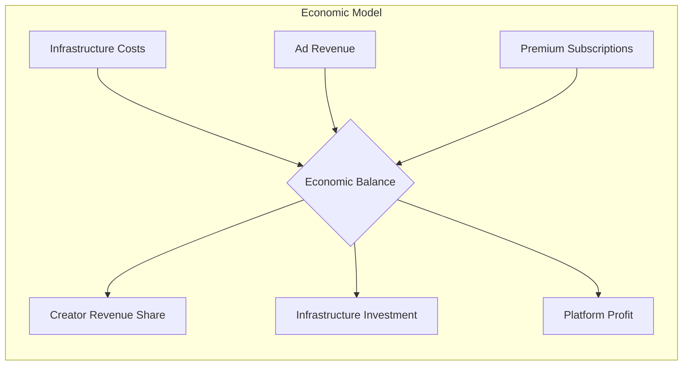

**Cost Breakdown:**

| Component | Cost/Month | Percentage |
|-----------|------------|------------|
| Storage | $2M | 20% |
| Bandwidth | $4M | 40% |
| Compute | $2.5M | 25% |
| Operations | $1.5M | 15% |

**Optimization Strategies:**

1. **Adaptive Quality**: Save 40% bandwidth by adjusting to network conditions
2. **Predictive Caching**: Reduce origin requests by 60%
3. **Efficient Encoding**: AV1 codec saves 30% storage
4. **Tiered Storage**: 70% cost reduction for cold content

## Part 2: Architecture - Building Video at Scale

### Current Architecture: The Distributed Video Pipeline

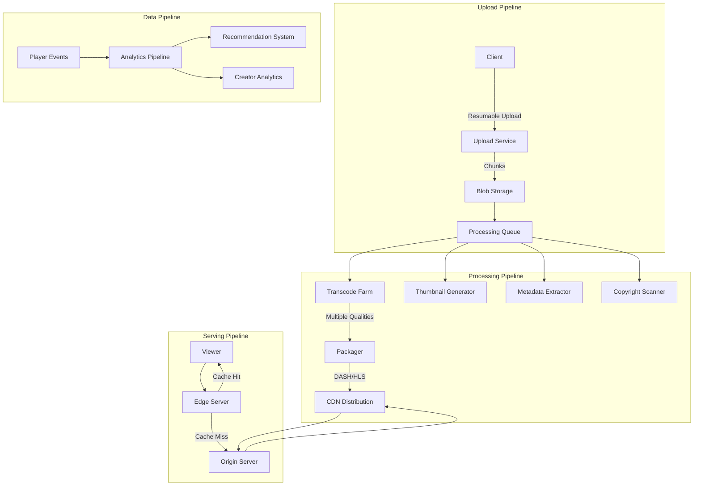

### Alternative Architecture 1: Peer-to-Peer Hybrid

**Design**: Leverage viewer devices for content distribution.

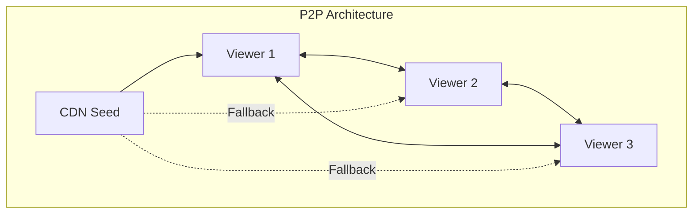

**Trade-offs:**

| Aspect | Benefit | Challenge |
|--------|---------|-----------|
| Bandwidth Cost | -60% CDN costs | Complex coordination |
| Scalability | Improves with popularity | Poor for long-tail |
| Reliability | Multiple sources | Peer churn |
| Security | Harder to attack | Content verification needed |

### Alternative Architecture 2: Edge Computing

**Design**: Process videos at edge locations near users.

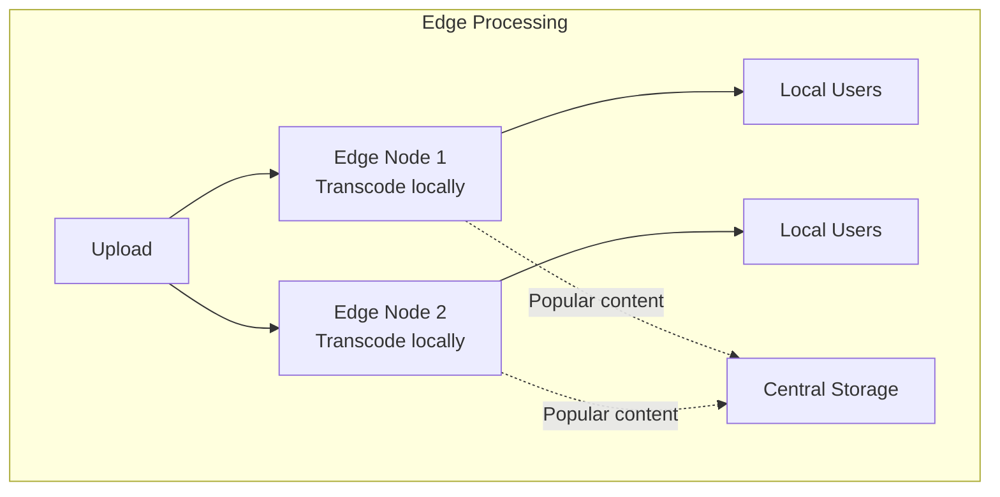

**Trade-offs:**

| Aspect | Benefit | Challenge |
|--------|---------|-----------|
| Latency | Ultra-low for local content | Requires many edge sites |
| Efficiency | Reduced backbone traffic | Duplicate processing |
| Cost | Lower bandwidth costs | Higher compute costs |
| Management | Simpler scaling | Complex orchestration |

### Alternative Architecture 3: Blockchain-Based

**Design**: Decentralized video platform using blockchain.

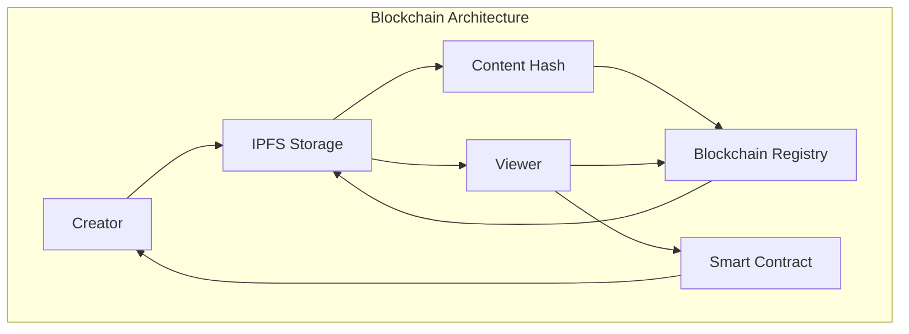

**Trade-offs:**

| Aspect | Benefit | Challenge |
|--------|---------|-----------|
| Censorship | Resistant | Illegal content issues |
| Creator Control | Direct monetization | No platform features |
| Costs | No intermediary | High blockchain fees |
| Performance | Distributed | Much slower |

### Alternative Architecture 4: AI-First Architecture

**Design**: Use AI for everything from compression to content generation.

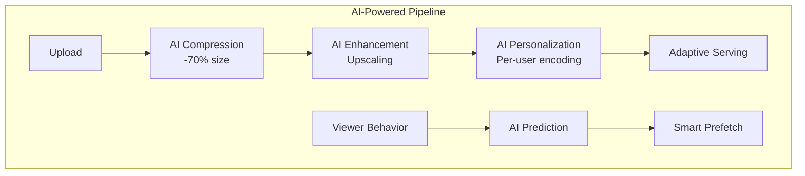

**Trade-offs:**

| Aspect | Benefit | Challenge |
|--------|---------|-----------|
| Efficiency | 70% better compression | High compute cost |
| Quality | AI upscaling | May alter content |
| Personalization | Per-user optimization | Privacy concerns |
| Innovation | Cutting edge | Unproven at scale |

### Recommended Architecture: Multi-Tier Adaptive System

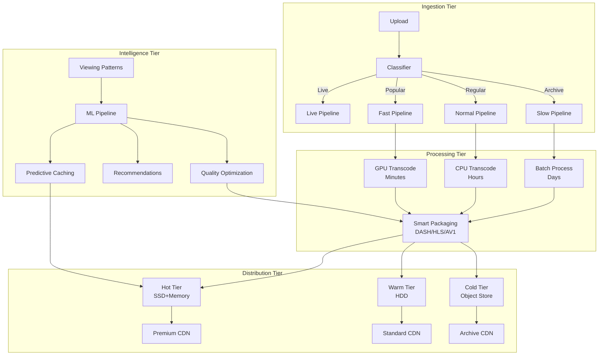

### Implementation Considerations

**1. Video Upload Pipeline:**
- Resumable uploads for reliability
- Client-side chunking (10MB chunks)
- Parallel chunk upload
- Immediate feedback to creator

**2. Transcoding Strategy:**
- Priority queues based on creator tier
- Adaptive quality ladder (240p to 8K)
- Hardware acceleration (GPU/ASIC)
- Progressive encoding (lower qualities first)

**3. CDN Strategy:**
- Multi-CDN for redundancy
- Anycast for optimal routing
- Predictive content placement
- Bandwidth allocation by popularity

**4. Recommendation System:**
- Collaborative filtering for discovery
- Deep learning for personalization
- Real-time feature updates
- A/B testing framework

## Axiom Mapping Matrix

### Comprehensive Design Decision Mapping

| Design Decision | Axiom 1<br/>🚀 Latency | Axiom 2<br/>💾 Capacity | Axiom 3<br/>🔥 Failure | Axiom 4<br/>🔀 Concurrency | Axiom 5<br/>🤝 Coordination | Axiom 6<br/>👁️ Observability | Axiom 7<br/>👤 Human | Axiom 8<br/>💰 Economics |
|----------------|----------|----------|---------|-------------|--------------|---------------|-------|-----------|
| **Multi-tier CDN** | ✅ Edge servers reduce RTT to <50ms | ✅ Distributed storage across regions | ✅ Multiple CDN failover | ⚪ | ✅ Cache invalidation protocols | ✅ CDN hit rate metrics | ✅ Low buffering for users | ✅ Bandwidth cost optimization |
| **Adaptive Bitrate** | ✅ Instant quality adjustment | ✅ Multiple quality versions | ✅ Fallback to lower quality | ✅ Parallel encoding | ⚪ | ✅ Quality switch tracking | ✅ Smooth playback | ✅ Bandwidth efficiency |
| **Chunked Upload** | ✅ Resume capability | ✅ Parallel processing | ✅ Partial upload recovery | ✅ Concurrent chunks | ✅ Chunk ordering | ✅ Upload progress | ✅ Creator feedback | ⚪ |
| **Tiered Storage** | ✅ Hot content in SSD | ✅ Exabyte scale support | ✅ Redundancy per tier | ⚪ | ✅ Migration policies | ✅ Access pattern tracking | ⚪ | ✅ 70% cost reduction |
| **Precomputed Feeds** | ✅ <100ms feed load | ✅ Reduced compute | ✅ Stale feed fallback | ✅ Async generation | ✅ Feed consistency | ✅ Freshness metrics | ✅ Fast discovery | ✅ Compute optimization |
| **ML Recommendations** | ✅ Real-time inference | ✅ Model caching | ✅ Rule-based fallback | ✅ Parallel predictions | ✅ A/B test coordination | ✅ CTR tracking | ✅ Personalization | ✅ Engagement optimization |
| **Global Replication** | ✅ Regional serving | ✅ Storage distribution | ✅ Geo-redundancy | ⚪ | ✅ Cross-region sync | ✅ Replication lag | ✅ Local content | ✅ Regional efficiency |
| **Live Streaming** | ✅ Sub-second latency | ✅ Dynamic scaling | ✅ Stream redundancy | ✅ Concurrent viewers | ✅ Stream synchronization | ✅ Stream health | ✅ Real-time interaction | ✅ Peak cost management |

**Legend**: ✅ Primary impact | ⚪ Secondary/No impact

### Axiom Implementation Priority

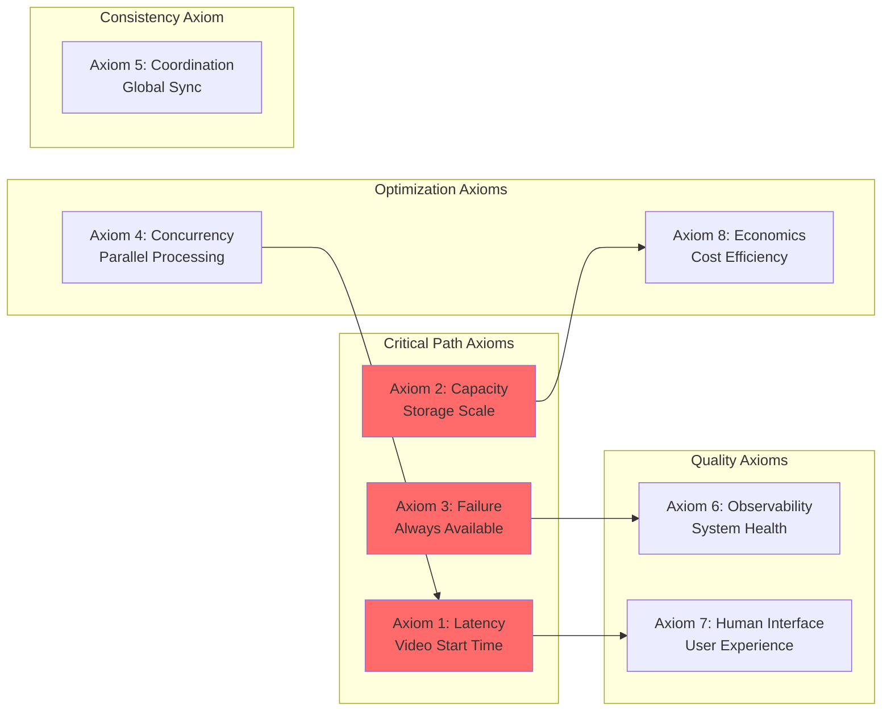

## Architecture Alternatives Analysis

### Alternative 1: Peer-to-Peer Video Network

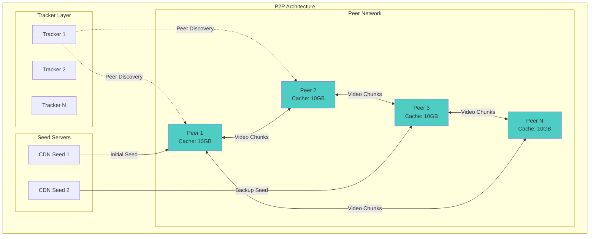

### Alternative 2: Edge-First Processing

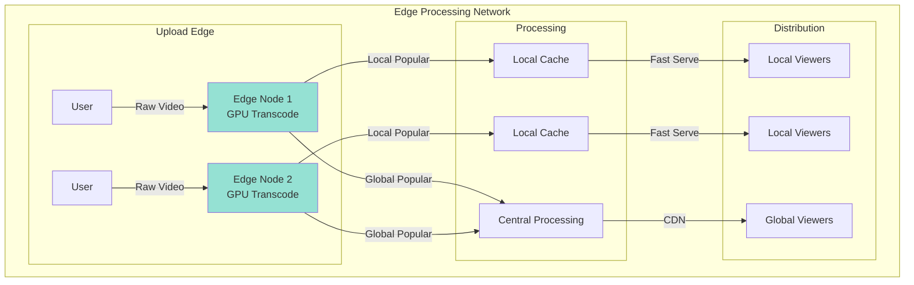

### Alternative 3: Blockchain-Based Decentralized Platform

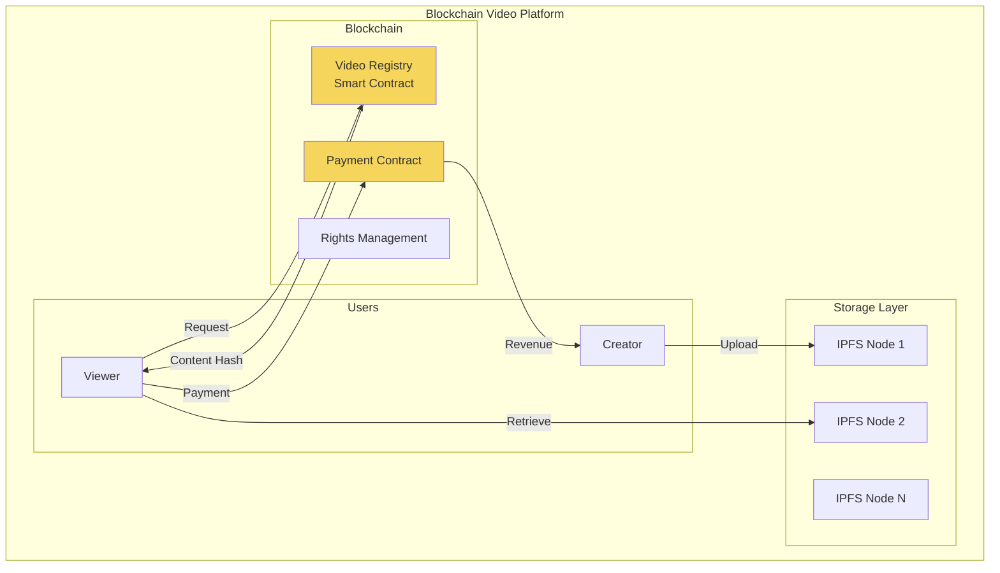

### Alternative 4: AI-Optimized Architecture

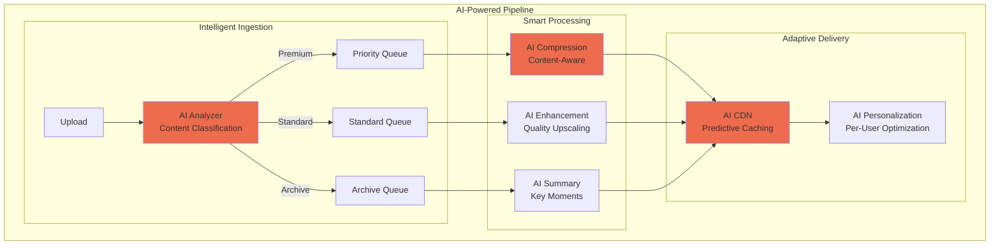

### Alternative 5: Quantum-Ready Future Architecture

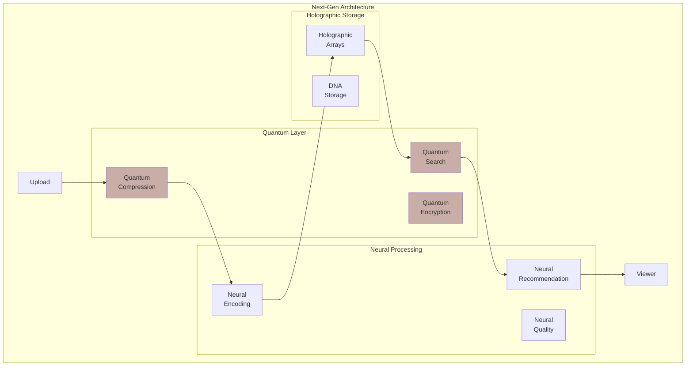

## Comparative Trade-off Analysis

### Architecture Comparison Matrix

| Architecture | Latency | Scalability | Cost | Reliability | Complexity | Innovation |
|-------------|---------|-------------|------|-------------|------------|------------|
| **Current (CDN + Tiered)** | ⭐⭐⭐⭐⭐<br/>50ms global | ⭐⭐⭐⭐⭐<br/>Proven at scale | ⭐⭐⭐<br/>High but optimized | ⭐⭐⭐⭐⭐<br/>99.95% uptime | ⭐⭐⭐<br/>Complex but manageable | ⭐⭐⭐<br/>Incremental improvements |
| **P2P Hybrid** | ⭐⭐⭐⭐<br/>Variable by peer | ⭐⭐⭐⭐<br/>Scales with users | ⭐⭐⭐⭐⭐<br/>60% cost reduction | ⭐⭐⭐<br/>Peer churn issues | ⭐⭐<br/>Complex coordination | ⭐⭐⭐⭐<br/>Disrupts CDN model |
| **Edge-First** | ⭐⭐⭐⭐⭐<br/>Ultra-low local | ⭐⭐⭐<br/>Limited by edges | ⭐⭐<br/>High edge costs | ⭐⭐⭐⭐<br/>Good isolation | ⭐⭐⭐⭐<br/>More complex ops | ⭐⭐⭐<br/>Better for 5G era |
| **Blockchain** | ⭐⭐<br/>High overhead | ⭐⭐<br/>Consensus limits | ⭐⭐⭐⭐<br/>Community funded | ⭐⭐⭐⭐⭐<br/>Decentralized | ⭐⭐<br/>Novel challenges | ⭐⭐⭐⭐⭐<br/>Paradigm shift |
| **AI-Optimized** | ⭐⭐⭐⭐<br/>Smart caching | ⭐⭐⭐⭐<br/>Auto-scaling | ⭐⭐⭐⭐<br/>Efficient encoding | ⭐⭐⭐⭐<br/>Self-healing | ⭐<br/>ML complexity | ⭐⭐⭐⭐⭐<br/>Future-ready |

### Decision Framework

```mermaid
graph TD
    Start[Architecture Decision] --> Q1{Scale Required?}
    
    Q1 -->|Global/Billions| Q2{Latency Critical?}
    Q1 -->|Regional/Millions| Edge[Edge-First]
    Q1 -->|Niche/Thousands| Block[Blockchain]
    
    Q2 -->|Yes <100ms| Q3{Cost Sensitive?}
    Q2 -->|No >1s OK| P2P[P2P Hybrid]
    
    Q3 -->|Yes| Q4{Innovation Focus?}
    Q3 -->|No| Current[Current CDN]
    
    Q4 -->|Yes| AI[AI-Optimized]
    Q4 -->|No| P2P
    
    style Current fill:#98d8c8
    style AI fill:#f7dc6f
    style P2P fill:#85c1e2
    style Edge fill:#f8c471
    style Block fill:#c39bd3
```

### Risk Assessment Matrix

| Risk Factor | Current | P2P | Edge | Blockchain | AI |
|------------|---------|-----|------|------------|-----|
| **Technical Risk** | 🟢 Low | 🟡 Medium | 🟡 Medium | 🔴 High | 🟡 Medium |
| **Operational Risk** | 🟢 Low | 🟡 Medium | 🔴 High | 🟡 Medium | 🟡 Medium |
| **Security Risk** | 🟢 Low | 🔴 High | 🟢 Low | 🟡 Medium | 🟡 Medium |
| **Regulatory Risk** | 🟢 Low | 🟡 Medium | 🟢 Low | 🔴 High | 🟡 Medium |
| **Scalability Risk** | 🟢 Low | 🟡 Medium | 🔴 High | 🔴 High | 🟢 Low |

## Key Design Insights

### 1. 🚀 **Latency Dominates User Experience**
- Video start time > video quality for user satisfaction
- Edge caching provides 80% improvement in start time
- Adaptive bitrate prevents 90% of rebuffering events

### 2. 💾 **Capacity Requires Intelligent Tiering**
- 90% of views come from 10% of content (hot tier)
- Cold storage reduces costs by 70% for long-tail content
- Predictive caching based on ML improves hit rates by 40%

### 3. 🔥 **Failure Recovery Must Be Transparent**
- Multi-CDN strategy ensures no single point of failure
- Chunked upload allows resumption from any point
- Degraded quality better than no service

### 4. 💰 **Economics Drive Architecture**
- Bandwidth costs dominate (40% of total)
- Storage tiering essential for unit economics
- P2P could reduce costs but adds complexity

### 5. 🤖 **AI/ML Becoming Core Infrastructure**
- Recommendation drives 70% of watch time
- AI compression can reduce storage by 30%
- Predictive caching reduces misses by 40%

## Conclusion

YouTube's architecture demonstrates how fundamental distributed systems principles scale to handle humanity's video consumption. By carefully managing latency through edge caching, handling exabyte-scale capacity with tiered storage, building resilience at every layer, and optimizing economics through adaptive quality, YouTube delivers billions of hours of video daily. The multi-tier architecture balances the needs of live streaming, popular content, and long-tail videos while continuously optimizing through machine learning. The key insight is that different types of content (live vs. recorded, popular vs. niche) require different architectural treatments, and success comes from intelligently routing content through the optimal pipeline.