<!-- Navigation -->
[Home](../introduction/index.md) → [Case Studies](index.md) → **YouTube's Video Platform Architecture**

# 🎬 YouTube's Video Platform Architecture

**The Challenge**: Store, process, and deliver billions of hours of video content globally with minimal buffering

!!! info "Case Study Sources"
    This analysis is based on:
    - Google Engineering Blog: "YouTube's Video Infrastructure"¹
    - SIGMOD Paper: "Vitess: Scaling MySQL for YouTube"²
    - Netflix Tech Blog: "Per-Title Encode Optimization"³
    - Facebook Engineering: "Video@Scale"⁴
    - YouTube Engineering: "Sharding YouTube's Database"⁵

## Introduction

YouTube: 1B+ hours watched daily, 500 hours uploaded per minute, 2B+ monthly users. Core challenges: exabyte storage, concurrent transcoding, minimal buffering, billion-video recommendations. Architecture shaped by physics, mathematics, and distributed systems principles.

## Part 1: Concept Map - The Physics of Video at Scale

### Axiom 2: Asynchronous Reality ⏳ - The Buffering Boundary

Video streaming requires maintaining continuous data flow to prevent buffering, making latency management critical.


**Key Latency Metrics:**
- Time to First Byte (TTFB): < 200ms
- Start-up Time: < 2 seconds
- Rebuffer Rate: < 0.5%
- Seek Latency: < 1 second

**Latency Optimization Strategies:**

| Strategy | Impact | Trade-off |
|----------|--------|-----------|
| Edge Caching | -80% latency | Storage cost |
| Adaptive Bitrate | -60% rebuffering | Quality variation |
| Predictive Buffering | -40% startup time | Bandwidth waste |
| HTTP/3 QUIC | -25% packet loss impact | CPU overhead |

### Axiom 4: Trade-offs ⚖️ - The Exabyte Challenge

YouTube's capacity requirements grow exponentially with both users and video quality improvements.


**Capacity Planning Model:**

| Metric | Value | Growth Rate |
|--------|-------|-------------|
| Daily Uploads | 720,000 hours | +20% YoY |
| Storage per Hour | 5 GB (multi-quality) | Increasing with 4K/8K |
| Total Storage | 10+ Exabytes | Doubling every 2 years |
| Bandwidth | 10+ Tbps peak | +35% YoY |
| Transcoding Compute | 1M+ cores | +25% YoY |

**Storage Optimization:**
1. **Deduplication**: 15-20% savings via content fingerprinting
2. **Compression**: H.265/AV1 provides 30-50% better compression
3. **Tiered Storage**: 80% cost reduction using cold storage
4. **Regional Replication**: Store popular content closer to users

### Axiom 1: Failure ⛓️ - Resilience at Every Layer

With millions of servers, failures are constant and must be handled transparently.


**Failure Scenarios and Mitigation:**

| Failure Type | Frequency | Mitigation Strategy |
|--------------|-----------|-------------------|
| Server Failure | 100/day | Automatic job migration |
| Datacenter Outage | 1/year | Multi-region failover |
| Network Partition | 10/day | Eventual consistency |
| Corrupted Upload | 1000/day | Checksum validation |
| CDN Node Failure | 50/day | Dynamic rerouting |

### Axiom 3: Emergence 🌪️ - Parallel Everything

Handling millions of concurrent uploads, transcodes, and streams requires massive parallelization.


**Concurrency Patterns:**

| Component | Concurrency Model | Scale |
|-----------|------------------|-------|
| Upload | Chunked parallel upload | 10K concurrent |
| Transcode | Work queue + worker pools | 100K concurrent |
| Streaming | Multi-CDN parallel delivery | 10M concurrent |
| Comments | Sharded by video ID | 1M writes/sec |
| Analytics | Stream processing | 100M events/sec |

### Axiom 4: Trade-offs ⚖️ - Global Consistency

Coordinating video metadata, views, and user state across regions while maintaining consistency.


**Consistency Requirements:**

| Data Type | Consistency Model | Sync Latency |
|-----------|------------------|--------------|
| Video Metadata | Eventually Consistent | < 1 minute |
| View Count | Eventually Consistent | < 5 minutes |
| User Subscriptions | Strong Consistency | Immediate |
| Comments | Causal Consistency | < 10 seconds |
| Monetization | Strong Consistency | Immediate |

### Axiom 5: Epistemology 🧠 - Understanding the Platform

Monitoring billions of video streams requires sophisticated observability.


**Key Metrics Tracked:**

| Metric Category | Examples | Update Frequency |
|----------------|----------|------------------|
| Quality of Experience | Buffering ratio, Start time | Real-time |
| Infrastructure | CPU, Memory, Network | 10 second |
| Business | Watch time, Ad revenue | 5 minute |
| Content | Upload rate, Transcode queue | 1 minute |
| Security | Abuse detection, Copyright | Real-time |

### Axiom 6: Human-API 🤯 - Creator and Viewer Experience

Optimizing for both content creators and viewers with different needs and expectations.


**Experience Optimization:**

| User Type | Key Metrics | Optimization Focus |
|-----------|-------------|-------------------|
| Creators | Upload success rate, Processing time | Fast feedback, Rich analytics |
| Viewers | Start-up time, Video quality | Instant playback, Personalization |
| Mobile Users | Data usage, Battery life | Efficient codec, Offline support |
| Smart TV | 4K availability, UI responsiveness | High quality, Simple navigation |

### Axiom 7: Economics 💰 - Balancing Cost and Quality

YouTube must balance infrastructure costs with user experience and creator monetization.


**Cost Breakdown:**

| Component | Cost/Month | Percentage |
|-----------|------------|------------|
| Storage | $2M | 20% |
| Bandwidth | $4M | 40% |
| Compute | $2.5M | 25% |
| Operations | $1.5M | 15% |

**Optimization Strategies:**

1. **Adaptive Quality**: Save 40% bandwidth by adjusting to network conditions
2. **Predictive Caching**: Reduce origin requests by 60%
3. **Efficient Encoding**: AV1 codec saves 30% storage
4. **Tiered Storage**: 70% cost reduction for cold content

## Part 2: Architecture - Building Video at Scale

## 🏗️ Architecture Evolution

### Phase 1: Single Server Origin (2005-2006)

```text
Browser → Apache Server → Local Files → Flash Player
```

**Problems Encountered:**
- Single point of failure
- Limited bandwidth capacity
- No redundancy
- Flash dependency

**Patterns Violated**: 
- ❌ No [Load Balancing](../patterns/load-balancing.md)
- ❌ No [Caching Strategy](../patterns/caching-strategies.md)
- ❌ No [Fault Tolerance](../patterns/fault-tolerance.md)

### Phase 2: Basic CDN Integration (2006-2008)


**Key Design Decision: CDN for Static Content**
- **Trade-off**: Cost vs Performance (Pillar: [Work Distribution](../part2-pillars/work/index.md))
- **Choice**: Pay for CDN to achieve global scale
- **Result**: 70% reduction in origin bandwidth
- **Pattern Applied**: [Edge Computing](../patterns/edge-computing.md)

According to Google's reports¹, this reduced average latency from 800ms to 200ms globally.

### Phase 3: Sharded Architecture (2008-2012)


**Vitess Innovation:** Transparent sharding, connection pooling, query routing, zero-downtime resharding

**Applied Patterns:** Database sharding, bulkhead isolation, state/work distribution

### Phase 4: Modern Microservices Architecture (2012-Present)


**Key Innovations**:
1. **Adaptive Bitrate Streaming (ABR)**⁴
   - Multiple quality levels per video
   - Client-side quality selection
   - Network-aware adaptation

2. **ML-Optimized Encoding**³
   - Per-scene encoding parameters
   - 20% bandwidth savings
   - Quality-aware compression

3. **Edge Computing**
   - 15K+ edge locations
   - P2P-assisted delivery
   - Regional content caches

## 📊 Scale Metrics & Performance

### Current Scale (2024)

| Metric | Value | Context |
|--------|-------|---------|  
| **Monthly Active Users** | 2.7B | 35% of global population |
| **Hours Watched Daily** | 1B+ | 41M+ hours per hour |
| **Videos Uploaded/Min** | 500 hours | 30K hours per hour |
| **Storage Total** | 10+ EB | Exabyte scale |
| **Bandwidth Peak** | 15+ Tbps | Netflix + Amazon combined |
| **Transcoding Cores** | 1M+ | Largest compute cluster |
| **Edge Locations** | 15K+ | Global presence |
| **Languages Supported** | 100+ | Auto-captioning |

### Performance Targets


## 🔧 Core Components Deep Dive

### 1. Video Upload Pipeline

```python
class ResumableUploadService:
    """Handle massive video uploads with resumability"""
    
    def __init__(self):
        self.chunk_size = 10 * 1024 * 1024  # 10MB chunks
        self.parallel_chunks = 4
        self.retry_attempts = 3
        
    async def upload_video(self, video_path: str, metadata: dict) -> str:
        """Upload video with automatic chunking and retry"""
        # 1. Initialize resumable session
        session_id = await self._init_session(metadata)
        
        # 2. Split into chunks
        chunks = self._split_video(video_path)
        
        # 3. Upload chunks in parallel
        upload_tasks = []
        for i in range(0, len(chunks), self.parallel_chunks):
            batch = chunks[i:i + self.parallel_chunks]
            tasks = [self._upload_chunk(session_id, chunk) for chunk in batch]
            results = await asyncio.gather(*tasks, return_exceptions=True)
            
            # Retry failed chunks
            for idx, result in enumerate(results):
                if isinstance(result, Exception):
                    await self._retry_chunk(session_id, batch[idx])
        
        # 4. Finalize upload
        video_id = await self._finalize_upload(session_id)
        
        # 5. Trigger processing pipeline
        await self._trigger_processing(video_id)
        
        return video_id
```

### 2. Storage Architecture  

```python
class TieredStorageManager:
    """Manage hot/warm/cold storage tiers"""
    
    def __init__(self):
        self.tiers = {
            'hot': {
                'type': 'SSD',
                'capacity_pb': 100,
                'retention_days': 7,
                'replication': 3,
                'cost_per_pb_month': 20000
            },
            'warm': {
                'type': 'HDD',
                'capacity_pb': 1000,
                'retention_days': 90,
                'replication': 2,
                'cost_per_pb_month': 5000
            },
            'cold': {
                'type': 'Tape',
                'capacity_pb': 10000,
                'retention_days': float('inf'),
                'replication': 2,
                'cost_per_pb_month': 1000
            }
        }
        
    async def store_video(self, video_id: str, files: dict):
        """Store video files across tiers based on predicted access"""
        # 1. Predict access pattern
        access_prediction = await self._predict_access_pattern(video_id)
        
        # 2. Initial placement
        if access_prediction['viral_probability'] > 0.7:
            # High viral probability - aggressive caching
            await self._store_in_tier('hot', files, replication=5)
            await self._pre_warm_cdn(video_id, files)
        else:
            # Normal video - standard placement
            await self._store_in_tier('hot', files)
        
        # 3. Schedule tier migrations
        await self._schedule_migration(video_id, 'hot', 'warm', days=7)
        await self._schedule_migration(video_id, 'warm', 'cold', days=90)
```

### 3. CDN & Edge Architecture


### Current Architecture: The Distributed Video Pipeline


### Alternative Architecture 1: Peer-to-Peer Hybrid

**Design**: Leverage viewer devices for content distribution.


**Trade-offs:**

| Aspect | Benefit | Challenge |
|--------|---------|-----------|
| Bandwidth Cost | -60% CDN costs | Complex coordination |
| Scalability | Improves with popularity | Poor for long-tail |
| Reliability | Multiple sources | Peer churn |
| Security | Harder to attack | Content verification needed |

### Alternative Architecture 2: Edge Computing

**Design**: Process videos at edge locations near users.


**Trade-offs:**

| Aspect | Benefit | Challenge |
|--------|---------|-----------|
| Latency | Ultra-low for local content | Requires many edge sites |
| Efficiency | Reduced backbone traffic | Duplicate processing |
| Cost | Lower bandwidth costs | Higher compute costs |
| Management | Simpler scaling | Complex orchestration |

### Alternative Architecture 3: Blockchain-Based

**Design**: Decentralized video platform using blockchain.


**Trade-offs:**

| Aspect | Benefit | Challenge |
|--------|---------|-----------|
| Censorship | Resistant | Illegal content issues |
| Creator Control | Direct monetization | No platform features |
| Costs | No intermediary | High blockchain fees |
| Performance | Distributed | Much slower |

### Alternative Architecture 4: AI-First Architecture

**Design**: Use AI for everything from compression to content generation.


**Trade-offs:**

| Aspect | Benefit | Challenge |
|--------|---------|-----------|
| Efficiency | 70% better compression | High compute cost |
| Quality | AI upscaling | May alter content |
| Personalization | Per-user optimization | Privacy concerns |
| Innovation | Cutting edge | Unproven at scale |

### Recommended Architecture: Multi-Tier Adaptive System


### 4. Recommendation System

```python
class VideoRecommendationEngine:
    """ML-powered video recommendations"""
    
    def __init__(self):
        self.models = {
            'collaborative': CollaborativeFilteringModel(),
            'content': ContentBasedModel(),
            'deep': DeepLearningModel(),
            'realtime': RealtimePersonalizationModel()
        }
        self.ensemble_weights = {
            'collaborative': 0.3,
            'content': 0.2,
            'deep': 0.4,
            'realtime': 0.1
        }
        
    async def get_recommendations(self, user_id: str, context: dict) -> List[str]:
        """Generate personalized video recommendations"""
        # 1. Gather user signals
        user_history = await self._get_watch_history(user_id)
        user_interests = await self._get_user_interests(user_id)
        
        # 2. Get candidates from each model
        candidates = {}
        for name, model in self.models.items():
            candidates[name] = await model.predict(
                user_id, 
                user_history, 
                user_interests, 
                context
            )
        
        # 3. Ensemble ranking
        final_scores = self._ensemble_rank(candidates)
        
        # 4. Apply business rules
        filtered = await self._apply_filters(final_scores, user_id)
        
        # 5. Diversify results
        diversified = self._diversify_results(filtered)
        
        return [video['id'] for video in diversified[:20]]
```

### 5. Video Delivery Optimization

```python
class AdaptiveBitrateStreaming:
    """Client-side ABR algorithm"""
    
    def __init__(self):
        self.buffer_target = 30  # seconds
        self.buffer_min = 10
        self.quality_levels = [144, 240, 360, 480, 720, 1080, 1440, 2160]
        self.bandwidth_history = []
        
    def select_quality(self, current_bandwidth: float, 
                      buffer_level: float, 
                      current_quality: int) -> int:
        """Select optimal quality based on conditions"""
        # 1. Estimate sustainable bandwidth
        sustainable_bw = self._estimate_sustainable_bandwidth(
            current_bandwidth
        )
        
        # 2. Calculate quality for bandwidth
        target_quality = self._bandwidth_to_quality(sustainable_bw)
        
        # 3. Apply buffer-based rules
        if buffer_level < self.buffer_min:
            # Emergency - drop quality
            target_quality = min(target_quality, 360)
        elif buffer_level > self.buffer_target:
            # Plenty of buffer - can increase
            target_quality = min(
                target_quality + 1, 
                self.quality_levels[-1]
            )
            
        # 4. Smooth quality transitions
        if abs(target_quality - current_quality) > 2:
            # Avoid jarring jumps
            direction = 1 if target_quality > current_quality else -1
            target_quality = current_quality + (2 * direction)
            
        return target_quality
```

### Implementation Considerations

**1. Video Upload Pipeline:**
- Resumable uploads for reliability
- Client-side chunking (10MB chunks)
- Parallel chunk upload
- Immediate feedback to creator

**2. Transcoding Strategy:**
- Priority queues based on creator tier
- Adaptive quality ladder (240p to 8K)
- Hardware acceleration (GPU/ASIC)
- Progressive encoding (lower qualities first)

**3. CDN Strategy:**
- Multi-CDN for redundancy
- Anycast for optimal routing
- Predictive content placement
- Bandwidth allocation by popularity

**4. Recommendation System:**
- Collaborative filtering for discovery
- Deep learning for personalization
- Real-time feature updates
- A/B testing framework

## 🎯 Law Mapping & Design Decisions

### Comprehensive Design Decision Matrix

| Design Decision | Axiom 2<br/>⏳ Asynchronous Reality | Axiom 4<br/>⚖️ Trade-offs | Axiom 1<br/>⛓️ Failure | Axiom 3<br/>🌪️ Emergence | Axiom 4<br/>⚖️ Trade-offs | Axiom 5<br/>🧠 Epistemology | Axiom 6<br/>🤯 Human-API | Axiom 7<br/>💰 Economics |
|----------------|----------|----------|---------|-------------|--------------|---------------|-------|-----------|
| **Multi-tier CDN** | ✅ Edge servers reduce RTT to <50ms | ✅ Distributed storage across regions | ✅ Multiple CDN failover | ⚪ | ✅ Cache invalidation protocols | ✅ CDN hit rate metrics | ✅ Low buffering for users | ✅ Bandwidth cost optimization |
| **Adaptive Bitrate** | ✅ Instant quality adjustment | ✅ Multiple quality versions | ✅ Fallback to lower quality | ✅ Parallel encoding | ⚪ | ✅ Quality switch tracking | ✅ Smooth playback | ✅ Bandwidth efficiency |
| **Chunked Upload** | ✅ Resume capability | ✅ Parallel processing | ✅ Partial upload recovery | ✅ Concurrent chunks | ✅ Chunk ordering | ✅ Upload progress | ✅ Creator feedback | ⚪ |
| **Tiered Storage** | ✅ Hot content in SSD | ✅ Exabyte scale support | ✅ Redundancy per tier | ⚪ | ✅ Migration policies | ✅ Access pattern tracking | ⚪ | ✅ 70% cost reduction |
| **Precomputed Feeds** | ✅ <100ms feed load | ✅ Reduced compute | ✅ Stale feed fallback | ✅ Async generation | ✅ Feed consistency | ✅ Freshness metrics | ✅ Fast discovery | ✅ Compute optimization |
| **ML Recommendations** | ✅ Real-time inference | ✅ Model caching | ✅ Rule-based fallback | ✅ Parallel predictions | ✅ A/B test coordination | ✅ CTR tracking | ✅ Personalization | ✅ Engagement optimization |
| **Global Replication** | ✅ Regional serving | ✅ Storage distribution | ✅ Geo-redundancy | ⚪ | ✅ Cross-region sync | ✅ Replication lag | ✅ Local content | ✅ Regional efficiency |
| **Live Streaming** | ✅ Sub-second latency | ✅ Dynamic scaling | ✅ Stream redundancy | ✅ Concurrent viewers | ✅ Stream synchronization | ✅ Stream health | ✅ Real-time interaction | ✅ Peak cost management |

**Legend**: ✅ Primary impact | ⚪ Secondary/No impact

### Law Implementation Priority

```mermaid
graph LR
    subgraph "Critical Path Laws"
        A1[Law 2: Asynchronous Reality ⏳<br/>Video Start Time]
        A2[Law 4: Trade-offs ⚖️<br/>Storage Scale]
        A3[Law 1: Failure ⛓️<br/>Always Available]
    end
    
    subgraph "Optimization Laws"
        A4[Law 3: Emergence 🌪️<br/>Parallel Processing]
        A8[Law 7: Economics 💰<br/>Cost Efficiency]
    end
    
    subgraph "Quality Laws"
        A6[Law 5: Epistemology 🧠<br/>System Health]
        A7[Law 6: Human-API 🤯<br/>User Experience]
    end
    
    subgraph "Consistency Axiom"
        A5[Law 4: Trade-offs ⚖️<br/>Global Sync]
    end
    
    A1 --> A7
    A2 --> A8
    A3 --> A6
    A4 --> A1
    
    style A1 fill:#ff6b6b
    style A2 fill:#ff6b6b
    style A3 fill:#ff6b6b
```



## Architecture Alternatives Analysis

### Alternative 1: Peer-to-Peer Video Network

```mermaid
graph TB
    subgraph "P2P Architecture"
        subgraph "Tracker Layer"
            T1[Tracker 1]
            T2[Tracker 2]
            T3[Tracker N]
        end
        
        subgraph "Peer Network"
            P1[Peer 1<br/>Cache: 10GB]
            P2[Peer 2<br/>Cache: 10GB]
            P3[Peer 3<br/>Cache: 10GB]
            P4[Peer N<br/>Cache: 10GB]
        end
        
        subgraph "Seed Servers"
            S1[CDN Seed 1]
            S2[CDN Seed 2]
        end
        
        T1 -.->|Peer Discovery| P1
        T1 -.->|Peer Discovery| P2
        
        P1 <-->|Video Chunks| P2
        P2 <-->|Video Chunks| P3
        P3 <-->|Video Chunks| P4
        P1 <-->|Video Chunks| P4
        
        S1 -->|Initial Seed| P1
        S2 -->|Backup Seed| P3
    end
    
    style P1 fill:#4ecdc4
    style P2 fill:#4ecdc4
    style P3 fill:#4ecdc4
    style P4 fill:#4ecdc4
```

### Alternative 2: Edge-First Processing

```mermaid
graph TB
    subgraph "Edge Processing Network"
        subgraph "Upload Edge"
            U1[User] -->|Raw Video| E1[Edge Node 1<br/>GPU Transcode]
            U2[User] -->|Raw Video| E2[Edge Node 2<br/>GPU Transcode]
        end
        
        subgraph "Processing"
            E1 -->|Local Popular| L1[Local Cache]
            E2 -->|Local Popular| L2[Local Cache]
            
            E1 -->|Global Popular| C[Central Processing]
            E2 -->|Global Popular| C
        end
        
        subgraph "Distribution"
            L1 -->|Fast Serve| V1[Local Viewers]
            L2 -->|Fast Serve| V2[Local Viewers]
            C -->|CDN| V3[Global Viewers]
        end
    end
    
    style E1 fill:#95e1d3
    style E2 fill:#95e1d3
```

### Alternative 3: Blockchain-Based Decentralized Platform

```mermaid
graph TB
    subgraph "Blockchain Video Platform"
        subgraph "Storage Layer"
            I1[IPFS Node 1]
            I2[IPFS Node 2]
            I3[IPFS Node N]
        end
        
        subgraph "Blockchain"
            B1[Video Registry<br/>Smart Contract]
            B2[Payment Contract]
            B3[Rights Management]
        end
        
        subgraph "Users"
            C[Creator] -->|Upload| I1
            V[Viewer] -->|Request| B1
            B1 -->|Content Hash| V
            V -->|Retrieve| I2
            V -->|Payment| B2
            B2 -->|Revenue| C
        end
    end
    
    style B1 fill:#f6d55c
    style B2 fill:#f6d55c
```

### Alternative 4: AI-Optimized Architecture

```mermaid
graph TB
    subgraph "AI-Powered Pipeline"
        subgraph "Intelligent Ingestion"
            U[Upload] --> AI1[AI Analyzer<br/>Content Classification]
            AI1 -->|Premium| P[Priority Queue]
            AI1 -->|Standard| S[Standard Queue]
            AI1 -->|Archive| A[Archive Queue]
        end
        
        subgraph "Smart Processing"
            P --> AI2[AI Compression<br/>Content-Aware]
            S --> AI3[AI Enhancement<br/>Quality Upscaling]
            A --> AI4[AI Summary<br/>Key Moments]
        end
        
        subgraph "Adaptive Delivery"
            AI2 & AI3 & AI4 --> AI5[AI CDN<br/>Predictive Caching]
            AI5 --> AI6[AI Personalization<br/>Per-User Optimization]
        end
    end
    
    style AI1 fill:#ee6c4d
    style AI2 fill:#ee6c4d
    style AI5 fill:#ee6c4d
```

### Alternative 5: Quantum-Ready Future Architecture

```mermaid
graph TB
    subgraph "Next-Gen Architecture"
        subgraph "Quantum Layer"
            Q1[Quantum<br/>Compression]
            Q2[Quantum<br/>Encryption]
            Q3[Quantum<br/>Search]
        end
        
        subgraph "Neural Processing"
            N1[Neural<br/>Encoding]
            N2[Neural<br/>Quality]
            N3[Neural<br/>Recommendation]
        end
        
        subgraph "Holographic Storage"
            H1[Holographic<br/>Arrays]
            H2[DNA<br/>Storage]
        end
        
        U[Upload] --> Q1 --> N1 --> H1
        H1 --> Q3 --> N3 --> V[Viewer]
    end
    
    style Q1 fill:#c9ada7
    style Q2 fill:#c9ada7
    style Q3 fill:#c9ada7
```

## Comparative Trade-off Analysis

### Architecture Comparison Matrix

| Architecture | Latency | Scalability | Cost | Reliability | Complexity | Innovation |
|-------------|---------|-------------|------|-------------|------------|------------|
| **Current (CDN + Tiered)** | ⭐⭐⭐⭐⭐<br/>50ms global | ⭐⭐⭐⭐⭐<br/>Proven at scale | ⭐⭐⭐<br/>High but optimized | ⭐⭐⭐⭐⭐<br/>99.95% uptime | ⭐⭐⭐<br/>Complex but manageable | ⭐⭐⭐<br/>Incremental improvements |
| **P2P Hybrid** | ⭐⭐⭐⭐<br/>Variable by peer | ⭐⭐⭐⭐<br/>Scales with users | ⭐⭐⭐⭐⭐<br/>60% cost reduction | ⭐⭐⭐<br/>Peer churn issues | ⭐⭐<br/>Complex coordination | ⭐⭐⭐⭐<br/>Disrupts CDN model |
| **Edge-First** | ⭐⭐⭐⭐⭐<br/>Ultra-low local | ⭐⭐⭐<br/>Limited by edges | ⭐⭐<br/>High edge costs | ⭐⭐⭐⭐<br/>Good isolation | ⭐⭐⭐⭐<br/>More complex ops | ⭐⭐⭐<br/>Better for 5G era |
| **Blockchain** | ⭐⭐<br/>High overhead | ⭐⭐<br/>Consensus limits | ⭐⭐⭐⭐<br/>Community funded | ⭐⭐⭐⭐⭐<br/>Decentralized | ⭐⭐<br/>Novel challenges | ⭐⭐⭐⭐⭐<br/>Paradigm shift |
| **AI-Optimized** | ⭐⭐⭐⭐<br/>Smart caching | ⭐⭐⭐⭐<br/>Auto-scaling | ⭐⭐⭐⭐<br/>Efficient encoding | ⭐⭐⭐⭐<br/>Self-healing | ⭐<br/>ML complexity | ⭐⭐⭐⭐⭐<br/>Future-ready |

### Decision Framework

```mermaid
graph TD
    Start[Architecture Decision] --> Q1{Scale Required?}
    
    Q1 -->|Global/Billions| Q2{Latency Critical?}
    Q1 -->|Regional/Millions| Edge[Edge-First]
    Q1 -->|Niche/Thousands| Block[Blockchain]
    
    Q2 -->|Yes <100ms| Q3{Cost Sensitive?}
    Q2 -->|No >1s OK| P2P[P2P Hybrid]
    
    Q3 -->|Yes| Q4{Innovation Focus?}
    Q3 -->|No| Current[Current CDN]
    
    Q4 -->|Yes| AI[AI-Optimized]
    Q4 -->|No| P2P
    
    style Current fill:#98d8c8
    style AI fill:#f7dc6f
    style P2P fill:#85c1e2
    style Edge fill:#f8c471
    style Block fill:#c39bd3
```

### Risk Assessment Matrix

| Risk Factor | Current | P2P | Edge | Blockchain | AI |
|------------|---------|-----|------|------------|-----|
| **Technical Risk** | 🟢 Low | 🟡 Medium | 🟡 Medium | 🔴 High | 🟡 Medium |
| **Operational Risk** | 🟢 Low | 🟡 Medium | 🔴 High | 🟡 Medium | 🟡 Medium |
| **Security Risk** | 🟢 Low | 🔴 High | 🟢 Low | 🟡 Medium | 🟡 Medium |
| **Regulatory Risk** | 🟢 Low | 🟡 Medium | 🟢 Low | 🔴 High | 🟡 Medium |
| **Scalability Risk** | 🟢 Low | 🟡 Medium | 🔴 High | 🔴 High | 🟢 Low |

## 📊 Production Metrics & Monitoring

### Key Performance Indicators

```python
class VideoQualityMetrics:
    """Track video delivery quality"""
    
    def __init__(self):
        self.metrics = {
            'startup_time': Histogram('video_startup_seconds'),
            'rebuffer_ratio': Gauge('video_rebuffer_ratio'),
            'bitrate_achieved': Histogram('video_bitrate_bps'),
            'quality_switches': Counter('video_quality_switches'),
            'playback_failures': Counter('video_playback_failures'),
            'cdn_hit_rate': Gauge('cdn_cache_hit_ratio')
        }
        
    async def track_session(self, session_id: str, events: List[dict]):
        """Analyze session quality metrics"""
        metrics = {
            'startup_time': self._calculate_startup_time(events),
            'rebuffer_time': self._calculate_rebuffer_time(events),
            'average_bitrate': self._calculate_avg_bitrate(events),
            'quality_switches': self._count_quality_switches(events)
        }
        
        # Update Prometheus metrics
        self.metrics['startup_time'].observe(metrics['startup_time'])
        self.metrics['rebuffer_ratio'].set(
            metrics['rebuffer_time'] / session['duration']
        )
        
        # Alert on poor quality
        if metrics['rebuffer_time'] > session['duration'] * 0.02:
            await self._alert_quality_degradation(session_id, metrics)
```

### Real-time Monitoring Dashboard

```mermaid
graph TB
    subgraph "Monitoring Stack"
        subgraph "Data Collection"
            A1[App Metrics]
            A2[CDN Logs]
            A3[Player Analytics]
        end
        
        subgraph "Processing"
            K[Kafka]
            F[Flink]
            S[Spark]
        end
        
        subgraph "Storage"
            P[Prometheus]
            E[Elasticsearch]
            B[BigQuery]
        end
        
        subgraph "Visualization"
            G[Grafana<br/>Real-time]
            K2[Kibana<br/>Logs]
            D[DataStudio<br/>Business]
        end
        
        A1 & A2 & A3 --> K
        K --> F & S
        F --> P --> G
        S --> E --> K2
        S --> B --> D
    end
```

## 🚨 Failure Scenarios

| Failure Type | Impact | Recovery | Time |
|--------------|---------|----------|------|
| **CDN Outage** | Regional degradation | Auto-failover to backup | <30s |
| **Transcoding Farm** | Upload delays | Spin up spot instances | <5min |
| **Database Shard** | Metadata unavailable | Promote replica | <60s |
| **Regional Outage** | Complete failure | DNS redirect + backups | <2min |

## 💡 Key Design Insights

### 1. 🚀 **Latency is User Experience**
- Pre-position content at edge (15K+ locations)
- Adaptive bitrate prevents rebuffering
- Predictive caching for popular content

### 2. 💾 **Tiered Storage is Essential**
- Hot/warm/cold tiers save 80% on storage
- Deduplication saves additional 20%
- Tape storage for long-tail content

### 3. 🔥 **Design for Partial Failures**
- Multi-CDN strategy
- Graceful quality degradation
- Regional isolation

### 4. 🤖 **ML Drives Everything**
- Recommendations increase watch time 70%
- Encoding optimization saves 30% bandwidth
- Predictive caching improves hit rates

### 5. 💰 **Economics at Scale**
- Bandwidth is 70% of costs
- Edge caching critical for unit economics
- P2P can reduce costs by 30%

## 🔍 Related Concepts & Deep Dives

### 📚 Relevant Laws (Part I)
- **[Law 2: Asynchronous Reality ⏳](../part1-axioms/axiom2-asynchrony/index.md)** - Video start time (<100ms) drives multi-tier CDN architecture and edge caching strategy
- **[Law 4: Trade-offs ⚖️](../part1-axioms/axiom4-tradeoffs/index.md)** - Exabyte-scale storage requires intelligent tiering (hot/warm/cold) to manage costs
- **[Law 1: Failure ⛓️](../part1-axioms/axiom1-failure/index.md)** - Multi-CDN strategy and chunked uploads ensure resilience against infrastructure failures
- **[Law 3: Emergence 🌪️](../part1-axioms/axiom3-emergence/index.md)** - Millions of concurrent uploads/views require distributed processing pipelines
- **[Law 4: Trade-offs ⚖️](../part1-axioms/axiom4-tradeoffs/index.md)** - Global CDN cache invalidation and content synchronization challenges
- **[Law 5: Epistemology 🧠](../part1-axioms/axiom5-epistemology/index.md)** - Real-time monitoring of video quality, buffering, and viewer engagement
- **[Law 6: Human-API 🤯](../part1-axioms/axiom6-human-api/index.md)** - Adaptive UI for different devices and network conditions
- **[Law 7: Economics 💰](../part1-axioms/axiom7-economics/index.md)** - Bandwidth costs (40% of total) drive compression and quality optimization

### 🏛️ Related Patterns (Part III)
- **[Edge Computing](../patterns/edge-computing.md)** - Regional transcoding and caching reduce latency and bandwidth costs
- **[CDN Strategy](../patterns/geo-replication.md)** - Multi-CDN architecture with intelligent routing
- **[Load Balancing](../patterns/load-balancing.md)** - Anycast routing and geo-aware traffic distribution
- **[Caching Strategies](../patterns/caching-strategies.md)** - Multi-tier caching from edge to origin
- **[Event-Driven Architecture](../patterns/event-driven.md)** - Video processing pipeline triggered by upload events
- **[Auto-Scaling](../patterns/auto-scaling.md)** - Dynamic compute allocation for transcoding workloads
- **[Graceful Degradation](../patterns/graceful-degradation.md)** - Adaptive bitrate ensures playback under poor conditions

### 📊 Quantitative Models
- **[Power Laws](../quantitative/power-laws.md)** - 90% of views from 10% of content drives hot/cold storage tiers
- **[Little's Law](../quantitative/littles-law.md)** - CDN capacity planning: concurrent streams = arrival rate × duration
- **[Queueing Theory](../quantitative/queueing-models.md)** - Transcoding queue optimization for different video priorities
- **[Information Theory](../quantitative/information-theory.md)** - Video compression algorithms and bandwidth optimization

### 👥 Human Factors Considerations
- **[SRE Practices](../human-factors/sre-practices.md)** - Managing global video infrastructure at scale
- **[Capacity Planning](../quantitative/capacity-planning.md)** - Predicting and provisioning for viral videos
- **[Incident Response](../human-factors/incident-response.md)** - Handling regional CDN failures and live stream issues
- **[Observability Tools](../human-factors/observability-stacks.md)** - Video quality metrics and viewer experience monitoring

### 🔄 Similar Case Studies
- **[Spotify Recommendations](spotify-recommendations.md)** - Similar ML-driven content discovery challenges
- **[News Feed System](news-feed.md)** - Personalized content distribution at scale
- **[Uber's Location System](uber-location.md)** - Real-time data processing for live streaming
- **[Amazon DynamoDB](amazon-dynamo.md)** - Metadata storage for billions of videos requires similar scale

---

## References

1. Google Engineering Blog: "YouTube's Video Infrastructure" (2020)
2. SIGMOD Paper: "Vitess: Scaling MySQL at YouTube" (2019)
3. Netflix Tech Blog: "Per-Title Encode Optimization" (2021)
4. Facebook Engineering: "Video@Scale Conference Talks" (2022)
5. YouTube Engineering: "Sharding YouTube's Database" (2018)

## Conclusion

YouTube's architecture demonstrates how fundamental distributed systems principles scale to handle humanity's video consumption. By carefully managing latency through edge caching, handling exabyte-scale capacity with tiered storage, building resilience at every layer, and optimizing economics through adaptive quality, YouTube delivers billions of hours of video daily. The multi-tier architecture balances the needs of live streaming, popular content, and long-tail videos while continuously optimizing through machine learning. The key insight is that different types of content (live vs. recorded, popular vs. niche) require different architectural treatments, and success comes from intelligently routing content through the optimal pipeline.