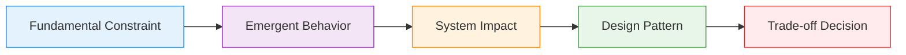
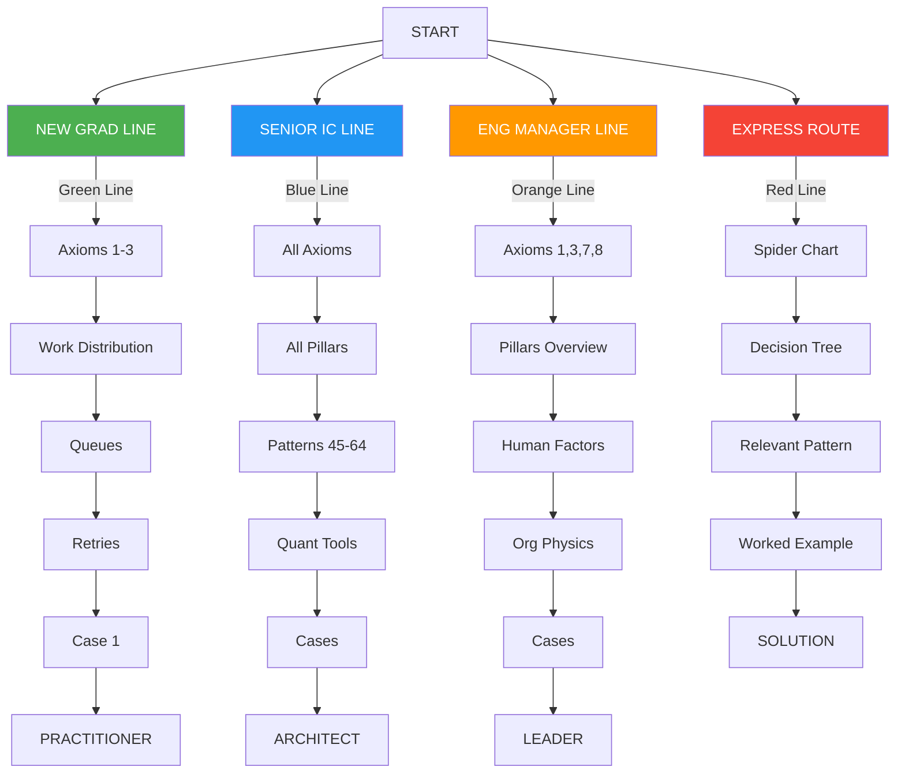

# Front Matter: Philosophy & Learning Paths

!!! abstract "Core Philosophy"
    **All distributed systems behavior emerges from physical and mathematical constraints**. Rather than teaching patterns as recipes, we derive them from immutable laws.

## Core First-Principles Philosophy

The entire book is built on fundamental constraints:

1. **Physical Laws**: Speed of light, thermodynamics, information theory
2. **Mathematical Laws**: Queueing theory, probability, graph theory
3. **Economic Laws**: Cost gradients, opportunity costs, resource allocation
4. **Human Laws**: Cognitive limits, communication bandwidth, organizational dynamics

## First-Principles Learning Framework

---

## Pages i-ii: COVER, COPYRIGHT & CREDITS

=== "Visual Design Philosophy"

    - **Cover art**: A visual metaphor of light beams hitting a prism, splitting into the spectrum of distributed systems patterns
    - Each color represents an axiom, showing how white light (monolithic systems) splits into the distributed spectrum
    - QR code links to interactive simulator where readers can adjust axiom parameters and see pattern emergence

=== "Copyright Innovation"

    - CC-BY-NC license with "Derivative Works Encouraged" clause
    - Special provision for corporate training use with attribution
    - Living document commitment: purchasers get 3 years of updates

=== "Credits Structure"

    - Technical reviewers grouped by expertise (Theory, Practice, Pedagogy)
    - Beta reader testimonials with role/experience level
    - Special thanks to failure story contributors (anonymized)
## Page iii: PREFACE – Why Another Systems Book?

!!! quote "400-Word Manifesto"
    Existing distributed systems literature falls into two camps: academic proofs divorced from practice, or engineering cookbooks lacking theoretical foundation. DDIA gives you the 'what' and 'how'; SRE books provide the 'when things break.' This book uniquely provides the 'why from first principles.'

    We don't start with Kafka or Kubernetes. We start with the speed of light and the laws of thermodynamics. Every pattern emerges from inescapable constraints. When you understand why coordination has fundamental costs, you'll never again wonder whether to use 2PC or saga patterns—the physics will tell you.

    Three breakthroughs make this approach finally practical:
    
    1. **Axiom Unification**: Eight fundamental constraints explain all distributed behavior
    2. **Pattern Derivation**: Every architecture pattern emerges from axiom combinations
    3. **Decision Calculus**: Quantitative trade-off framework replacing intuition with math

    This isn't another 500-page tome to read once. It's a 100-page compass you'll reference throughout your career. Each page earns its place through information density and immediate applicability.

??? info "Scope Boundaries"
    **IN SCOPE:**
    
    - Distributed systems from 2-node to planet-scale
    - Both synchronous and asynchronous architectures
    
    **OUT OF SCOPE:**
    
    - Single-node optimization (refer to Hennessy & Patterson)
    - Specific vendor products (patterns over products)
    - Full protocol specifications (we extract principles)
## Page iv: READER ROAD-MAP

🎯<strong>Decision Point:</strong> Major architectural choice

⚠️<strong>Common Pitfall:</strong> Where systems typically fail

💡<strong>Insight Box:</strong> Counter-intuitive truth

🔧<strong>Try This:</strong> Hands-on exercise (<5 min)

📊<strong>Measure This:</strong> Instrumentation point

🎬<strong>Real Story:</strong> Anonymized failure vignette

🧮<strong>Calculate:</strong> Numerical example

🔗<strong>Cross-Link:</strong> Related concept elsewhere

!!! success "Learning Commitment"
    Each page promises ONE core insight you'll use within 30 days

---

## Ready to Begin?

Now that you understand the philosophy and have chosen your learning path, it's time to dive into the axioms that govern all distributed systems.

    <a href="../axioms-1-5/" class="md-button md-button--primary">Start with Axioms 1-5 →</a>

