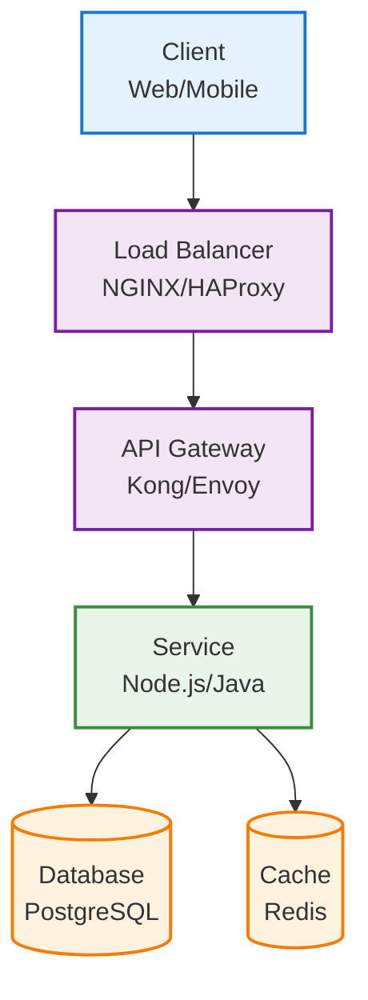
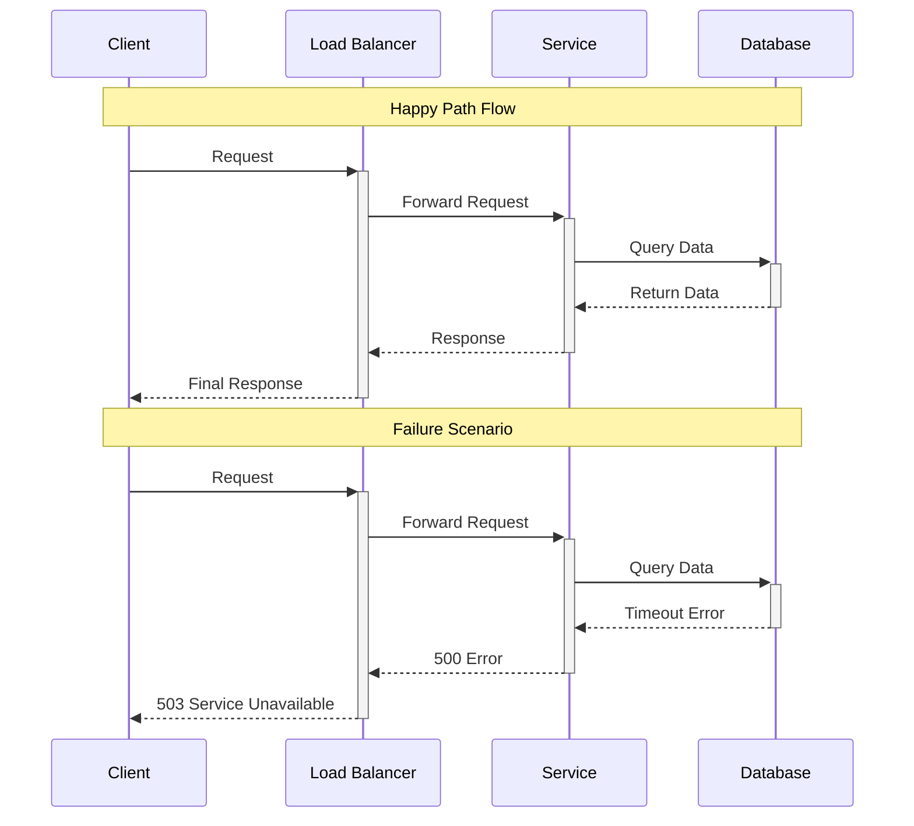

# Documentation Style Guide

This style guide ensures consistency, clarity, and professionalism across all DStudio distributed systems documentation.

## 📝 Writing Tone Guidelines

### Core Principles
- **Concise**: Every word serves a purpose
- **Factual**: Claims backed by evidence and data
- **Evidence-based**: Real-world examples and industry practices
- **Accessible**: Technical content explained clearly
- **Actionable**: Practical guidance over theoretical discussions

### Voice and Tone

| Context | Tone | Example |
|---------|------|---------|
| **Technical Explanations** | Authoritative, clear | "Circuit Breaker prevents cascade failures by monitoring error rates" |
| **Tutorial Steps** | Helpful, direct | "Configure the retry interval to 100ms for optimal performance" |
| **Architecture Decisions** | Analytical, balanced | "Consider the trade-offs: consistency vs availability" |
| **Performance Warnings** | Urgent but professional | "This configuration can cause memory leaks in high-traffic scenarios" |

### Language Standards
- **Active voice**: "The load balancer distributes requests" (not "Requests are distributed")
- **Present tense**: "The system handles failures" (not "The system will handle failures")
- **Specific numbers**: "Reduces latency by 40%" (not "significantly reduces latency")
- **Avoid jargon**: Define technical terms on first use

## 🏗️ Documentation Structure Templates

### Pattern Document Template

```yaml
---
title: "[Pattern Name] - [One-line description]"
description: "Detailed description for SEO and navigation"
category: "[architecture|coordination|data-management|etc]"
tier: "[gold|silver|bronze]"
complexity: "[low|medium|high|expert]"
tags: [relevant, keywords, here]
---

# [Pattern Name]

## 🎯 Problem Context
[2-3 sentences: What problem does this solve?]

## 💡 Solution Overview  
[1-2 paragraphs: High-level approach]

## 🏗️ Architecture
[Mermaid diagram showing core components]

## ⚖️ Trade-offs
### Pros
- Specific benefit with metric/example
- Another concrete advantage

### Cons  
- Specific limitation with context
- Performance or complexity cost

## 🛠️ Implementation Guide
### Prerequisites
- Required patterns or infrastructure
- Team skills and tools needed

### Step-by-Step Implementation
1. **Phase 1**: [Concrete action with expected outcome]
2. **Phase 2**: [Next step with validation criteria]

## 📊 Real Examples
### Company X Implementation
- Scale: [users, requests/sec, data volume]
- Results: [specific metrics achieved]

## 🔗 Related Patterns
- **Complements**: Patterns that work well together
- **Alternatives**: Other solutions to consider

## ⚠️ Common Pitfalls
- Specific mistake and how to avoid it
```

### Case Study Template

```yaml
---
title: "[Company] - [System Name] Case Study"
description: "Real-world implementation analysis"
category: "case-study"
company: "[company-name]"
scale: "[users/requests/data metrics]"
patterns: [list, of, patterns, used]
---

# [Company] [System Name] Architecture

## 📈 Scale & Context
- **Users**: [specific numbers]
- **Traffic**: [requests/second, data volume]
- **Geography**: [global/regional scope]

## 🎯 Key Challenges
1. **Challenge 1**: [specific technical problem]
2. **Challenge 2**: [business or scale issue]

## 🏗️ Architecture Solution
[High-level architecture diagram]

## 🔧 Pattern Implementation
### Pattern 1: [Name]
- **Purpose**: [why used]
- **Implementation**: [how configured]
- **Results**: [specific outcomes]

## 📊 Performance Results
- **Latency**: [before/after metrics]
- **Throughput**: [capacity improvements]
- **Reliability**: [uptime/error rate improvements]

## 💡 Lessons Learned
- Key insight with supporting data
- Mistake avoided or corrected
```

## 💻 Code Example Formatting Standards

### Code Block Guidelines

```python
# ✅ Good: Clear, commented, realistic
class CircuitBreaker:
    def __init__(self, failure_threshold=5, timeout=60):
        """
        Initialize circuit breaker with production-ready defaults.
        
        Args:
            failure_threshold: Failed calls before opening circuit
            timeout: Seconds before attempting to close circuit
        """
        self.failure_threshold = failure_threshold
        self.timeout = timeout
        self.failure_count = 0
        self.last_failure_time = None
        
    def call(self, func, *args, **kwargs):
        """Execute function with circuit breaker protection."""
        if self._should_open_circuit():
            raise CircuitBreakerOpenError("Circuit breaker is OPEN")
            
        try:
            result = func(*args, **kwargs)
            self._record_success()
            return result
        except Exception as e:
            self._record_failure()
            raise
```

```python
# ❌ Avoid: Uncommented, unrealistic
def cb(f, t=5):
    if bad: raise Error
    return f()
```

### Configuration Examples

```yaml
# ✅ Production-ready configuration with comments
load_balancer:
  algorithm: weighted_round_robin  # Better than simple round_robin for mixed instance sizes
  health_check:
    interval: 30s                  # Balance between responsiveness and overhead
    timeout: 10s                   # Must be less than interval
    unhealthy_threshold: 3         # Avoid flapping from single failures
  
circuit_breaker:
    failure_threshold: 10          # Based on 1% error rate at 1000 req/min
    timeout: 60s                   # Allow system to recover
    half_open_max_calls: 3         # Conservative testing
```

## 📚 Citation and Sourcing Requirements

### Industry Sources
```markdown
According to Netflix's 2023 engineering blog, their circuit breaker implementation 
reduces cascade failures by 95% during partial outages¹.

¹ Netflix Engineering Blog, "Circuit Breakers at Scale", March 2023
```

### Academic Papers
```markdown
The CAP theorem, formally proven by Gilbert and Lynch (2002), demonstrates 
the fundamental trade-offs in distributed systems².

² Gilbert, S. and Lynch, N. (2002). "Brewer's conjecture and the feasibility 
of consistent, available, partition-tolerant web services." ACM SIGACT News, 33(2).
```

### Code and Architecture References
```markdown
This implementation follows the patterns established in Netflix Hystrix³ 
and adopted by Envoy Proxy⁴.

³ Netflix Hystrix: https://github.com/Netflix/Hystrix
⁴ Envoy Circuit Breaker: https://www.envoyproxy.io/docs/envoy/latest/configuration/http/http_filters/circuit_breaker_filter
```

## 🧮 Mathematical Notation Conventions

### Performance Metrics
```markdown
**Latency Reduction**:
- P95 latency: 250ms → 45ms (82% improvement)
- P99 latency: 1.2s → 180ms (85% improvement)

**Throughput Calculation**:
Throughput = Requests/Second × Success_Rate
- Before: 1000 req/s × 0.95 = 950 successful req/s
- After: 1000 req/s × 0.99 = 990 successful req/s
```

### Capacity Planning
```markdown
**Little's Law Application**:
L = λ × W

Where:
- L = Average number of requests in system
- λ = Request arrival rate (1000 req/s)  
- W = Average response time (100ms)

Therefore: L = 1000 × 0.1 = 100 concurrent requests
```

### Availability Calculations
```markdown
**System Availability**:
Availability = MTBF / (MTBF + MTTR)

Example:
- MTBF: 720 hours (30 days)
- MTTR: 0.5 hours (30 minutes)
- Availability = 720 / (720 + 0.5) = 99.93%
```

## 📊 Diagram and Visualization Standards

### Mermaid Diagram Conventions



### Color Coding Standards

| Component Type | Color | Usage |
|----------------|-------|-------|
| **Client/User** | Light Blue (#e3f2fd) | Web browsers, mobile apps |
| **Infrastructure** | Light Purple (#f3e5f5) | Load balancers, proxies, gateways |
| **Services** | Light Green (#e8f5e8) | Application services, microservices |
| **Storage** | Light Orange (#fff3e0) | Databases, caches, file systems |
| **Network** | Light Gray (#f5f5f5) | Network connections, queues |
| **External** | Light Red (#ffebee) | Third-party services, external APIs |

### Sequence Diagram Guidelines



## 🔄 Version Control Best Practices

### Commit Message Standards

```bash
# ✅ Good commit messages
feat(circuit-breaker): add Netflix Hystrix implementation example
fix(load-balancer): correct health check timeout configuration  
docs(scaling): add Uber's sharding strategy case study
perf(caching): optimize Redis connection pooling example

# ❌ Avoid generic messages
git commit -m "updates"
git commit -m "fix bug"  
git commit -m "add stuff"
```

### Branch Naming Conventions

```bash
# Feature branches
feature/api-gateway-tutorial
feature/kafka-streaming-patterns
feature/kubernetes-patterns

# Documentation updates  
docs/style-guide-improvements
docs/pattern-library-reorganization

# Bug fixes
fix/broken-diagrams
fix/incorrect-metrics
```

### Pull Request Templates

```markdown
## Changes Made
- [ ] Added new pattern: [Pattern Name]
- [ ] Updated architecture diagrams
- [ ] Added performance benchmarks
- [ ] Included real-world examples

## Documentation Checklist
- [ ] Follows style guide conventions
- [ ] Includes proper citations
- [ ] Diagrams use standard colors
- [ ] Code examples are production-ready
- [ ] Performance claims include metrics

## Validation
- [ ] Technical accuracy verified
- [ ] Links tested and working
- [ ] Diagrams render correctly
- [ ] Code examples tested
```

## ✅ Content Quality Checklist

### Technical Accuracy
- [ ] Claims backed by credible sources
- [ ] Performance numbers from real systems
- [ ] Code examples syntactically correct
- [ ] Architecture diagrams technically sound

### Clarity and Accessibility  
- [ ] Technical concepts explained clearly
- [ ] Jargon defined on first use
- [ ] Examples relevant and realistic
- [ ] Logical information flow

### Professional Standards
- [ ] Consistent tone and voice
- [ ] Proper grammar and spelling
- [ ] Formatted according to templates
- [ ] Appropriate depth for audience

### Completeness
- [ ] All sections populated
- [ ] Related patterns referenced
- [ ] Trade-offs honestly discussed
- [ ] Implementation guidance actionable

---

*This style guide is a living document. Contribute improvements through pull requests following these same standards.*