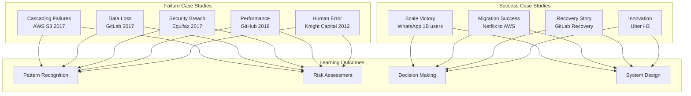
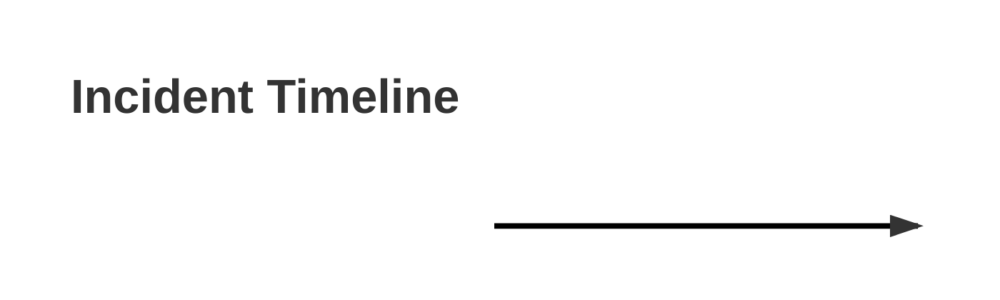
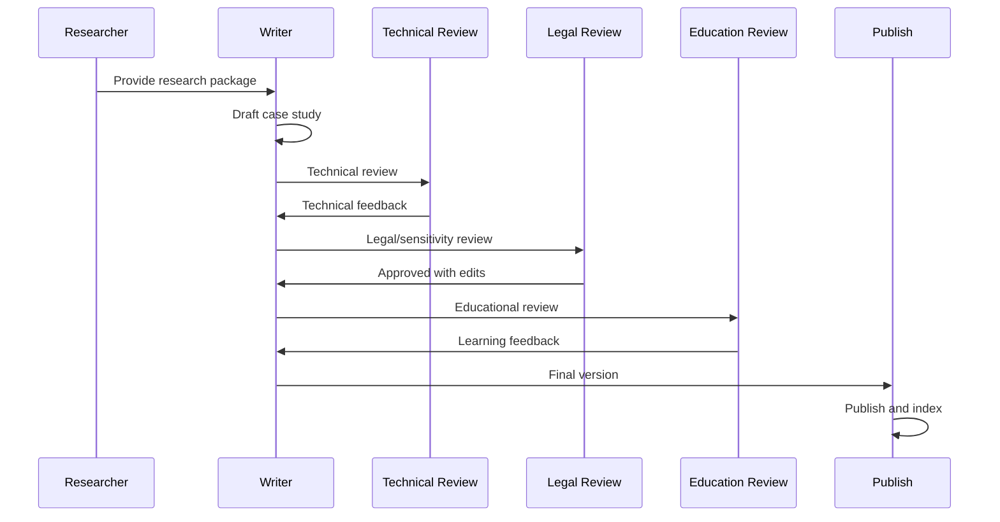

# Case Study Development Guide

## Introduction: Why Case Studies Matter

Case studies bridge the gap between theory and reality. They show how patterns fail in production, how laws manifest in real systems, and how human factors determine outcomes. This guide provides a framework for transforming incidents into powerful learning experiences.

---

## Part 1: Case Study Selection Framework

### 1.1 Selection Criteria

```yaml
case_study_criteria:
  impact:
    financial: >$1M loss or gain
    users: >100K affected
    duration: >1 hour outage
    
  learning_value:
    patterns_demonstrated: 3+ patterns
    clear_root_cause: Yes
    documented_well: Public post-mortem available
    reproducible: Can simulate in lab
    
  relevance:
    recency: <5 years old
    industry: Applicable across domains
    technology: Common stack/patterns
    
  diversity:
    failure_types:
      - Cascading failures
      - Data corruption
      - Security breaches
      - Performance degradation
      - Human errors
    
    success_types:
      - Scale achievements
      - Migration victories
      - Recovery stories
      - Innovation breakthroughs
```

### 1.2 Case Study Categories



---

## Part 2: Research and Analysis Process

### 2.1 Information Gathering

```markdown
# Case Study Research Template

## Primary Sources
- [ ] Official post-mortem report
- [ ] Company engineering blog posts
- [ ] Conference talks by involved engineers
- [ ] Twitter threads from incident
- [ ] Status page updates

## Secondary Sources
- [ ] News coverage
- [ ] Industry analysis
- [ ] Community discussions (HN, Reddit)
- [ ] Follow-up articles
- [ ] Podcast interviews

## Technical Details
- [ ] System architecture diagrams
- [ ] Metrics/graphs from incident
- [ ] Code snippets if available
- [ ] Configuration examples
- [ ] Timeline of events

## Human Factors
- [ ] Team structure
- [ ] Communication patterns
- [ ] Decision-making process
- [ ] Organizational culture
- [ ] External pressures
```

### 2.2 Analysis Framework

```python
class CaseStudyAnalyzer:
    """
    Framework for analyzing incidents systematically
    """
    
    def __init__(self, incident_data):
        self.incident = incident_data
        self.timeline = []
        self.root_causes = []
        self.contributing_factors = []
        self.patterns_violated = []
        
    def analyze_timeline(self):
        """
        Break down incident into phases
        """
        phases = {
            'normal_operation': self.extract_baseline(),
            'initial_trigger': self.identify_trigger(),
            'escalation': self.trace_escalation(),
            'detection': self.analyze_detection(),
            'response': self.evaluate_response(),
            'recovery': self.assess_recovery(),
            'aftermath': self.document_aftermath()
        }
        return phases
    
    def identify_patterns(self):
        """
        Map incident to known patterns and anti-patterns
        """
        patterns = {
            'patterns_present': [],
            'patterns_missing': [],
            'anti_patterns': []
        }
        
        # Check for circuit breaker
        if not self.had_circuit_breaker():
            patterns['patterns_missing'].append('circuit_breaker')
            
        # Check for retry storms
        if self.had_retry_storm():
            patterns['anti_patterns'].append('retry_storm')
            
        return patterns
    
    def calculate_impact(self):
        """
        Quantify incident impact
        """
        return {
            'financial_loss': self.calculate_revenue_impact(),
            'users_affected': self.count_affected_users(),
            'duration_minutes': self.calculate_duration(),
            'engineer_hours': self.calculate_human_cost(),
            'reputation_impact': self.assess_reputation_damage()
        }
    
    def extract_lessons(self):
        """
        Identify key learnings
        """
        return {
            'technical_lessons': self.technical_learnings(),
            'process_lessons': self.process_improvements(),
            'cultural_lessons': self.cultural_changes(),
            'preventable': self.was_preventable(),
            'prevention_cost': self.prevention_investment()
        }
```

---

## Part 3: Case Study Module Structure

### 3.1 Standard Template

```markdown
---
title: "Case Study: [Company] [Incident] - [Key Lesson]"
description: "[One paragraph summary]"
type: case-study
category: [failure|success]
company: [Company Name]
incident_date: YYYY-MM-DD
difficulty: intermediate
estimated_time: 150 min
impact:
  financial_loss: $XXM
  users_affected: XXM
  duration: XX hours
  recovery_time: XX hours
patterns_demonstrated:
  - [pattern1]
  - [pattern2]
laws_violated:
  - [law1]
  - [law2]
key_lessons:
  - [lesson1]
  - [lesson2]
tags: [relevant, tags]
---

# Case Study: [Company] [Incident]

!!! danger "Impact Summary"
    - **Financial Loss:** $[amount]
    - **Users Affected:** [number]
    - **Total Downtime:** [duration]
    - **Recovery Time:** [time]
    - **Root Cause:** [brief description]

## Executive Summary

[2-3 paragraphs providing complete overview]

## Learning Objectives

By studying this case, you will:
1. Recognize early warning signs of [failure type]
2. Understand how [pattern] failures cascade
3. Learn specific prevention strategies
4. Practice incident response decision-making
5. Design resilient architectures against similar failures

---

## Part 1: The Perfect Storm (30 min)

### The Company Context

[Background on company, scale, architecture]

### The System Architecture

```mermaid
graph TB
    %% Pre-incident architecture
```

### Early Warning Signs (Missed)

[What signals were ignored or misinterpreted]

### The Stage Is Set

[Conditions that made the incident possible]

---

## Part 2: The Incident Unfolds (40 min)

### T-0: The Trigger

[What started the incident]

### T+[X] Minutes: First Signs of Trouble

[Initial symptoms and responses]

### T+[X] Minutes: The Cascade Begins

[How the failure spread]

### T+[X] Minutes: Full System Impact

[Peak of the crisis]

### Timeline Visualization



---

## Part 3: The Response (30 min)

### Detection and Alerting

[How the team discovered the problem]

### War Room Dynamics

[Team coordination and communication]

### Attempted Mitigations

[What they tried and why it failed/succeeded]

### The Fix That Worked

[Ultimate solution]

---

## Part 4: Root Cause Analysis (30 min)

### Primary Root Cause

[The main technical cause]

### Contributing Factors

[Secondary causes that amplified the issue]

### Human Factors

[Decisions and processes that enabled the failure]

### The Swiss Cheese Model

```mermaid
graph LR
    %% How multiple failures aligned
```

---

## Part 5: Lessons Learned (20 min)

### Technical Lessons

1. [Specific technical improvement]
2. [Architecture change needed]
3. [Monitoring gap to fill]

### Process Lessons

1. [Incident response improvement]
2. [Communication enhancement]
3. [Decision-making change]

### Cultural Lessons

1. [Organizational change needed]
2. [Team structure adjustment]
3. [Priority shifts required]

---

## Your Application Exercise (30 min)

### Analyze Your System

Using this incident as a template:

1. **Identify Similar Risks**
   - Does your system have similar dependencies?
   - Could this cascade pattern happen to you?
   - What are your early warning systems?

2. **Design Prevention**
   - Which patterns would prevent this?
   - What monitoring would detect it?
   - How would you respond differently?

3. **Calculate Impact**
   - What would this cost your company?
   - How many users would be affected?
   - What's your recovery time?

---

## Key Takeaways

1. **[Primary lesson]** - [Explanation]
2. **[Secondary lesson]** - [Explanation]
3. **[Tertiary lesson]** - [Explanation]

## Discussion Questions

1. Could this incident have been prevented? At what cost?
2. Was the response optimal given the information available?
3. What would you have done differently at T+30 minutes?
4. How would modern patterns have changed the outcome?

---

## References and Further Reading

- [Original post-mortem]
- [Follow-up analysis]
- [Related incidents]
- [Pattern deep-dives]
```

---

## Part 4: Specific Case Study Examples

### 4.1 Example: AWS S3 Outage 2017

```markdown
# Development Notes: AWS S3 2017 Outage

## Key Facts
- Date: February 28, 2017
- Duration: 4 hours
- Impact: $150M in losses
- Cause: Typo in command
- Affected: Millions of websites

## Patterns Demonstrated
- Cascading failure
- Lack of bulkheads
- Missing circuit breakers
- Insufficient input validation

## Learning Focus
- How small errors cascade
- Importance of bulkheads
- Command validation
- Dependency awareness

## Module Structure
1. The S3 Architecture (pre-incident)
2. The Typo That Broke the Internet
3. The Cascade Effect
4. Why Recovery Took 4 Hours
5. AWS's Response and Changes
6. Industry-Wide Lessons

## Key Visualizations Needed
- S3 subsystem dependencies
- Cascade progression timeline
- Recovery sequence
- Before/after architecture

## Hands-On Exercise
- Design bulkheads for S3-like system
- Implement command validation
- Create dependency map
- Calculate blast radius
```

### 4.2 Example: WhatsApp Scale Success

```markdown
# Development Notes: WhatsApp Scaling to 1B Users

## Key Facts
- Timeline: 2009-2014
- Scale: 55 engineers, 1B users
- Cost: $0.01 per user/year
- Stack: Erlang/FreeBSD
- Acquisition: $19B by Facebook

## Patterns Demonstrated
- Horizontal scaling
- Share-nothing architecture
- Minimalist approach
- Efficient resource usage

## Learning Focus
- Simplicity over complexity
- Erlang actor model
- Cost-efficient scaling
- Small team dynamics

## Module Structure
1. The Anti-Silicon Valley Approach
2. Technical Architecture Deep-Dive
3. The Erlang Advantage
4. Scaling Milestones
5. Operational Excellence
6. Lessons for Modern Systems

## Key Visualizations Needed
- User growth vs. engineer count
- Architecture evolution
- Cost per user over time
- Message flow diagram

## Hands-On Exercise
- Calculate unit economics
- Design actor-based system
- Optimize for cost/user
- Plan small-team scaling
```

---

## Part 5: Interactive Elements

### 5.1 Decision Point Simulations

```python
class IncidentSimulation:
    """
    Interactive incident response simulation
    """
    
    def __init__(self, case_study):
        self.case = case_study
        self.decisions = []
        self.current_time = 0
        self.system_state = 'normal'
        
    def present_decision_point(self, situation):
        """
        Present a decision point to the learner
        """
        print(f"\n⏰ T+{self.current_time} minutes")
        print(f"📊 System State: {self.system_state}")
        print(f"🔥 Situation: {situation['description']}")
        print("\n🤔 Your Options:")
        
        for i, option in enumerate(situation['options'], 1):
            print(f"{i}. {option['action']}")
            
        choice = self.get_user_choice(len(situation['options']))
        return self.evaluate_decision(choice, situation)
    
    def evaluate_decision(self, choice, situation):
        """
        Evaluate the decision and show consequences
        """
        chosen = situation['options'][choice - 1]
        
        print(f"\n✅ You chose: {chosen['action']}")
        print(f"📈 Result: {chosen['result']}")
        print(f"💡 Insight: {chosen['learning']}")
        
        # Update system state
        self.system_state = chosen['new_state']
        self.decisions.append({
            'time': self.current_time,
            'action': chosen['action'],
            'outcome': chosen['result']
        })
        
        return chosen['optimal']
    
    def run_simulation(self):
        """
        Run through the complete incident simulation
        """
        print("🎮 INCIDENT SIMULATION: You are the on-call engineer")
        print(f"📅 Case: {self.case['name']}")
        
        for decision_point in self.case['decision_points']:
            self.current_time = decision_point['time']
            optimal = self.present_decision_point(decision_point)
            
            if not optimal:
                print("⚠️  There was a better option. Let's see why...")
                
        self.show_summary()
    
    def show_summary(self):
        """
        Show simulation summary and compare to actual
        """
        print("\n📊 SIMULATION COMPLETE")
        print("\n Your Timeline:")
        for decision in self.decisions:
            print(f"  T+{decision['time']}: {decision['action']}")
            
        print("\n🏆 Actual Response:")
        for actual in self.case['actual_timeline']:
            print(f"  T+{actual['time']}: {actual['action']}")
            
        print("\n💡 Key Differences:")
        self.analyze_differences()

# Example Decision Point
example_case = {
    'name': 'AWS S3 2017 Outage',
    'decision_points': [
        {
            'time': 30,
            'description': 'Multiple services reporting S3 errors. Error rate at 5%.',
            'options': [
                {
                    'action': 'Restart affected S3 subsystems',
                    'result': 'Makes problem worse - more systems fail',
                    'learning': 'Restarting during cascade amplifies failure',
                    'new_state': 'critical',
                    'optimal': False
                },
                {
                    'action': 'Enable circuit breakers to stop cascade',
                    'result': 'Cascade halted, degraded but stable',
                    'learning': 'Circuit breakers prevent cascade spread',
                    'new_state': 'degraded-stable',
                    'optimal': True
                },
                {
                    'action': 'Increase capacity to handle load',
                    'result': 'No effect - problem is not capacity',
                    'learning': 'Diagnose before scaling',
                    'new_state': 'degraded',
                    'optimal': False
                }
            ]
        }
    ]
}
```

### 5.2 Pattern Recognition Exercises

```markdown
# Pattern Recognition Exercise

## The Symptoms
You observe the following in your monitoring:
1. Database connection pool exhaustion
2. API response times increasing linearly
3. Queue depth growing exponentially
4. Memory usage normal
5. CPU at 45%

## Your Task
1. **Identify the failure pattern**: ___________
2. **Predict what happens next**: ___________
3. **Recommend immediate action**: ___________
4. **Design long-term fix**: ___________

## Model Answer

### 1. Pattern Identification
**Pattern: Head-of-Line Blocking with Cascade Potential**

Evidence:
- Connection pool exhaustion → blocked requests
- Linear response time increase → requests queuing
- Exponential queue growth → arrival > processing
- Normal CPU/Memory → not a resource issue

### 2. Next Stage Prediction
Within 5-10 minutes:
- Connection pool fully exhausted
- Timeouts begin cascading
- Retry storms amplify load
- Complete service failure

### 3. Immediate Actions
1. **Circuit breaker activation** - Stop cascade
2. **Shed low-priority traffic** - Reduce load
3. **Increase connection pool** - Temporary relief
4. **Enable request deadlines** - Prevent eternal waits

### 4. Long-term Solutions
- Implement connection pool monitoring
- Add automatic circuit breakers
- Design request priority system
- Create bulkheads between services
- Add backpressure mechanisms
```

---

## Part 6: Assessment Framework

### 6.1 Case Study Exam Questions

```markdown
# Case Study Mastery Assessment

## Question Type 1: Timeline Analysis

### Question
Given the AWS S3 2017 outage timeline, identify three decision points where different actions could have reduced the outage duration. For each point:
1. State the actual action taken
2. Propose an alternative action
3. Quantify the improvement
4. Identify the pattern that would help

### Model Answer Structure
- Deep understanding of incident progression
- Knowledge of applicable patterns
- Quantitative impact assessment
- Trade-off analysis

## Question Type 2: Pattern Application

### Question
Your e-commerce platform has similar architecture to pre-incident S3. Design a prevention strategy using:
1. Bulkhead pattern
2. Circuit breaker pattern
3. Chaos engineering

Include:
- Specific implementation details
- Rollout strategy
- Success metrics
- Cost-benefit analysis

### Model Answer Structure
- Concrete pattern implementation
- Phased deployment plan
- Measurable success criteria
- ROI calculation

## Question Type 3: Incident Response

### Question
You're the incident commander during a cascade failure similar to Knight Capital 2012. Create your response plan for the first 30 minutes including:
1. Information gathering priorities
2. Communication strategy
3. Technical interventions
4. Decision trees

### Model Answer Structure
- Systematic approach
- Clear priorities
- Stakeholder management
- Technical accuracy
```

---

## Part 7: Production Checklist

### 7.1 Quality Assurance

```yaml
case_study_qa:
  accuracy:
    - [ ] Facts verified from multiple sources
    - [ ] Timeline cross-referenced
    - [ ] Technical details validated
    - [ ] Impact numbers confirmed
    
  completeness:
    - [ ] All phases of incident covered
    - [ ] Root causes clearly identified
    - [ ] Human factors addressed
    - [ ] Lessons actionable
    
  learning_design:
    - [ ] Clear learning objectives
    - [ ] Interactive elements included
    - [ ] Exercises relevant
    - [ ] Difficulty appropriate
    
  sensitivity:
    - [ ] No blame culture
    - [ ] Respectful of involved parties
    - [ ] Focus on systems not people
    - [ ] Constructive tone throughout
```

### 7.2 Review Process



---

## Part 8: Case Study Library Building

### 8.1 Categorization System

```yaml
case_library:
  by_failure_type:
    cascading_failures:
      - AWS S3 2017
      - Facebook 2021
      - Google 2020
    
    data_loss:
      - GitLab 2017
      - Microsoft Sidekick 2009
    
    security_breaches:
      - Equifax 2017
      - SolarWinds 2020
    
  by_pattern:
    circuit_breaker_absence:
      - AWS S3 2017
      - GitHub 2018
    
    retry_storms:
      - Google 2020
      - Cloudflare 2019
    
  by_industry:
    cloud_providers:
      - AWS S3 2017
      - Azure 2018
    
    social_media:
      - Facebook 2021
      - Twitter 2016
    
  by_learning_objective:
    cascade_prevention:
      - Multiple cases
    
    incident_response:
      - Multiple cases
```

### 8.2 Cross-Reference Matrix

```python
# Case study relationship mapper
case_relationships = {
    'AWS_S3_2017': {
        'patterns': ['circuit_breaker', 'bulkhead', 'cascade_prevention'],
        'laws': ['correlated_failure', 'emergent_chaos'],
        'similar_incidents': ['Facebook_2021', 'Google_2020'],
        'prevention_techniques': ['chaos_engineering', 'dependency_mapping'],
        'difficulty': 'intermediate',
        'duration': '150_minutes'
    },
    'Knight_Capital_2012': {
        'patterns': ['deployment_safety', 'rollback', 'feature_flags'],
        'laws': ['human_factors', 'emergent_chaos'],
        'similar_incidents': ['TSB_2018'],
        'prevention_techniques': ['blue_green_deployment', 'canary_releases'],
        'difficulty': 'advanced',
        'duration': '180_minutes'
    }
}
```

---

## Conclusion

Case studies transform abstract patterns into concrete learning experiences. They show the real cost of missing patterns, the complexity of production systems, and the critical importance of human factors.

Each case study should:
1. Tell a compelling story
2. Teach specific patterns
3. Provide actionable lessons
4. Enable safe practice
5. Build pattern recognition

The goal is not to create perfect engineers who never fail, but resilient engineers who fail safely, recover quickly, and learn continuously.

---

*"In distributed systems, every failure is a teaching moment, and every success is a case study waiting to be written."*