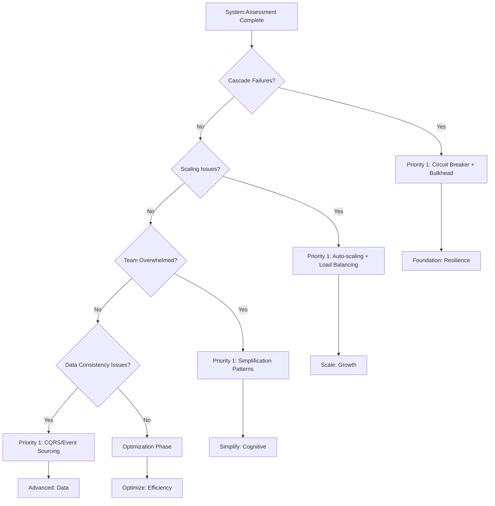

# Distributed Systems Implementation Guide

## From Theory to Production: A Practical Roadmap

This guide provides concrete steps for implementing the patterns and laws in production systems, with timelines, metrics, and decision criteria.

---

## Part I: Assessment Phase (Week 1-2)

### Current State Analysis

#### System Inventory Checklist
- [ ] Document all services and their dependencies
- [ ] Identify shared resources and potential correlation points
- [ ] Map current failure modes and their blast radius
- [ ] Calculate current correlation coefficients between services
- [ ] Measure baseline metrics (MTTR, MTBF, costs)

#### Law Assessment Matrix

| Law | Assessment Questions | Current Score (1-5) | Priority |
|-----|---------------------|-------------------|----------|
| **Law 1: Correlation** | Do failures cascade? What's the blast radius? | ___ | ___ |
| **Law 2: Async** | Are timing issues causing failures? | ___ | ___ |
| **Law 3: Cognitive** | Can team handle current complexity? | ___ | ___ |
| **Law 4: Chaos** | Do small issues become big problems? | ___ | ___ |
| **Law 5: Knowledge** | Is state/config management problematic? | ___ | ___ |
| **Law 6: Multi-Opt** | Are we optimizing the right dimensions? | ___ | ___ |
| **Law 7: Economic** | Is cost sustainable? ROI positive? | ___ | ___ |

#### Team Readiness Assessment

```yaml
team_capacity:
  current_services_owned: # Number
  on_call_rotation_size: # People
  average_incident_response_time: # Minutes
  documentation_completeness: # Percentage
  
technical_skills:
  distributed_systems_experience: # Years
  pattern_familiarity: # List known patterns
  monitoring_tools_expertise: # Tools used
  programming_languages: # Languages
  
organizational_readiness:
  executive_support: # Yes/No
  budget_available: # Amount
  time_allocation: # Hours/week
  training_budget: # Amount
```

---

## Part II: Pattern Selection Framework (Week 3)

### Decision Tree for Pattern Prioritization



### Pattern Implementation Priority Matrix

| Urgency ↓ Complexity → | Low Complexity | Medium Complexity | High Complexity |
|------------------------|----------------|-------------------|-----------------|
| **Critical** | Circuit Breaker<br/>Retry/Backoff | Bulkhead<br/>Load Balancing | Cell-Based<br/>Service Mesh |
| **High** | Rate Limiting<br/>Timeouts | Auto-scaling<br/>Consistent Hashing | CQRS<br/>Event Sourcing |
| **Medium** | Health Checks<br/>Graceful Degradation | API Gateway<br/>Database Sharding | Saga<br/>Multi-Region |
| **Low** | Caching<br/>CDN | Feature Flags<br/>Blue-Green | Event Sourcing<br/>Lambda Architecture |

---

## Part III: Implementation Phases

### Phase 1: Foundation (Months 1-2)

#### Week 1-2: Circuit Breaker Implementation

**Objectives:**
- Prevent cascade failures
- Reduce blast radius to <25%

**Implementation Steps:**
```python
# 1. Identify critical dependencies
dependencies = {
    'payment_service': {'timeout': 5000, 'threshold': 0.5},
    'user_service': {'timeout': 3000, 'threshold': 0.6},
    'inventory_service': {'timeout': 2000, 'threshold': 0.7}
}

# 2. Implement circuit breaker per dependency
for service, config in dependencies.items():
    implement_circuit_breaker(
        service=service,
        failure_threshold=config['threshold'],
        timeout_ms=config['timeout'],
        cooldown_period=30000
    )

# 3. Add fallback mechanisms
fallbacks = {
    'payment_service': queue_for_retry,
    'user_service': use_cache,
    'inventory_service': estimated_availability
}
```

**Success Metrics:**
- Cascade failures: 0
- Blast radius: <25%
- False positive rate: <5%

#### Week 3-4: Bulkhead Pattern

**Resource Isolation Strategy:**
```yaml
bulkhead_configuration:
  critical_services:
    thread_pool_size: 50
    queue_size: 100
    rejection_threshold: 0.8
  
  standard_services:
    thread_pool_size: 30
    queue_size: 50
    rejection_threshold: 0.9
  
  background_tasks:
    thread_pool_size: 10
    queue_size: 200
    rejection_threshold: 0.95
```

**Monitoring Setup:**
```prometheus
# Bulkhead utilization
bulkhead_thread_pool_active / bulkhead_thread_pool_size

# Rejection rate
rate(bulkhead_rejections_total[5m]) / rate(bulkhead_requests_total[5m])

# Queue depth
bulkhead_queue_size
```

### Phase 2: Scale (Months 3-4)

#### Auto-scaling Configuration

**Multi-dimensional Scaling Policy:**
```yaml
scaling_policy:
  metrics:
    - type: cpu
      target: 70
      weight: 0.3
    - type: memory
      target: 75
      weight: 0.2
    - type: request_rate
      target: 1000
      weight: 0.3
    - type: queue_depth
      target: 100
      weight: 0.2
  
  scale_up:
    threshold: 0.7  # Weighted score
    cooldown: 300   # 5 minutes
    increment: 2    # Add 2 instances
  
  scale_down:
    threshold: 0.3  # Weighted score
    cooldown: 600   # 10 minutes
    decrement: 1    # Remove 1 instance
  
  limits:
    min_instances: 3
    max_instances: 100
```

**Cost Optimization:**
```python
def calculate_optimal_instance_mix():
    """Optimize instance types for cost/performance"""
    
    base_load = calculate_p50_load()
    peak_load = calculate_p95_load()
    burst_load = calculate_p99_load()
    
    return {
        'reserved_instances': base_load * 0.8,  # 20% buffer
        'on_demand_instances': (peak_load - base_load),
        'spot_instances': (burst_load - peak_load),
        'estimated_savings': '40-60%'
    }
```

### Phase 3: Advanced Patterns (Months 5-6)

#### Service Mesh Rollout

**Gradual Rollout Strategy:**
```yaml
week_1-2:
  services: ['non-critical-service-1', 'non-critical-service-2']
  features: ['basic-routing', 'health-checks']
  
week_3-4:
  services: ['standard-services']  # 30% of services
  features: ['mTLS', 'basic-observability']
  
week_5-6:
  services: ['critical-services']  # Remaining services
  features: ['advanced-routing', 'full-observability', 'circuit-breaking']
  
week_7-8:
  optimization: true
  tuning: ['timeout-values', 'retry-policies', 'circuit-breaker-thresholds']
```

---

## Part IV: Monitoring & Measurement

### Key Metrics Dashboard

```yaml
reliability_metrics:
  - blast_radius_percentage
  - correlation_coefficient
  - mttr_minutes
  - mtbf_hours
  - error_budget_remaining
  
performance_metrics:
  - latency_p50_ms
  - latency_p95_ms
  - latency_p99_ms
  - throughput_rps
  - error_rate_percentage
  
economic_metrics:
  - cost_per_request
  - infrastructure_utilization
  - cost_per_gb_stored
  - operational_overhead_hours
  
cognitive_metrics:
  - alerts_per_day
  - unique_alerts_per_week
  - average_debug_time_minutes
  - documentation_coverage_percentage
```

### Alert Configuration

```yaml
critical_alerts:
  blast_radius_exceeded:
    threshold: 30%
    duration: 5m
    action: page_on_call
  
  correlation_high:
    threshold: 0.7
    duration: 10m
    action: page_on_call
  
  error_budget_burn_rate:
    threshold: 2x  # Burning 2x faster than allocated
    duration: 15m
    action: page_on_call

warning_alerts:
  scaling_limit_approaching:
    threshold: 80%
    duration: 10m
    action: slack_notification
  
  cognitive_load_high:
    threshold: 50_alerts_per_hour
    duration: 30m
    action: email_team
```

---

## Part V: Team Enablement

### Training Program

#### Week 1: Fundamentals
- **Day 1-2**: Seven Laws deep dive
- **Day 3-4**: Pattern overview and selection
- **Day 5**: Hands-on lab with circuit breakers

#### Week 2: Implementation
- **Day 1-2**: Setting up monitoring
- **Day 3-4**: Implementing first pattern
- **Day 5**: Testing and validation

#### Week 3: Operations
- **Day 1-2**: Runbook creation
- **Day 3-4**: Incident response training
- **Day 5**: Chaos engineering introduction

### Documentation Templates

```markdown
## Pattern: [Name]
### Implementation Date: [Date]
### Team Owner: [Team]
### Business Justification
- Problem solved:
- Expected benefits:
- Success metrics:

### Technical Details
- Configuration:
- Dependencies:
- Rollback procedure:

### Operational Runbook
- Monitoring dashboard: [Link]
- Alert response: [Procedures]
- Common issues: [Solutions]

### Lessons Learned
- What worked:
- What didn't:
- Future improvements:
```

---

## Part VI: Continuous Improvement

### Monthly Review Process

```python
def monthly_pattern_review():
    """Assess pattern effectiveness monthly"""
    
    metrics = {
        'reliability': calculate_reliability_improvement(),
        'performance': calculate_performance_gains(),
        'cost': calculate_cost_savings(),
        'cognitive': assess_team_cognitive_load()
    }
    
    for pattern in implemented_patterns:
        effectiveness = assess_pattern_effectiveness(pattern, metrics)
        
        if effectiveness < 0.7:
            actions = [
                'retune_configuration',
                'additional_training',
                'consider_removal'
            ]
            
        recommendations.append({
            'pattern': pattern,
            'effectiveness': effectiveness,
            'actions': actions
        })
    
    return recommendations
```

### Maturity Model Progression

```yaml
level_1_reactive:
  patterns: ['circuit-breaker', 'retry']
  metrics: basic
  automation: minimal
  time_to_achieve: 2_months

level_2_proactive:
  patterns: ['bulkhead', 'auto-scaling', 'load-balancing']
  metrics: comprehensive
  automation: partial
  time_to_achieve: 4_months

level_3_managed:
  patterns: ['service-mesh', 'cell-based', 'consistent-hashing']
  metrics: advanced
  automation: extensive
  time_to_achieve: 6_months

level_4_optimized:
  patterns: ['cqrs', 'event-sourcing', 'saga']
  metrics: predictive
  automation: full
  time_to_achieve: 12_months

level_5_innovative:
  patterns: custom_patterns
  metrics: ml_driven
  automation: self_healing
  time_to_achieve: 18_months
```

---

## Part VII: Risk Management

### Common Pitfalls and Mitigations

| Pitfall | Impact | Mitigation | Prevention |
|---------|---------|------------|------------|
| **Over-engineering** | Complexity explosion | Gradual rollback | Start simple, iterate |
| **Under-monitoring** | Blind to issues | Add observability | Monitor first, implement second |
| **Ignoring cognitive load** | Team burnout | Simplify or hire | Regular load assessment |
| **Cost spiral** | Budget overrun | Cost controls | Regular cost review |
| **Pattern mismatch** | Ineffective solution | Re-evaluate quarterly | Proper assessment phase |

### Rollback Procedures

```python
class PatternRollback:
    """Safe rollback procedures for each pattern"""
    
    def rollback_circuit_breaker(self):
        # 1. Increase timeout gradually
        # 2. Reduce failure threshold
        # 3. Monitor error rates
        # 4. Remove circuit breaker
        # 5. Verify system stability
        
    def rollback_service_mesh(self):
        # 1. Remove non-critical services first
        # 2. Revert to direct communication
        # 3. Maintain observability
        # 4. Remove sidecars gradually
        # 5. Decommission control plane
        
    def rollback_auto_scaling(self):
        # 1. Set to manual scaling
        # 2. Fix instance count at P75 load
        # 3. Monitor for 1 week
        # 4. Remove auto-scaling rules
        # 5. Document lessons learned
```

---

## Appendix: Quick Decision Guides

### Pattern Selection by Problem

**Problem:** "Everything fails when one service fails"
**Solution:** Circuit Breaker + Bulkhead
**Timeline:** 2-4 weeks
**Investment:** Low

**Problem:** "Can't handle traffic spikes"
**Solution:** Auto-scaling + Load Balancing
**Timeline:** 4-6 weeks
**Investment:** Medium

**Problem:** "No visibility into system behavior"
**Solution:** Service Mesh + Distributed Tracing
**Timeline:** 8-12 weeks
**Investment:** High

**Problem:** "Database is the bottleneck"
**Solution:** CQRS + Read Replicas + Caching
**Timeline:** 12-16 weeks
**Investment:** High

### Success Criteria Checklist

Before considering implementation complete:
- [ ] Blast radius reduced to target (<25%)
- [ ] Correlation coefficient below threshold (<0.3)
- [ ] Cost per transaction at or below target
- [ ] Team cognitive load sustainable
- [ ] All patterns monitored and alerted
- [ ] Runbooks complete and tested
- [ ] Rollback procedures documented
- [ ] Team trained and confident
- [ ] Metrics showing positive ROI
- [ ] Executive stakeholders satisfied

---

*This implementation guide provides a complete roadmap from assessment through optimization, ensuring successful adoption of distributed systems patterns while managing risk and complexity.*