# Comprehensive Learning Development Plan

## Executive Summary

This document provides a complete framework for developing learning modules and assessments for all patterns and case studies in the distributed systems knowledge base. Each module follows the Apex Learner's Protocol, incorporating neuroscience-based learning principles for maximum retention and practical application.

---

## Part 1: Overall Strategy and Framework

### 1.1 Learning Architecture Overview

```mermaid
graph TB
    subgraph "Learning Hierarchy"
        LAWS[7 Fundamental Laws<br/>✅ Completed]
        PILLARS[5 Architectural Pillars<br/>🔄 In Progress]
        PATTERNS[Design Patterns<br/>📋 Planned]
        CASES[Case Studies<br/>📋 Planned]
    end
    
    LAWS --> PILLARS
    PILLARS --> PATTERNS
    PATTERNS --> CASES
    
    subgraph "Learning Components Per Topic"
        MODULE[Learning Module<br/>120-180 min]
        EXAM[Mastery Exam<br/>90-180 min]
        LAB[Hands-on Lab<br/>60-120 min]
        PROJECT[Capstone Project<br/>2-4 weeks]
    end
    
    style LAWS fill:#90EE90
    style PILLARS fill:#FFE66D
    style PATTERNS fill:#87CEEB
    style CASES fill:#DDA0DD
```



### 1.2 Universal Module Structure

Every learning module must follow this structure:

```yaml
module_structure:
  metadata:
    - title: Clear, descriptive title
    - description: One-paragraph summary
    - difficulty: beginner/intermediate/advanced
    - estimated_time: 120-180 minutes
    - prerequisites: List of required knowledge
    - learning_outcomes: 5-7 specific outcomes
    
  content_sections:
    1_foundation:
      - complete_blueprint: Executive summary of entire topic
      - core_mental_model: Primary analogy/metaphor
      - journey_map: Visual learning path
      
    2_focus_blocks:
      - count: 5-8 blocks
      - duration: 20-30 minutes each
      - structure:
        - priming: Hook question or scenario
        - core_concept: Main teaching content
        - visual_model: Diagram or flowchart
        - neural_bridge: Connection to existing knowledge
        - active_practice: Hands-on exercise
        - consolidation_prompt: Reflection questions
        
    3_integration:
      - cross_pattern_connections: Links to other patterns
      - real_world_applications: Production examples
      - common_pitfalls: What to avoid
      - implementation_checklist: Step-by-step guide
      
    4_practice:
      - retrieval_gauntlets: 4 levels of difficulty
      - coding_exercises: 3-5 implementations
      - design_challenges: 2-3 system designs
      - debugging_scenarios: 2-3 troubleshooting exercises
```

### 1.3 Exam Structure Template

```yaml
exam_structure:
  metadata:
    - title: "Pattern/Case Study Mastery Assessment"
    - difficulty: hard/very_hard
    - time_limit: 90-180 minutes
    - format: open_book
    - calculator: optional/recommended
    
  sections:
    hard_questions:
      - count: 6-8 questions
      - time: 90 minutes
      - focus: Application and analysis
      - answer_format: Comprehensive with code
      
    very_hard_questions:
      - count: 3-5 questions
      - time: 180 minutes
      - focus: System design and optimization
      - answer_format: Complete solutions with trade-offs
      
  answer_requirements:
    - mathematical_analysis: Where applicable
    - code_implementation: Production-ready
    - performance_metrics: Quantified improvements
    - trade_off_analysis: Multiple approaches
    - deployment_strategy: Phased rollout plans
    - monitoring_plan: Metrics and alerts
```

---

## Part 2: Pattern Categories and Development Plan

### 2.1 Pattern Taxonomy


### 2.2 Priority 1: Core Patterns (Complete First)

#### Scaling Patterns
```yaml
scaling_patterns:
  1_load_balancing:
    module_focus:
      - Algorithms: Round-robin, least-connections, consistent-hash
      - Implementation: Layer 4 vs Layer 7
      - Health checks and failover
      - Session affinity
    exam_scenarios:
      - Design LB for 1M requests/sec
      - Debug uneven distribution
      - Implement custom algorithm
      
  2_auto_scaling:
    module_focus:
      - Metrics-based scaling
      - Predictive scaling
      - Cost optimization
      - Cooldown periods
    exam_scenarios:
      - Scale for Black Friday traffic
      - Optimize for cost vs performance
      - Handle sudden spike/drop
      
  3_caching_strategies:
    module_focus:
      - Cache-aside, write-through, write-behind
      - TTL and invalidation
      - Cache warming
      - Distributed caching
    exam_scenarios:
      - Design multi-tier cache
      - Calculate cache hit ratios
      - Handle cache stampede
      
  4_database_sharding:
    module_focus:
      - Sharding strategies
      - Shard key selection
      - Rebalancing
      - Cross-shard queries
    exam_scenarios:
      - Shard 1B user records
      - Handle hot shards
      - Implement resharding
      
  5_rate_limiting:
    module_focus:
      - Token bucket, leaky bucket
      - Distributed rate limiting
      - API quotas
      - DDoS protection
    exam_scenarios:
      - Implement global rate limiter
      - Handle burst traffic
      - Design tiered limits
```

#### Resilience Patterns
```yaml
resilience_patterns:
  1_circuit_breaker:
    module_focus:
      - States: closed, open, half-open
      - Failure thresholds
      - Recovery strategies
      - Fallback mechanisms
    exam_scenarios:
      - Prevent cascade failures
      - Tune breaker parameters
      - Implement with monitoring
      
  2_retry_backoff:
    module_focus:
      - Exponential backoff
      - Jitter strategies
      - Retry budgets
      - Idempotency
    exam_scenarios:
      - Design retry for payments
      - Prevent retry storms
      - Calculate optimal backoff
      
  3_bulkhead:
    module_focus:
      - Resource isolation
      - Thread pool management
      - Connection pooling
      - Failure containment
    exam_scenarios:
      - Isolate critical services
      - Size resource pools
      - Handle pool exhaustion
      
  4_timeout_handling:
    module_focus:
      - Timeout hierarchies
      - Deadline propagation
      - Graceful degradation
      - Timeout budgets
    exam_scenarios:
      - Design timeout strategy
      - Debug timeout cascades
      - Implement adaptive timeouts
```

### 2.3 Module Development Workflow


---

## Part 3: Detailed Module Creation Instructions

### 3.1 Step-by-Step Module Development

#### Step 1: Research Phase (2-3 days)

```markdown
# Research Checklist

## Academic Sources
- [ ] Read 3-5 foundational papers
- [ ] Review algorithm complexity analyses
- [ ] Study formal proofs where applicable
- [ ] Extract key mathematical models

## Industry Sources
- [ ] Analyze 5+ production implementations
- [ ] Review engineering blogs from FAANG companies
- [ ] Study open-source implementations
- [ ] Document performance benchmarks

## Failure Analysis
- [ ] Collect 3+ failure case studies
- [ ] Document anti-patterns
- [ ] Identify common mistakes
- [ ] Extract lessons learned

## Code Examples
- [ ] Find 3+ language implementations
- [ ] Test in local environment
- [ ] Benchmark performance
- [ ] Document edge cases
```

#### Step 2: Outline Creation (1 day)

```yaml
outline_template:
  module_title: "Pattern: [Name]"
  
  learning_outcomes:
    - Understand the core mechanics of [pattern]
    - Implement [pattern] in production code
    - Recognize when to apply [pattern]
    - Debug common issues with [pattern]
    - Optimize [pattern] for specific use cases
    
  focus_blocks:
    block_1:
      title: "The Problem [Pattern] Solves"
      duration: 25 min
      concepts:
        - Problem statement
        - Why naive solutions fail
        - Pattern introduction
        
    block_2:
      title: "Core Mechanics"
      duration: 30 min
      concepts:
        - How it works
        - Key algorithms
        - Implementation details
        
    block_3:
      title: "Production Implementation"
      duration: 25 min
      concepts:
        - Real code examples
        - Configuration options
        - Monitoring setup
        
    block_4:
      title: "Performance & Optimization"
      duration: 20 min
      concepts:
        - Benchmarks
        - Tuning parameters
        - Scaling considerations
        
    block_5:
      title: "Common Failures"
      duration: 20 min
      concepts:
        - Anti-patterns
        - Debugging techniques
        - Recovery strategies
```

#### Step 3: Content Development (3-5 days)

```markdown
# Content Development Template

## Focus Block Structure

### PRIMING (2-3 sentences)
Create cognitive hook that connects to learner's experience.
Example: "Remember the last time your service crashed at 3 AM because of cascading failures?"

### CORE CONCEPT (500-800 words)
Main teaching content with:
- Clear explanation
- Mathematical models (if applicable)
- Step-by-step breakdown
- Visual diagrams

### CODE IMPLEMENTATION
```language
// Production-ready code with:
// - Comprehensive comments
// - Error handling
// - Performance considerations
// - Configuration options
```

### VISUAL MODEL
```mermaid
graph TB
    %% Clear, informative diagram
    %% Shows relationships
    %% Uses consistent styling
```

### NEURAL BRIDGE
Analogy connecting to familiar concept.
Example: "Circuit breakers work like electrical fuses in your home..."

### ACTIVE PRACTICE
Hands-on exercise requiring 5-10 minutes.
Example: "Calculate the optimal timeout for a circuit breaker with these parameters..."

### CONSOLIDATION PROMPT
Reflection questions for deeper understanding.
Example: 
1. When would this pattern make things worse?
2. How would you explain this to a junior engineer?
3. What's the trade-off you're making?
```

#### Step 4: Exam Development (2-3 days)

```markdown
# Exam Question Development Framework

## Question Types

### Type 1: Calculation/Analysis
- Apply formulas to real scenarios
- Analyze performance metrics
- Compare different approaches quantitatively

### Type 2: Implementation
- Write production code
- Handle edge cases
- Optimize for specific constraints

### Type 3: System Design
- Design complete systems using pattern
- Handle scale requirements
- Address failure scenarios

### Type 4: Debugging
- Diagnose issues from symptoms
- Propose fixes
- Prevent future occurrences

## Model Answer Components

### 1. Problem Analysis (20%)
- Restate the problem
- Identify key challenges
- Define success criteria

### 2. Solution Approach (30%)
- Multiple solution strategies
- Trade-off analysis
- Justification for chosen approach

### 3. Implementation (30%)
- Complete, working code
- Performance considerations
- Error handling

### 4. Validation (20%)
- Testing strategy
- Performance metrics
- Monitoring plan
```

---

## Part 4: Case Study Development Framework

### 4.1 Case Study Selection Criteria

```yaml
case_study_criteria:
  relevance:
    - Recent (within 5 years preferred)
    - Well-documented failure or success
    - Significant business impact
    - Teachable lessons
    
  complexity:
    - Multiple patterns involved
    - Clear cause-and-effect
    - Quantifiable results
    - Reproducible scenarios
    
  sources:
    - Company engineering blogs
    - Post-mortem reports
    - Conference talks
    - Academic analyses
```

### 4.2 Case Study Module Structure

```markdown
# Case Study: [Company] [Event] Analysis

## 1. The Situation (15 min)
### Context Setting
- Company background
- System architecture
- Scale and constraints
- Timeline of events

### The Trigger
- What initiated the event
- Initial symptoms
- Escalation path

## 2. The Problem Unfolds (25 min)
### Technical Deep Dive
- System behavior analysis
- Failure cascade
- Attempted mitigations
- Why solutions failed

### Impact Assessment
- User impact
- Business impact
- Financial consequences
- Reputation damage

## 3. Root Cause Analysis (30 min)
### Primary Causes
- Technical failures
- Process failures
- Human factors

### Contributing Factors
- Latent conditions
- Coincident events
- Amplifying factors

## 4. The Solution (25 min)
### Immediate Response
- Emergency fixes
- Incident management
- Communication strategy

### Long-term Fixes
- Architecture changes
- Process improvements
- Cultural shifts

## 5. Lessons Learned (25 min)
### Technical Lessons
- Pattern applications
- Anti-patterns to avoid
- Testing improvements

### Organizational Lessons
- Process changes
- Team structure
- Decision making

## 6. Application Exercise (30 min)
### Your Turn
- Apply lessons to your system
- Design prevention strategies
- Create detection mechanisms
```

### 4.3 Case Study Categories


---

## Part 5: Quality Standards and Review Process

### 5.1 Quality Checklist

```yaml
quality_standards:
  content_quality:
    - Technical accuracy: 100% verified
    - Code examples: Tested and working
    - Diagrams: Clear and informative
    - Language: Clear, concise, engaging
    
  learning_effectiveness:
    - Learning outcomes: Measurable and achieved
    - Difficulty progression: Smooth gradient
    - Time estimates: ±10% accurate
    - Exercises: Challenging but achievable
    
  completeness:
    - All sections present
    - References included
    - Prerequisites listed
    - Index updated
    
  consistency:
    - Follows template structure
    - Uses standard terminology
    - Maintains voice and tone
    - Cross-references accurate
```

### 5.2 Review Process


---

## Part 6: Implementation Timeline

### 6.1 Development Phases


### 6.2 Resource Requirements

```yaml
team_structure:
  content_developers:
    - count: 3-4
    - skills: Technical writing, distributed systems expertise
    - commitment: Full-time
    
  technical_reviewers:
    - count: 2-3
    - skills: Senior engineering, production experience
    - commitment: Part-time (20%)
    
  learning_designers:
    - count: 1-2
    - skills: Instructional design, adult learning
    - commitment: Part-time (30%)
    
  tools_required:
    - Markdown editors
    - Diagram tools (Mermaid, Draw.io)
    - Code testing environments
    - Version control (Git)
    - Review platform
    
  time_estimates:
    - Per pattern module: 40-60 hours
    - Per pattern exam: 20-30 hours
    - Per case study: 30-40 hours
    - Review cycles: 10-15 hours each
```

---

## Part 7: Module Templates

### 7.1 Pattern Module Template

```markdown
---
title: "Pattern: [Name] - [Tagline]"
description: "[One paragraph describing the pattern and its importance]"
type: pattern-module
category: [scaling|resilience|architecture|data|communication|coordination]
difficulty: [beginner|intermediate|advanced]
estimated_time: [120-180] min
learning_protocol: apex
prerequisites:
  - [List prerequisites]
tags: [relevant, tags, here]
---

# Pattern: [Name]

!!! abstract "The Apex Learner's Protocol for [Pattern]"
    This module implements focused learning bursts, spaced repetition, and active retrieval to master [pattern]. You'll learn [key outcome].

## Foundation: [Compelling Problem Statement]

### The [Amount] Problem That [Pattern] Solves

[Compelling story or statistic about the problem]

### The Four Pillars of [Pattern]


## Your Learning Journey Map


---

## Focus Block 1: [Core Concept] (25 min)

### PRIMING: "[Hook Question]"

[Engaging opening that connects to experience]

### CORE CONCEPT: [Main Teaching Point]

[Detailed explanation with examples]

### VISUAL MODEL: [Concept Visualization]

```mermaid
%% Diagram
```

### NEURAL BRIDGE: [Analogy]

[Familiar comparison]

### ACTIVE PRACTICE: [Exercise]

[Hands-on activity]

### CONSOLIDATION PROMPT

[Reflection questions]

[Continue with remaining focus blocks...]

---

## Integration Challenge: [Real Application]

### YOUR MISSION: [Specific Task]

[Detailed challenge description]

---

## Common Pitfalls & Mitigations

### Pitfall 1: "[Common Mistake]"
**Symptom**: [What you observe]
**Mitigation**: [How to fix/prevent]

[Continue with more pitfalls...]

---

## Your [Pattern] Checklist

### Before Implementing:
- [ ] [Checklist items]

### During Implementation:
- [ ] [Checklist items]

### After Deployment:
- [ ] [Checklist items]

---

## Summary: The [Pattern] Manifesto

1. **[Key principle 1]**
2. **[Key principle 2]**
[Continue with 8-10 principles]

## Final Thought

[Memorable closing statement]

---

*Continue your learning journey:*
- [→ Practice Exam](tests/[pattern]-exam.md)
- [→ Next Pattern]([next].md)
- [↑ Return to Index](index.md)
```

### 7.2 Case Study Module Template

```markdown
---
title: "Case Study: [Company] - [Event Title]"
description: "[One paragraph summary of the case and lessons learned]"
type: case-study
category: [failure|success|migration|scale]
company: [Company Name]
date_occurred: [YYYY-MM-DD]
difficulty: intermediate
estimated_time: 150 min
learning_protocol: apex
impact:
  financial: $[amount]
  users_affected: [number]
  duration: [time]
patterns_demonstrated:
  - [pattern1]
  - [pattern2]
tags: [relevant, tags]
---

# Case Study: [Company] [Event]

!!! warning "Real-World Impact"
    **Financial Loss**: $[amount]
    **Users Affected**: [number]
    **Duration**: [time]
    **Recovery Time**: [time]

## Executive Summary

[2-3 paragraph overview of the entire case]

## Timeline of Events


---

## Part 1: The Perfect Storm (30 min)

### The Setup

[Context and background]

### Early Warning Signs

[Missed signals]

### The Trigger

[What started it all]

---

## Part 2: The Cascade (40 min)

### Technical Breakdown

[Detailed technical analysis]

### Human Factors

[Decision making, communication]

### System Response

[How systems behaved]

---

## Part 3: The Response (30 min)

### Immediate Actions

[Emergency response]

### War Room Dynamics

[Team coordination]

### Public Communication

[External messaging]

---

## Part 4: Root Cause Analysis (30 min)

### Primary Causes

[Direct causes]

### Contributing Factors

[Indirect causes]

### Latent Conditions

[Pre-existing issues]

---

## Part 5: Lessons Learned (20 min)

### Technical Lessons

[System improvements]

### Process Lessons

[Procedural changes]

### Cultural Lessons

[Organizational changes]

---

## Your Application Exercise

### Analyze Your System

[Guided analysis of reader's system]

### Design Prevention

[Create prevention strategies]

### Build Detection

[Implement monitoring]

---

## Key Takeaways

1. **[Lesson 1]**
2. **[Lesson 2]**
[Continue with 5-7 lessons]

---

*Related Learning:*
- [Pattern: [Relevant Pattern]](../patterns/[pattern].md)
- [Law: [Relevant Law]](../laws/[law].md)
- [Next Case Study](next-case.md)
```

---

## Part 8: Automation and Tooling

### 8.1 Module Generation Script

```python
#!/usr/bin/env python3
"""
Module generator script for creating consistent learning materials
"""

import os
import yaml
from datetime import datetime
from pathlib import Path

class ModuleGenerator:
    def __init__(self, config_file):
        with open(config_file, 'r') as f:
            self.config = yaml.safe_load(f)
    
    def generate_module(self, module_type, name, category):
        """Generate a new module from template"""
        template = self.load_template(module_type)
        
        # Replace placeholders
        content = template.format(
            name=name,
            category=category,
            date=datetime.now().strftime('%Y-%m-%d'),
            **self.config['defaults']
        )
        
        # Create file
        filename = self.generate_filename(module_type, name)
        output_path = Path(self.config['output_dir']) / category / filename
        
        output_path.parent.mkdir(parents=True, exist_ok=True)
        output_path.write_text(content)
        
        print(f"Generated: {output_path}")
        
        # Update index
        self.update_index(module_type, name, category, filename)
    
    def load_template(self, module_type):
        """Load template file"""
        template_path = Path(self.config['template_dir']) / f"{module_type}.md"
        return template_path.read_text()
    
    def generate_filename(self, module_type, name):
        """Generate consistent filename"""
        clean_name = name.lower().replace(' ', '-')
        return f"{module_type}-{clean_name}.md"
    
    def update_index(self, module_type, name, category, filename):
        """Update index file with new module"""
        index_path = Path(self.config['output_dir']) / category / 'index.md'
        
        # Add entry to index
        entry = f"- [{name}]({filename})\n"
        
        if index_path.exists():
            content = index_path.read_text()
            content += entry
            index_path.write_text(content)
        else:
            # Create new index
            index_content = f"# {category.title()} Modules\n\n{entry}"
            index_path.write_text(index_content)

# Configuration file (module_config.yaml)
"""
defaults:
  difficulty: intermediate
  estimated_time: 150
  learning_protocol: apex
  
output_dir: ./docs/modules
template_dir: ./templates

categories:
  patterns:
    - scaling
    - resilience
    - architecture
  case_studies:
    - failures
    - successes
"""
```

### 8.2 Quality Validation Script

```python
#!/usr/bin/env python3
"""
Validate module quality and completeness
"""

import re
from pathlib import Path
from typing import List, Dict

class ModuleValidator:
    def __init__(self):
        self.errors = []
        self.warnings = []
    
    def validate_module(self, filepath: Path) -> Dict:
        """Validate a single module file"""
        content = filepath.read_text()
        
        # Check metadata
        self.check_metadata(content)
        
        # Check structure
        self.check_structure(content)
        
        # Check content quality
        self.check_content_quality(content)
        
        # Check code blocks
        self.check_code_blocks(content)
        
        # Check diagrams
        self.check_diagrams(content)
        
        return {
            'file': str(filepath),
            'errors': self.errors.copy(),
            'warnings': self.warnings.copy(),
            'valid': len(self.errors) == 0
        }
    
    def check_metadata(self, content: str):
        """Validate front matter metadata"""
        required_fields = [
            'title', 'description', 'type', 
            'difficulty', 'estimated_time'
        ]
        
        for field in required_fields:
            if f'{field}:' not in content.split('---')[1]:
                self.errors.append(f"Missing required field: {field}")
    
    def check_structure(self, content: str):
        """Validate module structure"""
        required_sections = [
            '## Foundation',
            '## Focus Block',
            '## Integration',
            '## Summary'
        ]
        
        for section in required_sections:
            if section not in content:
                self.errors.append(f"Missing section: {section}")
    
    def check_content_quality(self, content: str):
        """Check content quality metrics"""
        # Word count
        word_count = len(content.split())
        if word_count < 3000:
            self.warnings.append(f"Content too short: {word_count} words")
        
        # Check for placeholders
        if '[TODO]' in content or 'XXX' in content:
            self.errors.append("Contains TODO placeholders")
        
        # Check for broken links
        links = re.findall(r'\[.*?\]\((.*?)\)', content)
        for link in links:
            if not Path(link).exists() and not link.startswith('http'):
                self.warnings.append(f"Broken link: {link}")
    
    def check_code_blocks(self, content: str):
        """Validate code blocks"""
        code_blocks = re.findall(r'```(\w+)\n(.*?)```', content, re.DOTALL)
        
        if len(code_blocks) < 3:
            self.warnings.append("Insufficient code examples")
        
        for lang, code in code_blocks:
            if lang in ['python', 'javascript', 'java', 'go']:
                # Basic syntax check
                if 'function' in code and lang != 'javascript':
                    self.warnings.append(f"Possible language mismatch in {lang} block")
    
    def check_diagrams(self, content: str):
        """Validate Mermaid diagrams"""
        diagrams = re.findall(r'```mermaid\n(.*?)```', content, re.DOTALL)
        
        if len(diagrams) < 2:
            self.warnings.append("Insufficient visual diagrams")
        
        for diagram in diagrams:
            # Check for common Mermaid issues
            if 'graph' in diagram and '-->' not in diagram:
                self.warnings.append("Possible malformed Mermaid diagram")

# Usage
validator = ModuleValidator()
for module_file in Path('./docs/modules').glob('**/*.md'):
    result = validator.validate_module(module_file)
    if not result['valid']:
        print(f"❌ {result['file']}")
        for error in result['errors']:
            print(f"   ERROR: {error}")
    elif result['warnings']:
        print(f"⚠️  {result['file']}")
        for warning in result['warnings']:
            print(f"   WARN: {warning}")
    else:
        print(f"✅ {result['file']}")
```

---

## Part 9: Success Metrics and KPIs

### 9.1 Learning Effectiveness Metrics

```yaml
effectiveness_metrics:
  completion_rates:
    target: >80%
    measurement: Module completion tracking
    
  assessment_scores:
    target: >75% passing rate
    measurement: Exam results analysis
    
  time_to_competency:
    target: <4 weeks per pattern
    measurement: Pre/post skill assessments
    
  retention_rates:
    target: >60% after 3 months
    measurement: Follow-up assessments
    
  application_rate:
    target: >50% apply within 1 month
    measurement: Project submissions
```

### 9.2 Content Quality Metrics

```yaml
quality_metrics:
  technical_accuracy:
    target: 100%
    measurement: Expert review scores
    
  clarity_score:
    target: >4.5/5
    measurement: Learner feedback
    
  engagement_rate:
    target: >70%
    measurement: Interaction analytics
    
  update_frequency:
    target: Quarterly reviews
    measurement: Content audit logs
```

---

## Part 10: Launch Strategy

### 10.1 Phased Rollout Plan


### 10.2 Communication Plan

```yaml
communication_strategy:
  internal:
    - Weekly progress updates
    - Module review sessions
    - Feedback workshops
    
  external:
    - Blog posts on methodology
    - Conference presentations
    - Open-source contributions
    
  community:
    - Discord/Slack channel
    - Office hours
    - Study groups
```

---

## Conclusion

This comprehensive plan provides everything needed to create world-class learning materials for distributed systems patterns and case studies. The framework ensures consistency, quality, and effectiveness across all modules while maintaining flexibility for different learning styles and contexts.

### Next Steps

1. **Immediate Actions**:
   - Set up development environment
   - Create template repository
   - Recruit initial team
   - Begin with Priority 1 patterns

2. **30-Day Goals**:
   - Complete 3 pattern modules
   - Develop assessment framework
   - Launch pilot program
   - Gather initial feedback

3. **90-Day Goals**:
   - Complete Priority 1 patterns
   - Launch 5 case studies
   - Scale to 100+ learners
   - Iterate based on metrics

Remember: The goal is not just to teach patterns, but to create engineers who can think in patterns, recognize them in the wild, and apply them creatively to solve real problems.

---

*"Excellence in teaching distributed systems isn't about covering every pattern—it's about teaching engineers to see patterns everywhere."*