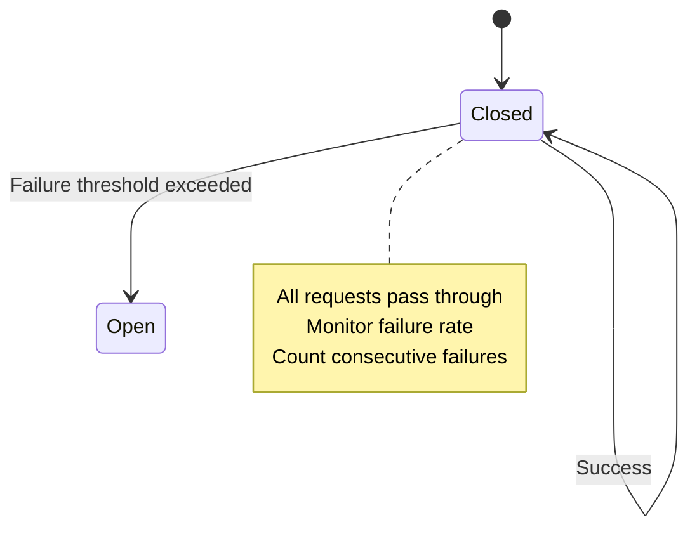
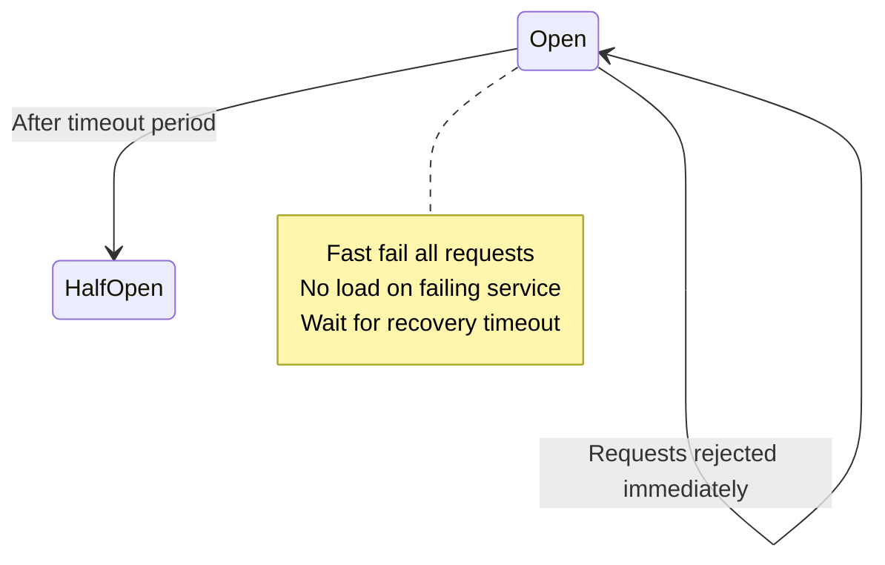
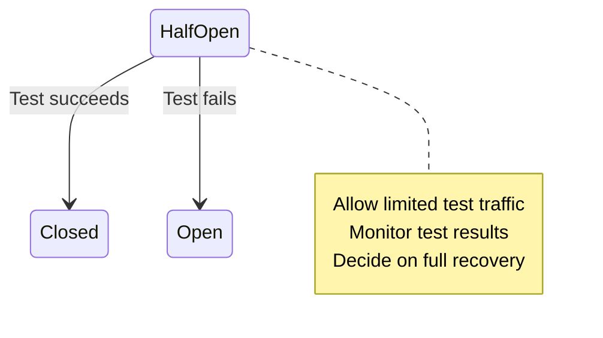
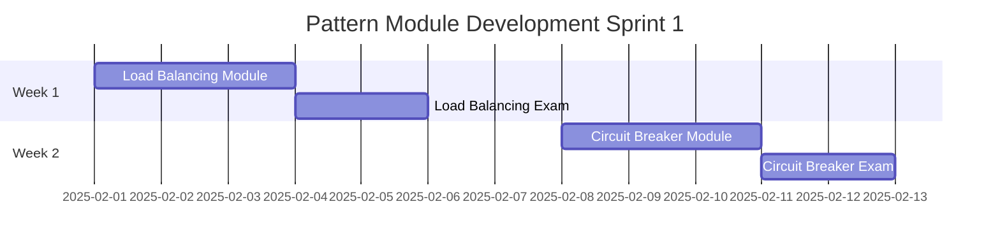
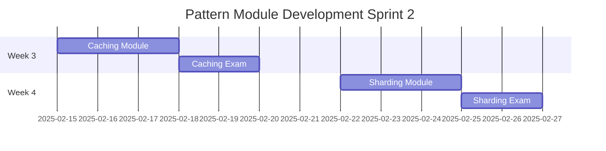

# Pattern Module Development Guide

## Quick Start: Your First Pattern Module in 5 Days

### Day 1: Research & Analysis

```yaml
pattern_research_template:
  pattern_name: Circuit Breaker
  
  sources_to_review:
    academic:
      - "Release It!" by Michael Nygard (original source)
      - Martin Fowler's Circuit Breaker article
      - IEEE papers on fault tolerance
      
    industry:
      - Netflix Hystrix documentation
      - AWS Circuit Breaker patterns
      - Resilience4j implementation
      
    code_examples:
      - github.com/Netflix/Hystrix
      - github.com/resilience4j/resilience4j
      - github.com/sony/gobreaker
      
  analysis_framework:
    problem_solved:
      - Cascading failures
      - Resource exhaustion
      - Slow dependencies
      
    key_mechanics:
      - States: Closed, Open, Half-Open
      - Failure threshold calculation
      - Timeout handling
      
    performance_metrics:
      - Failure rate reduction: 90%+
      - Recovery time: <30 seconds
      - Resource savings: 50-70%
```

### Day 2: Module Outline

```markdown
# Module Outline: Circuit Breaker Pattern

## Module Metadata
- **Title**: Circuit Breaker - Stop Cascading Failures Before They Start
- **Duration**: 150 minutes
- **Difficulty**: Intermediate
- **Prerequisites**: Basic distributed systems, failure modes

## Learning Outcomes
By the end of this module, you will:
1. Implement a production-ready circuit breaker
2. Configure thresholds for your specific use case
3. Monitor and tune circuit breaker performance
4. Integrate with existing resilience patterns
5. Debug common circuit breaker issues

## Focus Block Structure

### Block 1: The Cascade Problem (25 min)
- Hook: Netflix 2011 outage story
- Core: How failures propagate
- Visual: Cascade simulation
- Practice: Identify cascade risks in sample architecture

### Block 2: Circuit Breaker Mechanics (30 min)
- States and transitions
- Mathematical model of failure detection
- Code: Basic implementation
- Practice: State machine exercise

### Block 3: Production Implementation (25 min)
- Hystrix vs Resilience4j comparison
- Configuration deep dive
- Monitoring setup
- Practice: Configure for your service

### Block 4: Advanced Patterns (25 min)
- Circuit breaker + retry
- Circuit breaker + bulkhead
- Circuit breaker + timeout
- Practice: Combine patterns

### Block 5: Real-World Tuning (25 min)
- Netflix case study
- Uber's approach
- Common mistakes
- Practice: Tune for different scenarios

### Integration Challenge (20 min)
- Design resilience strategy for e-commerce checkout
- Must handle payment service failures
- Maintain user experience
```

### Day 3-4: Content Creation

```markdown
# Example Focus Block: Circuit Breaker Mechanics

## 🎯 PRIMING: "Your payment service just died. How long until your entire platform collapses?"

Without a circuit breaker: 2-3 minutes.
With a circuit breaker: Your platform stays up, degrades gracefully.

## 📚 CORE CONCEPT: The Three States of Protection

A circuit breaker exists in one of three states, automatically transitioning based on failure patterns:

### State 1: CLOSED (Normal Operation)


**In this state:**
- Requests flow normally to the service
- Every response is monitored
- Failures are counted against threshold
- Success resets failure count

### State 2: OPEN (Failure Protection)


**In this state:**
- All requests fail immediately
- No pressure on failing service
- Returns cached/default responses
- Waits for timeout before testing

### State 3: HALF-OPEN (Recovery Test)


## 💻 PRODUCTION IMPLEMENTATION

```python
import time
import threading
from enum import Enum
from collections import deque
from datetime import datetime, timedelta

class CircuitState(Enum):
    CLOSED = "CLOSED"
    OPEN = "OPEN"
    HALF_OPEN = "HALF_OPEN"

class CircuitBreaker:
    """
    Production-ready circuit breaker implementation
    with monitoring and gradual recovery
    """
    
    def __init__(self, 
                 failure_threshold=5,
                 recovery_timeout=60,
                 expected_exception=Exception,
                 success_threshold=2):
        # Configuration
        self.failure_threshold = failure_threshold
        self.recovery_timeout = recovery_timeout
        self.expected_exception = expected_exception
        self.success_threshold = success_threshold
        
        # State management
        self.state = CircuitState.CLOSED
        self.failure_count = 0
        self.success_count = 0
        self.last_failure_time = None
        
        # Monitoring
        self.state_changes = deque(maxlen=100)
        self.call_stats = {
            'total': 0,
            'success': 0,
            'failed': 0,
            'rejected': 0
        }
        
        # Thread safety
        self.lock = threading.RLock()
    
    def call(self, func, *args, **kwargs):
        """
        Execute function through circuit breaker
        """
        with self.lock:
            self.call_stats['total'] += 1
            
            # Check if we should attempt the call
            if not self._should_attempt_call():
                self.call_stats['rejected'] += 1
                raise CircuitOpenException(
                    f"Circuit breaker is OPEN. Service marked as unavailable."
                )
            
            # Attempt the call
            try:
                result = func(*args, **kwargs)
                self._on_success()
                return result
                
            except self.expected_exception as e:
                self._on_failure()
                raise
    
    def _should_attempt_call(self):
        """
        Determine if call should be attempted based on current state
        """
        if self.state == CircuitState.CLOSED:
            return True
            
        elif self.state == CircuitState.OPEN:
            # Check if recovery timeout has passed
            if self._recovery_timeout_expired():
                self._transition_to_half_open()
                return True
            return False
            
        else:  # HALF_OPEN
            return True
    
    def _on_success(self):
        """
        Handle successful call
        """
        self.call_stats['success'] += 1
        
        if self.state == CircuitState.HALF_OPEN:
            self.success_count += 1
            if self.success_count >= self.success_threshold:
                self._transition_to_closed()
        else:
            self.failure_count = 0  # Reset on success in CLOSED
    
    def _on_failure(self):
        """
        Handle failed call
        """
        self.call_stats['failed'] += 1
        self.last_failure_time = datetime.now()
        
        if self.state == CircuitState.CLOSED:
            self.failure_count += 1
            if self.failure_count >= self.failure_threshold:
                self._transition_to_open()
                
        elif self.state == CircuitState.HALF_OPEN:
            self._transition_to_open()
    
    def _transition_to_open(self):
        """
        Move to OPEN state
        """
        self._record_state_change(self.state, CircuitState.OPEN)
        self.state = CircuitState.OPEN
        self.failure_count = 0
        self.success_count = 0
        
    def _transition_to_closed(self):
        """
        Move to CLOSED state
        """
        self._record_state_change(self.state, CircuitState.CLOSED)
        self.state = CircuitState.CLOSED
        self.failure_count = 0
        self.success_count = 0
        
    def _transition_to_half_open(self):
        """
        Move to HALF_OPEN state
        """
        self._record_state_change(self.state, CircuitState.HALF_OPEN)
        self.state = CircuitState.HALF_OPEN
        self.success_count = 0
        
    def _recovery_timeout_expired(self):
        """
        Check if enough time has passed to try recovery
        """
        return (self.last_failure_time and 
                datetime.now() - self.last_failure_time > 
                timedelta(seconds=self.recovery_timeout))
    
    def _record_state_change(self, from_state, to_state):
        """
        Record state transition for monitoring
        """
        self.state_changes.append({
            'timestamp': datetime.now(),
            'from': from_state,
            'to': to_state,
            'failure_count': self.failure_count,
            'stats': self.call_stats.copy()
        })
    
    def get_status(self):
        """
        Get current circuit breaker status for monitoring
        """
        with self.lock:
            return {
                'state': self.state.value,
                'failure_count': self.failure_count,
                'success_count': self.success_count,
                'stats': self.call_stats.copy(),
                'last_failure': self.last_failure_time,
                'recent_transitions': list(self.state_changes)[-5:]
            }

class CircuitOpenException(Exception):
    """Raised when circuit breaker is open"""
    pass

# Usage Example
circuit_breaker = CircuitBreaker(
    failure_threshold=5,
    recovery_timeout=60,
    expected_exception=RequestException
)

def call_payment_service(order_id):
    try:
        return circuit_breaker.call(
            payment_client.process,
            order_id
        )
    except CircuitOpenException:
        # Fallback logic
        return use_cached_payment_status(order_id)
```

## 🧠 NEURAL BRIDGE: The Home Electrical System

Your home's electrical circuit breaker works exactly like this pattern:
- **Normal (CLOSED)**: Power flows freely
- **Overload detected**: Breaker trips (OPEN)
- **Manual reset**: Test if problem fixed (HALF-OPEN)
- **Safe again**: Normal operation resumes (CLOSED)

The software version just does this automatically!

## 🏃 ACTIVE PRACTICE: Configure Your Breaker

Given these service characteristics:
- Normal failure rate: 0.1%
- Acceptable failure rate: 5%
- Recovery time: Usually 30-60 seconds
- Traffic: 1000 requests/minute

Calculate:
1. Optimal failure threshold: _______
2. Recovery timeout: _______
3. Success threshold for recovery: _______

**Solution:**
1. Failure threshold: 50 failures (5% of 1000)
2. Recovery timeout: 45 seconds (middle of recovery range)
3. Success threshold: 10 consecutive successes

## 💭 CONSOLIDATION PROMPT

**Reflect on these questions:**
1. What happens if your failure threshold is too low? Too high?
2. How would you handle different types of failures differently?
3. When would a circuit breaker make things worse?
4. How does this pattern interact with retries?
```

### Day 5: Exam Creation

```markdown
# Circuit Breaker Pattern - Mastery Assessment

## Question 1: State Transition Analysis

### Scenario
Your circuit breaker is CLOSED with these settings:
- Failure threshold: 5
- Recovery timeout: 30 seconds
- Success threshold: 3

The following sequence occurs:
1. 4 failures in a row
2. 1 success
3. 5 failures in a row
4. Wait 31 seconds
5. 2 successes
6. 1 failure

**Question:** What state is the circuit breaker in after each step?

### Comprehensive Model Answer

**Step-by-step state analysis:**

**Initial State: CLOSED**
- Failure count: 0
- Ready to accept requests

**After Step 1 (4 failures):**
- State: Still CLOSED
- Failure count: 4
- Analysis: Below threshold of 5, staying closed
- Risk: One more failure triggers opening

**After Step 2 (1 success):**
- State: CLOSED
- Failure count: 0 (reset on success)
- Analysis: Success in CLOSED state resets counter
- System appears healthy

**After Step 3 (5 failures):**
- State: Transitions to OPEN
- Failure count: 5 reached threshold
- Timestamp: Marked for recovery timeout
- Impact: All requests now fast-fail

**After Step 4 (Wait 31 seconds):**
- State: Ready to transition to HALF-OPEN on next request
- Analysis: Recovery timeout expired
- Next request will test service health

**After Step 5 (2 successes):**
- State: HALF-OPEN
- Success count: 2
- Analysis: Below success threshold of 3
- Still testing service recovery

**After Step 6 (1 failure):**
- State: Transitions back to OPEN
- Success count: Reset to 0
- Analysis: Any failure in HALF-OPEN returns to OPEN
- Must wait another 30 seconds

**Key Insights:**
1. Success in CLOSED resets failure counter completely
2. HALF-OPEN is unforgiving - single failure reopens
3. Recovery requires sustained success, not just availability
4. The pattern prevents premature recovery attempts

**Production Implications:**
- Consider gradual recovery (10%, 50%, 100% traffic)
- Log state transitions for analysis
- Alert on repeated HALF-OPEN failures
- Monitor time spent in each state
```

---

## Pattern Module Checklist

### Pre-Development Checklist

```yaml
before_starting:
  research:
    - [ ] Read original source/paper
    - [ ] Review 3+ production implementations
    - [ ] Analyze 2+ failure cases
    - [ ] Benchmark performance impacts
    
  planning:
    - [ ] Define learning outcomes
    - [ ] Map prerequisite knowledge
    - [ ] Create visual diagrams
    - [ ] Prepare code examples
    
  validation:
    - [ ] Test all code examples
    - [ ] Verify technical accuracy
    - [ ] Time each section
    - [ ] Review difficulty progression
```

### During Development Checklist

```yaml
content_creation:
  each_focus_block:
    - [ ] Engaging opening hook
    - [ ] Clear core concept explanation
    - [ ] Working code example
    - [ ] Visual diagram/flowchart
    - [ ] Relatable analogy
    - [ ] Hands-on exercise
    - [ ] Reflection questions
    
  integration:
    - [ ] Links to related patterns
    - [ ] Real-world case studies
    - [ ] Common mistakes section
    - [ ] Implementation checklist
    
  quality:
    - [ ] Technical accuracy verified
    - [ ] Code tested and working
    - [ ] Diagrams clear and correct
    - [ ] Time estimates realistic
```

### Post-Development Checklist

```yaml
review_and_polish:
  technical_review:
    - [ ] Code review by senior engineer
    - [ ] Accuracy check by domain expert
    - [ ] Performance claims verified
    - [ ] Best practices confirmed
    
  learning_review:
    - [ ] Learning flow logical
    - [ ] Difficulty curve appropriate
    - [ ] Exercises achievable
    - [ ] Time estimates accurate
    
  final_checks:
    - [ ] All links working
    - [ ] Formatting consistent
    - [ ] Index updated
    - [ ] Related modules linked
```

---

## Pattern Categories and Priority

### Priority 1: Core Patterns (Start Here)

```yaml
scaling_patterns:
  1_load_balancing:
    complexity: Medium
    dependencies: None
    real_examples: [Nginx, HAProxy, AWS ELB]
    
  2_caching:
    complexity: Medium
    dependencies: [load_balancing]
    real_examples: [Redis, Memcached, CDN]
    
  3_sharding:
    complexity: High
    dependencies: [load_balancing, caching]
    real_examples: [MongoDB, Cassandra, DynamoDB]

resilience_patterns:
  1_circuit_breaker:
    complexity: Medium
    dependencies: None
    real_examples: [Hystrix, Resilience4j]
    
  2_retry_backoff:
    complexity: Low
    dependencies: None
    real_examples: [AWS SDK, Google Cloud Client]
    
  3_bulkhead:
    complexity: Medium
    dependencies: [circuit_breaker]
    real_examples: [Hystrix, Resilience4j]
```

### Priority 2: Advanced Patterns

```yaml
architecture_patterns:
  1_event_sourcing:
    complexity: High
    dependencies: [sharding, caching]
    real_examples: [Kafka, EventStore]
    
  2_cqrs:
    complexity: High
    dependencies: [event_sourcing]
    real_examples: [Axon Framework]
    
  3_saga_pattern:
    complexity: Very High
    dependencies: [event_sourcing, cqrs]
    real_examples: [Uber Cadence, AWS Step Functions]
```

---

## Module Quality Rubric

### Excellence Standards

```yaml
content_quality:
  depth:
    excellent: Multiple layers of understanding
    good: Core concepts well explained
    needs_work: Surface level only
    
  accuracy:
    excellent: 100% technically correct
    good: Minor issues not affecting understanding
    needs_work: Technical errors present
    
  practicality:
    excellent: Immediately applicable
    good: Applicable with adaptation
    needs_work: Too theoretical

learning_design:
  engagement:
    excellent: Compelling throughout
    good: Mostly engaging
    needs_work: Dry or boring
    
  progression:
    excellent: Perfect difficulty curve
    good: Generally good flow
    needs_work: Too steep or flat
    
  exercises:
    excellent: Challenging and relevant
    good: Appropriate difficulty
    needs_work: Too easy or impossible
```

---

## Implementation Timeline

### Week 1-2: Foundation Patterns



### Week 3-4: Scaling Patterns



---

## Resource Library

### Essential Reading

```yaml
books:
  patterns:
    - "Release It!" by Michael Nygard
    - "Designing Data-Intensive Applications" by Martin Kleppmann
    - "Building Microservices" by Sam Newman
    
  distributed_systems:
    - "Distributed Systems" by van Steen & Tanenbaum
    - "Site Reliability Engineering" by Google
    
online_resources:
  - martinfowler.com/microservices
  - highscalability.com
  - aws.amazon.com/builders-library
```

### Code Repositories

```yaml
reference_implementations:
  circuit_breaker:
    - github.com/Netflix/Hystrix
    - github.com/resilience4j/resilience4j
    - github.com/sony/gobreaker
    
  load_balancing:
    - github.com/nginx/nginx
    - github.com/haproxy/haproxy
    - github.com/envoyproxy/envoy
    
  caching:
    - github.com/redis/redis
    - github.com/memcached/memcached
    - github.com/hazelcast/hazelcast
```

---

## Conclusion

This guide provides everything needed to create professional-quality learning modules for distributed system patterns. Each module should take 3-5 days to develop, with another 1-2 days for review and refinement.

Remember: The goal is not just to explain patterns, but to enable engineers to recognize when to use them, implement them correctly, and debug them when they fail.

Start with one pattern, perfect the process, then scale to the rest.

---

*"A pattern well taught is worth a thousand documentation pages."*