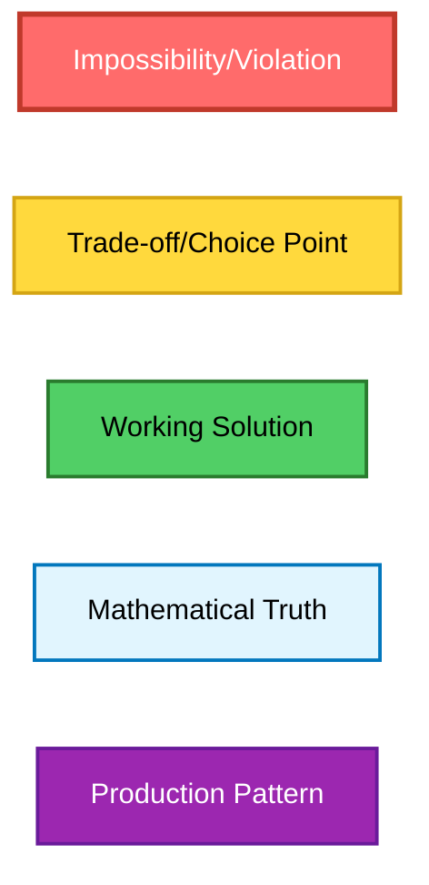
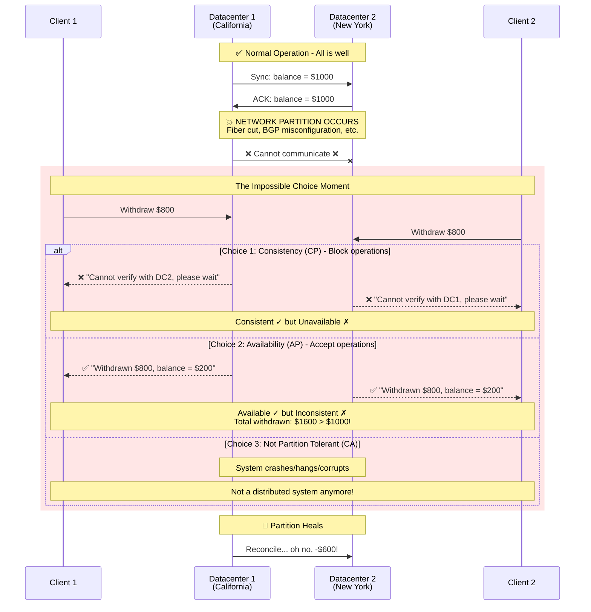
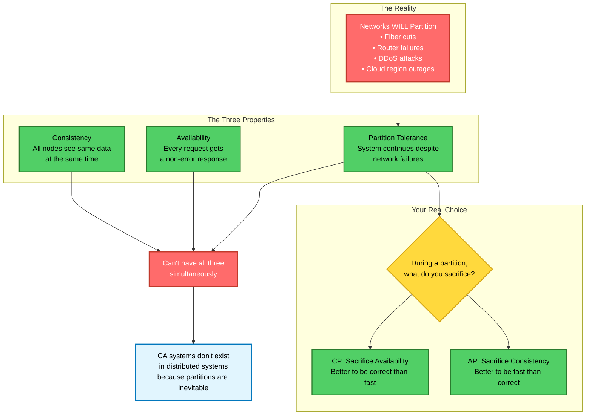

# CAP Theorem: The Complete Production Implementation Guide

## Visual Language Legend


---

## Part 1: The Fundamental Understanding

### The Moment of Truth - When Network Partitions


### The CAP Triangle - What It Really Means


---

## Part 2: Real-World Production Implementations

### Spring Boot + Kubernetes: CP System Implementation

**Use Case**: Financial transaction processing system requiring strict consistency.

```java
// CP System: Consistency over Availability
@Service
@Slf4j
public class ConsistentPaymentService {
    
    private final HazelcastInstance hazelcast;
    private final KubernetesClient k8sClient;
    
    @Value("${cap.consistency.quorum:3}")
    private int minimumQuorum;
    
    @Value("${cap.consistency.timeout:5000}")
    private long consistencyTimeout;
    
    /**
     * CP Implementation: Reject operations during partition
     */
    @Transactional(isolation = Isolation.SERIALIZABLE)
    public PaymentResult processPayment(PaymentRequest request) {
        
        // Step 1: Check cluster health
        if (!isQuorumAvailable()) {
            // CP CHOICE: Sacrifice availability for consistency
            throw new ServiceUnavailableException(
                "Cannot process payment - insufficient cluster quorum. " +
                "Current nodes: " + getAvailableNodes() + ", Required: " + minimumQuorum
            );
        }
        
        // Step 2: Distributed lock with quorum consensus
        ILock distributedLock = hazelcast.getCPSubsystem()
            .getLock("payment:" + request.getAccountId());
        
        try {
            // Fail fast if cannot achieve consensus
            if (!distributedLock.tryLock(consistencyTimeout, TimeUnit.MILLISECONDS)) {
                throw new ConsistencyException(
                    "Cannot achieve consensus for payment processing"
                );
            }
            
            // Step 3: Strongly consistent read from majority
            Account account = readWithQuorum(request.getAccountId());
            
            // Step 4: Validate with distributed consensus
            if (!validateWithConsensus(account, request.getAmount())) {
                return PaymentResult.rejected("Insufficient funds after consensus check");
            }
            
            // Step 5: Write with quorum acknowledgment
            account.debit(request.getAmount());
            writeWithQuorum(account);
            
            // Step 6: Distributed commit
            distributedCommit(request.getTransactionId());
            
            return PaymentResult.success(request.getTransactionId());
            
        } catch (InterruptedException e) {
            // Network partition detected during operation
            rollbackDistributed(request.getTransactionId());
            throw new PartitionException("Network partition detected - operation rolled back");
        } finally {
            distributedLock.unlock();
        }
    }
    
    /**
     * Quorum-based read ensuring consistency
     */
    private Account readWithQuorum(String accountId) {
        CompletableFuture<Account>[] futures = new CompletableFuture[getReplicaCount()];
        
        // Read from all replicas
        for (int i = 0; i < getReplicaCount(); i++) {
            futures[i] = readFromReplica(accountId, i);
        }
        
        // Wait for quorum responses
        List<Account> responses = new ArrayList<>();
        for (CompletableFuture<Account> future : futures) {
            try {
                responses.add(future.get(consistencyTimeout, TimeUnit.MILLISECONDS));
                if (responses.size() >= minimumQuorum) {
                    break;
                }
            } catch (TimeoutException e) {
                // Continue waiting for other replicas
            }
        }
        
        if (responses.size() < minimumQuorum) {
            throw new ConsistencyException(
                "Cannot read with quorum. Got " + responses.size() + 
                " responses, need " + minimumQuorum
            );
        }
        
        // Return the most recent version (using vector clocks)
        return responses.stream()
            .max(Comparator.comparing(Account::getVectorClock))
            .orElseThrow();
    }
    
    /**
     * Kubernetes health check for CP systems
     */
    @Component
    public static class CPHealthIndicator implements HealthIndicator {
        
        @Override
        public Health health() {
            int availableNodes = getClusterNodes();
            int requiredQuorum = getRequiredQuorum();
            
            if (availableNodes < requiredQuorum) {
                // Mark pod as unhealthy during partition
                return Health.down()
                    .withDetail("availableNodes", availableNodes)
                    .withDetail("requiredQuorum", requiredQuorum)
                    .withDetail("capChoice", "CP - Unavailable during partition")
                    .build();
            }
            
            return Health.up()
                .withDetail("availableNodes", availableNodes)
                .withDetail("consistency", "STRONG")
                .build();
        }
    }
}
```

### Kubernetes Deployment for CP System

```yaml
apiVersion: apps/v1
kind: StatefulSet
metadata:
  name: payment-service-cp
spec:
  serviceName: payment-service
  replicas: 5  # Odd number for quorum
  podManagementPolicy: Parallel
  updateStrategy:
    type: RollingUpdate
    rollingUpdate:
      partition: 0
  selector:
    matchLabels:
      app: payment-service
      cap-mode: consistency-preferred
  template:
    metadata:
      labels:
        app: payment-service
        cap-mode: consistency-preferred
    spec:
      # Anti-affinity to spread across zones
      affinity:
        podAntiAffinity:
          requiredDuringSchedulingIgnoredDuringExecution:
          - labelSelector:
              matchExpressions:
              - key: app
                operator: In
                values:
                - payment-service
            topologyKey: topology.kubernetes.io/zone
      containers:
      - name: payment-service
        image: payment-service:cp-1.0
        env:
        - name: CAP_MODE
          value: "CP"
        - name: QUORUM_SIZE
          value: "3"  # Majority of 5
        - name: CONSISTENCY_TIMEOUT_MS
          value: "5000"
        - name: PARTITION_DETECTION_ENABLED
          value: "true"
        ports:
        - containerPort: 8080
          name: http
        - containerPort: 5701
          name: hazelcast
        # Readiness probe fails during partition
        readinessProbe:
          httpGet:
            path: /health/ready
            port: 8080
          initialDelaySeconds: 30
          periodSeconds: 5
          failureThreshold: 2
        # Liveness keeps pod alive during partition
        livenessProbe:
          httpGet:
            path: /health/live
            port: 8080
          initialDelaySeconds: 60
          periodSeconds: 10
        resources:
          requests:
            memory: "2Gi"
            cpu: "1000m"
          limits:
            memory: "4Gi"
            cpu: "2000m"
        volumeMounts:
        - name: data
          mountPath: /data
  volumeClaimTemplates:
  - metadata:
      name: data
    spec:
      accessModes: ["ReadWriteOnce"]
      storageClassName: "ssd-replicated"  # Replicated storage for consistency
      resources:
        requests:
          storage: 100Gi

---
# Network Policy for CP System - Strict communication
apiVersion: networking.k8s.io/v1
kind: NetworkPolicy
metadata:
  name: payment-service-cp-network
spec:
  podSelector:
    matchLabels:
      app: payment-service
  policyTypes:
  - Ingress
  - Egress
  ingress:
  - from:
    - podSelector:
        matchLabels:
          app: payment-service  # Only cluster members
    ports:
    - protocol: TCP
      port: 5701  # Hazelcast cluster
  - from:
    - podSelector:
        matchLabels:
          app: api-gateway  # Client access
    ports:
    - protocol: TCP
      port: 8080
  egress:
  - to:
    - podSelector:
        matchLabels:
          app: payment-service
    ports:
    - protocol: TCP
      port: 5701
```

### Spring Boot + Kubernetes: AP System Implementation

**Use Case**: Social media feed service prioritizing availability.

```java
// AP System: Availability over Consistency
@Service
@Slf4j
public class AvailableFeedService {
    
    private final CassandraTemplate cassandra;
    private final RedisTemplate<String, FeedItem> redis;
    private final ConflictResolver conflictResolver;
    
    @Value("${cap.availability.consistency.level:ONE}")
    private ConsistencyLevel consistencyLevel;
    
    @Value("${cap.availability.max.staleness.ms:30000}")
    private long maxStalenessMs;
    
    /**
     * AP Implementation: Always serve requests, accept inconsistency
     */
    public FeedResponse getUserFeed(String userId) {
        
        FeedResponse.Builder response = FeedResponse.builder();
        
        // Step 1: Try cache first (fastest, possibly stale)
        List<FeedItem> cachedFeed = getCachedFeed(userId);
        if (cachedFeed != null) {
            return response
                .items(cachedFeed)
                .consistency("EVENTUAL")
                .staleness(calculateStaleness(cachedFeed))
                .source("CACHE")
                .build();
        }
        
        // Step 2: Read from ANY available replica
        try {
            List<FeedItem> feed = readFromAnyReplica(userId);
            
            // Async cache update (don't block)
            CompletableFuture.runAsync(() -> updateCache(userId, feed));
            
            return response
                .items(feed)
                .consistency("EVENTUAL")
                .source("DATABASE")
                .build();
                
        } catch (NoReplicaAvailableException e) {
            // Step 3: Serve stale data if no replicas available
            List<FeedItem> staleFeed = getStaleData(userId);
            if (staleFeed != null) {
                return response
                    .items(staleFeed)
                    .consistency("STALE")
                    .staleness(System.currentTimeMillis() - getLastUpdateTime(userId))
                    .warning("Serving stale data due to partition")
                    .source("STALE_CACHE")
                    .build();
            }
            
            // Step 4: Generate default content if nothing available
            return response
                .items(generateDefaultFeed())
                .consistency("DEFAULT")
                .warning("Serving default content - system degraded")
                .source("GENERATED")
                .build();
        }
    }
    
    /**
     * AP Write: Accept writes even during partition
     */
    public PostResult createPost(PostRequest request) {
        String postId = UUID.randomUUID().toString();
        
        // Use vector clock for conflict resolution later
        VectorClock vectorClock = new VectorClock();
        vectorClock.increment(getNodeId());
        
        FeedItem item = FeedItem.builder()
            .postId(postId)
            .userId(request.getUserId())
            .content(request.getContent())
            .timestamp(System.currentTimeMillis())
            .vectorClock(vectorClock)
            .nodeId(getNodeId())
            .build();
        
        // Step 1: Write locally first (always succeeds)
        writeLocal(item);
        
        // Step 2: Async replicate to other nodes (best effort)
        CompletableFuture.runAsync(() -> {
            replicateEventually(item);
        });
        
        // Step 3: Return success immediately
        return PostResult.success(postId)
            .consistency("EVENTUAL")
            .replicationStatus("PENDING");
    }
    
    /**
     * Conflict resolution for AP systems
     */
    @Scheduled(fixedDelay = 10000)
    public void resolveConflicts() {
        List<ConflictedItem> conflicts = detectConflicts();
        
        for (ConflictedItem conflict : conflicts) {
            FeedItem resolved = conflictResolver.resolve(conflict);
            
            // Apply resolution strategy
            switch (resolved.getResolutionStrategy()) {
                case LAST_WRITE_WINS:
                    applyLastWriteWins(resolved);
                    break;
                case MERGE:
                    applyMerge(resolved);
                    break;
                case MANUAL:
                    queueForManualResolution(resolved);
                    break;
            }
        }
    }
    
    /**
     * Read from ANY available node
     */
    private List<FeedItem> readFromAnyReplica(String userId) {
        // Cassandra with consistency level ONE
        Select select = QueryBuilder.selectFrom("feeds")
            .all()
            .whereColumn("user_id").isEqualTo(literal(userId))
            .limit(100);
        
        // Set consistency to ONE for maximum availability
        select.setConsistencyLevel(ConsistencyLevel.ONE);
        
        try {
            return cassandra.select(select, FeedItem.class);
        } catch (Exception e) {
            // Try another datacenter
            select.setConsistencyLevel(ConsistencyLevel.LOCAL_ONE);
            return cassandra.select(select, FeedItem.class);
        }
    }
    
    /**
     * Kubernetes health check for AP systems
     */
    @Component
    public static class APHealthIndicator implements HealthIndicator {
        
        @Override
        public Health health() {
            // AP systems are always "healthy" from availability perspective
            Health.Builder builder = Health.up()
                .withDetail("capChoice", "AP - Available during partition");
            
            // But report consistency status
            boolean hasPartition = detectPartition();
            if (hasPartition) {
                builder.withDetail("consistency", "DEGRADED")
                    .withDetail("partition", true)
                    .withDetail("warning", "System operating in partitioned mode");
            } else {
                builder.withDetail("consistency", "EVENTUAL")
                    .withDetail("partition", false);
            }
            
            return builder.build();
        }
    }
}
```

### Kubernetes Deployment for AP System

```yaml
apiVersion: apps/v1
kind: Deployment
metadata:
  name: feed-service-ap
spec:
  replicas: 10  # More replicas for availability
  strategy:
    type: RollingUpdate
    rollingUpdate:
      maxSurge: 2
      maxUnavailable: 3  # Allow more unavailable for faster updates
  selector:
    matchLabels:
      app: feed-service
      cap-mode: availability-preferred
  template:
    metadata:
      labels:
        app: feed-service
        cap-mode: availability-preferred
    spec:
      # Prefer spreading but not required
      affinity:
        podAntiAffinity:
          preferredDuringSchedulingIgnoredDuringExecution:
          - weight: 100
            podAffinityTerm:
              labelSelector:
                matchExpressions:
                - key: app
                  operator: In
                  values:
                  - feed-service
              topologyKey: kubernetes.io/hostname
      containers:
      - name: feed-service
        image: feed-service:ap-1.0
        env:
        - name: CAP_MODE
          value: "AP"
        - name: CONSISTENCY_LEVEL
          value: "ONE"  # Or ANY for maximum availability
        - name: MAX_STALENESS_MS
          value: "300000"  # 5 minutes
        - name: CONFLICT_RESOLUTION
          value: "LAST_WRITE_WINS"
        ports:
        - containerPort: 8080
          name: http
        - containerPort: 9042
          name: cassandra
        # Very lenient probes for availability
        readinessProbe:
          httpGet:
            path: /health/ready
            port: 8080
          initialDelaySeconds: 10
          periodSeconds: 5
          successThreshold: 1
          failureThreshold: 10  # Very tolerant
        livenessProbe:
          httpGet:
            path: /health/live
            port: 8080
          initialDelaySeconds: 30
          periodSeconds: 10
          failureThreshold: 10  # Very tolerant
        resources:
          requests:
            memory: "1Gi"
            cpu: "500m"
          limits:
            memory: "2Gi"
            cpu: "1000m"

---
# HorizontalPodAutoscaler for AP system
apiVersion: autoscaling/v2
kind: HorizontalPodAutoscaler
metadata:
  name: feed-service-ap-hpa
spec:
  scaleTargetRef:
    apiVersion: apps/v1
    kind: Deployment
    name: feed-service-ap
  minReplicas: 10
  maxReplicas: 50  # Scale out for availability
  metrics:
  - type: Resource
    resource:
      name: cpu
      target:
        type: Utilization
        averageUtilization: 60  # Lower threshold for availability
  - type: Resource
    resource:
      name: memory
      target:
        type: Utilization
        averageUtilization: 70
  behavior:
    scaleUp:
      stabilizationWindowSeconds: 30  # Fast scale up
      policies:
      - type: Percent
        value: 100  # Double pods quickly
        periodSeconds: 60
    scaleDown:
      stabilizationWindowSeconds: 300  # Slow scale down
      policies:
      - type: Percent
        value: 10
        periodSeconds: 60
```

---

## Part 3: Tunable Consistency - The Best of Both Worlds

### MongoDB Implementation with Tunable Consistency

```java
@Service
@Slf4j
public class TunableConsistencyService {
    
    private final MongoTemplate mongoTemplate;
    
    /**
     * Per-operation consistency choice
     */
    public <T> T executeWithConsistency(
            ConsistencyRequirement requirement,
            Supplier<T> operation) {
        
        switch (requirement) {
            case STRONG:
                return executeWithStrong(operation);
            case BOUNDED_STALENESS:
                return executeWithBounded(operation);
            case SESSION:
                return executeWithSession(operation);
            case EVENTUAL:
                return executeWithEventual(operation);
            default:
                return operation.get();
        }
    }
    
    /**
     * Strong consistency - read your writes
     */
    private <T> T executeWithStrong(Supplier<T> operation) {
        WriteConcern writeConcern = WriteConcern.MAJORITY
            .withJournal(true)
            .withWTimeout(5, TimeUnit.SECONDS);
        
        ReadPreference readPreference = ReadPreference.primary();
        
        MongoDatabase database = mongoTemplate.getDb()
            .withWriteConcern(writeConcern)
            .withReadPreference(readPreference)
            .withReadConcern(ReadConcern.LINEARIZABLE);
        
        // Execute with strong consistency
        return operation.get();
    }
    
    /**
     * Bounded staleness - max lag time
     */
    private <T> T executeWithBounded(Supplier<T> operation) {
        // Read from secondary if lag < 5 seconds
        TagSet recentSecondary = new TagSet(
            new Tag("maxStalenessSeconds", "5")
        );
        
        ReadPreference readPreference = ReadPreference
            .secondary(Arrays.asList(recentSecondary));
        
        mongoTemplate.getDb()
            .withReadPreference(readPreference)
            .withReadConcern(ReadConcern.LOCAL);
        
        return operation.get();
    }
    
    /**
     * Session consistency - read your own writes
     */
    private <T> T executeWithSession(Supplier<T> operation) {
        ClientSession session = mongoTemplate.getMongoClient()
            .startSession();
        
        try {
            session.startTransaction();
            T result = operation.get();
            session.commitTransaction();
            return result;
        } catch (Exception e) {
            session.abortTransaction();
            throw e;
        } finally {
            session.close();
        }
    }
    
    /**
     * Usage example: E-commerce with mixed consistency
     */
    public OrderResponse processOrder(OrderRequest request) {
        
        // Inventory check needs strong consistency
        Integer stock = executeWithConsistency(
            ConsistencyRequirement.STRONG,
            () -> checkInventory(request.getProductId())
        );
        
        if (stock < request.getQuantity()) {
            return OrderResponse.outOfStock();
        }
        
        // Order creation needs strong consistency
        Order order = executeWithConsistency(
            ConsistencyRequirement.STRONG,
            () -> createOrder(request)
        );
        
        // Recommendation update can be eventual
        executeWithConsistency(
            ConsistencyRequirement.EVENTUAL,
            () -> updateRecommendations(request.getUserId(), request.getProductId())
        );
        
        // Analytics can be eventual
        executeWithConsistency(
            ConsistencyRequirement.EVENTUAL,
            () -> trackAnalytics(order)
        );
        
        return OrderResponse.success(order);
    }
}
```

---

## Part 4: Practical Decision Framework

### Decision Matrix for Your System

```java
@Component
public class CAPDecisionEngine {
    
    /**
     * Automated CAP decision based on operation type
     */
    public CAPChoice determineChoice(OperationContext context) {
        
        // Financial operations
        if (context.involves(DataType.MONEY, DataType.INVENTORY)) {
            return CAPChoice.CP;
        }
        
        // User-generated content
        if (context.involves(DataType.SOCIAL_CONTENT, DataType.COMMENTS)) {
            return CAPChoice.AP;
        }
        
        // Configuration and control plane
        if (context.involves(DataType.CONFIGURATION, DataType.SCHEMA)) {
            return CAPChoice.CP;
        }
        
        // Telemetry and metrics
        if (context.involves(DataType.METRICS, DataType.LOGS)) {
            return CAPChoice.AP;
        }
        
        // Mixed operations - use tunable
        return CAPChoice.TUNABLE;
    }
    
    /**
     * Generate configuration based on CAP choice
     */
    public SystemConfiguration generateConfig(CAPChoice choice) {
        switch (choice) {
            case CP:
                return SystemConfiguration.builder()
                    .replicationFactor(5)
                    .writeQuorum(3)
                    .readQuorum(3)
                    .consistencyLevel(ConsistencyLevel.QUORUM)
                    .availabilityTarget(0.99)  // Lower availability
                    .maxLatencyMs(100)
                    .partitionStrategy(PartitionStrategy.REJECT_MINORITY)
                    .build();
                    
            case AP:
                return SystemConfiguration.builder()
                    .replicationFactor(3)
                    .writeQuorum(1)
                    .readQuorum(1)
                    .consistencyLevel(ConsistencyLevel.ONE)
                    .availabilityTarget(0.9999)  // Higher availability
                    .maxLatencyMs(10)
                    .partitionStrategy(PartitionStrategy.ACCEPT_ALL)
                    .conflictResolution(ConflictResolution.LAST_WRITE_WINS)
                    .build();
                    
            case TUNABLE:
                return SystemConfiguration.builder()
                    .replicationFactor(5)
                    .writeQuorum(2)  // Flexible
                    .readQuorum(2)    // Flexible
                    .consistencyLevel(ConsistencyLevel.LOCAL_QUORUM)
                    .availabilityTarget(0.999)
                    .maxLatencyMs(50)
                    .partitionStrategy(PartitionStrategy.DYNAMIC)
                    .build();
                    
            default:
                throw new IllegalArgumentException("Unknown CAP choice");
        }
    }
}
```

### Monitoring CAP Trade-offs in Production

```java
@Component
@Slf4j
public class CAPMetricsCollector {
    
    private final MeterRegistry meterRegistry;
    
    @EventListener
    public void onPartitionDetected(PartitionEvent event) {
        meterRegistry.counter("cap.partition.detected",
            "datacenter", event.getDatacenter(),
            "duration", String.valueOf(event.getDurationMs())
        ).increment();
        
        log.warn("Partition detected: {} for {} ms", 
            event.getDatacenter(), event.getDurationMs());
    }
    
    @EventListener
    public void onConsistencyViolation(ConsistencyViolationEvent event) {
        meterRegistry.counter("cap.consistency.violation",
            "service", event.getService(),
            "severity", event.getSeverity().toString()
        ).increment();
        
        if (event.getSeverity() == Severity.CRITICAL) {
            // Trigger alert
            alertingService.sendAlert(
                Alert.critical()
                    .title("Critical consistency violation")
                    .description(event.getDescription())
                    .build()
            );
        }
    }
    
    @Scheduled(fixedRate = 60000)
    public void reportCAPStatus() {
        CAPStatus status = calculateCurrentStatus();
        
        meterRegistry.gauge("cap.consistency.level", 
            status.getConsistencyScore());
        meterRegistry.gauge("cap.availability.level", 
            status.getAvailabilityScore());
        meterRegistry.gauge("cap.partition.tolerance", 
            status.getPartitionToleranceScore());
        
        log.info("CAP Status - C:{}, A:{}, P:{}", 
            status.getConsistencyScore(),
            status.getAvailabilityScore(),
            status.getPartitionToleranceScore());
    }
}
```

---

## Part 5: Production Case Studies

### Case Study 1: Netflix's Regional Failover (AP System)

Netflix chose AP for streaming, with sophisticated reconciliation:

```java
public class NetflixStyleAPSystem {
    
    /**
     * Multi-region AP architecture
     */
    public StreamingResponse streamContent(StreamRequest request) {
        
        // Try primary region
        Region primary = determinePrimaryRegion(request.getUserLocation());
        
        try {
            return streamFromRegion(primary, request);
        } catch (RegionUnavailableException e) {
            // Failover to secondary region (AP choice)
            log.info("Primary region {} unavailable, failing over", primary);
            
            Region secondary = determineSecondaryRegion(request.getUserLocation());
            StreamingResponse response = streamFromRegion(secondary, request);
            
            // Mark as degraded but available
            response.setDegraded(true);
            response.setServingRegion(secondary);
            
            // Async sync viewing history later
            CompletableFuture.runAsync(() -> 
                syncViewingHistory(request.getUserId(), primary, secondary)
            );
            
            return response;
        }
    }
    
    /**
     * Viewing history reconciliation
     */
    @Scheduled(fixedDelay = 300000)  // Every 5 minutes
    public void reconcileViewingHistory() {
        List<Region> regions = getAllRegions();
        
        for (Region region : regions) {
            List<ViewingRecord> records = getUnreconciledRecords(region);
            
            for (ViewingRecord record : records) {
                // Use vector clocks to resolve conflicts
                ViewingRecord canonical = resolveWithVectorClocks(record);
                propagateToAllRegions(canonical);
            }
        }
    }
}
```

### Case Study 2: Banking System (CP Implementation)

A major bank's CP implementation for account transfers:

```java
public class BankingCPSystem {
    
    private final ConsensusService raft;
    
    /**
     * CP Transfer: Consistency is non-negotiable
     */
    public TransferResult transfer(TransferRequest request) {
        
        // Step 1: Achieve consensus on operation order
        ConsensusResult consensus = raft.propose(
            Operation.transfer()
                .from(request.getFromAccount())
                .to(request.getToAccount())
                .amount(request.getAmount())
                .build()
        );
        
        if (!consensus.isAccepted()) {
            // CP: Reject during partition
            return TransferResult.rejected(
                "Cannot achieve consensus - system in partition"
            );
        }
        
        // Step 2: Distributed transaction with 2PC
        DistributedTransaction txn = beginDistributedTransaction();
        
        try {
            // Lock accounts across all replicas
            txn.lock(request.getFromAccount());
            txn.lock(request.getToAccount());
            
            // Validate with majority read
            Balance fromBalance = readWithMajority(request.getFromAccount());
            if (fromBalance.getAmount() < request.getAmount()) {
                txn.rollback();
                return TransferResult.insufficientFunds();
            }
            
            // Update with majority write
            txn.debit(request.getFromAccount(), request.getAmount());
            txn.credit(request.getToAccount(), request.getAmount());
            
            // Commit with majority acknowledgment
            CommitResult commit = txn.commitWithMajority();
            
            if (commit.isSuccessful()) {
                return TransferResult.success(commit.getTransactionId());
            } else {
                return TransferResult.rejected("Majority commit failed");
            }
            
        } catch (PartitionException e) {
            txn.rollback();
            // Explicit choice: unavailable during partition
            return TransferResult.systemUnavailable();
        }
    }
}
```

---

## Part 6: Implementation Checklist

### Pre-Production Checklist

```yaml
CP System Checklist:
  Architecture:
    ✓ Odd number of replicas (3, 5, or 7)
    ✓ Consensus protocol implemented (Raft/Paxos)
    ✓ Distributed locking mechanism
    ✓ Quorum-based reads and writes
    
  Configuration:
    ✓ Write quorum > N/2
    ✓ Read quorum > N/2
    ✓ Timeout values for consensus
    ✓ Partition detection enabled
    
  Testing:
    ✓ Network partition simulation
    ✓ Split-brain scenarios
    ✓ Minority partition behavior
    ✓ Recovery after partition heal
    
  Monitoring:
    ✓ Consensus achievement rate
    ✓ Partition detection alerts
    ✓ Quorum availability metrics
    ✓ Transaction rollback rate

AP System Checklist:
  Architecture:
    ✓ Multiple replicas across regions
    ✓ Eventually consistent storage
    ✓ Conflict resolution strategy
    ✓ Vector clocks or CRDTs
    
  Configuration:
    ✓ Write quorum = 1 (or ANY)
    ✓ Read quorum = 1 (or ANY)
    ✓ Max staleness acceptable
    ✓ Hinted handoff enabled
    
  Testing:
    ✓ Partition tolerance testing
    ✓ Conflict resolution validation
    ✓ Staleness measurement
    ✓ Reconciliation timing
    
  Monitoring:
    ✓ Replication lag metrics
    ✓ Conflict occurrence rate
    ✓ Staleness distribution
    ✓ Reconciliation success rate
```

### Testing CAP Properties

```java
@SpringBootTest
public class CAPIntegrationTest {
    
    @Test
    public void testCPSystemRejectsMinorityWrites() {
        // Create network partition
        networkSimulator.createPartition(
            Arrays.asList("node1", "node2"),  // Minority
            Arrays.asList("node3", "node4", "node5")  // Majority
        );
        
        // Attempt write from minority partition
        assertThrows(ConsistencyException.class, () -> {
            cpService.write("key", "value", "node1");
        });
        
        // Verify majority partition still works
        WriteResult result = cpService.write("key", "value", "node3");
        assertTrue(result.isSuccessful());
    }
    
    @Test
    public void testAPSystemAcceptsPartitionedWrites() {
        // Create network partition
        networkSimulator.createPartition(
            Arrays.asList("node1", "node2"),
            Arrays.asList("node3", "node4", "node5")
        );
        
        // Both partitions accept writes
        WriteResult result1 = apService.write("key", "value1", "node1");
        WriteResult result2 = apService.write("key", "value2", "node3");
        
        assertTrue(result1.isSuccessful());
        assertTrue(result2.isSuccessful());
        
        // Heal partition
        networkSimulator.healPartition();
        
        // Verify conflict resolution
        Thread.sleep(5000);  // Wait for reconciliation
        
        String finalValue = apService.read("key");
        // Should resolve to one value (based on strategy)
        assertTrue(finalValue.equals("value1") || finalValue.equals("value2"));
    }
}
```

---

## Part 7: Migration Strategies

### Migrating from CP to AP

```java
@Component
public class CPToAPMigration {
    
    /**
     * Gradual migration from CP to AP
     */
    public void migrate(MigrationPlan plan) {
        
        // Phase 1: Add AP replicas alongside CP
        addAPReplicas(plan.getTargetRegions());
        
        // Phase 2: Dual writes (CP primary, AP secondary)
        enableDualWrites();
        
        // Phase 3: Gradual read migration
        for (int percentage = 10; percentage <= 100; percentage += 10) {
            routeReadsToAP(percentage);
            
            // Monitor consistency metrics
            ConsistencyMetrics metrics = measureConsistency();
            if (metrics.getViolationRate() > plan.getMaxViolationRate()) {
                // Rollback if too many violations
                routeReadsToAP(percentage - 10);
                break;
            }
            
            Thread.sleep(plan.getMigrationStepDelay());
        }
        
        // Phase 4: Switch writes to AP
        if (getCurrentAPReadPercentage() == 100) {
            switchWritesToAP();
            
            // Phase 5: Decommission CP infrastructure
            scheduleDecommission(plan.getDecommissionDate());
        }
    }
}
```

---

## Summary: The Essential Wisdom

### The One-Liner
**"During a network partition, a distributed system must choose between consistency and availability - it cannot guarantee both."**

### The Three Truths
1. **Partitions are inevitable** - Plan for them, not against them
2. **The choice is mandatory** - No system escapes CAP
3. **The choice is contextual** - Different use cases need different trade-offs

### The Practical Wisdom
- **Most systems are CP or AP by default** - Know which yours is
- **Tunable consistency is powerful but complex** - Use thoughtfully
- **The real work is in reconciliation** - Plan for divergence repair
- **Monitor partition frequency** - Data drives architecture decisions

### The Meta-Lesson
**CAP Theorem isn't a limitation to work around - it's a fundamental truth that helps us make informed engineering decisions. By accepting what we cannot have, we can optimize for what we truly need.**

### Production Readiness Checklist

Before deploying your CAP-aware system:

1. **Define your choice explicitly** - Document CP, AP, or tunable per operation
2. **Implement monitoring** - Track consistency violations and availability metrics
3. **Test partition scenarios** - Use Chaos Engineering to validate behavior
4. **Plan reconciliation** - Have strategies for handling diverged state
5. **Set SLOs appropriately** - CP systems have lower availability SLOs
6. **Train your team** - Everyone should understand the trade-offs
7. **Document for customers** - Be transparent about consistency guarantees

Remember: **There's no perfect choice, only the right choice for your use case.**