# CAP Theorem: The Complete Deep Dive

## Visual Language Legend


---

## Layer 1: The Fundamental Scenario

### The Moment of Truth - When Network Partitions

```mermaid
sequenceDiagram
    participant C1 as Client 1
    participant DC1 as Datacenter 1<br/>(California)
    participant DC2 as Datacenter 2<br/>(New York)
    participant C2 as Client 2
    
    Note over DC1,DC2: ✅ Normal Operation - All is well
    DC1->>DC2: Sync: balance = $1000
    DC2->>DC1: ACK: balance = $1000
    
    Note over DC1,DC2: 💥 NETWORK PARTITION OCCURS<br/>Fiber cut, BGP misconfiguration, etc.
    DC1-xDC2: ❌ Cannot communicate ❌
    
    rect rgb(255, 230, 230)
        Note over C1,C2: The Impossible Choice Moment
        C1->>DC1: Withdraw $800
        C2->>DC2: Withdraw $800
        
        alt Choice 1: Consistency (CP) - Block operations
            DC1-->>C1: ❌ "Cannot verify with DC2, please wait"
            DC2-->>C2: ❌ "Cannot verify with DC1, please wait"
            Note over C1,C2: Consistent ✓ but Unavailable ✗
        else Choice 2: Availability (AP) - Accept operations
            DC1-->>C1: ✅ "Withdrawn $800, balance = $200"
            DC2-->>C2: ✅ "Withdrawn $800, balance = $200"
            Note over C1,C2: Available ✓ but Inconsistent ✗<br/>Total withdrawn: $1600 > $1000!
        else Choice 3: Not Partition Tolerant (CA)
            Note over DC1,DC2: System crashes/hangs/corrupts
            Note over C1,C2: Not a distributed system anymore!
        end
    end
    
    Note over DC1,DC2: 🔄 Partition Heals
    DC1->>DC2: Reconcile... oh no, -$600!
```


### The CAP Triangle - What It Really Means


---

## Layer 2: The Mathematical Proof

### The Formal Proof Structure
```mermaid
graph TD
    subgraph "Setup"
        Given[Given: Network with nodes G1, G2]:::proof
        Partition[Create partition: G1 | G2]:::proof
        Given --> Partition
    end
    
    subgraph "The Proof by Contradiction"
        Assume[Assume: System has C, A, and P]:::proof
        
        Write[Client writes v=1 to G1]:::proof
        MustAccept[By Availability: G1 must accept]:::proof
        
        Read[Client reads from G2]:::proof
        MustRespond[By Availability: G2 must respond]:::proof
        
        CannotKnow[By Partition: G2 cannot know v=1]:::impossible
        MustKnow[By Consistency: G2 must return v=1]:::impossible
        
        Contradiction[⚡ CONTRADICTION ⚡<br/>G2 must know v=1 AND cannot know v=1]:::impossible
    end
    
    subgraph "Therefore"
        QED[∴ Cannot have C ∧ A ∧ P]:::impossible
    end
    
    Partition --> Assume
    Assume --> Write --> MustAccept
    Assume --> Read --> MustRespond
    MustRespond --> CannotKnow
    MustRespond --> MustKnow
    CannotKnow --> Contradiction
    MustKnow --> Contradiction
    Contradiction --> QED
    
    classDef impossible fill:#ff6b6b,color:#fff,stroke:#c0392b,stroke-width:3px;
    classDef proof fill:#e1f5fe,color:#000,stroke:#0277bd,stroke-width:2px;
```

### The State Space View


---

## Layer 3: The Quorum Mathematics

### How Quorums Enforce Trade-offs

```mermaid
graph TB
    subgraph "Quorum Parameters"
        N[N = Total Replicas<br/>e.g., N = 5]:::proof
        W[W = Write Quorum<br/>Nodes needed for write]:::proof
        R[R = Read Quorum<br/>Nodes needed for read]:::proof
    end
    
    subgraph "Consistency Conditions"
        Strong[Strong Consistency<br/>R + W > N]:::workaround
        Overlap[Quorums Overlap<br/>At least 1 node in common]:::proof
        Strong --> Overlap
        
        Example1[Example: N=5, R=3, W=3<br/>3+3=6 > 5 ✓]:::workaround
    end
    
    subgraph "Availability Conditions"
        HighWrite[High Write Availability<br/>W ≤ ⌊N/2⌋]:::workaround
        HighRead[High Read Availability<br/>R ≤ ⌊N/2⌋]:::workaround
        
        Example2[Example: N=5, R=2, W=2<br/>Can tolerate 3 failures!]:::workaround
    end
    
    subgraph "The Trade-off"
        Choice{Choose your quorums}:::tradeoff
        
        Choice -->|R=N, W=1| ReadAll[Read all replicas<br/>Slow reads, fast writes]:::workaround
        Choice -->|R=1, W=N| WriteAll[Write all replicas<br/>Fast reads, slow writes]:::workaround
        Choice -->|R=⌈N/2⌉+1, W=⌈N/2⌉+1| Majority[Majority quorums<br/>Balanced]:::workaround
        Choice -->|R=1, W=1| Dangerous[⚠️ No consistency!<br/>Pure AP]:::impossible
    end
    
    N --> Choice
    W --> Choice
    R --> Choice
    
    Strong -.->|Constrains| Choice
    HighWrite -.->|Constrains| Choice
    HighRead -.->|Constrains| Choice
    
    classDef impossible fill:#ff6b6b,color:#fff,stroke:#c0392b,stroke-width:3px;
    classDef tradeoff fill:#ffd93d,color:#000,stroke:#d4a514,stroke-width:2px;
    classDef workaround fill:#51cf66,color:#000,stroke:#2a7b2e,stroke-width:2px;
    classDef proof fill:#e1f5fe,color:#000,stroke:#0277bd,stroke-width:2px;
```


### Quorum Intersection Visualized

```mermaid
flowchart LR
    subgraph "N=5 Nodes"
        N1[Node 1]
        N2[Node 2]
        N3[Node 3]
        N4[Node 4]
        N5[Node 5]
    end
    
    subgraph "Write Quorum W=3"
        W1[Node 1]:::workaround
        W2[Node 2]:::workaround
        W3[Node 3]:::workaround
    end
    
    subgraph "Read Quorum R=3"
        R3[Node 3]:::workaround
        R4[Node 4]:::workaround
        R5[Node 5]:::workaround
    end
    
    subgraph "Guaranteed Intersection"
        I[Node 3<br/>Has latest write]:::proof
    end
    
    W1 -.-> N1
    W2 -.-> N2
    W3 -.-> N3
    W3 --> I
    R3 --> I
    R3 -.-> N3
    R4 -.-> N4
    R5 -.-> N5
    
    Note[R + W = 6 > N = 5<br/>Therefore intersection ≥ 1<br/>Guarantees reading latest value]:::proof
    
    I --> Note
    
    classDef workaround fill:#51cf66,color:#000,stroke:#2a7b2e,stroke-width:2px;
    classDef proof fill:#e1f5fe,color:#000,stroke:#0277bd,stroke-width:2px;
```


---

## Layer 4: CAP is a Spectrum, Not Binary

### The Reality - Tunable Consistency


### PACELC - The Complete Picture
```mermaid
flowchart TB
    subgraph "PACELC Decision Tree"
        P{Partition?}:::tradeoff
        
        P -->|Yes| PAC[Choose:<br/>Availability vs Consistency]:::tradeoff
        P -->|No| ELC[Choose:<br/>Latency vs Consistency]:::tradeoff
        
        PAC -->|Choose A| AP_Choice[Accept divergence<br/>Reconcile later]:::workaround
        PAC -->|Choose C| CP_Choice[Reject minority<br/>Maintain correctness]:::workaround
        
        ELC -->|Choose L| Low_Latency[Async replication<br/>Risk stale reads]:::workaround
        ELC -->|Choose C| Sync_Rep[Sync replication<br/>Higher latency]:::workaround
    end
    
    subgraph "System Classifications"
        PA_EL[PA/EL Systems<br/>• Cassandra<br/>• DynamoDB<br/>• Riak]:::workaround
        
        PC_EC[PC/EC Systems<br/>• MongoDB<br/>• HBase<br/>• BigTable]:::workaround
        
        PA_EC[PA/EC Systems<br/>• CouchDB<br/>• SimpleDB]:::workaround
        
        PC_EL[PC/EL Systems<br/>• PNUTS (Yahoo)<br/>• Some configs rare]:::workaround
    end
    
    AP_Choice --> PA_EL
    AP_Choice --> PA_EC
    CP_Choice --> PC_EC
    CP_Choice --> PC_EL
    Low_Latency --> PA_EL
    Sync_Rep --> PC_EC
    
    classDef tradeoff fill:#ffd93d,color:#000,stroke:#d4a514,stroke-width:2px;
    classDef workaround fill:#51cf66,color:#000,stroke:#2a7b2e,stroke-width:2px;
```

---

## Layer 5: Real System Case Studies

### How Real Databases Handle CAP


### System Behavior During Partition


---

## Layer 6: Interactive Decision Framework

### Your CAP Decision Tree
```mermaid
flowchart TD
    Start{What's your use case?}:::tradeoff
    
    Start -->|Financial/Inventory| NeedC[Need Strong Consistency]
    Start -->|Social Media/Analytics| NeedA[Need High Availability]
    Start -->|Geographic Distribution| NeedP[Must Handle Partitions]
    
    NeedC --> CP_Design{CP Design Choices}:::tradeoff
    CP_Design -->|Single Master| Master[Master-Slave<br/>• PostgreSQL<br/>• MySQL]:::workaround
    CP_Design -->|Consensus| Consensus[Consensus-based<br/>• etcd (Raft)<br/>• Zookeeper (ZAB)]:::workaround
    CP_Design -->|2PC/3PC| TwoPhase[Two-Phase Commit<br/>• Spanner<br/>• CockroachDB]:::workaround
    
    NeedA --> AP_Design{AP Design Choices}:::tradeoff
    AP_Design -->|Dynamo-style| Dynamo[Eventually Consistent<br/>• Cassandra<br/>• Riak]:::workaround
    AP_Design -->|CRDTs| CRDT[Conflict-free<br/>• Redis CRDT<br/>• Riak DT]:::workaround
    AP_Design -->|Multi-master| MultiMaster[Multi-master<br/>• CouchDB<br/>• Galera Cluster]:::workaround
    
    NeedP --> Hybrid{Hybrid Approaches}:::tradeoff
    Hybrid -->|Tunable| Tunable[Per-operation choice<br/>• MongoDB<br/>• Cassandra]:::workaround
    Hybrid -->|Geographic| Geo[Region-aware<br/>• Spanner<br/>• Aurora Global]:::workaround
    
    classDef tradeoff fill:#ffd93d,color:#000,stroke:#d4a514,stroke-width:2px;
    classDef workaround fill:#51cf66,color:#000,stroke:#2a7b2e,stroke-width:2px;
```

### The Cost Calculator


---

## The Complete Mental Model


---

## Teaching Guide

### Progressive Reveal Strategy

1. **Start with the Scenario** (Layer 1): The bank account example makes it visceral
2. **Show the Proof** (Layer 2): Why it's mathematically impossible
3. **Explain Quorums** (Layer 3): The actual mechanism of choice
4. **Reveal the Spectrum** (Layer 4): It's not binary - PACELC
5. **Case Studies** (Layer 5): How MongoDB, Cassandra, etcd actually behave
6. **Interactive Framework** (Layer 6): Help them choose for their system

### Key Teaching Moments

- **"Partition Tolerance is not optional"** - Networks WILL fail
- **"You're choosing when to disappoint users"** - During partition or after?
- **"Quorums are the knobs"** - R + W > N is the fundamental equation
- **"Every system has a CAP answer"** - Even if implicit

### Memorable Phrases

- "CAP isn't about what you want, it's about what you sacrifice"
- "Consistency: Everyone agrees but might have to wait"
- "Availability: Everyone gets an answer but might disagree"  
- "In a partition, you can't have your cake and eat it too"

### Labs/Exercises

1. **Break Cassandra**: Create a partition, watch divergence
2. **Configure MongoDB**: Try different write concerns
3. **Quorum Calculator**: Given N, find optimal R and W
4. **Design Challenge**: Given requirements, choose CP or AP

---

## Real-World Implications

### What This Means for Your Systems

#### 1. **Banking & Financial Systems**
- **Choice**: CP (Consistency over Availability)
- **Why**: Can't allow double-spending or incorrect balances
- **Implementation**: Strong consistency, synchronous replication
- **Trade-off**: May reject transactions during network issues

#### 2. **Social Media Feeds**
- **Choice**: AP (Availability over Consistency)
- **Why**: Better to show slightly stale feed than no feed
- **Implementation**: Eventually consistent, async replication
- **Trade-off**: Users might see different views temporarily

#### 3. **E-commerce Inventory**
- **Choice**: Hybrid/Tunable
- **Why**: Browse = AP, Purchase = CP
- **Implementation**: Read from replicas, write with consistency
- **Trade-off**: Complex system, different guarantees per operation

#### 4. **Configuration Management (etcd, Consul)**
- **Choice**: CP (Consistency over Availability)
- **Why**: Wrong config can break entire system
- **Implementation**: Raft/Paxos consensus
- **Trade-off**: Minority partitions become unavailable

### Common Misconceptions

❌ **"CAP says you can only have 2 of 3"**
✅ In absence of partition, you have all 3. During partition, choose between C and A.

❌ **"NoSQL = AP, SQL = CP"**  
✅ Both can be configured either way. It's about configuration, not technology.

❌ **"Eventual consistency means data loss"**
✅ Data isn't lost, just temporarily inconsistent. It converges eventually.

❌ **"CA systems exist"**
✅ Only in single-node systems. Distributed systems must handle partitions.

❌ **"CAP is obsolete/outdated"**
✅ CAP is fundamental. Extensions like PACELC add nuance but don't invalidate it.

---

## Historical Context

### The Evolution of Understanding

**1999: Eric Brewer's Conjecture**
- Presented at PODC symposium
- Based on experience building Inktomi search engine
- Intuition: "pick two of three"

**2002: Lynch & Gilbert's Proof**
- Formal mathematical proof
- Clarified definitions
- Established impossibility

**2012: Brewer's Clarification**
- "CAP Twelve Years Later"
- Partitions are rare but must be handled
- It's really about what happens DURING partitions

**Modern Understanding (2020s)**
- CAP as spectrum, not binary
- PACELC extends the model
- Focus on tunable consistency

### Impact on System Design

**Pre-CAP Era (1990s)**
- Systems tried to guarantee everything
- Complex failure modes
- Unpredictable behavior during partitions

**Post-CAP Era (2000s+)**
- Explicit trade-off decisions
- Predictable failure modes
- Rise of eventually consistent systems
- Birth of NoSQL movement

---

## Practical Decision Framework

### Quick Decision Guide

```
IF your system handles money/inventory/critical-config THEN
    Choose CP
    Use: etcd, Consul, Spanner
    Accept: Temporary unavailability during partitions
    
ELSE IF your system needs 24/7 availability THEN
    Choose AP  
    Use: Cassandra, DynamoDB, CouchDB
    Accept: Temporary inconsistencies, implement reconciliation
    
ELSE IF you need both consistency and availability THEN
    Use tunable consistency
    Use: MongoDB, Cassandra with quorums
    Accept: Complexity, careful configuration needed
    
ELSE IF you're single-region/datacenter THEN
    Network partitions are rare
    Use: Traditional RDBMS with replicas
    Accept: Regional outage affects entire system
END IF
```

### The Business Conversation

When explaining CAP to stakeholders:

1. **Don't lead with theory** - Start with scenarios
2. **Use their domain** - Banking vs Social Media examples
3. **Quantify trade-offs** - "5 seconds downtime vs $1000 error"
4. **Present options** - Not "can't do", but "choose priority"
5. **Show the cost** - CP = more servers, AP = reconciliation code

---

## Summary: The Essential Wisdom

### The One-Liner
**"During a network partition, a distributed system must choose between consistency and availability - it cannot guarantee both."**

### The Three Truths
1. **Partitions are inevitable** - Plan for them, not against them
2. **The choice is mandatory** - No system escapes CAP
3. **The choice is contextual** - Different use cases need different trade-offs

### The Practical Wisdom
- **Most systems are CP or AP by default** - Know which yours is
- **Tunable consistency is powerful but complex** - Use thoughtfully
- **The real work is in reconciliation** - Plan for divergence repair
- **Monitor partition frequency** - Data drives architecture decisions

### The Meta-Lesson
**CAP Theorem isn't a limitation to work around - it's a fundamental truth that helps us make informed engineering decisions. By accepting what we cannot have, we can optimize for what we truly need.**