# Consensus Number Hierarchy: The Complete Deep Dive

## Visual Language Legend


---

## Layer 1: What is a Consensus Number?

### The Fundamental Question


### Why Some Operations Are More Powerful
```mermaid
graph TD
    subgraph "Read/Write Registers"
        RW[Read: value = *addr<br/>Write: *addr = value]:::proof
        RWPower[Can express: Individual state]:::proof
        RWLimit[Cannot: Atomic decision<br/>among multiple]:::impossible
        RWConsensus[Consensus Number = 1]:::impossible
        
        RW --> RWPower --> RWLimit --> RWConsensus
    end
    
    subgraph "Test-and-Set"
        TAS[TAS(addr):<br/>old = *addr<br/>*addr = 1<br/>return old]:::proof
        TASPower[Can express: First winner<br/>among exactly 2]:::proof
        TASLimit[Cannot: Distinguish<br/>3rd from 2nd]:::impossible
        TASConsensus[Consensus Number = 2]:::tradeoff
        
        TAS --> TASPower --> TASLimit --> TASConsensus
    end
    
    subgraph "Compare-and-Swap"
        CAS[CAS(addr, expected, new):<br/>if *addr == expected<br/>then *addr = new<br/>return success]:::proof
        CASPower[Can express: Conditional<br/>update based on current]:::workaround
        CASUniversal[Can build ANY<br/>wait-free object]:::workaround
        CASConsensus[Consensus Number = ∞]:::workaround
        
        CAS --> CASPower --> CASUniversal --> CASConsensus
    end
    
    RWConsensus -->|Weaker| TASConsensus -->|Weaker| CASConsensus
    
    classDef impossible fill:#ff6b6b,color:#fff,stroke:#c0392b,stroke-width:3px;
    classDef tradeoff fill:#ffd93d,color:#000,stroke:#d4a514,stroke-width:2px;
    classDef workaround fill:#51cf66,color:#000,stroke:#2a7b2e,stroke-width:2px;
    classDef proof fill:#e1f5fe,color:#000,stroke:#0277bd,stroke-width:2px;
```

---

## Layer 2: The Complete Hierarchy

### Herlihy's Consensus Hierarchy (1991)
```mermaid
flowchart LR
    subgraph "Level 1 (Consensus Number = 1)"
        L1_RW[Read/Write Registers]:::proof
        L1_Ex[Examples:<br/>• Regular variables<br/>• Atomic registers<br/>• Safe registers]:::proof
        L1_Limit[Can only solve<br/>1-process consensus<br/>(trivial)]:::impossible
        
        L1_RW --> L1_Ex --> L1_Limit
    end
    
    subgraph "Level 2 (Consensus Number = 2)"
        L2_TAS[Test-and-Set]:::tradeoff
        L2_FAA[Fetch-and-Add]:::tradeoff
        L2_Swap[Swap]:::tradeoff
        L2_Queue[FIFO Queue<br/>with peek]:::tradeoff
        L2_Stack[Stack with peek]:::tradeoff
        L2_Ex[Can solve 2-process<br/>consensus exactly]:::tradeoff
        L2_Limit[Cannot solve<br/>3-process consensus]:::impossible
        
        L2_TAS & L2_FAA & L2_Swap --> L2_Ex
        L2_Queue & L2_Stack --> L2_Ex
        L2_Ex --> L2_Limit
    end
    
    subgraph "Level ∞ (Universal)"
        LInf_CAS[Compare-and-Swap]:::workaround
        LInf_LLSC[Load-Linked/<br/>Store-Conditional]:::workaround
        LInf_Memory[Memory-to-Memory<br/>Move]:::workaround
        LInf_Queue[Augmented Queue<br/>(enq + deq returns state)]:::workaround
        LInf_Universal[Universal:<br/>Can implement ANY<br/>wait-free object]:::workaround
        
        LInf_CAS & LInf_LLSC --> LInf_Universal
        LInf_Memory & LInf_Queue --> LInf_Universal
    end
    
    subgraph "Other Levels"
        L2m1[Level 2m-2:<br/>m-register assignment]:::tradeoff
        Sticky[Sticky Bits:<br/>Level varies]:::tradeoff
    end
    
    L1_Limit -->|Strictly weaker| L2_Ex
    L2_Limit -->|Strictly weaker| LInf_Universal
    
    classDef impossible fill:#ff6b6b,color:#fff,stroke:#c0392b,stroke-width:3px;
    classDef tradeoff fill:#ffd93d,color:#000,stroke:#d4a514,stroke-width:2px;
    classDef workaround fill:#51cf66,color:#000,stroke:#2a7b2e,stroke-width:2px;
    classDef proof fill:#e1f5fe,color:#000,stroke:#0277bd,stroke-width:2px;
```

### Why Test-and-Set Can't Solve 3-Process Consensus


---

## Layer 3: Proving the Hierarchy

### Why CAS is Universal - The Construction
```mermaid
flowchart TD
    subgraph "Universal Construction with CAS"
        State[Shared State Pointer]:::proof
        Op[Operation to Apply]:::proof
        
        subgraph "The Algorithm"
            A1[1. Read current state pointer]:::workaround
            A2[2. Create new state with op applied]:::workaround
            A3[3. CAS(state_ptr, old, new)]:::workaround
            A4{Success?}:::tradeoff
            A5[Yes: Operation complete]:::workaround
            A6[No: Someone else updated,<br/>retry from step 1]:::tradeoff
            
            A1 --> A2 --> A3 --> A4
            A4 -->|Yes| A5
            A4 -->|No| A6 --> A1
        end
        
        subgraph "Why It's Wait-Free"
            WF1[Each CAS attempt is 1 step]:::proof
            WF2[At least 1 process succeeds<br/>each round]:::proof
            WF3[After n-1 failures,<br/>must succeed]:::proof
            WF4[Therefore: O(n) steps<br/>worst case]:::workaround
            
            WF1 --> WF2 --> WF3 --> WF4
        end
    end
    
    State --> A1
    Op --> A2
    A3 --> WF1
    
    classDef tradeoff fill:#ffd93d,color:#000,stroke:#d4a514,stroke-width:2px;
    classDef workaround fill:#51cf66,color:#000,stroke:#2a7b2e,stroke-width:2px;
    classDef proof fill:#e1f5fe,color:#000,stroke:#0277bd,stroke-width:2px;
```

### Proving Test-and-Set is Exactly Level 2
```mermaid
graph TD
    subgraph "Can Solve 2-Process Consensus"
        TAS2[Shared TAS bit = 0]:::proof
        P1_2[Process 1: propose(v1)]:::proof
        P2_2[Process 2: propose(v2)]:::proof
        
        Algo2[if TAS() == 0<br/>then decide my value<br/>else decide other's value]:::workaround
        
        Works2[✓ Agreement: Both see same TAS result<br/>✓ Validity: Decided value was proposed<br/>✓ Wait-free: Single TAS operation]:::workaround
        
        TAS2 --> P1_2 & P2_2 --> Algo2 --> Works2
    end
    
    subgraph "Cannot Solve 3-Process Consensus"
        TAS3[Shared TAS bit = 0]:::proof
        P1_3[P1: TAS() → 0 (winner)]:::proof
        P2_3[P2: TAS() → 1 (loser)]:::proof
        P3_3[P3: TAS() → 1 (loser)]:::proof
        
        Problem[P2 and P3 indistinguishable!]:::impossible
        
        Proof[Formal proof by contradiction:<br/>Assume 3-process protocol exists<br/>→ P2 and P3 must decide differently<br/>→ But same state after TAS<br/>→ Must decide same<br/>→ Contradiction!]:::impossible
        
        TAS3 --> P1_3 & P2_3 & P3_3 --> Problem --> Proof
    end
    
    subgraph "The Boundary"
        Exactly2[Test-and-Set consensus<br/>number is exactly 2]:::tradeoff
    end
    
    Works2 --> Exactly2
    Proof --> Exactly2
    
    classDef impossible fill:#ff6b6b,color:#fff,stroke:#c0392b,stroke-width:3px;
    classDef tradeoff fill:#ffd93d,color:#000,stroke:#d4a514,stroke-width:2px;
    classDef workaround fill:#51cf66,color:#000,stroke:#2a7b2e,stroke-width:2px;
    classDef proof fill:#e1f5fe,color:#000,stroke:#0277bd,stroke-width:2px;
```

---

## Layer 4: Real-World Implications

### What You Can and Cannot Build
```mermaid
flowchart LR
    subgraph "With Read/Write Only"
        RW_Can[✓ Can Build:<br/>• Bakery algorithm (mutex)<br/>• Peterson's algorithm<br/>• Lamport's fast mutex]:::workaround
        RW_Cannot[✗ Cannot Build:<br/>• Wait-free queue<br/>• Wait-free stack<br/>• Wait-free counter]:::impossible
        RW_Need[Need: Locks/waiting]:::tradeoff
    end
    
    subgraph "With Test-and-Set"
        TAS_Can[✓ Can Build:<br/>• Spinlocks<br/>• 2-thread consensus<br/>• Barriers]:::workaround
        TAS_Cannot[✗ Cannot Build:<br/>• Wait-free 3+ consensus<br/>• Universal construction<br/>• ABA-safe structures]:::impossible
        TAS_Need[Need: Bounded threads<br/>or blocking]:::tradeoff
    end
    
    subgraph "With Compare-and-Swap"
        CAS_Can[✓ Can Build:<br/>• Lock-free everything<br/>• Wait-free anything<br/>• Universal objects]:::workaround
        CAS_Power[The Holy Grail<br/>of Synchronization]:::workaround
    end
    
    RW_Can --> RW_Cannot --> RW_Need
    TAS_Can --> TAS_Cannot --> TAS_Need
    CAS_Can --> CAS_Power
    
    classDef impossible fill:#ff6b6b,color:#fff,stroke:#c0392b,stroke-width:3px;
    classDef tradeoff fill:#ffd93d,color:#000,stroke:#d4a514,stroke-width:2px;
    classDef workaround fill:#51cf66,color:#000,stroke:#2a7b2e,stroke-width:2px;
```

### Hardware Architecture Impact
```mermaid
graph TB
    subgraph "x86/x64 Architecture"
        X86[CMPXCHG instruction]:::workaround
        X86_CN[Consensus Number = ∞]:::workaround
        X86_Use[Can build anything<br/>wait-free]:::workaround
        
        X86 --> X86_CN --> X86_Use
    end
    
    subgraph "ARM Architecture"
        ARM_Old[ARMv7: LDREX/STREX<br/>(Load-Link/Store-Conditional)]:::workaround
        ARM_New[ARMv8: Also has CAS]:::workaround
        ARM_CN[Consensus Number = ∞]:::workaround
        
        ARM_Old --> ARM_CN
        ARM_New --> ARM_CN
    end
    
    subgraph "Early/Limited Hardware"
        Early[Some embedded: Only TAS]:::tradeoff
        Early_CN[Consensus Number = 2]:::tradeoff
        Early_Limit[Cannot build wait-free<br/>structures for 3+ threads]:::impossible
        
        Early --> Early_CN --> Early_Limit
    end
    
    subgraph "Programming Language Support"
        Java[Java: AtomicReference.CAS]:::workaround
        CPP[C++: atomic::compare_exchange]:::workaround
        Rust[Rust: AtomicPtr::compare_exchange]:::workaround
        
        Java & CPP & Rust --> Usage[Lock-free data structures<br/>possible in userspace]:::workaround
    end
    
    classDef impossible fill:#ff6b6b,color:#fff,stroke:#c0392b,stroke-width:3px;
    classDef tradeoff fill:#ffd93d,color:#000,stroke:#d4a514,stroke-width:2px;
    classDef workaround fill:#51cf66,color:#000,stroke:#2a7b2e,stroke-width:2px;
```

---

## Layer 5: Practical Lock-Free Algorithms

### Building a Lock-Free Stack with CAS


### The ABA Problem and Why CAS Alone Isn't Perfect
```mermaid
flowchart TD
    subgraph "The ABA Problem"
        Initial[Stack: A → B → C]:::proof
        
        T1_Read[Thread 1: Read head = A]:::proof
        T1_Slow[Thread 1: Slow/preempted]:::tradeoff
        
        T2_Pop1[Thread 2: Pop A<br/>Stack: B → C]:::proof
        T2_Pop2[Thread 2: Pop B<br/>Stack: C]:::proof
        T2_Push[Thread 2: Push A<br/>Stack: A → C]:::proof
        
        T1_CAS[Thread 1: CAS(A, A, B)<br/>Succeeds but wrong!]:::impossible
        
        Result[Stack corrupted!<br/>Lost node C]:::impossible
    end
    
    subgraph "Solutions"
        Sol1[Hazard Pointers]:::workaround
        Sol2[Epochs/Versions]:::workaround
        Sol3[DCAS (Double-CAS)]:::workaround
        Sol4[Garbage Collection]:::workaround
        
        Sol1 --> Safe[Makes lock-free<br/>algorithms safe]:::workaround
        Sol2 --> Safe
        Sol3 --> Safe
        Sol4 --> Safe
    end
    
    Initial --> T1_Read --> T1_Slow
    T1_Slow --> T2_Pop1 --> T2_Pop2 --> T2_Push
    T2_Push --> T1_CAS --> Result
    
    Result --> Sol1 & Sol2 & Sol3 & Sol4
    
    classDef impossible fill:#ff6b6b,color:#fff,stroke:#c0392b,stroke-width:3px;
    classDef tradeoff fill:#ffd93d,color:#000,stroke:#d4a514,stroke-width:2px;
    classDef workaround fill:#51cf66,color:#000,stroke:#2a7b2e,stroke-width:2px;
    classDef proof fill:#e1f5fe,color:#000,stroke:#0277bd,stroke-width:2px;
```

---

## Layer 6: The Hierarchy in Modern Systems

### Memory Models and Consensus Numbers
```mermaid
graph TB
    subgraph "Strong Memory Models"
        SC[Sequential Consistency]:::workaround
        TSO[Total Store Order (x86)]:::workaround
        Strong_Primitives[All primitives work<br/>as expected]:::workaround
        
        SC --> Strong_Primitives
        TSO --> Strong_Primitives
    end
    
    subgraph "Weak Memory Models"
        ARM_Memory[ARM Relaxed]:::tradeoff
        POWER[POWER Architecture]:::tradeoff
        Barriers[Need memory barriers<br/>for correctness]:::tradeoff
        
        ARM_Memory --> Barriers
        POWER --> Barriers
    end
    
    subgraph "Impact on Consensus"
        WeakCAS[CAS alone not sufficient]:::tradeoff
        NeedFence[Need: CAS + Fences]:::tradeoff
        StillUniversal[Still universal but<br/>more complex]:::workaround
        
        Barriers --> WeakCAS --> NeedFence --> StillUniversal
    end
    
    subgraph "Practical Implications"
        Java_MM[Java Memory Model<br/>Handles this for you]:::workaround
        C_MM[C++ Memory Model<br/>Explicit ordering needed]:::tradeoff
        
        StillUniversal --> Java_MM
        StillUniversal --> C_MM
    end
    
    classDef tradeoff fill:#ffd93d,color:#000,stroke:#d4a514,stroke-width:2px;
    classDef workaround fill:#51cf66,color:#000,stroke:#2a7b2e,stroke-width:2px;
```

### Progress Guarantees Hierarchy

```mermaid
flowchart TD
    subgraph "Progress Guarantee Levels"
        WF[Wait-Free<br/>Everyone progresses<br/>in bounded steps]:::workaround
        LF[Lock-Free<br/>Someone progresses<br/>in bounded steps]:::workaround
        OF[Obstruction-Free<br/>Solo progress<br/>in bounded steps]:::tradeoff
        Blocking[Blocking<br/>May deadlock<br/>or livelock]:::impossible
    end
    
    subgraph "What Each Requires"
        WF_Req[Wait-Free needs:<br/>• CAS or equivalent<br/>• Complex algorithms<br/>• Often impractical]:::tradeoff
        
        LF_Req[Lock-Free needs:<br/>• CAS or equivalent<br/>• Retry loops<br/>• Practical]:::workaround
        
        OF_Req[Obstruction-Free needs:<br/>• CAS or TAS<br/>• Backoff strategies]:::tradeoff
        
        Block_Req[Blocking needs:<br/>• Just Read/Write<br/>• Simple but risky]:::impossible
    end
    
    subgraph "Real Usage"
        Kernel[OS Kernels:<br/>Lock-free critical paths]:::workaround
        Database[Databases:<br/>Lock-free indexes]:::workaround
        GC[Garbage Collectors:<br/>Lock-free allocation]:::workaround
        Games[Game Engines:<br/>Lock-free job queues]:::workaround
    end
    
    WF -->|Stronger| LF -->|Stronger| OF -->|Stronger| Blocking
    
    WF --> WF_Req
    LF --> LF_Req --> Kernel & Database & GC & Games
    OF --> OF_Req
    Blocking --> Block_Req
    
    classDef impossible fill:#ff6b6b,color:#fff,stroke:#c0392b,stroke-width:3px;
    classDef tradeoff fill:#ffd93d,color:#000,stroke:#d4a514,stroke-width:2px;
    classDef workaround fill:#51cf66,color:#000,stroke:#2a7b2e,stroke-width:2px;
```


---

## Layer 7: Interactive Learning - Build Your Own

### Try to Build 3-Process Consensus with Test-and-Set
```mermaid
stateDiagram-v2
    [*] --> Setup: Start Challenge
    
    state Setup {
        Given: 3 processes, each proposes a value
        Available: Test-and-Set register (initially 0)
        Goal: All must decide same value
    }
    
    Setup --> Attempt1
    
    state "Attempt 1: First Winner" as Attempt1 {
        Code1: if (TAS() == 0) decide(my_value)
        Code2: else decide(???)
        Problem1: P2 and P3 both see 1
        Problem2: Don't know whose value to pick!
    }
    
    Attempt1 --> Attempt2: Try again...
    
    state "Attempt 2: Add More TAS" as Attempt2 {
        AddTAS: Add second TAS register
        P1_TAS1: P1 tries TAS1 first
        P23_TAS2: P2,P3 race on TAS2
        Problem: Still can't order all three!
        Recursive: Reduced to same problem
    }
    
    Attempt2 --> Attempt3: Try again...
    
    state "Attempt 3: Add Reads/Writes" as Attempt3 {
        AddRW: Add read/write registers
        WriteFirst: Each writes their value
        ThenTAS: Then use TAS
        StillFails: Read/Write is level 1
        Combined: max(1,2) = 2
        CantDo3: Still can't do 3 processes!
    }
    
    Attempt3 --> Impossible
    
    state Impossible {
        Conclusion: IMPOSSIBLE!
        Proof: Test-and-Set has consensus number 2
        Need: CAS or higher for 3+ processes
        
        note right of Impossible
            This is Herlihy's theorem:
            Cannot combine weaker primitives
            to exceed their consensus number!
        end note
    }
```

---

## The Complete Mental Model


---

## Teaching Guide

### Progressive Reveal Strategy

1. **Start with the Question** (Layer 1): Can we build wait-free consensus?
2. **Show the Hierarchy** (Layer 2): Read/Write < TAS < CAS
3. **Prove the Limits** (Layer 3): Why TAS fails for 3 processes
4. **Real Implications** (Layer 4): What you can/cannot build
5. **Practical Algorithms** (Layer 5): Lock-free stack with CAS
6. **Modern Systems** (Layer 6): How this affects real software
7. **Interactive Challenge** (Layer 7): Try to break the hierarchy

### Key Teaching Moments

- **"Hardware determines possibilities"**: CPU instructions set limits
- **"Cannot combine weak to make strong"**: 2 TAS ≠ 1 CAS
- **"CAS is universal"**: Can build anything with it
- **"Most hardware has CAS"**: We live in the good timeline

### Memorable Phrases

- "Test-and-Set: Perfect for two, useless for three"
- "CAS: The Swiss Army knife of synchronization"
- "Read/Write alone: Good enough for Dijkstra, not for wait-free"
- "Consensus number: The power level of primitives"
- "You can't vote your way past math"

### Labs/Exercises

1. **Implement 2-Process Consensus**: Using only Test-and-Set
2. **Break 3-Process Attempt**: Show why TAS fails
3. **Build Lock-Free Stack**: Using CAS
4. **Compare Performance**: Blocking vs Lock-free vs Wait-free
5. **ABA Problem Demo**: Create and fix the bug

---

## Real-World Implications

### What This Means for Your Code

#### 1. **Choosing Synchronization Primitives**
```cpp
// Level 1: Read/Write - Need locks
class Counter_RW {
    int value;
    mutex lock;  // Can't be wait-free
public:
    void increment() {
        lock_guard<mutex> g(lock);
        value++;
    }
};

// Level 2: Test-and-Set - Limited
class TwoProcessBarrier {
    atomic<bool> flag{false};
public:
    bool arrive() {
        return !flag.exchange(true);  // Works for 2 only
    }
};

// Level ∞: CAS - Universal
class Counter_CAS {
    atomic<int> value{0};
public:
    void increment() {
        int old = value.load();
        while (!value.compare_exchange_weak(old, old + 1));
        // Lock-free, works for any number of threads
    }
};
```

#### 2. **Database Implementation Choices**
- **B-Tree with locks**: Uses Read/Write, simple but blocking
- **Lock-free skip list**: Needs CAS, complex but scalable
- **Optimistic concurrency**: CAS for version checks
- **MVCC**: CAS for version chains

#### 3. **Memory Allocator Design**
- **tcmalloc**: Thread-local + CAS for central heap
- **jemalloc**: Arenas + atomic operations
- **Lock-free allocators**: Require CAS for freelists

### Common Misconceptions

❌ **"Just use more Test-and-Sets"**
✅ Cannot exceed consensus number by combining

❌ **"Lock-free means wait-free"**
✅ Lock-free allows retries; wait-free guarantees bounds

❌ **"CAS solves everything"**
✅ CAS enables everything but ABA problem exists

❌ **"Weak primitives are useless"**
✅ Fine for mutual exclusion, just not wait-free consensus

❌ **"Hardware always has CAS"**
✅ Some embedded systems still limited to TAS

---

## Historical Context

### The Discovery

**1991: Maurice Herlihy**
- "Wait-Free Synchronization" paper
- Introduced consensus numbers
- Proved the hierarchy
- Won Dijkstra Prize (2003)

### Impact on Computer Science

**Theory**
- Unified understanding of synchronization
- Clear impossibility results
- Foundation for concurrent algorithms

**Practice**
- Influenced CPU design (everyone added CAS)
- Led to java.util.concurrent
- Enabled lock-free programming

**Modern Relevance**
- Multicore everywhere needs this
- Lock-free data structures in production
- Foundation of modern databases

---

## Practical Decision Framework

### Choosing Your Primitive

```
IF you need wait-free consensus for n processes THEN
    IF n = 1 THEN
        Read/Write is sufficient (trivial)
    ELSE IF n = 2 THEN
        Test-and-Set is sufficient
        Also: Fetch-and-Add, Swap
    ELSE IF n ≥ 3 THEN
        Need CAS or equivalent
        Also: LL/SC, transactional memory
    END IF
    
ELSE IF you need lock-free (not wait-free) THEN
    CAS makes it easier
    But possible with weaker primitives + backoff
    
ELSE IF blocking is acceptable THEN
    Read/Write is sufficient
    Use mutexes, semaphores, etc.
END IF
```

### Performance Considerations

1. **Wait-Free**: Guaranteed latency, complex, often slower
2. **Lock-Free**: Good latency usually, simpler than wait-free
3. **Blocking**: Simple, good throughput, risk of deadlock

### The Golden Rule

**"Use the weakest primitive that solves your problem"**
- Simpler = fewer bugs
- Weaker = more portable
- But don't fight mathematics

---

## Summary: The Essential Wisdom

### The One-Liner
**"The consensus number hierarchy proves that synchronization primitives have fundamental power limits that cannot be exceeded by clever combinations."**

### The Three Key Insights
1. **Primitives have inherent power levels** - Consensus numbers
2. **Cannot combine weak to make strong** - Mathematical impossibility
3. **CAS is universal** - Can build any concurrent object

### The Practical Wisdom
- **Know your hardware** - What primitives are available?
- **Match primitive to problem** - Don't use CAS for simple mutex
- **Understand the trade-offs** - Wait-free vs lock-free vs blocking
- **ABA problem is real** - CAS alone isn't always enough

### The Meta-Lesson
**The consensus hierarchy teaches us that concurrent programming isn't just hard because of complexity - some things are mathematically impossible with weak primitives. This isn't a limitation to overcome but a fundamental truth to design around. Modern hardware gives us CAS, making anything possible, but knowing the hierarchy helps us choose the right tool for each job.**