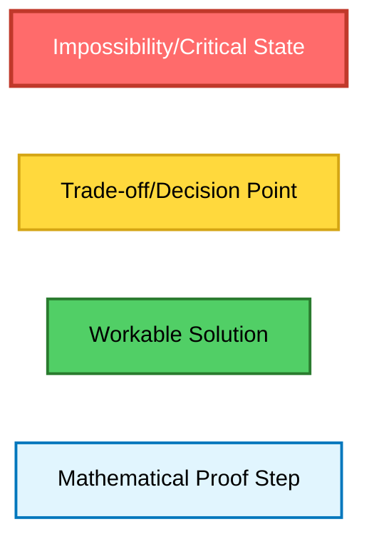
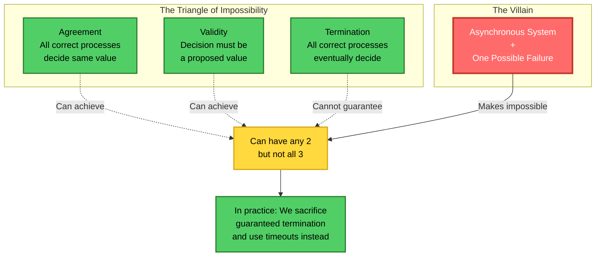
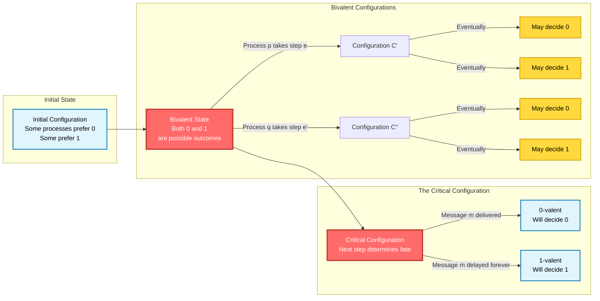
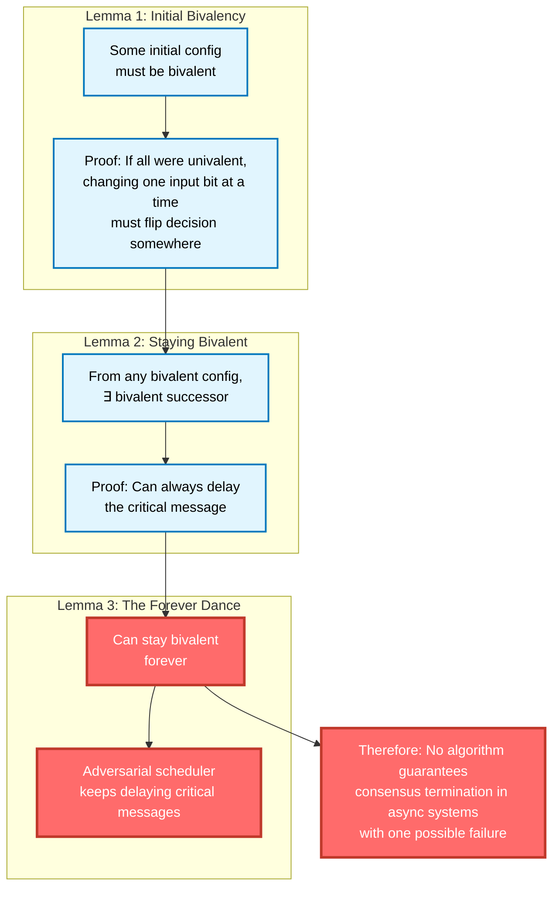
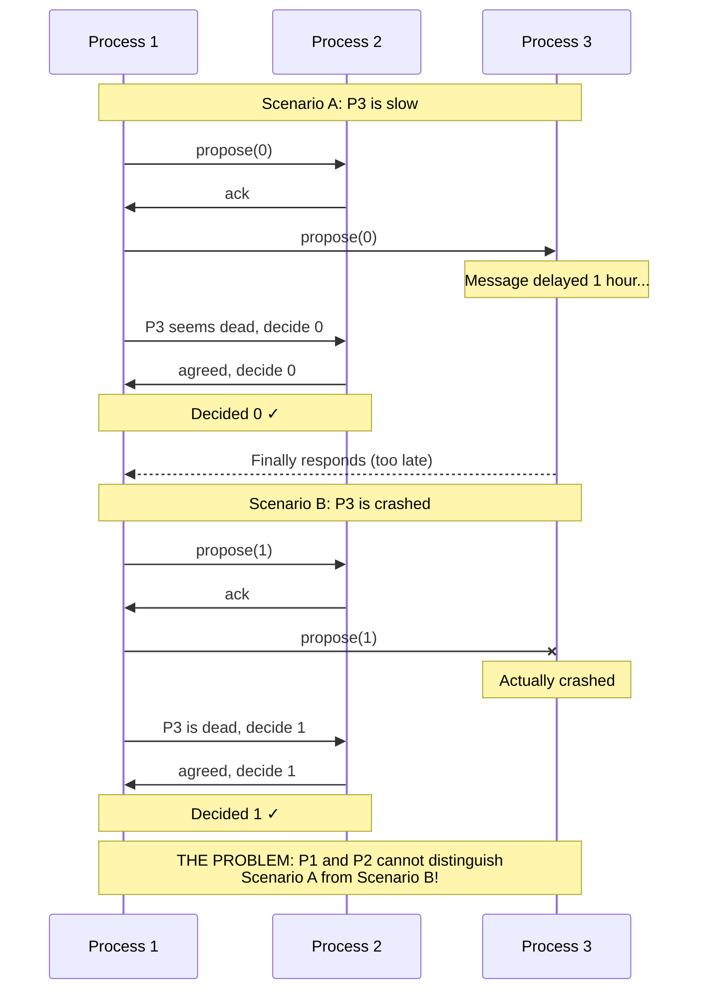
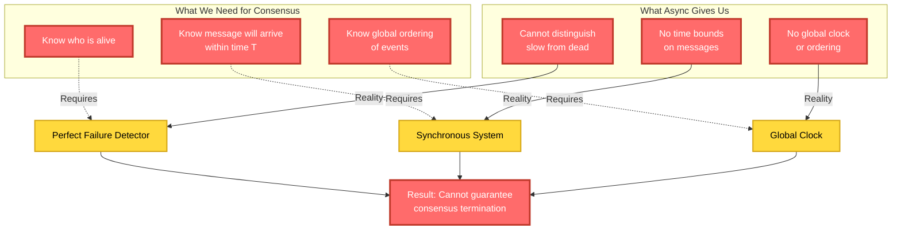
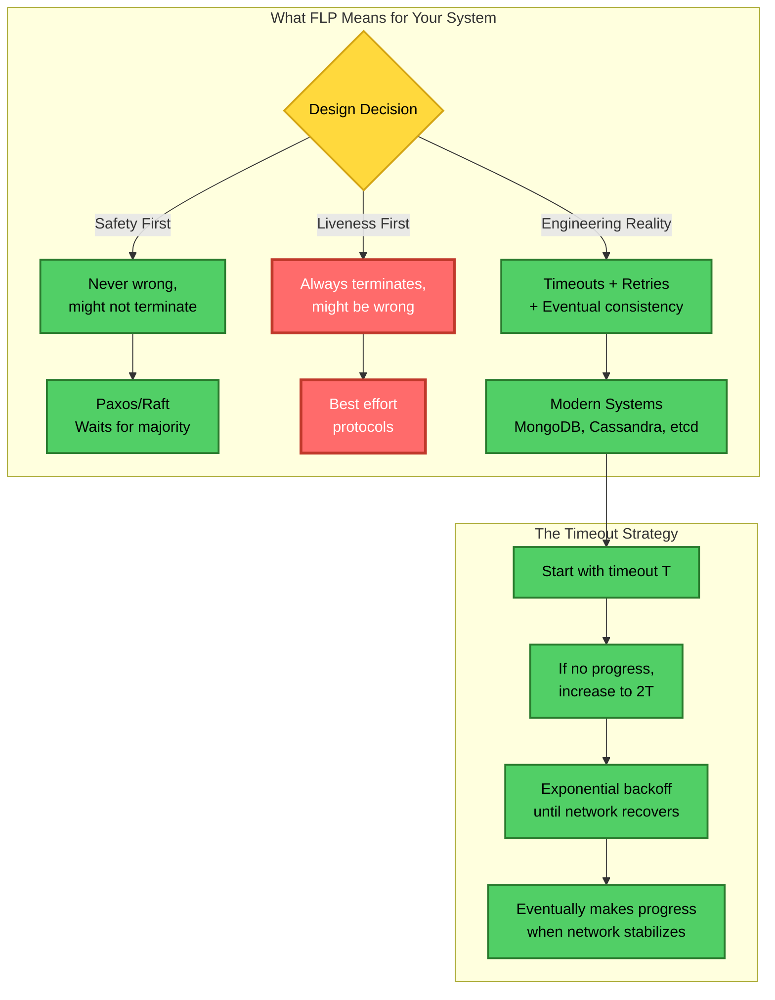
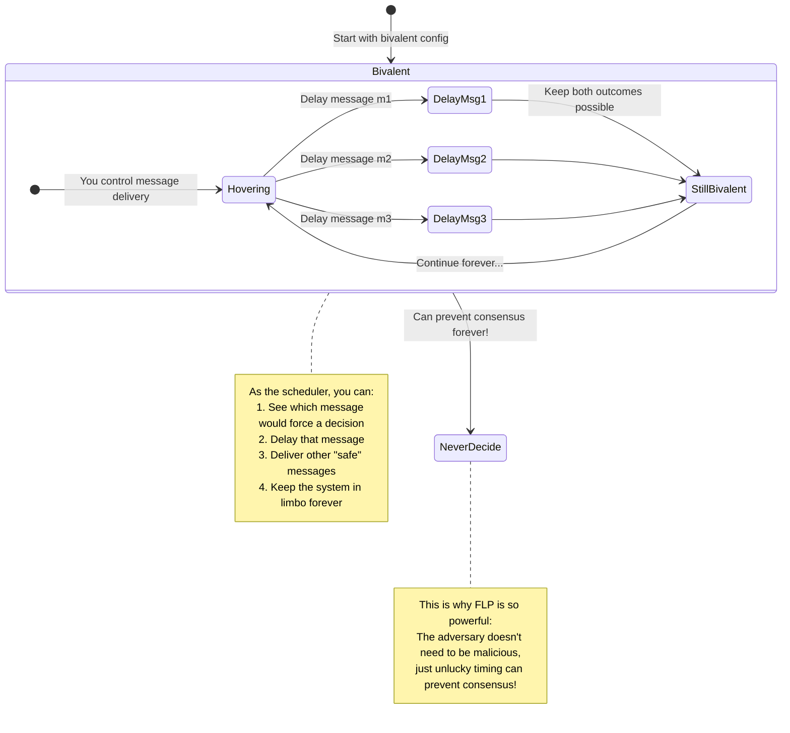
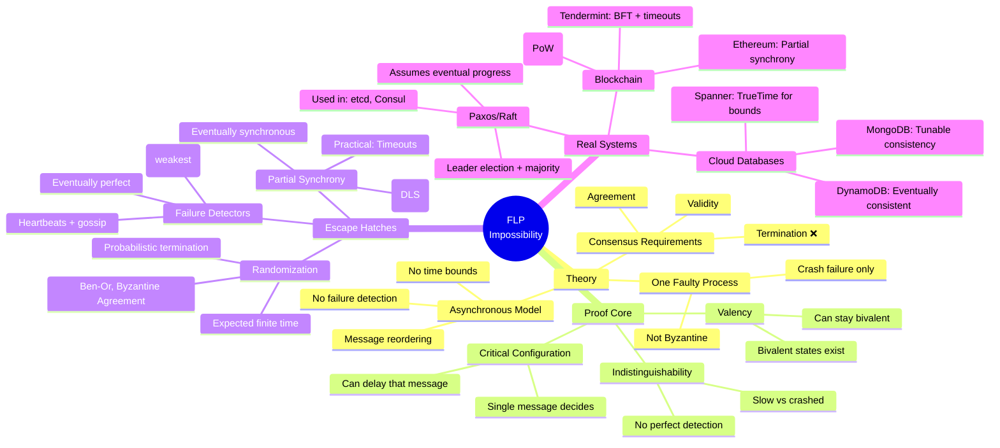

# FLP Impossibility: The Complete Deep Dive

## Visual Language Legend


---

## Layer 1: The Intuitive Understanding

### The Core Dilemma - Why We Can't Have It All


---

## Layer 2: The Proof Mechanics - Valency & Critical Configurations

### The Valency Argument (The Heart of FLP)


### The Lemma Chain - Why Bivalent States Always Exist


---

## Layer 3: The Indistinguishability Problem

### Why Async Makes Everything Impossible


### The Knowledge-Time Impossibility Space


---

## Layer 4: The Escape Hatches - How Real Systems Work

### The Solution Spectrum
```mermaid
flowchart LR
    subgraph "Pure Impossibility"
        FLP[FLP Result<br/>No deterministic consensus<br/>in pure async + 1 fault]:::impossible
    end
    
    subgraph "Partial Solutions"
        subgraph "Add Synchrony"
            PS[Partial Synchrony<br/>Eventually bounds hold]:::workaround
            DLS[Dwork-Lynch-Stockmeyer<br/>Δ unknown but finite]:::workaround
            PS --> Paxos[Paxos/Raft<br/>Leader-based]:::workaround
            DLS --> ViewStamped[ViewStamped<br/>Replication]:::workaround
        end
        
        subgraph "Add Oracles"
            FD[Failure Detectors]:::workaround
            Omega[Ω - Eventual Leader]:::workaround
            Diamond[◊S - Eventually Strong]:::workaround
            FD --> Omega --> Consensus1[Weakest for<br/>consensus]:::workaround
            FD --> Diamond --> Consensus2[Stronger<br/>guarantees]:::workaround
        end
        
        subgraph "Add Randomness"
            Rand[Randomization]:::workaround
            BenOr[Ben-Or Protocol]:::workaround
            Expected[Expected<br/>O(2^n) rounds]:::tradeoff
            Rand --> BenOr --> Expected
        end
    end
    
    FLP -->|Relax assumptions| PS
    FLP -->|Add oracle| FD
    FLP -->|Probabilistic| Rand
    
    classDef impossible fill:#ff6b6b,color:#fff,stroke:#c0392b,stroke-width:3px;
    classDef tradeoff fill:#ffd93d,color:#000,stroke:#d4a514,stroke-width:2px;
    classDef workaround fill:#51cf66,color:#000,stroke:#2a7b2e,stroke-width:2px;
```

### Practical Implementation Patterns


---

## Layer 5: The Teaching Moment - Interactive Mental Model

### The FLP Game: You Be the Adversarial Scheduler


---

## The Complete Picture: From Theory to Practice



---

## Teaching Guide

### Progressive Reveal Strategy
1. **Start with Layer 1**: Show the triangle - intuitive understanding
2. **Add Layer 2**: Reveal valency - the mathematical insight  
3. **Show Layer 3**: Demonstrate indistinguishability - why it's fundamental
4. **Introduce Layer 4**: Present escape hatches - how we actually build systems
5. **Interactive Layer 5**: Let them play adversarial scheduler

### Key Teaching Points
- **The adversary is time itself** - not a malicious actor
- **Every real system violates pure async** - and that's OK
- **FLP liberates design** - stop trying the impossible
- **Timeouts are not a hack** - they're the theoretical escape hatch

### Quick Wins for Understanding
- "You can't distinguish a slow friend from a dead friend on the internet"
- "FLP says you must pick: always correct OR always finishes"  
- "Real systems pick: usually finishes, never wrong"

---

## Real-World Implications

### What This Means for Your Systems

#### 1. **Consensus Protocols**
Every production consensus protocol makes compromises:
- **Paxos/Raft**: Assume eventual message delivery
- **PBFT**: Assumes partial synchrony
- **Tendermint**: Uses timeouts that increase
- **Blockchain**: Probabilistic finality (never 100% certain)

#### 2. **Database Consistency**
- **Strong consistency**: May block during partitions (choosing safety)
- **Eventual consistency**: Always available (choosing liveness)
- **Tunable consistency**: Let users choose their poison

#### 3. **Distributed Transactions**
- **2PC**: Can block forever if coordinator fails
- **3PC**: Still can't guarantee termination in async
- **Saga**: Gives up atomicity for availability

### The FLP Liberation

Understanding FLP is liberating because:
1. **Stop trying to solve the impossible** - You literally can't
2. **Make explicit trade-offs** - Safety vs Liveness
3. **Use timeouts without guilt** - They're theoretically justified
4. **Embrace eventual consistency** - Sometimes it's the only option

### Common Misconceptions

❌ **"FLP means distributed systems are impossible"**
✅ FLP only rules out one specific guarantee combination

❌ **"FLP doesn't apply to real systems"**  
✅ Every real system must work around FLP

❌ **"Timeouts solve FLP"**
✅ Timeouts sacrifice guarantee for practicality

❌ **"Byzantine faults are needed for impossibility"**
✅ FLP needs only one crash failure

---

## Historical Context

### The Paper That Changed Everything

**"Impossibility of Distributed Consensus with One Faulty Process"**
- Authors: Fischer, Lynch, Paterson
- Published: 1985
- Impact: Turing Award, 8000+ citations

### Before FLP (Pre-1985)
- People thought async consensus was just hard
- Many "solutions" had subtle bugs
- No fundamental understanding of limits

### After FLP (Post-1985)
- Clear impossibility boundary established
- Explosion of research on circumventing FLP
- Birth of modern consensus protocols
- Foundation for CAP theorem (2000)

---

## Summary: The Essential Takeaways

### The One-Liner
**"In an asynchronous distributed system where even one process might fail, you cannot guarantee that all correct processes will reach consensus."**

### The Three Key Insights
1. **Bivalent configurations exist and persist** - The system can always hover between decisions
2. **Asynchrony = No failure detection** - Can't tell slow from dead
3. **One failure is enough** - Don't need Byzantine behavior

### The Practical Wisdom
- **Use Paxos/Raft** for consensus when you need it
- **Use timeouts** but understand they're a compromise  
- **Choose your consistency model** based on requirements
- **Design for eventual progress**, not guaranteed termination

### The Meta-Lesson
**FLP teaches us that distributed systems theory isn't about finding perfect solutions - it's about understanding fundamental trade-offs and designing systems that work well enough, often enough, for real-world needs.**