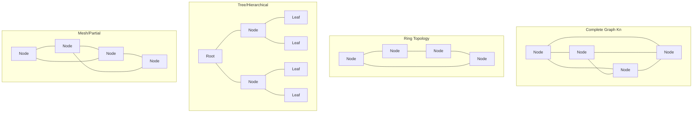

# Graph Theory in Distributed Systems

> **Core Insight**: Distributed systems ARE graphs—nodes connected by edges. Graph theory provides the mathematical foundation for analyzing and optimizing these systems.

## Fundamental Graph Models

### System as Graph G = (V, E)

```
V = {nodes/processes/servers}
E = {network links/communication channels}

Properties:
- |V| = n (number of nodes)
- |E| = m (number of edges)
- Diameter D = max shortest path
- Degree δ(v) = connections per node
```

### Graph Types in Distributed Systems



## Spanning Trees for Broadcast

### Minimum Spanning Tree (MST)

**Problem**: Broadcast message to all nodes with minimum cost

```python
def prim_mst_distributed():
    """
    Distributed Prim's algorithm for MST construction
    Time: O(n²) messages
    """
    class Node:
        def __init__(self, id):
            self.id = id
            self.in_mst = False
            self.parent = None
            self.min_weight_edge = float('inf')
        
        def find_min_edge(self, neighbors):
            # Each node finds minimum weight edge to MST
            for neighbor, weight in neighbors:
                if neighbor.in_mst and weight < self.min_weight_edge:
                    self.min_weight_edge = weight
                    self.parent = neighbor
        
        def join_mst(self):
            self.in_mst = True
            # Broadcast to neighbors
            broadcast("IN_MST", self.id)
```

**Applications**:
- Leader election
- Coordinated snapshots
- Configuration updates
- Multicast routing

### Breadth-First Spanning Tree

```python
def bfs_spanning_tree(root):
    """
    Construct BFS tree for shortest-path broadcast
    Messages: O(m) where m = edges
    Time: O(D) where D = diameter
    """
    level = {}
    parent = {}
    
    # Root starts
    level[root] = 0
    parent[root] = None
    
    # Wave algorithm
    for current_level in range(diameter):
        for node in nodes_at_level(current_level):
            for neighbor in node.neighbors:
                if neighbor not in level:
                    level[neighbor] = current_level + 1
                    parent[neighbor] = node
                    send(neighbor, "PARENT", node)
    
    return parent  # Spanning tree
```

**Use Cases**:
- Dijkstra-Scholten termination detection
- Consistent global snapshots
- Barrier synchronization

## Graph Coloring for Resource Allocation

### Vertex Coloring Problem

**Goal**: Assign resources (colors) so no neighbors share same resource

```python
def distributed_graph_coloring(max_degree):
    """
    Distributed (Δ+1)-coloring where Δ = max degree
    Luby's algorithm - randomized, expected O(log n) rounds
    """
    class Node:
        def __init__(self, id):
            self.id = id
            self.color = None
            self.neighbors = []
        
        def select_color(self):
            while self.color is None:
                # Randomly propose color
                proposed = random.randint(1, max_degree + 1)
                
                # Check conflicts with neighbors
                conflicts = False
                for neighbor in self.neighbors:
                    if neighbor.color == proposed:
                        conflicts = True
                        break
                
                if not conflicts:
                    # Try to claim color
                    if self.try_claim(proposed):
                        self.color = proposed
```

**Applications**:
1. **Frequency Assignment**: Wireless networks
2. **Time Slot Allocation**: TDMA scheduling
3. **Register Allocation**: Distributed compilation
4. **Mutual Exclusion**: Process scheduling

### Edge Coloring for Scheduling

```python
def edge_coloring_schedule():
    """
    Schedule communications to avoid conflicts
    Vizing's theorem: Needs at most Δ+1 colors
    """
    # Each edge represents a communication
    # Colors represent time slots
    # No two edges sharing vertex can have same color
    
    for edge in edges:
        available_colors = set(range(1, max_degree + 2))
        for incident_edge in edge.incident_edges():
            if incident_edge.color:
                available_colors.discard(incident_edge.color)
        edge.color = min(available_colors)
```

## Minimum Cut for Partition Tolerance

### Finding Network Vulnerabilities

```python
def karger_min_cut():
    """
    Randomized min-cut algorithm
    Finds weakest points in network topology
    """
    graph = original_graph.copy()
    
    while graph.node_count() > 2:
        # Random edge contraction
        edge = random.choice(graph.edges())
        graph.contract_edge(edge)
    
    return graph.edges_between_remaining_nodes()

def analyze_partition_tolerance(graph):
    """
    Determine k-connectivity of network
    """
    min_cut_size = float('inf')
    
    # Run Karger's algorithm multiple times
    for _ in range(n * log(n)):
        cut_size = len(karger_min_cut())
        min_cut_size = min(min_cut_size, cut_size)
    
    return {
        'k_edge_connected': min_cut_size,
        'partition_tolerance': min_cut_size - 1,
        'redundancy_needed': max(0, target_k - min_cut_size)
    }
```

**Critical Insights**:
- k-connected → survives k-1 failures
- Min-cut identifies critical links
- Augmentation strategies for resilience

## Clique Detection for Consensus Groups

### Finding Maximum Cliques

```python
def bron_kerbosch_cliques(graph):
    """
    Find all maximal cliques in network
    Cliques = fully connected subgroups
    Perfect for consensus/quorum groups
    """
    def bron_kerbosch(R, P, X):
        if not P and not X:
            yield R  # R is maximal clique
        
        for v in list(P):
            neighbors = graph.neighbors(v)
            bron_kerbosch(
                R | {v},
                P & neighbors,
                X & neighbors
            )
            P.remove(v)
            X.add(v)
    
    return bron_kerbosch(set(), set(graph.nodes), set())

def optimal_quorum_groups(graph, min_size=3):
    """
    Find optimal quorum groups as cliques
    """
    cliques = list(bron_kerbosch_cliques(graph))
    
    # Filter by minimum size for consensus
    quorum_groups = [c for c in cliques if len(c) >= min_size]
    
    # Overlap for Byzantine tolerance
    return assign_overlapping_quorums(quorum_groups)
```

**Applications**:
- Quorum selection in Paxos/Raft
- Byzantine fault-tolerant groups
- Cache coherence protocols
- Gossip dissemination groups

## Shortest Path Algorithms

### Distributed Bellman-Ford

```python
def distributed_bellman_ford(source):
    """
    Find shortest paths in distributed system
    Handles negative weights (latencies)
    Converges in O(n) rounds
    """
    distance = {node: float('inf') for node in nodes}
    distance[source] = 0
    
    for round in range(n - 1):
        for node in nodes:
            for neighbor, weight in node.edges:
                # Relaxation step
                new_dist = distance[node] + weight
                if new_dist < distance[neighbor]:
                    distance[neighbor] = new_dist
                    send(neighbor, "UPDATE", new_dist)
    
    # Detect negative cycles
    for node in nodes:
        for neighbor, weight in node.edges:
            if distance[node] + weight < distance[neighbor]:
                raise Exception("Negative cycle detected")
    
    return distance
```

**Use Cases**:
- Routing protocols (RIP)
- Load balancing paths
- Latency optimization
- Failure detection

## Maximum Flow for Capacity Planning

### Ford-Fulkerson in Distributed Systems

```python
def distributed_max_flow(source, sink):
    """
    Compute maximum throughput between nodes
    """
    class Edge:
        def __init__(self, capacity):
            self.capacity = capacity
            self.flow = 0
            self.residual = capacity
    
    def find_augmenting_path():
        # Distributed BFS for path
        visited = set()
        queue = [source]
        parent = {}
        
        while queue:
            node = queue.pop(0)
            if node == sink:
                return reconstruct_path(parent)
            
            for neighbor, edge in node.edges:
                if neighbor not in visited and edge.residual > 0:
                    visited.add(neighbor)
                    parent[neighbor] = (node, edge)
                    queue.append(neighbor)
        
        return None
    
    max_flow = 0
    while path := find_augmenting_path():
        # Find bottleneck capacity
        bottleneck = min(edge.residual for _, edge in path)
        
        # Update flows
        for node, edge in path:
            edge.flow += bottleneck
            edge.residual -= bottleneck
            # Update reverse edge
            reverse_edge.residual += bottleneck
        
        max_flow += bottleneck
    
    return max_flow
```

**Applications**:
- Network capacity planning
- Data replication strategies
- Request routing optimization
- Bandwidth allocation

## Dominating Sets for Monitoring

### Minimum Dominating Set

```python
def greedy_dominating_set(graph):
    """
    Find minimum set of nodes to monitor entire network
    Every node is either in set or adjacent to set
    """
    dominating_set = set()
    uncovered = set(graph.nodes)
    
    while uncovered:
        # Greedy: Pick node covering most uncovered
        best_node = None
        best_coverage = 0
        
        for node in graph.nodes:
            if node not in dominating_set:
                coverage = len(uncovered & 
                             ({node} | set(graph.neighbors(node))))
                if coverage > best_coverage:
                    best_coverage = coverage
                    best_node = node
        
        dominating_set.add(best_node)
        uncovered -= ({best_node} | set(graph.neighbors(best_node)))
    
    return dominating_set
```

**Use Cases**:
- Monitoring node placement
- Leader election in clusters
- Broadcast optimization
- Fault detection coverage

## Matching for Load Distribution

### Maximum Bipartite Matching

```python
def hungarian_algorithm(workers, tasks, costs):
    """
    Optimal assignment of tasks to workers
    Minimizes total cost/latency
    """
    n = len(workers)
    m = len(tasks)
    
    # Cost matrix
    cost_matrix = [[costs[i][j] for j in range(m)] 
                   for i in range(n)]
    
    # Hungarian algorithm steps
    # 1. Row reduction
    for i in range(n):
        min_val = min(cost_matrix[i])
        cost_matrix[i] = [c - min_val for c in cost_matrix[i]]
    
    # 2. Column reduction
    for j in range(m):
        min_val = min(cost_matrix[i][j] for i in range(n))
        for i in range(n):
            cost_matrix[i][j] -= min_val
    
    # 3. Find optimal assignment
    assignment = find_zero_assignment(cost_matrix)
    
    return assignment
```

**Applications**:
- Task scheduling
- Resource allocation
- Load balancing
- Service placement

## Planar Graphs for Geographic Systems

### Properties of Planar Networks

```python
def is_planar(graph):
    """
    Check if network can be embedded in plane without crossing
    Kuratowski's theorem: No K5 or K3,3 subgraph
    """
    # Euler's formula: v - e + f = 2
    if len(graph.edges) > 3 * len(graph.nodes) - 6:
        return False  # Too many edges
    
    # Check for forbidden subgraphs
    return not (has_k5_subgraph(graph) or has_k33_subgraph(graph))

def planar_separator(graph):
    """
    Lipton-Tarjan: Any planar graph has O(√n) separator
    Divide into balanced parts
    """
    n = len(graph.nodes)
    separator_size = int(math.sqrt(8 * n))
    
    # Find separator vertices
    separator = find_separator_vertices(graph, separator_size)
    
    # Creates balanced partition
    return separator
```

**Use Cases**:
- Geographic data centers
- Wireless sensor networks
- VLSI circuit design
- Road network systems

## Expander Graphs for Resilience

### High-Connectivity Properties

```python
def construct_expander_graph(n, d):
    """
    Build d-regular expander graph
    High connectivity, low diameter
    Optimal for resilient networks
    """
    # Ramanujan graph construction
    graph = Graph()
    
    # Add nodes
    for i in range(n):
        graph.add_node(i)
    
    # Random d-regular construction
    for node in graph.nodes:
        while len(graph.neighbors(node)) < d:
            target = random.choice(graph.nodes)
            if target != node and len(graph.neighbors(target)) < d:
                graph.add_edge(node, target)
    
    # Verify expansion property
    expansion = compute_expansion(graph)
    assert expansion >= d / 4  # Cheeger bound
    
    return graph
```

**Properties**:
- Diameter: O(log n)
- Fault tolerance: High
- Message complexity: Low
- Load balancing: Excellent

## Graph Metrics for System Analysis

### Key Metrics

```python
def analyze_network_graph(graph):
    """
    Comprehensive graph metrics for distributed system
    """
    return {
        # Connectivity
        'is_connected': is_connected(graph),
        'k_connectivity': vertex_connectivity(graph),
        'edge_connectivity': edge_connectivity(graph),
        
        # Distance metrics
        'diameter': diameter(graph),
        'average_path_length': average_shortest_path(graph),
        'radius': radius(graph),
        
        # Centrality
        'betweenness': betweenness_centrality(graph),
        'closeness': closeness_centrality(graph),
        'eigenvector': eigenvector_centrality(graph),
        
        # Clustering
        'clustering_coefficient': clustering_coefficient(graph),
        'triangles': count_triangles(graph),
        
        # Robustness
        'algebraic_connectivity': fiedler_value(graph),
        'cheeger_constant': cheeger_constant(graph),
        
        # Efficiency
        'global_efficiency': global_efficiency(graph),
        'local_efficiency': local_efficiency(graph)
    }
```

## Integration with 7 Laws

### Graph Theory Applications to Each Law

| Law | Graph Theory Application |
|-----|-------------------------|
| **Law 1 (Correlated Failure)** | Min-cut analysis for failure correlation |
| **Law 2 (Async Reality)** | Shortest path with variable delays |
| **Law 3 (Emergent Chaos)** | Small-world & scale-free emergence |
| **Law 4 (Multi-dimensional)** | Multi-objective graph optimization |
| **Law 5 (Distributed Knowledge)** | Connected dominating sets for knowledge propagation |
| **Law 6 (Cognitive Load)** | Graph complexity metrics |
| **Law 7 (Economic Reality)** | Min-cost flow optimization |

## Practical Implementation Guidelines

### Choosing Graph Algorithms

```yaml
For Broadcasting:
  use: "Spanning tree algorithms"
  when: "Need to reach all nodes once"
  complexity: "O(n) messages"

For Resource Allocation:
  use: "Graph coloring"
  when: "Avoiding conflicts between neighbors"
  complexity: "O(Δ) colors needed"

For Fault Tolerance:
  use: "k-connectivity analysis"
  when: "Designing resilient topologies"
  complexity: "O(n³) computation"

For Load Balancing:
  use: "Matching algorithms"
  when: "Assigning tasks optimally"
  complexity: "O(n³) Hungarian algorithm"

For Monitoring:
  use: "Dominating sets"
  when: "Coverage with minimum nodes"
  complexity: "NP-hard, use approximation"
```

## Real-World Applications

### Case Study: Cassandra's Token Ring

```python
# Consistent hashing as circular graph
nodes_on_ring = sorted(nodes, key=lambda n: n.token)
for i, node in enumerate(nodes_on_ring):
    next_node = nodes_on_ring[(i + 1) % len(nodes_on_ring)]
    node.successor = next_node
    next_node.predecessor = node
```

### Case Study: Kubernetes Scheduling

```python
# Node selection as bipartite matching
pods = get_pending_pods()
nodes = get_available_nodes()
affinity_scores = compute_affinity_matrix(pods, nodes)
optimal_placement = hungarian_algorithm(pods, nodes, -affinity_scores)
```

## Key Takeaways

1. **Distributed systems ARE graphs** - Model them as such
2. **Classic algorithms apply** - With distributed twists
3. **Topology matters** - Choose wisely for your use case
4. **NP-hard problems abound** - Use approximations
5. **Metrics guide design** - Measure graph properties

## References

1. Lynch. "Distributed Algorithms" - Graph algorithms focus
2. Peleg. "Distributed Computing: A Locality-Sensitive Approach"
3. Santoro. "Design and Analysis of Distributed Algorithms"
4. Attiya & Welch. "Distributed Computing: Fundamentals"