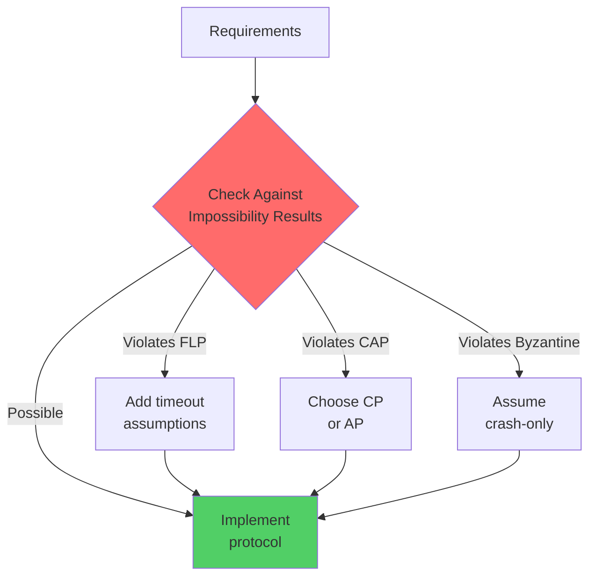

# Impossibility Results in Distributed Systems

> **Core Insight**: These mathematical proofs define the absolute boundaries of what distributed systems can achieve, regardless of engineering brilliance or computational power.

## The FLP Impossibility Result

### Formal Statement

**Fischer, Lynch, and Paterson (1985)**: In an asynchronous distributed system with even one faulty process, no consensus protocol can guarantee termination.

### Mathematical Proof Outline

```
Given:
- Asynchronous system (no timing assumptions)
- At least 3 processes
- At most 1 crash failure
- Reliable message delivery (eventually)

Proof by contradiction:
1. Assume protocol P solves consensus with termination guarantee
2. Define valency of configurations:
   - 0-valent: Will decide 0
   - 1-valent: Will decide 1
   - Bivalent: Can still decide either

3. Initial configuration must be bivalent (by input independence)
4. From any bivalent configuration:
   - There exists a critical step that determines outcome
   - But asynchrony allows delaying this message
   - Process can crash before/after critical step
   - Creates indistinguishable scenarios → contradiction

Therefore: No protocol can guarantee both safety and liveness
```

### Practical Implications

**What This Means for Your Systems**:

1. **You Must Choose**:
   - Safety (never wrong) + No guarantee of termination
   - Termination guarantee + Risk of incorrectness
   - Most systems choose safety

2. **Workarounds in Practice**:
   ```yaml
   Approach 1 - Timeouts (Partial Synchrony):
     assumption: "Bounded message delay eventually"
     examples: [Paxos, Raft, PBFT]
     trade-off: "Can get stuck during network issues"
   
   Approach 2 - Randomization:
     assumption: "Probabilistic termination"
     examples: [Ben-Or's algorithm]
     trade-off: "Expected finite time, not guaranteed"
   
   Approach 3 - Failure Detectors:
     assumption: "Eventually perfect detection"
     examples: [Chandra-Toueg consensus]
     trade-off: "Requires additional assumptions"
   ```

### Connection to Law 2 (Asynchronous Reality)

FLP is the mathematical formalization of Law 2:
- **Law 2**: "Perfect synchronization is impossible"
- **FLP**: "Therefore, guaranteed consensus is impossible"

## The CAP Theorem

### Formal Definition

**Brewer's Conjecture (2000), Proved by Gilbert & Lynch (2002)**:

```
For any distributed data store:
∀ time t, can have at most 2 of:
- Consistency: All nodes see same data
- Availability: All requests get response
- Partition Tolerance: Survives network splits

Formally:
C ∧ A ∧ P = ⊥ (impossible)
```

### The Proof

```
1. Assume system has C, A, and P
2. Create network partition: {G1} | {G2}
3. Client writes v1 to G1
4. By Availability: G1 must accept
5. Client reads from G2
6. By Availability: G2 must respond
7. By Partition: G1 and G2 cannot communicate
8. By Consistency: G2 must return v1
9. Contradiction: G2 cannot know about v1
```

### CAP as Corollary of FLP

```
FLP → CAP derivation:
1. FLP: Cannot guarantee consensus termination
2. Consensus needed for consistency during partition
3. If require availability, must respond without consensus
4. Therefore: Cannot have C + A during P
```

## Two Generals Problem

### Statement

Two generals must coordinate attack. Messages may be lost. Prove: No protocol guarantees coordination.

### Proof by Induction

```
Base case: Single message
- G1 sends "attack at dawn"
- May be lost → G1 doesn't know if G2 received
- G1 cannot safely attack

Inductive step: n messages
- Assume n messages insufficient
- Add acknowledgment (n+1)th message
- This ACK might be lost
- Sender of ACK doesn't know if received
- Back to original problem
- Therefore n+1 messages also insufficient

Conclusion: ∀n ∈ ℕ, n messages insufficient
```

### Practical Implication

**What This Means**: TCP's 3-way handshake doesn't solve coordination—it provides "good enough" probability.

## Byzantine Generals Problem

### Optimal Resilience Bound

**Lamport, Shostak, Pease (1982)**: Need N ≥ 3f + 1 for f Byzantine faults

### Proof Sketch

```
Why N < 3f + 1 fails:

Consider N = 3, f = 1:
- Processes: {P1, P2, P3}
- P1 is Byzantine (malicious)

Scenario 1: P1 tells P2 "attack", tells P3 "retreat"
- P2 sees: {P1: attack, P3: retreat} → undecidable
- P3 sees: {P1: retreat, P2: attack} → undecidable

Cannot distinguish:
- P1 Byzantine vs P2 Byzantine vs P3 Byzantine
- Need 2f + 1 honest majority for decision
- Therefore N ≥ 3f + 1
```

### Connection to Law 5 (Distributed Knowledge)

Byzantine Agreement formalizes the limit of distributed knowledge:
- Cannot achieve common knowledge with traitors
- Best possible: eventual consistency among honest nodes

## Consensus Number Hierarchy

### Herlihy's Impossibility (1991)

Objects have consensus numbers—max processes for wait-free consensus:

```
Consensus Number | Objects
-----------------|------------------
1                | Read/Write registers
2                | Test-and-Set, Fetch-and-Add
∞                | Compare-and-Swap, LL/SC
```

### Implication

**You Cannot Build**: Wait-free 3-process consensus using only:
- Reads and writes
- Test-and-set operations
- Fetch-and-add operations

**You Need**: Compare-and-swap or equivalent

## CALM Theorem

### Consistency As Logical Monotonicity

**Hellerstein (2010)**: A computation is eventually consistent iff it's monotonic in distributed logic.

```
Monotonic = order-independent:
- Set union: {a,b} ∪ {c} = {a,b,c} ✓
- Max/Min: max(5, 3, 7) = 7 ✓
- Counter increment: non-monotonic ✗

Theorem: Monotonic ⟺ Coordination-free
        Non-monotonic ⟺ Requires consensus
```

### Practical Application

```python
# Monotonic - No coordination needed
class CRDT_Set:
    def add(self, item):
        self.items.add((item, unique_id()))  # Always grows
    
    def merge(self, other):
        self.items |= other.items  # Union is monotonic

# Non-monotonic - Requires coordination
class Counter:
    def increment(self):
        self.value += 1  # Requires ordering → consensus
```

## Impossibility of Distributed Garbage Collection

### Statement

Cannot guarantee both safety and completeness in distributed GC with failures.

### Trade-off Space

```
Safety: Never collect live objects
Completeness: Eventually collect all garbage

Choose approach:
1. Conservative (Java RMI): May leak but never unsafe
2. Aggressive (Erlang): May collect early but complete
3. Hybrid: Epochs + reference listing
```

## Bounds on Message Complexity

### Lower Bounds for Consensus

```
Problem              | Message Complexity
--------------------|-------------------
Consensus           | Ω(n²) worst case
Byzantine Agreement | Ω(n³) with signatures
Leader Election     | Ω(n log n) average
Mutual Exclusion    | Ω(n) per operation
```

### What This Means

**Cannot achieve**: Sublinear consensus in worst case
**Must accept**: Quadratic message cost or weaker guarantees

## Using Impossibility Results in Design

### Decision Framework



### Practical Relaxations

1. **FLP → Partial Synchrony**
   ```yaml
   Original: "Consensus with guaranteed termination"
   Relaxed: "Consensus that terminates when network stable"
   Implementation: "Raft with exponential backoff"
   ```

2. **CAP → PACELC**
   ```yaml
   Original: "Always consistent and available"
   Relaxed: "Choose based on partition state"
   Implementation: "MongoDB with read preferences"
   ```

3. **Byzantine → Crash-Stop**
   ```yaml
   Original: "Tolerate malicious nodes"
   Relaxed: "Assume nodes fail by stopping"
   Implementation: "Standard Paxos/Raft"
   ```

## Integration with 7 Laws

### Law Connections

| Impossibility Result | Related Law | Connection |
|---------------------|-------------|------------|
| FLP | Law 2 (Async Reality) | Formalizes async limitations |
| CAP | Law 4 (Multi-dimensional) | Forces optimization trade-offs |
| Two Generals | Law 5 (Distributed Knowledge) | Shows knowledge limits |
| Byzantine | Law 1 (Correlated Failure) | Byzantine creates correlation |
| CALM | Law 3 (Emergent Chaos) | Monotonic = predictable |

## Key Takeaways

1. **Impossibility results are liberating**: They tell you when to stop trying
2. **Every distributed system works around these limits**: Not solves, works around
3. **Understanding limits improves design**: Know what trade-offs you're making
4. **Practical systems add assumptions**: Timeouts, failure detectors, or randomization

## References

1. Fischer, Lynch, Paterson. "Impossibility of Distributed Consensus with One Faulty Process" (1985)
2. Gilbert, Lynch. "Brewer's Conjecture and the Feasibility of Consistent, Available, Partition-Tolerant Web Services" (2002)
3. Lamport, Shostak, Pease. "The Byzantine Generals Problem" (1982)
4. Herlihy. "Wait-Free Synchronization" (1991)
5. Hellerstein. "The CALM Theorem" (2010)