# The Unified Impossibility Landscape: Complete Framework

## Visual Language Legend
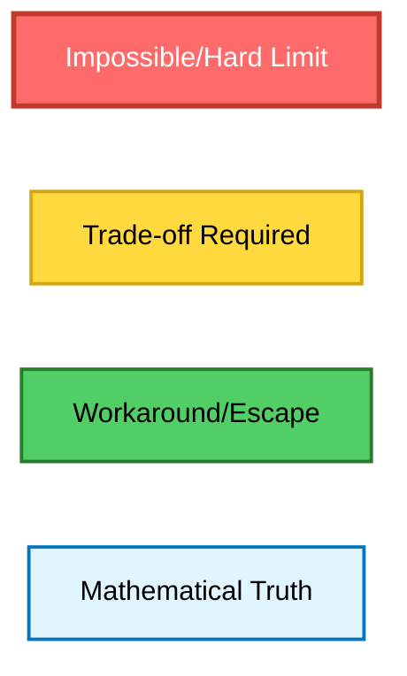

---

## Layer 1: The Core Problem - Why Distributed Systems are Fundamentally Hard

### The Root Cause of All Impossibilities
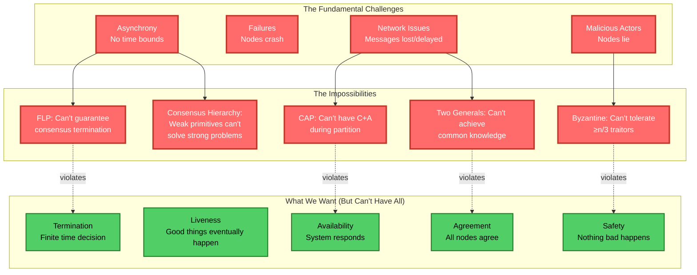

### The Unified View: It's All About Information
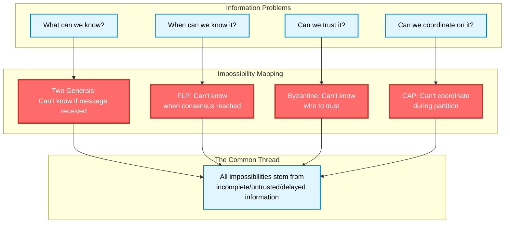

---

## Layer 2: The Complete Impossibility Map

### Dependencies and Relationships
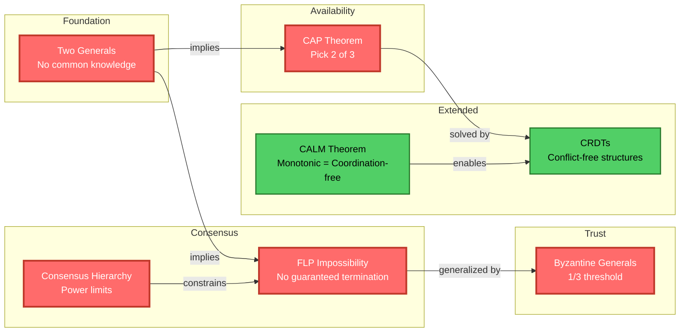

### The Impossibility Hierarchy
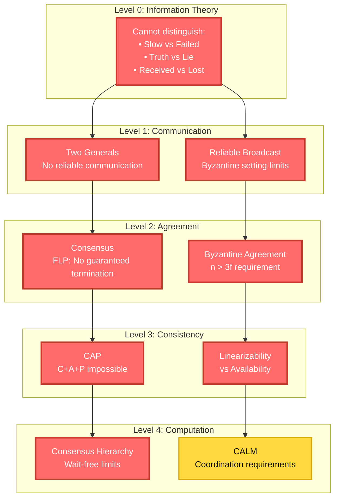

---

## Layer 3: The Trade-off Space

### Every Impossibility Forces a Choice
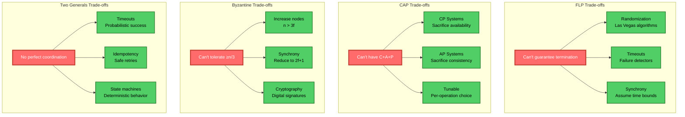

### The Escape Hatches
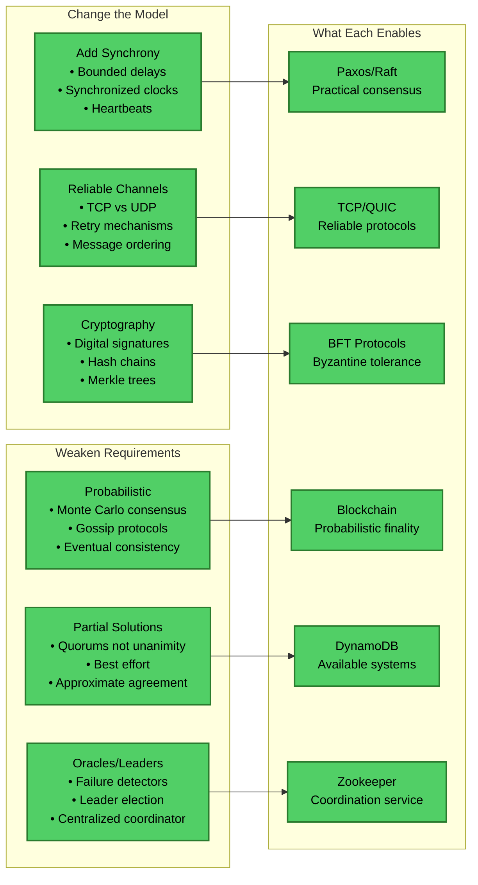

---

## Layer 4: How Real Systems Navigate Impossibilities

### System Design Patterns
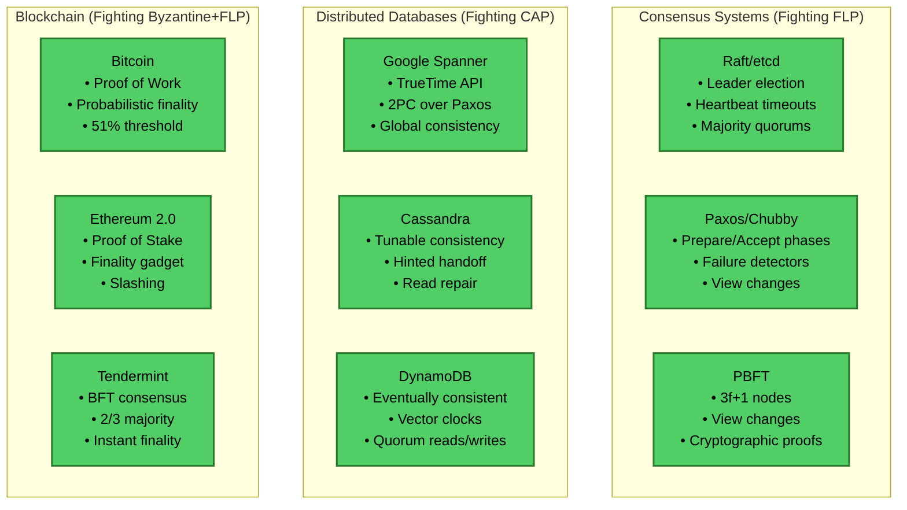

### The Engineering Reality
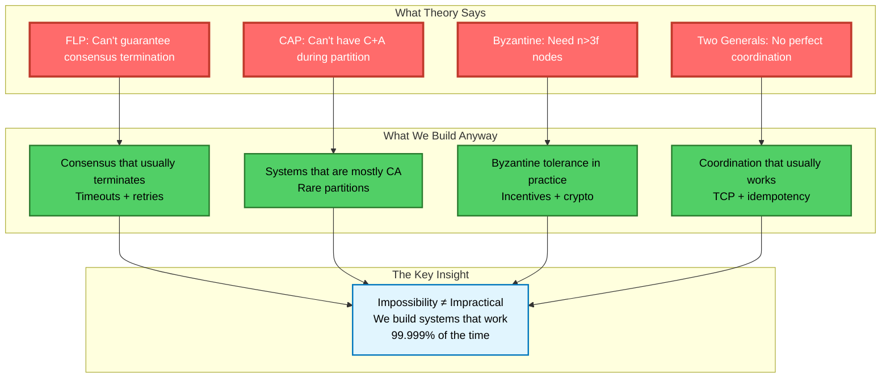

---

## Layer 5: The CALM Connection - When Coordination is Unnecessary

### CALM Theorem: Monotonicity = Coordination-Freedom
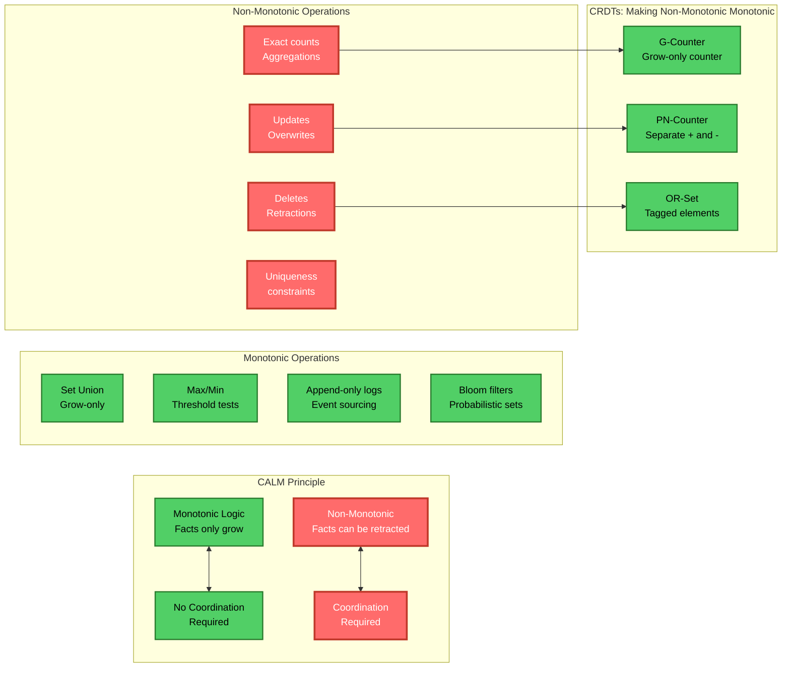

---

## Layer 6: Practical Decision Framework

### Choosing Your Battles
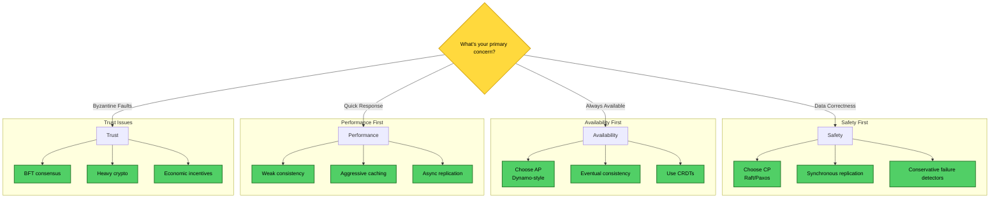

### The Cost of Fighting Impossibilities
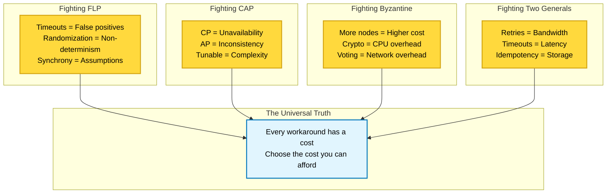

---

## Layer 7: When Impossibilities Combine

### The Compound Effect
```mermaid
flowchart TB
    subgraph "Single Impossibilities"
        I1[Network Partition]:::impossible
        I2[Byzantine Node]:::impossible
        I3[Async Network]:::impossible
    end
    
    subgraph "Combinations Explode"
        C1[Partition + Byzantine<br/>Can't detect traitor vs partition]:::impossible
        C2[Async + Byzantine<br/>Can't distinguish slow vs malicious]:::impossible
        C3[All Three<br/>Theoretical nightmare]:::impossible
    end
    
    subgraph "Real World Example"
        BGP[BGP Hijacking<br/>• Network partition (routes change)<br/>• Byzantine (false advertisements)<br/>• Async (propagation delays)<br/>= Internet breaks]:::impossible
    end
    
    I1 & I2 --> C1
    I2 & I3 --> C2
    I1 & I2 & I3 --> C3
    C3 --> BGP
    
    classDef impossible fill:#ff6b6b,color:#fff,stroke:#c0392b,stroke-width:3px;
```

### Cascading Failures
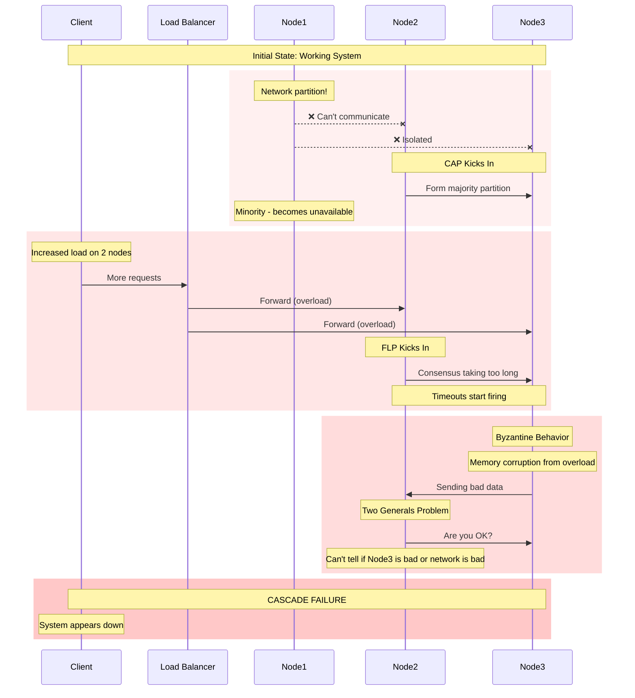

---

## Layer 8: The Meta-Patterns

### What All Impossibilities Share
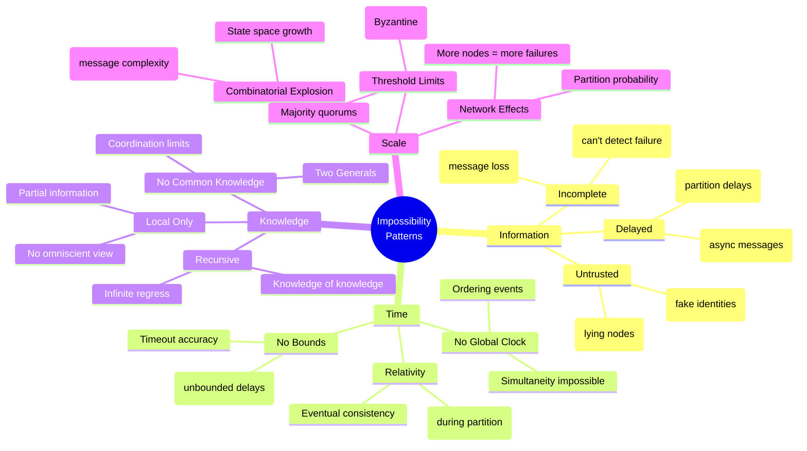

### The Universal Escape Patterns
```mermaid
graph TD
    subgraph "Escape Pattern 1: Probabilistic"
        P1[Accept imperfection]:::workaround
        P2[Measure probability]:::workaround
        P3[Make it "good enough"]:::workaround
        P1 --> P2 --> P3
    end
    
    subgraph "Escape Pattern 2: Assumptions"
        A1[Add constraints]:::workaround
        A2[Bound the problem]:::workaround
        A3[Change the model]:::workaround
        A1 --> A2 --> A3
    end
    
    subgraph "Escape Pattern 3: Hierarchy"
        H1[Use stronger primitives]:::workaround
        H2[Add coordination points]:::workaround
        H3[Centralize critical parts]:::workaround
        H1 --> H2 --> H3
    end
    
    subgraph "Escape Pattern 4: Economics"
        E1[Make bad behavior expensive]:::workaround
        E2[Incentivize good behavior]:::workaround
        E3[Accept bounded loss]:::workaround
        E1 --> E2 --> E3
    end
    
    classDef workaround fill:#51cf66,color:#000,stroke:#2a7b2e,stroke-width:2px;
```

---

## The Complete Mental Model

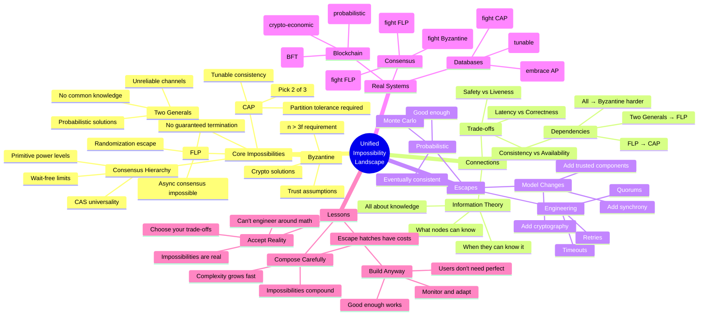

---

## Practical Wisdom: The Engineering Takeaways

### The Decision Framework
```
WHEN facing a distributed systems problem:

1. IDENTIFY which impossibilities apply
   - Is the network reliable? (Two Generals)
   - Can nodes fail? (FLP)
   - Can the network partition? (CAP)
   - Are there malicious actors? (Byzantine)
   - What primitives available? (Consensus Hierarchy)

2. CHOOSE your trade-offs
   - What can you sacrifice?
   - What must you preserve?
   - What's the cost of being wrong?

3. APPLY escape hatches
   - Probabilistic solutions
   - Timeout mechanisms
   - Cryptographic proofs
   - Economic incentives

4. MONITOR the reality
   - Measure actual failure rates
   - Track partition frequency
   - Adjust parameters based on data

5. COMMUNICATE the limits
   - Document what's guaranteed
   - Document what's not
   - Set correct expectations
```

### The Meta-Lesson

**Distributed systems impossibilities aren't bugs to fix or limitations to overcome - they're fundamental properties of the universe we must design around. The art of distributed systems is not achieving the impossible, but building useful systems despite these impossibilities.**

### The Three Laws of Distributed Systems

1. **You can't distinguish slow from dead** (FLP)
2. **You can't have perfect coordination** (Two Generals)
3. **You can't have everything during failures** (CAP)

### The Beautiful Truth

**Every impossibility result teaches us the same lesson: In a distributed system, we're always working with partial, delayed, potentially incorrect information. The impossibilities aren't separate problems - they're different facets of this single fundamental truth. Master this, and you master distributed systems.**