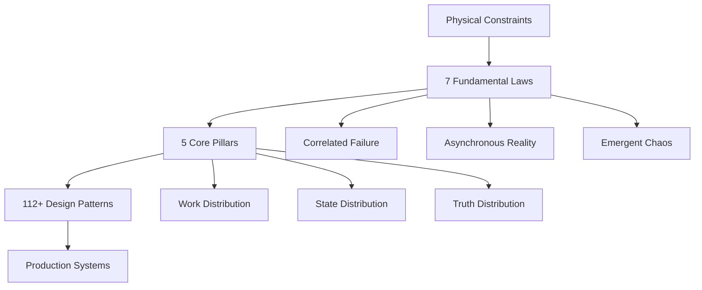

# Core Principles

Master the fundamental laws and pillars that govern all distributed systems.

## Why Physics Matters for Software

Understanding distributed systems requires grasping the fundamental constraints imposed by physics - the speed of light, thermodynamics, and quantum mechanics. These aren't abstract concepts but real limits that manifest as network latency, heat dissipation, and information propagation delays in every distributed architecture.

!!! info "Physics-Derived Foundation"
    Every pattern in this compendium traces back to physical constraints. By starting with fundamental laws, you'll develop intuition for why certain architectures work and others fail at scale.

## Overview

Distributed systems are governed by **7 immutable laws** derived from physics and organized around **5 core pillars** that shape every architectural decision. This section provides the theoretical foundation you'll need before diving into specific patterns.

## 📚 Sections

- :material-atom:{ .lg } **[The 7 Laws](laws/)**
    
    ---
    
    Immutable constraints derived from physics that govern all distributed architectures
    
    | Law | Summary |
    |-----|---------|
    | [Correlated Failure](laws/correlated-failure/) | Failures cascade across system boundaries |
    | [Asynchronous Reality](laws/asynchronous-reality/) | Networks are inherently unreliable and slow |
    | [Emergent Chaos](laws/emergent-chaos/) | Complexity emerges from simple interactions |
    | [Multidimensional Optimization](laws/multidimensional-optimization/) | Every trade-off has multiple dimensions |
    | [Distributed Knowledge](laws/distributed-knowledge/) | Perfect knowledge is physically impossible |
    | [Cognitive Load](laws/cognitive-load/) | Human comprehension limits system design |
    | [Economic Reality](laws/economic-reality/) | Resource constraints drive architectural decisions |

- :material-pillar:{ .lg } **[The 5 Pillars](pillars/)**
    
    ---
    
    Foundational concepts for organizing and distributing system responsibilities
    
    | Pillar | Summary |
    |--------|---------|
    | [Work Distribution](pillars/work-distribution/) | How computational tasks spread across nodes |
    | [State Distribution](pillars/state-distribution/) | How data and memory scatter through the system |
    | [Truth Distribution](pillars/truth-distribution/) | How consistency and consensus emerge |
    | [Control Distribution](pillars/control-distribution/) | How decisions and coordination happen |
    | [Intelligence Distribution](pillars/intelligence-distribution/) | How learning and adaptation occur |

## 🚀 Quick Start

New to distributed systems? Begin your journey with the fundamental laws that govern every system.

[:octicons-arrow-right-24: Start with the 7 Laws](laws/){ .md-button .md-button--primary }

## 🎯 Learning Paths

Choose a structured curriculum tailored to your role and experience level:

| Path | Duration | Focus | Week-by-Week Coverage |
|------|----------|-------|----------------------|
| **[New Graduate](../architects-handbook/learning-paths/new-graduate/)** | 12 weeks | Foundation-building | Laws → Pillars → Basic Patterns → Simple Systems |
| **[Senior Engineer](../architects-handbook/learning-paths/senior-engineer/)** | 8 weeks | Architecture mastery | Advanced Patterns → Trade-offs → Complex Systems |
| **[Architect](../architects-handbook/learning-paths/architect/)** | 6 weeks | System design leadership | High-level design → Cost optimization → Team decisions |
| **[Manager](../architects-handbook/learning-paths/manager/)** | 4 weeks | Strategic understanding | Business implications → Team structure → Risk assessment |

## 📖 How to Use This Section

1. **Start with the Laws** - Understand the fundamental constraints
2. **Study the Pillars** - Learn how to organize solutions
3. **Apply to Patterns** - See how principles manifest in real patterns
4. **Practice with Examples** - Work through exercises and case studies

---

*Ready to begin? Start with [The 7 Laws](laws/) to understand the physics that shapes all distributed systems.*