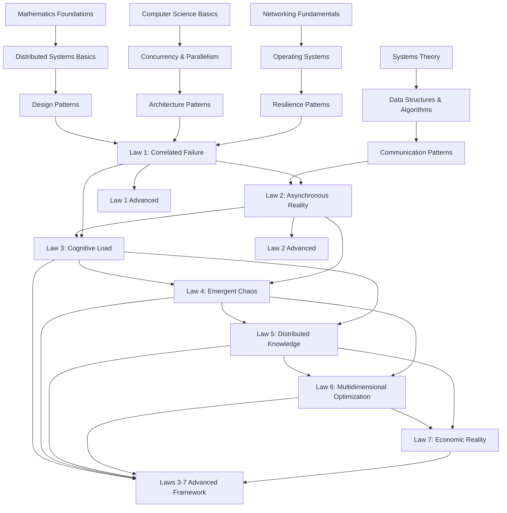

# Comprehensive Prerequisite & Learning Path for Distributed Systems Laws

## Learning Dependency Graph

## Detailed Prerequisites by Law

### Foundation Prerequisites (Required for All Laws)

#### Mathematics
- **Probability Theory**: Understanding correlation, independence, conditional probability
- **Graph Theory**: Nodes, edges, paths, cycles, connectivity
- **Linear Algebra**: Vectors, matrices, transformations
- **Statistics**: Distributions, variance, standard deviation, hypothesis testing
- **Calculus**: Rates of change, optimization, limits

#### Computer Science
- **Data Structures**: Arrays, lists, trees, graphs, hash tables
- **Algorithms**: Sorting, searching, graph traversal, dynamic programming
- **Complexity Theory**: Big-O notation, time/space complexity
- **Automata Theory**: State machines, regular expressions
- **Information Theory**: Entropy, information content, compression

#### Systems Knowledge
- **Operating Systems**: Processes, threads, memory management, I/O
- **Networking**: TCP/IP, HTTP, DNS, load balancing
- **Databases**: ACID properties, transactions, replication
- **Distributed Systems Basics**: CAP theorem, consensus, consistency models

---

## Law-Specific Prerequisite Chains

### Law 1: Correlated Failure
**Mathematical Prerequisites:**
- Correlation coefficients (Pearson, Spearman)
- Percolation theory and phase transitions
- Joint probability distributions
- Covariance and dependence

**Systems Prerequisites:**
- Failure analysis and root cause analysis
- Redundancy and replication strategies
- Load balancing and traffic distribution
- Health checking and monitoring

**Pattern Prerequisites:**
- Bulkhead pattern
- Circuit breaker pattern
- Cell-based architecture
- Fault isolation techniques

**Recommended Study Path:**
1. Week 1-2: Probability and correlation mathematics
2. Week 3-4: System failure modes and analysis
3. Week 5-6: Resilience patterns implementation
4. Week 7-8: Production case studies

---

### Law 2: Asynchronous Reality
**Mathematical Prerequisites:**
- Queuing theory (M/M/1, M/M/c models)
- Partial ordering and happens-before relation
- Clock synchronization algorithms
- Race condition analysis

**Systems Prerequisites:**
- Concurrent programming models
- Message passing vs shared memory
- Event-driven architecture
- Reactive systems

**Pattern Prerequisites:**
- Publish-subscribe pattern
- Request-reply pattern
- Saga pattern
- Event sourcing

**Recommended Study Path:**
1. Week 1-2: Concurrent programming fundamentals
2. Week 3-4: Message queuing and event systems
3. Week 5-6: Clock synchronization and ordering
4. Week 7-8: Async patterns in production

---

### Law 3: Cognitive Load
**Psychological Prerequisites:**
- Cognitive psychology basics
- Human factors engineering
- Decision fatigue theory
- Information processing limits

**Systems Prerequisites:**
- Observability and monitoring
- Alert design and management
- Dashboard and visualization design
- Incident response processes

**Pattern Prerequisites:**
- Progressive disclosure
- Information hierarchies
- Context-aware systems
- Adaptive interfaces

**Recommended Study Path:**
1. Week 1-2: Human cognitive limitations
2. Week 3-4: Observability best practices
3. Week 5-6: Alert fatigue reduction
4. Week 7-8: Decision support systems

---

### Law 4: Emergent Chaos
**Mathematical Prerequisites:**
- Chaos theory and butterfly effect
- Non-linear dynamics
- Strange attractors
- Bifurcation theory

**Systems Prerequisites:**
- Complex systems theory
- Emergent behavior patterns
- Cascade failure analysis
- System dynamics modeling

**Pattern Prerequisites:**
- Chaos engineering practices
- Game day exercises
- Failure injection patterns
- Adaptive resilience

**Recommended Study Path:**
1. Week 1-2: Chaos theory fundamentals
2. Week 3-4: Complex systems behavior
3. Week 5-6: Chaos engineering tools
4. Week 7-8: Production chaos experiments

---

### Law 5: Distributed Knowledge
**Mathematical Prerequisites:**
- Information theory and entropy
- Consensus algorithms (Paxos, Raft)
- Byzantine fault tolerance
- Vector clocks and logical time

**Systems Prerequisites:**
- Eventual consistency models
- Distributed databases
- Replication strategies
- Conflict resolution

**Pattern Prerequisites:**
- CRDT (Conflict-free Replicated Data Types)
- Event sourcing
- Command Query Responsibility Segregation (CQRS)
- Gossip protocols

**Recommended Study Path:**
1. Week 1-2: Information theory basics
2. Week 3-4: Consensus algorithms
3. Week 5-6: Consistency models
4. Week 7-8: Distributed data patterns

---

### Law 6: Multidimensional Optimization
**Mathematical Prerequisites:**
- Optimization theory
- Game theory and Nash equilibrium
- Pareto optimality
- Constraint programming

**Systems Prerequisites:**
- Resource allocation strategies
- Capacity planning
- Performance tuning
- Trade-off analysis

**Pattern Prerequisites:**
- Auto-scaling patterns
- Load balancing algorithms
- Resource pooling
- Priority scheduling

**Recommended Study Path:**
1. Week 1-2: Optimization mathematics
2. Week 3-4: Game theory applications
3. Week 5-6: Multi-objective optimization
4. Week 7-8: Production optimization cases

---

### Law 7: Economic Reality
**Financial Prerequisites:**
- Total Cost of Ownership (TCO)
- Return on Investment (ROI)
- Capital vs Operational Expenses
- Opportunity cost theory

**Systems Prerequisites:**
- Cloud cost models
- Resource pricing strategies
- Technical debt quantification
- Capacity planning economics

**Pattern Prerequisites:**
- FinOps practices
- Cost attribution patterns
- Showback/chargeback models
- Economic scaling strategies

**Recommended Study Path:**
1. Week 1-2: Financial fundamentals
2. Week 3-4: Cloud economics
3. Week 5-6: Technical debt analysis
4. Week 7-8: Cost optimization strategies

---

## Recommended Learning Sequences

### Sequence 1: Sequential Mastery (6 months)
**Month 1**: Foundations + Law 1
**Month 2**: Law 2 + Law 3
**Month 3**: Law 4 + Law 5
**Month 4**: Law 6 + Law 7
**Month 5**: Advanced topics (Laws 1-2)
**Month 6**: Advanced framework (Laws 3-7)

### Sequence 2: Parallel Learning (4 months)
**Month 1**: Foundations + Laws 1-3 basics
**Month 2**: Laws 4-5 + patterns
**Month 3**: Laws 6-7 + integration
**Month 4**: All advanced topics

### Sequence 3: Problem-Focused (3 months)
**Month 1**: Critical laws for immediate problems (usually 1, 2, 3)
**Month 2**: Supporting laws (4, 5)
**Month 3**: Optimization and economics (6, 7)

---

## Assessment Checkpoints

### Foundation Assessment
- [ ] Can explain correlation vs causation
- [ ] Understands CAP theorem implications
- [ ] Can implement basic concurrent programs
- [ ] Knows common failure modes

### Law 1 Mastery
- [ ] Can calculate correlation coefficients
- [ ] Understands percolation thresholds
- [ ] Can design bulkhead patterns
- [ ] Has implemented circuit breakers

### Law 2 Mastery
- [ ] Can identify race conditions
- [ ] Understands ordering guarantees
- [ ] Can implement async patterns
- [ ] Has debugged timing issues

### Law 3 Mastery
- [ ] Can measure cognitive load
- [ ] Understands alert fatigue
- [ ] Can design effective dashboards
- [ ] Has optimized on-call processes

### Law 4 Mastery
- [ ] Can predict emergent behaviors
- [ ] Understands cascade failures
- [ ] Can run chaos experiments
- [ ] Has handled unexpected failures

### Law 5 Mastery
- [ ] Can implement consensus
- [ ] Understands consistency models
- [ ] Can design distributed state
- [ ] Has resolved split-brain scenarios

### Law 6 Mastery
- [ ] Can perform multi-objective optimization
- [ ] Understands trade-off analysis
- [ ] Can apply game theory
- [ ] Has optimized complex systems

### Law 7 Mastery
- [ ] Can calculate TCO
- [ ] Understands cost drivers
- [ ] Can optimize spending
- [ ] Has reduced operational costs

---

## Resource Library

### Books by Prerequisite Level

#### Beginner
- "Designing Data-Intensive Applications" - Martin Kleppmann
- "Site Reliability Engineering" - Google
- "The Phoenix Project" - Gene Kim

#### Intermediate
- "Distributed Systems" - van Steen & Tanenbaum
- "Release It!" - Michael Nygard
- "Building Microservices" - Sam Newman

#### Advanced
- "Distributed Algorithms" - Nancy Lynch
- "The Art of Capacity Planning" - John Allspaw
- "Chaos Engineering" - Rosenthal & Jones

### Online Courses
- **Coursera**: "Cloud Computing Concepts" - University of Illinois
- **MIT OCW**: "6.824 Distributed Systems"
- **Udacity**: "Scalable Microservices with Kubernetes"

### Labs and Simulations
- **Law 1**: Chaos Mesh tutorials
- **Law 2**: Async programming workshops
- **Law 3**: Observability labs (Datadog, New Relic)
- **Law 4**: Gremlin chaos experiments
- **Law 5**: Raft consensus visualization
- **Law 6**: OR-Tools optimization examples
- **Law 7**: Cloud cost calculators

---

## Certification Path

### Level 1: Foundation (3 months)
- Complete all foundation prerequisites
- Pass foundation assessment (80%)
- Complete 5 practical labs

### Level 2: Practitioner (6 months)
- Master Laws 1-4
- Implement 2 patterns per law
- Pass practitioner exam (85%)

### Level 3: Advanced (9 months)
- Master all 7 laws
- Complete advanced modules
- Submit production case study

### Level 4: Expert (12 months)
- Design novel patterns
- Mentor other learners
- Contribute to community

### Level 5: Master (18+ months)
- Original research contribution
- Speaking at conferences
- Published articles/books

---

## Quick Start Guides

### For SREs
1. Start with Law 1 (Correlated Failure)
2. Focus on Law 3 (Cognitive Load)
3. Deep dive into Law 4 (Emergent Chaos)
4. Apply Law 7 (Economic Reality)

### For Architects
1. Begin with Law 2 (Asynchronous Reality)
2. Master Law 5 (Distributed Knowledge)
3. Apply Law 6 (Multidimensional Optimization)
4. Consider Law 7 (Economic Reality)

### For Engineering Managers
1. Focus on Law 3 (Cognitive Load)
2. Understand Law 7 (Economic Reality)
3. Apply Law 6 (Multidimensional Optimization)
4. Support Laws 1-2 implementation

### For DevOps Engineers
1. Master Law 1 (Correlated Failure)
2. Implement Law 4 (Emergent Chaos)
3. Optimize with Law 6
4. Track with Law 7

---

## Success Metrics

### Learning Velocity
- Foundation: 1 concept/week
- Laws: 1 law/month
- Advanced: 1 topic/month
- Mastery: Continuous

### Practical Application
- Implement 1 pattern/week
- Run 1 experiment/month
- Complete 1 project/quarter
- Share 1 learning/month

### Community Engagement
- Ask 2 questions/week
- Answer 1 question/week
- Attend 1 meetup/month
- Present 1 topic/quarter

---

## Next Steps

1. **Self-Assessment**: Evaluate current knowledge against prerequisites
2. **Learning Plan**: Choose appropriate sequence based on role and goals
3. **Resource Gathering**: Collect books, courses, and tools
4. **Practice Environment**: Set up labs and sandboxes
5. **Community Join**: Find study groups and mentors
6. **Track Progress**: Use assessment checkpoints
7. **Apply Learning**: Implement in production gradually

Remember: Mastery is a journey, not a destination. Each law builds upon previous ones, creating a comprehensive understanding of distributed systems complexity.