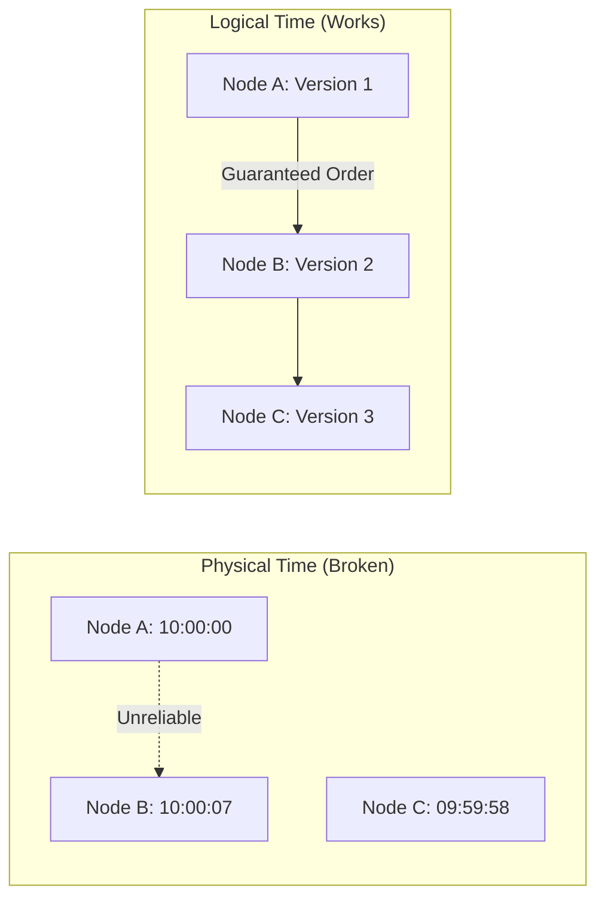

# Law 2: The Law of Asynchronous Reality

<iframe width="100%" height="166" scrolling="no" frameborder="no" allow="autoplay"
    src="https://w.soundcloud.com/player/?url=https%3A//soundcloud.com/deepak-sharma-21/time-in-distributed-systems&color=%235448C8&inverse=false&auto_play=false&show_user=true">
</iframe>

<div class="truth-box" style="background: linear-gradient(135deg, #667eea 0%, #764ba2 100%); color: white; padding: 2rem; border-radius: 8px; margin: 2rem 0;">
  <h2 style="margin: 0; font-size: 2.5em;">⏰ Einstein Was Wrong (About Your Database)</h2>
  <p style="font-size: 1.3em; margin: 1rem 0;">In distributed systems, simultaneous events don't exist. Your perfectly synchronized clocks? They're lying. That atomic operation? It's eventual. Welcome to the reality where time itself becomes your enemy.</p>
  <p style="font-size: 1.1em; margin: 0;"><strong>$43M lost in 45 minutes</strong> when Knight Capital's servers disagreed on time by 7 milliseconds.</p>
</div>

## The Shocking Truth About Time in Distributed Systems

<div class="failure-vignette">
<h3>The $852 Million Question</h3>

```
FACEBOOK OUTAGE - October 4, 2021
═══════════════════════════════════

14:31:00 (PST) - Engineer runs routine backbone maintenance
14:31:03       - Command sent to all routers "simultaneously"
                 
But "simultaneously" doesn't exist...

Router A receives at 14:31:03.127
Router B receives at 14:31:03.483  
Router C receives at 14:31:04.019
Router D - message lost in transit

Result: Routers disagree on network state
        → BGP routes withdrawn
        → Facebook disappears from internet
        → 6 hours of downtime
        → $852 million lost
```

<strong>The Lesson:</strong> A 500ms timing difference destroyed global connectivity.
</div>

## Core Principle

<div class="axiom-box">
<h3>The Fundamental Truth</h3>

In distributed systems, there is no global notion of time. Events that appear simultaneous are actually separated by network latency, clock drift, and processing delays. This creates a reality where:

- **Simultaneity is an illusion** - No two events happen at exactly the same time
- **Order is relative** - Different observers see different event sequences  
- **Time is probabilistic** - You can only estimate when things happened
- **Coordination is expensive** - Achieving consensus requires multiple round trips

The speed of light (300,000 km/s) sets a hard physical limit. Even in the same datacenter, light takes 1μs to travel 300 meters. Add switching, routing, and processing delays, and you're dealing with milliseconds—an eternity in CPU time.
</div>

## The Six Patterns of Async Failure

```
THE SIX PATTERNS OF ASYNC FAILURE
═════════════════════════════════

Pattern 1: Race Condition        Pattern 2: Clock Skew
    A ──┐                           Node1: 10:00:00
         ├──→ Different results     Node2: 10:00:07
    B ──┘     each time            Split brain!

Pattern 3: Timeout Cascade       Pattern 4: Lost Update  
    A→B→C→D (4s total)             Write A ─┐
    But A times out at 1s!                  ├→ A wins? B wins?
                                   Write B ─┘   Depends on timing!

Pattern 5: Phantom Operations    Pattern 6: Causal Violation
    Timeout + Success = 2x         Reply arrives before question
    Database: ಠ_ಠ                  Timeline: ¯\_(ツ)_/¯
```

## Real-World Disasters

### Pattern 1: The Race Condition Apocalypse 🏁

<div class="failure-vignette">
<h3>Knight Capital: How 45 Minutes Destroyed a Company</h3>

```
THE SETUP (July 31, 2012)
═════════════════════════

8 Trading Servers:
┌───┐ ┌───┐ ┌───┐ ┌───┐ ┌───┐ ┌───┐ ┌───┐ ┌───┐
│ 1 │ │ 2 │ │ 3 │ │ 4 │ │ 5 │ │ 6 │ │ 7 │ │ 8 │
└───┘ └───┘ └───┘ └───┘ └───┘ └───┘ └───┘ └───┘
  ✓     ✓     ✓     ✓     ✓     ✓     ✓     ✗
        New Code Deployed              Old Code!

THE DISASTER (August 1, 2012)
════════════════════════════

09:30:00 - Market Opens
───────────────────────
Server 8: "I see order type 'SMARS'"
Server 8: "That means BUY EVERYTHING!"
Other servers: "No, that means route intelligently"

09:45:00 - The Damage
─────────────────────
4 million executions
$460 million loss
Company value: $400 million
Result: BANKRUPTCY

One server, 7ms behind = Company destroyed
```
</div>

### Pattern 2: The Clock Skew Catastrophe 🕐

<div class="axiom-box">
<h3>Cloudflare's 30-Minute Global Outage</h3>

```
THE SETUP (July 2, 2019)
════════════════════════

Cloudflare Edge Servers:
┌─────────────┐    ┌─────────────┐    ┌─────────────┐
│   London    │    │  Frankfurt  │    │   Paris     │
│ 14:42:00.00 │    │ 14:42:00.85 │    │ 14:41:59.92 │
└─────────────┘    └─────────────┘    └─────────────┘
       ↓                   ↓                   ↓
    Deploy            850ms ahead         80ms behind

THE CASCADING FAILURE
════════════════════

14:42:00 - WAF Rule Deployed
─────────────────────────────
London:    Receives rule, applies
Frankfurt: Already past timestamp, rejects
Paris:     Not yet at timestamp, queues

14:42:30 - Full Meltdown
────────────────────────
Rule conflicts cascade
CPU: 100% parsing conflicts
Result: DROP ALL TRAFFIC
```

**The Fix:**
```
Before: if (rule.timestamp < now()) { apply() }
After:  if (rule.version > current.version) { apply() }

Time-based → Version-based coordination
```
</div>

### Pattern 3: The Timeout Cascade of Doom ⏱️

<div class="failure-vignette">
<h3>AWS DynamoDB Region-Wide Outage</h3>

```
THE ARCHITECTURE
════════════════

Client → API Gateway → Lambda → DynamoDB
  1s        1s           1s        3s
timeout   timeout     timeout    normal

Total time needed: 3s
Total time available: 1s 😱

THE CASCADE (September 20, 2015)
════════════════════════════════

09:00:00 - Small latency spike
───────────────────────────────
DynamoDB: 50ms → 1100ms (metadata service issue)

09:00:01 - Timeouts begin
─────────────────────────
Lambda:     "DynamoDB timeout!" *retry*
API GW:     "Lambda timeout!" *retry*  
Client:     "API timeout!" *retry*

09:00:05 - Retry storm
─────────────────────
Requests/sec:
Normal:     10,000
W/ retries: 30,000 → 90,000 → 270,000
```

**The Solution:**
```
TIMEOUT BUDGET PATTERN
═════════════════════

Total Budget: 30s (user patience)
- API Gateway:  29s
- Lambda:       25s  
- DynamoDB:     20s
- Actual work:  15s
- Buffer:        5s

if (timeRemaining < expectedDuration) {
    return cached_response;  // Don't even try
}
```
</div>

## Architectural Patterns for Async Reality

### 1. Logical Time Coordination



### 2. Idempotency Shield Pattern

```python
def idempotent_operation(request_id, operation):
    # Check if we've seen this before
    result = cache.get(request_id)
    if result:
        return result
    
    # Acquire distributed lock
    with distributed_lock(request_id, timeout=30):
        # Double-check after acquiring lock
        result = cache.get(request_id)
        if result:
            return result
            
        # Execute operation
        result = operation()
        
        # Cache result
        cache.set(request_id, result, ttl=86400)
        
    return result
```

### 3. Timeout Budget Allocation

| Service Layer | Timeout | Buffer | Purpose |
|--------------|---------|---------|----------|
| Client | 30s | - | Total patience budget |
| API Gateway | 29s | 1s | Network overhead |
| Service Mesh | 27s | 2s | Routing + retry |
| Application | 25s | 2s | Business logic |
| Database | 20s | 5s | Actual query time |

## Detection and Monitoring

<div class="decision-box">
<h3>The Universal Symptoms Checklist</h3>

```
SYMPTOM                          LIKELY PATTERN              ACTION
═══════                          ══════════════              ══════

"Works locally, fails in prod"   → Race condition           → Add coordination
"Sometimes works, sometimes not" → Clock skew               → Use logical time
"Slower system = more failures"  → Timeout cascade          → Fix timeout math  
"Can't reproduce the bug"        → Lost update              → Add versioning
"Customer charged twice"         → Phantom operation        → Add idempotency
"Events in wrong order"          → Causal violation         → Use vector clocks
"System slow after deployment"   → Retry storm              → Add backoff
"Logs show impossible times"     → Clock drift              → Monitor NTP
```
</div>

### Essential Metrics

```yaml
async_health_dashboard:
  clock_drift:
    query: "max(node_clock_offset_ms)"
    alert_threshold: 100ms
    
  retry_rate:
    query: "rate(http_requests_retried[1m]) / rate(http_requests_total[1m])"
    alert_threshold: 0.05  # >5% retries
    
  timeout_cascade_risk:
    query: "histogram_quantile(0.99, request_duration) / timeout_setting"
    alert_threshold: 0.8   # >80% of timeout
    
  split_brain_detection:
    query: "count(leader_election_winners) by (partition)"
    alert_threshold: 1     # >1 leader per partition
```

## Operational Checklist

<div class="truth-box" style="background: #1a1a1a; border: 2px solid #ff5555;">
<h3>The "Never Again" Checklist</h3>

After reading these disasters, check your system:

1. **Deployment Synchronization**
   ```bash
   # Are all servers updated atomically?
   for server in ${SERVERS}; do
     echo "Version on $server:"
     ssh $server 'cat /app/version'
   done
   ```

2. **Clock Monitoring**
   ```sql
   -- Maximum clock skew across cluster
   SELECT MAX(clock_offset_ms) as max_skew
   FROM node_metrics
   WHERE time > NOW() - INTERVAL '1 hour';
   ```

3. **Timeout Audit**
   ```
   Service Chain: A → B → C → D
   Timeouts:      30s  30s  30s  30s
   Total needed:  ________________?
   Will it cascade? □ Yes □ No
   ```

4. **Idempotency Check**
   ```
   Critical Operations:
   □ Payment processing
   □ Order placement  
   □ User registration
   □ Inventory updates
   
   Has idempotency key? □ Yes □ No
   ```
</div>

## The Bottom Line

<div class="axiom-box">
<h3>Your Async Evolution</h3>

```
BEFORE READING                      AFTER READING
══════════════                      ═════════════

"Systems are synchronized"     →    "Every machine has its own timeline"
"Timeouts mean failure"        →    "Timeouts mean unknown state"
"Messages arrive instantly"    →    "Messages wander through spacetime"
"Events have clear order"      →    "Order is relative to observer"
"NTP keeps perfect time"       →    "±100ms is the best you'll get"
```

<strong>The Result:</strong> You'll never trust time again—and your systems will be better for it.
</div>

!!! quote "The Meta-Truth"
    "In distributed systems, the only certainty is uncertainty. The only constant is change. The only truth is that time is a liar. Once you accept this, you can build systems that thrive in chaos rather than pretend it doesn't exist."
    
    — Every senior engineer, eventually

## Related Concepts

- **[Law 1: Correlated Failure](correlated-failure.md)** - Time sync failures often cascade
- **[Law 3: Emergent Chaos](emergent-chaos.md)** - Async interactions create emergence
- **[Law 5: Distributed Knowledge](distributed-knowledge.md)** - No global knowledge of time
- **Patterns**: [Event Sourcing](../pattern-library/data-management/event-sourcing.md), [Saga](../pattern-library/data-management/saga.md), [CQRS](../pattern-library/data-management/cqrs.md)
## Pattern Implementations

Patterns that address this law:

- [Consensus](../../pattern-library/coordination/consensus/)
- [Cqrs](../../pattern-library/data-management/cqrs/)
- [Event Sourcing](../../pattern-library/data-management/event-sourcing/)
- [Eventual Consistency](../../pattern-library/data-management/eventual-consistency/)
- [Failover](../../pattern-library/resilience/failover/)
- [Saga](../../pattern-library/data-management/saga/)


