# Law 2: The Law of Asynchronous Reality

<iframe width="100%" height="166" scrolling="no" frameborder="no" allow="autoplay"
    src="https://w.soundcloud.com/player/?url=https%3A/soundcloud.com/deepak-sharma-21/time-in-distributed-systems&color=%235448C8&inverse=false&auto_play=false&show_user=true">
</iframe>

<div class="truth-box" style="background: linear-gradient(135deg, #667eea 0%, #764ba2 100%); color: white; padding: 2rem; border-radius: 8px; margin: 2rem 0;">
  <h2 style="margin: 0; font-size: 2.5em;">⚡ Einstein Was Right (Your System Is The Problem)</h2>
  <p style="font-size: 1.3em; margin: 1rem 0;">Special Relativity governs distributed systems: simultaneity is observer-dependent, causality has speed limits, and spacetime intervals determine message ordering. Your synchronized clocks violate the laws of physics.</p>
  <p style="font-size: 1.1em; margin: 0;"><strong>c = 200,000 km/s</strong> in fiber optics. At 10,000 km distance: minimum 50ms latency. Physics doesn't negotiate.</p>
</div>

## Physics Foundation: Special Relativity in Distributed Systems

### The Fundamental Physical Constraint

<div class="axiom-box">
<h3>Spacetime Interval in Network Communications</h3>

Einstein's spacetime interval formula governs all distributed system communications:

**Δs² = -c²Δt² + Δx² + Δy² + Δz²**

Where:
- **c = 200,000 km/s** (speed of light in fiber optic cable)
- **Δt** = time difference between events
- **Δx, Δy, Δz** = spatial separation between nodes

For any two network events to be causally connected:
**Δs² < 0** (timelike separation required)

This means: **Δt > √(Δx² + Δy² + Δz²) / c**
</div>

### Causality Constraints: The Light Cone of Distributed Systems


### Mathematical Foundation: Network Distance vs. Latency

| Distance | Physical Limit (c=200,000 km/s) | Real Network | Slowdown Factor |
|----------|----------------------------------|--------------|------------------|
| Same rack (2m) | 0.01 μs | 0.1 ms | 10,000x |
| Same datacenter (200m) | 1 μs | 1 ms | 1,000x |
| Cross-country (4,000 km) | 20 ms | 50 ms | 2.5x |
| Intercontinental (12,000 km) | 60 ms | 150 ms | 2.5x |
| Geostationary satellite (72,000 km) | 360 ms | 600 ms | 1.7x |

**Key Insight:** Processing and queueing delays dominate short distances; physics dominates long distances.

## The Relativity of Simultaneity in Distributed Systems

<div class="failure-vignette">
<h3>Observer-Dependent Event Ordering: The Facebook BGP Disaster</h3>

```
FACEBOOK OUTAGE - October 4, 2021 (Physics Analysis)
═══════════════════════════════════════════════════

Event: Command sent "simultaneously" to global routers

SPACETIME COORDINATES:
┌─────────────┬─────────────┬─────────────┬─────────────┐
│   Router    │   Location  │ Δx (km)     │ Min Δt (ms) │
├─────────────┼─────────────┼─────────────┼─────────────┤
│ Menlo Park  │ Reference   │ 0           │ 0           │
│ New York    │ 4,000 km E  │ 4,000       │ 20          │
│ London      │ 8,600 km NE │ 8,600       │ 43          │
│ Singapore   │ 17,000 km W │ 17,000      │ 85          │
└─────────────┴─────────────┴─────────────┴─────────────┘

REAL PROPAGATION TIMES:
Menlo Park: 14:31:03.000 (reference frame)
New York:   14:31:03.127 (+127ms vs +20ms minimum)
London:     14:31:03.483 (+483ms vs +43ms minimum)
Singapore:  14:31:04.019 (+1019ms vs +85ms minimum)

OBSERVER-DEPENDENT CAUSALITY:
┌─────────────┬─────────────┬─────────────────────────┐
│ Observer    │ Event Order │ Causal Interpretation   │
├─────────────┼─────────────┼─────────────────────────┤
│ Menlo Park  │ A→B→C→D     │ Sequential propagation  │
│ New York    │ A→?→?→?     │ Unknown state elsewhere │
│ London      │ ?→?→?→?     │ Complete uncertainty    │
│ Singapore   │ A≈B≈C→D     │ Nearly simultaneous     │
└─────────────┴─────────────┴─────────────────────────┘

RESULT: Each router operates in its own reference frame
        → Inconsistent BGP state across spacetime
        → Network partition along causal boundaries
        → $852 million lost to Einstein's relativity
```

<strong>The Physics Lesson:</strong> Network partitions are spacetime disconnections. Simultaneity violations create inconsistent reality across observers.
</div>

## Core Principle: Einstein's Relativity Applied to Distributed Consistency

<div class="axiom-box">
<h3>The Four Relativistic Laws of Distributed Systems</h3>

**Law 1: Relativity of Simultaneity**
- Events simultaneous in one reference frame are NOT simultaneous in another
- Each node defines its own "now" - global synchronization violates physics
- Formula: **Δt' = γ(Δt - vΔx/c²)** where v = network propagation speed

**Law 2: Causal Ordering via Light Cones** 
- Event A can only cause Event B if: **Δt_{AB} ≥ |Δx_{AB}|/c**
- Spacelike separated events have observer-dependent ordering
- Logical timestamps preserve causal structure: **LC(A) < LC(B) ⟹ A causally precedes B**

**Law 3: Invariant Spacetime Intervals**
- Physical constraint: **Δs² = -c²Δt² + Δx²** is invariant across all observers
- Network messages follow timelike geodesics: **Δs² < 0**
- Coordination cost scales with spacetime separation

**Law 4: Observer-Dependent Event Horizons**
- Information beyond network partition boundary is inaccessible
- Each partition defines its own observable universe
- Consistency models must respect relativistic constraints

**Physical Constants in Distributed Systems:**
- **c = 200,000 km/s** (fiber optic speed of light)
- **Minimum latency = distance/c**
- **Causality violations ⟹ system inconsistency**
</div>

### Causality Preservation: Vector Clocks as Spacetime Coordinates


**Vector Clock Update Rules (Relativistic):**
- **Local event:** VC[i] = VC[i] + 1 (proper time advancement)
- **Send message:** Include current VC (light cone transmission)
- **Receive message:** VC[i] = max(VC[i], msg.VC[i]) + 1 (causality preservation)

### The Failure Cascade Matrix: Physics-Based Analysis

| Violation Type | Physics Principle | System Manifestation | Detection Method |
|----------------|-------------------|----------------------|------------------|
| **Simultaneity Assumption** | Relativity of simultaneity | Race conditions, split-brain | Clock skew > light-travel time |
| **Faster-than-light Coordination** | c = 200,000 km/s limit | Impossible consistency | Latency < distance/c |
| **Causal Ordering** | Light cone structure | Lost updates, phantom reads | VC(A) ∦ VC(B) |
| **Global State** | No absolute reference frame | Consensus impossibility | CAP theorem violations |
| **Synchronous Assumptions** | Timelike vs spacelike separation | Timeout cascades | Network partition detection |

## The Six Relativistic Failure Patterns

### Physics-Based Classification of Distributed System Failures

```
RELATIVISTIC FAILURE TAXONOMY
═════════════════════════════════════════════════

PATTERN 1: SIMULTANEITY VIOLATION    PATTERN 2: REFERENCE FRAME DRIFT

Spacetime Analysis:                  Spacetime Analysis:
 Events A & B spacelike-separated    Different observers, different "now"
 ┌─── Light Cone ───┐               ┌───────── Node 1 ─────────┐
 │    Future     │               │ t=10:00:00.000 (ref frame) │
 │      A        │               └─────────────────────────┘
 │              │               ┌───────── Node 2 ─────────┐
 │Now  ·    B   │               │ t=10:00:07.000 (drifted)  │
 │              │               └─────────────────────────┘
 │     Past      │
 └─────────────────┘               Result: Split-brain syndrome
 Observer dependent ordering!         Δt = 7s >> c·distance violation

PATTERN 3: LIGHT CONE VIOLATION      PATTERN 4: CAUSAL PARADOX

Network latency < distance/c         Effect precedes cause in some frame
 ┌─────────────────────────┐           ┌──────────────────────┐
 │ Distance: 10,000 km     │           │ Write A → Read A     │
 │ Min latency: 50ms       │           │ But different observers │
 │ Observed: 30ms          │           │ see Read before Write! │
 │ IMPOSSIBLE!             │           └──────────────────────┘
 └─────────────────────────┘           Vector clocks: VC(Read) < VC(Write)
 Indicates: Clock synchronization     Lost update problem!

PATTERN 5: COORDINATE TIME PARADOX   PATTERN 6: SPACETIME PARTITION

Timeout assumes global simultaneity   Network split = spacetime disconnect
 ┌─────────────────────────┐           ┌──────────────────────┐
 │ Request sent at t=0     │           │ Partition A  Partition B│
 │ Timeout at t=1s        │           │     │            │     │
 │ But response at t=0.5s  │           │ Node1 │    X    │ Node2 │
 │ in different ref frame! │           │     │            │     │
 └─────────────────────────┘           └──────────────────────┘
 Phantom operations result            Each operates in separate universe
```

### Mathematical Framework for Failure Classification

| Pattern | Physics Violation | Mathematical Condition | Observable Symptom |
|---------|------------------|------------------------|-------------------|
| **Simultaneity** | Absolute time assumption | Δt = 0 for spatially separated events | Race conditions, non-deterministic results |
| **Reference Frame Drift** | Clock synchronization | |Δt_drift| > c · d_network | Split-brain, inconsistent state |
| **Light Cone** | FTL information transfer | latency < distance/c | Impossible timing measurements |
| **Causal Paradox** | Causality violation | Effect timestamp < Cause timestamp | Lost updates, phantom reads |
| **Coordinate Time** | Global simultaneity | Timeout assumes synchronized clocks | Phantom operations, duplicate actions |
| **Spacetime Partition** | Incomplete light cones | Network partition ⟹ causal disconnect | Inconsistent consensus, split decisions |

## Real-World Disasters

### Pattern 1: Simultaneity Violation Catastrophe ⚡

<div class="failure-vignette">
<h3>Knight Capital: Simultaneity Violation at Light Speed Trading</h3>

```
THE SETUP (July 31, 2012)
═════════════════════════

8 Trading Servers:
┌───┐ ┌───┐ ┌───┐ ┌───┐ ┌───┐ ┌───┐ ┌───┐ ┌───┐
│ 1 │ │ 2 │ │ 3 │ │ 4 │ │ 5 │ │ 6 │ │ 7 │ │ 8 │
└───┘ └───┘ └───┘ └───┘ └───┘ └───┘ └───┘ └───┘
  ✓     ✓     ✓     ✓     ✓     ✓     ✓     ✗
        New Code Deployed              Old Code!

THE DISASTER (August 1, 2012)
════════════════════════════

09:30:00 - Market Opens
───────────────────────
Server 8: "I see order type 'SMARS'"
Server 8: "That means BUY EVERYTHING!"
Other servers: "No, that means route intelligently"

09:45:00 - The Damage
─────────────────────
4 million executions
$460 million loss
Company value: $400 million
Result: BANKRUPTCY

One server, 7ms behind = Company destroyed
```
</div>

### Pattern 2: Reference Frame Drift Disaster 🌌

<div class="axiom-box">
<h3>Cloudflare's 30-Minute Global Outage</h3>

```
THE SETUP (July 2, 2019)
════════════════════════

Cloudflare Edge Servers:
┌─────────────┐    ┌─────────────┐    ┌─────────────┐
│   London    │    │  Frankfurt  │    │   Paris     │
│ 14:42:00.00 │    │ 14:42:00.85 │    │ 14:41:59.92 │
└─────────────┘    └─────────────┘    └─────────────┘
       ↓                   ↓                   ↓
    Deploy            850ms ahead         80ms behind

THE CASCADING FAILURE
════════════════════

14:42:00 - WAF Rule Deployed
─────────────────────────────
London:    Receives rule, applies
Frankfurt: Already past timestamp, rejects
Paris:     Not yet at timestamp, queues

14:42:30 - Full Meltdown
────────────────────────
Rule conflicts cascade
CPU: 100% parsing conflicts
Result: DROP ALL TRAFFIC
```

**The Fix:**
```
Before: if (rule.timestamp < now()) { apply() }
After:  if (rule.version > current.version) { apply() }

Time-based → Version-based coordination
```
</div>

### Pattern 3: Light Cone Violation Crisis 🚀

<div class="failure-vignette">
<h3>AWS DynamoDB Region-Wide Outage</h3>

```
THE ARCHITECTURE
════════════════

Client → API Gateway → Lambda → DynamoDB
  1s        1s           1s        3s
timeout   timeout     timeout    normal

Total time needed: 3s
Total time available: 1s 😱

THE CASCADE (September 20, 2015)
════════════════════════════════

09:00:00 - Small latency spike
───────────────────────────────
DynamoDB: 50ms → 1100ms (metadata service issue)

09:00:01 - Timeouts begin
─────────────────────────
Lambda:     "DynamoDB timeout!" *retry*
API GW:     "Lambda timeout!" *retry*  
Client:     "API timeout!" *retry*

09:00:05 - Retry storm
─────────────────────
Requests/sec:
Normal:     10,000
W/ retries: 30,000 → 90,000 → 270,000
```

**The Solution:**
```
TIMEOUT BUDGET PATTERN
═════════════════════

Total Budget: 30s (user patience)
- API Gateway:  29s
- Lambda:       25s  
- DynamoDB:     20s
- Actual work:  15s
- Buffer:        5s

if (timeRemaining < expectedDuration) {
    return cached_response;  / Don't even try
}
```
</div>

## Architectural Patterns: Relativistic System Design

### 1. Hybrid Logical Clocks (HLC): Unifying Physical and Logical Time


**HLC Update Algorithm (Relativistic):**
```
HLC = (physical_time, logical_counter)

On local event:
  pt = max(physical_clock(), hlc.physical_time)
  lc = hlc.logical_counter + 1 if pt == hlc.physical_time else 0
  hlc = (pt, lc)

On message send:
  include hlc in message
  
On message receive:
  pt = max(physical_clock(), hlc.physical_time, msg.hlc.physical_time)
  lc = determine_logical_counter(pt, hlc, msg.hlc)
  hlc = (pt, lc)
```

### 2. Relativistic Consensus: Respecting Spacetime Constraints


**Physics-Compliant Consensus Properties:**
- **Timelike Consistency:** All decisions respect causal ordering
- **Light Cone Quorum:** Majority must be reachable within c·timeout
- **Reference Frame Stability:** HLC ensures consistent event ordering
- **Partition Tolerance:** Graceful degradation when spacetime disconnects

### 3. Idempotency via Spacetime Coordinates

**Problem:** Traditional request IDs don't capture causality
**Solution:** Use spacetime coordinates (HLC + node_id) as idempotency keys

```
Idempotency Key Structure:
key = hash(HLC_physical, HLC_logical, node_id, operation_type, parameters)

Properties:
- Unique across spacetime (no collisions)
- Preserves causal ordering
- Enables replay detection across network partitions
- Handles clock drift gracefully

Example:
"payment_123" → "payment_123_1640995200.000_42_node_A_SHA256(params)"

Benefits:
- Detects duplicate operations across partitions
- Enables causal replay after partition heals
- Provides audit trail with physical timestamps
```

### 4. Physics-Based Timeout Allocation

**Relativistic Timeout Formula:**
```
Timeout_layer = Timeout_parent - 2 × (network_diameter / c) - processing_buffer

Where:
- network_diameter = maximum distance between any two nodes
- c = 200,000 km/s (fiber optic speed)
- processing_buffer = 99.9th percentile processing time
```

| Service Layer | Distance | Min Physics | Processing | Total Timeout | Buffer |
|---------------|----------|-------------|------------|---------------|--------|
| **Global Client** | - | - | - | 30s | Total patience |
| **Regional Gateway** | 12,000km | 60ms | 100ms | 29s | 840ms |
| **Zone Load Balancer** | 500km | 2.5ms | 50ms | 28s | 947ms |
| **Service Mesh** | 100km | 0.5ms | 20ms | 27s | 979ms |
| **Application** | 10km | 0.05ms | 100ms | 25s | 1.9s |
| **Database** | 1km | 0.005ms | 200ms | 20s | 4.8s |

**Key Insights:**
- **Physics dominates at continental scale** (60ms minimum for intercontinental)
- **Processing dominates at local scale** (100ms >> 0.05ms for 10km)
- **Buffer must account for both** physics and engineering uncertainties
- **Violations cascade** when timeouts < physical minimums

## Relativistic Failure Detection

<div class="decision-box">
<h3>Physics-Based Diagnostic Matrix</h3>

```
SYMPTOM                           PHYSICS VIOLATION           RELATIVISTIC SOLUTION
═══════                           ═════════════════           ═════════════════════

"Latency < distance/c"           → FTL information          → Fix clock synchronization
"Events reordered by observer"   → Spacelike coordination   → Use HLC timestamps
"Consensus fails at distance"    → Light cone violation     → Physics-aware quorums
"Timeout < round-trip physics"   → Impossible deadline      → Recalculate timeout budgets
"Simultaneous distributed ops"   → Absolute time assumption → Implement causal consistency
"Network partition = split brain" → No spacetime connection  → Partition-aware algorithms
"Clock skew > light travel time" → Reference frame drift    → NTP + logical timestamps
"Causality violations in logs"   → Effect before cause      → Vector clock validation
```

**Physics Violation Severity:**
- 🔴 **Critical:** Faster-than-light coordination attempts
- 🟡 **Warning:** Clock skew approaching light-travel time
- 🟢 **Info:** Timeout budgets don't account for physics
</div>

### Spacetime Debugging Toolkit

```mermaid
graph LR
    subgraph "Relativistic Monitoring Stack"
        subgraph "Data Collection"
            GPS["GPS Time Sync<br/>±10ms accuracy"]
            HLC["HLC Timestamps<br/>Causal ordering"]
            NET["Network Topology<br/>Physical distances"]
        end
        
        subgraph "Physics Analysis"
            LIGHT["Light Cone Analysis<br/>Causality checking"]
            FRAME["Reference Frame Drift<br/>Clock skew detection"]
            SPACE["Spacetime Intervals<br/>Message travel time"]
        end
        
        subgraph "Violation Detection"
            FTL["FTL Communications<br/>Impossible timing"]
            CAUSAL["Causality Violations<br/>Effect before cause"]
            PARTITION["Spacetime Partitions<br/>Unreachable regions"]
        end
    end
    
    GPS --> FRAME
    HLC --> LIGHT
    NET --> SPACE
    LIGHT --> CAUSAL
    FRAME --> FTL
    SPACE --> PARTITION
```



## Production Metrics: Physics-Based Monitoring

### Relativistic System Health Dashboard

```yaml
physics_compliance_dashboard:
  # Speed of Light Violations
  faster_than_light_detection:
    query: "(message_receive_time - message_send_time) < (distance_km / 200)"
    alert_threshold: 0.001  # Any violation
    description: "Impossible timing indicates clock desync"
    
  # Causality Violations  
  causal_ordering_violations:
    query: "rate(vector_clock_violations[5m])"
    alert_threshold: 0.01   # 1% of operations
    description: "Events occurring before their causes"
    
  # Spacetime Interval Monitoring
  spacelike_coordination_attempts:
    query: "histogram_quantile(0.99, coordination_latency) < (distance_km / 200000)"
    alert_threshold: 0.05   # 5% of coordination
    description: "Impossible synchronization attempts"
    
  # Observer Reference Frame Drift
  reference_frame_divergence:
    query: "max(hlc_physical_drift_ms) - min(hlc_physical_drift_ms)"
    alert_threshold: 100    # 100ms max divergence
    description: "Nodes operating in different time references"
    
  # Partition Detection via Light Cone Analysis
  network_partition_spacetime:
    query: "count(unreachable_nodes_beyond_light_cone)"
    alert_threshold: 1      # Any node beyond light cone
    description: "Network partition detected via relativistic analysis"
    
  # Consistency Model Violations
  consistency_model_physics_violations:
    query: "rate(strong_consistency_across_spacelike_events[1m])"
    alert_threshold: 0.001  # Should be impossible
    description: "Strong consistency claimed for spacelike-separated events"
```

### Physics-Based Performance Budgets

| Metric | Physical Limit | Engineering Limit | Alert Threshold | Violation Impact |
|--------|----------------|-------------------|-----------------|------------------|
| **Cross-continental latency** | 60ms (12,000km ÷ 200,000km/s) | 150ms | 200ms | Timeout cascades |
| **Clock synchronization** | ±50ms (GPS precision) | ±100ms | ±200ms | Causality violations |
| **Consensus round-trips** | 2 × network diameter | 3 × network diameter | 5 × network diameter | Split-brain risk |
| **Message ordering window** | Speed-of-light delay | 2 × speed-of-light delay | 5 × speed-of-light delay | Lost causality |
| **Partition detection time** | Network diameter / c | 2 × (network diameter / c) | 5 × (network diameter / c) | Inconsistent state |

### Spacetime Debugging Tools

```yaml
relativistic_debugging:
  # Light Cone Visualization
  causality_graph:
    query: "build_light_cone_graph(event_log, node_positions)"
    visualization: "3D spacetime diagram with causal relationships"
    
  # Reference Frame Analysis  
  observer_comparison:
    query: "compare_event_ordering_across_nodes(time_window)"
    output: "Event sequence differences by observer"
    
  # Physics Violation Detection
  impossible_events:
    query: "detect_faster_than_light_causation(event_pairs)"
    output: "Events that violate relativistic constraints"
    
  # Network Topology vs Physics
  spacetime_network_map:
    query: "overlay_physical_distances_on_network_topology()"
    output: "Network latency vs. theoretical minimum"
```

## Relativistic Operations Manual

<div class="truth-box" style="background: #1a1a1a; border: 2px solid #00bcd4;">
<h3>Physics-Compliant System Audit</h3>

After understanding these relativistic principles, validate your system:

**1. Spacetime Geometry Analysis**
```bash
# Calculate minimum possible latencies based on physics
for region in ${REGIONS}; do
  distance=$(get_distance $region)
  min_latency=$(echo "$distance / 200000" | bc -l)  # km / (km/s)
  actual_latency=$(ping -c 10 $region | grep avg | cut -d'/' -f5)
  if (( $(echo "$actual_latency < $min_latency" | bc -l) )); then
    echo "PHYSICS VIOLATION: $region faster than light!"
  fi
done
```

**2. Light Cone Validation**
```sql
-- Detect faster-than-light message propagation
WITH spacetime_events AS (
  SELECT 
    sender_node, receiver_node,
    send_timestamp, receive_timestamp,
    geodistance(sender_pos, receiver_pos) as distance_km,
    (receive_timestamp - send_timestamp) as observed_latency
  FROM message_log
  WHERE timestamp > NOW() - INTERVAL '1 hour'
)
SELECT * FROM spacetime_events
WHERE observed_latency < (distance_km / 200.0);  -- Violations of c
```

**3. Causality Verification**
```
Event Pair Analysis:
┌─────────────────────────┐
│ Event A → Event B          │
│ HLC(A) = (t1, c1, node1)     │
│ HLC(B) = (t2, c2, node2)     │
│                             │
│ Causal Check:               │
│ □ HLC(A) < HLC(B)           │
│ □ |t2-t1| > distance/c     │
│ □ No causality violations   │
└─────────────────────────┘
```

**4. Reference Frame Stability**
```yaml
# Clock synchronization audit
clock_health:
  max_acceptable_drift: 100ms    # ±100ms from GPS
  ntp_sync_interval: 64s         # Standard NTP
  htp_precision: ±10ms           # High-precision time protocol
  
critical_operations:
  - name: "financial_transactions"
    requires_precision: 1ms       # Sub-millisecond accuracy
    solution: "hardware_timestamping"  # Bypass OS clock
  - name: "distributed_consensus"  
    requires_precision: 100ms     # Regional coordination
    solution: "gps_synchronized_ntp"   # GPS reference
```

**5. Spacetime-Aware Idempotency**
```
Relativistic Idempotency Keys:
┌─────────────────────────────────────────────┐
│ Operation: payment_process               │
│ Classical Key: request_id_12345         │
│ Spacetime Key: HLC_1640995200.000_42_   │
│                node_A_SHA256(params)     │
│                                         │
│ Benefits:                               │
│ □ Unique across all reference frames   │
│ □ Preserves causal ordering           │
│ □ Enables partition recovery          │
│ □ Provides audit trail               │
└─────────────────────────────────────────────┘
```
</div>

## The Relativistic Mindshift

<div class="axiom-box">
<h3>Your Physics-First Evolution</h3>

```
CLASSICAL DISTRIBUTED SYSTEMS      RELATIVISTIC DISTRIBUTED SYSTEMS
══════════════════════════════════      ══════════════════════════════════════

"Global synchronized time"      →    "Spacetime is relative to observer"
"Simultaneous events exist"     →    "Simultaneity violates relativity"
"Network delays are engineering" →    "c=200,000 km/s is fundamental limit"
"Consensus is a software problem" →   "Consensus must respect light cones"
"Timeouts are configuration"    →    "Timeouts bounded by spacetime geometry"
"Partitions are network issues" →    "Partitions are spacetime disconnections"
"Causality is obvious"          →    "Causality requires vector clocks"
"Time moves forward everywhere" →    "Each node has its own worldline"
```

**The Transformation:**
1. **Accept relativity** - No absolute reference frame exists
2. **Embrace light cones** - Causality has geometric constraints
3. **Design for spacetime** - Physics determines system boundaries
4. **Monitor like a physicist** - Detect violations of natural laws

**The Result:** Your systems will operate within the laws of physics, not against them.
</div>

### The Spacetime Systems Checklist

<div class="truth-box" style="background: #1a1a1a; border: 2px solid #00bcd4;">
<h3>Relativistic System Design Validation</h3>

**1. Light Cone Compliance**
- [ ] All timeout budgets > distance/c for affected nodes
- [ ] Consensus algorithms account for network diameter
- [ ] No coordination assumed faster than light travel time

**2. Causality Preservation**  
- [ ] Vector clocks or HLC timestamps on all events
- [ ] Causal consistency model explicitly chosen
- [ ] No phantom operations from timeout/success races

**3. Reference Frame Stability**
- [ ] Clock drift monitoring with physics-based alerting
- [ ] NTP synchronization with GPS reference
- [ ] Logical timestamps for causal ordering

**4. Spacetime Partition Tolerance**
- [ ] Graceful degradation when network partitions occur
- [ ] No split-brain scenarios from clock drift
- [ ] Recovery procedures respect causality

**5. Observer-Independent Semantics**
- [ ] Event ordering consistent across all nodes
- [ ] State transitions respect causal dependencies
- [ ] No assumptions of global simultaneity

**Physics Compliance Score: ___/20**
</div>

!!! quote "The Relativistic Truth"
    "Distributed systems are fundamentally relativistic. Spacetime geometry constrains system design more than any engineering choice. The speed of light isn't just a physics constant—it's your system's ultimate performance boundary. Design within these constraints, and your systems will be physically sound. Ignore them, and physics will violate your assumptions with cascading failures."
    
    — Einstein's Ghost, debugging your microservices

## Applied in Patterns

Patterns that directly address the asynchronous reality of distributed systems:

**⏱️ Time & Coordination Patterns:**
- **[Consensus](../pattern-library/coordination/consensus/index.md)**: Handles the reality that there's no global clock and agreement must be reached despite message delays
- **[Vector Clocks](../pattern-library/coordination/logical-clocks/index.md)**: Captures causal ordering when physical time can't be synchronized
- **[Hybrid Logical Clocks](../pattern-library/coordination/hlc/index.md)**: Combines physical and logical time for better ordering in distributed systems
- **[Leader Election](../pattern-library/coordination/leader-election/index.md)**: Manages coordination despite unreliable timing and message delivery

**📡 Asynchronous Communication:**
- **[Event Sourcing](../pattern-library/data-management/event-sourcing/index.md)**: Embraces asynchronous event processing rather than synchronous state updates
- **[Saga Pattern](../pattern-library/data-management/saga/index.md)**: Coordinates long-running distributed transactions asynchronously with compensations
- **[CQRS](../pattern-library/data-management/cqrs/index.md)**: Separates read and write operations to handle asynchronous update propagation
- **[Publish-Subscribe](../pattern-library/communication/publish-subscribe/index.md)**: Enables asynchronous messaging between loosely coupled components

**🔄 Eventual Consistency:**
- **[Eventual Consistency](../pattern-library/data-management/eventual-consistency/index.md)**: Accepts that consistency will be achieved eventually rather than immediately
- **[CDC (Change Data Capture)](../pattern-library/data-management/cdc/index.md)**: Propagates data changes asynchronously across systems
- **[Event-Driven Architecture](../pattern-library/architecture/event-driven/index.md)**: Builds systems around asynchronous event flows

**🛡️ Failure Handling:**
- **[Timeout](../pattern-library/resilience/timeout/index.md)**: Bounds operations in time to handle unpredictable network delays
- **[Retry with Backoff](../pattern-library/resilience/retry-backoff/index.md)**: Handles transient failures in asynchronous systems
- **[Circuit Breaker](../pattern-library/resilience/circuit-breaker/index.md)**: Manages service failures in asynchronous communication

## Related Concepts

- **[Law 1: Correlated Failure](correlated-failure.md)** - Time sync failures often cascade
- **[Law 3: Emergent Chaos](emergent-chaos.md)** - Async interactions create emergence
- **[Law 5: Distributed Knowledge](distributed-knowledge.md)** - No global knowledge of time


