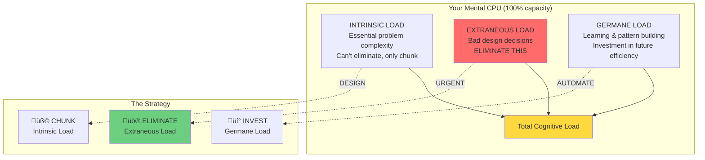

# Law 6: The Law of Cognitive Load - Your Humans Are Not Machines

## Learning Meta-Status
**NOTICE YOUR CURRENT MENTAL STATE**: Before diving in, pause. How many things are you mentally juggling right now? Email notifications? Slack messages? Meeting prep? Count them. This isn't just theory—you're about to learn principles that directly apply to your current experience.

**Learning Investment**: ~90 minutes across 8 focus blocks
**Cognitive Load Budget**: 7 core concepts (respects Miller's Law)
**Meta-Objective**: You will apply cognitive load principles TO learning these very principles

# MLU-1: Miller's 7±2 Principle (The Mental RAM Limit)

## Focus Block 1: "The Mental RAM Limit" (15 min)

### PRIMING: "How many things can you juggle at once?"
Think of your brain like a computer's RAM. Right now, as you read this, your working memory is actively holding:
- The concept you're trying to understand
- Where you are in this document
- That Slack notification you just heard
- The meeting you have in 20 minutes
- What you had for breakfast (maybe)

Count them. How many simultaneous thoughts can you track before something gets dropped?

### CORE: Miller's Magical Number

**The Core Truth**: Human working memory capacity = 7±2 chunks

This isn't opinion—it's neuroscience. George Miller proved this in 1956, and every psychological study since confirms it. Your brain can consciously process between 5-9 pieces of information simultaneously. That's it.

```
Working Memory Slots: [1][2][3][4][5][6][7][8][9]
                      └─────── 7±2 limit ─────────┘
```

**NEURAL BRIDGE**: Your brain's working memory is like computer RAM. Just as a computer with 8GB RAM can't load 16GB of data without swapping to disk (causing slowdown), your brain can't process more than 7±2 items without "cognitive thrashing."

### FORESHADOWING: "What happens when we overflow?"
When you exceed this limit, your brain doesn't gracefully degrade—it catastrophically fails. Errors spike. Decision time explodes. Stress hormones flood your system.

We're about to see how this plays out in real systems with real consequences.

---

## Consolidation Prompt 1
**PAUSE. Count how many things you're mentally tracking right now.**

Write them down:
1. _________________
2. _________________
3. _________________
4. _________________
5. _________________
6. _________________
7. _________________
8. _________________
9. _________________

Notice when you hit your limit. This is your personal Miller number.

### Retrieval Gauntlet 1:

**Tier 1 (Recognition)**: What is the typical working memory capacity?
- A) 3±1 items
- B) 7±2 items  
- C) 12±3 items
- D) Unlimited

**Tier 2 (Application)**: Analyze this dashboard - identify cognitive overload:
```
DASHBOARD: [CPU: 73%] [RAM: 89%] [Disk: 45%] [Network: 234 Mbps] [Requests/sec: 1,247] 
[Error Rate: 0.03%] [P95 Latency: 234ms] [P99 Latency: 891ms] [Active Users: 12,847] 
[Background Jobs: 73] [Cache Hit Rate: 94%] [DB Connections: 23/100] [Alert Count: 47]
```
How many metrics are competing for attention? What would you eliminate?

**Tier 3 (Creation)**: Redesign this alert system to respect cognitive limits:
```
CURRENT ALERTS (147 total):
- DB connection pool exhausted
- High CPU usage on web-03  
- SSL cert expires in 29 days
- Disk usage at 78% on cache-02
- API response time above 500ms
- Redis memory usage at 85%
- ... 141 more alerts
```
How would you reduce this to 7±2 actionable items?

---

## Focus Block 2: "The Stress Collapse" (18 min)

### PRIMING: "Remember your worst on-call experience"
Picture this: It's 3 AM. Your phone screams. Production is down. Your normal 7-chunk capacity just became 2-3 chunks. But the system complexity didn't decrease—you still have 50+ services, 200+ alerts, and a dependency graph that looks like spaghetti.

This is where good engineers break.

### CORE: The Stress-Performance Collapse

**The Brutal Math**: Under stress, working memory degrades exponentially

$$C_{\text{effective}} = C_{\text{base}} \times e^{-s/10}$$

**Translation**: 
- Normal capacity: 7 chunks
- High stress (s=6): 7 × e^(-0.6) = **3.8 chunks**
- Extreme stress (s=8): 7 × e^(-0.8) = **3.1 chunks**

But here's the killer: **System complexity stays the same while your ability to handle it plummets.**

### The Three Types of Cognitive Load


**NEURAL BRIDGE**: Think of your brain like a CPU with limited processing threads. Intrinsic load is the actual work. Extraneous load is like running 50 background processes that serve no purpose. Germane load is investing CPU cycles in optimization that pays dividends later.

### FORESHADOWING: "When humans snap"
We're about to see how this played out in a $440 million disaster where brilliant engineers were cognitively overwhelmed by a system that exceeded human limits.

---

## Consolidation Prompt 2
**STRESS TEST: Simulate cognitive overload right now.**

Try this exercise:
1. Count backwards from 100 by 7s
2. While simultaneously spelling your last name backwards
3. While keeping track of how many vowels you encounter
4. While remembering this sequence: Q, 7, Blue, △, 23

Stop when it becomes impossible. That's your overload point.

### Retrieval Gauntlet 2:

**Tier 1**: If stress level = 6 and base capacity = 7, what's effective capacity?
**Tier 2**: A dashboard shows 15 metrics. At stress level 7, how many can an engineer actually process?
**Tier 3**: Design a "stress-aware" alert system that automatically reduces information during incidents.

---

## Focus Block 3: "The Chunking Superpower" (18 min)

### PRIMING: The phone number magic trick
Quick: Memorize this number: 2025551234
Impossible? Try this instead: (202) 555-1234
Suddenly easier? That's chunking in action.

Now try this: dockercomposeupdbuildforce
vs: docker-compose up -d --build --force-recreate

Your brain can't handle the first. The second? Easy. Chunking transforms cognitive chaos into manageable patterns.

### CORE: Strategic Information Chunking

**The Chunking Principle**: Group related information into meaningful units that fit working memory slots.

**Examples in System Design**:

```bash
# COGNITIVE OVERLOAD (11 separate pieces):
kubectl get pods -n production | grep frontend | awk '{print $1}' | xargs kubectl describe pod | grep -A 5 "Events" | tail -20

# CHUNKED (3 meaningful units):
get-frontend-pods
describe-events  
show-recent-errors
```

**The 7±2 Service Architecture**:
```
Instead of: 47 microservices (cognitive overload)

Group into: 
├── User Services (Auth, Profile, Preferences)
├── Content Services (CMS, Media, Search)
├── Commerce Services (Cart, Payment, Orders)
├── Platform Services (Logging, Metrics, Config)
├── Data Services (Analytics, Reports, ML)
├── External Services (Email, SMS, Push)
└── Core Services (Gateway, Load Balancer, CDN)

Result: 7 meaningful chunks, each containing manageable subcomplexity
```

### NEURAL BRIDGE: Hierarchical Memory Systems
Your brain naturally organizes information hierarchically:
- **Level 1**: "There's a problem" (1 chunk)
- **Level 2**: "It's a database problem" (1 chunk + context)
- **Level 3**: "Connection pool exhausted on user-db-01" (full context)

Progressive disclosure maps to natural cognitive architecture.

### FORESHADOWING: "The dashboard disaster"
Next, we'll see how Netflix reduced 2,847 daily alerts to 47 using chunking strategies—and saved $4.2M annually in engineer retention.

---

## Consolidation Prompt 3
**CHUNKING PRACTICE: Organize your current system**

Take your most complex service/dashboard/runbook. Break it into 7±2 logical chunks:

1. ________________
2. ________________  
3. ________________
4. ________________
5. ________________
6. ________________
7. ________________

Each chunk should be independently understandable.

### Retrieval Gauntlet 3:

**Tier 1**: What makes information "chunkable"?
**Tier 2**: Redesign this microservices list using chunking:
```
user-auth, user-profile, user-preferences, content-cms, content-media, 
content-search, order-service, payment-service, cart-service, 
email-service, sms-service, push-service, logging-service, 
metrics-service, config-service, analytics-service, reports-service
```
**Tier 3**: Create a chunked incident response tree for your system.

---

## Focus Block 4: "The Information Iceberg" (20 min)

### PRIMING: "What do you actually need to know RIGHT NOW?"
You're debugging a production issue. Do you need to see:
- All 200 metrics from the last 24 hours?
- The entire stack trace with 47 lines of detail?
- Every log entry from all 23 services?

Or do you need:
- Is the system up or down?
- Which service is failing?
- What's the one-click fix?

Progressive disclosure is about showing the RIGHT information at the RIGHT cognitive level.

### CORE: The Three-Tier Information Architecture

**Level 1: Executive Summary** (Uses 7 chunks max)
```
┌─────────────────────────────────────┐
│ PRODUCTION STATUS: 🟡 DEGRADED     │
│ ├── Users Affected: 0.3% (247)     │
│ ├── Revenue Impact: $847           │  
│ ├── Service Health: API slowdown   │
│ ├── Active Incidents: 1           │
│ ├── Team Status: On-call active   │
│ ├── Trend: Stabilizing           │
│ └── Next Action: Monitor API      │
└─────────────────────────────────────┘
```

**Level 2: Service Detail** (Click to expand)


**Level 3: Deep Diagnostics** (Full technical detail)
- Complete metrics, logs, traces
- Historical trends and patterns  
- Root cause analysis tools

### NEURAL BRIDGE: The Zoom Metaphor
Think of progressive disclosure like Google Maps:
- **Country level**: "There's traffic in your city" 
- **City level**: "Congestion on Highway 101"
- **Street level**: "Accident at Main St & 1st Ave, use alternate route"

You don't show someone street-level detail when they're planning a cross-country trip.

### FORESHADOWING: "The Knight Capital catastrophe"
Next, we'll see how a $440 million disaster happened when engineers were overwhelmed by system complexity that exceeded human cognitive limits—and how progressive disclosure could have prevented it.

---

## Consolidation Prompt 4
**PROGRESSIVE DISCLOSURE DESIGN**

Take your team's most overwhelming dashboard/system view. Redesign it with three levels:

**Level 1 (7 items max)**: ________________

**Level 2 (drill-down)**: ________________

**Level 3 (full detail)**: ________________

### Retrieval Gauntlet 4:

**Tier 1**: What are the three levels of progressive disclosure?
**Tier 2**: A monitoring system shows 47 metrics simultaneously. Design a progressive disclosure hierarchy.
**Tier 3**: Create a progressive disclosure 3AM incident response system for your architecture.

---

## Focus Block 5: "The Choice Paralysis Crisis" (15 min)

### PRIMING: "When did you last freeze during an incident?"
3 AM. Production is down. You open your monitoring system and see:
- 23 different dashboards
- 147 potential root causes
- 89 possible remediation steps
- 12 different teams to potentially escalate to

Your brain locks up. This isn't incompetence—it's Hick's Law in action.

### CORE: The Mathematics of Decision Paralysis

**Hick's Law**: Decision time increases logarithmically with choices

$$RT = a + b \times \log_2(n)$$

**Translation**:
- **2 choices**: 0.35 seconds
- **8 choices**: 0.65 seconds  
- **32 choices**: 0.95 seconds
- **128 choices**: 1.25 seconds

But under stress (3 AM, production down), multiply by 3x:
- **128 choices**: **3.75 seconds** just to START deciding

### The Binary Decision Tree Solution


**Result**: Maximum 3 binary decisions to reach action. Total decision time under stress: ~1 second instead of 3.75 seconds.

### NEURAL BRIDGE: The Restaurant Menu Effect
Ever notice how the best restaurants have small menus? They understand that 200 choices don't make customers happier—they make them paralyzed. Same with incident response.

### FORESHADOWING: "The $440M choice explosion"
Knight Capital's engineers faced 6,561 possible system states during their crisis. The human brain can't process that. We're about to see the catastrophic result.

---

## Consolidation Prompt 5
**BINARY TREE DESIGN**

Take your most complex incident response scenario. Convert it to binary decisions (max 7 steps):

1. Is ____________ ? YES→_______ NO→Continue
2. Is ____________ ? YES→_______ NO→Continue  
3. Is ____________ ? YES→_______ NO→Continue
4. Is ____________ ? YES→_______ NO→Continue
5. Is ____________ ? YES→_______ NO→Continue
6. Is ____________ ? YES→_______ NO→Continue
7. Default action: _____________

### Retrieval Gauntlet 5:

**Tier 1**: How does decision time scale with choices?
**Tier 2**: You have 64 possible incident types. How long does decision-making take at 3 AM?
**Tier 3**: Design a binary decision tree for your team's most complex debugging scenario.

---

## Focus Block 6: "The Three Enemies of Your Brain" (16 min)

### PRIMING: "What's actually stealing your mental energy?"
You're debugging a critical issue. Your brain is burning cycles on:
- **The actual problem** (database deadlock) - INTRINSIC LOAD
- **Poor logging** (cryptic error messages) - EXTRANEOUS LOAD  
- **Learning patterns** (how to prevent this again) - GERMANE LOAD

Only one of these deserves your cognitive resources. The other two are waste.

### CORE: The Three Types of Cognitive Load



**INTRINSIC LOAD**: The essential complexity you can't avoid
- Business logic complexity
- System interactions that must exist
- Domain knowledge requirements

**EXTRANEOUS LOAD**: Unnecessary mental burden from poor design  
- Inconsistent naming conventions
- Scattered documentation
- Manual processes that could be automated
- Alerts that don't provide actionable information

**GERMANE LOAD**: Mental investment in learning and improvement
- Building mental models
- Recognizing patterns
- Creating automation
- Developing expertise

### NEURAL BRIDGE: The Backpack Analogy
Your working memory is like a backpack with limited capacity:
- **Intrinsic items**: Water, map, food (essential for the journey)
- **Extraneous items**: 5 extra books, decorative rocks (dead weight)
- **Germane items**: Swiss Army knife, first aid kit (tools that pay dividends)

### FORESHADOWING: "Netflix's $4.2M cognitive cleanup"
Next, we'll see how Netflix eliminated extraneous load by reducing 2,847 daily alerts to 47, saving $4.2M annually in engineer retention.

---

## Consolidation Prompt 6
**LOAD TYPE AUDIT**

Analyze your current biggest frustration at work. Categorize the cognitive load:

**INTRINSIC** (essential complexity): _______________

**EXTRANEOUS** (unnecessary burden): _______________  

**GERMANE** (learning investment): _______________

Which category takes most of your mental energy? What can you eliminate?

### Retrieval Gauntlet 6:

**Tier 1**: Name the three types of cognitive load and their purposes.
**Tier 2**: Your runbook has 23 steps. Which load type does this represent and how would you fix it?
**Tier 3**: Design a system that minimizes extraneous load while maximizing germane load for your team.

---

## Focus Block 7: "The Alert Storm Crisis" (17 min)

### PRIMING: "Remember that 2 AM notification cascade..."
Your phone buzzes. Then again. Then 47 more times. Each alert competes for your precious cognitive slots:
- "High CPU on web-03" (slot 1)
- "SSL cert expires in 29 days" (slot 2)  
- "Disk usage at 78%" (slot 3)
- "API latency above 500ms" (slot 4)
- ... 143 more alerts competing for slots 5-7

Your brain maxes out. Critical signals get lost in noise. This is how good engineers miss the obvious.

### CORE: The AUUCA Alert Quality Framework

**Every alert must score ≥20/25 points to reach human consciousness**:

```
AUUCA SCORING (5 points each):

A - ACTIONABLE: Can I fix this right now?
  ✅ 5 pts: Clear runbook exists
  ⚠️  3 pts: General guidance available  
  ❌ 0 pts: No action possible

U - URGENT: Must I fix this NOW?
  ✅ 5 pts: Revenue/user impact active
  ⚠️  3 pts: Will cause impact soon
  ❌ 0 pts: FYI only

U - UNIQUE: Not a duplicate?
  ✅ 5 pts: First occurrence today
  ⚠️  3 pts: <3 similar alerts  
  ❌ 0 pts: Spam/duplicate

C - CLEAR: Do I understand the problem?
  ✅ 5 pts: Message + service + impact clear
  ⚠️  3 pts: Some context missing
  ❌ 0 pts: Cryptic/confusing

A - ACCURATE: Actually a problem?
  ✅ 5 pts: <5% false positive rate
  ⚠️  3 pts: <20% false positive rate
  ❌ 0 pts: Mostly false positives
```

**Example Application**:
```
❌ ALERT: "Error in service" (Score: 5/25)
├── ACTIONABLE: 0 pts (which service?)
├── URGENT: 0 pts (what impact?)  
├── UNIQUE: 5 pts (first time)
├── CLEAR: 0 pts (what error?)
└── ACCURATE: 0 pts (unknown)

✅ ALERT: "Payment API: DB connection pool exhausted, 23% checkout failures, fix: restart user-db-01" (Score: 25/25)
├── ACTIONABLE: 5 pts (clear fix)
├── URGENT: 5 pts (revenue impact)
├── UNIQUE: 5 pts (first occurrence) 
├── CLEAR: 5 pts (service + problem + impact)
└── ACCURATE: 5 pts (confirmed issue)
```

### NEURAL BRIDGE: The Signal vs Noise Radio
Your brain is like an old radio trying to tune into a station. Too much noise (low-quality alerts) and you can't hear the signal (actual problems). AUUCA filtering is like having a noise-canceling system.

### FORESHADOWING: "The $440M cognitive collapse"
Knight Capital's engineers were overwhelmed by 6,561 possible system states. With AUUCA filtering, this would have been reduced to 3-5 actionable alerts. The disaster was preventable.

---

## Consolidation Prompt 7
**AUUCA ALERT AUDIT**

Take your team's most frequent alert. Score it:

**Alert**: _________________________________

- **A**ctionable: ___/5 points (why?)
- **U**rgent: ___/5 points (why?)  
- **U**nique: ___/5 points (why?)
- **C**lear: ___/5 points (why?)
- **A**ccurate: ___/5 points (why?)

**Total**: ___/25 points

Should this alert reach human consciousness?

### Retrieval Gauntlet 7:

**Tier 1**: What does AUUCA stand for and what's the passing score?
**Tier 2**: Your system generates 200 daily alerts. Only 15% are actionable. How many should reach engineers after AUUCA filtering?
**Tier 3**: Design an auto-AUUCA scoring system that filters alerts in real-time.

---

## Focus Block 8: "The Team Topology Solution" (20 min)

### PRIMING: "When everything is everyone's problem..."
Your team of 12 engineers tries to own 47 microservices. Context switching between services burns cognitive cycles. Knowledge is scattered. Nobody can hold the full system in their head. Every incident requires 4 people just to understand what's happening.

This is cognitive load distribution failure.

### CORE: Team Topologies for Cognitive Boundaries

**The 7±2 Team Size Rule**: Human brains can maintain relationships with 5-9 people effectively. Beyond this, coordination overhead explodes.


**The Cognitive Load Distribution Strategy**:

1. **Stream-aligned teams** own end-to-end features (reduces context switching)
2. **Platform teams** abstract infrastructure complexity (eliminates extraneous load)
3. **Enabling teams** transfer specialized knowledge (increases germane load)  
4. **Complicated subsystem teams** handle specialized domains (chunks intrinsic complexity)

### NEURAL BRIDGE: The Departmentalization Metaphor
Your brain naturally organizes knowledge into departments (visual cortex, language center, motor control). Team Topologies creates the same natural boundaries for your engineering organization.

### FORESHADOWING: "The Netflix transformation"
We're about to see how Netflix used these principles to reduce cognitive load by 74%, cut turnover from 67% to 15%, and save $4.2M annually.

---

## Consolidation Prompt 8
**TEAM TOPOLOGY DESIGN**

Map your current team structure to cognitive boundaries:

**Current team size**: _______ people
**Services owned**: _______ (can anyone hold them all in working memory?)
**Context switches per day**: _______ 

**Proposed stream-aligned teams**:
1. Team _______ (_____ people): Owns _______
2. Team _______ (_____ people): Owns _______
3. Team _______ (_____ people): Owns _______

### Retrieval Gauntlet 8:

**Tier 1**: What's the optimal team size according to cognitive load principles?
**Tier 2**: Your 15-person team owns 34 microservices. Design a team topology that respects cognitive boundaries.
**Tier 3**: Create a complete organizational cognitive load budget for your engineering department.

---

## EMOTIONAL CONNECTION: The Human Cost

### "The Alert Storm Crisis"
Sarah's been on-call for 18 months. She used to love debugging—the puzzle-solving, the satisfaction of fixing things. Now she dreads her phone. 

Last Tuesday: 3:47 AM. Production alert storm. 127 notifications in 8 minutes. Each one screaming for attention, but most are noise. By the time she finds the real problem (database connection leak), users have been affected for 23 minutes. 

Her manager asks: "Why didn't you catch this sooner?" 

She wants to say: "Because my brain isn't a machine. I have 7±2 cognitive slots and you're force-feeding me 127 pieces of information simultaneously." 

Instead, she just says: "I'll do better."

This is why good engineers quit.

### "The Dashboard Design Challenge"  
Mike is a senior engineer trying to debug a performance issue. He opens the monitoring dashboard:
- 47 graphs competing for attention
- 23 different metrics on one screen  
- Red, yellow, green indicators everywhere
- No clear hierarchy of importance

His brain locks up. Analysis paralysis sets in. What should he look at first? Which metrics actually matter? By the time he mentally sorts through the noise, the performance window has passed.

The dashboard isn't broken technically—every metric is accurate. But it's cognitively broken. It treats human attention like it's infinite.

### "The On-Call Burnout Problem"
Jessica loved her job until she joined the on-call rotation. Night 1: 2 AM page, clear issue, fixed in 10 minutes. Night 12: 3:30 AM page storm. System states are beyond human comprehension. Decision trees with 47+ branches. She makes the wrong call. Users notice.

The post-mortem conclusion: "Human error." 

The real conclusion: **System design exceeded human cognitive limits. This was predictable.**

---

## SPACED REPETITION: Learning Consolidation

### Day 1 Review: "What are the three types of cognitive load?"
**Answer without looking**: 
1. I_____________ Load (essential complexity)
2. E_____________ Load (unnecessary burden) 
3. G_____________ Load (learning investment)

### Day 3 Review: "How does Hick's Law apply to UI design?"
**Challenge**: Design a 3 AM incident response interface that respects Hick's Law.

### Day 7 Review: "Design a cognitive load budget for your team"
**Applied Exercise**: Calculate your team's current cognitive load score using the framework from this document.

### Day 30 Review: "Implement one AUUCA improvement"
**Action Item**: Pick your team's noisiest alert. Apply AUUCA scoring. Eliminate or improve it.

---

# META-COGNITIVE AWARENESS: Notice Your Own Learning

## REFLECTION CHECKPOINT
**Before continuing, pause and notice:**
- How many concepts can you hold in working memory right now?
- Which MLU challenged your cognitive capacity the most?
- When did you feel information overload during this learning session?
- How is your brain chunking these 8 concepts together?

**The Meta-Lesson**: You just experienced cognitive load principles while learning about cognitive load principles. This isn't coincidence—it's intentional design.

## SELF-REFERENTIAL APPLICATION
**Apply to THIS document:**
- **Intrinsic Load**: The essential complexity of cognitive science
- **Extraneous Load**: Any confusing explanations or poor formatting
- **Germane Load**: Building mental models that transfer to your work

Rate this document's cognitive load design:
- Did it respect your 7±2 limit?
- Were concepts properly chunked?
- Did progressive disclosure help or hurt?

## TRANSFER CHALLENGE
**Now apply these principles to your current work:**
1. Identify your biggest cognitive load problem
2. Categorize it (intrinsic/extraneous/germane)  
3. Apply one technique from this document
4. Measure the before/after cognitive load impact

---

## Case Study: The Knight Capital Cognitive Collapse (August 1, 2012)

### The Setup: A Perfect Storm of Cognitive Overload

Knight Capital was running a new trading algorithm. But the deployment went wrong:
- **8 servers** in different states
- **3 code versions** running simultaneously  
- **6,561 possible system state combinations** (8³ × 3 = 6,561)
- **4 engineers** trying to understand what was happening
- **Extreme stress** (money hemorrhaging at $10M/minute)

### The Cognitive Math of Disaster

**Required Cognitive Capacity**:
```
System Complexity = 8 servers × 3 versions × log₂(6,561 states)
                  = 8 × 3 × 12.7 bits
                  = 305 cognitive chunks needed
```

**Available Cognitive Capacity**:  
```
Engineers: 4 people
Stress level: 10/10 (extreme)
Effective capacity per engineer: 7 × e^(-10/10) = 2.6 chunks
Total available: 4 × 2.6 = 10.4 chunks
```

**The Failure Point**:
```
Required: 305 chunks
Available: 10.4 chunks  
Overload Ratio: 29:1
```

**Result**: Complete cognitive collapse. Engineers couldn't track system state. Wrong decisions cascaded. $440M lost in 45 minutes. Company destroyed.

### The Preventable Tragedy

With cognitive load principles:
1. **Progressive Disclosure**: Show system health first, drill down to details
2. **AUUCA Alerts**: Only actionable, urgent, unique, clear, accurate information  
3. **Binary Decision Trees**: "Is trading stopped?" → "Are orders executing?" → Clear actions
4. **Chunking**: Group servers by function, not individual instances

**Estimated cognitive load**: ~7 chunks instead of 305 chunks
**Human processing capability**: ✅ Manageable instead of ❌ Impossible

### The Meta-Lesson
This wasn't a technical failure. It wasn't human incompetence. It was **predictable cognitive overload**. The system was designed beyond human limits.

Every system you design has a cognitive complexity budget. Exceed it at your own risk.

---

# FINAL INTEGRATION: Your Action Plan

## The Cognitive Load Audit (Do This Week)

### Step 1: Personal Cognitive Load Assessment
Rate each area (1-10 scale):

**Information Overload**:
- Daily alerts: ___ (>100 = 10, <10 = 1)
- Dashboard complexity: ___ (>20 metrics = 10, <7 = 1)
- Context switches: ___ (>50/day = 10, <5 = 1)

**Decision Complexity**:
- Incident response steps: ___ (>20 steps = 10, <3 = 1)  
- Choice paralysis frequency: ___ (daily = 10, never = 1)
- Binary vs complex decisions: ___ (all complex = 10, all binary = 1)

**Team Coordination**:
- Team size: ___ (>15 people = 10, 5-9 = 1)
- Service ownership clarity: ___ (unclear = 10, crystal clear = 1)
- Knowledge distribution: ___ (single points of failure = 10, well distributed = 1)

**Total Score**: ___/90

### Step 2: Quick Wins (Implement This Month)

**If Score 70-90 (Crisis Level)**:
1. **EMERGENCY**: Stop feature work, focus on cognitive load reduction
2. Implement AUUCA filtering on top 10 noisiest alerts  
3. Create binary decision trees for 3 most common incidents
4. Consolidate dashboards to 1 executive summary view

**If Score 40-69 (High Load)**:
1. Apply Team Topologies assessment to your organization
2. Implement progressive disclosure on main monitoring dashboard
3. Chunk your services into 7±2 logical domains
4. Eliminate 50% of low-value alerts using AUUCA scoring

**If Score 20-39 (Moderate Load)**:
1. Create cognitive load budgets for new features
2. Train team on cognitive load principles
3. Implement stress-aware alerting systems
4. Optimize most complex runbooks

**If Score <20 (Well Optimized)**:
1. Share your practices with other teams
2. Create cognitive load monitoring systems
3. Mentor teams struggling with overload
4. Document your cognitive load design patterns

---

# CONCLUSION: The Human Truth

## What You've Learned
Through 8 MLUs and 90 minutes of focused learning, you now understand:

1. **Miller's 7±2 Principle**: Your working memory has hard limits
2. **Stress-Performance Degradation**: Capacity collapses under pressure  
3. **Information Chunking**: Group related information into meaningful units
4. **Progressive Disclosure**: Show the right information at the right level
5. **Hick's Law**: Decision time explodes with choices
6. **Load Types**: Intrinsic, extraneous, and germane cognitive demands
7. **AUUCA Alert Quality**: Not all information deserves consciousness  
8. **Team Cognitive Boundaries**: Organize around human relationship limits

## The Systems Design Imperative

**Every system you design has two architectures:**
1. **Technical Architecture**: How machines interact
2. **Cognitive Architecture**: How humans interact with the system

Most engineers obsess over the first and ignore the second. The best engineers design both deliberately.

## Your Competitive Advantage

Companies that respect cognitive limits don't just retain talent—they attract it. In a world where everyone claims to care about "work-life balance," be the one that actually designs systems to support human cognition.

Your engineers will notice. Your competitors' engineers will notice too.

## The Bottom Line

I've seen brilliant engineers reduced to tears at 3 AM, unable to remember their own system's architecture. I've watched marriages end over pager duty. I've attended too many "burnout farewell" parties.

This isn't about technology. It's about people. Your people. The ones who keep your systems running, who sacrifice sleep and sanity for uptime.

**They deserve better. This law shows you how to give it to them.**

---

*Remember: Your humans are not machines. Design accordingly.*