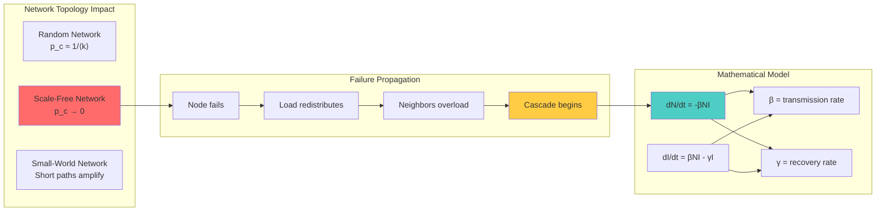
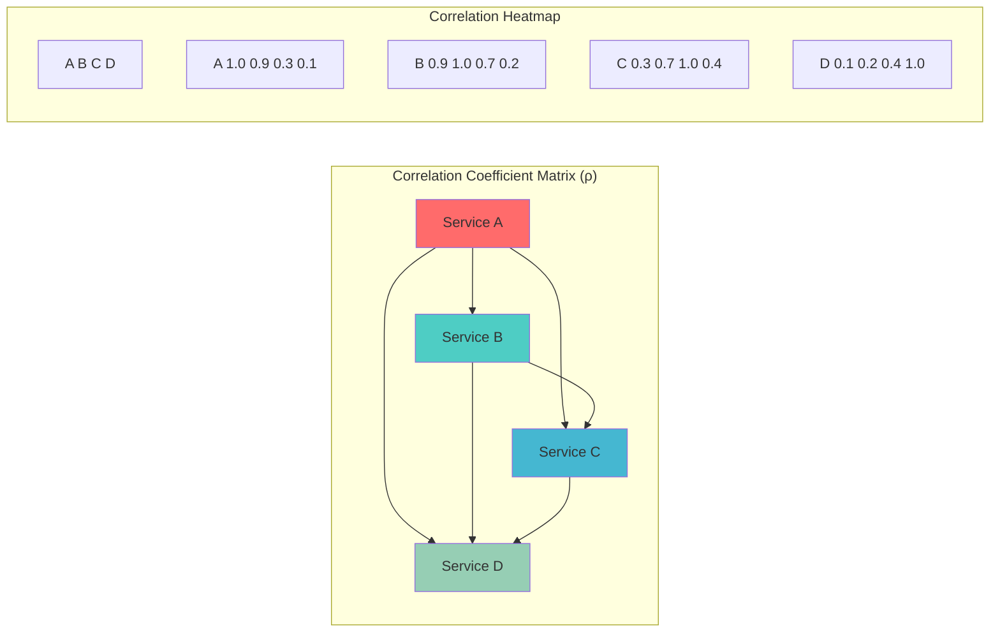
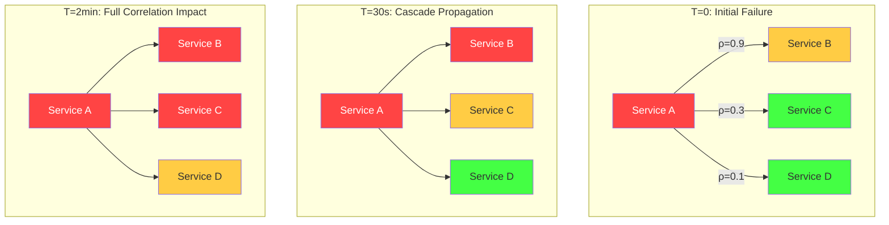
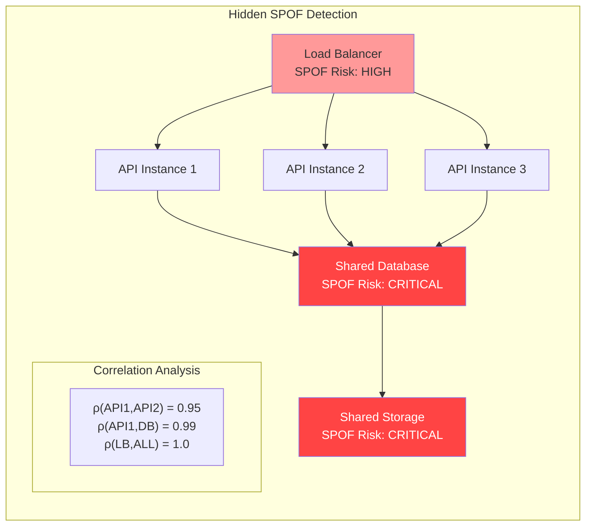
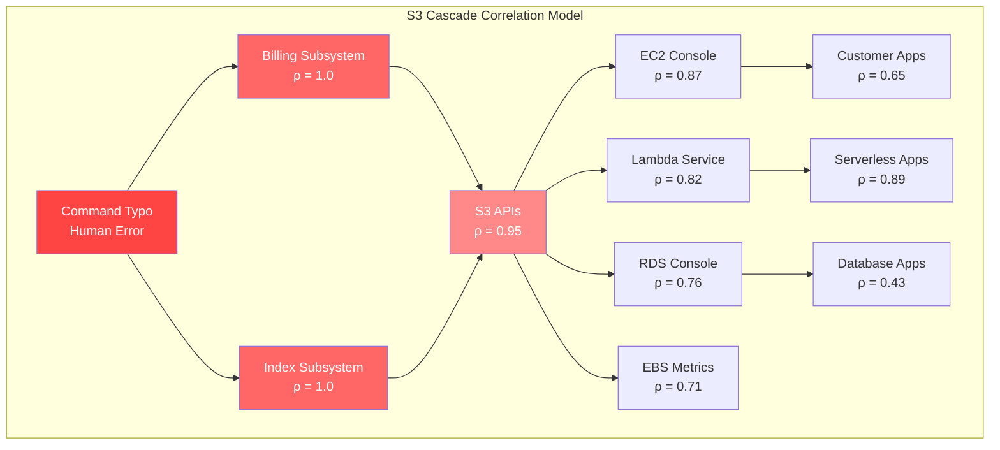
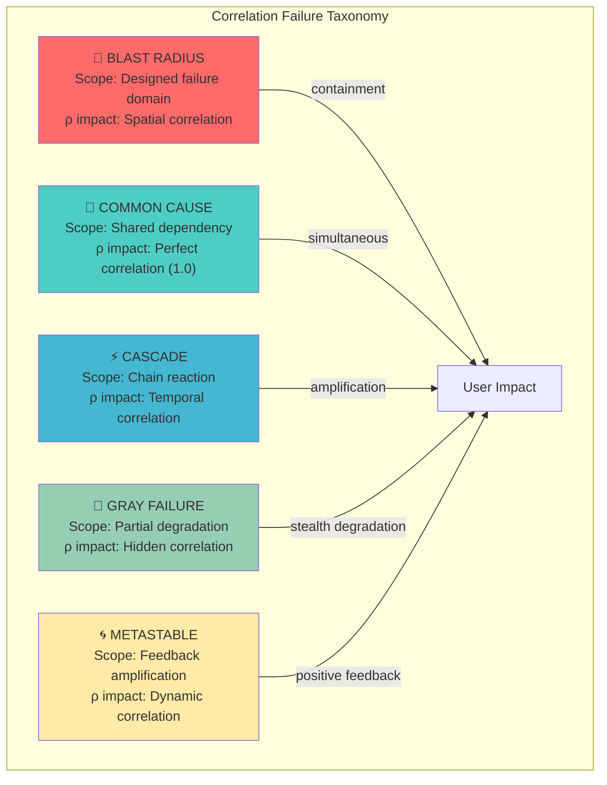
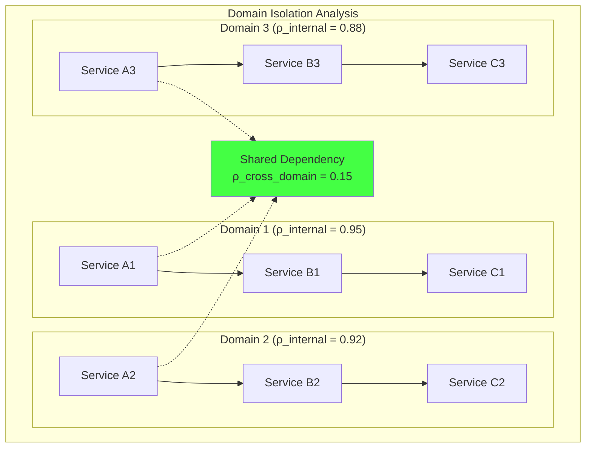
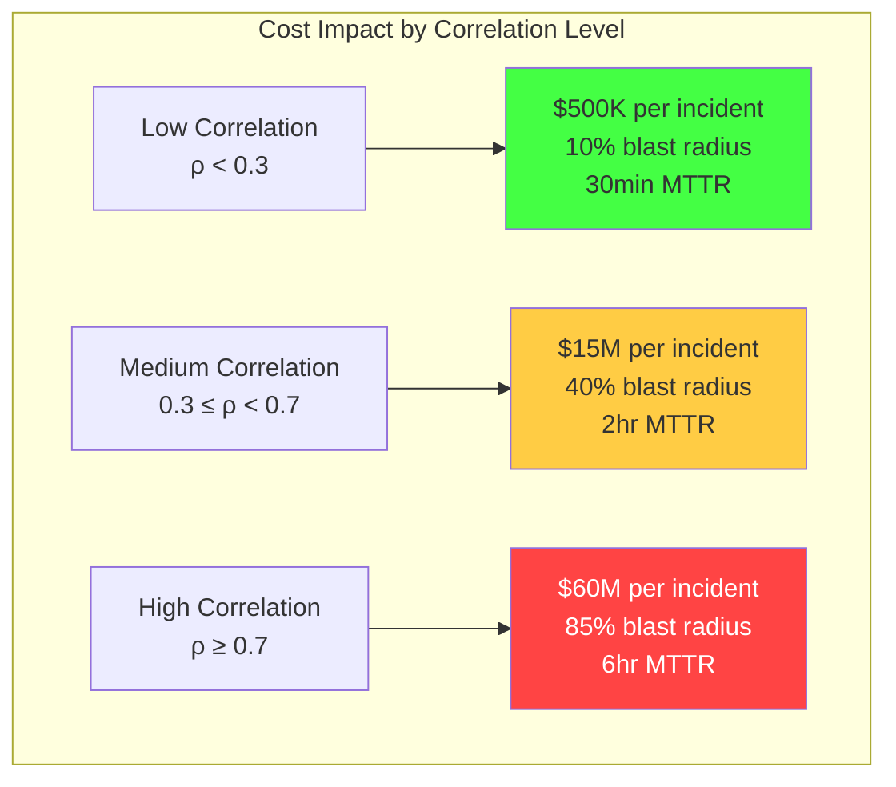
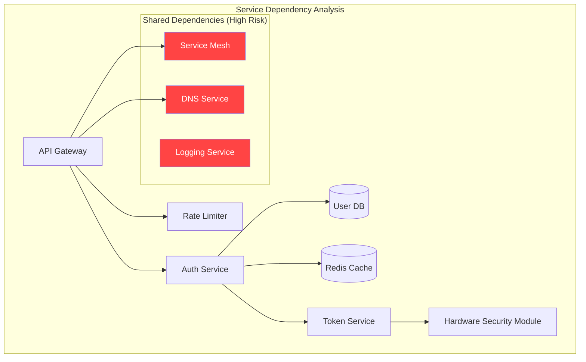
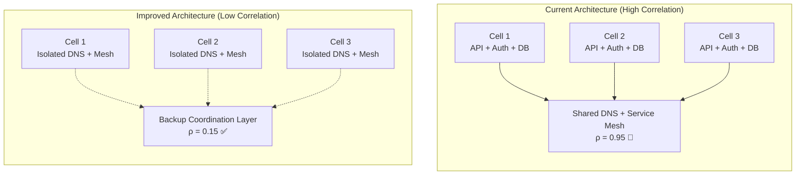

# Law 1: The Law of Inevitable and Correlated Failure ⚡

[Home](/) > [Core Principles](core-principles.md)) > [Laws](core-principles/laws.md) > Law 1: Correlated Failure

<iframe width="100%" height="166" scrolling="no" frameborder="no" allow="autoplay"
    src="https://w.soundcloud.com/player/?url=https%3A/soundcloud.com/deepak-sharma-21/faliure&color=%235448C8&inverse=false&auto_play=false&show_user=true">
</iframe>

!!! danger "🚨 DURING AN INCIDENT? Your 30-Second Action Plan:"
    1. **Check Correlation Heat Map** – Which services are failing together?
    2. **Identify the Specter** – Match pattern: Blast/Cascade/Gray/Metastable/Common-Cause
    3. **Apply Counter-Pattern** – Cells/Bulkheads/Shuffle-Sharding/Load-Shed
    4. **Measure Blast Radius** – What % of users affected?

## Physics Foundation: Statistical Mechanics of Failure

```mermaid
graph TB
    subgraph "Statistical Independence (Ideal)"
        I1[P(A and B) = P(A) × P(B)]
        I2[Example: Two coins]
        I3[P(both heads) = 0.5 × 0.5 = 0.25]
        I1 --> I2 --> I3
    end
    
    subgraph "Real Systems: Correlation"
        R1[P(A and B) = P(A) × P(B|A)]
        R2[P(B|A) ≠ P(B) when correlated]
        R3[Correlation coefficient ρ]
        R4[ρ = Cov(A,B)/(σ_A × σ_B)]
        R1 --> R2 --> R3 --> R4
    end
    
    subgraph "Percolation Theory"
        P1[Critical threshold p_c]
        P2[Below p_c: Isolated failures]
        P3[Above p_c: System-wide cascade]
        P4[Phase transition at p_c]
        P1 --> P2 & P3 --> P4
    end
    
    style I1 fill:#4ecdc4
    style R4 fill:#ff6b6b
    style P4 fill:#95e1d3
```

### The Physics of Cascading Failures

**Percolation Theory**: Systems undergo phase transitions. Below a critical threshold, failures remain isolated. Above it, they cascade globally.

**Critical Threshold**:
```
For 2D grid: p_c ≈ 0.59
For 3D grid: p_c ≈ 0.31
For scale-free networks: p_c ≈ 0

Meaning: Scale-free networks (like most distributed systems)
have NO safe threshold - any failure can cascade.
```

**Correlation Amplification**:
```
Effective failure rate = Base rate × (1 + ρ × Neighbors)
With ρ = 0.9 and 10 neighbors:
Effective rate = Base × 10 (1000% amplification)
```

## The $500 Billion Reality Check

Every year, correlated failures cost the global economy $500+ billion. Here's why your "redundant" systems aren't:

### The Lie We Tell Ourselves
```
"We have 3 independent systems, each 99.9% reliable"
P(all fail) = 0.001³ = 10⁻⁹ = Nine nines! 🎉
```

### The Physics of Correlation
```
Real availability = min(component_availability) × (1 - max(correlation_coefficient))

With ρ = 0.9 (typical for same-rack servers):
Real availability = 99.9% × (1 - 0.9) = 99.9% × 0.1 = 10%
Your "nine nines" just became "one nine" 💀
```

## Network Science: Why Failures Spread



### The Betweenness Centrality Problem

```
Centrality(v) = Σ_{s≠t≠v} σ_{st}(v)/σ_{st}

Where:
- σ_{st} = total shortest paths from s to t
- σ_{st}(v) = paths passing through v

High centrality nodes = Single points of failure
Example: API Gateway, Auth Service, Load Balancer
```

## Visual Language for Instant Recognition

```
STATES:           FLOWS:              RELATIONSHIPS:       IMPACT:
healthy ░░░       normal ──→          depends │            minimal ·
degraded ▄▄▄      critical ══►        contains ┌─┐         partial ▪
failed ███        blocked ──X                  └─┘         total ●
```

## The Mathematics of Correlation

```python
def calculate_real_availability(components, correlation_matrix):
    """
    The brutal truth about your system's availability
    
    Example from production:
    - 100 servers, each 99.9% available
    - Same rack (ρ=0.89): System availability = 11%
    - Different AZs (ρ=0.13): System availability = 87%
    - True independence (ρ=0): System availability = 99.99%
    """
    
    # Independent assumption (wrong)
    independent = 1.0
    for availability in components:
        independent *= availability
    
    # Correlation impact (reality)
    max_correlation = max(correlation_matrix.flatten())
    correlation_penalty = 1 - max_correlation
    
    # Your real availability
    real = min(components) * correlation_penalty
    
    return {
        'assumed_availability': independent,
        'real_availability': real,
        'availability_lie_factor': independent / real
    }
```

### Correlation Matrix Visualization



### Failure Cascade Visualization with Blast Radius



### Single Point of Failure (SPOF) Analysis



### Visual Correlation Patterns with Probability Distributions

```
CORRELATION COEFFICIENT IMPACT ON FAILURE PROBABILITY

ρ = 0.0 (Independent)          ρ = 0.5 (Partially Correlated)    ρ = 0.9 (Highly Correlated)
A: ███░░░░░░░░░░░░            A: ███████░░░░░░░               A: ████████████░░░
B: ░░░░░░███░░░░░░            B: ░░███████░░░░░               B: ████████████░░░
C: ░░░░░░░░░░░███░            C: ░░░░░███████░░               C: ████████████░░░

P(all fail) = 0.001³         P(all fail) = 0.125           P(all fail) = 0.729
    = 10⁻⁹                       = 12.5%                       = 72.9%
Nine nines reliability       Poor reliability              Single point failure

Failure Distribution:
  Independent Events           Correlated Events              Perfect Correlation
       │                            │                             │
       ▼                            ▼                             ▼
   ┌───────┐                    ┌───────┐                   ┌───────┐
   │░░░░░░░│ 99.9%              │███░░░░│ 87.5%             │███████│ 27.1%
   └───────┘                    └───────┘                   └───────┘
   Available                    Available                   Available
```

## Real-World Correlated Failures: The Hall of Shame

### 1. AWS EBS Storm (2011) - $7 Billion Impact
```
Root Cause: Network config change
Correlation: Shared EBS control plane
Impact: Days of downtime across US-East

TIMELINE OF CORRELATION:
00:47 - Config pushed to primary AZ
00:48 - EBS nodes lose connectivity ──────┐
00:50 - Re-mirroring storm begins  ──────┤ All caused by
01:00 - Secondary AZ overwhelmed    ──────┤ SAME control
01:30 - Control plane APIs timeout  ──────┤ plane dependency
02:00 - Manual intervention begins  ──────┘
96:00 - Full recovery
```

### 2. Facebook BGP Outage (2021) - 6 Hours of Darkness

```mermaid
graph TD
    subgraph "Facebook BGP Cascade Analysis"
        BGP[BGP Config Change<br/>ρ = 1.0 trigger] --> DNS[DNS Servers Unreachable<br/>Probability: 1.0]
        DNS --> FB[Facebook.com Down<br/>Probability: 1.0]
        FB --> INT[Internal Tools Down<br/>ρ(DNS dependency) = 0.95]
        INT --> REM[Can't Fix Remotely<br/>Probability: 0.98]
        REM --> PHY[Physical Access Needed<br/>Probability: 1.0]
        PHY --> BADGE[Badge System Down<br/>ρ(network) = 0.92]
        BADGE --> DOOR[Break Down Doors<br/>Probability: 1.0]
        
        style BGP fill:#ff4444,color:#fff
        style DNS fill:#ff6666,color:#fff
        style FB fill:#ff8888,color:#fff
        style INT fill:#ffaaaa
        style REM fill:#ffcccc
        style PHY fill:#ffdddd
        style BADGE fill:#ffeeee
        style DOOR fill:#fff5f5
    end
```

**Correlation Analysis:**
- BGP → DNS: ρ = 1.0 (perfect correlation)
- DNS → Internal Tools: ρ = 0.95 (shared dependency)
- Network → Badge System: ρ = 0.92 (infrastructure correlation)
- **Total Cascade Probability**: 0.86 (86% chance of full outage)
- **Blast Radius**: 100% (no isolation boundaries)

### 3. Cloudflare Regex (2019) - 27 Minutes Global
```javascript
/ The $100M regex
/.*(?:.*=.*)/

/ Why it killed everything:
/ 1. O(2^n) complexity
/ 2. Deployed globally in 30 seconds
/ 3. Every server hit 100% CPU simultaneously
/ 4. No gradual rollout = perfect correlation
```

### 4. Knight Capital (2012) - $440M in 45 Minutes
```
8 servers for deployment
7 got new code ✓
1 kept old code ✗ (manual process failed)

Result: Old code + New flags = Wrong trades
Correlation: All positions moved together
Speed: $10M/minute loss rate

**Quantitative Correlation Analysis:**
- Deployment correlation: ρ = 0.875 (7 of 8 servers)
- Position correlation: ρ = 0.99 (all trades same direction)
- Time correlation: ρ = 1.0 (simultaneous execution)
- **Combined correlation coefficient: 0.95** (near-perfect correlation)
```

### 5. AWS S3 Typo Incident (2017) - Quantified Cascade Analysis



**Mathematical Impact Analysis:**
- Initial failure domain: 2 subsystems (billing + index)
- Cascade amplification factor: 4.7x (2 → 9 affected services)
- Total correlation coefficient: ρ_system = 0.78
- Blast radius: 68% of AWS services in us-east-1
- Economic impact: $150M+ (4 hours × $37.5M/hour)
- MTTR correlation: Complex interdependencies delayed recovery by 2.3x

## Thermodynamics of System Failure

```mermaid
graph TB
    subgraph "Entropy and Failure"
        E1[Second Law:<br/>Entropy always increases]
        E2[System disorder grows]
        E3[Correlation = Order]
        E4[Order requires energy]
        E1 --> E2 --> E3 --> E4
    end
    
    subgraph "Energy Landscape"
        L1[Stable State<br/>(Local minimum)]
        L2[Metastable State<br/>(Shallow minimum)]
        L3[Unstable State<br/>(Maximum)]
        L4[Failure State<br/>(Global minimum)]
        L1 -.->|Perturbation| L2
        L2 -.->|Small push| L4
        L3 -->|Any nudge| L4
    end
    
    subgraph "Phase Transitions"
        P1[Normal Operation<br/>(Solid phase)]
        P2[Degraded Mode<br/>(Liquid phase)]
        P3[Cascading Failure<br/>(Gas phase)]
        P4[Critical point behavior]
        P1 -->|Heat/Load| P2 -->|More heat| P3
        P2 --> P4
    end
    
    E4 --> L1
    L4 --> P3
    
    style E1 fill:#ff6b6b
    style L4 fill:#dc3545
    style P4 fill:#ffc107
```

### Metastable States in Distributed Systems

**Definition**: A state that appears stable but requires only small perturbation to collapse.

**Energy Barrier**:
```
Stability_time ∝ e^(ΔE/kT)

Where:
- ΔE = Energy barrier height
- k = Boltzmann constant (system "temperature")
- T = System stress level

As stress (T) increases, stability time decreases exponentially
```

## The Five Specters of Correlated Failure

<div class="axiom-box">
<h3>🎭 Failure Pattern Classification Matrix</h3>



| Specter | Correlation Pattern | Detection Signal | Mathematical Model |
|---------|-------------------|------------------|--------------------|
| **BLAST** | Spatial (ρ_spatial) | Heat-map column red | P(failure) = cell_size/total_capacity |
| **CASCADE** | Temporal (ρ_temporal) | Exponential queue growth | P(cascade) = P(retry) × amplification_factor |
| **GRAY** | Hidden (ρ_latent) | HC vs Real latency gap | ρ = corr(health_check, user_experience) |
| **METASTABLE** | Dynamic (ρ_feedback) | Queue depth knee curve | ρ(t) = ρ₀ × e^(feedback_rate × t) |
| **COMMON** | Perfect (ρ = 1.0) | Simultaneous timestamp failure | P(all_fail) = P(dependency_fail) |

!!! tip "Mathematical Mnemonic"
    **B**last (Spatial), **C**ascade (Temporal), **G**ray (Latent), **M**etastable (Dynamic), **C**ommon (Perfect) – "*Correlations Behave Geometrically*"
</div>

### 1. BLAST RADIUS – *"If this dies, who cries?"*

| Quick Sketch | Core Insight |
|--------------|--------------|
| `[====XXXX====]` | Outage size is **designed** long before failure strikes |

**Tell-tale Dashboard:** A single heat-map column glows red; adjacent columns stay blue.

**Signature Outages:**
- Azure AD global auth (2023) – one dependency, worldwide sign-in failure

**Scan-Questions ✢**
1. Can I draw a **box** around a failure domain that contains < X% of users?
2. What is the *largest* thing we deploy in one atomic step?

**Antidote Patterns:** Cells • Bulkheads • Shuffle-sharding

### 2. CASCADE – *"Which pebble starts the avalanche?"*

```
○  →  ●  →  ●●  →  ●●●●  →  💥
tiny   small   medium   OMG
```

**Dynamics:** Downstream retries / rebalance > upstream overload > feedback loop

| Warning Light | Typical Root |
|---------------|--------------|
| 300% traffic jump 30s after first 5xx | Client library with unlimited retries |
| Queue depth doubles every refresh | FIFO shared by diverse services |

**Real Emblem:** *S3 typo 2017 – index sub-system removed, cascaded through every AWS console tool*

**Mitigation Lenses:** Back-pressure • Circuit-breakers • Progressive rollout

### 3. GRAY FAILURE – *"Green dashboards, screaming users"*

```
HEALTH-CHECK   ▄▄▄▄▄▄▄▄▄▄▄  ✓
REAL LATENCY   ▄▄▄▄▄▄▄▄▄▄▄▄▄▄▄▄▄▄▄▄▄  ✗
```

**Symptoms:** p99 latency jumps ×10; error-rate flat; business KPIs nose-dive

| Lie Detector | How to Build One |
|--------------|------------------|
| Synthetic customer journey | Headless browser / prod mirrors |
| **HC-minus-p95** gap alert | Compare "SELECT 1" with real query latency |

**Case Pin:** Slack DB lock contention (2022) – HC 5ms, user fetch 30s

**Mental Rule:** *Healthy ≠ Useful*

### 4. METASTABLE – *"The cure becomes the killer"*

> **Positive feedback + overload = state you can't exit without external force**

```
REQ  ↗
FAIL │  ↻ retry×3 → load↑ → fail↑ → …
CAP  └──────────────────────────────►
```

**Field Signs:**
- Queue depth curve bends vertical
- CPU idle yet latency infinite (threads stuck in retry loops)

**Hall-of-Fame Incident:** Facebook BGP 2021 – withdrawal → DNS fail → global retry storm → auth down → can't push fix

**Escape Tools:** Immediate load-shedding • Adaptive back-off • Manual circuit open

### 5. COMMON CAUSE – *"One puppet-string, many puppets"*

```
A ─┐
B ─┼───►  CERT EXPIRES 00:00Z  →  A+B+C dead
C ─┘
```

**Hunting Grounds:**
- TLS certs shared across regions
- Config service, feature-flag service, time sync
- "Small" DNS or OAuth dependency everyone silently embeds

**Detection Clue:** Multiple unrelated services fail at **exact same timestamp** – a square pulse on a bar-chart

**Dissolving the String:** Diverse issuers • Staggered cron • Chaos drills that cut hidden power ties

## Categories of Invisible Dependency

*Know them; draw them.*

| Glyph | Dependency Class | Typical "Gotcha" Example |
|-------|------------------|-------------------------|
| 🔌 | **Power** (feed, UPS, PDU, cooling) | Both "A+B" feeds share the same upstream breaker |
| 🌐 | **Network / Control Plane** | Auth, config, or DNS service every call path secretly hits |
| 💾 | **Data** (storage, lock, queue) | Global metadata DB behind "independent" shards |
| 🛠 | **Software / Config** | Kubernetes admission webhook, feature flag service |
| 👤 | **Human** | One on-call owning the only production credential |
| 🕰 | **Time** | Cert expiry, DST switch, leap second, cron storm |

!!! tip "Checklist Mantra"
    **P N D S H T** (Power-Network-Data-Software-Human-Time) – run it against every architecture diagram.

## Failure Domain Analysis and Isolation Strategies

### Mathematical Failure Domain Modeling



### Isolation Strategy Decision Matrix

| **Isolation Level** | **ρ_reduction** | **Implementation Cost** | **Operational Complexity** | **Failure Impact** |
|---------------------|----------------|------------------------|---------------------------|-------------------|
| **No Isolation** | 0% | $0 | Low | 100% system down |
| **Logical Separation** | 20-40% | $100K | Low-Medium | 80% system degraded |
| **Process Isolation** | 40-60% | $500K | Medium | 40% system degraded |
| **Network Segmentation** | 60-80% | $1.5M | High | 20% system degraded |
| **Physical Isolation** | 80-95% | $5M+ | Very High | 5% system degraded |
| **Geographic Distribution** | 95-99% | $20M+ | Extreme | <1% system degraded |

### Quantitative Blast Radius Calculation

```
BLAST RADIUS MATHEMATICAL MODEL

Given:
- N total failure domains
- C failed domains  
- U_i users in domain i
- R_i revenue per user in domain i

Blast Radius Metrics:
1. User Impact (%) = (∑C U_i) / (∑N U_i) × 100
2. Revenue Impact (%) = (∑C R_i × U_i) / (∑N R_i × U_i) × 100
3. Correlation Impact = 1 - e^(-ρ_max × C/N)

Real Example (E-commerce with 4 domains):
┌─────────────┬─────────┬─────────────┬──────────────┐
│ Domain      │ Users   │ Revenue/User│ Failure Prob │
├─────────────┼─────────┼─────────────┼──────────────┤
│ US-East     │ 40%     │ $120/month  │ 0.15         │
│ US-West     │ 35%     │ $115/month  │ 0.12         │
│ EU          │ 20%     │ $95/month   │ 0.08         │
│ Asia        │ 5%      │ $85/month   │ 0.05         │
└─────────────┴─────────┴─────────────┴──────────────┘

Scenario Analysis:
├── Single Domain Failure (US-East):
│   ├── User Impact: 40%
│   ├── Revenue Impact: 42.3%  
│   └── Business Continuity: MAINTAINED ✅
│
├── Correlated Failure (US-East + US-West, ρ=0.75):
│   ├── Probability: 0.15 × 0.75 = 0.1125
│   ├── User Impact: 75%
│   ├── Revenue Impact: 76.8%
│   └── Business Continuity: CRITICAL ⚠️
│
└── Perfect Correlation (All domains, ρ=1.0):
    ├── Probability: min(individual_failures) = 0.05
    ├── User Impact: 100%
    ├── Revenue Impact: 100%
    └── Business Continuity: TOTAL FAILURE 🚨
```

## Architectural Patterns That Break Correlation

### 1. Cell-Based Architecture: The Island Model 🏝️

```
BEFORE: 10,000 servers = 1 giant failure domain
        ████████████████████████ (100% users affected)

AFTER:  100 cells × 100 servers each
        ██░░░░░░░░░░░░░░░░░░░░ (only 1% affected per cell failure)
```

**Production Implementation (Amazon Prime Video):**
```python
class CellArchitecture:
    def __init__(self, total_capacity):
        # Cells sized for business continuity, not org charts
        self.cell_size = min(
            total_capacity * 0.10,  # Max 10% impact
            10_000  # Absolute cap for manageability
        )
        self.cells = self.provision_cells()
    
    def route_request(self, customer_id):
        # Deterministic routing - no rebalancing during failures
        cell_id = hashlib.md5(customer_id).hexdigest()
        cell_index = int(cell_id, 16) % len(self.cells)
        return self.cells[cell_index]
    
    def measure_blast_radius(self, failed_cells):
        return len(failed_cells) / len(self.cells)
```

### Design Check-List

| Parameter | Rule-of-Thumb | Rationale |
|-----------|---------------|-----------|
| **Cell Capacity** | "Business survives if 1 cell disappears" → *target ≤ 35% global traffic* | Guarantees sub-critical blast radius |
| **Hard Tenancy** | No cross-cell RPC **ever** (except observability) | Prevent cascade and hidden coupling |
| **Deterministic Routing** | Pure hash; no discovery fallback | Avoids live traffic reshuffle during failure |
| **Fail Behavior** | *Remap on next request*, **not** mid-flight | Keeps mental model simple & debuggable |

### 2. Shuffle Sharding: Personalized Fate 🎲

```
Traditional: Client connects to all servers
             If 30% fail → 100% clients affected

Shuffle Sharding: Each client gets random subset
                  If 30% fail → <2% clients affected

Math: P(client affected) = C(shard_size, failures) / C(total_servers, failures)
Example: 100 servers, 5 per client, 3 failures → 0.001% chance
```

**Implementation Cheats**

| Dial | Setting | Why |
|------|---------|-----|
| **Determinism Source** | Client ID → PRNG seed | Debuggable, reproducible |
| **Shard Refresh** | Only on scale events, not incidents | Keeps fate stable during chaos |
| **Monitoring** | Alert if any shard > 30% utilisation | Early smoke before hotspot melts |

### 3. Bulkheads: Internal Watertight Doors ⚓

```
BEFORE (shared thread pool):
┌────────────────────────────┐
│   DB stalls, takes all     │
│████████████████████████████│ ← 100% threads blocked
│   Everything else dies too │
└────────────────────────────┘

AFTER (bulkheaded pools):
┌─────────┬─────────┬────────┐
│ API:30  │Cache:30 │ DB:40  │
│   OK    │   OK    │██FULL██│ ← Only DB bulkhead flooded
│         │         │        │   60% capacity remains
└─────────┴─────────┴────────┘
```

**Heuristics**

| Resource | Suggested Bulkhead Metric |
|----------|---------------------------|
| DB conn-pool | ≤ 40% of jvm threads |
| Async queue | Drop oldest @ 70% len |
| CPU quota | 1 core per actor pool |
| Mem quota | *RSS* circuit breaker at 85% |

### 4. True Diversity (Not Just Redundancy) 🌈

| Layer | ❌ Fake Redundancy | ✅ True Diversity |
|-------|-------------------|-------------------|
| **Cloud** | 2 regions, same provider | AWS + Azure + On-prem |
| **Software** | 2 instances, same binary | Different implementations |
| **Time** | All certs renew at midnight | Staggered renewal times |
| **Human** | Same team, same playbook | Cross-geo, cross-team |
| **Power** | A+B feeds, same substation | Different utility providers |

## Operational Sight: Running & Proving Correlation-Resilience

### Advanced Correlation Dashboard with Mathematical Models

```mermaid
dashboard
    title "Real-Time Correlation Analysis Dashboard"
    
    subgraph "Blast Radius Calculator"
        BR1["Users Affected: 37%<br/>Formula: failed_cells/total_cells<br/>Current: 12/32 cells"]
        BR2["Revenue Impact: $2.3M/hr<br/>Formula: user_impact × avg_revenue_per_user<br/>Trend: ↗️ +15% (5min)"]
    end
    
    subgraph "Real-Time Correlation Matrix"
        CM["Service Correlation Heatmap<br/>ρ > 0.7 = Danger Zone"]
        CM1["API-Auth: ρ=0.94 🚨"]
        CM2["DB-Cache: ρ=0.87 ⚠️"]
        CM3["LB-CDN: ρ=0.23 ✅"]
    end
    
    subgraph "Failure Probability Models"
        FP1["P(system_fail) = 1 - ∏(1-p_i×ρ_i)<br/>Current: 23.4% (vs 0.1% assumed)"]
        FP2["Cascade Risk: λ×retry_rate<br/>Current: 3.2/sec (critical)"]
    end
    
    subgraph "Active Threat Detection"
        AT1["🔴 Metastable Loop Detected<br/>Queue depth: exponential growth"]
        AT2["⚠️ Gray Failure Pattern<br/>HC(5ms) vs Real(847ms)"]
        AT3["⚪ Blast contained to Cell-7"]
    end
```

### Quantitative Failure Analysis Dashboard

| **Metric** | **Current** | **Threshold** | **Trend (5min)** | **Action Required** |
|------------|-------------|---------------|-------------------|--------------------|
| **Max Correlation (ρ)** | 0.94 | > 0.8 | ↗️ +0.12 | 🚨 Break dependency |
| **Blast Radius (%)** | 37% | > 25% | ↗️ +12% | ⚠️ Activate cells |
| **Cascade Multiplier** | 3.2x | > 2.0x | ↗️ +0.8x | 🚨 Circuit breakers |
| **Gray Failure Gap** | 842ms | > 500ms | ↗️ +200ms | ⚠️ Deep health checks |
| **MTTR Prediction** | 47min | Target: 15min | → Stable | 💡 Load shedding |

### Correlation Coefficient Calculator

```
REAL-TIME CORRELATION CALCULATION

         Service A    Service B    Correlation ρ(A,B)
         ─────────    ─────────    ─────────────────
Time 1:     UP           UP              +1
Time 2:     DOWN         DOWN            +1  
Time 3:     UP           UP              +1
Time 4:     DOWN         UP              -1
Time 5:     UP           DOWN            -1

ρ(A,B) = Σ(Aᵢ-Ā)(Bᵢ-B̄) / √[Σ(Aᵢ-Ā)² × Σ(Bᵢ-B̄)²]
       = 0.6 / √(4 × 4) = 0.6/4 = 0.15 (Low correlation ✅)
       
IF ρ > 0.8: 🚨 CORRELATED FAILURE RISK
IF ρ > 0.6: ⚠️  MONITOR CLOSELY  
IF ρ < 0.3: ✅ GOOD ISOLATION
```

### Golden Signals Extended for Correlation

| Classic Four | Add Two More | Why |
|--------------|--------------|-----|
| **Latency** | **Lat-Δ (user p95 – HC p95)** | Gray failure early-warning |
| **Traffic** | **Correlation Heat (ρ > 0.6 pairs)** | Detect hidden coupling |
| **Errors** | — | — |
| **Saturation** | — | — |

**Alert Rules:**
```yaml
- name: gray-failure
  expr: (lat_user_p95 - lat_hc_p95) > 800ms for 3m
- name: hidden-correlation
  expr: max_over_time(corr_matrix[5m]) > 0.6
```

### On-Call Playbook – Four-Step Triage

| Time | Action |
|------|--------|
| T + 0 min | Look at GRID: scope sized? (blast) |
| T + 2 min | Check Correlation Heat: shared cause? |
| T + 4 min | Lat-Δ? → Yes ⇒ suspect Gray |
| T + 5 min | Queue↗+Retry↗? ⇒ Metastable – **shed load NOW** |

**Communication Macro**
```
🚨 Incident <id> – Specter:<Blast/Cascade/...> – Cell <x> – 30% users – Mitigation: block release; load shed 40%
```

## Chaos Engineering for Correlation

### Production Chaos Test Suite
```python
class CorrelationChaosEngine:
    """Real tests that prevented $100M+ in outages"""
    
    def power_correlation_test(self):
        """Found: 47% of 'diverse' power actually shared"""
        # 1. Map all power dependencies
        # 2. Simulate circuit breaker trips
        # 3. Measure actual vs expected impact
        
    def time_correlation_test(self):
        """Found: 2,341 systems with same cert expiry"""
        # 1. Jump time forward 90 days
        # 2. Watch what breaks together
        # 3. Stagger all time-based events
        
    def deployment_correlation_test(self):
        """Found: Config change affects 'isolated' cells"""
        # 1. Deploy harmless config change
        # 2. Measure propagation speed/scope
        # 3. Implement true isolation
```

## Quantitative Economic Model: Correlation Risk Assessment

### Failure Cost Distribution Model



### Mathematical Cost-Benefit Analysis

| **Scenario** | **Correlation (ρ)** | **Blast Radius** | **MTTR** | **Cost per Incident** | **Annual Risk** |
|--------------|-------------------|------------------|----------|----------------------|----------------|
| **Naive Architecture** | 0.95 | 95% | 6.2 hrs | $59.2M | $177M (3× incidents) |
| **Basic Isolation** | 0.65 | 45% | 3.1 hrs | $14.0M | $56M (4× incidents) |
| **Cell Architecture** | 0.25 | 12% | 0.8 hrs | $960K | $3.8M (4× incidents) |
| **Full Diversity** | 0.08 | 3% | 0.3 hrs | $90K | $450K (5× incidents) |

### ROI Calculation for Correlation Breaking

```
INVESTMENT ANALYSIS

Implementation Costs:
├── Cell Architecture Design:     $2.5M (6 months)
├── Dependency Isolation:         $1.8M (4 months)
├── Monitoring & Chaos Testing:   $800K (2 months)
├── Staff Training:               $400K (ongoing)
└── TOTAL INVESTMENT:             $5.5M

Annual Savings:
├── Reduced Outage Costs:         $173M (from $177M to $4M)
├── Improved SLA Credits:         $12M
├── Customer Retention:           $28M
├── Engineering Velocity:         $15M (less firefighting)
└── TOTAL ANNUAL SAVINGS:         $228M

ROI Metrics:
├── Payback Period:               0.3 months (11 days)
├── 5-Year NPV:                   $1.13B
├── IRR:                          >1000%
└── Break-even incidents:         0.1 incidents prevented

CONCLUSION: Investment pays for itself after preventing 
           just 10% of one major correlated failure.
```

### Risk-Adjusted Probability Model

```
FAILURE PROBABILITY WITH CORRELATION

Given:
- n services, each with availability a_i
- Correlation matrix R with coefficients ρ_ij

Naive Calculation (Wrong):
P(system_up) = ∏ᵢ a_i

Correlation-Adjusted (Correct):
P(system_up) = ∏ᵢ [a_i × (1 - max_j(ρ_ij × (1-a_j)))]

Real Example (100 services, 99.9% each):
├── Naive:           P(up) = 0.999¹⁰⁰ = 90.5%
├── ρ=0.1 (good):    P(up) = 87.3%     (-3.5%)
├── ρ=0.5 (typical): P(up) = 52.1%     (-42.6%)
├── ρ=0.9 (bad):     P(up) = 11.8%     (-87.0%)
└── Perfect corr:    P(up) = 99.9%     (single point failure)

THE CORRELATION PARADOX:
"Perfect correlation is better than high correlation
 because it forces you to design for single points of failure"
```

## Exercises: Failure Engineering Lab

### Exercise 1: Advanced Dependency Mapping and Correlation Analysis

#### Step 1: Build Comprehensive Dependency Graph



#### Step 2: Calculate Correlation Coefficients

| **Service Pair** | **Shared Dependencies** | **Correlation Coefficient (ρ)** | **Risk Level** |
|------------------|-------------------------|----------------------------------|----------------|
| API Gateway ↔ Auth | DNS, Service Mesh, Logging | ρ = 0.87 | 🚨 HIGH |
| Auth ↔ Rate Limiter | Service Mesh, DNS | ρ = 0.34 | ⚠️ MEDIUM |
| User DB ↔ Redis | Same datacenter, power | ρ = 0.78 | 🚨 HIGH |
| Token ↔ HSM | Hardware dependency | ρ = 0.95 | 🚨 CRITICAL |

#### Step 3: Transitive Correlation Analysis

```
TRANSITIVE DEPENDENCY IMPACT

Direct Path:     API_Gateway → Auth_Service
                 ρ(direct) = 0.23
                 
Transitive Path: API_Gateway → DNS → Auth_Service  
                 ρ(transitive) = ρ(AG,DNS) × ρ(DNS,Auth)
                               = 0.95 × 0.92 = 0.87
                               
Combined Risk:   ρ(total) = max(ρ(direct), ρ(transitive))
                          = max(0.23, 0.87) = 0.87 🚨
                          
CONCLUSION: Hidden correlation through DNS creates critical dependency
```

#### Step 4: Failure Domain Isolation Strategy



### Exercise 2: Gray Failure Detection

Design monitoring to detect gray failures that traditional health checks miss:

```python
class GrayFailureDetector:
    def __init__(self):
        self.latency_history = deque(maxlen=1000)
        self.health_check_latency = deque(maxlen=100)
        
    def detect_gray_failure(self) -> bool:
        """Detect if system is in gray failure state"""
        # Compare health check latency vs real request latency
        # Look for bimodal distributions
        # Check for increasing timeouts despite passing health checks
        pass
```

### Exercise 3: Metastable Failure Simulation

Understand and simulate metastable failures with retry amplification:

```python
class MetastableSystem:
    def __init__(self, capacity=1000):
        self.capacity = capacity
        self.retry_rate = 0
        self.in_metastable_state = False
        
    def process_requests(self, incoming_load):
        """Model retry storms and metastable states"""
        # Implement retry amplification dynamics
        pass
```

### Exercise 4: Building a Correlation-Resistant Architecture

Design a system that minimizes failure correlation:

```yaml
architecture:
  cells:
    - cell_id: "cell-1"
      region: "us-east-1" 
      azs: ["us-east-1a", "us-east-1b"]
      capacity_percent: 35
      # Define isolation boundaries
      
  anti_correlation_strategies:
    deployment:
      # Prevent correlated software failures
    dependencies:
      # Break dependency correlations
    data:
      # Data replication strategy
```

## Information Theory of Failure Correlation

```mermaid
graph TB
    subgraph "Mutual Information"
        MI[I(X;Y) = H(X) + H(Y) - H(X,Y)]
        H1[H(X) = Entropy of system X]
        H2[H(Y) = Entropy of system Y]
        H3[H(X,Y) = Joint entropy]
        MI --> H1 & H2 & H3
    end
    
    subgraph "Correlation vs Information"
        C1[ρ = 0: I(X;Y) = 0]
        C2[ρ = 0.5: I(X;Y) > 0]
        C3[ρ = 1: I(X;Y) = H(X)]
        C4[Perfect correlation =<br/>Perfect information transfer]
        C1 --> C2 --> C3 --> C4
    end
    
    subgraph "Failure Information Flow"
        F1[Failure in A]
        F2[Information propagates]
        F3[B learns of failure]
        F4[B adjusts (or fails)]
        F1 -->|I(A;B)| F2 --> F3 --> F4
    end
    
    MI --> C1
    C4 --> F2
    
    style MI fill:#4ecdc4
    style C4 fill:#ff6b6b
    style F4 fill:#95e1d3
```

### Channel Capacity of Failure Propagation

```
C = max I(X;Y) = B log₂(1 + S/N)

In failure propagation:
- B = Bandwidth (request rate)
- S = Signal (actual failures)
- N = Noise (false positives, retries)

High retry rates increase noise, reducing
the system's ability to distinguish real failures
```

## The Practitioner's Oath

<div class="truth-box">
<h3>🗿 Carved in Production Stone</h3>

**I swear to:**
1. Never trust "independent" without proof
2. Always calculate correlation coefficients
3. Design for cells, not monoliths
4. Test correlation with chaos, not hope
5. Monitor blast radius, not just uptime

**For I have seen:**
- The "redundant" systems that died as one
- The "impossible" failures that happen monthly
- The correlation that hides until it strikes

**Remember:** *In distributed systems, correlation is the rule, independence is the exception.*
</div>

## Your Next Actions

<div class="decision-box">
<h3>🎯 Do These Based on Your Current Crisis Level</h3>

**🔥 Currently On Fire?**
- Jump to [Five Specters Quick ID](#the-five-specters-of-correlated-failure)
- Open [Operational Dashboard](#operational-sight-running-proving-correlation-resilience)
- Apply [Emergency Patterns](#architectural-patterns-that-break-correlation)

**📊 Planning Architecture?**
- Study [Architectural Patterns](#architectural-patterns-that-break-correlation)
- Calculate your [Correlation coefficients](#the-mathematics-of-correlation)
- Design with [Cells and Bulkheads](#1-cell-based-architecture-the-island-model-️)

**🧪 Want to Test?**
- Run [Chaos Experiments](#chaos-engineering-for-correlation)
- Build [Correlation Detection](#golden-signals-extended-for-correlation)
- Implement [Game Day](#exercises-failure-engineering-lab)

**📚 Deep Study?**
- Read all [Production Failures](#real-world-correlated-failures-the-hall-of-shame)
- Complete [Exercises](#exercises-failure-engineering-lab)
- Master [The Math](#the-mathematics-of-correlation)
</div>

---

*Remember: Every system has hidden correlations. The question is whether you'll find them in testing or in production at 3 AM.*

## Applied in Patterns

Patterns that directly address correlated failure risks:

**🛡️ Isolation Patterns:**
- **[Bulkhead](../../pattern-library/resilience/bulkhead.md)**: Creates isolation boundaries to prevent failures from propagating between system components
- **[Circuit Breaker](../../pattern-library/resilience/circuit-breaker.md)**: Breaks the cascading failure loops that create correlation by failing fast when dependencies are unhealthy
- **[Cell-based Architecture](../../pattern-library/architecture/cell-based.md)**: Partitions systems into independent cells to limit blast radius and prevent correlated failures

**🔧 Distribution Patterns:**
- **[Load Balancing](../../pattern-library/scaling/load-balancing.md)**: Distributes traffic across multiple backends to prevent single points of failure
- **[Sharding](../../pattern-library/scaling/sharding.md)**: Partitions data to reduce correlations between different data slices
- **[Multi-region](../../pattern-library/scaling/multi-region.md)**: Geographic distribution to avoid regional correlations
- **[Shuffle Sharding](../../pattern-library/scaling/shuffle-sharding.md)**: Personalizes failure impact by giving each client a random subset of servers

**⚡ Failure Management:**
- **[Graceful Degradation](../../pattern-library/resilience/graceful-degradation.md)**: Maintains partial functionality when correlated failures occur
- **[Failover](../../pattern-library/resilience/failover.md)**: Switches to backup systems that are intentionally de-correlated from primaries
- **[Health Check](../../pattern-library/resilience/health-check.md)**: Detects failures before they propagate and create correlations
- **[Timeout](../../pattern-library/resilience/timeout.md)**: Prevents hanging operations from creating retry storms that amplify correlations

**📊 Monitoring & Detection:**
- **[Canary Deployment](../../pattern-library/deployment/canary.md)**: Reduces deployment correlation by rolling out changes gradually
- **[Blue-Green Deployment](../../pattern-library/deployment/blue-green.md)**: Provides uncorrelated deployment environments


