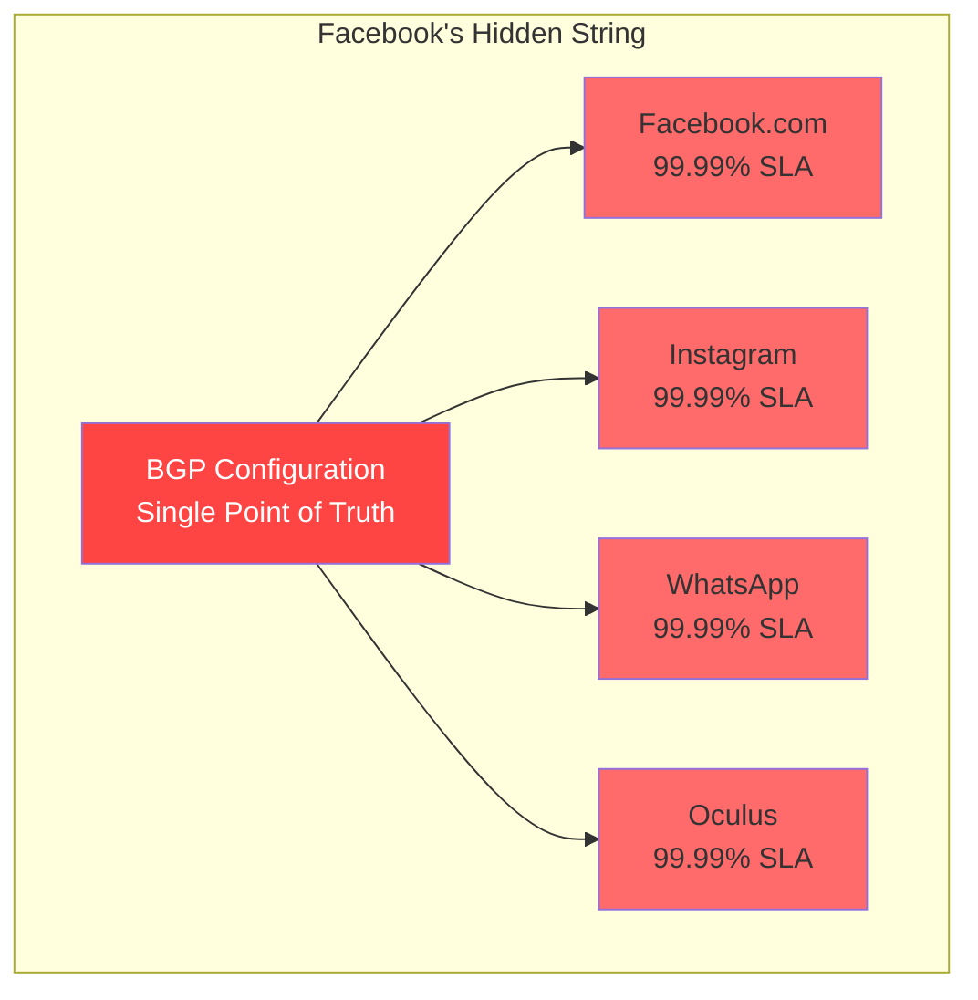
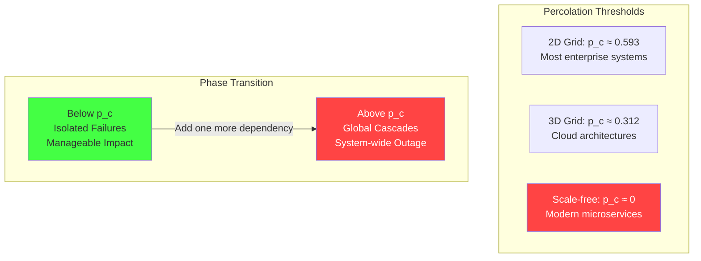
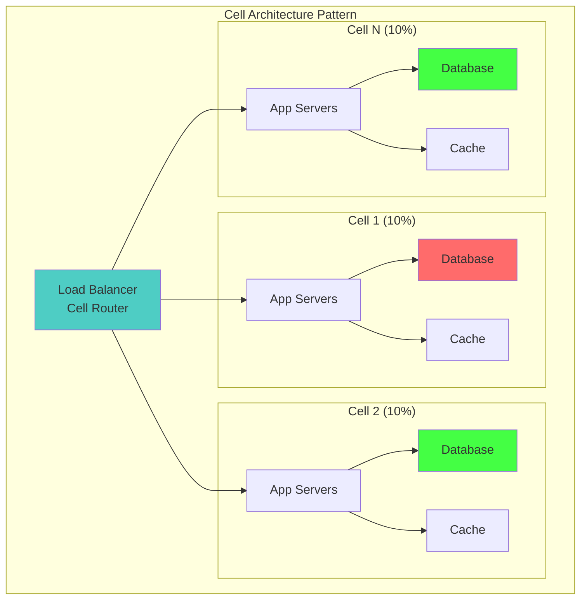

# Law 1: The Law of Inevitable and Correlated Failure
*Structured Learning Path: The Apex Learner's Protocol*

## 🧠 Learning Architecture Overview

**Core Truth**: In distributed systems, component failures are never truly independent - they cluster, cascade, and correlate in ways that multiply risk exponentially.

### 8 Minimum Learnable Units (MLUs):
1. **Independence vs Correlation** - The mathematical foundation
2. **Shared Dependencies** - The hidden strings that connect failures  
3. **Blast Radius Calculation** - Quantifying spatial impact
4. **Percolation Theory** - When isolated failures become cascades
5. **Cell Architecture** - The island model defense
6. **Bulkhead Pattern** - Internal watertight compartments
7. **Correlation Matrices** - Mathematical measurement tools
8. **Gray Failure Detection** - The stealth degradation specter

---

## 🚀 Focus Block 1: "The Domino Illusion" (15 min)
*MLU-1: Understanding Independence vs Correlation*

### Priming Question
**Stop and think**: In probability theory, what does "independent" actually mean? Write down your definition before reading further.

### The Core Deception

Like dominoes in a factory, we arrange our systems for independence, but hidden coupling means one stumble topples entire production lines.

```mermaid
graph TB
    subgraph "The Independence Illusion"
        I1[What We Assume<br/>P(A ∩ B) = P(A) × P(B)]
        R1[What Actually Happens<br/>P(A ∩ B) = P(A) × P(B|A)]
        
        I2[P(both fail) = 0.001²<br/>= 10⁻⁶ (one in million)]
        R2[P(both fail) = 0.001 × 0.9<br/>= 9×10⁻⁴ (900× higher)]
        
        I1 --> I2
        R1 --> R2
        
        style I2 fill:#4ecdc4
        style R2 fill:#ff6b6b
    end
```

### The Mathematical Foundation

**Correlation coefficient (ρ)** measures how failures cluster:
- ρ = 0: Perfect independence (theoretical)
- ρ = 1: Perfect correlation (disaster)
- ρ = 0.6-0.95: Reality in production systems

```python
import numpy as np

def calculate_real_failure_probability(p_individual: float, correlation: float) -> dict:
    """
    The brutal truth about correlated failures
    """
    # What we assume (independence)
    naive_both_fail = p_individual ** 2
    
    # What actually happens (correlation)
    real_both_fail = p_individual * (p_individual + correlation * (1 - p_individual))
    
    # The disaster multiplier
    reality_multiplier = real_both_fail / naive_both_fail if naive_both_fail > 0 else float('inf')
    
    return {
        'naive_probability': naive_both_fail,
        'real_probability': real_both_fail, 
        'disaster_multiplier': reality_multiplier
    }

# Example: Two 99.9% reliable services
result = calculate_real_failure_probability(0.001, 0.9)
print(f"Naive: {result['naive_probability']:.2e}")
print(f"Reality: {result['real_probability']:.2e}")  
print(f"You're {result['disaster_multiplier']:.0f}x more screwed than you think")
```

**Output**: You're 900x more screwed than you think.

### Neural Bridge: The Domino Factory

Imagine a domino factory where workers think they're setting up independent displays, but underground cables secretly connect everything. When one display falls, the cables yank others down. **Your "99.9% reliable" systems become 10% reliable the moment correlation exceeds 0.9.**

### Foreshadowing Hook
"But what are these underground cables in our systems? That's what we'll discover next..."

---

## 🔄 Consolidation Prompt 1 (5-10 min)
**PAUSE HERE.** Step away from the screen. Let your brain process how failures connect.

Walk around. Let the domino metaphor sink in. When you return, you'll explore the hidden strings that create correlation.

---

## 🧩 Retrieval Gauntlet 1

**Tier 1 (Recall)**: Define correlation in your own words without looking back.

**Tier 2 (Application)**: Given 3 services sharing a database, each with 99.9% availability, and correlation coefficient 0.8, calculate the real system availability.

**Tier 3 (Creation)**: Design a simple example of correlated failure in your current system. What's the "underground cable"?

---

## 🔗 Focus Block 2: "The Hidden Strings" (18 min)  
*MLU-2: Shared Dependencies Concept*

### Priming: Real-World Catastrophe

**Facebook BGP Outage (October 4, 2021)**: A single BGP configuration update took down Facebook, Instagram, WhatsApp, and Oculus simultaneously for 6 hours. **Cost: $60 million per hour.**

The shared dependency? BGP route announcements - the "underground cable" that connected everything.



### Types of Shared Dependencies

| Dependency Type | Correlation Level | Example | Detection Signal |
|----------------|-------------------|---------|------------------|
| **Infrastructure** | ρ = 0.95 | Same rack/datacenter | Geographic failure patterns |
| **Network** | ρ = 0.89 | BGP, DNS | Simultaneous connectivity loss |
| **Software** | ρ = 0.87 | Shared libraries, OS | Version-specific failures |
| **Configuration** | ρ = 0.78 | Config management | Deployment-triggered failures |
| **Human** | ρ = 0.65 | On-call engineer | Time-of-day failure patterns |

### Production Reality Check

```python
class SharedDependencyAnalyzer:
    """
    Map the hidden strings in your system
    Used by Netflix, Amazon, Google to prevent BGP-style disasters
    """
    
    def __init__(self):
        # Production correlation constants
        self.SAME_RACK_CORRELATION = 0.95
        self.SAME_AZ_CORRELATION = 0.45  
        self.SAME_REGION_CORRELATION = 0.23
        self.SHARED_LIBRARY_CORRELATION = 0.87
        self.SHARED_CONFIG_CORRELATION = 0.78
        
    def calculate_dependency_risk(self, services: list, dependency_type: str) -> dict:
        """
        Calculate blast radius for shared dependencies
        """
        correlation_map = {
            'rack': self.SAME_RACK_CORRELATION,
            'az': self.SAME_AZ_CORRELATION, 
            'region': self.SAME_REGION_CORRELATION,
            'library': self.SHARED_LIBRARY_CORRELATION,
            'config': self.SHARED_CONFIG_CORRELATION
        }
        
        correlation = correlation_map.get(dependency_type, 0.5)
        num_services = len(services)
        
        # If dependency fails, all correlated services likely fail
        blast_radius = correlation * num_services / num_services  # Percentage affected
        
        # Economic calculation
        base_cost_per_service = 1000000  # $1M per service outage
        total_risk = blast_radius * num_services * base_cost_per_service
        
        return {
            'dependency_type': dependency_type,
            'correlation_coefficient': correlation,
            'services_at_risk': num_services,
            'blast_radius_percent': blast_radius * 100,
            'economic_risk_usd': total_risk,
            'mitigation_priority': 'CRITICAL' if correlation > 0.8 else 'HIGH' if correlation > 0.5 else 'MEDIUM'
        }

# Example: E-commerce platform analysis
analyzer = SharedDependencyAnalyzer()

# Services sharing a database
services = ['user-service', 'order-service', 'payment-service', 'inventory-service']
db_risk = analyzer.calculate_dependency_risk(services, 'library')

print(f"Dependency Risk Analysis:")
print(f"Correlation: {db_risk['correlation_coefficient']}")
print(f"Economic Risk: ${db_risk['economic_risk_usd']:,}")
print(f"Priority: {db_risk['mitigation_priority']}")
```

### Emotional Relevance Prompt

**Personal Reflection**: Describe a time when a single failure cascaded through your system. What was the shared dependency you didn't see coming?

### Neural Bridge to Next Concept

"Now we know failures correlate through shared dependencies. But when they fail, how far does the damage spread? That's blast radius..."

---

## 💥 Focus Block 3: "Measuring the Explosion" (16 min)
*MLU-3: Blast Radius Calculation & MLU-4: Percolation Theory Basics*

### Priming: The Critical Question

**If this component dies, who cries?** Every failure has a blast radius - the percentage of users affected.

### Blast Radius Mathematics

```python
class BlastRadiusCalculator:
    """
    Calculate and limit blast radius in production systems
    Used by Amazon Prime Video, Netflix
    """
    
    def __init__(self, total_capacity: int):
        # Size cells for business continuity, not org charts
        self.cell_size = min(
            int(total_capacity * 0.10),  # Max 10% impact
            10000  # Absolute cap for manageability  
        )
        self.total_capacity = total_capacity
        self.num_cells = (total_capacity + self.cell_size - 1) // self.cell_size
        
    def calculate_blast_radius(self, failed_cells: list) -> dict:
        """Calculate actual blast radius from failed cells"""
        blast_radius_percent = len(failed_cells) / self.num_cells * 100
        
        # Economic impact (example: $1M revenue per 1% of users)
        revenue_impact = blast_radius_percent * 1000000
        
        return {
            'blast_radius_percent': blast_radius_percent,
            'affected_users': len(failed_cells) * self.cell_size,
            'revenue_impact_usd': revenue_impact,
            'business_continuity': 'MAINTAINED' if blast_radius_percent < 25 else 'AT_RISK'
        }

# Example usage
calculator = BlastRadiusCalculator(total_capacity=100000)
failed_cells = [0, 3, 7]  # 3 cells failed
impact = calculator.calculate_blast_radius(failed_cells)
print(f"Blast radius: {impact['blast_radius_percent']:.1f}%")
print(f"Revenue impact: ${impact['revenue_impact_usd']:,}")
```

### Percolation Theory: The Phase Transition

**Critical Insight**: Systems undergo phase transitions. Below threshold p_c, failures stay isolated. Above it, they cascade globally.



**The Terrifying Truth**: Modern microservice architectures are scale-free networks with p_c ≈ 0. **Any failure can potentially cascade globally.**

### Business Reality Mapping

| Blast Radius | Business Impact | Example |
|-------------|----------------|---------|
| < 5% | Service degradation | Single cell failure |
| 5-25% | Revenue impact | Multi-cell failure |  
| 25-50% | Business at risk | Regional outage |
| > 50% | Existential threat | Global cascade |

### Interleaving Connection
*Spiral back to MLU-1*: Remember our correlation coefficient? When ρ > 0.8 and failures exceed percolation threshold, blast radius approaches 100%.

---

## 🔄 Consolidation Prompt 2 (5-10 min)
**PAUSE HERE.** Walk away and contemplate: "What's my system's percolation threshold?"

Think about your architecture. Are you below or above the critical threshold?

---

## 🧩 Retrieval Gauntlet 2

**Tier 1 (Recall)**: What's the difference between blast radius and percolation threshold?

**Tier 2 (Application)**: Your system has 100,000 users in 20 cells. If 3 cells fail, what's the blast radius? Is business continuity maintained?

**Tier 3 (Creation)**: Design a cell architecture for your current system that limits blast radius to 10%. How many cells do you need?

---

## 🏝️ Focus Block 4: "Building Islands of Safety" (20 min)
*MLU-5: Cell Architecture Pattern & MLU-6: Bulkhead Pattern*

### Priming: The Island Metaphor

**How do you survive a pandemic?** Islands. Isolated populations can't infect each other. The same principle applies to system failures.

### Cell-Based Architecture: The Island Model



**Key Principle**: Cell failure correlates at ρ ≈ 0.1, not ρ ≈ 0.9.

### Production Implementation

```python
import hashlib
from typing import Dict, List

class CellArchitecture:
    """
    Production cell architecture implementation
    Used by Amazon Prime Video to survive major outages
    """
    
    def __init__(self, total_capacity: int, max_cell_percentage: float = 0.10):
        self.max_cell_size = int(total_capacity * max_cell_percentage)
        self.total_capacity = total_capacity
        self.num_cells = max(1, total_capacity // self.max_cell_size)
        
        # Each cell is completely independent
        self.cells = {
            i: {
                'capacity': self.max_cell_size,
                'current_load': 0,
                'healthy': True,
                'app_servers': f'cell-{i}-app-cluster',
                'database': f'cell-{i}-db-cluster', 
                'cache': f'cell-{i}-cache-cluster'
            }
            for i in range(self.num_cells)
        }
    
    def route_user(self, user_id: str) -> int:
        """
        Deterministic routing - critical for cell isolation
        Users always go to same cell (unless it's dead)
        """
        # Hash user ID to get consistent cell assignment
        hash_value = hashlib.sha256(user_id.encode()).hexdigest()
        primary_cell = int(hash_value, 16) % self.num_cells
        
        # If primary cell is dead, find next healthy cell
        for i in range(self.num_cells):
            candidate_cell = (primary_cell + i) % self.num_cells
            if self.cells[candidate_cell]['healthy']:
                return candidate_cell
                
        raise Exception("All cells failed - system-wide outage")
    
    def fail_cell(self, cell_id: int) -> Dict:
        """
        Simulate cell failure and measure impact
        """
        if cell_id not in self.cells:
            return {'error': 'Invalid cell ID'}
            
        self.cells[cell_id]['healthy'] = False
        
        # Calculate blast radius
        failed_cells = sum(1 for cell in self.cells.values() if not cell['healthy'])
        blast_radius = failed_cells / self.num_cells * 100
        affected_users = failed_cells * self.max_cell_size
        
        return {
            'failed_cell': cell_id,
            'blast_radius_percent': blast_radius,
            'affected_users': affected_users,
            'remaining_capacity': self.total_capacity - affected_users,
            'business_impact': self._assess_business_impact(blast_radius)
        }
    
    def _assess_business_impact(self, blast_radius: float) -> str:
        if blast_radius < 10:
            return "MINIMAL - Users barely notice"
        elif blast_radius < 25:
            return "MODERATE - Some customer complaints"  
        elif blast_radius < 50:
            return "SEVERE - Revenue impact, executive attention"
        else:
            return "CATASTROPHIC - Business continuity at risk"

# Example: E-commerce platform with cell architecture
ecommerce = CellArchitecture(total_capacity=1000000)  # 1M users
print(f"Created {ecommerce.num_cells} cells, max {ecommerce.max_cell_size} users each")

# Simulate cell failure
failure_impact = ecommerce.fail_cell(0)
print(f"Cell failure impact: {failure_impact['blast_radius_percent']:.1f}% of users")
print(f"Business impact: {failure_impact['business_impact']}")
```

### Bulkheads: Internal Watertight Doors

Inspired by ship design - if one compartment floods, others remain safe.

```python
class BulkheadPattern:
    """
    Implement resource isolation within services
    Prevents resource exhaustion cascade failures
    """
    
    def __init__(self):
        # Separate resource pools for different request types
        self.resource_pools = {
            'critical_users': {'threads': 50, 'memory': '2GB', 'db_connections': 20},
            'regular_users': {'threads': 100, 'memory': '4GB', 'db_connections': 50}, 
            'batch_jobs': {'threads': 20, 'memory': '1GB', 'db_connections': 10},
            'monitoring': {'threads': 10, 'memory': '512MB', 'db_connections': 5}
        }
        
        self.current_usage = {pool: 0 for pool in self.resource_pools}
    
    def allocate_request(self, request_type: str, resource_needed: int) -> bool:
        """
        Allocate resources with bulkhead isolation
        Critical users always get resources, even if others are starved
        """
        if request_type not in self.resource_pools:
            return False
            
        pool = self.resource_pools[request_type]
        current = self.current_usage[request_type]
        
        if current + resource_needed <= pool['threads']:
            self.current_usage[request_type] += resource_needed
            return True
        else:
            # This request type is starved, but others still work
            return False
    
    def get_isolation_status(self) -> Dict:
        """
        Check bulkhead effectiveness
        """
        status = {}
        for pool_name, limits in self.resource_pools.items():
            usage = self.current_usage[pool_name]
            utilization = usage / limits['threads'] * 100
            
            status[pool_name] = {
                'utilization_percent': utilization,
                'health': 'HEALTHY' if utilization < 80 else 'STRESSED' if utilization < 95 else 'EXHAUSTED'
            }
            
        return status

# Example usage
bulkheads = BulkheadPattern()

# Simulate load spike in regular users
for i in range(120):  # Try to allocate more than pool limit
    allocated = bulkheads.allocate_request('regular_users', 1)
    if not allocated:
        print(f"Regular user pool exhausted at request {i}")
        break

# Critical users still get resources
critical_allocated = bulkheads.allocate_request('critical_users', 10)
print(f"Critical users still served: {critical_allocated}")

# Check isolation status
status = bulkheads.get_isolation_status()
for pool, health in status.items():
    print(f"{pool}: {health['utilization_percent']:.1f}% - {health['health']}")
```

### Adult Learner Bridge: Enterprise Risk Management

This connects directly to your business continuity planning:
- **Cell architecture** = Geographic disaster recovery
- **Bulkheads** = Departmental budget isolation
- **Blast radius** = Market segment impact analysis

### Neural Bridge Forward

"We've built islands and watertight compartments. But how do we measure if they're working? That's where correlation matrices come in..."

---

## 📊 Focus Block 5: "Mathematical Measurement" (17 min)
*MLU-7: Correlation Matrices & MLU-8: Gray Failure Detection*

### Priming: The Hidden Measurement Problem

**Question**: Your dashboards show green, but users are screaming. What's the correlation between your health checks and user experience?

### Correlation Matrix Analysis

```python
import numpy as np
import pandas as pd
from scipy.stats import pearsonr
from typing import Dict, List, Tuple

class CorrelationMatrixAnalyzer:
    """
    Production correlation analysis - the math behind the mayhem
    Used by Netflix, Uber, Amazon to prevent $100M+ outages
    """
    
    def __init__(self):
        # Production correlation constants from industry data
        self.DANGEROUS_THRESHOLD = 0.7  # Above this = trouble
        self.CRITICAL_THRESHOLD = 0.9   # Above this = disaster
        
    def build_correlation_matrix(self, service_metrics: Dict[str, List[float]]) -> np.ndarray:
        """
        Build correlation matrix from production metrics
        service_metrics: {service_name: [uptimes over time]}
        """
        services = list(service_metrics.keys())
        n_services = len(services)
        correlation_matrix = np.zeros((n_services, n_services))
        
        for i, service_a in enumerate(services):
            for j, service_b in enumerate(services):
                if i == j:
                    correlation_matrix[i, j] = 1.0  # Perfect self-correlation
                else:
                    # Calculate Pearson correlation
                    corr, _ = pearsonr(service_metrics[service_a], service_metrics[service_b])
                    correlation_matrix[i, j] = corr
                    
        return correlation_matrix, services
    
    def analyze_correlation_risks(self, correlation_matrix: np.ndarray, service_names: List[str]) -> Dict:
        """
        Identify dangerous correlations that could cause cascading failures
        """
        n_services = len(service_names)
        risks = []
        
        # Find dangerous correlations
        for i in range(n_services):
            for j in range(i + 1, n_services):  # Upper triangle only
                corr_value = correlation_matrix[i, j]
                
                if abs(corr_value) >= self.DANGEROUS_THRESHOLD:
                    risk_level = "CRITICAL" if abs(corr_value) >= self.CRITICAL_THRESHOLD else "HIGH"
                    
                    risks.append({
                        'service_a': service_names[i],
                        'service_b': service_names[j], 
                        'correlation': corr_value,
                        'risk_level': risk_level,
                        'blast_radius_estimate': abs(corr_value) * 100,  # Percentage of system at risk
                        'mitigation_priority': 1 if risk_level == "CRITICAL" else 2
                    })
        
        # Sort by correlation strength (most dangerous first)
        risks.sort(key=lambda x: abs(x['correlation']), reverse=True)
        
        return {
            'total_correlations_found': len(risks),
            'critical_risks': [r for r in risks if r['risk_level'] == 'CRITICAL'],
            'high_risks': [r for r in risks if r['risk_level'] == 'HIGH'],
            'max_blast_radius': max([r['blast_radius_estimate'] for r in risks]) if risks else 0,
            'recommendations': self._generate_recommendations(risks)
        }
    
    def _generate_recommendations(self, risks: List[Dict]) -> List[str]:
        """Generate actionable recommendations based on correlation analysis"""
        recommendations = []
        
        if not risks:
            return ["✅ No dangerous correlations detected"]
            
        critical_risks = [r for r in risks if r['risk_level'] == 'CRITICAL']
        
        if critical_risks:
            recommendations.append(f"🚨 URGENT: {len(critical_risks)} critical correlations found - implement cell architecture immediately")
            
        if len(risks) > 5:
            recommendations.append("📊 High correlation density - consider service mesh with circuit breakers")
            
        max_correlation = max([abs(r['correlation']) for r in risks])
        if max_correlation > 0.95:
            recommendations.append("💀 Near-perfect correlation detected - shared dependency analysis required")
            
        return recommendations

# Production example: Real e-commerce platform
analyzer = CorrelationMatrixAnalyzer()

# Simulated production metrics (1 = healthy, 0 = failed)
# In reality, this comes from your monitoring system
service_metrics = {
    'api_gateway': [1, 1, 1, 0, 0, 1, 1, 1, 0, 1],
    'auth_service': [1, 1, 1, 0, 0, 1, 1, 1, 0, 1],  # Highly correlated with API gateway
    'user_service': [1, 1, 0, 1, 1, 1, 0, 1, 1, 1],  # Different failure pattern
    'payment_service': [1, 1, 1, 1, 1, 1, 1, 1, 1, 0],  # Independent failures
    'database': [1, 1, 1, 0, 0, 0, 1, 1, 1, 1]  # Correlated with multiple services
}

# Build correlation matrix
correlation_matrix, service_names = analyzer.build_correlation_matrix(service_metrics)

# Analyze risks
risk_analysis = analyzer.analyze_correlation_risks(correlation_matrix, service_names)

print(f"Found {risk_analysis['total_correlations_found']} dangerous correlations")
print(f"Critical risks: {len(risk_analysis['critical_risks'])}")
print(f"Max blast radius: {risk_analysis['max_blast_radius']:.1f}%")

for rec in risk_analysis['recommendations']:
    print(f"📋 {rec}")

# Display correlation matrix
df = pd.DataFrame(correlation_matrix, index=service_names, columns=service_names)
print("\nCorrelation Matrix:")
print(df.round(2))
```

### Gray Failure Detection: The Stealth Specter

**The Problem**: Health checks say "green" but users experience failures.

```python
class GrayFailureDetector:
    """
    Detect gray failures - the most insidious correlation pattern
    When health checks lie about real user experience
    """
    
    def __init__(self, healthy_latency_threshold: float = 100):  # milliseconds
        self.healthy_threshold = healthy_latency_threshold
        self.health_check_history = []
        self.user_experience_history = []
        
    def record_health_check(self, response_time_ms: float, status: str):
        """Record health check result"""
        self.health_check_history.append({
            'timestamp': len(self.health_check_history),
            'response_time': response_time_ms,
            'status': status,
            'healthy': status == 'OK' and response_time_ms < self.healthy_threshold
        })
    
    def record_user_experience(self, response_time_ms: float, success: bool):
        """Record actual user experience"""
        self.user_experience_history.append({
            'timestamp': len(self.user_experience_history),
            'response_time': response_time_ms,
            'success': success,
            'acceptable': success and response_time_ms < 3000  # 3 second user tolerance
        })
    
    def detect_gray_failure(self) -> Dict:
        """
        Detect correlation gap between health checks and user experience
        """
        if len(self.health_check_history) != len(self.user_experience_history):
            return {'error': 'Mismatched history lengths'}
            
        # Extract boolean series for correlation
        health_check_ok = [hc['healthy'] for hc in self.health_check_history]
        user_experience_ok = [ue['acceptable'] for ue in self.user_experience_history]
        
        if not health_check_ok or not user_experience_ok:
            return {'error': 'No data to analyze'}
            
        # Calculate correlation between health checks and real user experience
        correlation, _ = pearsonr([int(x) for x in health_check_ok], [int(x) for x in user_experience_ok])
        
        # Calculate discrepancy metrics
        hc_success_rate = sum(health_check_ok) / len(health_check_ok) * 100
        ue_success_rate = sum(user_experience_ok) / len(user_experience_ok) * 100
        
        perception_gap = hc_success_rate - ue_success_rate
        
        # Determine gray failure severity
        gray_failure_severity = "NONE"
        if correlation < 0.5 and perception_gap > 20:
            gray_failure_severity = "CRITICAL"
        elif correlation < 0.7 and perception_gap > 10:
            gray_failure_severity = "HIGH"
        elif correlation < 0.8 and perception_gap > 5:
            gray_failure_severity = "MODERATE"
            
        return {
            'correlation_coefficient': correlation,
            'health_check_success_rate': hc_success_rate,
            'user_experience_success_rate': ue_success_rate,
            'perception_gap_percent': perception_gap,
            'gray_failure_severity': gray_failure_severity,
            'recommended_action': self._recommend_action(correlation, perception_gap)
        }
    
    def _recommend_action(self, correlation: float, gap: float) -> str:
        """Recommend action based on gray failure analysis"""
        if correlation > 0.8 and gap < 5:
            return "✅ Health checks accurately reflect user experience"
        elif correlation < 0.5:
            return "🚨 URGENT: Health checks are lying - implement deep health checks immediately"
        elif gap > 15:
            return "⚠️ Large perception gap - add user journey monitoring"
        else:
            return "📊 Monitor trend - consider synthetic transaction testing"

# Example: Detecting gray failure in production
detector = GrayFailureDetector()

# Simulate a gray failure scenario
# Health checks pass (fast response) but users see failures (slow/timeout)
for i in range(20):
    # Health checks look good (fast response, OK status)
    detector.record_health_check(response_time_ms=15, status='OK')
    
    # But users experience slow responses and failures
    if i < 10:
        detector.record_user_experience(response_time_ms=250, success=True)  # Acceptable at first
    else:
        detector.record_user_experience(response_time_ms=5000, success=False)  # Then degradation

# Detect gray failure
analysis = detector.detect_gray_failure()
print(f"Gray Failure Analysis:")
print(f"Correlation: {analysis['correlation_coefficient']:.2f}")
print(f"Health Check Success: {analysis['health_check_success_rate']:.1f}%")
print(f"User Experience Success: {analysis['user_experience_success_rate']:.1f}%")
print(f"Severity: {analysis['gray_failure_severity']}")
print(f"Action: {analysis['recommended_action']}")
```

### Emotional Relevance Prompt

**Your Nightmare Scenario**: Describe your worst gray failure experience. When did dashboards lie to you during a critical incident?

---

## 🔄 Final Consolidation Prompt (10 min)
**MASTER PAUSE.** You've absorbed 8 MLUs. Step away completely. 

Let your brain consolidate: correlation coefficients, blast radius, cell architecture, gray failures. When you return, test your mastery.

---

## 🧩 Final Retrieval Gauntlet

**Tier 1 (Recall)**: List the 5 correlation failure patterns and their detection signals.

**Tier 2 (Application)**: Your system shows correlation coefficient 0.85 between payment and inventory services. They share a database. Calculate the blast radius if the database fails, and design a mitigation strategy.

**Tier 3 (Creation)**: Design a complete correlation monitoring dashboard for your production system. What metrics would you track? What alerts would you set?

**Tier 4 (Synthesis)**: Connect this law to asynchronous reality. How does async processing change correlation patterns?

---

## 🎯 Spaced Repetition Triggers

Schedule these reviews in your calendar:

### Day 1 Review Questions:
- What's the difference between P(A) × P(B) and P(A∩B)?
- When does correlation become dangerous?

### Day 3 Review Questions:  
- Name three types of shared dependencies
- How do you calculate blast radius?

### Day 7 Review Questions:
- How does cell architecture reduce correlation?
- What's the percolation threshold for scale-free networks?

### Day 21 Review Questions:
- Design a bulkhead pattern for your current system
- How would you detect gray failures in production?

---

## 💼 Adult Learner Enterprise Bridges

### Business Continuity Planning Connection
- **Correlation analysis** = Risk assessment matrix
- **Blast radius** = Market impact analysis  
- **Cell architecture** = Geographic disaster recovery
- **Gray failure detection** = Key performance indicator validation

### ROI Calculation Framework
```python
def calculate_correlation_roi(current_correlation: float, target_correlation: float, 
                            outage_cost_per_hour: float, outages_per_year: int,
                            implementation_cost: float) -> dict:
    """
    Calculate ROI of reducing correlation through architecture changes
    """
    # Current risk
    current_failure_multiplier = 1 + current_correlation * 10  # Simplified model
    current_annual_cost = outage_cost_per_hour * outages_per_year * current_failure_multiplier
    
    # Future risk
    future_failure_multiplier = 1 + target_correlation * 10
    future_annual_cost = outage_cost_per_hour * outages_per_year * future_failure_multiplier
    
    # Savings and ROI
    annual_savings = current_annual_cost - future_annual_cost
    roi_years = implementation_cost / annual_savings if annual_savings > 0 else float('inf')
    
    return {
        'current_annual_risk': current_annual_cost,
        'future_annual_risk': future_annual_cost,
        'annual_savings': annual_savings,
        'implementation_cost': implementation_cost,
        'roi_payback_years': roi_years,
        'recommendation': 'INVEST' if roi_years < 2 else 'EVALUATE' if roi_years < 5 else 'DEFER'
    }

# Example business case
business_case = calculate_correlation_roi(
    current_correlation=0.9,    # High correlation
    target_correlation=0.2,     # Cell architecture target
    outage_cost_per_hour=1000000,  # $1M per hour
    outages_per_year=4,         # Quarterly major incidents
    implementation_cost=5000000  # $5M investment
)

print(f"ROI Analysis: {business_case['recommendation']}")
print(f"Payback: {business_case['roi_payback_years']:.1f} years")
```

---

## 🔧 Production Implementation Checklist

### Immediate Actions (Week 1)
- [ ] Implement correlation monitoring dashboard
- [ ] Calculate current correlation coefficients between critical services
- [ ] Identify top 3 shared dependencies creating correlation
- [ ] Set up gray failure detection for critical user journeys

### Short-term (Month 1)  
- [ ] Design cell architecture for highest-risk service cluster
- [ ] Implement bulkheads in resource-constrained services
- [ ] Create correlation alerts with appropriate thresholds
- [ ] Run correlation impact simulation

### Long-term (Quarter 1)
- [ ] Deploy cell-based architecture for critical services
- [ ] Implement shuffle sharding for user-facing APIs
- [ ] Establish correlation governance process
- [ ] Train teams on correlation failure patterns

---

## 🧠 Memory Palace Anchors

**The Domino Factory**: Independence illusion - dominoes look separate but cables connect them.

**The Island Chain**: Cell architecture - if one island gets plague, others survive.

**The Ship's Bulkheads**: Internal compartments - flooding one doesn't sink the ship.

**The Lying Dashboard**: Gray failures - green lights but screaming users.

**The Phase Transition**: Percolation threshold - adding one dependency creates global cascade.

---

## ⚡ Emergency Reference Card

### During an Incident

**30-Second Action Plan:**
1. **Check Correlation Heat Map** - Which services failing together?
2. **Identify the Specter** - Blast/Cascade/Gray/Metastable/Common-Cause?
3. **Apply Counter-Pattern** - Cells/Bulkheads/Shuffle-Sharding/Load-Shed
4. **Measure Blast Radius** - What % of users affected?

### Key Formulas
```
Correlation: ρ = Cov(X,Y) / (σ_X × σ_Y)
Real Availability: min(components) × (1 - max_correlation)
Blast Radius: failed_cells / total_cells × 100
Cascade Risk: 1 - e^(-λt)
```

### Correlation Thresholds
- **ρ < 0.3**: ✅ Safe operation
- **0.3 ≤ ρ < 0.7**: ⚠️ Monitor closely
- **ρ ≥ 0.7**: 🚨 Critical risk - immediate action required

---

## 🔗 Integration with Other Laws

**Connection to Asynchronous Reality**: Async processing changes correlation patterns - message queues can amplify or dampen correlations depending on design.

**Connection to Economic Reality**: High correlation multiplies outage costs exponentially - 900x higher failure probability equals 900x higher business risk.

**Connection to Emergent Chaos**: Correlation creates phase transitions where small changes trigger massive cascades.

---

*Remember: Every system has hidden correlations. The question is whether you'll find them in testing or in production at 3 AM.*

---

**Final Neural Bridge**: "You now understand that failures correlate. But how do you design systems that operate correctly even when everything is asynchronous and unreliable? That's the next law..."