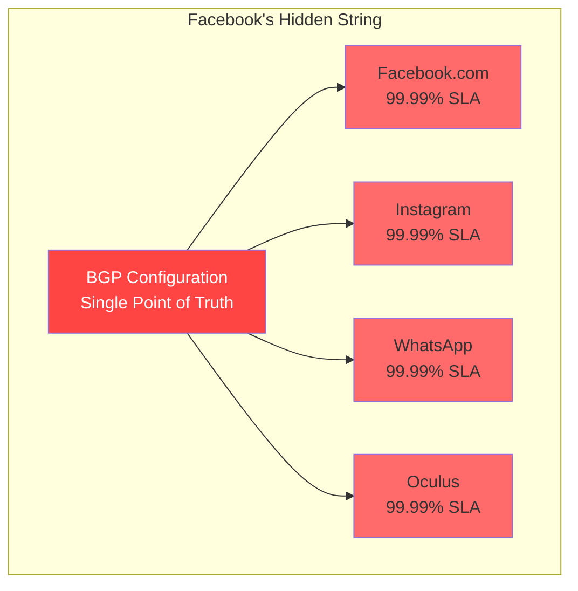
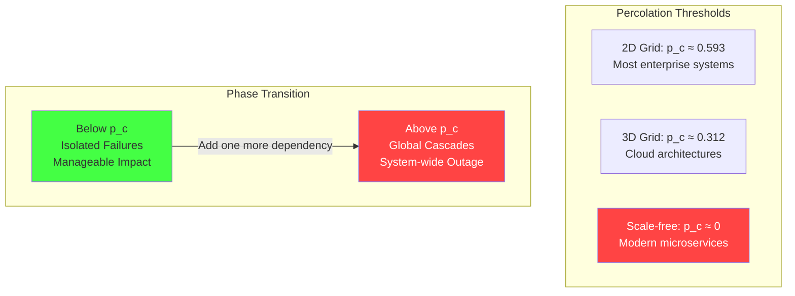
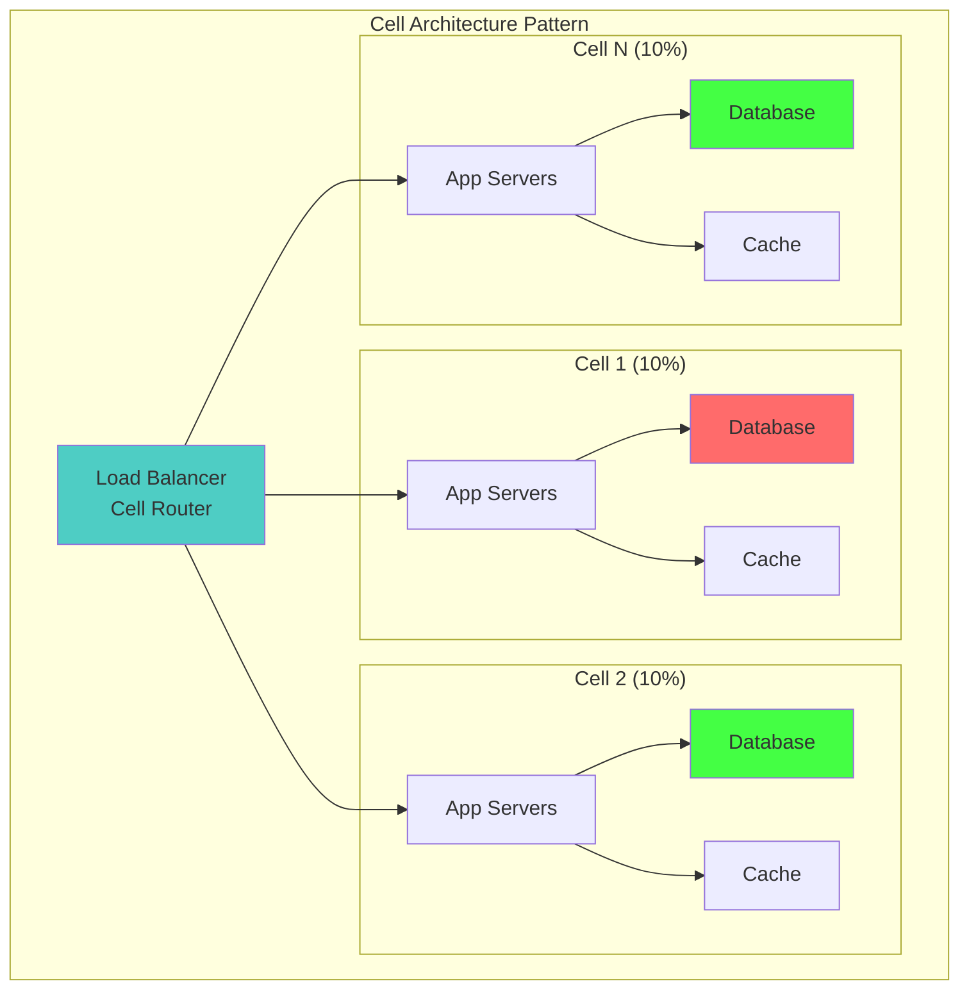

# Law 1: The Law of Inevitable and Correlated Failure
*Structured Learning Path: The Apex Learner's Protocol*

## 🧠 Learning Architecture Overview

**Core Truth**: In distributed systems, component failures are never truly independent - they cluster, cascade, and correlate in ways that multiply risk exponentially.

### 8 Minimum Learnable Units (MLUs):
1. **Independence vs Correlation** - The mathematical foundation
2. **Shared Dependencies** - The hidden strings that connect failures  
3. **Blast Radius Calculation** - Quantifying spatial impact
4. **Percolation Theory** - When isolated failures become cascades
5. **Cell Architecture** - The island model defense
6. **Bulkhead Pattern** - Internal watertight compartments
7. **Correlation Matrices** - Mathematical measurement tools
8. **Gray Failure Detection** - The stealth degradation specter

---

## 🚀 Focus Block 1: "The Domino Illusion" (15 min)
*MLU-1: Understanding Independence vs Correlation*

### Priming Question
**Stop and think**: In probability theory, what does "independent" actually mean? Write down your definition before reading further.

### The Core Deception

Like dominoes in a factory, we arrange our systems for independence, but hidden coupling means one stumble topples entire production lines.

```mermaid
graph TB
    subgraph "The Independence Illusion"
        I1[What We Assume<br/>P(A ∩ B) = P(A) × P(B)]
        R1[What Actually Happens<br/>P(A ∩ B) = P(A) × P(B|A)]
        
        I2[P(both fail) = 0.001²<br/>= 10⁻⁶ (one in million)]
        R2[P(both fail) = 0.001 × 0.9<br/>= 9×10⁻⁴ (900× higher)]
        
        I1 --> I2
        R1 --> R2
        
        style I2 fill:#4ecdc4
        style R2 fill:#ff6b6b
    end
```

### The Mathematical Foundation

**Correlation coefficient (ρ)** measures how failures cluster:
- ρ = 0: Perfect independence (theoretical)
- ρ = 1: Perfect correlation (disaster)
- ρ = 0.6-0.95: Reality in production systems

**Implementation**: Correlation probability calculator using historical failure data and disaster multiplier calculation to reveal the gap between assumed independence and correlated reality.

**Output**: You're 900x more screwed than you think.

### Neural Bridge: The Domino Factory

Imagine a domino factory where workers think they're setting up independent displays, but underground cables secretly connect everything. When one display falls, the cables yank others down. **Your "99.9% reliable" systems become 10% reliable the moment correlation exceeds 0.9.**

### Foreshadowing Hook
"But what are these underground cables in our systems? That's what we'll discover next..."

---

## 🔄 Consolidation Prompt 1 (5-10 min)
**PAUSE HERE.** Step away from the screen. Let your brain process how failures connect.

Walk around. Let the domino metaphor sink in. When you return, you'll explore the hidden strings that create correlation.

---

## 🧩 Retrieval Gauntlet 1

**Tier 1 (Recall)**: Define correlation in your own words without looking back.

**Tier 2 (Application)**: Given 3 services sharing a database, each with 99.9% availability, and correlation coefficient 0.8, calculate the real system availability.

**Tier 3 (Creation)**: Design a simple example of correlated failure in your current system. What's the "underground cable"?

---

## 🔗 Focus Block 2: "The Hidden Strings" (18 min)  
*MLU-2: Shared Dependencies Concept*

### Priming: Real-World Catastrophe

**Facebook BGP Outage (October 4, 2021)**: A single BGP configuration update took down Facebook, Instagram, WhatsApp, and Oculus simultaneously for 6 hours. **Cost: $60 million per hour.**

The shared dependency? BGP route announcements - the "underground cable" that connected everything.



### Types of Shared Dependencies

| Dependency Type | Correlation Level | Example | Detection Signal |
|----------------|-------------------|---------|------------------|
| **Infrastructure** | ρ = 0.95 | Same rack/datacenter | Geographic failure patterns |
| **Network** | ρ = 0.89 | BGP, DNS | Simultaneous connectivity loss |
| **Software** | ρ = 0.87 | Shared libraries, OS | Version-specific failures |
| **Configuration** | ρ = 0.78 | Config management | Deployment-triggered failures |
| **Human** | ρ = 0.65 | On-call engineer | Time-of-day failure patterns |

### Production Reality Check

**Implementation**: Shared dependency analyzer mapping correlation coefficients for infrastructure types (rack: 0.95, AZ: 0.45, region: 0.23, shared library: 0.87, config: 0.78) with blast radius calculation and economic impact assessment. Includes mitigation priority scoring based on correlation thresholds.

### Emotional Relevance Prompt

**Personal Reflection**: Describe a time when a single failure cascaded through your system. What was the shared dependency you didn't see coming?

### Neural Bridge to Next Concept

"Now we know failures correlate through shared dependencies. But when they fail, how far does the damage spread? That's blast radius..."

---

## 💥 Focus Block 3: "Measuring the Explosion" (16 min)
*MLU-3: Blast Radius Calculation & MLU-4: Percolation Theory Basics*

### Priming: The Critical Question

**If this component dies, who cries?** Every failure has a blast radius - the percentage of users affected.

### Blast Radius Mathematics

**Implementation**: Blast radius calculator with cell sizing for business continuity (max 10% impact per cell, 10,000 user cap), calculating percentage impact, affected user count, revenue impact ($1M per 1% of users), and business continuity assessment with threshold-based classification.

### Percolation Theory: The Phase Transition

**Critical Insight**: Systems undergo phase transitions. Below threshold p_c, failures stay isolated. Above it, they cascade globally.



**The Terrifying Truth**: Modern microservice architectures are scale-free networks with p_c ≈ 0. **Any failure can potentially cascade globally.**

### Business Reality Mapping

| Blast Radius | Business Impact | Example |
|-------------|----------------|---------|
| < 5% | Service degradation | Single cell failure |
| 5-25% | Revenue impact | Multi-cell failure |  
| 25-50% | Business at risk | Regional outage |
| > 50% | Existential threat | Global cascade |

### Interleaving Connection
*Spiral back to MLU-1*: Remember our correlation coefficient? When ρ > 0.8 and failures exceed percolation threshold, blast radius approaches 100%.

---

## 🔄 Consolidation Prompt 2 (5-10 min)
**PAUSE HERE.** Walk away and contemplate: "What's my system's percolation threshold?"

Think about your architecture. Are you below or above the critical threshold?

---

## 🧩 Retrieval Gauntlet 2

**Tier 1 (Recall)**: What's the difference between blast radius and percolation threshold?

**Tier 2 (Application)**: Your system has 100,000 users in 20 cells. If 3 cells fail, what's the blast radius? Is business continuity maintained?

**Tier 3 (Creation)**: Design a cell architecture for your current system that limits blast radius to 10%. How many cells do you need?

---

## 🏝️ Focus Block 4: "Building Islands of Safety" (20 min)
*MLU-5: Cell Architecture Pattern & MLU-6: Bulkhead Pattern*

### Priming: The Island Metaphor

**How do you survive a pandemic?** Islands. Isolated populations can't infect each other. The same principle applies to system failures.

### Cell-Based Architecture: The Island Model



**Key Principle**: Cell failure correlates at ρ ≈ 0.1, not ρ ≈ 0.9.

### Production Implementation

**Implementation**: Cell architecture with deterministic user routing using SHA256 hashing for consistent cell assignment, independent cell components (app servers, database, cache), failover logic for dead cells, and business impact assessment with tiered severity levels (Minimal <10%, Moderate <25%, Severe <50%, Catastrophic >50%).

### Bulkheads: Internal Watertight Doors

Inspired by ship design - if one compartment floods, others remain safe.

**Implementation**: Bulkhead pattern with separate resource pools for request types (critical users: 50 threads, regular users: 100 threads, batch jobs: 20 threads, monitoring: 10 threads), resource allocation with strict isolation, utilization tracking with health status thresholds (Healthy <80%, Stressed <95%, Exhausted >95%), ensuring critical services remain available during resource exhaustion.

### Adult Learner Bridge: Enterprise Risk Management

This connects directly to your business continuity planning:
- **Cell architecture** = Geographic disaster recovery
- **Bulkheads** = Departmental budget isolation
- **Blast radius** = Market segment impact analysis

### Neural Bridge Forward

"We've built islands and watertight compartments. But how do we measure if they're working? That's where correlation matrices come in..."

---

## 📊 Focus Block 5: "Mathematical Measurement" (17 min)
*MLU-7: Correlation Matrices & MLU-8: Gray Failure Detection*

### Priming: The Hidden Measurement Problem

**Question**: Your dashboards show green, but users are screaming. What's the correlation between your health checks and user experience?

### Correlation Matrix Analysis

**Implementation**: Correlation matrix analyzer using Pearson correlation coefficients with dangerous (>0.7) and critical (>0.9) thresholds, risk assessment with blast radius estimation, automated recommendation generation (cell architecture for critical correlations, service mesh for high density, shared dependency analysis for near-perfect correlation), and correlation matrix visualization.

### Gray Failure Detection: The Stealth Specter

**The Problem**: Health checks say "green" but users experience failures.

**Implementation**: Gray failure detector comparing health check correlation with user experience using configurable thresholds (healthy latency: 100ms, user tolerance: 3000ms), calculating perception gap between internal health metrics and actual user success rates, severity classification (Critical: correlation <0.5 + gap >20%, High: correlation <0.7 + gap >10%, Moderate: correlation <0.8 + gap >5%), and automated action recommendations.

### Emotional Relevance Prompt

**Your Nightmare Scenario**: Describe your worst gray failure experience. When did dashboards lie to you during a critical incident?

---

## 🔄 Final Consolidation Prompt (10 min)
**MASTER PAUSE.** You've absorbed 8 MLUs. Step away completely. 

Let your brain consolidate: correlation coefficients, blast radius, cell architecture, gray failures. When you return, test your mastery.

---

## 🧩 Final Retrieval Gauntlet

**Tier 1 (Recall)**: List the 5 correlation failure patterns and their detection signals.

**Tier 2 (Application)**: Your system shows correlation coefficient 0.85 between payment and inventory services. They share a database. Calculate the blast radius if the database fails, and design a mitigation strategy.

**Tier 3 (Creation)**: Design a complete correlation monitoring dashboard for your production system. What metrics would you track? What alerts would you set?

**Tier 4 (Synthesis)**: Connect this law to asynchronous reality. How does async processing change correlation patterns?

---

## 🎯 Spaced Repetition Triggers

Schedule these reviews in your calendar:

### Day 1 Review Questions:
- What's the difference between P(A) × P(B) and P(A∩B)?
- When does correlation become dangerous?

### Day 3 Review Questions:  
- Name three types of shared dependencies
- How do you calculate blast radius?

### Day 7 Review Questions:
- How does cell architecture reduce correlation?
- What's the percolation threshold for scale-free networks?

### Day 21 Review Questions:
- Design a bulkhead pattern for your current system
- How would you detect gray failures in production?

---

## 💼 Adult Learner Enterprise Bridges

### Business Continuity Planning Connection
- **Correlation analysis** = Risk assessment matrix
- **Blast radius** = Market impact analysis  
- **Cell architecture** = Geographic disaster recovery
- **Gray failure detection** = Key performance indicator validation

### ROI Calculation Framework
**Implementation**: ROI calculator for correlation reduction using failure multiplier model (1 + correlation × 10), annual cost calculation from outage frequency and hourly costs, payback period analysis with recommendation thresholds (Invest: <2 years, Evaluate: <5 years, Defer: >5 years).

---

## 🔧 Production Implementation Checklist

### Immediate Actions (Week 1)
- [ ] Implement correlation monitoring dashboard
- [ ] Calculate current correlation coefficients between critical services
- [ ] Identify top 3 shared dependencies creating correlation
- [ ] Set up gray failure detection for critical user journeys

### Short-term (Month 1)  
- [ ] Design cell architecture for highest-risk service cluster
- [ ] Implement bulkheads in resource-constrained services
- [ ] Create correlation alerts with appropriate thresholds
- [ ] Run correlation impact simulation

### Long-term (Quarter 1)
- [ ] Deploy cell-based architecture for critical services
- [ ] Implement shuffle sharding for user-facing APIs
- [ ] Establish correlation governance process
- [ ] Train teams on correlation failure patterns

---

## 🧠 Memory Palace Anchors

**The Domino Factory**: Independence illusion - dominoes look separate but cables connect them.

**The Island Chain**: Cell architecture - if one island gets plague, others survive.

**The Ship's Bulkheads**: Internal compartments - flooding one doesn't sink the ship.

**The Lying Dashboard**: Gray failures - green lights but screaming users.

**The Phase Transition**: Percolation threshold - adding one dependency creates global cascade.

---

## ⚡ Emergency Reference Card

### During an Incident

**30-Second Action Plan:**
1. **Check Correlation Heat Map** - Which services failing together?
2. **Identify the Specter** - Blast/Cascade/Gray/Metastable/Common-Cause?
3. **Apply Counter-Pattern** - Cells/Bulkheads/Shuffle-Sharding/Load-Shed
4. **Measure Blast Radius** - What % of users affected?

### Key Formulas
```
Correlation: ρ = Cov(X,Y) / (σ_X × σ_Y)
Real Availability: min(components) × (1 - max_correlation)
Blast Radius: failed_cells / total_cells × 100
Cascade Risk: 1 - e^(-λt)
```

### Correlation Thresholds
- **ρ < 0.3**: ✅ Safe operation
- **0.3 ≤ ρ < 0.7**: ⚠️ Monitor closely
- **ρ ≥ 0.7**: 🚨 Critical risk - immediate action required

---

## 🔗 Integration with Other Laws

**Connection to Asynchronous Reality**: Async processing changes correlation patterns - message queues can amplify or dampen correlations depending on design.

**Connection to Economic Reality**: High correlation multiplies outage costs exponentially - 900x higher failure probability equals 900x higher business risk.

**Connection to Emergent Chaos**: Correlation creates phase transitions where small changes trigger massive cascades.

---

*Remember: Every system has hidden correlations. The question is whether you'll find them in testing or in production at 3 AM.*

---

**Final Neural Bridge**: "You now understand that failures correlate. But how do you design systems that operate correctly even when everything is asynchronous and unreliable? That's the next law..."